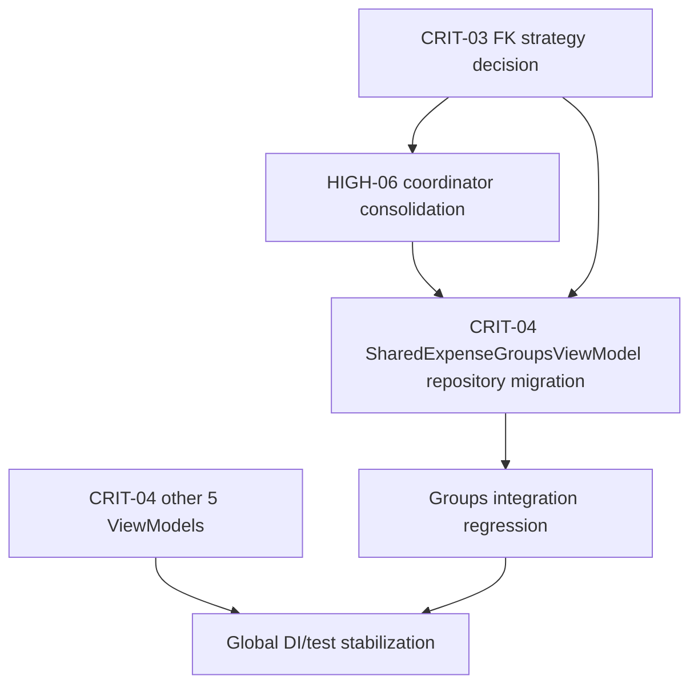

# PLAN_PHASE1_GROUP_A

## Executive Summary
This plan coordinates three interdependent architectural fixes in the Groups area plus adjacent ViewModel architecture:

- **CRIT-03**: Fix invalid FK contract in `group_expenses.paidById` (`SET NULL` on effectively non-null usage).
- **CRIT-04**: Remove direct DAO access from 6 ViewModels by introducing/adapting repository abstractions.
- **HIGH-06**: Consolidate duplicate `GroupTransactionCoordinator` implementations into a single domain-facing contract with one data implementation.

Recommended execution is **Groups-first** (CRIT-03 + HIGH-06 + SharedExpenseGroupsViewModel portion of CRIT-04), then complete remaining ViewModels. This minimizes repeated churn in the same module and reduces transaction/integrity risk.

---

## Technical Plan (Advanced)
### Scope
- **In:**
  - Room schema + migration updates for `group_expenses` foreign key semantics.
  - Consolidation of duplicate group transaction coordinators.
  - Repository-layer introduction/adaptation for:
    - `SharedExpenseGroupsViewModel`
    - `SubscriptionManagementViewModel`
    - `CurrencyManagementViewModel`
    - `ExportOptionsViewModel`
    - `ManualRecurringExpenseViewModel`
    - `ReceiptScanViewModel` (item categorization path)
  - DI rewiring and regression test updates.
- **Out:**
  - UX redesign of group/member deletion flows.
  - New features beyond architectural correction.
  - Non-related schema cleanups.

### Complexity Assessment
- **Estimated files touched:** ~24–38 (depending on repository split/interfaces).
- **Risk level:** **high** (DB migration + transactional behavior + DI graph + shared feature area).
- **Cross-module impact:** **yes** (data, domain, UI, DI, tests, Room schema artifacts).

### Batch Plan
1. **Batch name:** Decision Gate + Baseline Safety
   - **files:**
     - `app/src/main/java/com/yourname/expensetracker/data/database/entity/GroupExpense.kt`
     - `app/src/main/java/com/yourname/expensetracker/data/database/AppDatabase.kt`
     - `app/src/main/java/com/yourname/expensetracker/di/DatabaseModule.kt`
     - `app/src/androidTest/java/com/yourname/expensetracker/data/database/DatabaseMigrationTest.kt`
   - **objective:** Finalize FK strategy (recommended: `RESTRICT` + non-null payer), prepare migration scaffolding from DB v51→v52.
   - **risks:** Wrong FK choice causing runtime behavior mismatch in member deletion.
   - **validation:** Targeted migration test + schema validation + manual query checks.

2. **Batch name:** Coordinator Consolidation (HIGH-06)
   - **files:**
     - `app/src/main/java/com/yourname/expensetracker/domain/groups/GroupTransactionCoordinator.kt` (convert to contract/interface)
     - `app/src/main/java/com/yourname/expensetracker/data/database/GroupTransactionCoordinator.kt` (rename/convert to impl)
     - `app/src/main/java/com/yourname/expensetracker/domain/groups/SharedExpenseManager.kt`
     - `app/src/main/java/com/yourname/expensetracker/di/DatabaseModule.kt`
     - `app/src/test/java/com/yourname/expensetracker/data/database/GroupTransactionCoordinatorTest.kt`
   - **objective:** Single authoritative coordinator implementation, domain-facing API only.
   - **risks:** DI ambiguity/type collisions; behavior drift between old classes.
   - **validation:** Unit tests for atomic paths + compile-time import cleanup.

3. **Batch name:** Groups Repository Refactor (CRIT-04 partial + CRIT-03 touchpoint)
   - **files:**
     - `app/src/main/java/com/yourname/expensetracker/ui/screens/groups/SharedExpenseGroupsViewModel.kt`
     - `app/src/main/java/com/yourname/expensetracker/data/repository/...` (new groups repository files)
     - `app/src/main/java/com/yourname/expensetracker/di/GroupsModule.kt` (and/or new bindings module)
     - optional: `app/src/main/java/com/yourname/expensetracker/domain/logic/SplitCalculator.kt` (if nullable path chosen)
   - **objective:** Remove DAO usage from `SharedExpenseGroupsViewModel`, route all group reads/writes through repository + coordinator.
   - **risks:** Duplicate orchestration, split/balance regressions, stale UI refresh behavior.
   - **validation:** Existing group transaction tests + new repository tests + manual flow check (create/add member/add expense/delete group).

4. **Batch name:** Remaining 5 ViewModels Repository Migration (CRIT-04)
   - **files:**
     - `ui/screens/subscription/SubscriptionManagementViewModel.kt`
     - `ui/screens/currency/CurrencyManagementViewModel.kt`
     - `ui/screens/export/ExportOptionsViewModel.kt`
     - `ui/screens/recurringmanual/ManualRecurringExpenseViewModel.kt`
     - `ui/screens/receiptscan/ReceiptScanViewModel.kt`
     - new/adapted repository files under `data/repository/`
     - DI modules (`SubscriptionModule.kt`, `CurrencyModule.kt`, `ExportModule.kt`, etc. if interface bindings are introduced)
   - **objective:** complete DAO-to-repository separation for all targeted ViewModels.
   - **risks:** behavior drift for usage/price history/export formatting/item categorization updates.
   - **validation:** focused VM tests (new), stress test constructor updates, smoke runs per screen.

5. **Batch name:** Final Integration, Schemas, and Hardening
   - **files:**
     - `app/schemas/com.yourname.expensetracker.data.database.AppDatabase/52.json` (new)
     - updated tests and any broken imports/usages across modules
   - **objective:** ensure migration chain, DI graph, and coordinated feature behavior are stable.
   - **risks:** hidden downstream compile/runtime breakages.
   - **validation:** full test suite subset + migration chain + app startup smoke.

### Dependencies
- CRIT-03 FK semantics must be decided **before** repository/coordinator behavior is finalized for Groups.
- HIGH-06 coordinator consolidation should happen **before** refactoring `SharedExpenseGroupsViewModel`, otherwise churn/rework doubles.
- `ReceiptScanViewModelStressTest` constructor wiring depends on CRIT-04 changes in `ReceiptScanViewModel` dependencies.
- Room migration version bump requires synchronized updates:
  - `AppDatabase.version`
  - `MIGRATION_51_52`
  - `DatabaseModule.addMigrations(...)`
  - new schema JSON.

### Rollback / Safety
- Implement in small, mergeable batches with green tests each batch.
- Keep migration additive and transactional (table recreation with copy + constraints).
- Preserve old coordinator API temporarily via adapter/deprecation only for one batch if needed, then delete.
- If migration validation fails in QA: revert to previous schema version branch and ship without upgrade path changes.

### Acceptance Criteria
- [ ] DB v51→v52 migration succeeds and preserves all `group_expenses` rows.
- [ ] No ViewModel in scope injects DAO types directly.
- [ ] Only one `GroupTransactionCoordinator` implementation path remains active.
- [ ] Groups create/member/expense/delete flows pass regression tests.
- [ ] Updated Room schema exported and migration tests pass.

---

## Issue-by-Issue Detailed Plan

## CRIT-03: Foreign Key Contract Violation (`GroupExpense.paidById`)

### 1) Root Cause Analysis
- `GroupExpense` entity defines:
  - `paidById: Long` (non-null in Kotlin and behavior)
  - FK `onDelete = SET_NULL` to `group_members(id)`
- Historical migration drift:
  - `MIGRATION_42_43` created `paidById INTEGER` (nullable).
  - `MIGRATION_49_50` recreated `group_expenses` with `paidById INTEGER NOT NULL` **while keeping `ON DELETE SET NULL`**.
- Net effect: DB-level FK action can request `NULL` on delete, but column cannot store null; delete/update fails in edge cases.

### 2) Impact Assessment (affected files/classes)
- Must change:
  - `data/database/entity/GroupExpense.kt`
  - `data/database/AppDatabase.kt`
  - `di/DatabaseModule.kt`
  - `androidTest/.../DatabaseMigrationTest.kt`
  - `app/schemas/.../52.json` (generated)
- Likely touched due to semantics/validation:
  - `domain/groups/GroupTransactionCoordinator.kt` (or interface if consolidated)
  - `data/database/GroupTransactionCoordinator.kt` (impl)
  - `domain/groups/SharedExpenseManager.kt`
  - `ui/screens/groups/SharedExpenseGroupsViewModel.kt`
  - `domain/logic/SplitCalculator.kt` (only if nullable option selected)

### 3) Migration Strategy (ordering)
1. **Decision gate:** choose strategy.
   - **Recommended:** keep `paidById` non-null and change FK to `RESTRICT`.
   - Why: current domain/UI logic assumes known payer; nullable payer would cascade null handling across balance/split/UI.
2. Add `MIGRATION_51_52` recreating `group_expenses` with same columns but FK `ON DELETE RESTRICT`.
3. Copy all rows as-is into new table, recreate indices.
4. Bump DB version to 52 and register migration in `DatabaseModule`.
5. Export schema (`52.json`) and update migration tests.

### 4) Risk Mitigation
- **Risk:** Member deletion now blocked where previously attempted.
  - Mitigation: surface explicit domain error when deleting member with linked expenses (or require reassignment pre-delete).
- **Risk:** data copy failure during table recreation.
  - Mitigation: transaction-wrapped migration with strict column mapping and post-copy count assertions in tests.
- **Risk:** if business insists on payer deletion.
  - Mitigation fallback: nullable option (A) behind separate branch with broader model/UI updates.

### 5) Testing Strategy
- Add/extend migration tests:
  - v51→v52 migration success.
  - Preloaded group data preserved (row count + value integrity).
  - FK behavior test: deleting payer member fails with constraint (RESTRICT).
- Add repository/coordinator test for member deletion rejection path.

### 6) File-by-File Changes
- **Modify** `GroupExpense.kt` (FK action annotation).
- **Modify** `AppDatabase.kt`:
  - version 51→52
  - add `MIGRATION_51_52`
- **Modify** `DatabaseModule.kt` (`addMigrations(..., MIGRATION_51_52)`).
- **Modify** `DatabaseMigrationTest.kt` (target version updates + new dedicated test).
- **Create** `app/schemas/.../52.json`.

### 7) Execution Order
- Must precede final Groups repository/coordinator behavior sign-off.
- Can be prepared in parallel with CRIT-04 non-Groups repositories.

### 8) Rollback Plan
- Code rollback: revert v52 migration commit set and retain v51 behavior.
- Data rollback in production is non-trivial; therefore rollout via staged QA and pre-release migration verification required.

### Acceptance Criteria (CRIT-03)
- [ ] Schema and entity agree on FK action and nullability contract.
- [ ] v51→v52 migration passes with zero data loss in `group_expenses`.
- [ ] Deleting a payer member produces deterministic, handled outcome (blocked or reassigned).

### Estimated Effort
- Decision + migration implementation/testing: **1.0–1.5 days**.

---

## CRIT-04: ViewModels Bypassing Repositories (6 ViewModels)

### 1) Root Cause Analysis
- Multiple ViewModels directly inject DAOs, causing:
  - data-access details in UI layer,
  - business orchestration leakage,
  - weaker test seams and architecture drift.
- This likely happened incrementally during rapid feature additions.

### 2) Impact Assessment (affected files/classes)
- Current direct-DAO VMs:
  - `ui/screens/groups/SharedExpenseGroupsViewModel.kt`
  - `ui/screens/subscription/SubscriptionManagementViewModel.kt`
  - `ui/screens/currency/CurrencyManagementViewModel.kt`
  - `ui/screens/export/ExportOptionsViewModel.kt`
  - `ui/screens/recurringmanual/ManualRecurringExpenseViewModel.kt`
  - `ui/screens/receiptscan/ReceiptScanViewModel.kt` (for `ReceiptItemCategorizationDao`)
- Existing reusable repositories/services to adapt:
  - `data/repository/RecurringExpenseRepository.kt`
  - `data/repository/MultiCurrencyRepository.kt`
  - `data/repository/AccountingExportRepository.kt`
  - `data/repository/CategoryRepository.kt`
  - `data/repository/ReceiptRepository.kt`
  - `domain/subscription/SubscriptionManagerEngine.kt`
- Likely new files (examples):
  - `data/repository/GroupRepository.kt` (or `SharedExpenseGroupsRepository.kt`)
  - `data/repository/SubscriptionManagementRepository.kt`
  - `data/repository/CurrencyManagementRepository.kt`
  - `data/repository/ExportOptionsRepository.kt`
  - `data/repository/ReceiptItemCategorizationRepository.kt`
  - optional interfaces under `domain/...` if strict boundary is required.
- DI updates likely in:
  - `di/GroupsModule.kt`, `di/SubscriptionModule.kt`, `di/CurrencyModule.kt`, `di/ExportModule.kt`, and/or new binding module.

### 3) Migration Strategy (ordering)
1. Define repository contracts per VM use-case (read model + commands).
2. Implement/adapt data repositories using existing DAOs/services.
3. Migrate **SharedExpenseGroupsViewModel** after HIGH-06 coordinator consolidation.
4. Migrate remaining VMs independently in parallel tracks:
   - Subscription + ManualRecurring (shared recurring entities)
   - Currency + Export
   - ReceiptScan item-categorization path
5. Update DI bindings.
6. Update tests and constructors (notably `ReceiptScanViewModelStressTest`).

### 4) Risk Mitigation
- **Risk:** behavior drift from moved logic.
  - Mitigation: keep method signatures/flow semantics stable; move logic verbatim first, refactor second.
- **Risk:** over-fragmented repositories.
  - Mitigation: one repository per feature slice, not per DAO.
- **Risk:** Hilt graph breakage.
  - Mitigation: compile after each VM migration; avoid big-bang DI changes.

### 5) Testing Strategy
- Add unit tests for each new repository (success + error paths).
- VM tests:
  - add new tests for migrated VMs (currently mostly missing except ReceiptScan stress suite).
  - update `ReceiptScanViewModelStressTest` mocks for new repository dependency.
- Regression smoke for each screen:
  - Groups, Subscription, Currency, Export, Recurring Manual, Receipt Scan.

### 6) File-by-File Changes
- **Modify (all six VMs):** constructor dependencies from DAO → repository.
- **Create/Modify repositories:** under `data/repository/` as listed above.
- **Modify DI modules:** provide/bind repositories/interfaces.
- **Modify tests:** VM tests and stress test wiring.

### 7) Execution Order
- Groups VM migration depends on CRIT-03 decision + HIGH-06 coordinator consolidation.
- Other 5 VMs can proceed in parallel after repository contracts are agreed.

### 8) Rollback Plan
- Per-VM rollback possible by reverting each migration commit independently.
- Keep old DAO paths only during local transition branch; remove before final merge.

### Acceptance Criteria (CRIT-04)
- [ ] None of the 6 target ViewModels inject DAO types.
- [ ] All data operations route through repositories/services.
- [ ] DI graph resolves without manual factory hacks.
- [ ] Existing user-facing flows remain behaviorally equivalent.

### Estimated Effort
- Repository extraction + VM migration + tests: **3.0–4.5 days**.

---

## HIGH-06: Duplicate `GroupTransactionCoordinator`

### 1) Root Cause Analysis
- Two classes with same conceptual name exist in different packages:
  - `domain/groups/GroupTransactionCoordinator.kt`
  - `data/database/GroupTransactionCoordinator.kt`
- They overlap responsibilities and are imported inconsistently:
  - `SharedExpenseGroupsViewModel` uses domain version.
  - `SharedExpenseManager` uses data/database version.
  - `DatabaseModule` currently provides data/database version.
- This creates orchestration split and maintenance ambiguity.

### 2) Impact Assessment (affected files/classes)
- Must change:
  - `domain/groups/GroupTransactionCoordinator.kt`
  - `data/database/GroupTransactionCoordinator.kt`
  - `domain/groups/SharedExpenseManager.kt`
  - `ui/screens/groups/SharedExpenseGroupsViewModel.kt`
  - `di/DatabaseModule.kt`
  - `test/.../GroupTransactionCoordinatorTest.kt`
- Potentially touch related result models (`GroupCreationResult`, `GroupExpenseCreationResult`) depending on where they are hosted.

### 3) Migration Strategy (ordering)
1. Define **single domain contract** (interface) in `domain/groups`.
2. Convert one implementation class in `data/database` (rename to explicit impl, e.g., `RoomGroupTransactionCoordinator`).
3. Bind interface→implementation in DI.
4. Update all consumers/imports.
5. Remove redundant class logic and dead APIs.

### 4) Risk Mitigation
- **Risk:** method signature mismatch across existing consumers.
  - Mitigation: temporary adapter layer for one batch.
- **Risk:** transaction semantics altered.
  - Mitigation: preserve `withTransaction` for multi-DAO operations; keep existing tests green before deleting duplicate paths.

### 5) Testing Strategy
- Update/extend `GroupTransactionCoordinatorTest` to target interface behavior via impl.
- Add tests for:
  - create group + members atomicity,
  - add expense with link atomicity,
  - group delete behavior.

### 6) File-by-File Changes
- **Modify** domain coordinator file (contract only, or contract + result types).
- **Modify/Rename** data coordinator as sole implementation.
- **Modify** `SharedExpenseManager.kt` and `SharedExpenseGroupsViewModel.kt` imports/usages.
- **Modify** `DatabaseModule.kt` provider/binding.
- **Modify** coordinator tests.
- **Delete** obsolete duplicate class file once all references removed.

### 7) Execution Order
- Should be completed **before** Groups repository refactor in CRIT-04 to avoid double migration in same VM.

### 8) Rollback Plan
- Revert consolidation commit and re-enable previous providers/imports.
- Keep result type definitions stable to simplify rollback.

### Acceptance Criteria (HIGH-06)
- [ ] Only one coordinator implementation is active.
- [ ] All group transaction orchestrations flow through the same contract.
- [ ] No ambiguous imports between domain/data coordinators remain.

### Estimated Effort
- Consolidation + DI + tests: **1.0–1.5 days**.

---

## Cross-Issue Dependency Graph

---

## Execution Timeline (with parallelization)

### Phase 1 (Day 1)
- FK decision + migration design (CRIT-03).
- Start coordinator contract design (HIGH-06).

### Phase 2 (Day 2)
- Implement coordinator consolidation and DI wiring.
- Implement `MIGRATION_51_52` + migration tests.

### Phase 3 (Day 3)
- Migrate `SharedExpenseGroupsViewModel` to repository + consolidated coordinator.
- Run groups regression checks.

### Phase 4 (Days 4–5, parallel tracks)
- Track A: Subscription + ManualRecurring VM migrations.
- Track B: Currency + Export VM migrations.
- Track C: ReceiptScan item-categorization repository extraction + stress test update.

### Phase 5 (Day 6)
- Integration hardening: schemas, migration chain, DI sanity, full targeted test run.

---

## Risk Register

| ID | Risk | Probability | Impact | Mitigation | Owner |
|---|---|---|---|---|---|
| R1 | FK strategy mismatches product behavior for member deletion | Medium | High | Decision gate with product/UX; explicit error handling | Feature lead |
| R2 | Migration data loss/corruption in `group_expenses` recreation | Low | High | Transactional migration + count/value assertions | Data layer owner |
| R3 | Hilt graph breaks after repository refactor | Medium | Medium | Incremental per-VM migration and compile checks | Android engineer |
| R4 | Coordinator consolidation changes transaction semantics | Medium | High | Preserve existing tests; add atomicity assertions | Domain owner |
| R5 | Hidden regressions due to missing VM tests | High | Medium | Add focused tests during migration, not after | QA + dev |

---

## Assumptions & Unknowns
- **Assumption:** `paidById` is logically mandatory for all group expenses.
- **Assumption:** blocking member deletion with linked expenses is acceptable UX for Phase 1.
- **Unknown:** whether any production data already violates payer-membership consistency.
- **Unknown:** expected policy for reassigning payer on member removal (future enhancement).

---

## Completion Criteria (Phase 1 Group A)
- [ ] CRIT-03 accepted and merged with migration to DB v52 and passing migration tests.
- [ ] HIGH-06 accepted with a single coordinator contract + implementation and no duplicate class ambiguity.
- [ ] CRIT-04 accepted for all 6 ViewModels (no direct DAO injections).
- [ ] Group feature end-to-end smoke: create group, add member, add expense, view balances, archive/delete group.
- [ ] CI passes with updated schema artifact and targeted tests.
