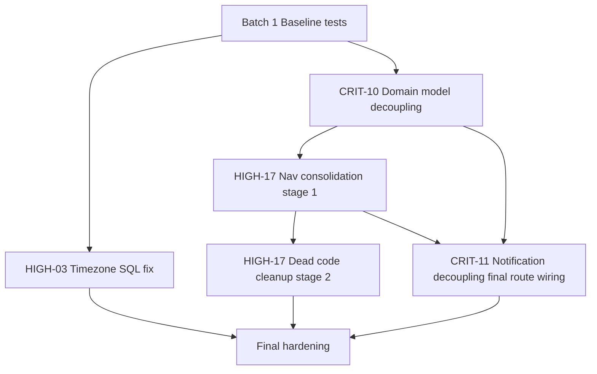

## Executive Summary

This plan addresses four architectural defects found in the current codebase (CRIT-10, CRIT-11, HIGH-03, HIGH-17), with explicit sequencing to avoid breaking production behavior while untangling layer boundaries and navigation coupling.

Key strategy:
- **First, decouple domain from UI models** (CRIT-10) by introducing domain-safe DTOs + boundary mappers.
- **Then, unify navigation contracts** (HIGH-17) so deep links, recommendation flows, and assistant drill-down all use one route model.
- **In parallel, decouple notification service from MainActivity** (CRIT-11) using intent actions/deep links + manifest intent filter hardening.
- **Separately standardize time aggregation semantics** (HIGH-03) to remove UTC/local drift in SQL groupings and align with UI/business expectations.

---

## Technical Plan (Advanced)
### Scope
- In:
  - CRIT-10: Remove domain imports of `ui.components.BlockStatus`, `ui.components.DayBudgetStatus`, `ui.screens.transactions.TransactionFilter`.
  - CRIT-11: Remove `MainActivity` import from `AndroidNotificationService` and make notification click routing UI-agnostic from data layer.
  - HIGH-03: Fix SQL day/week/month grouping timezone mismatch in `ExpenseDao` and dependent aggregation behavior.
  - HIGH-17: Consolidate mixed navigation patterns (sealed destination + overlay booleans + callback-only) into a single coherent path for all screens currently in scope.
- Out:
  - Replacing the app with Navigation Compose graph.
  - Rewriting all feature screens to route strings.
  - Full time model rewrite across all historical data logic beyond listed DAO aggregations.

### Complexity Assessment
- Estimated files touched: **28-40**
- Risk level: **high**
- Cross-module impact: **yes**

### Batch Plan
1. Batch name: Baseline + contract inventory lock
   - files: 
     - `app/src/main/java/com/yourname/expensetracker/domain/usecase/dashboard/ComputeDashboardWidgetsUseCase.kt`
     - `app/src/main/java/com/yourname/expensetracker/domain/engine/DashboardFollowThroughEngine.kt`
     - `app/src/main/java/com/yourname/expensetracker/domain/ai/usecase/MapFinancialQueryToNavigationUseCase.kt`
     - `app/src/main/java/com/yourname/expensetracker/service/TransactionFilterSerializer.kt`
     - `app/src/main/java/com/yourname/expensetracker/service/NavigationTargetResolver.kt`
     - `app/src/test/...` impacted tests
   - objective: Freeze current behavior with characterization tests before refactor.
   - risks: Existing tests have brittle assumptions (e.g., static threshold comments, old week key shape).
   - validation: Green unit test baseline for serializer/resolver/engine/use-case with no behavioral deltas yet.

2. Batch name: CRIT-10 domain model extraction + mappers
   - files:
     - **Create** `domain/model/dashboard/DomainBlockStatus.kt`
     - **Create** `domain/model/dashboard/DomainDayBudgetStatus.kt`
     - **Create** `domain/model/navigation/DomainTransactionFilter.kt`
     - **Create** `ui/mappers/DashboardWidgetUiMapper.kt`
     - **Create** `ui/mappers/TransactionFilterUiMapper.kt`
     - **Modify** `ComputeDashboardWidgetsUseCase.kt`
     - **Modify** `DashboardFollowThroughEngine.kt`
     - **Modify** `MapFinancialQueryToNavigationUseCase.kt`
     - **Modify** `TransactionFilterSerializer.kt` (or split serializer by layer)
   - objective: Remove all domain→UI imports; keep semantic parity through mapping at UI boundary.
   - risks: Hidden coupling via `NavigationAction`/serializer signatures can reintroduce UI type leakage.
   - validation: Grep check: no `import ...ui...` in `domain/**`; all tests updated and passing.

3. Batch name: HIGH-17 navigation contract consolidation (non-destructive)
   - files:
     - **Create** `ui/navigation/AppRoute.kt` (single route contract)
     - **Create** `ui/navigation/AppNavigator.kt` (state + events)
     - **Modify** `NavigationDestination.kt`
     - **Modify** `NavigationController.kt`
     - **Modify** `MainActivity.kt`
     - **Modify** `MainViewModel.kt`
     - **Modify** `HomeScreen.kt`
     - **Modify** `AssistantSheet.kt`
   - objective: Introduce unified navigation API while preserving behavior through adapter layer.
   - risks: Double-navigation, stale overlay state, broken back stack semantics.
   - validation: manual smoke matrix (tabs, overlays, feature menu, recommendation click, assistant drill-down).

4. Batch name: HIGH-17 dead destination cleanup + overlay migration
   - files:
     - **Modify/Delete as needed** `NavigationDestination.kt` entries (`AddExpense`, `ScanReceipt`, `Review`, `BudgetForecasting`)
     - **Modify** `MainActivity.kt` to route overlays through unified nav path
     - **Modify** `FeatureConfig.kt` / docs/comments referencing obsolete flows
   - objective: Remove unused sealed entries or fully wire them; no mixed patterns left.
   - risks: Losing currently reachable overlays if route mapping incomplete.
   - validation: route coverage checklist maps every rendered screen to one route.

5. Batch name: CRIT-11 notification click decoupling
   - files:
     - **Modify** `data/service/AndroidNotificationService.kt`
     - **Create** `receiver/NotificationActionReceiver.kt` (if BroadcastReceiver design chosen)
     - **Modify** `AndroidManifest.xml` (intent filter/receiver registration/deep link)
     - **Modify** `ui/MainActivity.kt` intent handling if route keys/actions changed
   - objective: Remove direct `MainActivity` dependency from data layer.
   - risks: PendingIntent mutability/flags regressions; deep link not resolved; notification opens wrong tab.
   - validation: instrumentation/manual tests for budget alert and AI briefing taps from killed/backgrounded app states.

6. Batch name: HIGH-03 timezone-safe SQL aggregation
   - files:
     - **Modify** `data/database/dao/ExpenseDao.kt` (lines around 411, 478, 660, 677, 694, 719)
     - **Modify** `data/repository/ExpenseRepository.kt` (signature updates if timezone offset introduced)
     - **Modify** `domain/analytics/TotalsAggregationEngine.kt` (period key handling/week parsing assumptions)
     - **Modify** tests: `ExpenseDaoTest.kt`, `TotalsAggregationEngineTest.kt`
     - **Create/Update** DAO timezone boundary tests (instrumented)
   - objective: Ensure day/week/month bins match intended local-time semantics and UI period expectations.
   - risks: week-number format drift, historical chart key incompatibility, off-by-one at midnight.
   - validation: deterministic boundary fixtures around DST + midnight crossings; compare expected local bins.

7. Batch name: Hardening + cleanup
   - files:
     - all touched tests and lint/static checks
   - objective: Remove temporary adapters, ensure architecture constraints, finalize docs/changelog.
   - risks: lingering deprecated adapter types and silent contract drift.
   - validation: final grep architecture gate + full test suite subset for affected modules.

### Dependencies
- CRIT-10 must start before/highly coordinated with HIGH-17 because `TransactionFilter` currently bridges assistant/recommendation/navigation flows.
- HIGH-17 and CRIT-11 must align on deep link/action schema so notification taps route via the new unified navigation contract.
- HIGH-03 is technically independent and can run in parallel after baseline tests are in place.

### Rollback / Safety
- Keep each issue in separate PR/branch or at least separate commits per batch.
- Preserve temporary compatibility adapters for one batch before deletion.
- Add feature flags for navigation route switch if release risk is high.
- If regressions occur:
  - Revert batch commit(s) only for affected issue.
  - Retain characterization tests to verify pre-refactor behavior is restored.

### Acceptance Criteria
- [ ] No domain package imports any UI package.
- [ ] Notification service no longer imports `MainActivity`.
- [ ] Daily/weekly/monthly SQL aggregation matches documented local-time behavior at boundaries.
- [ ] Only one navigation architecture pattern remains for in-scope flows.
- [ ] All impacted tests pass; new boundary tests cover midnight/DST and deep-link notifications.

---

## Per-Issue Detailed Plans

## CRIT-10: Domain Layer Imports UI Types

### 1) Root Cause Analysis
- Domain classes currently construct UI DTOs directly:
  - `ComputeDashboardWidgetsUseCase` imports `BlockStatus` and `DayBudgetStatus` from `ui.components`.
  - `DashboardFollowThroughEngine` imports `ui.screens.transactions.TransactionFilter`.
  - `MapFinancialQueryToNavigationUseCase` returns UI `TransactionFilter`.
- This likely happened due to incremental feature delivery where UI model reuse was convenient, but boundaries were not enforced.

### 2) Impact Assessment (full scope)
- Direct files:
  - `domain/usecase/dashboard/ComputeDashboardWidgetsUseCase.kt`
  - `domain/engine/DashboardFollowThroughEngine.kt`
  - `domain/ai/usecase/MapFinancialQueryToNavigationUseCase.kt`
- Downstream contracts:
  - `service/TransactionFilterSerializer.kt`
  - `service/NavigationTargetResolver.kt`
  - `ui/screens/home/HomeViewModel.kt`
  - `ui/screens/assistant/AssistantViewModel.kt`
  - `ui/screens/assistant/AssistantSheet.kt`
  - `ui/MainViewModel.kt`
  - `ui/MainActivity.kt`
  - `ui/screens/home/HomeScreen.kt`
- Tests:
  - `DashboardFollowThroughEngineTest.kt`
  - `MapFinancialQueryToNavigationUseCaseTest.kt`
  - `NavigationTargetResolverTest.kt`
  - `TransactionFilterSerializerTest.kt`
  - Recommendation/navigation tests under `ui/screens/home`

### 3) Migration Strategy (ordered)
1. Define domain equivalents for filter + block-party day status.
2. Switch domain use cases/engines to domain models only.
3. Introduce mapper(s) in UI/service boundary to convert domain filter/status -> UI filter/status.
4. Move serialization to domain-safe filter contract (or add adapter serializer layer).
5. Update consumers incrementally via adapter to avoid big-bang breakage.
6. Remove old imports and enforce with architecture grep/check.

### 4) Risk Mitigation
- Keep field names/semantics identical during first migration pass.
- Add round-trip tests for both filter model and mapper equivalence.
- Introduce temporary conversion helpers; remove once all callers migrated.

### 5) Testing Strategy
- Unit:
  - Domain filter mapper tests (null/default/full payload).
  - Serializer tests against domain filter.
  - Engine/use-case tests to assert output parity.
- Architecture:
  - Build-time grep/assertion: `domain/**` must not import `ui/**`.

### 6) File-by-File Changes
- Create domain model files for filter and dashboard day status.
- Create UI mapper files.
- Modify three violating domain files.
- Modify serializer/resolver + call sites.
- Update impacted tests.

### 7) Execution Order
- Must happen before final HIGH-17 consolidation.
- Can run in parallel with HIGH-03 after domain contracts are settled.

### 8) Rollback Plan
- Revert mapper + domain model introduction commit and restore previous serializer signature.
- Keep tests from Batch 1 to detect accidental behavior drift.

### Acceptance Criteria (CRIT-10)
- [ ] `grep "import com.yourname.expensetracker.ui" app/src/main/java/com/yourname/expensetracker/domain` returns no matches.
- [ ] Dashboard block-party UI renders unchanged for existing data.
- [ ] Recommendation/assistant drill-down filter behavior unchanged.

### Estimated Effort
- 1.5-2.5 dev days

---

## CRIT-11: Data Layer Imports UI MainActivity

### 1) Root Cause Analysis
- `AndroidNotificationService` directly references `MainActivity` in two intents (`mainActivityIntent`, AI briefing intent).
- Data layer owns notification dispatch but also controls UI launch class, violating separation and testability.

### 2) Impact Assessment
- Primary:
  - `data/service/AndroidNotificationService.kt`
  - `AndroidManifest.xml`
  - `ui/MainActivity.kt` (intent parsing alignment)
- Optional new artifacts:
  - `receiver/NotificationActionReceiver.kt` (if receiver pattern selected)
  - constants class for actions/deeplinks.

### 3) Migration Strategy
1. Define canonical notification action/deeplink contract constants in non-UI package.
2. Replace explicit `Intent(context, MainActivity::class.java)` with action/deeplink `PendingIntent` resolution.
3. Register receiver or manifest deep-link filter as needed.
4. Align `MainActivity.handleIntent` parsing with new action keys.
5. Verify launch behavior from all app states.

### 4) Risk Mitigation
- Use immutable/update flags carefully for API 31+.
- Use unique request codes per notification type to avoid intent payload collisions.
- Keep existing URI scheme (`expensetracker://...`) if possible for compatibility.

### 5) Testing Strategy
- Manual/instrumented:
  - Tap budget alert opens expected destination.
  - Tap AI briefing includes `briefingKey` and records diagnostics.
  - Works from cold start, background, and foreground.

### 6) File-by-File Changes
- Modify `AndroidNotificationService.kt` to remove `MainActivity` import.
- Modify `AndroidManifest.xml` for action/deeplink receiver/filter.
- Possibly create receiver and routing constants.
- Adjust `MainActivity.handleIntent` if contract evolves.

### 7) Execution Order
- Coordinate with HIGH-17 route contract finalization.
- Can begin in parallel once route constants are agreed.

### 8) Rollback Plan
- Revert to previous explicit activity PendingIntent and restore old handling path.
- Keep contract constants for future attempt if harmless.

### Acceptance Criteria (CRIT-11)
- [ ] `AndroidNotificationService.kt` has no `MainActivity` import.
- [ ] Notification click behavior preserved for both budget and AI briefing notifications.

### Estimated Effort
- 0.75-1.5 dev days

---

## HIGH-03: UTC vs Local-Time Mismatch in SQL Aggregation

### 1) Root Cause Analysis
- DAO queries group by UTC-based epoch transformations:
  - `(date / 86400000)` day grouping.
  - `strftime('%Y-%m', date/1000, 'unixepoch')` monthly grouping.
  - `strftime('%Y-%W', date/1000, 'unixepoch')` weekly grouping.
- UI and period utilities use local-time calendar semantics, causing day-shift near local midnight.

### 2) Impact Assessment
- Core:
  - `data/database/dao/ExpenseDao.kt` (lines around 411, 478, 660, 677, 694, 719)
  - `data/repository/ExpenseRepository.kt`
  - `domain/analytics/TotalsAggregationEngine.kt`
- Tests:
  - `ExpenseDaoTest.kt`
  - `TotalsAggregationEngineTest.kt`
  - add boundary-focused DAO integration tests (DST + midnight crossing)

### 3) Migration Strategy
1. Decide one standard (recommended: **local-time aggregation in SQL** because UI is local-period oriented).
2. Update grouping expressions to use localtime-aware SQLite transforms (or explicit offset parameterized approach, consistently).
3. Normalize week key format and parsing assumptions (`parseYearWeek`) across engine/UI.
4. Update average daily query group-by to same day key logic.
5. Add fixture tests for edge timestamps around midnight and DST transitions.

### 4) Risk Mitigation
- Freeze key format contract before changing (`YYYY-MM` / week key style).
- Validate no regression in chart sorting and drill-down key parsing.
- Include timezone-specific tests (e.g., Europe/Athens) in instrumented suite.

### 5) Testing Strategy
- Integration DAO tests with fixed timestamps:
  - 23:30 local / 00:30 local boundary cases.
  - DST jump and fallback days.
- Unit tests for `TotalsAggregationEngine` period key expectations.
- Manual analytics spot checks against raw transactions.

### 6) File-by-File Changes
- Modify SQL in `ExpenseDao.kt` for all listed queries.
- Adjust repository signatures if offset parameter required.
- Update engine parsing/label logic where needed.
- Add/modify test files listed above.

### 7) Execution Order
- Independent from CRIT-10/CRIT-11/HIGH-17; run parallel after baseline tests.

### 8) Rollback Plan
- Revert DAO query changes and associated parser tweaks in one commit.
- Keep added tests (temporarily ignored if needed) as guardrails.

### Acceptance Criteria (HIGH-03)
- [ ] Expenses near local midnight are grouped into expected local day.
- [ ] Daily/weekly/monthly totals match UI-selected period semantics.
- [ ] No mismatch between totals and transaction list for same local date range.

### Estimated Effort
- 1.5-2.5 dev days

---

## HIGH-17: Mixed Navigation Architecture

### 1) Root Cause Analysis
- Current navigation is hybrid:
  1. `NavigationDestination` sealed class.
  2. Local overlay booleans in `MainActivity` (`showAddExpense`, `showScanReceipt`, `showRecurringExpenses`, `showAssistant`, `showBudgetForecasting`).
  3. Callback-only flows (`HomeScreen`/`AssistantSheet`/recommendation actions).
- Dead entries (`AddExpense`, `ScanReceipt`, `Review`, `BudgetForecasting`) are declared but not rendered via destination switch.

### 2) Impact Assessment
- Main routing:
  - `ui/navigation/NavigationDestination.kt`
  - `ui/navigation/NavigationController.kt`
  - `ui/MainActivity.kt`
  - `ui/MainViewModel.kt`
- Flow contributors:
  - `ui/screens/home/HomeScreen.kt`
  - `ui/screens/home/HomeViewModel.kt`
  - `service/NavigationTargetResolver.kt`
  - `ui/screens/assistant/AssistantViewModel.kt`
  - `ui/screens/assistant/AssistantSheet.kt`
  - optionally `FeatureConfig.kt` (if route changes)

### 3) Migration Strategy
1. Define single route model and navigation state owner.
2. Add compatibility bridge from existing APIs (destination/callback) to new route model.
3. Migrate overlays into route states (modal route variants or typed destinations).
4. Switch callbacks to emit route intents, not direct UI state toggles.
5. Remove dead `NavigationDestination` entries or wire fully.
6. Remove compatibility bridge once all callers migrated.

### 4) Risk Mitigation
- Keep tab index mapping stable while migrating overlays.
- Add navigation event logging during rollout.
- Use staged migration: non-destructive bridge first, cleanup second.

### 5) Testing Strategy
- UI smoke/manual:
  - Tab switching, back behavior, feature navigation, overlays.
  - Recommendation -> transactions/budget/analytics/map.
  - Assistant drill-down to transactions.
  - Notification deep link landing behavior.
- Unit:
  - navigator reducer/state transition tests (if introduced).

### 6) File-by-File Changes
- Create unified route/nav state classes.
- Modify `MainActivity` to eliminate direct boolean ownership for navigable overlays.
- Update VM and resolver flow contracts to target unified navigation type.
- Clean `NavigationDestination` dead entries.

### 7) Execution Order
- Requires CRIT-10 filter decoupling first (or tightly coupled in same PR with adapters).
- Coordinate with CRIT-11 for deep-link route integration.

### 8) Rollback Plan
- Retain previous boolean handlers behind adapter for one cycle.
- If unstable, revert route migration commit while keeping CRIT-10 model decoupling intact.

### Acceptance Criteria (HIGH-17)
- [ ] Exactly one navigation pattern used for in-scope flows.
- [ ] `NavigationDestination` contains only reachable destinations (or all declared are rendered).
- [ ] Overlay screens are represented in unified navigation contract.

### Estimated Effort
- 2-3.5 dev days

---

## Dependency Graph

---

## Execution Timeline (suggested)

- Day 1:
  - Batch 1 baseline/characterization tests.
  - Start Batch 6 (HIGH-03) in parallel.
- Day 2:
  - Batch 2 (CRIT-10) core decoupling.
  - Continue HIGH-03 tests.
- Day 3:
  - Batch 3 (HIGH-17 stage 1 adapter/unified route).
  - Batch 5 (CRIT-11) contract implementation.
- Day 4:
  - Batch 4 cleanup of dead navigation paths.
  - Batch 7 hardening, regression passes, grep gates.

---

## Risk Register

1. **Navigation regressions in overlays/back-stack**
   - Probability: Medium, Impact: High
   - Mitigation: staged adapter migration + smoke checklist.

2. **Serializer contract break for stored `filterCriteria` JSON**
   - Probability: Medium, Impact: High
   - Mitigation: backward-compatible deserializer + version key tests.

3. **Timezone fix changes historical analytics unexpectedly**
   - Probability: High, Impact: Medium
   - Mitigation: announce expected correction; verify with deterministic fixtures.

4. **Notification taps lost due to manifest/intent mismatch**
   - Probability: Medium, Impact: High
   - Mitigation: instrumentation scenarios for cold/background/foreground app states.

5. **Cross-issue merge conflicts (MainActivity heavy edits)**
   - Probability: High, Impact: Medium
   - Mitigation: sequence CRIT-10 first; isolate CRIT-11/HIGH-17 branches; rebase frequently.

---

## Assumptions & Unknowns

### Assumptions
- `TransactionFilter` JSON stored in recommendation rows must remain readable from old versions.
- UI should remain local-time oriented for all user-visible aggregations.
- In-scope “single navigation pattern” includes overlays currently controlled by booleans.

### Unknowns
- Whether product wants week-key format ISO-compliant (`%Y-%W` vs ISO week-year semantics).
- Whether to choose **BroadcastReceiver action routing** or **direct deep-link routing** for CRIT-11 (both valid).
- Whether any external analytics/export pipeline depends on current UTC bucket behavior.

---

## Completion Checklist (all issues)

- [ ] CRIT-10 complete and architecture boundary checks pass.
- [ ] CRIT-11 complete and notification click flows verified end-to-end.
- [ ] HIGH-03 complete with boundary test coverage and verified totals consistency.
- [ ] HIGH-17 complete with one navigation paradigm and no dead destination declarations.
- [ ] Final regression pass for Home, Assistant, Transactions, Analytics, and notifications.
