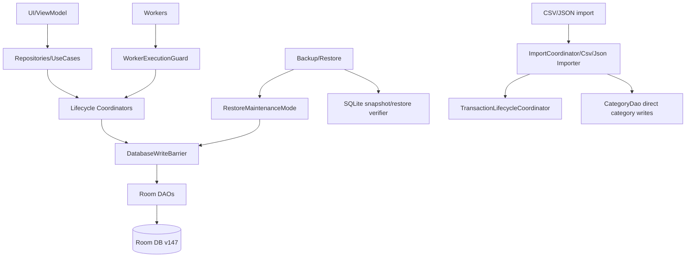

# P13 — Database Schema / Migrations / DAO Constraints Debug/Review Report

Target repository: `https://github.com/panospao7/Cost-agregator`  
Pinned commit: `83b798e849b4408b2bf683f52cb2746d37f7af16`  
Mode: **remote static review** through GitHub raw source/docs.  
Build/test status: **NOT RUN** — no local checkout, `rg`, Room schema export, or Gradle execution available.

Primary source links are listed in the source index at the end.

---

## 1. Executive verdict

Verdict: **RED**

The database layer is not production-GREEN. It has strong architectural intent — schema versioning, entity comments, DAO guard scripts, DB ownership docs, event tables, provenance tables, and many useful constraints — but the actual DB surface still has several release-blocking structural risks.

Highest-risk remaining issue:

```text
The runtime Room builder uses `DatabaseMigrations.ALL`, but that registry contains only migrations 145→146 and 146→147, while AppDatabase is version 147 and contains historical inline migrations 6→145 that are not registered through the builder.
```

This means old installed databases below v145 cannot migrate through the actual `AppDatabase.fileBuilder()` path. The code comments still discuss old migration paths and fallback behavior, but the actual builder only registers `DatabaseMigrations.ALL`.

Production safety assessment:

- **Fresh install:** likely starts, but fresh schema lacks some important DB-level guarantees that are only added by historical raw migrations, not declared in entities.
- **Upgrade from older app versions:** unsafe / likely crash or data rescue required.
- **Backup/restore table verification:** incomplete and stale versus current entity list.
- **DAO ownership:** policy exists, but allowlist and source disagree; multiple direct write surfaces remain.
- **Dedupe/idempotency constraints:** still incomplete for email receipts, recurring actual links, group expenses, bank connections, operation events, and some import/category paths.

---

## 2. Database architecture summary

Current declared DB:

```text
AppDatabase
  version = 147
  exportSchema = true
  entities = many financial/privacy/worker/provenance tables
  builder = AppDatabase.fileBuilder(context).build()
  configureBuilder = addMigrations(*ALL_MIGRATIONS)
  ALL_MIGRATIONS = DatabaseMigrations.ALL
  DatabaseMigrations.ALL = [MIGRATION_145_146, MIGRATION_146_147]
```

High-level write-ownership architecture:



Intended invariants from DB ownership docs:

1. One approved writer per table family.
2. Every write entrypoint checks `DatabaseWriteBarrier`.
3. Workers do not write DAOs directly.
4. Debug-only writes require `BuildConfig.DEBUG` plus write barrier.
5. DAO mutation outside the ownership map is a violation.

Actual status: **partial**. The docs and scripts exist, but several table families still have schema/DAO holes.

---

## 3. Files reviewed

### Production files reviewed

| File | Role | Notes |
|---|---|---|
| `AppDatabase.kt` | Room entity registry, schema version, historical inline migrations, builder | Declares version 147 and many inline migrations, but builder delegates to `DatabaseMigrations.ALL`. |
| `DatabaseMigrations.kt` | Runtime migration registry | Contains only v145→146 and v146→147. |
| `DatabaseModule.kt` | Hilt DB binding | Provides singleton DB through `AppDatabase.fileBuilder(context).build()`. |
| `Expense.kt`, `ExpenseDao.kt` | Core transaction table and DAO | Strong dedupe key, but public DAO mutation surface remains; some methods rely on app-level ownership. |
| `ScannedReceipt.kt`, `ScannedReceiptDao.kt` | Receipt table and DAO | Entity comments say fingerprint fields have no unique constraints; migration adds unique partial indexes that fresh entity does not declare. |
| `EmailReceiptSource.kt`, `EmailReceiptDao.kt` | Email receipt provenance/dedupe | Raw message ID unique; privacy-safe hash/fingerprint indexed but not unique in entity. |
| `ReceiptExpenseLink.kt` | Receipt-expense join table | Has FK cascade and unique receipt-expense pair; comments contradict actual FK declarations. |
| `RecurringOccurrence.kt`, `RecurringOccurrenceDao.kt` | Recurring occurrence/payment link table | `linkedExpenseId` indexed but not unique. |
| `RecurringReminderDelivery.kt`, `RecurringReminderDeliveryDao.kt` | Reminder delivery state machine | Has unique occurrence/window and conditional claim methods; event atomicity is outside schema. |
| `PlannedExpense.kt`, `PlannedExpenseDao.kt` | Planned rows | Has materialized open key unique constraint; many status mutators direct DAO. |
| `BankConnection.kt`, `BankConnectionDao.kt` | Bank credentials/connections | Unique only by `bankId`; no provider/account scoping. |
| `BankStatementImportItem.kt` | Bank import item ledger | No visible FK constraints; stores raw merchant. |
| `CategoryDao.kt`, `CategoryRepository.kt` | Category lifecycle and merge mutations | Repository has barrier; importers bypass repo and call DAO directly. |
| `CsvExpenseImporter.kt`, `JsonExpenseImporter.kt`, `ImportCoordinator.kt` | Import DB write path | Expenses go through transaction lifecycle, but category creation is direct DAO and no import-level barrier. |
| `GroupMember.kt`, `GroupExpense.kt` | Shared/group schema | v147 soft-delete fields create active-duplicate risks; group expense idempotency key lacks unique index. |
| `OperationRun.kt`, `OperationRunEvent.kt`, DAOs | Operation run ledger | Run correlation unique; event ID indexed but not unique. |
| `PrivacyAuditEvent.kt` | Privacy audit table | Stores JSON context; safety is app-level only. |
| `ExchangeRate.kt` | Currency rate table | Unique by pair/date only; no source/rate-basis dimension. |
| `BackupVerifier.kt` | Restore/table verification | Stale table list and optional critical tables; semantic aggregate SQL appears invalid for current schema. |
| `CostbackupBundle.kt` | Backup bundle format | Used for restore/export context. |
| `DB_WRITE_OWNERSHIP.md` | Normative DB ownership map | Strong rules but docs/source drift. |
| `DAO_ACCESS_GUARDRAILS.md` | Expense DAO policy | Expense-specific only; not enough for full DB. |
| `verify_db_access_boundaries.py` | Static DB guard | Exists, but allowlist is broad and contains placeholders/future classes. |
| `db_access_allowlist.yml` | Guard allowlist | Allows current importers/category DAO writes with `requires_write_barrier:false`. |
| `verify_event_writers.py`, `check_lifecycle_bypasses.kts` | Event/lifecycle static guards | Useful but incomplete versus found direct writes. |

### Tests reviewed

No tests were opened/executed locally. Source comments mention migration tests, but actual execution was not possible.

### Files not fully reviewed

| Area | Reason |
|---|---|
| Entire `app/schemas/**` exported Room JSON | Not browsed locally. Required to close Room validation parity. |
| Every DAO/entity file | Representative high-risk DB files were opened; full `rg` not possible. |
| Full migration history behavior | `AppDatabase.kt` is heavily minified in raw view and runtime registry supersedes inline history. |
| Full caller graph of every DAO method | Requires local `rg`/IDE. |
| All backup/import/export tests | Not run. |
| All Hilt DAO bindings | `DatabaseModule` sampled; full DI review remains P15. |

---

## 4. Architecture/doc comparison

| Area | Architecture expectation | Actual source | Status |
|---|---|---|---|
| DB schema version | Current schema version 147 with migration support | `AppDatabase.kt` declares `APP_DATABASE_SCHEMA_VERSION = 147`. | PASS |
| Migration registry | All supported migrations should be registered by builder | `AppDatabase.fileBuilder()` calls `.addMigrations(*ALL_MIGRATIONS)`, and `ALL_MIGRATIONS = DatabaseMigrations.ALL`; `DatabaseMigrations.ALL` only has 145→146 and 146→147. | **FAIL** |
| Historical migrations | Comments discuss v1–v5 destructive fallback and inline migrations 6→145 | Current builder does not call `fallbackToDestructiveMigration()` and does not register inline 6→145 migrations. | **FAIL / doc drift** |
| One write owner per table | `DB_WRITE_OWNERSHIP.md` says every table family has approved owner | Several allowlist entries are temporary or future classes; importers write categories directly. | PARTIAL |
| Every write checks barrier | DB ownership says every write entrypoint checks `DatabaseWriteBarrier` | Some import/category paths are explicitly allowlisted with `requires_write_barrier:false`; worker/direct DAO exceptions remain. | PARTIAL / FAIL |
| Workers avoid direct DAO writes | Workers should call coordinators/repositories | Some worker exceptions are allowlisted; P9 already found `NotificationIntakeWorker` not fully guarded. | PARTIAL |
| Critical events through writers | Event writer guard exists | Recurring, receipt, and operation-event direct DAO paths still need full local guard run. | PARTIAL |
| Backup table coverage | Restore verifier should know all important tables | `BackupVerifier` table list omits multiple current entities and marks some critical provenance tables optional. | **FAIL** |
| Fresh install vs migrated parity | Fresh schema and migrated schema should match | Several unique partial indexes are created by historical migrations but not declared in current entities/fresh schema. | **FAIL** |
| Import legal path | Imported expenses use transaction lifecycle | Expenses do, but import category creation uses raw `CategoryDao`; no import-level barrier/run ledger observed. | PARTIAL |

---

## 5. Entity constraint matrix

| Table/entity | Current constraints | Good | Gaps/risk |
|---|---|---|---|
| `expenses` | PK id; unique `rawNotificationId`; unique `dedupeKey`; indices for date/type/category/merchant/shared/location/business/split | Strong core dedupe protection when `dedupeKey` is non-null. | `dedupeKey` nullable; backfill/debug DAO mutators still public; ownership relies on static guard. |
| `transaction_events` | Not fully opened | Event architecture exists. | Append-only guarantee not verified locally. |
| `raw_notifications` | Unique nullable `dedupeFingerprint`; many indices | Materialized dedupe fingerprint exists. | Multiple null fingerprints allowed; new rows rely on app code to set non-null. |
| `notification_intake` | Unique `dedupeFingerprint`, status/attempt/lock fields | Strong intake idempotency. | Worker/barrier issue is caller-level, not schema. |
| `pending_reviews` | Unique nullable `rawNotificationId`; FK to raw notification/receipt | Prevents duplicate raw-notification review. | Migration 144→145 drops table without copy if ever active. |
| `scanned_receipts` | FK legacy `expenseId`; no declared unique fingerprints | Rich status/fingerprint fields. | Entity explicitly says fingerprint unique constraints are TODO; migration-only unique indexes cause fresh/migrated parity risk. |
| `receipt_expense_links` | FK to receipt/expense cascade; unique `(receiptId, expenseId)` | Good join-table dedupe. | No schema invariant syncing legacy `ScannedReceipt.expenseId` with join table. |
| `email_receipt_sources` | FK receipt; unique raw `emailMessageId`; nonunique hash/fingerprint indices | Good raw-mode message ID uniqueness. | Privacy-safe `emailMessageIdHash` / content fingerprint not unique in entity. |
| `recurring_occurrences` | Unique `occurrenceKey`; nonunique `linkedExpenseId` | Occurrence identity protected. | One actual expense can link multiple occurrences. |
| `recurring_reminder_deliveries` | FK occurrence cascade; unique `(occurrenceId, reminderWindow)` | Good delivery idempotency. | State/event atomicity must be enforced outside schema. |
| `planned_expenses` | Unique `openSourceOccurrenceKey`; FK category | Good materialized open planned key. | Planned status updates direct DAO; no FK to recurring occurrence by key. |
| `bank_connections` | Unique `bankId`; token fields encrypted by app | Simple demo connection protected per bank. | Cannot represent multiple accounts at same bank/provider; token fields in data class. |
| `bank_statement_import_items` | Unique `(runId,itemIndex)`; index transaction fingerprint | Per-row ledger identity. | No FK to run/expense/pending review; stores raw merchant. |
| `exchange_rates` | Unique `(fromCurrency,toCurrency,validDate)` | Historical rate date support. | No `source`/rate-basis dimension in unique key. |
| `group_members` | Unique `currentUserGroupKey`; nonunique `(groupId,name)` after v147 | Allows soft leave/re-admission. | No active-member unique `(groupId,name)` where `leftAt IS NULL`; duplicate active names possible. |
| `group_expenses` | Unique `expenseId`; idempotencyKey field | Prevents one expense in multiple groups. | `idempotencyKey` has no unique index. |
| `operation_runs` | Unique `correlationId` | Good run idempotency. | Operation events lack unique event ID. |
| `operation_run_events` | Indexed `eventId` | Queryable event IDs. | `eventId` not unique despite DAO `existsByEventId`. |
| `privacy_audit_events` | Index timestamp/capability/caller | Queryable audit log. | Raw JSON context safety is entirely app-level. |
| `entity_source_links` | Unique `(targetEntityType,targetEntityId,sourceIdentityKey)` | Good provenance dedupe. | No FKs by design; restore verifier must check semantic integrity. |
| `background_job_runs` | Indices on worker/status/correlation | Useful worker history. | No DB-level one-terminal-state invariant. |

---

## 6. DAO mutation ownership matrix

| DAO/table family | Intended owner | Source status | Risk |
|---|---|---|---|
| `ExpenseDao` | `TransactionLifecycleCoordinator` plus allowlisted backfill/debug | DAO has restricted annotation but all methods are public; docs admit public mutation surface. | New callers can bypass lifecycle if guard misses. |
| `ScannedReceiptDao` | `ReceiptLifecycleCoordinator`, `ReceiptMatchLifecycleService`, `ReceiptLinkService` | DAO exposes unconditional `linkToExpense`, `update`, `delete`, purge/repair methods. | Direct calls can bypass join table/event writer. |
| `EmailReceiptDao` | `ReceiptLifecycleCoordinator` | `insertOrIgnore()` result can be checked by coordinator; schema lacks unique hash. | Race remains in restricted raw-storage modes. |
| `RecurringOccurrenceDao` | recurring coordinators/materializer | Direct `insert`, `insertAll`, `update`, `updateStatus`, `deleteBySource`, `claimForExpense`. | Missing unique linked actual permits duplicate PAID links. |
| `RecurringReminderDeliveryDao` | recurring coordinator / reminder worker | Conditional claim/sent/fail methods are good. | Stale recovery write can be called through read-looking method; event atomicity external. |
| `PlannedExpenseDao` | recurring/planned coordinator | Direct insert/status/link/unlink/fulfill operations. | Atomicity depends on caller. |
| `BankConnectionDao` | should be `BankConnectionLifecycleCoordinator` | DB ownership says coordinator should be created; DAO exposes insert/update/delete/disconnect/token updates. | UI/ViewModel direct disconnect previously found. |
| `CategoryDao` | `CategoryRepository` | Repository guarded, but CSV/JSON importers call DAO directly; `mergeCategories` mutates many tables. | Import category writes bypass barrier; category merge bypasses transaction lifecycle events for affected expenses. |
| `OperationRunDao/EventDao` | `OperationRunRecorder` | DAO has idempotent finalization, but event `eventId` nonunique. | Duplicate event rows possible. |
| `PipelineDiagnosticEventDao` | diagnostic writer/repository | Not deeply opened; verifier scripts exist. | Needs local guard run. |
| `PrivacyAuditDao` | privacy audit logger | Not deeply opened. | Context redaction app-level. |
| `Group*Dao` | group lifecycle/transaction coordinator | Group schema sampled; full DAO not opened. | Soft-delete/idempotency issues need follow-up. |

---

## 7. Migration risk matrix

| ID | Severity | Migration area | Evidence | Impact | Fix |
|---|---:|---|---|---|---|
| P13-DB-001 | P0 | Runtime migration registry | `AppDatabase.configureBuilder()` registers `*ALL_MIGRATIONS`; `ALL_MIGRATIONS = DatabaseMigrations.ALL`; `DatabaseMigrations.ALL` contains only 145→146 and 146→147. | Any installed DB below v145 cannot migrate through the actual builder; likely startup crash/data inaccessible. | Either restore/register full 6→147 chain, or explicitly enforce v145 baseline with safe rescue/import UX before Room open. Add migration tests from every supported version. |
| P13-DB-002 | P0/P1 | v144→145 pending reviews | Inline migration 144→145 executes `DROP TABLE IF EXISTS pending_reviews` then creates a fresh table without copying rows. | If activated, all pending reviews are lost during upgrade. | Replace with table rebuild that copies compatible columns. Add test preserving pending reviews across 144→145. |
| P13-DB-003 | P1 | FK pragma in v144→145 | Migration turns `PRAGMA foreign_keys=OFF`; no visible `PRAGMA foreign_keys=ON` in same migration. | FK enforcement may remain disabled for rest of connection/migration chain. | Wrap in `try/finally` and restore prior FK state. |
| P13-DB-004 | P1 | Fresh/migrated index parity | Historical migrations create unique partial indexes for email hash/scanned receipt fingerprints, but entities do not declare them; fresh DB likely lacks them. | Fresh installs do not enforce dedupe constraints; migrated DBs may have extra indexes and validation drift. | Declare supported unique indices in schema or add fresh-install callback/Room-compatible migration strategy; test fresh vs migrated schema equality. |
| P13-DB-005 | P2 | `INSERT INTO ... SELECT *` fragility | AppDatabase comments list historical `SELECT *` table rebuild fragility; raw notification v142→143 still uses unqualified `INSERT INTO raw_notifications_new SELECT ...`. | Future column/order drift can corrupt migration. | Ban `SELECT *` in migrations; explicit columns only. |
| P13-DB-006 | P2 | v139→140 complex recurring migration | Large temp-table migration remaps occurrences/reminders/planned rows. | High risk of edge-case data loss without broad migration fixtures. | Add migration fixture tests for duplicate occurrence keys, paid/planned priority, reminders, planned rows. |
| P13-DB-007 | P2 | v146→147 group soft-delete | Drops unique `(groupId,name)` and recreates nonunique index; adds `leftAt`. | Allows duplicate active same-name members unless app-level guarded. | Add active-member unique materialized key or partial index where `leftAt IS NULL`. |

---

## 8. New findings

| ID | Severity | Type | Title | Evidence | Impact | Reproduction path | Recommended fix | Required tests | Cross-pipeline impact |
|---|---:|---|---|---|---|---|---|---|---|
| P13-DB-001 | P0 | Migration registry | Runtime builder only registers v145→147 migrations | `AppDatabase.fileBuilder()` uses `DatabaseMigrations.ALL`; `DatabaseMigrations.ALL` only contains `MIGRATION_145_146`, `MIGRATION_146_147`. | Upgrade from any DB <145 fails unless external rescue happens before Room open. | Install old app with schema 144 or lower, upgrade to target, open DB. | Decide supported baseline. Register full chain or implement pre-Room rescue/destructive path with user-visible backup/import. | `migrate_144_to_147_opens`; `migrate_6_to_147_opens_or_rescue_required`; `unsupported_old_db_shows_rescue_not_crash`. | All persisted user data. |
| P13-DB-002 | P0/P1 | Data-loss migration | Inline `MIGRATION_144_145` drops `pending_reviews` without copying | Source creates new pending review table after `DROP TABLE IF EXISTS pending_reviews`. | Pending review queue lost if migration is registered/used. | Run 144→145 migration with pending rows. | Rebuild with `_old` table and explicit column copy; never drop before copy. | `migration_144_145_preserves_pending_reviews`. | P1/P3/P10/P11 review queue. |
| P13-DB-003 | P1 | Migration/schema parity | Fresh schema lacks DB-level email/receipt dedupe constraints | `EmailReceiptSource` only has unique raw `emailMessageId`; hash/fingerprint indexes are nonunique. `ScannedReceipt` comments say fingerprint fields have no unique constraints. Unique partial indexes exist only in historical migrations. | Fresh installs can duplicate email/receipt rows under privacy-restricted modes; migrated/fresh schema can diverge. | Fresh install v147; inspect indexes for email hash and receipt fingerprints; concurrent import same email/receipt. | Move constraints into Room-supported schema/migrations/fresh callback consistently. | `fresh_db_has_email_hash_unique_index`; `fresh_db_has_receipt_fingerprint_unique_indexes`; concurrent duplicate tests. | P3/P11/P12. |
| P13-DB-004 | P1 | Restore verification | BackupVerifier table list is stale/incomplete | `BackupVerifier` says 57 entities but AppDatabase includes newer tables such as `entity_source_links`, `notification_intake`, `bank_statement_import_runs/items`, `operation_runs/events`, `pipeline_diagnostic_events`, `group_settlements`, `group_lifecycle_events`, `investment_transactions`, `negotiation_outcomes`. | Backup/restore can omit or fail to exact-verify critical provenance/intake/operation data. | Create rows in missing tables, backup/restore, compare manifest/table tiers. | Generate verifier table list from AppDatabase/schema or update manually and test. | `backup_manifest_contains_all_appdatabase_tables`; `missing_critical_table_fails_restore`. | P7/P12/all provenance. |
| P13-DB-005 | P1 | Backup verification | Critical user/provenance tables marked optional | `BackupVerifier` marks `email_receipt_sources` and `background_job_runs` Tier 3 optional; `exchange_rates` optional despite currency semantics. | Restore can pass while losing email provenance, worker run evidence, or rate history. | Backup with email receipts/rates/job runs; remove table from manifest; verifier passes optional. | Promote tables by product contract: email sources Tier 1, exchange rates Tier 1/semantic if financial equivalence claimed, job runs Tier 2 or exact if diagnostics required. | `email_sources_missing_fails_restore`; `exchange_rates_semantic_preserved`. | P5/P6/P7/P11/P12. |
| P13-DB-006 | P1 | Invalid semantic aggregates | Backup semantic SQL uses non-existent/currently wrong fields | `BackupVerifier.SEMANTIC_AGGREGATE_QUERIES` uses `SUM(effectiveAmount)` and transaction types `'EXPENSE'/'INCOME'`; DB entity has no persisted `effectiveAmount` column and enum values include `PURCHASE`, `DEPOSIT`. | If wired into manifest, semantic verification fails or reports meaningless aggregates. | Call semantic aggregate verification on current DB. | Rewrite SQL using `ExpenseDao.EFFECTIVE_AMOUNT_SQL` equivalent and current transaction type values. | `semantic_aggregate_queries_run_on_current_schema`; `semantic_aggregate_detects_amount_change`. | P5/P6/P7/P12. |
| P13-DB-007 | P1 | Recurring dedupe | `recurring_occurrences.linkedExpenseId` is not unique | Entity has nonunique index only; DAO can claim different occurrences with same expense ID. | One actual expense can pay multiple recurring rules/occurrences. | Two matching rules, one expense, generate/materialize. | Add partial unique index on `linkedExpenseId WHERE linkedExpenseId IS NOT NULL` if design requires one-to-one, or enforce with claim query. | `same_actual_links_to_one_occurrence_only`; migration duplicate cleanup. | P4/P6. |
| P13-DB-008 | P1 | Group idempotency | `group_expenses.idempotencyKey` has no unique index | Entity has field but indices exclude it; migration v146→147 adds column but no index. | Duplicate group expense creation possible under retry/double tap. | Submit same idempotency key twice. | Add unique partial index on nonblank `idempotencyKey`. | `group_expense_idempotency_key_unique`. | Shared groups/splits/dashboard. |
| P13-DB-009 | P1 | Bank schema | `bank_connections` unique only by `bankId` | Entity has `Index(value=["bankId"], unique=true)` and no account/provider hash fields. | Cannot connect multiple accounts at same bank; provider/account sync idempotency weak. | Try two accounts at same bank/provider. | Add provider ID/account hash/external account ID hash and unique provider+account. | `two_accounts_same_bank_allowed`; `provider_account_unique`. | P10/P12/security. |
| P13-DB-010 | P1 | Bank import ledger | `bank_statement_import_items` lacks FKs and stores raw merchant | Entity has `runId`, `expenseId`, `pendingReviewId` but no FK declarations; includes `merchant`. | Orphan item rows; raw bank PII preserved in ledger. | Delete run/expense/review or set privacy DO_NOT_STORE, inspect item rows. | Add FKs or intentional no-FK docs plus semantic verifier; store merchant hash/redacted label. | `bank_import_items_fk_or_semantic_integrity`; `bank_import_item_redacts_merchant`. | P8/P10/P7. |
| P13-DB-011 | P1 | DAO ownership/import | CSV/JSON importers write `CategoryDao` directly without import-level barrier | `CsvExpenseImporter` and `JsonExpenseImporter` inject `CategoryDao`, call `getByName`/`insert`; allowlist sets `requires_write_barrier:false`. | Import can create categories during restore or outside category repository normalization/events. | Start import while maintenance begins; category insert races barrier. | Route category creation through `CategoryRepository` or import coordinator with barrier and category owner. | `import_category_creation_blocked_during_restore`; `import_uses_category_repository`. | P12/P14/P7. |
| P13-DB-012 | P2/P1 | Category lifecycle | `CategoryDao.mergeCategories()` bulk-updates expenses and many tables without transaction lifecycle events | CategoryRepository checks barrier, but DAO reassigns `expenses.categoryId` directly. | Expense category changes are not reflected as transaction lifecycle events; analytics/audit drift. | Merge category with many expenses; inspect transaction events. | Route expense category moves through lifecycle bulk update or record canonical bulk event with affected count/snapshot. | `category_merge_writes_lifecycle_event`; `category_merge_barrier_and_audit`. | P2/P5/P6/tax. |
| P13-DB-013 | P1 | Receipt link consistency | Schema permits drift between `scanned_receipts.expenseId` and `receipt_expense_links` | Both legacy FK field and join table exist; no trigger/invariant links them. | Direct updates can create receipt linked in one place but not the other. | Manual match path updates legacy field only. | Deprecate legacy field or enforce via link service only; add periodic consistency checker. | `receipt_legacy_expenseId_matches_join_table`; `manual_match_creates_join_link`. | P3/P11/P12. |
| P13-DB-014 | P2 | Operation idempotency | `operation_run_events.eventId` indexed but not unique | Entity declares `Index(value=["eventId"])`; DAO has `existsByEventId`. | Retried event insert can duplicate events. | Insert two events with same eventId. | Add unique partial index on non-null eventId or make recorder atomic. | `operation_event_id_unique_when_present`. | P7/P9/P12 diagnostics. |
| P13-DB-015 | P2 | Group membership | v147 allows duplicate active member names | `GroupMember` has `leftAt`; `(groupId,name)` is nonunique after migration. | Duplicate active same-name members confuse settlement/balance. | Add same name twice without leaving. | Add normalized active-name materialized key or partial unique index. | `active_group_member_name_unique`; `left_member_name_can_be_reused`. | Shared groups/splits. |
| P13-DB-016 | P2 | Raw notification dedupe | `raw_notifications.dedupeFingerprint` unique but nullable | Entity permits null; SQLite allows multiple nulls. | If capture misses fingerprint, duplicate raw rows/expenses possible. | Insert two rows with null fingerprint. | Make fingerprint NOT NULL for new schema or reject inserts without fingerprint. | `raw_notification_requires_non_null_fingerprint`. | P1/P9. |
| P13-DB-017 | P2 | Exchange-rate semantics | Exchange rate unique key lacks source/rate basis | Unique `(fromCurrency,toCurrency,validDate)` only; `source` not part of identity. | Manual/API/cached rates for same pair/date cannot coexist; source semantics lost. | Insert manual and API rate for same day. | Decide canonical uniqueness: include source/basis or enforce one authoritative rate with conflict policy. | `exchange_rate_source_policy_enforced`. | P5/P6/P12. |
| P13-DB-018 | P2 | DAO rowcount/conflict | Several DAO mutators return `Unit` or ignored list insert result | Examples: `ScannedReceiptDao.linkToExpense`, `updateCategorizationStatus`, `deleteById`, `insertAll`; `ExpenseDao.insertAll` comment says callers should check return but method returns Unit/List ambiguity. | Success events can be written for zero affected rows; conflicts silently skipped. | Force missing receipt/category update. | Prefer `Int` row count for UPDATE/DELETE and `List<Long>` for batch inserts; check all results. | `dao_mutation_rowcount_checked_for_state_events`. | All lifecycle tables. |
| P13-DB-019 | P2 | Privacy audit schema | `privacy_audit_events.context` raw JSON unconstrained | Entity stores `context: String?`. | DB cannot enforce safe metadata; raw PII can persist if logger allows. | Insert audit context with email/token. | Enforce sanitization in DAO/repository or split safe typed columns. | `privacy_audit_context_value_redacted`. | P8/P7 backup. |
| P13-DB-020 | P3 | Docs drift | DB docs, AppDatabase comments, allowlist, and source disagree | AppDatabase comments mention fallback/fresh callback; builder does not show fallback/callback; DB ownership lists future coordinators. | Future agents will trust incorrect state. | Read docs vs source. | Update docs after fixes. | docs check. | Maintainability. |

---

## 9. Universal contract audit

### Restore/write barrier

Status: **FAIL/PARTIAL**

Evidence:
- `DB_WRITE_OWNERSHIP.md` requires every write entrypoint to check `DatabaseWriteBarrier`.
- `verify_db_access_boundaries.py` exists and scans DAO mutations/file operations.
- Many repositories/coordinators do use barriers in pipeline reviews.

Gaps:
- `db_access_allowlist.yml` has broad temporary entries and `requires_write_barrier:false` for several current writers.
- CSV/JSON importers write categories directly with no import-level barrier.
- DB guard appears class/allowlist based, not schema-owner complete.
- Workers/direct DAO paths are still allowlisted.

Required local validation:
```bash
python3 scripts/verify_db_access_boundaries.py --fail-on-violation
rg -n "@Query\\(\"UPDATE|@Query\\(\"DELETE|@Query\\(\"INSERT|@Insert|@Update|@Delete" app/src/main/java/com/yourname/expensetracker/data/database/dao
```

### Entity/index/constraint integrity

Status: **PARTIAL/FAIL**

Pass:
- Expenses have unique `dedupeKey`.
- Raw notification and notification intake have unique dedupe fingerprints.
- Receipt-expense links have FK cascade and unique receipt/expense pair.
- Planned expenses have unique materialized open occurrence key.
- Reminder deliveries have unique occurrence/window.
- Operation runs have unique correlation ID.

Fails/gaps:
- Email privacy-safe hash/fingerprint not unique in entity.
- Receipt fingerprints not unique in entity.
- Recurring actual linkage not unique.
- Group expense idempotency key not unique.
- Operation event ID not unique.
- Bank connection/account scoping incomplete.

### Migration lifecycle

Status: **FAIL**

Evidence:
- Runtime registry starts only at v145.
- Historical inline migrations exist in `AppDatabase.kt` but are not registered by `configureBuilder`.
- v144→145 inline migration has destructive pending-review rebuild.

Gaps:
- No local migration tests run.
- No schema JSON parity reviewed.
- Fresh vs migrated schema parity unresolved.

### DAO ownership/lifecycle

Status: **PARTIAL**

Pass:
- Ownership docs and allowlist exist.
- Expense DAO has restricted mutation marker.
- CategoryRepository checks barrier for normal category writes.
- Many core write flows use coordinators.

Gaps:
- DAO methods remain public.
- Importers direct-write categories.
- Category merge bulk-updates expenses outside transaction lifecycle.
- Receipt/recurring state/event atomicity still caller-dependent.

### Privacy/raw-data storage

Status: **PARTIAL/FAIL**

Pass:
- Several raw purge fields exist.
- Email raw fields nullable.
- Privacy audit table exists.

Gaps:
- Bank import item stores raw merchant.
- Privacy audit context is raw JSON.
- Pending review and notification/raw tables contain sensitive text and depend on app-level policy.
- Backup verifier marks email sources optional.

### Backup/import/export table coverage

Status: **FAIL/PARTIAL**

Pass:
- BackupVerifier has table tiers and checks integrity/FKs/Tier 1 counts.
- `.costbackup` format exists.

Fails:
- BackupVerifier table list is stale versus AppDatabase.
- Several critical current tables are not in verifier.
- Semantic aggregate SQL is invalid/currently mismatched.
- Import path exists but is not fully legal/barrier-owned.

### Diagnostics/events

Status: **PARTIAL**

Pass:
- Operation run tables and background job run tables exist.
- Event writer guard script exists.
- Many event tables are exact-count in BackupVerifier.

Gaps:
- Missing BackupVerifier coverage for operation run tables/events.
- `operation_run_events.eventId` not unique.
- Event/state atomicity is not schema-enforced.

---

## 10. Test coverage assessment

| Behavior | Existing test observed? | Missing/needed test |
|---|---:|---|
| Open DB from v145→147 | Not run | `migrate_145_to_147_opens_and_matches_schema` |
| Open DB from v144 or lower | Not run | `migrate_144_to_147_or_rescue_required` |
| v144→145 preserves pending reviews | Not run | `migration_144_145_preserves_pending_reviews` |
| Fresh vs migrated schema parity | Not run | `fresh_and_migrated_147_have_same_indexes` |
| Email hash unique on fresh DB | Not run | `fresh_db_email_message_hash_unique` |
| Receipt fingerprint unique on fresh DB | Not run | `fresh_db_receipt_fingerprints_unique` |
| One actual expense links one occurrence | Not run | `linkedExpenseId_unique_or_claim_rejects_second` |
| Group expense idempotency | Not run | `group_expense_idempotency_key_unique` |
| Bank two accounts same bank | Not run | `bank_connection_unique_provider_account_not_bank_only` |
| BackupVerifier all tables | Not run | `backup_verifier_knows_every_appdatabase_table` |
| BackupVerifier semantic SQL | Not run | `semantic_aggregate_queries_execute_on_current_schema` |
| Import category barrier | Not run | `csv_json_import_category_write_blocked_during_restore` |
| Category merge lifecycle event | Not run | `category_merge_records_bulk_lifecycle_event` |
| Operation event idempotency | Not run | `operation_run_event_eventId_unique` |
| DAO mutator rowcount | Not run | `state_update_zero_rows_does_not_emit_success_event` |

---

## 11. Recommended fix plan

### PR 1 — Migration registry and upgrade safety

Fix:
1. Decide whether v145 is true baseline.
2. If v145 is not the true baseline, register all supported migrations through `DatabaseMigrations.ALL`.
3. If v145 is baseline, implement pre-Room old-DB rescue UX and update docs.
4. Remove or quarantine stale inline migrations if not used.
5. Add schema/migration tests from every supported version.

Acceptance:
- App opens from every supported exported schema.
- Unsupported old DB gets deterministic rescue path, not crash.
- Docs match actual builder.

### PR 2 — Data-loss migration repair

Fix:
1. Rewrite `MIGRATION_144_145` to preserve pending reviews if it remains in code.
2. Restore FK pragma in `finally`.
3. Add migration fixture with pending rows.

Acceptance:
- No pending review loss across migration.
- FK enforcement restored after migration.

### PR 3 — Fresh/migrated schema parity and dedupe constraints

Fix:
1. Add DB-level unique constraints for:
   - `emailMessageIdHash` non-null/nonblank,
   - `contentFingerprintHash` or `fingerprint` if product requires,
   - scanned receipt `imageHash`, `sourceFingerprint`, `textFingerprint`, `semanticFingerprint`,
   - `recurring_occurrences.linkedExpenseId` if one-to-one,
   - `group_expenses.idempotencyKey`,
   - `operation_run_events.eventId`.
2. Ensure constraints exist in fresh schema and migrated schema.

Acceptance:
- Fresh and migrated v147 schema have same index set.
- Concurrent duplicate tests pass.

### PR 4 — BackupVerifier/schema coverage

Fix:
1. Generate table list from Room schema or `AppDatabase` entities.
2. Add missing tables:
   - `entity_source_links`
   - `notification_intake`
   - `bank_statement_import_runs`
   - `bank_statement_import_items`
   - `operation_runs`
   - `operation_run_events`
   - `pipeline_diagnostic_events`
   - `source_stats_events`
   - `warranty_lifecycle_events`
   - `investment_transactions`
   - `group_settlements`
   - `group_lifecycle_events`
   - `negotiation_outcomes`
3. Reclassify `email_receipt_sources`, `exchange_rates`, and `background_job_runs`.
4. Fix semantic aggregate SQL.

Acceptance:
- `BackupVerifier.allTableNames()` equals AppDatabase table set or documented exclusions.
- Semantic aggregate queries execute and detect corruption.

### PR 5 — DAO ownership and import/category write legality

Fix:
1. Route CSV/JSON category creation through `CategoryRepository` or import coordinator with barrier.
2. Add import operation-run ledger.
3. Add static guard for all DAO table families, not only expenses.
4. Make `db_access_allowlist.yml` less permissive; remove placeholder future classes.

Acceptance:
- Import blocked during restore before category insert.
- Static guard fails on direct DAO category creation in importer.

### PR 6 — Lifecycle/state atomicity cleanup

Fix:
1. Convert key DAO `UPDATE`/`DELETE` to return row counts.
2. Enforce state update + event write transactionality in coordinators.
3. Add schema consistency checker for receipt legacy field vs join table.
4. Add category merge lifecycle event.

Acceptance:
- No success event on zero-row state mutation.
- Receipt links and legacy field do not drift.
- Category merge has durable audit.

### PR 7 — Docs and tests

Fix:
1. Update `DB_WRITE_OWNERSHIP.md`.
2. Update `DAO_ACCESS_GUARDRAILS.md`.
3. Update AppDatabase comments about fallback/fresh callback/baseline.
4. Add all tests from section 10.
5. Ensure CI runs DB guards with `--fail-on-violation`.

---

## 12. Required local validation commands

```bash
git rev-parse HEAD
git status --short
./gradlew :app:assembleDebug --stacktrace
./gradlew :app:testDebugUnitTest --stacktrace
./gradlew :app:connectedDebugAndroidTest --stacktrace
./gradlew :app:check --stacktrace
```

DB-specific:

```bash
rg -n "@Entity|@Dao|@Query|@Insert|@Update|@Delete|OnConflictStrategy|ForeignKey|Index" app/src/main/java/com/yourname/expensetracker/data/database

rg -n "MIGRATION_|fallbackToDestructiveMigration|INSERT INTO .*SELECT \\*|CREATE TABLE|ALTER TABLE|CREATE INDEX|DROP TABLE|RENAME TO" app/src/main/java/com/yourname/expensetracker/data/database

rg -n "MigrationTest|RoomMigration|schema|APP_DATABASE_SCHEMA_VERSION" app/src/test app/src/androidTest

python3 scripts/verify_db_access_boundaries.py --fail-on-violation
python3 scripts/verify_event_writers.py --fail-on-violation
python3 scripts/verify_money_boundaries.py
python3 scripts/verify_source_provenance_boundaries.py
```

Focused tests to add/run:

```bash
./gradlew :app:testDebugUnitTest --tests "*Migration*" --stacktrace
./gradlew :app:testDebugUnitTest --tests "*Database*" --stacktrace
./gradlew :app:testDebugUnitTest --tests "*BackupVerifier*" --stacktrace
./gradlew :app:testDebugUnitTest --tests "*Import*" --stacktrace
./gradlew :app:testDebugUnitTest --tests "*Dao*" --stacktrace
```

Expected SHA:

```text
83b798e849b4408b2bf683f52cb2746d37f7af16
```

If different, stop and re-review.

---

## 13. Final production-readiness decision

Verdict: **RED**

The DB layer is not production-ready as a structural foundation until the migration registry/baseline problem is resolved.

Why RED:

1. Runtime migration registry only covers v145→147 while the database version is 147.
2. Inline v144→145 migration would drop `pending_reviews` if used.
3. Fresh schema likely lacks dedupe unique constraints that historical migrations attempted to add.
4. BackupVerifier is stale and omits multiple current critical tables.
5. Importers write categories directly and are allowlisted without write barrier.
6. Several important idempotency/provenance constraints are app-level only, not DB-enforced.

Minimum before GREEN:

- Define and enforce real supported DB baseline.
- Make all supported migrations pass schema validation and preserve data.
- Fix fresh/migrated schema parity.
- Add missing unique constraints or claim tables.
- Update BackupVerifier to current AppDatabase table set.
- Tighten DAO ownership/static guards.
- Add migration/schema/constraint tests.

---

## 14. Source index

### Repository / commit

- https://github.com/panospao7/Cost-agregator/commit/83b798e849b4408b2bf683f52cb2746d37f7af16

### Database docs / guardrails

- `DB_WRITE_OWNERSHIP.md`  
  https://raw.githubusercontent.com/panospao7/Cost-agregator/83b798e849b4408b2bf683f52cb2746d37f7af16/docs/DB_WRITE_OWNERSHIP.md
- `DAO_ACCESS_GUARDRAILS.md`  
  https://raw.githubusercontent.com/panospao7/Cost-agregator/83b798e849b4408b2bf683f52cb2746d37f7af16/docs/development/DAO_ACCESS_GUARDRAILS.md
- `verify_db_access_boundaries.py`  
  https://raw.githubusercontent.com/panospao7/Cost-agregator/83b798e849b4408b2bf683f52cb2746d37f7af16/scripts/verify_db_access_boundaries.py
- `db_access_allowlist.yml`  
  https://raw.githubusercontent.com/panospao7/Cost-agregator/83b798e849b4408b2bf683f52cb2746d37f7af16/config/db_access_allowlist.yml
- `check_lifecycle_bypasses.kts`  
  https://raw.githubusercontent.com/panospao7/Cost-agregator/83b798e849b4408b2bf683f52cb2746d37f7af16/scripts/guards/check_lifecycle_bypasses.kts
- `verify_event_writers.py`  
  https://raw.githubusercontent.com/panospao7/Cost-agregator/83b798e849b4408b2bf683f52cb2746d37f7af16/scripts/verify_event_writers.py

### Core DB source

- `AppDatabase.kt`  
  https://raw.githubusercontent.com/panospao7/Cost-agregator/83b798e849b4408b2bf683f52cb2746d37f7af16/app/src/main/java/com/yourname/expensetracker/data/database/AppDatabase.kt
- `DatabaseMigrations.kt`  
  https://raw.githubusercontent.com/panospao7/Cost-agregator/83b798e849b4408b2bf683f52cb2746d37f7af16/app/src/main/java/com/yourname/expensetracker/data/database/DatabaseMigrations.kt
- `DatabaseModule.kt`  
  https://raw.githubusercontent.com/panospao7/Cost-agregator/83b798e849b4408b2bf683f52cb2746d37f7af16/app/src/main/java/com/yourname/expensetracker/di/DatabaseModule.kt

### Entities/DAOs sampled

- `Expense.kt`  
  https://raw.githubusercontent.com/panospao7/Cost-agregator/83b798e849b4408b2bf683f52cb2746d37f7af16/app/src/main/java/com/yourname/expensetracker/data/database/entity/Expense.kt
- `ExpenseDao.kt`  
  https://raw.githubusercontent.com/panospao7/Cost-agregator/83b798e849b4408b2bf683f52cb2746d37f7af16/app/src/main/java/com/yourname/expensetracker/data/database/dao/ExpenseDao.kt
- `ScannedReceipt.kt`  
  https://raw.githubusercontent.com/panospao7/Cost-agregator/83b798e849b4408b2bf683f52cb2746d37f7af16/app/src/main/java/com/yourname/expensetracker/data/database/entity/ScannedReceipt.kt
- `ScannedReceiptDao.kt`  
  https://raw.githubusercontent.com/panospao7/Cost-agregator/83b798e849b4408b2bf683f52cb2746d37f7af16/app/src/main/java/com/yourname/expensetracker/data/database/dao/ScannedReceiptDao.kt
- `EmailReceiptSource.kt`  
  https://raw.githubusercontent.com/panospao7/Cost-agregator/83b798e849b4408b2bf683f52cb2746d37f7af16/app/src/main/java/com/yourname/expensetracker/data/database/entity/EmailReceiptSource.kt
- `EmailReceiptDao.kt`  
  https://raw.githubusercontent.com/panospao7/Cost-agregator/83b798e849b4408b2bf683f52cb2746d37f7af16/app/src/main/java/com/yourname/expensetracker/data/database/dao/EmailReceiptDao.kt
- `ReceiptExpenseLink.kt`  
  https://raw.githubusercontent.com/panospao7/Cost-agregator/83b798e849b4408b2bf683f52cb2746d37f7af16/app/src/main/java/com/yourname/expensetracker/data/database/entity/ReceiptExpenseLink.kt
- `RecurringOccurrence.kt`  
  https://raw.githubusercontent.com/panospao7/Cost-agregator/83b798e849b4408b2bf683f52cb2746d37f7af16/app/src/main/java/com/yourname/expensetracker/data/database/entity/RecurringOccurrence.kt
- `RecurringOccurrenceDao.kt`  
  https://raw.githubusercontent.com/panospao7/Cost-agregator/83b798e849b4408b2bf683f52cb2746d37f7af16/app/src/main/java/com/yourname/expensetracker/data/database/dao/RecurringOccurrenceDao.kt
- `RecurringReminderDelivery.kt`  
  https://raw.githubusercontent.com/panospao7/Cost-agregator/83b798e849b4408b2bf683f52cb2746d37f7af16/app/src/main/java/com/yourname/expensetracker/data/database/entity/RecurringReminderDelivery.kt
- `RecurringReminderDeliveryDao.kt`  
  https://raw.githubusercontent.com/panospao7/Cost-agregator/83b798e849b4408b2bf683f52cb2746d37f7af16/app/src/main/java/com/yourname/expensetracker/data/database/dao/RecurringReminderDeliveryDao.kt
- `PlannedExpense.kt`  
  https://raw.githubusercontent.com/panospao7/Cost-agregator/83b798e849b4408b2bf683f52cb2746d37f7af16/app/src/main/java/com/yourname/expensetracker/data/database/entity/PlannedExpense.kt
- `PlannedExpenseDao.kt`  
  https://raw.githubusercontent.com/panospao7/Cost-agregator/83b798e849b4408b2bf683f52cb2746d37f7af16/app/src/main/java/com/yourname/expensetracker/data/database/dao/PlannedExpenseDao.kt
- `BankConnection.kt`  
  https://raw.githubusercontent.com/panospao7/Cost-agregator/83b798e849b4408b2bf683f52cb2746d37f7af16/app/src/main/java/com/yourname/expensetracker/data/database/entity/BankConnection.kt
- `BankConnectionDao.kt`  
  https://raw.githubusercontent.com/panospao7/Cost-agregator/83b798e849b4408b2bf683f52cb2746d37f7af16/app/src/main/java/com/yourname/expensetracker/data/database/dao/BankConnectionDao.kt
- `BankStatementImportItem.kt`  
  https://raw.githubusercontent.com/panospao7/Cost-agregator/83b798e849b4408b2bf683f52cb2746d37f7af16/app/src/main/java/com/yourname/expensetracker/data/database/entity/BankStatementImportItem.kt
- `CategoryDao.kt`  
  https://raw.githubusercontent.com/panospao7/Cost-agregator/83b798e849b4408b2bf683f52cb2746d37f7af16/app/src/main/java/com/yourname/expensetracker/data/database/dao/CategoryDao.kt
- `CategoryRepository.kt`  
  https://raw.githubusercontent.com/panospao7/Cost-agregator/83b798e849b4408b2bf683f52cb2746d37f7af16/app/src/main/java/com/yourname/expensetracker/data/repository/CategoryRepository.kt
- `CsvExpenseImporter.kt`  
  https://raw.githubusercontent.com/panospao7/Cost-agregator/83b798e849b4408b2bf683f52cb2746d37f7af16/app/src/main/java/com/yourname/expensetracker/util/CsvExpenseImporter.kt
- `JsonExpenseImporter.kt`  
  https://raw.githubusercontent.com/panospao7/Cost-agregator/83b798e849b4408b2bf683f52cb2746d37f7af16/app/src/main/java/com/yourname/expensetracker/util/JsonExpenseImporter.kt
- `ImportCoordinator.kt`  
  https://raw.githubusercontent.com/panospao7/Cost-agregator/83b798e849b4408b2bf683f52cb2746d37f7af16/app/src/main/java/com/yourname/expensetracker/util/ImportCoordinator.kt
- `BackupVerifier.kt`  
  https://raw.githubusercontent.com/panospao7/Cost-agregator/83b798e849b4408b2bf683f52cb2746d37f7af16/app/src/main/java/com/yourname/expensetracker/data/backup/BackupVerifier.kt