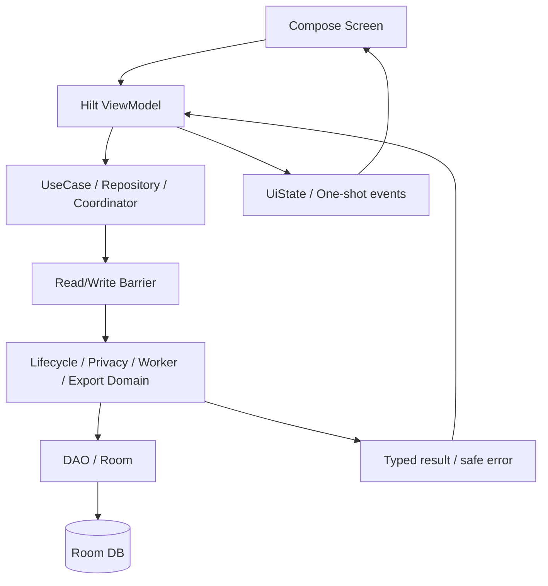
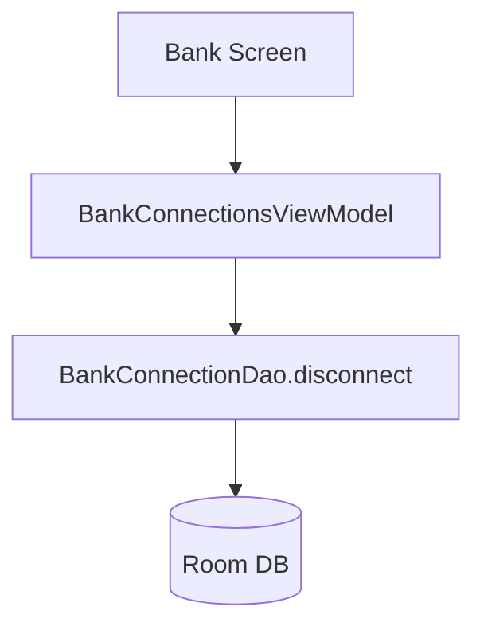
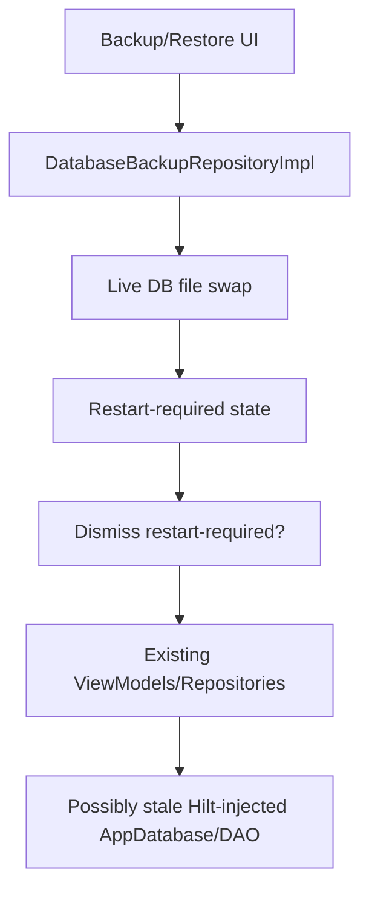

# P14 — UI / ViewModel Direct Action Paths Debug/Review Report

Target repository: `https://github.com/panospao7/Cost-agregator`  
Pinned commit: `83b798e849b4408b2bf683f52cb2746d37f7af16`  
Mode: **remote static review** based on supplied pipeline/engine reviews, architecture docs, and sampled raw source paths.  
Build/test status: **NOT RUN** — no local checkout, `rg`, emulator, or Gradle execution available.

Important limitation:

```text
This is not a complete UI source inventory because I could not run local `rg`.
Every direct DAO/UI action claim that is source-backed is marked as such.
Every item needing full tree search is marked NEEDS_RG.
```

---

## 1. Executive verdict

Verdict: **YELLOW / RED-borderline**

The UI/ViewModel layer appears mostly designed to call repositories/use cases rather than mutate Room directly, but it is not safe to mark GREEN. There is at least one confirmed direct DAO write from UI (`BankConnectionsViewModel.disconnect()`), and several critical app-shell paths remain insufficiently proven:

1. restore restart-required dismissal safety,
2. direct DAO/database usage inventory,
3. privacy-blocked UX coverage across all gated screens,
4. error/snackbar PII redaction,
5. import/export/backup cancellation and duplicate-action safety,
6. debug/raw-data screen release visibility.

Highest-risk remaining issue:

```text
A user-facing ViewModel can trigger DB mutation outside the legal lifecycle/barrier path, confirmed in bank disconnect, and restore/restart UI behavior may allow continued use of stale DB singletons after live DB swap.
```

Production safety assessment:

- **Not production-GREEN** until full UI `rg` confirms no direct DAO/write bypasses and restore/privacy-blocked UX is safe.
- Backend/domain fixes alone are not enough if UI can call old or illegal write paths.

---

## 2. UI runtime flow summary

Typical intended UI flow:



Problematic observed / high-risk flow:



This bypasses the intended path:

```text
UI → bank lifecycle owner/repository → DatabaseWriteBarrier → DAO
```

Restore/backup high-risk UI flow:



If dismissing restart-required re-enables normal app usage without true process restart or global DB provider invalidation, UI can continue through stale Room references.

---

## 3. Files reviewed / sampled

### Production files sampled or source-backed through prior reviews

| File / area | Role | Notes |
|---|---|---|
| `ui/screens/bank/BankConnectionsViewModel.kt` | Bank UI actions | Confirmed direct DAO disconnect path from P10 review. |
| `ui/screens/bank/BankConnectionsScreen.kt` | Bank screen | UI still appears demo/incomplete; connect/OAuth flow not fully implemented. |
| `ui/screens/export/ExportOptionsViewModel.kt` | Export UI action owner | Strong privacy/read-barrier path for export; cancellation handling concern from P12. |
| `ui/screens/export/**` | Export/import UI | Export reviewed more than import. Import UI wiring requires local `rg`. |
| `ui/screens/backup/**` | Backup/restore UI | Needs full review for restart-required dismiss, restore-state gating, error display. |
| `ui/screens/privacysettings/**` | Privacy settings | Architecture claims typed privacy-blocked states; full source not inventoried. |
| `ui/screens/assistant/**`, `ui/screens/aisettings/**` | AI/cloud UI | Needs verification that privacy-denied state prevents cloud calls and shows typed UX. |
| `ui/screens/receiptscan/**` | Receipt capture UI | Likely calls receipt lifecycle/repository; full action map not verified. |
| `ui/screens/receiptmatching/**` | Receipt match UI | UI likely triggers backend service; backend manual approve/clear has lifecycle issue from P3. |
| `ui/screens/review/**` | Pending review UI | Needs verification approval uses `ReviewQueueRepository`/transaction lifecycle and shows safe errors. |
| `ui/screens/groups/**`, `ui/screens/split/**` | Group/split UI | Engines partially reviewed; UI direct-write paths not inventoried. |
| `ui/screens/debug/**` | Debug actions | Needs release visibility and raw-data action audit. |
| `ui/screens/settings/**` | App settings | Needs restore/privacy/security settings audit. |
| Android action receivers | Reminder/notification actions | P4 found snooze/dismiss receivers catch broad `Exception`; UI-adjacent action path. |

### Architecture/docs used

| Doc | Role |
|---|---|
| `CODEBASE_SEGMENTS.md` | Segment/UI surface map. |
| `LEGAL_PATHS.md` | Legal mutation paths. |
| `DB_WRITE_OWNERSHIP.md` | Approved DB writers. |
| `PRIVACY_UI_ARCHITECTURE.md` | Typed privacy-blocked UX contract. |
| `backup-restore-barrier-contract.md` | Restore/restart/read-write barrier contract. |
| `SENSITIVE_DIAGNOSTICS_POLICY.md` | Error/log/snackbar privacy rules. |

### Files intentionally not fully reviewed

| File/area | Reason |
|---|---|
| Entire `ui/screens/**` tree | Requires local `rg` and IDE/call graph. |
| Every ViewModel constructor | Requires local source inventory. |
| Every Compose click handler | Requires source-wide search. |
| Navigation graph | Not fully opened. |
| Instrumentation/UI tests | Not run. |
| Release/debug manifest/routes | Not fully opened. |

---

## 4. Architecture/doc comparison

| Area | Architecture expectation | Actual / sampled code | Status |
|---|---|---|---|
| UI writes | ViewModels should call repositories/use cases/coordinators, not DAOs directly. | `BankConnectionsViewModel` directly calls `BankConnectionDao.disconnect()`. | **FAIL** |
| Restore blocking | UI actions should be blocked or fail safely during restore/maintenance. | Some backend barriers exist, but direct DAO and import/category paths bypass; UI restore gating not fully inventoried. | PARTIAL/FAIL |
| Restart-required restore UX | User should not continue with stale DB consumers after live DB swap. | P7 found stale DB consumer risk; UI dismiss path not fully verified. | **PARTIAL / HIGH RISK** |
| Privacy-denied UX | Typed `PrivacyBlocked` state should be exposed for gated features. | Architecture says it exists; full screen coverage not verified. | PARTIAL |
| Error redaction | UI should not show raw exception messages containing PII/secrets. | Broad UI error/snackbar inventory not run. | UNKNOWN/PARTIAL |
| Debug/raw-data actions | Debug/raw DB export/import/reset must be release-hidden and privacy gated. | Backend gates exist for several actions; UI visibility not fully verified. | PARTIAL |
| Long-running ops | Backup/restore/export/import should prevent duplicate taps and handle cancellation safely. | Export has state handling but cancellation rethrow policy is weak; backup/import UI unknown. | PARTIAL |
| Demo/disabled features | Demo-only bank integration should be explicit and release-safe. | P10 found demo/stub bank integration and incomplete connect UI. | PARTIAL |

---

## 5. Screen/ViewModel action matrix

| UI area | Main actions | Expected legal path | Reviewed status | Risk |
|---|---|---|---|---|
| Add expense | create manual expense | `ManualExpenseRepository` → `TransactionLifecycleCoordinator` | Partially covered by P2 | Medium until UI direct path verified |
| Transactions | edit/delete/bulk expense | `ExpenseRepository` → coordinator | P2 backend mostly OK | Medium |
| Review queue | approve/reject pending review | `ReviewQueueRepository` → transaction lifecycle | Body not fully opened in P2 | Medium/high |
| Receipt scan | save OCR receipt, create review/expense | `ReceiptLifecycleCoordinator` | Backend has P3 atomicity gaps | High via backend |
| Receipt matching | approve/clear match | `ReceiptMatchLifecycleService` / `ReceiptLinkService` | Backend service bypasses link service | High |
| Email receipt | import/process email | `EmailReceiptIngestionService` → coordinator | Backend P11 gaps | High |
| Bank connections | connect/sync/disconnect | bank lifecycle owner/repository → barrier | `disconnect()` direct DAO write confirmed | **High** |
| Backup/restore | create backup, restore, reset, dismiss restart | `DatabaseBackupRepositoryImpl`, maintenance mode | Backend P7 gaps; UI dismiss unverified | **High** |
| Export | CSV/JSON/accounting/encrypted export | `ExportOptionsViewModel` → privacy/read barrier → export repo | Mostly good, cancellation issue | Medium |
| Import | CSV/JSON import | `ImportCoordinator` → lifecycle/barrier/category owner | Import backend under-reviewed; category direct DAO | High |
| Privacy settings | toggle privacy/cloud/raw modes | `PrivacySettingsRepository` | Backend mostly strong, P8 issues remain | Medium |
| AI assistant/settings | cloud assist, NL search, AI settings | privacy gate → payload policy → provider | P8/Engine1 partial; UI coverage unknown | Medium/high |
| Map/location | geocoding/map/search | location privacy gate | Providers gated; UI blocked state unknown | Medium |
| Recurring/reminders | create/update rules, snooze/dismiss | recurring coordinator / worker / receivers | Backend P4 gaps | High |
| Budget/cashflow | budget CRUD, forecast/cashflow | budget repo/engines | Backend P6 gaps | Medium |
| Groups/splits | create group expense, settle, split | group lifecycle / transaction lifecycle | Engine4 partial; UI not inventoried | High |
| Categories | add/edit/delete/merge category | `CategoryRepository` / legal category owner | Repository guarded; import bypass; UI unknown | Medium |
| Investments | add/update portfolio items | investment repository/engine | Engine4 partial; UI not inventoried | Medium |
| Tax/business | tax settings/report/export | tax/business engines | Engine4/P12 partial | Medium |
| Warranty/subscription | warranty reminders/subscriptions/offers | feature repositories/workers | Engine1/P9 partial | Medium |
| Debug | raw export, reset, diagnostics | debug-gated repos + privacy gate + barrier | Backend partial; UI visibility unknown | High if release-visible |

---

## 6. Previous cross-pipeline UI-related issue reconciliation

| Source issue | Prior status | UI-layer actual status | Notes |
|---|---|---|---|
| P10-FIND-001 bank disconnect direct DAO | Open | **Confirmed UI/ViewModel bug** | Must fix in P14 too, not only P10. |
| P7-FIND-009 restart-required dismiss | Needs verification | Still needs UI source audit | Could be P1 depending behavior. |
| P12-PARTIAL-010 export cancellation | Partial | UI-level concern remains | ViewModel cancellation should be documented or rethrown. |
| P8 privacy-denied UX | Fixed-needs-UI-RG | Still needs UI-wide verification | Architecture has typed `PrivacyBlocked`, but screens must use it. |
| P1/P4 action receivers CE swallowing | Open/partial | UI-adjacent receiver issue | Snooze/dismiss/notification actions are user-triggered. |
| P10 demo bank UI | Partial/open | UI product-contract gap | Connect flow/demo state must be explicit. |
| P13 import category direct DAO | Open | If import UI wired, UI can trigger illegal write | Needs UI import path inventory. |

---

## 7. New findings

| ID | Severity | Type | Title | File(s) | Evidence | Impact | Reproduction path | Recommended fix | Required tests | Cross-pipeline impact |
|---|---:|---|---|---|---|---|---|---|---|---|
| P14-UI-001 | P1 | Direct DAO write | Bank disconnect bypasses lifecycle/barrier owner | `BankConnectionsViewModel.kt`, `BankConnectionDao.kt` | P10 review confirmed `disconnect()` calls `bankConnectionDao.disconnect(connectionId)` directly. DB ownership says bank connections need coordinator. | User can mutate bank connection during restore; no lifecycle audit/diagnostic owner. | Enter restore/maintenance, tap disconnect. | Add `BankConnectionLifecycleCoordinator` or repository with barrier; ViewModel calls that. | `bank_disconnect_blocked_during_restore`; static test no `BankConnectionDao` in ViewModel. | P7/P10/P13 |
| P14-UI-002 | P1 | Restore UX | Restart-required dismiss may allow stale DB consumers | `ui/screens/backup/**`, `RestoreMaintenanceMode`, `DatabaseBackupRepositoryImpl` | P7 found post-restore stale Hilt DB consumers; UI dismiss path not fully verified. | User may continue using screens backed by old Room/DAO after live DB swap. | Restore backup, dismiss restart-required, navigate/write through existing ViewModel. | Either enforce real app/process restart or keep writes blocked until global DB provider invalidates all consumers. | `dismiss_restart_required_does_not_unblock_stale_db_consumers`; UI instrumentation restore test. | P7/P15/all DB |
| P14-UI-003 | P1/P2 | Import action legality | Import UI can likely trigger import path lacking full barrier/category ownership | `ui/screens/export/**`, `ImportCoordinator.kt`, `CsvExpenseImporter.kt`, `JsonExpenseImporter.kt` | P13 found importers direct-write `CategoryDao` and lack import-level barrier. UI wiring needs `rg`. | User import during restore can create categories illegally; partial imports may show success/failure badly. | Run CSV/JSON import during maintenance or category insert failure. | UI import must call legal import use case with barrier, operation run, typed row failures, cancellation. | `import_button_disabled_during_restore`; `import_category_write_uses_legal_owner`. | P12/P13/P7 |
| P14-UI-004 | P2 | Cancellation | Export ViewModel cancellation handling can swallow structured cancellation | `ExportOptionsViewModel.kt` | P12 found ViewModel catches `CancellationException`, sets UI state, does not clearly rethrow. | Parent/job cancellation may be converted to normal UI error/cancel state; temp cleanup semantics need proof. | Cancel export from parent scope. | If user-cancel, document and isolate; otherwise rethrow after cleanup. | `export_cancellation_propagates_or_user_cancel_documented`; temp cleanup test. | P12/P9 |
| P14-UI-005 | P2 | Privacy UX | Typed privacy-blocked coverage is not proven across gated UI | `ui/screens/assistant`, `aisettings`, `map`, `export`, `backup`, `bank`, `privacysettings` | Architecture doc defines `PrivacyBlocked`, P8 says UI source not fully checked. | User may see generic error or trigger hidden work before privacy denial. | Disable cloud/geocoding/raw export; use every gated screen. | Add common privacy-blocked UI component and ViewModel state contract per gated feature. | `assistant_cloud_denied_shows_privacy_blocked`; `map_geocoding_denied_no_network`; `raw_export_denied_typed_ui`. | P8/P12/P20 |
| P14-UI-006 | P2 | Error privacy | UI error/snackbar PII redaction not globally verified | All ViewModels/screens | Required `rg` for `e.message`, `localizedMessage`, `Snackbar`, `Toast` not run. | Raw OCR/email/bank/notification text, file paths, tokens, or exception messages can appear to user/logs. | Force parser/import/cloud/bank exception with raw merchant/token/path in message. | Use safe error mappers; never display raw exception strings. | `ui_error_messages_redact_email_ocr_bank_token_path`. | P8/P16 |
| P14-UI-007 | P2 | Debug/release UX | Debug/raw-data screens may be reachable unless UI routes are release-gated | `ui/screens/debug/**`, navigation graph | Backend gates exist for some raw DB operations; UI route visibility not audited. | Release user could access debug actions that fail late or expose metadata. | Build release; navigate/search debug route. | Hide debug routes/actions behind `BuildConfig.DEBUG`; add release nav test. | `debug_routes_not_present_in_release`; `raw_db_export_button_hidden_release`. | P7/P8/P16 |
| P14-UI-008 | P2 | Duplicate action/idempotency | High-risk buttons need duplicate-tap guards | backup/restore/import/export/bank/split/group/recurring screens | No full UI state inventory; several backend operations are non-idempotent or partial. | Double tap can enqueue two imports/backups/syncs/group expenses before backend dedupe. | Rapidly tap restore/import/create group expense/connect bank. | Disable action while in-flight; backend idempotency keys; one-shot events. | `double_tap_import_single_operation`; `double_tap_group_expense_idempotent`. | P7/P10/P12/P13 |
| P14-UI-009 | P2 | Flow lifetime | UI may keep stale Room flows after restore | Any screen collecting Room-backed Flow | P7 stale DB consumers plus UI collectors create app-shell risk. | After restore, old ViewModels may continue collecting old DB instance. | Restore, dismiss/restart-required, observe old screen. | Force process restart or global DB provider invalidation and UI navigation reset. | `post_restore_existing_screen_cannot_collect_old_db`. | P7/P15 |
| P14-UI-010 | P2/P3 | Product contract | Bank connect UI appears incomplete/demo-only | `BankConnectionsViewModel.kt`, `BankConnectionsScreen.kt`, `BankApiIntegration.kt` | P10 found supported-bank placeholders and demo-only API. | User confusion; release feature may appear available but cannot securely connect. | Tap connect in release/demo-disabled environment. | Show explicit demo-disabled state or implement OAuth/PKCE. | UI connect-flow test; release demo gate test. | P10/P16 |
| P14-UI-011 | P3 | Test coverage | UI action paths lack a complete action matrix test suite | app UI tests | Prior reviews mostly backend; UI tests not inventoried. | Backend fixes can be bypassed/regressed by UI. | Run local UI test inventory. | Add ViewModel tests for every write button and privacy/restore denied state. | Action matrix tests. | All |

---

## 8. Direct DAO access audit

Status: **FAIL/PARTIAL**

Confirmed direct UI DAO write:

| File | DAO | Method | Classification | Fix |
|---|---|---|---|---|
| `BankConnectionsViewModel.kt` | `BankConnectionDao` | `disconnect(connectionId)` | Illegal/partial owner bypass | Move to bank lifecycle repository/coordinator with barrier. |

Needs local source-wide search:

```bash
rg -n "Dao|AppDatabase|RoomDatabase|withTransaction|DatabaseWriteBarrier|DatabaseReadBarrier" app/src/main/java/com/yourname/expensetracker/ui
```

Every hit should be classified:

| Category | Rule |
|---|---|
| DAO injected into ViewModel and writing | Fail unless explicit debug/test-only. |
| DAO injected read-only | Prefer repository; allow only with documented reason. |
| Direct `AppDatabase` in UI | Fail except debug internal tooling. |
| UI calls `RestoreMaintenanceMode.exit()` | Must be part of documented restore UX contract. |
| UI calls legal repository/usecase | Usually OK if backend barrier/lifecycle exists. |

---

## 9. Privacy-denied UX coverage

Status: **PARTIAL / NEEDS_RG**

Expected UI contract:
- typed `PrivacyBlocked` state,
- reason-specific copy,
- settings navigation,
- no hidden work before denial,
- no raw sensitive text in denial UI.

| Capability | UI screens likely involved | Backend gate status | UI status |
|---|---|---|---|
| Notification capture | settings/review/notification onboarding | P1 backend RED | UI not fully audited |
| Cloud AI general | assistant/AI settings | P8 partial | UI not fully audited |
| Receipt image cloud upload | receipt scan/assistant | P8 partial | UI not fully audited |
| Bank statement cloud validation | bank/receipt scan | P8/P10 partial | UI not fully audited |
| External geocoding | map/location screens | Providers gated | UI blocked state unverified |
| Overpass API | map/location screens | Providers gated | UI blocked state unverified |
| Raw DB export | backup/debug/export | Backend mostly gated | UI release visibility unverified |
| Encrypted backup | backup screen | P7 backend partial | UI state unverified |
| Expense export encrypted/plain | export screen | P12 mostly gated | UI cancellation/privacy partial |

Required search:

```bash
rg -n "PrivacyBlocked|PrivacyBlockedCard|PrivacyDecision|privacyGate|CloudAiDisabled|ExternalGeocodingDisabled|NotificationCaptureDisabled|RawExportDisabled" app/src/main/java/com/yourname/expensetracker/ui
```

Required tests:
- `assistant_cloud_denied_shows_privacy_blocked`
- `receipt_image_cloud_upload_denied_before_file_read`
- `map_geocoding_denied_prevents_network_and_shows_banner`
- `raw_export_denied_release_shows_typed_error`
- `bank_statement_cloud_denied_uses_on_device_or_typed_block`

---

## 10. Restore/restart UX audit

Status: **PARTIAL / HIGH RISK**

Known backend state:
- Restore enters maintenance mode.
- DB file can be swapped.
- Repository-local DB reference may be refreshed.
- Other Hilt singletons may keep stale DB/DAO references.
- Restart-required state exists.
- UI dismissal path was not fully verified in P7.

UI requirements:

1. During restore/import/reset:
   - all write buttons disabled or fail safely,
   - read screens show maintenance/restore state,
   - workers not scheduled manually,
   - import/export blocked or read-barrier safe.

2. After successful restore:
   - app must restart, or
   - all ViewModels/repositories/Flows must be rebound to fresh DB provider.

3. Critical recovery:
   - `CRITICAL_RECOVERY_REQUIRED` should block normal app navigation,
   - UI should show repair/export/support action only.

Required search:

```bash
rg -n "restartRequired|dismissRestart|RestoreMaintenanceMode|CRITICAL_RECOVERY_REQUIRED|RESTORE_COMPLETE_RESTART_REQUIRED|maintenance|restore" app/src/main/java/com/yourname/expensetracker/ui app/src/main/java/com/yourname/expensetracker/startup
```

Required tests:
- `restore_in_progress_disables_mutating_ui_actions`
- `dismiss_restart_required_does_not_unblock_stale_db_consumers`
- `critical_recovery_required_blocks_normal_navigation`
- `post_restore_existing_viewmodel_cannot_write_old_db`

---

## 11. PII/error-message UI audit

Status: **UNKNOWN / NEEDS_RG**

High-risk UI error sources:
- import row parse failures,
- bank/OAuth/token errors,
- cloud AI/provider errors,
- OCR/parser failures,
- backup/restore file paths,
- receipt asset filenames,
- notification raw text,
- email sender/subject/body,
- debug screens.

Required search:

```bash
rg -n "Snackbar|Toast|error|exception|message|localizedMessage|Timber|Log\\." app/src/main/java/com/yourname/expensetracker/ui
```

Rules:
- Do not show `e.message` directly.
- Do not show raw file paths unless user-selected file name is sanitized.
- Do not show bank token/provider raw response.
- Do not show raw OCR/email/notification body.
- Do not show raw cloud prompt/body.
- Debug-only detailed errors must be `BuildConfig.DEBUG` gated.

Recommended UI helper:
```text
Throwable -> SafeUiError(code, userMessageRes, recoverAction, correlationId)
```

Required tests:
- `ui_error_redacts_token`
- `ui_error_redacts_email`
- `ui_error_redacts_raw_ocr`
- `backup_restore_error_redacts_internal_paths`
- `import_row_error_does_not_show_full_raw_row`

---

## 12. Flow/lifecycle/coroutine audit

Status: **PARTIAL**

High-risk patterns to inspect:

```bash
rg -n "viewModelScope.launch|collectAsState|stateIn|shareIn|LaunchedEffect|rememberCoroutineScope|catch \\(e: Exception\\)|runCatching|CancellationException" app/src/main/java/com/yourname/expensetracker/ui
```

Red flags:
- `catch (Exception)` in ViewModel without `CancellationException` rethrow.
- `runCatching` around suspend UI actions.
- Duplicate collectors causing duplicate writes.
- Snackbar/navigation event stored as plain state and replayed.
- Long-running operation lacks cancel button.
- `isLoading` not used to disable destructive action.
- ViewModel holds file `Uri`/raw text longer than needed.
- ViewModel survives restore and holds stale repository/Flow.

Known sampled concern:
- `ExportOptionsViewModel` cancellation path should be documented or rethrow after cleanup.

---

## 13. Test coverage assessment

| Behavior | Existing test? | Missing test? | Recommended test |
|---|---:|---:|---|
| Bank disconnect blocked during restore | Not verified | Yes | `bank_disconnect_blocked_during_restore` |
| No DAOs injected in ViewModels | Not verified | Yes | Static guard `ui_no_direct_dao_writes` |
| Restore restart-required cannot be unsafely dismissed | Not verified | Yes | `dismiss_restart_required_does_not_unblock_stale_db_consumers` |
| Critical recovery blocks navigation | Not verified | Yes | UI/navigation test |
| Privacy blocked shown for assistant/cloud | Not verified | Yes | `assistant_cloud_denied_shows_privacy_blocked` |
| Privacy blocked shown for map/geocoding | Not verified | Yes | `map_geocoding_denied_shows_privacy_blocked` |
| Raw export denied in release UI | Not verified | Yes | `raw_export_button_hidden_or_denied_release` |
| Export cancellation cleanup/propagation | Partially backend | Yes | `export_cancel_cleans_temp_and_propagates_or_documents_user_cancel` |
| Import blocked during restore | Not verified | Yes | `import_button_disabled_or_import_fails_before_write_during_restore` |
| UI errors redact PII | Not verified | Yes | parameterized safe error tests |
| Duplicate tap idempotency | Not verified | Yes | backup/import/group/bank double-tap tests |
| Debug screens absent in release | Not verified | Yes | release navigation test |
| Old Flow after restore invalidated | Not verified | Yes | post-restore ViewModel test |

---

## 14. Recommended fix plan

### PR 1 — UI direct-write and restore safety

Fix:
1. Replace `BankConnectionsViewModel` direct DAO mutation with legal bank connection repository/coordinator.
2. Add static guard: no `*Dao` constructor injection under `ui/**` unless allowlisted read-only.
3. Audit backup/restore ViewModel restart-required dismiss path.
4. Enforce process restart or block writes after restore until fresh DB provider.

Acceptance:
- `ui_no_direct_dao_writes` passes.
- Bank disconnect blocked during restore.
- Restore restart-required cannot be unsafely bypassed.

### PR 2 — Privacy-blocked UI coverage

Fix:
1. Standardize `PrivacyBlocked` state and UI component.
2. Wire all gated screens:
   - assistant,
   - AI settings,
   - map,
   - export,
   - backup,
   - bank statement cloud,
   - receipt image cloud.
3. Add reason-specific settings navigation.

Acceptance:
- All privacy-denied tests pass.
- No hidden network/DB side effect before denial.

### PR 3 — Safe UI errors and cancellation

Fix:
1. Add `SafeUiErrorMapper`.
2. Replace raw `e.message`/`localizedMessage` display.
3. Review all `runCatching`/`catch(Exception)` in UI.
4. Define cancellation contract for long-running export/import/backup/restore.

Acceptance:
- UI PII redaction tests pass.
- Cancellation tests pass.
- Temp cleanup tests pass.

### PR 4 — Import/export/backup/debug UX hardening

Fix:
1. Disable duplicate taps for import/export/backup/restore/reset.
2. Add operation IDs/idempotency where needed.
3. Hide debug/raw actions in release.
4. Add clear demo-disabled state for bank connect if real OAuth not implemented.

Acceptance:
- Double-tap tests pass.
- Release debug route test passes.
- Bank demo/release UI is explicit.

### PR 5 — Full UI action matrix and docs

Fix:
1. Create `UI_ACTION_OWNERSHIP_MATRIX.md`.
2. For every screen action, document:
   - ViewModel method,
   - repository/usecase called,
   - legal owner,
   - barrier/privacy behavior,
   - tests.
3. Sync architecture docs.

---

## 15. Required local validation commands

```bash
git rev-parse HEAD
git status --short
./gradlew :app:assembleDebug --stacktrace
./gradlew :app:testDebugUnitTest --stacktrace
./gradlew :app:connectedDebugAndroidTest --stacktrace
./gradlew :app:check --stacktrace
```

UI-specific searches:

```bash
rg -n "Dao|AppDatabase|RoomDatabase|withTransaction|DatabaseWriteBarrier|DatabaseReadBarrier" app/src/main/java/com/yourname/expensetracker/ui

rg -n "restartRequired|dismissRestart|RestoreMaintenanceMode|CRITICAL_RECOVERY_REQUIRED|RESTORE_COMPLETE_RESTART_REQUIRED|maintenance|restore" app/src/main/java/com/yourname/expensetracker/ui app/src/main/java/com/yourname/expensetracker/startup

rg -n "PrivacyBlocked|PrivacyBlockedCard|PrivacyDecision|privacyGate|CloudAiDisabled|ExternalGeocodingDisabled|NotificationCaptureDisabled|RawExportDisabled" app/src/main/java/com/yourname/expensetracker/ui

rg -n "Snackbar|Toast|error|exception|message|localizedMessage|Timber|Log\\." app/src/main/java/com/yourname/expensetracker/ui

rg -n "viewModelScope.launch|collectAsState|stateIn|shareIn|LaunchedEffect|rememberCoroutineScope|catch \\(e: Exception\\)|runCatching|CancellationException" app/src/main/java/com/yourname/expensetracker/ui
```

Suggested focused tests:

```bash
./gradlew :app:testDebugUnitTest --tests "*ViewModel*" --stacktrace
./gradlew :app:testDebugUnitTest --tests "*PrivacyBlocked*" --stacktrace
./gradlew :app:testDebugUnitTest --tests "*BackupRestore*" --stacktrace
./gradlew :app:testDebugUnitTest --tests "*ExportOptions*" --stacktrace
./gradlew :app:testDebugUnitTest --tests "*BankConnections*" --stacktrace
./gradlew :app:connectedDebugAndroidTest --tests "*Navigation*" --stacktrace
```

---

## 16. Final production-readiness decision

Verdict: **YELLOW / RED-borderline**

The UI layer is not proven unsafe everywhere, but it is not production-GREEN because:

1. A confirmed ViewModel direct DAO write exists in bank disconnect.
2. Restore restart-required behavior can be catastrophic if UI lets user continue with stale DB consumers.
3. Privacy-blocked UX is architecture-documented but not source-wide verified.
4. UI error/snackbar PII redaction is not source-wide verified.
5. Debug/raw-data routes are not release-visibility verified.
6. Import/export/backup long-running action idempotency and cancellation need tests.

Minimum before GREEN:

- no mutating DAO injection under `ui/**`,
- restore restart-required path proven safe,
- every gated feature has typed privacy-blocked UI,
- UI error mapper prevents raw PII/secrets,
- debug/raw routes hidden in release,
- duplicate-tap and cancellation tests for destructive/long-running operations,
- full UI action ownership matrix committed.

---

## 17. Source index

Repository commit:
- https://github.com/panospao7/Cost-agregator/commit/83b798e849b4408b2bf683f52cb2746d37f7af16

Architecture:
- `CODEBASE_SEGMENTS.md`  
  https://raw.githubusercontent.com/panospao7/Cost-agregator/83b798e849b4408b2bf683f52cb2746d37f7af16/docs/architecture/CODEBASE_SEGMENTS.md
- `LEGAL_PATHS.md`  
  https://raw.githubusercontent.com/panospao7/Cost-agregator/83b798e849b4408b2bf683f52cb2746d37f7af16/docs/architecture/LEGAL_PATHS.md
- `PRIVACY_UI_ARCHITECTURE.md`  
  https://raw.githubusercontent.com/panospao7/Cost-agregator/83b798e849b4408b2bf683f52cb2746d37f7af16/docs/architecture/PRIVACY_UI_ARCHITECTURE.md
- `SENSITIVE_DIAGNOSTICS_POLICY.md`  
  https://raw.githubusercontent.com/panospao7/Cost-agregator/83b798e849b4408b2bf683f52cb2746d37f7af16/docs/architecture/SENSITIVE_DIAGNOSTICS_POLICY.md
- `DB_WRITE_OWNERSHIP.md`  
  https://raw.githubusercontent.com/panospao7/Cost-agregator/83b798e849b4408b2bf683f52cb2746d37f7af16/docs/DB_WRITE_OWNERSHIP.md
- `backup-restore-barrier-contract.md`  
  https://raw.githubusercontent.com/panospao7/Cost-agregator/83b798e849b4408b2bf683f52cb2746d37f7af16/docs/backup-restore-barrier-contract.md

Sampled/high-risk source:
- `BankConnectionsViewModel.kt`  
  https://raw.githubusercontent.com/panospao7/Cost-agregator/83b798e849b4408b2bf683f52cb2746d37f7af16/app/src/main/java/com/yourname/expensetracker/ui/screens/bank/BankConnectionsViewModel.kt
- `BankConnectionsScreen.kt`  
  https://raw.githubusercontent.com/panospao7/Cost-agregator/83b798e849b4408b2bf683f52cb2746d37f7af16/app/src/main/java/com/yourname/expensetracker/ui/screens/bank/BankConnectionsScreen.kt
- `ExportOptionsViewModel.kt`  
  https://raw.githubusercontent.com/panospao7/Cost-agregator/83b798e849b4408b2bf683f52cb2746d37f7af16/app/src/main/java/com/yourname/expensetracker/ui/screens/export/ExportOptionsViewModel.kt
- `ImportCoordinator.kt`  
  https://raw.githubusercontent.com/panospao7/Cost-agregator/83b798e849b4408b2bf683f52cb2746d37f7af16/app/src/main/java/com/yourname/expensetracker/util/ImportCoordinator.kt
- `CsvExpenseImporter.kt`  
  https://raw.githubusercontent.com/panospao7/Cost-agregator/83b798e849b4408b2bf683f52cb2746d37f7af16/app/src/main/java/com/yourname/expensetracker/util/CsvExpenseImporter.kt
- `JsonExpenseImporter.kt`  
  https://raw.githubusercontent.com/panospao7/Cost-agregator/83b798e849b4408b2bf683f52cb2746d37f7af16/app/src/main/java/com/yourname/expensetracker/util/JsonExpenseImporter.kt
- `DatabaseBackupRepositoryImpl.kt`  
  https://raw.githubusercontent.com/panospao7/Cost-agregator/83b798e849b4408b2bf683f52cb2746d37f7af16/app/src/main/java/com/yourname/expensetracker/data/repository/DatabaseBackupRepositoryImpl.kt
- `RestoreMaintenanceMode.kt`  
  https://raw.githubusercontent.com/panospao7/Cost-agregator/83b798e849b4408b2bf683f52cb2746d37f7af16/app/src/main/java/com/yourname/expensetracker/data/backup/RestoreMaintenanceMode.kt