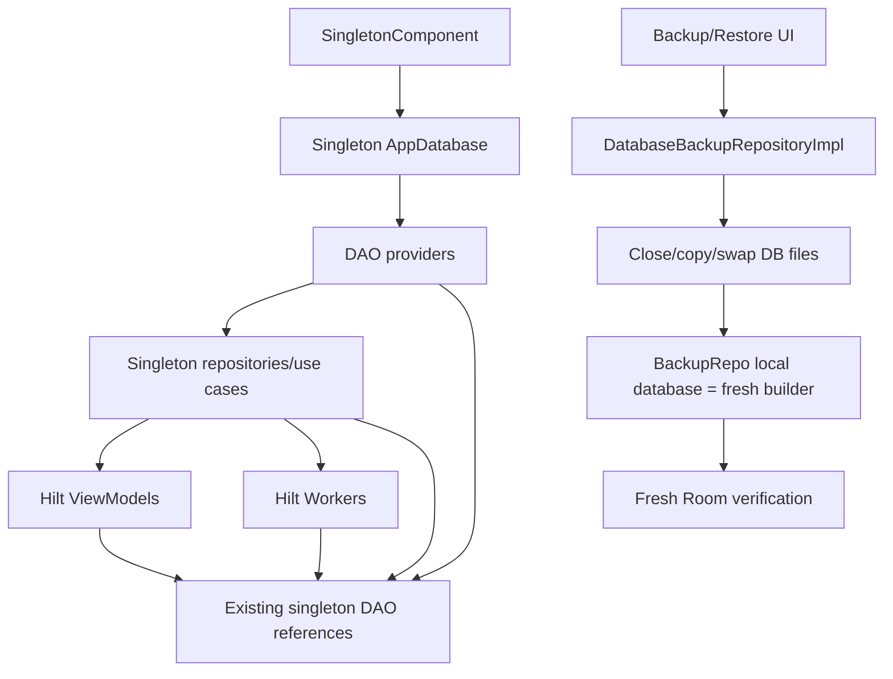
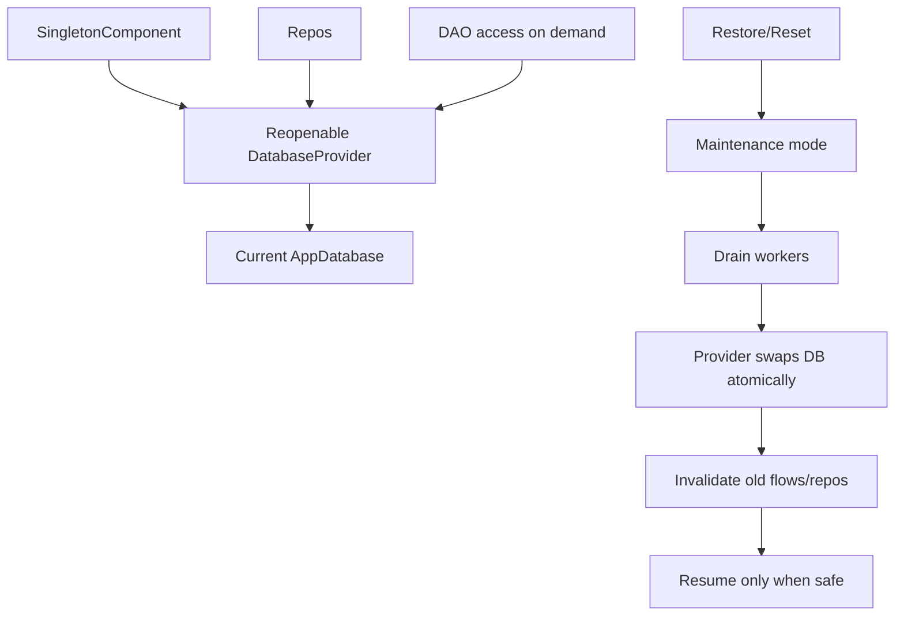

# P15 — Hilt / DI / Singleton Lifetime Debug/Review Report

Target repository: `https://github.com/panospao7/Cost-agregator`  
Pinned commit: `83b798e849b4408b2bf683f52cb2746d37f7af16`  
Mode: **remote static review** using prior pipeline/engine findings, architecture docs, and sampled source paths.  
Build/test status: **NOT RUN** — no local checkout, `rg`, Gradle, or Hilt graph generation available.

Important limitation:

```text
This is a DI/runtime-lifetime audit from available source/docs and prior reviews.
A full Hilt graph must still be verified locally with `rg`, Gradle, and generated component inspection.
```

---

## 1. Executive verdict

Verdict: **RED**

The DI/runtime lifetime layer is not production-safe for restore/reset/import workflows.

The biggest issue is structural:

```text
AppDatabase and DAOs appear to be singleton-provided through Hilt, while restore/reset/import can swap the live database file. DatabaseBackupRepositoryImpl refreshes only its own mutable database reference after file swap, leaving other singleton repositories/DAOs/ViewModels/workers with stale Room references.
```

This is not a small bug in the backup repository. It is a DI/lifetime design issue.

Production safety assessment:

- Normal app runtime: mostly functional.
- Restore/reset/import path: **not safe** unless the app truly forces process restart before any further DB access, or all DB/DAO access is routed through a reopenable provider.
- Worker drain/maintenance: partially wired, but not enough to guarantee stale singleton safety.
- Debug/release/provider bindings: partially protected by runtime checks, but full DI proof is missing.
- Cloud/network/security bindings: partially reviewed by P8/P10/engine reviews; full graph still requires security audit.

Highest-risk remaining issue:

```text
P15-DI-001 — Singleton AppDatabase/DAO injection is incompatible with live DB file replacement.
```

---

## 2. DI/runtime flow summary

Current likely runtime model:



Desired runtime model:



Alternative acceptable model:

```text
After live DB file swap:
  - enter RESTORE_COMPLETE_RESTART_REQUIRED
  - do not unblock normal reads/writes
  - force real process restart before app resumes normal screens/workers
```

---

## 3. Files reviewed / sampled

### DI modules listed for review

| Module | Role | Review status |
|---|---|---|
| `DatabaseModule.kt` | Provides `AppDatabase` and DB-related bindings | High-risk; singleton DB lifetime issue. |
| `DaoModule.kt` | Provides DAOs from `AppDatabase` | Needs full local inventory; likely stale DAO risk after restore. |
| `BackupRepositoryModule.kt` | Backup/restore repository binding | Partially reviewed through P7; repo hot-swaps only local DB. |
| `WorkerModule.kt` | Worker registry/guard/lease bindings | Partially reviewed; lease impl bound as registry/drain, but worker coverage gaps remain. |
| `PrivacyModule.kt` | Privacy gates/policies | Mostly strong; context/payload issues remain from P8. |
| `AiModule.kt` | AI/cloud/on-device provider routing | Partial; must prove every provider receives gate/payload policy. |
| `NetworkModule.kt`, `NetworkQualifiers.kt` | OkHttp/network clients | Security review still needed. |
| `SecurityModule.kt` | key storage, token cipher, hashing | Partial; hashing secret issue from P8. |
| `RetentionModule.kt` | Retention targets | Has cancellation bug due `runCatching` in target lambdas. |
| `DiagnosticsModule.kt` | Diagnostic writers/sanitizers | Partial; must verify barrier/sanitizer bindings. |
| `ExportModule.kt` | Export/import bindings | Export mostly reviewed; import utility path still under-reviewed. |
| `EmailIngestionModule.kt` | Email parser bindings | Parser bindings okay; service logic has P11 issues. |
| `CurrencyModule.kt` | Currency conversion/normalization | Engine 5/P5/P6 covered logic; DI cache/stale provider needs review. |
| `CashFlowModule.kt` | Cashflow engines | P6 logic issues remain. |
| `GroupsModule.kt` | Group/shared components | Engine 4 partial. |
| `LocationResolverPortsModule.kt` | Location providers | P8/Engine1 partial; privacy-gate proof needed. |
| `NaturalLanguageModule.kt` | NL search/assistant | Engine1/P8 partial. |
| `NegotiationModule.kt` | bill negotiation/offers | Engine1 partial. |
| `OcrImprovementsModule.kt`, `ParserModule.kt`, `ReceiptParsingModule.kt` | OCR/parser bindings | Logic covered by P3/P11; DI full graph not verified. |
| `ReminderSettingsModule.kt` | reminder settings | P4/P9 partial. |
| `SavingsModule.kt`, `SavingsRepositoryBindingsModule.kt` | savings/health | Engine coverage partial. |
| `TaxModule.kt` | tax/business reporting | Engine4 partial. |
| `TimeModule.kt` | `TimeProvider` | Generally positive; important for tests/workers. |
| `ApplicationScope.kt` | app-wide coroutine scope | Needs audit for tasks surviving restore/shutdown. |
| `ServiceModule.kt` | service/domain bindings | Needs local inventory. |
| `MainApplication.kt` | Hilt app root/startup | Startup/restore interaction needs final verification. |

### Source-backed cross references from prior reviews

| File | Relevant finding |
|---|---|
| `DatabaseBackupRepositoryImpl.kt` | Reassigns its own mutable `database` after swap; does not refresh all Hilt consumers. |
| `RestoreDatabaseOpener.kt` | Fresh Room is used for verification only. |
| `RestoreMaintenanceMode.kt` | Maintains restart-required/critical recovery modes. |
| `AppStartupCoordinator.kt` | Recovery and worker scheduling depend on maintenance state. |
| `WorkerLeaseRegistryImpl.kt` | Bound as drain/lease registry, but internally tracked leases by worker name. |
| `WorkerExecutionGuard.kt` | Good core guard, but not used fully by `NotificationIntakeWorker`. |
| `BankConnectionsViewModel.kt` | Direct DAO injection/write from UI. |
| `CsvExpenseImporter.kt`, `JsonExpenseImporter.kt` | Direct `CategoryDao` injection/write. |
| `RetentionModule.kt` | Anonymous retention targets catch cancellation via `runCatching`. |

### Files not fully reviewed

| Area | Reason |
|---|---|
| Generated Hilt components | Not available without local build. |
| Every `@Inject` constructor | Requires local `rg`. |
| Every `@Singleton` service/repository | Requires local `rg`. |
| Every DAO provider and repository binding | Needs full graph. |
| Every OkHttp/client/provider binding | Deferred to security review. |
| Every worker class injection constructor | Needs local `rg`. |

---

## 4. Architecture/doc comparison

| Area | Architecture expectation | Actual / reviewed behavior | Status |
|---|---|---|---|
| DB lifetime | Restore file swap must not leave stale DB consumers. | Backup repo refreshes local DB; other Hilt singletons may hold old DB/DAO. | **FAIL** |
| Singleton DB | Singleton `AppDatabase` is acceptable only if process restart is enforced after swap. | Restart-required exists, but UI dismiss/unblock path unverified. | **PARTIAL / HIGH RISK** |
| DAO injection | DAOs should be hidden behind legal repositories/coordinators. | DAOs are injectable enough to reach UI/importers. | **FAIL/PARTIAL** |
| Worker DI | All DB-writing workers should use `WorkerExecutionGuard` and leases. | Registered workers mostly do; `NotificationIntakeWorker` does not fully. | PARTIAL |
| Worker drain binding | One shared lease registry/drain controller. | Prior review says `WorkerLeaseRegistryImpl` bound as both; implementation has same-name lease bug. | PARTIAL |
| Privacy gate composition | Composite gate fail-closed. | P8 reviewed composite gate as strong, but raw map/audit issues remain. | PARTIAL PASS |
| Debug/release bindings | Stub/demo/no-op should not leak to release. | Bank backend has `requireStubMode`; UI/DI release proof incomplete. | PARTIAL |
| Network/cloud DI | Cloud providers should receive privacy gate and payload policy. | Major providers reviewed; full `RequestBody`/OkHttp inventory needed. | PARTIAL |
| Security DI | Secrets should use secure storage, no test/no-op binding in prod. | Bank token cipher strong; sensitive hashing issue remains. | PARTIAL |
| Application scope | Long-running app-scope tasks should respect maintenance/cancellation. | Some service/receiver/app-scope patterns need review. | PARTIAL |

---

## 5. Binding matrix by module

| Module | Expected bindings | Main concern | Verdict |
|---|---|---|---|
| `DatabaseModule` | `AppDatabase`, possibly builders | Singleton DB is stale after restore file swap. | **RED** |
| `DaoModule` | DAOs from DB | Singleton/stale DAO references; too broad injection to UI/importers. | **RED/PARTIAL** |
| `BackupRepositoryModule` | backup repo, barriers, restore helpers | Backup repo local DB swap only; does not solve global graph. | **RED-borderline** |
| `WorkerModule` | worker guard, lease registry, registry/scheduler | Binding likely centralized; worker coverage and lease impl flawed. | YELLOW |
| `PrivacyModule` | composite gate, privacy policies | Good structure; audit context/payload fail-closed gaps. | YELLOW |
| `AiModule` | cloud/on-device AI services | Need proof all cloud providers gated and payload-policy-bound. | YELLOW |
| `NetworkModule` | OkHttp/Retrofit clients | Release logging/TLS/header redaction not fully audited. | UNKNOWN/YELLOW |
| `SecurityModule` | key storage/hash/token cipher | Deterministic hashing issue; token cipher okay. | YELLOW |
| `RetentionModule` | retention targets registry | Target lambdas swallow CE with `runCatching`. | RED/P2 |
| `DiagnosticsModule` | safe diagnostic writers | Need barrier/redaction binding proof. | YELLOW |
| `ExportModule` | export repos/services | Export mostly okay; import util not fully aligned. | YELLOW |
| `EmailIngestionModule` | parser list | Binding okay; logic issues elsewhere. | YELLOW |
| `CurrencyModule` | converter/normalizer/rate repo | Foundational; stale cached rates/provider lifetime needs full check. | YELLOW |
| `CashFlowModule` | cashflow calculators | Logic issue: recurring income direction. | YELLOW |
| `GroupsModule` | group/shared repos | Engine4 partial; idempotency/schema issues remain. | YELLOW |
| `LocationResolverPortsModule` | geocoding/nearby providers | Providers sampled as gated; full network DI proof needed. | YELLOW |
| `NaturalLanguageModule` | NL parser/search/AI query | Privacy/AI behavior partial. | YELLOW |
| `NegotiationModule` | negotiation/offers | Engine1 partial. | YELLOW |
| `OcrImprovementsModule` / `ParserModule` / `ReceiptParsingModule` | OCR/parser bindings | Need release cloud/on-device split proof. | YELLOW |
| `ReminderSettingsModule` | reminder settings repo | Worker permission issue not DI-specific. | GREEN/YELLOW |
| `SavingsModule` / `SavingsRepositoryBindingsModule` | savings engines/repos | Engine coverage partial. | UNKNOWN/YELLOW |
| `TaxModule` | tax/business reporting | Engine/P12 partial. | YELLOW |
| `TimeModule` | `TimeProvider` | Positive; important for deterministic tests. | GREEN/YELLOW |
| `ApplicationScope` | app coroutine scope | Needs cancellation/maintenance rules. | YELLOW |
| `ServiceModule` | services/facades | Needs full inventory. | UNKNOWN |

---

## 6. Singleton state risk matrix

| Singleton / stateful object type | Risk | Evidence / rationale | Required fix |
|---|---|---|---|
| `AppDatabase` singleton | **P0/P1** | Live DB file swap after restore can leave stale singleton DB. | Force process restart or use reopenable `DatabaseProvider`. |
| DAO providers | **P1** | DAOs are tied to old Room instance. | Avoid singleton DAO injection; provide DAOs on demand from current DB provider. |
| Singleton repositories storing DAOs | **P1** | Repositories can keep stale DAO references after restore. | Repositories depend on provider/use `withDb {}`. |
| Singleton repositories storing `AppDatabase` | **P1** | Direct DB reference stale after swap. | Provider/invalidation contract. |
| ViewModels holding repository/Flow | **P1/P2** | Existing screens may collect old DB after restore. | Restart app or invalidate UI graph. |
| Worker dependencies | **P1/P2** | Existing worker instances can hold old DAO/repo during maintenance. | Drain before restore; guard every worker; recreate after restart. |
| In-memory caches | **P2** | Category/merchant/currency/settings caches may retain pre-restore state. | Restore invalidation event or process restart. |
| Application coroutine scope tasks | **P2** | App-scope tasks can outlive restore mode and hold old dependencies. | Maintenance-aware supervisor / cancellation. |
| Privacy/settings repositories | P2 | Must fail closed and reschedule/cancel workers. | Already partial; needs UI/DI validation. |
| OkHttp/cloud clients | P2 | Singleton clients okay if stateless, risky if logging/API key state wrong. | Security review. |
| Diagnostic writers | P2 | Must not hold stale DAO after restore. | Provider or restart. |

---

## 7. DB/DAO injection lifetime matrix

| Consumer type | Current likely pattern | Risk | Required inspection/fix |
|---|---|---|---|
| Repositories | Constructor-injected DAOs/DB | Stale after restore. | `rg "class .*Repository.*Dao|AppDatabase"`; refactor high-risk to DB provider. |
| Domain coordinators | Constructor-injected DAOs/DB | Stale after restore. | Use provider or enforce restart. |
| Workers | Constructor-injected repos/DAOs/guard | Stale if running during/after restore; some not fully guarded. | Drain and re-enqueue after safe restart/provider swap. |
| ViewModels | Inject repositories and sometimes DAOs | Direct DAO write confirmed in bank VM. | Ban mutating DAO injection in UI. |
| Importers | Inject `CategoryDao` and lifecycle coordinator | Category write bypass barrier/owner. | Use `CategoryRepository`/import coordinator. |
| Backup repo | Holds mutable `database` var | Split-brain graph after local refresh. | Do not hot-swap locally unless all graph uses same provider. |
| Diagnostic/operation recorders | Likely DAO-injected | Can write to stale DB after restore. | Maintenance-safe writer using provider/barrier. |

---

## 8. Debug/release binding matrix

| Area | Expected release behavior | Current evidence | Risk |
|---|---|---|---|
| Bank API | Demo/stub disabled in release or explicit demo-only | Backend uses `requireStubMode()`; UI may expose incomplete connect. | Medium |
| Raw DB export | Release disabled and privacy gated | P7/P8 say backend disabled in release. | Need UI route proof |
| Legacy DB import | Debug-only | P7 says release gated. | Need UI route proof |
| Debug screens | Hidden in release | Not verified. | High if visible |
| Fake/no-op privacy gates | Never production-bound | Composite gate reviewed strong. | Need DI scan |
| Fake/no-op worker drain | Never production-bound | WorkerLeaseRegistryImpl bound in reviewed module. | Need DI scan |
| No-op encryption/security | Never production-bound | BankTokenCipher real; hashing issue. | Need SecurityModule scan |
| HTTP logging | Debug-only, no secrets | Not verified. | Security review |
| Cloud provider stubs | Debug/test only | Not fully verified. | Medium |
| Test modules | Not installed in main source | Not verified. | Low/medium |

Required local search:

```bash
rg -n "BuildConfig.DEBUG|Stub|Demo|NoOp|Fake|debug|release|RAW_DATABASE_EXPORT|RAWBACKUP_EXPORT|HttpLoggingInterceptor" app/src/main/java/com/yourname/expensetracker/di app/src/main/java/com/yourname/expensetracker
```

---

## 9. Worker binding matrix

| Worker | Expected DI contract | Current status from prior reviews | Risk |
|---|---|---|---|
| `DataRetentionWorker` | `WorkerExecutionGuard`, registry target deps | Guarded; retention target lambdas swallow CE. | Medium |
| `LocationBackfillWorker` | Guard, privacy capability | Guarded. | Low/medium |
| `MerchantKeyBackfillWorker` | Guard, battery constraint | Guarded. | Low/medium |
| `BillReminderWorker` | Guard + notification permission checker | Guarded but does not request permission gating. | Medium/high |
| `ReceiptMatchingWorker` | Guard/lease/run log | Guarded; same-name lease bug affects drain. | Medium/high |
| `DailyBriefingWorker` | Guard + reschedule chain | Guarded; reschedule failure swallowed. | Medium |
| `WarrantyExpirationWorker` | Guard + notification permission | Mostly good. | Low |
| `NotificationIntakeWorker` | Full guard/lease/run log or equivalent | Only checkpoint; no full lease/run ledger; reads before barrier. | **High** |

Worker DI findings:
- `WorkerModule` likely binds `WorkerLeaseRegistryImpl` as both `WorkerLeaseRegistry` and `WorkerDrainController`.
- That binding is necessary but not sufficient because the implementation tracks active leases incorrectly by worker name.
- DI does not guarantee all `CoroutineWorker` subclasses use full guard; needs static guard.

Required local guard:

```bash
rg -n "class .*Worker|CoroutineWorker|ListenableWorker|WorkerExecutionGuard|WorkerRunLogger|WorkerLeaseRegistry" app/src/main/java app/src/test
```

---

## 10. Restore-after-DB-swap risk matrix

| Scenario | Current risk | Severity | Required behavior |
|---|---|---:|---|
| Restore succeeds, UI dismisses restart-required | Existing ViewModels/repositories may hold old DAOs. | P1 | Force process restart or keep app blocked. |
| Restore succeeds, worker scheduled before restart | Worker dependencies may use old Room. | P1 | Do not reschedule until restart/provider swap. |
| Restore fails after partial asset restore | Asset DB paths can be stale/broken. | P1 | Atomic/resumable asset restore. |
| Reset DB, continue same process | Repositories may use deleted DB instance. | P1 | Restart or provider invalidation. |
| Legacy import DB file swap | Same stale graph risk. | P1 | Same as restore. |
| Backup repo local DB refresh only | Split-brain graph: backup repo sees new DB, others old. | P1 | Single global provider or no local hot-swap. |
| Diagnostic writer after restore | Could write to old DB or fail. | P2 | Maintenance-safe writer with current DB provider. |
| Privacy/settings flow after restore | Existing DataStore fine, DB-backed flows stale. | P2 | UI/app restart/invalidation. |

---

## 11. New findings

| ID | Severity | Type | Title | Evidence | Impact | Reproduction path | Recommended fix | Required tests | Cross-pipeline impact |
|---|---:|---|---|---|---|---|---|---|---|
| P15-DI-001 | P0/P1 | Singleton lifetime | Singleton `AppDatabase`/DAO graph is incompatible with live DB file replacement | P7 review: restore verification opens fresh DB, but repository local `database` reassignment does not update other Hilt consumers. `DatabaseModule` provides app DB through Hilt. | After restore/reset/import, screens/workers/repositories can read/write stale/closed Room instance. | Restore backup, dismiss restart-required without process restart, use existing screen/repository. | Enforce hard process restart before normal app usage, or implement reopenable `DatabaseProvider` and remove direct singleton DAO injection. | `post_restore_existing_repository_cannot_write_old_db`; `dismiss_restart_required_does_not_unblock_stale_db_consumers`. | P7/P14/all DB |
| P15-DI-002 | P1 | Split-brain restore | `DatabaseBackupRepositoryImpl` local hot-swap creates split-brain DB graph | P7 review: repo assigns its own mutable DB after swap and uses fresh DB for verification. | Backup repo and rest of app disagree on current DB instance. | Restore then call backup repo and another repository. | Remove local-only hot-swap; centralize through provider or block until restart. | `restore_uses_single_global_current_db_provider`. | P7/P13 |
| P15-DI-003 | P1 | DAO exposure | Hilt allows direct DAO injection into UI/importers | Confirmed `BankConnectionsViewModel` direct `BankConnectionDao`; importers direct `CategoryDao`. | UI/import can bypass write barrier/lifecycle owner. | Bank disconnect/import during restore. | Ban mutating DAO injection outside data/coordinator owners; static Hilt/constructor guard. | `ui_no_mutating_dao_injection`; `import_no_direct_category_dao`. | P10/P12/P14 |
| P15-DI-004 | P1 | Worker coverage | DI does not force every worker through full guard/lease/run logger | P9: `NotificationIntakeWorker` injects guard only for checkpoint, no full lease/run log. | Restore drain can miss active worker; no run ledger. | Run notification intake during restore drain. | Worker base abstraction or static guard requiring `runGuardedWithContext`/lease for every DB worker. | `all_coroutine_workers_guarded_or_allowlisted_with_equivalent_tests`. | P1/P9/P7 |
| P15-DI-005 | P1/P2 | Lease binding/impl | Shared worker drain binding exists but implementation loses concurrent same-name leases | P9: `WorkerLeaseRegistryImpl` active map keyed by worker name. | Drain can report no active workers while one still runs. | Two same-name workers overlap; first closes, removes second lease. | Track leases by unique lease ID; keep same singleton binding. | `concurrent_same_name_leases_are_all_tracked`. | P7/P9 |
| P15-DI-006 | P2 | App scope | Application-scope coroutines may outlive maintenance/restore and hold stale deps | P1/P4 receivers/services use custom/app scopes; ApplicationScope exists. Full inventory not run. | Background tasks can continue during restore or after DB swap. | Start long app-scope import/repair, begin restore. | Maintenance-aware app task registry; cancel/drain app-scope DB tasks before restore. | `maintenance_cancels_or_blocks_app_scope_db_tasks`. | P1/P4/P7 |
| P15-DI-007 | P2 | Retention DI | `RetentionModule` target lambdas swallow `CancellationException` | P8/P9 reviews: anonymous targets use `runCatching`. | Worker cancellation/maintenance stop can become soft failure. | Cancel retention during DAO purge. | Replace with explicit catch and CE rethrow; add helper. | `retention_targets_rethrow_cancellation`. | P8/P9 |
| P15-DI-008 | P2 | Cloud provider binding | Full proof missing that every cloud/network AI provider is gated and payload-policy-bound | P8 sampled major providers; full `RequestBody` inventory not run. | Future/new provider can send raw payload or run when cloud disabled. | Add provider with direct OkHttp body. | DI require cloud provider factory accepts `CloudPayloadPolicy` + capability; static guard for `RequestBody`. | `all_cloud_providers_use_prepared_payload`. | P8/P16/P20 |
| P15-DI-009 | P2 | Debug/release safety | Demo/fake/no-op bindings not fully proven release-safe | Bank has runtime `requireStubMode`; raw export backend gates; DI route not fully scanned. | Release UI/provider may expose demo/raw/no-op functionality. | Build release; navigate/connect/export. | Static guard banning `Fake/NoOp/Stub/Demo` production bindings unless debug-gated. | `release_graph_has_no_debug_fake_bindings`. | P10/P16/P14 |
| P15-DI-010 | P2 | Security DI | Sensitive hashing/key binding likely not production-grade | P8: hashing derives deterministic key from purpose; comment says production should use AndroidKeyStore. | Hashes stable/guessable across installs. | Compare same value across installs. | Bind `SensitiveHashingService` to Keystore-backed install secret. | `sensitive_hashing_uses_install_secret`. | P8/P16 |
| P15-DI-011 | P2 | Network DI | OkHttp/logging/TLS/header redaction bindings not fully audited | NetworkModule not deeply reviewed. | Secrets or payloads can leak in release logs. | Enable release networking with error/logging. | Security review: debug-only interceptors, redaction, provider-specific clients. | `release_okhttp_has_no_body_logging`. | P16 |
| P15-DI-012 | P3 | Module sprawl/docs | Many modules exist without a generated binding matrix | DI tree is broad and product-spanning. | Hard to reason about singleton lifetime and debug/release graph. | Read modules manually. | Generate `HILT_BINDING_MATRIX.md` from source/graph. | docs/static check. | Maintainability |

---

## 12. Universal contract audit

### Restore/write barrier

Status: **FAIL/PARTIAL**

Evidence:
- Barriers exist and many repositories use them.
- Restore maintenance mode blocks writes.
- Worker drain exists.

DI gaps:
- Singleton DB/DAO references survive DB file swap.
- Direct DAO injection enables paths that bypass barrier.
- No central provider invalidation found.
- Existing ViewModels/workers may hold stale dependencies.

Required resolution:
- Hard restart after restore/reset/import, or
- Reopenable `DatabaseProvider` and no direct singleton DAO injection.

### Worker guard/run logging

Status: **PARTIAL**

Evidence:
- WorkerExecutionGuard exists.
- WorkerModule binds worker lease/drain infrastructure.
- Registered workers mostly use guard.

Gaps:
- `NotificationIntakeWorker` not fully guarded.
- Lease implementation bug.
- DI/static rules do not force future workers to use guard.

### Privacy/redaction

Status: **PARTIAL**

Evidence:
- Composite privacy gate and payload policy exist.
- Privacy modules likely centralize gates.

Gaps:
- CloudPayloadPolicy does not itself fail closed in P8.
- Raw audit map/context still possible.
- Full provider DI graph not proven.

### Debug/release safety

Status: **PARTIAL**

Evidence:
- Bank stub code has runtime checks.
- Raw export/import backend gates exist.

Gaps:
- Full release Hilt graph not inspected.
- Debug screens/routes not audited here.
- No proof no fake/no-op bindings leak.

### Security/network

Status: **UNKNOWN/PARTIAL**

Evidence:
- BankTokenCipher strong in sampled review.
- SecurityModule/NetworkModule exist.

Gaps:
- API key sourcing, OkHttp logging, TLS, redaction not fully audited.
- SensitiveHashingService issue remains.

### Diagnostics/events

Status: **PARTIAL**

Evidence:
- DiagnosticsModule and operation/worker run loggers exist.

Gaps:
- Diagnostic writers likely DAO-injected and may be stale after restore.
- Need maintenance-safe current DB provider or restart contract.

---

## 13. Test coverage assessment

| Behavior | Existing test? | Missing test? | Recommended test |
|---|---:|---:|---|
| Existing repository cannot use stale DB after restore | Not verified | Yes | `post_restore_existing_repository_cannot_write_old_db` |
| Restart-required dismiss safety | Not verified | Yes | `dismiss_restart_required_does_not_unblock_stale_db_consumers` |
| Single global DB provider after restore | Not present | Yes if provider implemented | `restore_swaps_global_db_provider_for_all_repos` |
| No mutating DAO injection in UI | Not verified | Yes | static test scanning `ui/**` constructors |
| No direct category DAO in importers | Not verified | Yes | static test / import barrier test |
| All workers guarded | Partially | Yes | static worker guard test |
| Same-name worker leases tracked | Not fixed | Yes | `concurrent_same_name_leases_are_all_tracked` |
| Release graph has no fake/no-op/debug bindings | Not verified | Yes | static/Gradle release graph test |
| Cloud providers require payload policy | Partially | Yes | static `RequestBody` guard |
| OkHttp release logging disabled | Not verified | Yes | security DI test |
| Retention target CE rethrow | Not fixed | Yes | `retention_targets_rethrow_cancellation` |
| App-scope DB tasks drained during restore | Not verified | Yes | integration/architecture test |

---

## 14. Recommended fix plan

### PR 1 — Restore-safe DB lifetime contract

Choose one strategy:

#### Option A — Hard process restart

1. After restore/reset/import DB file swap, enter restart-required mode.
2. Do not allow UI dismissal to resume normal reads/writes.
3. Do not reschedule workers until process restart.
4. Clear existing task stack or show blocking restart screen.
5. Remove misleading local DB hot-swap semantics if they imply app can continue.

Acceptance:
- Existing repositories/ViewModels cannot write after restore without restart.
- Restart-required dismissal cannot unblock stale graph.

#### Option B — Reopenable database provider

1. Introduce `DatabaseProvider` / `DaoProvider`.
2. Repositories/coordinators request DAOs/current DB on each operation.
3. Provider atomically swaps DB after restore.
4. Old DB/Flows are invalidated.
5. All singleton direct DAO injection removed.

Acceptance:
- After restore, every repository reads from new DB without process restart.
- Existing Flow collectors are restarted or blocked.

Recommendation:
- **Option A is safer/faster** for current app.
- Option B is better long-term but large.

### PR 2 — DAO injection boundaries

Fix:
1. Ban mutating DAO injection under `ui/**`.
2. Ban direct DAO injection in importers except read-only allowlisted cases.
3. Route bank connection actions through lifecycle owner.
4. Route import category creation through `CategoryRepository` or import coordinator with barrier.
5. Shrink DB access allowlist.

Acceptance:
- Static guard catches illegal DAO constructor injection.
- Bank disconnect/import restore tests pass.

### PR 3 — Worker DI and drain hardening

Fix:
1. Fix multi-lease registry.
2. Bring `NotificationIntakeWorker` under full guard/lease/run log.
3. Add static guard for every `CoroutineWorker`.
4. Ensure notification permission checker binding is production Android implementation.
5. Review worker Hilt factory/module.

Acceptance:
- Worker guard static test passes.
- Drain tests pass.

### PR 4 — Debug/release and cloud/security bindings

Fix:
1. Add release graph/static check banning `Fake/NoOp/Stub/Demo` unless debug-gated.
2. Verify bank demo provider is unreachable in release UI and DI graph.
3. Verify raw DB export/import routes hidden or disabled in release.
4. Make cloud provider factory require `CloudPayloadPolicy` and capability.
5. Ensure OkHttp logging debug-only.

Acceptance:
- Release build tests/static guards pass.
- Cloud provider raw `RequestBody` guard passes.

### PR 5 — Application scope and cancellation

Fix:
1. Inventory app-scope coroutines.
2. Add maintenance-aware task registry if DB tasks run outside workers.
3. Fix `RetentionModule` CE swallowing.
4. Ensure receivers/app-scope jobs rethrow cancellation.

Acceptance:
- App-scope DB tasks blocked/drained during restore.
- CE propagation tests pass.

### PR 6 — DI docs and generated matrix

Fix:
1. Add `HILT_BINDING_MATRIX.md`.
2. Add `DB_LIFETIME_CONTRACT.md`.
3. Document every `@Singleton` that holds mutable state.
4. Document debug/release binding rules.

Acceptance:
- Docs match source.
- CI enforces critical DI rules.

---

## 15. Required local validation commands

```bash
git rev-parse HEAD
git status --short
./gradlew :app:assembleDebug --stacktrace
./gradlew :app:testDebugUnitTest --stacktrace
./gradlew :app:check --stacktrace
```

DI-specific searches:

```bash
rg -n "@Singleton|AppDatabase|Room\\.databaseBuilder|fileBuilder|provide.*Database|Dao\\(" app/src/main/java/com/yourname/expensetracker/di app/src/main/java/com/yourname/expensetracker/data app/src/main/java/com/yourname/expensetracker/domain

rg -n "@Singleton|@Reusable|@InstallIn|@Provides|@Binds|@HiltViewModel|@AssistedInject|@WorkerInject|@ApplicationScope" app/src/main/java/com/yourname/expensetracker

rg -n "BuildConfig.DEBUG|Stub|Demo|NoOp|Fake|debug|release|RAW_DATABASE_EXPORT|RAWBACKUP_EXPORT|HttpLoggingInterceptor" app/src/main/java/com/yourname/expensetracker/di app/src/main/java/com/yourname/expensetracker

rg -n "class .*Worker|CoroutineWorker|ListenableWorker|WorkerExecutionGuard|WorkerRunLogger|WorkerLeaseRegistry" app/src/main/java app/src/test

rg -n "OkHttpClient|RequestBody|Request\\.Builder|CloudPayloadPolicy|PreparedCloudPayload|PrivacyGate" app/src/main/java/com/yourname/expensetracker/di app/src/main/java/com/yourname/expensetracker
```

Suggested tests:

```bash
./gradlew :app:testDebugUnitTest --tests "*Restore*" --stacktrace
./gradlew :app:testDebugUnitTest --tests "*DatabaseProvider*" --stacktrace
./gradlew :app:testDebugUnitTest --tests "*Hilt*" --stacktrace
./gradlew :app:testDebugUnitTest --tests "*Worker*" --stacktrace
./gradlew :app:testDebugUnitTest --tests "*Privacy*" --stacktrace
./gradlew :app:testDebugUnitTest --tests "*Network*" --stacktrace
```

Static guard suggestions:

```bash
# no mutating DAO injection in ui/**
rg -n "Dao" app/src/main/java/com/yourname/expensetracker/ui

# no fake/noop/stub release bindings
rg -n "Fake|NoOp|Stub|Demo" app/src/main/java/com/yourname/expensetracker/di

# every worker guarded
rg -n "CoroutineWorker" app/src/main/java/com/yourname/expensetracker
```

---

## 16. Final production-readiness decision

Verdict: **RED**

Hilt/DI is the layer that decides whether several backend fixes can actually work at runtime. At the target SHA, restore/reset/import cannot be proven safe because singleton DB/DAO references can survive a DB file swap.

Do not mark production-GREEN until one of these is true:

1. **Hard restart contract:** restore/reset/import blocks the whole app until real process restart, and UI cannot dismiss into normal operation; or
2. **Reopenable DB contract:** all DB/DAO access goes through a central provider that can atomically swap and invalidate old consumers.

Minimum before GREEN:

- no mutating DAO injection in UI/importers,
- full worker guard/lease coverage,
- multi-lease registry fixed,
- release graph free of fake/no-op/debug bindings,
- cloud providers forced through privacy/payload DI,
- app-scope DB tasks maintenance-aware,
- Hilt binding matrix and static guards committed.

---

## 17. Source index

Repository commit:
- https://github.com/panospao7/Cost-agregator/commit/83b798e849b4408b2bf683f52cb2746d37f7af16

Key DI/source paths:
- `di/DatabaseModule.kt`  
  https://raw.githubusercontent.com/panospao7/Cost-agregator/83b798e849b4408b2bf683f52cb2746d37f7af16/app/src/main/java/com/yourname/expensetracker/di/DatabaseModule.kt
- `di/DaoModule.kt`  
  https://raw.githubusercontent.com/panospao7/Cost-agregator/83b798e849b4408b2bf683f52cb2746d37f7af16/app/src/main/java/com/yourname/expensetracker/di/DaoModule.kt
- `di/BackupRepositoryModule.kt`  
  https://raw.githubusercontent.com/panospao7/Cost-agregator/83b798e849b4408b2bf683f52cb2746d37f7af16/app/src/main/java/com/yourname/expensetracker/di/BackupRepositoryModule.kt
- `di/WorkerModule.kt`  
  https://raw.githubusercontent.com/panospao7/Cost-agregator/83b798e849b4408b2bf683f52cb2746d37f7af16/app/src/main/java/com/yourname/expensetracker/di/WorkerModule.kt
- `di/PrivacyModule.kt`  
  https://raw.githubusercontent.com/panospao7/Cost-agregator/83b798e849b4408b2bf683f52cb2746d37f7af16/app/src/main/java/com/yourname/expensetracker/di/PrivacyModule.kt
- `di/AiModule.kt`  
  https://raw.githubusercontent.com/panospao7/Cost-agregator/83b798e849b4408b2bf683f52cb2746d37f7af16/app/src/main/java/com/yourname/expensetracker/di/AiModule.kt
- `di/NetworkModule.kt`  
  https://raw.githubusercontent.com/panospao7/Cost-agregator/83b798e849b4408b2bf683f52cb2746d37f7af16/app/src/main/java/com/yourname/expensetracker/di/NetworkModule.kt
- `di/SecurityModule.kt`  
  https://raw.githubusercontent.com/panospao7/Cost-agregator/83b798e849b4408b2bf683f52cb2746d37f7af16/app/src/main/java/com/yourname/expensetracker/di/SecurityModule.kt
- `di/RetentionModule.kt`  
  https://raw.githubusercontent.com/panospao7/Cost-agregator/83b798e849b4408b2bf683f52cb2746d37f7af16/app/src/main/java/com/yourname/expensetracker/di/RetentionModule.kt
- `di/ApplicationScope.kt`  
  https://raw.githubusercontent.com/panospao7/Cost-agregator/83b798e849b4408b2bf683f52cb2746d37f7af16/app/src/main/java/com/yourname/expensetracker/di/ApplicationScope.kt
- `MainApplication.kt`  
  https://raw.githubusercontent.com/panospao7/Cost-agregator/83b798e849b4408b2bf683f52cb2746d37f7af16/app/src/main/java/com/yourname/expensetracker/MainApplication.kt

Cross-referenced source:
- `DatabaseBackupRepositoryImpl.kt`  
  https://raw.githubusercontent.com/panospao7/Cost-agregator/83b798e849b4408b2bf683f52cb2746d37f7af16/app/src/main/java/com/yourname/expensetracker/data/repository/DatabaseBackupRepositoryImpl.kt
- `RestoreMaintenanceMode.kt`  
  https://raw.githubusercontent.com/panospao7/Cost-agregator/83b798e849b4408b2bf683f52cb2746d37f7af16/app/src/main/java/com/yourname/expensetracker/data/backup/RestoreMaintenanceMode.kt
- `AppStartupCoordinator.kt`  
  https://raw.githubusercontent.com/panospao7/Cost-agregator/83b798e849b4408b2bf683f52cb2746d37f7af16/app/src/main/java/com/yourname/expensetracker/startup/AppStartupCoordinator.kt
- `WorkerLeaseRegistryImpl.kt`  
  https://raw.githubusercontent.com/panospao7/Cost-agregator/83b798e849b4408b2bf683f52cb2746d37f7af16/app/src/main/java/com/yourname/expensetracker/domain/workers/WorkerLeaseRegistryImpl.kt
- `WorkerExecutionGuard.kt`  
  https://raw.githubusercontent.com/panospao7/Cost-agregator/83b798e849b4408b2bf683f52cb2746d37f7af16/app/src/main/java/com/yourname/expensetracker/domain/workers/WorkerExecutionGuard.kt
- `NotificationIntakeWorker.kt`  
  https://raw.githubusercontent.com/panospao7/Cost-agregator/83b798e849b4408b2bf683f52cb2746d37f7af16/app/src/main/java/com/yourname/expensetracker/worker/NotificationIntakeWorker.kt
- `BankConnectionsViewModel.kt`  
  https://raw.githubusercontent.com/panospao7/Cost-agregator/83b798e849b4408b2bf683f52cb2746d37f7af16/app/src/main/java/com/yourname/expensetracker/ui/screens/bank/BankConnectionsViewModel.kt
- `CsvExpenseImporter.kt`  
  https://raw.githubusercontent.com/panospao7/Cost-agregator/83b798e849b4408b2bf683f52cb2746d37f7af16/app/src/main/java/com/yourname/expensetracker/util/CsvExpenseImporter.kt
- `JsonExpenseImporter.kt`  
  https://raw.githubusercontent.com/panospao7/Cost-agregator/83b798e849b4408b2bf683f52cb2746d37f7af16/app/src/main/java/com/yourname/expensetracker/util/JsonExpenseImporter.kt