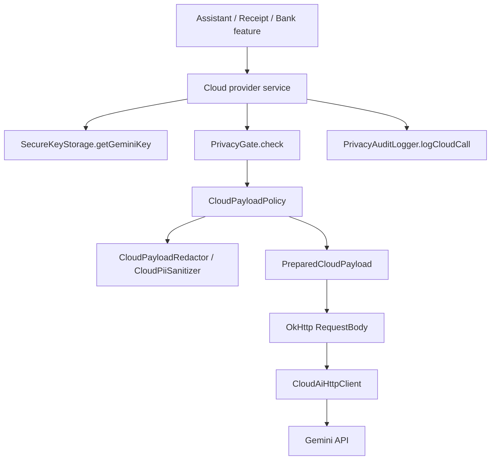
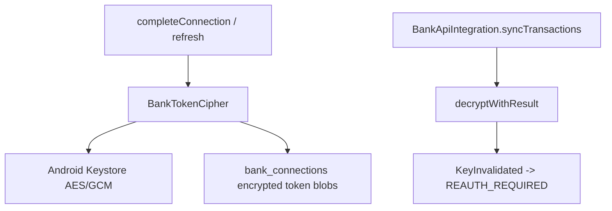
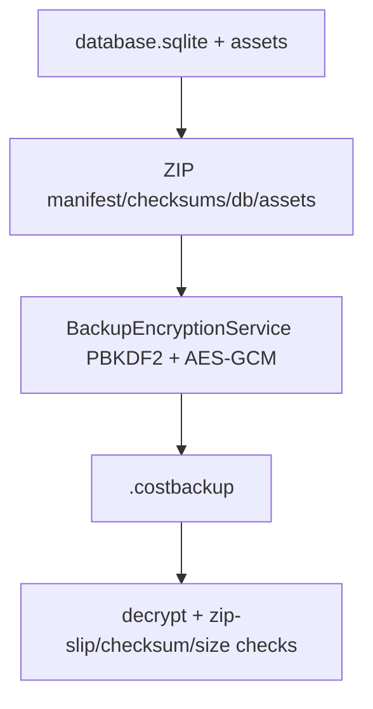
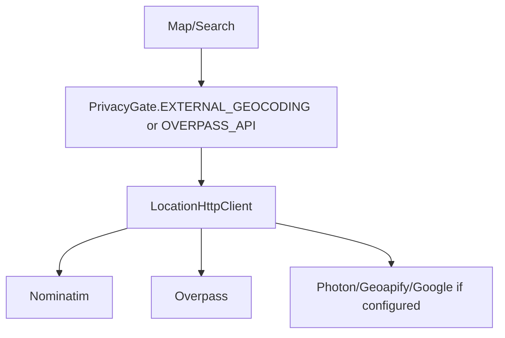

# P16 — Security / Network / Secrets Debug/Review Report

Target repository: `https://github.com/panospao7/Cost-agregator`  
Pinned commit: `83b798e849b4408b2bf683f52cb2746d37f7af16`  
Mode: **remote static review** using GitHub raw source/docs and prior P8/P10/P7/P12 findings.  
Build/test status: **NOT RUN** — no local checkout, `rg`, release build, packet capture, or Gradle execution available.

---

## 1. Executive verdict

Verdict: **RED / high YELLOW**

The app has several strong security primitives:

- API keys moved out of `BuildConfig` into `SecureKeyStorage`.
- Bank tokens use Android Keystore AES-GCM.
- Backup/export encryption uses PBKDF2-HMAC-SHA256 + AES-256-GCM.
- Cloud AI network clients have no visible logging interceptor.
- Major cloud providers inject `PrivacyGate` and `CloudPayloadPolicy`.
- Location/geocoding providers check privacy gates before network calls.
- Durable diagnostics have a central sanitizer.

However, it is not security-GREEN because important security invariants remain only partially enforced.

Highest-risk remaining issue:

```text
Cloud and privacy security is still caller-enforced in several places: CloudPayloadPolicy prepares/redacts payloads but does not itself fail closed when cloud is disabled, redaction is not semantically sufficient for merchant/item/financial data, and full network egress cannot be proven without static RequestBody/OkHttp guards.
```

Second-highest issue:

```text
Sensitive hashing is deterministic and purpose-derived instead of using an app-install Keystore secret, making hashes stable and guessable across installs.
```

Production safety assessment:

- **Bank token encryption:** mostly good, but backup/restore/re-auth and token redaction need tests.
- **API key storage:** improved; no BuildConfig key fields observed in Gradle.
- **Cloud AI:** privacy-gated in sampled providers, but redaction/fail-closed semantics remain incomplete.
- **Location network:** generally gated, but release logging needs final audit.
- **Backup/export:** encryption strong, but receipt asset filenames/paths and token-containing DB backups need policy hardening.
- **Release build security:** weak because release minification is disabled and debug/log stripping cannot be assumed.

---

## 2. Security/network flow summary

### Cloud AI request path



### Bank token path



### Backup encryption path



### Location network path



---

## 3. Files reviewed / sampled

### Production files reviewed

| File | Role | Notes |
|---|---|---|
| `data/security/BankTokenCipher.kt` | Bank access/refresh token encryption | Uses Android Keystore AES/GCM; surfaces key invalidation. |
| `data/security/SecureKeyStorage.kt` | API key storage | Uses `EncryptedSharedPreferences` and `MasterKey`; legacy BuildConfig migration helper exists. |
| `di/SecurityModule.kt` | Security DI | Provides `SecureKeyStorage` and notification transient key provider. |
| `di/NetworkModule.kt` | OkHttp clients | Provides separate location/cloud clients; no logging interceptor visible. |
| `di/NetworkQualifiers.kt` | Network qualifiers | Separates `LocationHttpClient` and `CloudAiHttpClient`. |
| `di/AiModule.kt` | AI provider binding | Cloud item/warranty providers are injected with `PrivacyGate`, `CloudPayloadPolicy`, and audit logger. |
| `di/PrivacyModule.kt` | Privacy/security bindings | Binds `DefaultSensitiveHashingService`, `DefaultCloudPayloadPolicy`, gates, audit logger. |
| `data/privacy/BackupEncryptionService.kt` | Backup/export encryption | PBKDF2-HMAC-SHA256 600k iterations + AES-GCM. |
| `data/backup/CostbackupBundle.kt` | `.costbackup` bundle | AES-GCM outer archive, zip-slip and size caps; logs paths/filenames in places. |
| `data/repository/DatabaseBackupRepositoryImpl.kt` | backup/restore/export | Debug raw export release-gated; asset restore logs filenames and paths. |
| `domain/privacy/CloudPayloadPolicy.kt` | cloud payload contract | Requires all cloud providers prepare payloads through policy. |
| `data/privacy/DefaultCloudPayloadPolicy.kt` | cloud payload implementation | Applies redaction/image suppression but does not fail closed on `cloudAllowed=false`. |
| `data/privacy/DefaultCloudPayloadRedactor.kt` | redaction | PII-pattern redaction; semantic merchant/item/amount gaps remain. |
| `data/ai/provider/CloudReceiptAssistService.kt` | Gemini receipt/bank statement cloud calls | Uses privacy gate and payload policy; API key in header. |
| `data/ai/provider/CloudReceiptItemCategorizationService.kt` | cloud item categorization | Injects gate/policy; parse path has broad catch. |
| `data/ai/provider/CloudWarrantyExtractionService.kt` | cloud warranty extraction | Injects gate/policy; parse path has broad catch. |
| `data/location/NominatimGeocodingService.kt` | geocoding | Checks privacy gate; logs hashes/safe route, but uses Android `Log` directly. |
| `data/location/OverpassNearbyService.kt` | nearby POI | Checks `OVERPASS_API` gate; sends exact coordinates by design after gate. |
| `data/location/CompositeGeocodingService.kt` | multi-provider geocoding | Checks external geocoding gate before cascade. |
| `domain/diagnostics/EventMetadataSanitizer.kt` | durable diagnostics sanitizer | Strong key/value sanitizer, but docs note email/URL not explicitly matched. |
| `domain/diagnostics/SafeEventMetadata.kt` | safe event metadata | Central builder with key-aware sanitization. |
| `domain/privacy/PrivacyAuditLogger.kt`, `PrivacyAuditContext.kt`, `SafePrivacyMetadata.kt` | privacy audit model | Typed context exists, raw map remains public API. |
| `data/privacy/PrivacyAuditLoggerImpl.kt` | audit persistence | Allowlist + length only; no value pattern scanning for allowlisted fields. |
| `data/privacy/DefaultSensitiveHashingService.kt` | HMAC/hash service | Deterministic key derived from purpose string; not Keystore-backed. |
| `domain/config/AppConfig.kt` | cloud/location constants | Contains provider base URLs/model names but no secrets. |
| `app/build.gradle.kts` | release/build config | No API key `buildConfigField`; release `isMinifyEnabled=false`. |
| `MainApplication.kt` | app startup | No Timber planting visible in sampled file; WorkManager factory configured. |

### Tests not run

No test files were executed. Security tests must be verified locally.

### Files intentionally not fully reviewed

| Area | Reason |
|---|---|
| Full `data/ai/provider/**` egress inventory | Requires local `rg` for every `RequestBody` / `OkHttp` call. |
| Full `data/location/**` providers | Nominatim/Overpass/Composite sampled; Photon/Geoapify/Google not fully opened. |
| Full UI/debug route visibility | Covered by P14 as needing source-wide audit. |
| Full release APK/decompilation check | Requires local release build. |
| Full backup/export serializers | P7/P12 sampled; not complete security scan. |
| Full network/TLS policy | No packet capture / generated network security config review. |

---

## 4. Architecture/doc comparison

| Area | Security expectation | Actual source | Status |
|---|---|---|---|
| API keys | No secrets in `BuildConfig`/APK fields | Gradle comment says geocoding API keys removed from BuildConfig; no `buildConfigField` found. | PASS/PARTIAL |
| API key storage | Runtime keys encrypted at rest | `SecureKeyStorage` uses `EncryptedSharedPreferences` + `MasterKey`. | PASS |
| Bank tokens | Encrypted, key invalidation handled | `BankTokenCipher` AES/GCM via Android Keystore; `decryptWithResult` distinguishes key invalidation. | PASS/PARTIAL |
| HMAC sensitive IDs | App-install secret / Keystore-backed HMAC | `DefaultSensitiveHashingService` derives key from purpose string. | **FAIL/PARTIAL** |
| Backup encryption | Strong KDF + AEAD | `BackupEncryptionService` uses PBKDF2-HMAC-SHA256 600k + AES-GCM. | PASS |
| Raw DB export | Debug-only and privacy-gated | `exportDatabase()` checks `BuildConfig.DEBUG` and `RAW_DATABASE_EXPORT`. | PASS/PARTIAL |
| Cloud calls | Provider checks privacy + uses payload policy | Sampled cloud providers inject/use `PrivacyGate` and `CloudPayloadPolicy`. | PARTIAL PASS |
| Cloud fail-closed | Payload policy itself should block if cloud disabled | `DefaultCloudPayloadPolicy.prepareText()` resolves redaction but does not check `cloudAllowed`. | **FAIL/PARTIAL** |
| Cloud semantic redaction | Redaction must remove merchant/item/financial sensitive details when required | Regex PII redaction remains insufficient for merchant/item/category/amount. | **FAIL/PARTIAL** |
| Network logging | No sensitive release logs | Uses `Log.d/w/e` and `Timber.w/e` in several providers; release minify disabled. | PARTIAL/FAIL |
| Diagnostics | Durable exception metadata sanitized | `EventMetadataSanitizer` strong, but privacy audit logger has weaker allowlist-only sanitization. | PARTIAL |
| Release hardening | Release should strip/debug-gate sensitive diagnostics | `release { isMinifyEnabled = false }`; debug screens/routes unverified. | **PARTIAL/FAIL** |

---

## 5. Secret inventory

| Secret / sensitive value | Storage / flow | Current handling | Risk |
|---|---|---|---|
| Gemini API key | `SecureKeyStorage.KEY_GEMINI` | EncryptedSharedPreferences, loaded by cloud providers. | Good; UI/key provisioning not audited. |
| Geoapify API key | `SecureKeyStorage.KEY_GEOAPIFY` | EncryptedSharedPreferences. | Provider usage not fully audited. |
| Google Places API key | `SecureKeyStorage.KEY_GOOGLE_PLACES` | EncryptedSharedPreferences. | Provider usage not fully audited. |
| Bank access token | `BankConnection.accessToken` | `BankTokenCipher.encryptIfNeeded`; DB stores encrypted blob. | Good encryption, but data-class `toString()` includes blob. |
| Bank refresh token | `BankConnection.refreshToken` | Same as access token; key invalidation surfaces reauth. | Good, but backup/restore reauth needs tests. |
| Backup passphrase | User-provided string | Used by `BackupEncryptionService`; not persisted in reviewed source. | String cannot be zeroized; acceptable but test memory/lifecycle impossible. |
| Backup encryption key | Derived per backup from passphrase + salt | PBKDF2 600k + AES-GCM. | Good; no versioned KDF header beyond bundle format needs future-proofing. |
| Notification transient key | `NotificationTransientKeyProvider` | Android Keystore provider bound. | Good; P1 privacy-before-extraction issue remains. |
| HMAC secret for sensitive hashes | `DefaultSensitiveHashingService` | Deterministic purpose-derived key. | **Weak: stable/guessable across installs.** |
| OAuth state / PKCE verifier | Bank OAuth future | Not implemented; demo OAuth URL only. | **Missing if real bank integration advertised.** |
| Provider transaction ID | Bank API | HMACed with deterministic service; not account-scoped enough in P10. | Weak cross-account semantics. |
| Receipt/OCR/email/bank raw text | DB/cloud/backup | Raw-storage policies partial; bank raw merchant issue remains. | High privacy risk. |
| Receipt image assets | files + backup | Skipped in redacted backup; included in encrypted backup. | Asset filename/path logs remain. |

---

## 6. Network egress matrix

| Network path | Client | Gate | Payload policy | Sensitive payload | Findings |
|---|---|---|---|---|---|
| Gemini receipt assist | `CloudAiHttpClient` | `CLOUD_AI_RECEIPT_ASSIST` or `RECEIPT_IMAGE_CLOUD_UPLOAD` | `prepareReceiptAssist` | OCR, merchant, amount, optional image | Good structure; semantic redaction and arbitrary image path validation need fixes. |
| Gemini bank statement validation | `CloudAiHttpClient` | `CLOUD_AI_BANK_STATEMENT` | `prepareBankStatementValidation` | Bank statement text | Strict redaction forced, but redaction quality must be tested. |
| Gemini item categorization | `CloudAiHttpClient` | `CLOUD_AI_ITEM_CATEGORIZATION` expected | `CloudPayloadPolicy` injected | Item names, amounts, categories | Needs full source verification; P8 found merchant/item/category semantic leak risk. |
| Gemini warranty extraction | `CloudAiHttpClient` | `CLOUD_AI_WARRANTY_EXTRACTION` expected | `CloudPayloadPolicy` injected | Product/merchant/OCR text | Injects policy/gate; parse/log redaction needs tests. |
| Daily briefing / dashboard | cloud AI service | `CLOUD_AI_DAILY_BRIEFING` expected | needs verification | spending summary | Engine/P8 partial; full request inventory needed. |
| Nominatim search/reverse | `LocationHttpClient` | `EXTERNAL_GEOCODING` | N/A | merchant query / GPS coords | Gate present; logs mostly hashes/safe routes; Android `Log` direct. |
| Overpass POI | `LocationHttpClient` | `OVERPASS_API` | N/A | exact lat/lon radius query | Gate present; network sends exact coordinates by feature design. |
| Geoapify / Google Places / Photon | `LocationHttpClient` likely | expected external geocoding | N/A | query/location/API key | Not fully opened; must audit. |
| Bank provider sync | future | demo-only currently | N/A | tokens/account data | Real OAuth/provider not implemented; security design missing. |
| Backup/export | local file, no network | privacy gates | N/A | database/assets | encrypted backup good; raw debug export release-gated. |

Required local search:

```bash
rg -n "OkHttpClient|Request\\.Builder|Retrofit|HttpUrl|\\.url\\(|\\.post\\(|RequestBody|WebSocket|URLConnection|openConnection" app/src/main/java
```

---

## 7. Encryption/key lifecycle matrix

| Component | Algorithm / key | Positives | Gaps |
|---|---|---|---|
| `BankTokenCipher` | Android Keystore AES/GCM/NoPadding, 256-bit key, randomized encryption | IV from cipher, GCM tag, key invalidation typed. | Object is static; token blob can leak via data-class `toString`; no token key rotation/version migration beyond version field. |
| `SecureKeyStorage` | AndroidX `EncryptedSharedPreferences`, `MasterKey.AES256_GCM` | Runtime API keys encrypted at rest. | User auth disabled; no key rotation implementation despite comment; key provisioning UI not audited. |
| `BackupEncryptionService` | PBKDF2-HMAC-SHA256, 600k iterations, 16-byte salt, 12-byte IV, AES-256-GCM | Strong baseline; streaming encryption. | Password is `String`; KDF parameters not versioned inside encrypted blob except outer bundle version; decrypt stream tag only checked when fully consumed. |
| `CostbackupBundle` | outer header + AES-GCM ciphertext; zip checksums inside | Magic/version header, checksum manifest, zip-slip prevention, decompression caps. | Logs output dir/path; receipt filenames in warnings; semantic table verification incomplete. |
| Notification transient crypto | Android Keystore provider bound | Good primitive. | P1 privacy flow captures before allowed gate, so encryption does not solve pre-consent capture. |
| Sensitive hashing | HMAC-SHA256 with key derived from purpose string | Purpose-isolated stable hashes. | Not secret; stable across installs; vulnerable to dictionary guessing for low-entropy values. |

---

## 8. Logging/redaction findings

| Area | Evidence | Risk | Fix |
|---|---|---|---|
| Release minification disabled | `app/build.gradle.kts` has `release { isMinifyEnabled = false }`. | Sensitive debug/log code not stripped; APK easier to reverse. | Enable R8/minify for release; add ProGuard rules; test no API keys/loggers. |
| Android `Log` used in location providers | `NominatimGeocodingService` and `OverpassNearbyService` use `Log.d/w/e`. | Logs execute in release unless guarded; policy said use Timber.d for sensitive data stripped in release. | Replace with Timber + debug-only/sanitized wrappers or `BuildConfig.DEBUG` for verbose logs. |
| Cloud provider errors return/record `e.message` | `CloudReceiptAssistService` returns `AiServiceError.Unknown(e.message)` in unknown catch paths. | Raw provider/parse messages can surface to UI/diagnostics if not sanitized downstream. | Map to error codes/correlation IDs; sanitize any exception message. |
| Privacy audit context weak sanitizer | `PrivacyAuditLoggerImpl.sanitizeContext` allowlists keys and length only. | `caller`, `provider`, `modelId`, `correlationId` can carry PII if caller misuses them; typed metadata is dropped. | Use `SafePrivacyMetadata` / value scanner; deprecate raw map. |
| Backup asset logs raw filenames/paths | `DatabaseBackupRepositoryImpl` logs receipt asset file names and final paths in restore. | Receipt filenames can contain merchant/user PII; internal paths leak. | Log receipt ID + hashed basename only; avoid absolute paths. |
| `BankConnection` data-class tokens | Token fields are data-class properties. | `toString()` includes encrypted token blobs if logged/exported/debugged. | Override `toString()` or wrap token fields in redacted type. |
| EventMetadataSanitizer partial URL/email coverage | Policy doc states URL/email not explicitly matched for durable exception messages. | URLs/emails may pass in exception messages. | Add URL/email/API-key patterns. |

---

## 9. Backup/export secret handling

| Path | Current status | Risk | Required tests |
|---|---|---|---|
| `.costbackup` normal | Encrypted bundle containing DB snapshot and optional receipt assets. | DB includes encrypted bank token blobs; restorable on same key context only; reauth needed if key unavailable. | `backup_restore_bank_tokens_reauth_on_key_missing`. |
| `.costbackup` redacted | Receipt images skipped when redacted. | DB raw sensitive fields may still exist unless anonymizer covers all tables; not fully audited. | `redacted_backup_no_raw_ocr_email_notification_bank`. |
| Raw DB export | Debug-only and privacy-gated. | UI route visibility and release build must be tested. | `raw_db_export_disabled_release`. |
| Generic expense export | P12 privacy-gated; no tokens expected. | Missing receipt links/conversion status; redacted export not fully proven. | `export_does_not_include_tokens_or_raw_bank_fields`. |
| Bank token backup | Encrypted tokens remain encrypted in DB. | If logged/debugged, encrypted blobs can leak; not raw but still secret-like. | `bank_connection_toString_redacts_tokens`. |
| Receipt assets | Encrypted backup may include images; redacted skips. | Restore logs filenames/paths; asset restore not atomic. | `asset_restore_warnings_redact_filename`. |
| AI chat/artifacts | Retention targets exist. | Backup/export classification not fully verified. | `backup_redacted_ai_artifacts_policy`. |

---

## 10. New findings

| ID | Severity | Type | Title | Evidence | Impact | Reproduction path | Recommended fix | Required tests | Cross-pipeline impact |
|---|---:|---|---|---|---|---|---|---|---|
| P16-SEC-001 | P1 | Cloud fail-closed | `CloudPayloadPolicy` does not itself block when cloud is disabled | `DefaultCloudPayloadPolicy.prepareText()` resolves policy and redacts if required but does not check `policy.cloudAllowed`; P8 also found this. | Any future caller using payload policy without separate gate can prepare/send cloud payload while cloud disabled. | Call `prepareText()` with cloud disabled; it returns payload. | Change interface to require capability; call `EffectiveCloudAiPolicy.requireAllowed(capability)` inside policy. | `cloud_payload_policy_fails_when_cloud_disabled`; `prepare_text_requires_capability`. | P8/P20/P14 |
| P16-SEC-002 | P1 | Cloud redaction | Redaction is not semantically sufficient for merchant/item/category/amount data | `DefaultCloudPayloadRedactor` mostly wraps `CloudPiiSanitizer`; receipt/warranty preserve amounts/dates; item categorization can include item names/category names. | `redactBeforeCloud=true` can still send sensitive purchases like medicine/item names and merchant/category detail. | Enable cloud redaction; categorize receipt with sensitive item/merchant. | Purpose-specific semantic redaction/pseudonymization; bucket/omit amounts where not essential. | `redact_before_cloud_removes_merchant_item_category_amount_when_required`. | P8/P3/P11/P20 |
| P16-SEC-003 | P1/P2 | Arbitrary file exfil path | `prepareReceiptAssist()` reads `imagePath` directly if `allowImage` and MIME allowed | `DefaultCloudPayloadPolicy` checks MIME string and size, then `File(imagePath).readBytes()`. | A compromised/misused caller could send any app-readable file as image bytes. | Pass a non-receipt app file path with image MIME and cloud image enabled. | Only accept receipt asset IDs/URIs from `ReceiptAssetStore`; canonical-parent allowlist; verify file header/MIME. | `receipt_assist_rejects_non_receipt_asset_path`; `image_mime_verified_by_content`. | P3/P8/P16 |
| P16-SEC-004 | P2/P1 | Weak HMAC secret | Sensitive hashes use deterministic purpose-derived key | `DefaultSensitiveHashingService` comment says production should use AndroidKeyStore; key is SHA-256 of purpose string. | Hashes are stable across installs and dictionary-guessable for merchants/accounts/provider IDs. | Hash same merchant/account across installs; same result. | Use app-install Keystore secret; version hashes/migrate. | `sensitive_hashing_different_across_installs`; `hash_version_migration`. | P8/P10/P13 |
| P16-SEC-005 | P2 | Privacy audit sanitization | `PrivacyAuditLoggerImpl` allowlists context keys by name/length only | `sanitizeContext()` accepts allowlisted values ≤200 chars; no value-pattern scan; `metadata` from typed context not allowed. | PII can persist under `caller`, `provider`, `modelId`, `correlationId`; safe metadata is dropped. | `privacyGate.check(..., mapOf("caller" to "john@example.com"))`. | Use `SafePrivacyMetadata`/EventMetadataSanitizer for values; deprecate raw `Map`; include sanitized metadata. | `audit_context_allowlisted_value_redacts_email`; `privacy_audit_metadata_preserved_safely`. | P8/P29 |
| P16-SEC-006 | P2 | Release hardening | Release minification/obfuscation disabled | `app/build.gradle.kts`: `release { isMinifyEnabled = false }`. | Easier reverse-engineering; debug/log code not stripped; contradicts reliance on stripped debug logs. | Build release APK and inspect strings/classes. | Enable R8/minify; add ProGuard rules; verify no secrets/log payloads. | `release_minify_enabled`; `release_apk_no_api_key_strings`. | P14/P15 |
| P16-SEC-007 | P2 | Release logging | Location providers use `android.util.Log` directly | Nominatim/Overpass use `Log.d/w/e`; logs include error messages, hashes, route metadata. | Release logs may expose sensitive-ish route/error info; policy prefers stripped/debug Timber. | Run release build and use map/geocoding. | Route logs through sanitized logger; gate verbose logs behind debug. | `release_location_logs_do_not_include_query_or_coords`. | P8/P19 |
| P16-SEC-008 | P2 | Token redaction | `BankConnection` data class includes encrypted token fields in generated `toString()` | Entity contains `accessToken`/`refreshToken` properties; no custom `toString()`. | Encrypted token blobs can leak in logs/debug/export; not raw but secret-like. | Log `BankConnection`; token blobs appear. | Override `toString()` or use redacted token wrapper. | `bank_connection_toString_redacts_tokens`. | P10/P14/P29 |
| P16-SEC-009 | P2 | Backup asset privacy | Receipt asset restore logs raw asset filenames and final paths | `DatabaseBackupRepositoryImpl` warnings/logs use `assetFile.name` and `finalFile.absolutePath`. | Filenames/paths can contain merchant/user PII; internal paths leak to logs/journal/warnings. | Restore asset named with merchant/user info. | Log receipt ID + hashed basename; never absolute target path. | `asset_restore_logs_redact_filename_and_path`. | P7/P3 |
| P16-SEC-010 | P2 | Exception redaction | Durable sanitizer does not explicitly match URLs/emails/API keys | `SENSITIVE_DIAGNOSTICS_POLICY.md` notes URL/email gaps. | Exception messages containing URL/email/API key can persist if not caught by other patterns. | Throw exception with email/URL/API-key-like string. | Add email, URL, API-key, Greek AFM/tax ID patterns. | `diagnostic_exception_redacts_email_url_api_key_afm`. | P8/P29 |
| P16-SEC-011 | P2 | Cloud response/error UI | Cloud provider error paths return `e.message` in `AiServiceError.Unknown` | `CloudReceiptAssistService` returns `AiServiceError.Unknown(e.message)` in generic catch. | Raw provider/parse exception text may reach UI/log if downstream not sanitized. | Force exception with message containing prompt fragment/path. | Return error code + correlation ID; sanitize message before UI/durable storage. | `cloud_unknown_error_does_not_expose_exception_message`. | P8/P14 |
| P16-SEC-012 | P2 | Backup KDF/versioning | Backup ciphertext does not independently encode KDF parameters except outer format version | `BackupEncryptionService` prepends salt+IV; `CostbackupBundle` has format version. | Future KDF changes need careful migration; cannot tune per-bundle without relying on external version. | Change iteration count; old backup decrypt semantics ambiguous unless version routed. | Include KDF algorithm/iterations/salt/iv in explicit encrypted header/manifest. | `costbackup_v1_kdf_params_roundtrip`; backward compatibility tests. | P7/P12 |
| P16-SEC-013 | P2 | Backup token restore | Bank token blobs are in DB backup but Android Keystore key is device-local | Bank tokens encrypted with device Keystore; DB snapshot includes ciphertext. | Restored backup on different device may have undecryptable tokens; should require reauth cleanly. | Backup on device A, restore on device B, sync bank. | Detect decrypt failure/key mismatch and mark bank connection reauth required without log leak. | `restore_on_new_device_marks_bank_reauth_required`. | P7/P10 |
| P16-SEC-014 | P2 | Network provider inventory | Full OkHttp/RequestBody inventory not run | Multiple providers exist; only major files sampled. | Ungated provider can bypass privacy/payload policy. | Add/direct-search provider with raw `RequestBody`. | Static guard: cloud/network request body must be from approved payload/gate path. | `all_cloud_request_bodies_from_prepared_payload`; `all_location_requests_privacy_gated`. | P8/P15 |
| P16-SEC-015 | P3 | Test helper drift | `CloudReceiptAssistService.buildRequestBodyForTest()` uses `input.redactBeforeCloud` directly | Internal test helper bypasses policy for tests. | Low production risk, but static guards may need allowlist; tests can mask policy behavior. | Tests call helper and pass though production policy broken. | Prefer test helper that accepts `PreparedCloudPayload`; keep allowlisted if needed. | policy-based request body tests. | P8 tests |
| P16-SEC-016 | P3 | Certificate pinning | No certificate pinning/network security config observed | OkHttp clients use platform TLS only. | MITM resistance depends on Android CA store; usually acceptable but weaker for financial/cloud. | User device has malicious CA. | Decide product policy; optional certificate pinning for Gemini/bank/location if needed. | Network security config test if implemented. | P10/P20 |

---

## 11. Universal contract audit

### Secret storage

Status: **PARTIAL PASS**

Good:
- `SecureKeyStorage` uses encrypted preferences.
- No `buildConfigField` API keys observed.
- Bank tokens use Keystore AES-GCM.
- Backup encryption uses strong KDF/AEAD.

Gaps:
- Sensitive hashing is not secret.
- Bank token blobs can leak via data-class `toString`.
- API key provisioning/rotation not reviewed.

### Network privacy gates

Status: **PARTIAL PASS**

Good:
- Cloud receipt assist checks privacy gate before request.
- Bank statement cloud method self-defends with gate.
- Nominatim/Composite/Overpass check privacy gate.

Gaps:
- Full provider inventory missing.
- Payload policy itself does not fail closed.
- UI privacy-denied states not proven.

### Cloud payload safety

Status: **PARTIAL / FAIL**

Good:
- `CloudPayloadPolicy` abstraction exists.
- Sampled providers inject/use policy.
- Images suppressed when redaction required.

Gaps:
- Policy does not block on cloud disabled.
- Semantic redaction insufficient.
- Direct file path image read needs allowlist/canonical validation.

### Release logging / diagnostics

Status: **PARTIAL / FAIL**

Good:
- `EventMetadataSanitizer` and `SafeEventMetadata` are strong.
- Cloud/location logs often hash query/body preview.

Gaps:
- Release minification disabled.
- Android `Log` direct usage.
- Privacy audit logger weaker than diagnostics sanitizer.
- Asset filename/path logging.

### Backup/export secrets

Status: **PARTIAL**

Good:
- `.costbackup` encrypted.
- Raw DB export debug-only and privacy-gated.
- Redacted backup skips receipt images.

Gaps:
- Backup verifier/table redaction incomplete from P13.
- Bank token restore reauth not fully tested.
- Asset filename/path leak.
- Redacted backup raw table coverage not proven.

### Cancellation/security cleanup

Status: **PARTIAL**

Good:
- Some cloud/network paths rethrow `CancellationException`.
- Response bodies use `.use` in sampled paths.

Gaps:
- Some parse/helper `runCatching` paths remain.
- Backup passphrase as String cannot be zeroized.

---

## 12. Test coverage assessment

| Behavior | Existing test? | Missing test? | Recommended test |
|---|---:|---:|---|
| API keys absent from BuildConfig/release strings | Not run | Yes | `release_apk_has_no_api_key_buildconfig_fields` |
| SecureKeyStorage encrypts/retrieves keys | Not run | Maybe | `secure_key_storage_roundtrip_and_delete` |
| Bank token key invalidation -> reauth | Not run | Yes | `bank_token_key_invalidated_marks_reauth_required` |
| BankConnection `toString` redacts tokens | Not run | Yes | `bank_connection_toString_redacts_tokens` |
| Cloud policy blocks when cloud disabled | Not fixed | Yes | `cloud_payload_policy_fails_when_cloud_disabled` |
| Semantic cloud redaction | Not fixed | Yes | `receipt_item_redaction_removes_merchant_item_amount_category` |
| Prepared payload only for cloud requests | Not run | Yes | static `RequestBody` guard |
| Receipt assist rejects arbitrary image path | Not fixed | Yes | `receipt_assist_rejects_non_asset_path` |
| Location network denied by privacy gate | Partially claimed | Yes | `external_geocoding_denied_no_http_call` |
| Overpass denied by privacy gate | Partially claimed | Yes | `overpass_denied_no_http_call` |
| Release location logs sanitized | Not run | Yes | log-capture/release test |
| Backup wrong password leaves DB unchanged | P7 likely | Must verify | `wrong_backup_password_live_db_unchanged` |
| Asset restore filename redaction | Not fixed | Yes | `asset_restore_logs_redact_filename` |
| Diagnostic redacts email/URL/API key | Partial | Yes | `diagnostic_exception_redacts_email_url_api_key` |
| Backup restore on new device bank reauth | Not run | Yes | `restored_bank_tokens_require_reauth_when_key_missing` |
| Release minify enabled | Not fixed | Yes | Gradle assertion test |

---

## 13. Recommended fix plan

### PR 1 — Cloud fail-closed and semantic redaction

Fix:
1. Change `CloudPayloadPolicy.prepare*` to require `PrivacyCapability`.
2. Call `EffectiveCloudAiPolicy.requireAllowed(capability)` inside policy.
3. Add semantic redaction for merchants/items/categories/amounts.
4. Add HTTP body capture tests for each cloud provider.

Acceptance:
- Cloud disabled means payload preparation fails.
- Redacted cloud request body has no raw merchant/item/category/amount where policy requires.

### PR 2 — Secret/hash/token hardening

Fix:
1. Replace deterministic `DefaultSensitiveHashingService` key with AndroidKeyStore app-install secret.
2. Add hash versioning/migration plan.
3. Override `BankConnection.toString()` or introduce redacted token wrapper.
4. Add bank restore reauth handling tests.

Acceptance:
- Same value hashes differently across fresh installs.
- Token blobs never appear in `toString`, logs, UI, or diagnostics.

### PR 3 — Network egress guard

Fix:
1. Add static guard for every `RequestBody`/OkHttp call:
   - cloud AI must use `PreparedCloudPayload`;
   - location must check privacy gate;
   - bank provider sync must have OAuth/token redaction.
2. Audit all remaining providers: Photon, Geoapify, Google Places, dashboard briefing, query interpretation, review explanation, categorization/dedupe.
3. Add tests with fake OkHttp client asserting no call on privacy denial.

Acceptance:
- `all_cloud_request_bodies_from_prepared_payload` passes.
- `all_location_requests_privacy_gated` passes.

### PR 4 — Release logging and build hardening

Fix:
1. Enable release minification/R8.
2. Add ProGuard rules.
3. Replace direct `Log.d/v` in production with sanitized Timber/debug-only wrappers.
4. Audit all `Timber.w/e`, `Log.w/e`, `e.message`, `localizedMessage`.

Acceptance:
- Release APK has no known API keys.
- Release logs never contain merchant, amount, OCR, notification, bank text, path, token.

### PR 5 — Backup/export secret policy

Fix:
1. Redact receipt asset filenames/paths in logs/journal/warnings.
2. Add explicit bank-token restore reauth flow.
3. Add redacted backup coverage for raw OCR/email/notification/bank/AI tables.
4. Version backup encryption KDF parameters if format evolves.

Acceptance:
- Redacted backup contains no raw sensitive fields.
- Wrong password/tampered backup leaves live DB unchanged.
- Asset warnings never show raw filename/path.

### PR 6 — Privacy audit/diagnostics hardening

Fix:
1. Deprecate raw `Map` audit context.
2. Route allowlisted values through `SafePrivacyMetadata`/value sanitizer.
3. Preserve sanitized typed metadata.
4. Add URL/email/API key/tax ID patterns to durable sanitizer.

Acceptance:
- Privacy audit cannot persist raw PII under allowlisted fields.
- Durable exception messages redact email/URL/API-key-like content.

---

## 14. Required local validation commands

```bash
git rev-parse HEAD
git status --short
./gradlew :app:assembleDebug --stacktrace
./gradlew :app:assembleRelease --stacktrace
./gradlew :app:testDebugUnitTest --stacktrace
./gradlew :app:check --stacktrace
python3 scripts/verify_privacy_boundaries.py
```

Security-specific searches:

```bash
rg -n "apiKey|API_KEY|token|secret|password|passphrase|Authorization|Bearer|x-api-key|client_secret|refreshToken|accessToken|KeyStore|Encrypted|Cipher|GCM|PBKDF2" app/src/main/java app/src/test app/src/androidTest

rg -n "OkHttpClient|Request\\.Builder|Retrofit|HttpUrl|\\.url\\(|\\.post\\(|RequestBody|WebSocket|URLConnection|openConnection" app/src/main/java

rg -n "HttpLoggingInterceptor|Timber\\.|Log\\.|printStackTrace|localizedMessage|e\\.message|exception\\.message" app/src/main/java

rg -n "BuildConfig.DEBUG|Debug|Raw|NoOp|Fake|Stub|Demo" app/src/main/java/com/yourname/expensetracker app/src/main/java/com/yourname/expensetracker/di
```

Suggested focused tests:

```bash
./gradlew :app:testDebugUnitTest --tests "*SecureKeyStorage*" --stacktrace
./gradlew :app:testDebugUnitTest --tests "*BankToken*" --stacktrace
./gradlew :app:testDebugUnitTest --tests "*CloudPayload*" --stacktrace
./gradlew :app:testDebugUnitTest --tests "*Redaction*" --stacktrace
./gradlew :app:testDebugUnitTest --tests "*PrivacyAudit*" --stacktrace
./gradlew :app:testDebugUnitTest --tests "*BackupEncryption*" --stacktrace
./gradlew :app:testDebugUnitTest --tests "*Geocoding*Privacy*" --stacktrace
```

Release assertions to add:
- `release_minify_enabled`
- `release_apk_no_buildconfig_api_keys`
- `release_no_http_body_logging`
- `debug_routes_hidden_release`

---

## 15. Final production-readiness decision

Verdict: **RED / high YELLOW**

The app has made real security progress, especially around API key storage, bank token encryption, backup encryption, and cloud payload abstraction. But the security model still has key gaps:

1. Cloud payload policy is not fail-closed by itself.
2. Cloud redaction is not semantically strong enough.
3. Sensitive hashing is deterministic and not secret.
4. Release build hardening is weak (`minifyEnabled=false`).
5. Full network egress inventory is not enforced by static guards.
6. Privacy audit value sanitization is weaker than durable diagnostic sanitization.
7. Bank token blobs and receipt asset filenames/paths can leak through logs/debug surfaces.
8. Backup/export redaction coverage for every sensitive table is not proven.

Minimum before GREEN:

- cloud payload policy must enforce capability/cloudAllowed,
- semantic redaction must pass captured-request tests,
- sensitive hashing must use Keystore-backed install secret,
- release minification/logging policy must be enforced,
- static network egress guards must pass,
- privacy audit raw map/value leaks must be closed,
- backup/export/token/asset redaction tests must pass.

---

## 16. Source index

Repository commit:
- https://github.com/panospao7/Cost-agregator/commit/83b798e849b4408b2bf683f52cb2746d37f7af16

Security / secrets:
- `BankTokenCipher.kt`  
  https://raw.githubusercontent.com/panospao7/Cost-agregator/83b798e849b4408b2bf683f52cb2746d37f7af16/app/src/main/java/com/yourname/expensetracker/data/security/BankTokenCipher.kt
- `SecureKeyStorage.kt`  
  https://raw.githubusercontent.com/panospao7/Cost-agregator/83b798e849b4408b2bf683f52cb2746d37f7af16/app/src/main/java/com/yourname/expensetracker/data/security/SecureKeyStorage.kt
- `SecurityModule.kt`  
  https://raw.githubusercontent.com/panospao7/Cost-agregator/83b798e849b4408b2bf683f52cb2746d37f7af16/app/src/main/java/com/yourname/expensetracker/di/SecurityModule.kt
- `DefaultSensitiveHashingService.kt`  
  https://raw.githubusercontent.com/panospao7/Cost-agregator/83b798e849b4408b2bf683f52cb2746d37f7af16/app/src/main/java/com/yourname/expensetracker/data/privacy/DefaultSensitiveHashingService.kt

Network / AI:
- `NetworkModule.kt`  
  https://raw.githubusercontent.com/panospao7/Cost-agregator/83b798e849b4408b2bf683f52cb2746d37f7af16/app/src/main/java/com/yourname/expensetracker/di/NetworkModule.kt
- `NetworkQualifiers.kt`  
  https://raw.githubusercontent.com/panospao7/Cost-agregator/83b798e849b4408b2bf683f52cb2746d37f7af16/app/src/main/java/com/yourname/expensetracker/di/NetworkQualifiers.kt
- `AiModule.kt`  
  https://raw.githubusercontent.com/panospao7/Cost-agregator/83b798e849b4408b2bf683f52cb2746d37f7af16/app/src/main/java/com/yourname/expensetracker/di/AiModule.kt
- `CloudPayloadPolicy.kt`  
  https://raw.githubusercontent.com/panospao7/Cost-agregator/83b798e849b4408b2bf683f52cb2746d37f7af16/app/src/main/java/com/yourname/expensetracker/domain/privacy/CloudPayloadPolicy.kt
- `DefaultCloudPayloadPolicy.kt`  
  https://raw.githubusercontent.com/panospao7/Cost-agregator/83b798e849b4408b2bf683f52cb2746d37f7af16/app/src/main/java/com/yourname/expensetracker/data/privacy/DefaultCloudPayloadPolicy.kt
- `DefaultCloudPayloadRedactor.kt`  
  https://raw.githubusercontent.com/panospao7/Cost-agregator/83b798e849b4408b2bf683f52cb2746d37f7af16/app/src/main/java/com/yourname/expensetracker/data/privacy/DefaultCloudPayloadRedactor.kt
- `CloudReceiptAssistService.kt`  
  https://raw.githubusercontent.com/panospao7/Cost-agregator/83b798e849b4408b2bf683f52cb2746d37f7af16/app/src/main/java/com/yourname/expensetracker/data/ai/provider/CloudReceiptAssistService.kt
- `CloudReceiptItemCategorizationService.kt`  
  https://raw.githubusercontent.com/panospao7/Cost-agregator/83b798e849b4408b2bf683f52cb2746d37f7af16/app/src/main/java/com/yourname/expensetracker/data/ai/provider/CloudReceiptItemCategorizationService.kt
- `CloudWarrantyExtractionService.kt`  
  https://raw.githubusercontent.com/panospao7/Cost-agregator/83b798e849b4408b2bf683f52cb2746d37f7af16/app/src/main/java/com/yourname/expensetracker/data/ai/provider/CloudWarrantyExtractionService.kt

Location:
- `NominatimGeocodingService.kt`  
  https://raw.githubusercontent.com/panospao7/Cost-agregator/83b798e849b4408b2bf683f52cb2746d37f7af16/app/src/main/java/com/yourname/expensetracker/data/location/NominatimGeocodingService.kt
- `OverpassNearbyService.kt`  
  https://raw.githubusercontent.com/panospao7/Cost-agregator/83b798e849b4408b2bf683f52cb2746d37f7af16/app/src/main/java/com/yourname/expensetracker/data/location/OverpassNearbyService.kt
- `CompositeGeocodingService.kt`  
  https://raw.githubusercontent.com/panospao7/Cost-agregator/83b798e849b4408b2bf683f52cb2746d37f7af16/app/src/main/java/com/yourname/expensetracker/data/location/CompositeGeocodingService.kt

Backup/export:
- `BackupEncryptionService.kt`  
  https://raw.githubusercontent.com/panospao7/Cost-agregator/83b798e849b4408b2bf683f52cb2746d37f7af16/app/src/main/java/com/yourname/expensetracker/data/privacy/BackupEncryptionService.kt
- `CostbackupBundle.kt`  
  https://raw.githubusercontent.com/panospao7/Cost-agregator/83b798e849b4408b2bf683f52cb2746d37f7af16/app/src/main/java/com/yourname/expensetracker/data/backup/CostbackupBundle.kt
- `DatabaseBackupRepositoryImpl.kt`  
  https://raw.githubusercontent.com/panospao7/Cost-agregator/83b798e849b4408b2bf683f52cb2746d37f7af16/app/src/main/java/com/yourname/expensetracker/data/repository/DatabaseBackupRepositoryImpl.kt

Diagnostics/privacy audit:
- `EventMetadataSanitizer.kt`  
  https://raw.githubusercontent.com/panospao7/Cost-agregator/83b798e849b4408b2bf683f52cb2746d37f7af16/app/src/main/java/com/yourname/expensetracker/domain/diagnostics/EventMetadataSanitizer.kt
- `SafeEventMetadata.kt`  
  https://raw.githubusercontent.com/panospao7/Cost-agregator/83b798e849b4408b2bf683f52cb2746d37f7af16/app/src/main/java/com/yourname/expensetracker/domain/diagnostics/SafeEventMetadata.kt
- `PrivacyAuditLoggerImpl.kt`  
  https://raw.githubusercontent.com/panospao7/Cost-agregator/83b798e849b4408b2bf683f52cb2746d37f7af16/app/src/main/java/com/yourname/expensetracker/data/privacy/PrivacyAuditLoggerImpl.kt
- `PrivacyAuditLogger.kt`  
  https://raw.githubusercontent.com/panospao7/Cost-agregator/83b798e849b4408b2bf683f52cb2746d37f7af16/app/src/main/java/com/yourname/expensetracker/domain/privacy/PrivacyAuditLogger.kt
- `PrivacyAuditContext.kt`  
  https://raw.githubusercontent.com/panospao7/Cost-agregator/83b798e849b4408b2bf683f52cb2746d37f7af16/app/src/main/java/com/yourname/expensetracker/domain/privacy/PrivacyAuditContext.kt
- `SafePrivacyMetadata.kt`  
  https://raw.githubusercontent.com/panospao7/Cost-agregator/83b798e849b4408b2bf683f52cb2746d37f7af16/app/src/main/java/com/yourname/expensetracker/domain/privacy/SafePrivacyMetadata.kt
- `SENSITIVE_DIAGNOSTICS_POLICY.md`  
  https://raw.githubusercontent.com/panospao7/Cost-agregator/83b798e849b4408b2bf683f52cb2746d37f7af16/docs/architecture/SENSITIVE_DIAGNOSTICS_POLICY.md

Build/config:
- `AppConfig.kt`  
  https://raw.githubusercontent.com/panospao7/Cost-agregator/83b798e849b4408b2bf683f52cb2746d37f7af16/app/src/main/java/com/yourname/expensetracker/domain/config/AppConfig.kt
- `app/build.gradle.kts`  
  https://raw.githubusercontent.com/panospao7/Cost-agregator/83b798e849b4408b2bf683f52cb2746d37f7af16/app/build.gradle.kts