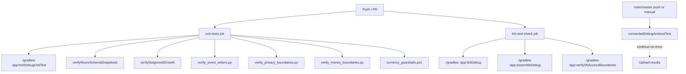

# P17 — CI / Static Guardrail Enforcement Debug/Review Report

Target repository: `https://github.com/panospao7/Cost-agregator`  
Pinned commit: `83b798e849b4408b2bf683f52cb2746d37f7af16`  
Mode: **remote static review** using GitHub raw source/docs and prior pipeline/engine findings.  
Build/test status: **NOT RUN** — no local checkout, GitHub Actions run result, Gradle execution, or `rg` available.

---

## 1. Executive verdict

Verdict: **RED / high YELLOW**

The project has an unusually large and valuable guardrail system already:

- GitHub Actions CI exists.
- Unit tests run on PR/push.
- Room schema snapshot verification runs.
- Ignored-test count guard exists.
- Event writer guard exists.
- Privacy boundary guard exists.
- Money boundary guard exists.
- Currency guardrails run.
- DB access boundary guard is wired through Gradle.
- Gradle has additional guards for lifecycle bypasses, raw money aggregates, direct time calls, and schema snapshots.

However, CI/guardrail enforcement is still not production-GREEN because the current CI does **not** reliably enforce all architecture laws the codebase depends on.

Highest-risk remaining issue:

```text
The GitHub Actions workflow does not run `./gradlew :app:check`, so several Gradle-wired guards are not executed in CI, including checkLifecycleBypasses, checkLifecycleBypass, checkRawMoneyAggregates, and checkDirectTimeCalls.
```

Second-highest issue:

```text
The guard coverage is incomplete: no worker full-guard/lease guard, no cancellation/runCatching guard, no DI/debug-release guard, no import lifecycle guard, no receipt-link direct-update guard, no semantic cloud-redaction guard, and no true migration execution matrix.
```

Production safety assessment:

- CI catches some important classes of bugs.
- CI does **not** yet enforce the full set of architectural laws found in the pipeline/engine/P13–P16 reviews.
- Several serious bugs already found would have passed current guards.

---

## 2. CI / guardrail flow summary

Current CI flow from `.github/workflows/ci.yml` appears intended as:



Missing from current CI flow:

```text
./gradlew :app:check
python3 scripts/verify_source_provenance_boundaries.py
scripts/guards/check_raw_money_aggregates.kts directly
scripts/guards/check_direct_time_calls.kts directly
scripts/guards/check_lifecycle_bypasses.kts directly
scripts/guardrails/dao-access-check.kts directly
pytest scripts/test_verify_db_access_boundaries.py
release build / release security checks
blocking instrumented tests on PR
```

Important note:
- The raw workflow file renders as only a few very long physical lines. It must be validated locally/GitHub-side to ensure YAML syntax and job boundaries behave exactly as intended.

---

## 3. Files reviewed

### CI / Gradle files

| File | Role | Notes |
|---|---|---|
| `.github/workflows/ci.yml` | GitHub Actions CI | Runs unit tests, schema snapshot guard, ignored-growth guard, event/privacy/money/currency guards, lint, assembleDebug, DB boundary guard, and non-blocking instrumented tests. |
| `app/build.gradle.kts` | Gradle config/tasks | Defines `verifyRoomSchemaSnapshots`, `verifyNoIgnoredGrowth`, `checkLifecycleBypasses`, `checkRawMoneyAggregates`, `checkDirectTimeCalls`, `checkLifecycleBypass`, and `verifyDbAccessBoundaries`; wires several to `check`. |
| `settings.gradle.kts` | project setup | Single `:app` module. |
| `build.gradle.kts` | root build file | Essentially empty/minimal. |
| `gradle/libs.versions.toml` | plugin/dependency versions | AGP/Kotlin/Compose/version catalog. |

### Script guards

| Script | Role | Notes |
|---|---|---|
| `scripts/verify_privacy_boundaries.py` | Privacy/network/cloud static guard | Enforces G1–G14 including cloud prepared payload and geocoding self-gating. |
| `scripts/verify_db_access_boundaries.py` | DAO mutation / barrier guard | Scans direct DAO calls vs allowlist; has CI failure mode. |
| `scripts/verify_event_writers.py` | Event writer construction guard | Uses allowlist; coverage too narrow for recurring/receipt state-event atomicity. |
| `scripts/verify_money_boundaries.py` | Currency/money guard | Enforces selected G-MONEY rules. |
| `scripts/verify_source_provenance_boundaries.py` | Provenance metadata/source-link guard | Exists but is not visibly run in CI. |
| `scripts/currency_guardrails.ps1` | Currency guard | Runs in CI. |
| `scripts/guards/check_lifecycle_bypasses.kts` | lifecycle bypass guard | Wired to Gradle `check`, but CI does not run `check`. |
| `scripts/guards/check_raw_money_aggregates.kts` | raw Double money aggregate guard | Wired to Gradle `check`, but CI does not run `check`. |
| `scripts/guards/check_direct_time_calls.kts` | direct time calls guard | Wired to Gradle `check`, but CI does not run `check`. |
| `scripts/guardrails/dao-access-check.kts` | DAO approved file guard | Exists, not visibly run in CI. |
| `scripts/guardrails/dao-approved-files.txt` | DAO approved files list | Older/parallel allowlist; can drift from YAML allowlist. |
| `scripts/event_writer_allowlist.txt` | event writer allowlist | Allows several coordinators/transition files. |
| `config/db_access_allowlist.yml` | DB access allowlist | Very broad and includes temporary/future classes and `requires_write_barrier:false` entries. |
| `scripts/test_verify_db_access_boundaries.py` | Python tests for DB guard | Exists but not run by CI unless separately invoked. |

### Test directories sampled

| Area | Notes |
|---|---|
| `app/src/test/java/com/yourname/expensetracker/contracts` | Contains contract tests: cancellation, lifecycle barrier, money, privacy storage, side effects, recurring deactivate. |
| broader `app/src/test`, `app/src/androidTest` | Not fully inventoried; prior reviews found stale/ignored tests. |

---

## 4. Architecture/doc comparison

| Area | Architecture law | Current guard status | Status |
|---|---|---|---|
| All expense writes through coordinator | Gradle lifecycle bypass guards and DB guard exist. | CI does not run `:app:check`, so some Gradle-wired lifecycle guards are skipped; DB guard runs separately. | PARTIAL |
| All DB writes behind barrier | `verify_db_access_boundaries.py` exists and CI runs Gradle `verifyDbAccessBoundaries`. | Allowlist is broad and permits current risky paths. | PARTIAL/FAIL |
| Receipt links through link service | No dedicated guard found. | P3 found direct legacy field mutation. | FAIL |
| Recurring events through writer / atomic helper | Event writer guard exists. | P4 found direct event DAO/state-event atomicity gaps, so guard coverage insufficient. | PARTIAL/FAIL |
| Workers guarded and leased | No complete static guard found. | P9 found `NotificationIntakeWorker` bypass and lease implementation bug. | FAIL |
| No raw cloud payloads | Privacy guard has G3 for `Request.Builder()` in cloud provider package. | Does not enforce policy fail-closed or semantic redaction. | PARTIAL |
| Network privacy gating | Privacy guard G14 covers location providers with `PrivacyGate`. | Full OkHttp inventory not proven; provider naming/path based. | PARTIAL |
| No raw money sums | Python money guard runs; KTS raw money guard wired only to `check`, which CI skips. | P5 raw Block Party sum passed current setup. | PARTIAL/FAIL |
| No cancellation swallowing | Some contract tests exist. | No broad static guard for `runCatching`/`catch(Exception)` with CE rethrow. | FAIL |
| DI debug/release safety | No static guard found. | P15/P16 found fake/demo/release hardening gaps. | FAIL |
| Import-created expenses through lifecycle | No dedicated import guard. | Importers use lifecycle for expenses but direct category DAO; no import barrier guard. | PARTIAL |
| Migration correctness | Room schema snapshot guard exists. | Does not execute migration matrix; P13 found runtime migration registry/baseline risk. | PARTIAL/FAIL |

---

## 5. Guard script inventory

| Guard | Exists | Run in GitHub Actions? | Wired to Gradle `check`? | Main gap |
|---|---:|---:|---:|---|
| `verify_privacy_boundaries.py` | yes | yes | no direct Gradle task seen | Does not cover semantic redaction/fail-closed cloud policy. |
| `verify_db_access_boundaries.py` | yes | yes via `:app:verifyDbAccessBoundaries` | yes | Broad allowlist; some risky paths allowed. |
| `verify_event_writers.py` | yes | yes with `--fail-on-violation` | no direct Gradle task seen | Allowlist/coverage misses state-event atomicity and recurring direct writes. |
| `verify_money_boundaries.py` | yes | yes | no direct Gradle task seen | Scoped rules missed found raw money issue; KTS raw-money guard not run. |
| `verify_source_provenance_boundaries.py` | yes | **no** | no | Not enforced in CI. |
| `currency_guardrails.ps1` | yes | yes | no | PowerShell availability okay on Ubuntu via pwsh; still needs result proof. |
| `check_lifecycle_bypasses.kts` | yes | only if `:app:check` runs | yes | CI does not run `:app:check`. |
| `check_raw_money_aggregates.kts` | yes | only if `:app:check` runs | yes | CI does not run `:app:check`; would catch broader raw sums. |
| `check_direct_time_calls.kts` | yes | only if `:app:check` runs | yes | CI does not run `:app:check`. |
| `dao-access-check.kts` | yes | no | no | Older/parallel guard not enforced. |
| `verifyRoomSchemaSnapshots` | Gradle task | yes | yes | Snapshot presence only; not migration execution. |
| `verifyNoIgnoredGrowth` | Gradle task | yes | no | Threshold 310 permits huge ignored-test backlog. |

---

## 6. CI invocation matrix

| CI job | Runs on PR? | Blocking? | Commands | Gaps |
|---|---:|---:|---|---|
| `unit-tests` | yes | yes | `:app:testDebugUnitTest`, `:app:verifyRoomSchemaSnapshots`, `:app:verifyNoIgnoredGrowth`, event/privacy/money/currency scripts | Does not run `:app:check`; does not run source provenance guard; does not run script unit tests. |
| `lint-and-check` | yes | yes | `:app:lintDebug`, `:app:assembleDebug`, `:app:verifyDbAccessBoundaries` | Name says check but does not run `:app:check`; release build not run. |
| `instrumented-tests` | no for PR; push/main/manual only | **non-blocking** due `continue-on-error: true` | `:app:connectedDebugAndroidTest` on API 34 | Restore/UI/Room Android tests cannot block PR. |
| Release/security | no | no | none | No `assembleRelease`, minify, secret string, debug-route, or release logging checks. |
| Static security/network | partial | partial | privacy script only | No full OkHttp/RequestBody inventory guard beyond cloud provider package. |

Potential workflow-format concern:
- The raw `ci.yml` renders as three very long physical lines with many YAML keys on the same line. This should be validated with GitHub Actions or `yamllint` because intended job parsing cannot be proven from static raw rendering.

---

## 7. Guard coverage gaps

| Required guard | Current status | Why insufficient | Severity |
|---|---|---|---:|
| DAO mutation owner guard | Exists | Allowlist too broad; future/temporary entries; importers/category writes allowed; no expiry enforcement. | P1 |
| Write barrier guard | Partial | Class-level allowlist cannot prove every public method checks barrier immediately before mutation. | P1 |
| Worker full guard | Missing | Does not enforce every `CoroutineWorker` uses `runGuardedWithContext`/lease/run log. | P1 |
| Worker lease guard | Missing | Would not catch `NotificationIntakeWorker` invisibility or same-name lease implementation bug. | P1 |
| Privacy cloud fail-closed | Partial | G3 requires prepared payload markers, not `CloudPayloadPolicy.requireAllowed`. | P1 |
| Semantic cloud redaction | Missing | Regex guard cannot verify merchant/item/amount/category redaction. | P1/P2 |
| Network privacy guard | Partial | G14 path/name based; not full OkHttp inventory. | P2 |
| Raw storage guard | Partial | Does not catch raw bank merchant in `PendingReview`/import item if not pattern-covered. | P1 |
| Event writer guard | Partial | Allows coordinators; cannot prove mutation+event transaction atomicity. | P1/P2 |
| Receipt link guard | Missing | Would not catch direct `ScannedReceipt.expenseId` updates. | P1 |
| Recurring state/event guard | Missing/partial | Would not catch `updateStatus` followed by best-effort event. | P1/P2 |
| Money guard | Partial | Python guard narrow; KTS broad guard not run in CI. | P1 |
| Cancellation guard | Missing broad guard | Contract tests are selective; no static sweep for `runCatching`. | P1/P2 |
| DI debug/release guard | Missing | No static release graph / Fake/NoOp/Stub guard. | P2 |
| Import lifecycle guard | Missing/partial | Importer category DAO writes and import-level barrier not enforced. | P1/P2 |
| Migration execution guard | Missing | Snapshot presence does not prove actual migrations open/validate. | P1 |
| UI direct DAO guard | Missing | Would not catch `BankConnectionsViewModel` direct DAO write unless DB guard scans that exact call pattern. | P1 |
| Release security guard | Missing | No minify/API-key/logging/debug-route checks. | P2 |

---

## 8. Ignored/stale test inventory

Full test inventory was not possible remotely, but prior reviews identified these likely stale/weak tests:

| Test | Issue | Required action |
|---|---|---|
| `NotificationFilterTest.kt` | Expected finance packages always captured; current filter requires amount/money signal. | Update to current contract. |
| `NotificationIntakeWorkerTimeoutTest.kt` | Test payload may be filtered before repository timeout branch. | Use transaction-like payload that passes filter. |
| `RecurringLifecycleFixesTest.kt` | Entire class reportedly ignored and references removed APIs. | Rewrite or delete. |
| `BillReminderWorkerTimeProviderTest.kt` | Expects settings/quiet-hours short-circuit before guard; current worker checks inside guard. | Update expected guard/run-log behavior. |
| `CsvExportImportRoundtripGoldenTest.kt` | Name implies app import roundtrip but only tests sanitizer. | Rename or add true export→import→DB roundtrip. |
| Structural-only P1 tests | Check source patterns rather than runtime behavior. | Replace/add behavioral tests. |
| Migration tests | Not proven for schema baseline. | Add version-to-version migration matrix. |

CI issue:
- `verifyNoIgnoredGrowth` allows up to `310` ignored tests. This prevents growth but tolerates a very large stale-test backlog.

Required local search:

```bash
rg -n "@Ignore|ignore = true|TODO|FIXME|assertTrue\\(true\\)|Assume|disabled|stale|DEPRECATION_ERROR" app/src/test app/src/androidTest
```

---

## 9. New findings

| ID | Severity | Type | Title | Evidence | Impact | Reproduction path | Recommended fix | Required tests |
|---|---:|---|---|---|---|---|---|---|
| P17-CI-001 | P1 | CI validity | `ci.yml` raw file appears line-collapsed / YAML validity must be proven | Raw workflow renders as only a few very long lines. | If parsed incorrectly, CI may not run intended jobs/guards. | Push PR and inspect Actions; run `yamllint` locally. | Normalize YAML formatting and add `yamllint`/actionlint. | `actionlint .github/workflows/ci.yml` |
| P17-CI-002 | P1 | Missing CI command | CI does not run `./gradlew :app:check` | Workflow runs unit tests, schema, ignored growth, scripts, lint, assemble, DB guard, but not `:app:check`. | Gradle-wired guards are skipped in CI. | Break `checkDirectTimeCalls` only; PR may pass. | Add `./gradlew :app:check --stacktrace` to blocking CI. | CI fails on intentionally introduced direct time/raw-money/lifecycle bypass. |
| P17-CI-003 | P1 | Money guard gap | Broad KTS raw-money guard is wired to `check` but not run by CI | `checkRawMoneyAggregates` depends on `check`; CI runs Python money guard only. | Raw sums like P5 Block Party can pass. | Add raw `sumOf { it.effectiveAmount }` outside Python scope. | Run `:app:check` or invoke KTS guard directly. | `raw_money_sum_in_synthesis_fails_ci`. |
| P17-CI-004 | P1 | Worker guard missing | No static guard that every `CoroutineWorker` uses full guard/lease/run log | P9 found `NotificationIntakeWorker` bypass. | Workers can write/read during restore unseen by drain. | Add new worker without guard. | Add worker inventory guard. | `unguarded_worker_fails_static_guard`. |
| P17-CI-005 | P1 | DB allowlist too broad | `db_access_allowlist.yml` includes future/temporary owners and `requires_write_barrier:false` for risky classes like importers | P13/P14/P15 found direct category DAO and bank/worker issues. | Guard can pass known-unsafe patterns. | Add direct write in allowlisted class without local barrier. | Enforce allowed_until expiry, method-level checks, no `requires_write_barrier:false` unless proof. | `allowlisted_method_without_barrier_fails`. |
| P17-CI-006 | P1 | Event guard incomplete | Event writer guard allowlist allows coordinators/transition files; P4/P3 still found non-atomic state/event writes | `event_writer_allowlist.txt` allows coordinators; event guard checks construction, not transaction atomicity. | State can commit without event while guard passes. | Update state then insert event outside transaction. | Add state/event atomicity guard or contract tests for critical DAO methods. | `state_event_nonatomic_pattern_fails`. |
| P17-CI-007 | P1 | Cancellation guard missing | No broad static guard for `runCatching`/`catch(Exception)` without CE rethrow | P3/P4/P8/P12 found CE swallowing. | Restore/worker cancellation can be swallowed. | Add `runCatching { suspendCall() }` in production. | Add cancellation static guard plus contract tests. | `runCatching_in_suspend_code_fails_without_ce_rethrow`. |
| P17-CI-008 | P1/P2 | Migration guard weak | `verifyRoomSchemaSnapshots` checks snapshot files, not actual Room migration execution | P13 found runtime migration registry/baseline risk. | Upgrade crashes/data loss can pass CI. | Remove runtime migration but keep schema snapshots. | Add migration matrix tests and builder registry check. | `migrate_all_supported_versions_to_latest`. |
| P17-CI-009 | P2 | Source provenance guard not run | `verify_source_provenance_boundaries.py` exists but not in CI. | Raw source-link metadata/coverage regressions can pass. | Add raw metadata key in source link. | Run source provenance guard in CI. | CI fails on raw source metadata. |
| P17-CI-010 | P2 | Instrumented tests non-blocking | Instrumented tests run only push/main/manual and `continue-on-error:true` | UI/restore/Room Android tests cannot block PR. | UI/restore regressions merge. | Break instrumented restore/UI test. | Add a small blocking smoke subset on PR or make selected tests blocking. | `blocking_instrumented_smoke_required`. |
| P17-CI-011 | P2 | Script tests not run | `scripts/test_verify_db_access_boundaries.py` exists but CI does not run pytest. | Guard implementation can break silently. | Break guard parser; CI may not catch. | Run script unit tests or port to Gradle/JUnit. | `python -m pytest scripts/test_*.py`. |
| P17-CI-012 | P2 | Privacy guard semantic gaps | G3 checks prepared payload markers, not cloudAllowed fail-closed or semantic redaction. | P16/P8 cloud redaction bugs pass. | Use policy but preserve merchant/item. | Add semantic redaction tests/static fixtures. | `cloud_redaction_semantic_golden`. |
| P17-CI-013 | P2 | DI/debug-release guard missing | No guard for Fake/NoOp/Stub/Demo production bindings or debug screens in release. | Release may expose debug/demo/no-op paths. | Add NoOp binding in main source. | Add DI/release static guard and release build test. | `release_graph_has_no_fake_noop_stub`. |
| P17-CI-014 | P2 | UI direct DAO guard missing | No dedicated `ui/**` DAO injection guard. | ViewModels can bypass legal owners. | `BankConnectionsViewModel` already did. | Add UI DAO injection guard. | `ui_no_mutating_dao_injection`. |
| P17-CI-015 | P2 | Release security CI absent | No `assembleRelease`, minify/API-key/logging checks. | Release-specific security regressions not caught. | Add API key string/buildconfig field. | Add release security job. | `release_apk_no_api_key_strings`; `release_minify_enabled`. |
| P17-CI-016 | P2/P3 | Ignored-test guard too permissive | `verifyNoIgnoredGrowth` threshold defaults to 310. | Large stale-test debt tolerated. | Keep 300+ ignored tests forever. | Ratchet threshold down per PR and require owner/rationale for ignores. | `ignored_tests_threshold_ratchets_down`. |
| P17-CI-017 | P3 | Duplicate lifecycle guards | `checkLifecycleBypasses` script task and inline `checkLifecycleBypass` task coexist with different allowlists. | Confusing coverage and false confidence. | One guard passes, another would fail but not run. | Consolidate into one guard and one allowlist. | guard consistency test. |

---

## 10. Minimum required CI gates

Blocking on every PR:

```bash
./gradlew :app:assembleDebug --stacktrace
./gradlew :app:testDebugUnitTest --stacktrace
./gradlew :app:lintDebug --stacktrace
./gradlew :app:check --stacktrace
python3 scripts/verify_privacy_boundaries.py --root .
python3 scripts/verify_db_access_boundaries.py --fail-on-violation
python3 scripts/verify_event_writers.py --fail-on-violation
python3 scripts/verify_money_boundaries.py --root .
python3 scripts/verify_source_provenance_boundaries.py --root .
pwsh scripts/currency_guardrails.ps1 -SourceDir app/src/main/java -ProjectRoot .
python -m pytest scripts/test_verify_db_access_boundaries.py -v
```

Recommended additional blocking PR smoke tests:

```bash
./gradlew :app:connectedDebugAndroidTest --tests "*Smoke*" --stacktrace
```

Nightly / main branch full tests:

```bash
./gradlew :app:connectedDebugAndroidTest --stacktrace
./gradlew :app:assembleRelease --stacktrace
```

Release security job:

```bash
./gradlew :app:assembleRelease
# plus custom checks:
# - no API key strings
# - minify enabled
# - debug routes absent
# - no HttpLoggingInterceptor BODY in release
```

---

## 11. New guard implementation plan

### Guard 1 — Worker full-guard/lease guard

Rule:
- Every `CoroutineWorker` must call `WorkerExecutionGuard.runGuarded*`.
- Any allowlisted bespoke worker must acquire `WorkerLeaseRegistry` lease and write run ledger or documented equivalent.

Detect:
```text
class .* : CoroutineWorker
missing runGuarded / runGuardedWithContext
```

Known target:
- `NotificationIntakeWorker`.

### Guard 2 — Cancellation guard

Rule:
- No `runCatching` around suspend code unless using a cancellation-safe helper.
- No `catch (Exception)` in suspend/worker/repository/coordinator code without `if (e is CancellationException) throw e`.

Detect:
```text
runCatching {
catch (e: Exception)
catch (exception: Exception)
```

Require:
```text
CancellationException rethrow in same catch/context
```

### Guard 3 — UI direct DAO guard

Rule:
- No `Dao` constructor/property injection or `AppDatabase` under `ui/**` except explicit read-only allowlist.

Known target:
- `BankConnectionsViewModel`.

### Guard 4 — Receipt link guard

Rule:
- No direct `ScannedReceipt.expenseId` updates outside:
  - `ReceiptLinkService`
  - migrations
  - tests.

Detect:
```text
UPDATE scanned_receipts SET expenseId
copy(expenseId =
linkToExpense(
clearExpenseLink(
```

### Guard 5 — Recurring state/event atomicity guard

Rule:
- Direct recurring occurrence/reminder status mutation must occur in coordinator transaction and event writer/helper call.

Detect:
```text
recurringOccurrenceDao.updateStatus
recurringReminderDeliveryDao.markSent
recurringReminderDeliveryDao.markFailed
```

Require:
```text
database.withTransaction + event writer/critical event helper in same block
```

### Guard 6 — Cloud fail-closed/semantic guard

Rule:
- Cloud providers may only send `PreparedCloudPayload`.
- `CloudPayloadPolicy.prepare*` requires capability and checks effective policy.
- Golden tests assert redacted request bodies exclude semantic merchant/item/category/amount as required.

### Guard 7 — Import lifecycle guard

Rule:
- Import-created expenses must call `TransactionLifecycleCoordinator`.
- Import category creation must use `CategoryRepository`/legal owner or import coordinator with barrier.
- No direct DAO writes in `util/*Importer*` except allowlisted read-only.

### Guard 8 — DI debug/release guard

Rule:
- `Fake`, `NoOp`, `Stub`, `Demo`, allow-all `PrivacyGate`, raw export/import providers must be debug-gated or test-only.
- Release routes/screens for debug tools hidden.

### Guard 9 — Migration execution guard

Rule:
- Every supported schema version migrates to latest using real `AppDatabase.fileBuilder()` migration registry.
- Fresh and migrated schema index/constraint sets match.

### Guard 10 — Release security guard

Rule:
- `isMinifyEnabled=true` for release unless explicitly waived.
- No API keys in BuildConfig/APK strings.
- No BODY logging interceptor in release graph.

---

## 12. Recommended fix plan

### PR 1 — Make CI actually run all existing guards

Fix:
1. Normalize/validate `.github/workflows/ci.yml`.
2. Add blocking `./gradlew :app:check`.
3. Add `verify_source_provenance_boundaries.py`.
4. Add `pytest scripts/test_*.py`.
5. Run KTS guards explicitly or rely on `:app:check`.

Acceptance:
- Deliberate direct time call, raw money sum, lifecycle bypass, and source provenance leak all fail CI.

### PR 2 — Tighten DB/event/money guards

Fix:
1. Shrink `db_access_allowlist.yml`.
2. Enforce `allowed_until` expiry/rationale.
3. Add method-level barrier checks.
4. Strengthen event/state atomicity guard.
5. Ensure raw money KTS guard runs on PR.

Acceptance:
- Previously found P5 raw sum and P13 import category write cannot pass.

### PR 3 — Add worker/cancellation/UI/import guards

Fix:
1. Worker full-guard static check.
2. Cancellation `runCatching`/`catch(Exception)` check.
3. UI direct DAO guard.
4. Import lifecycle guard.

Acceptance:
- `NotificationIntakeWorker`-style bypass fails.
- `BankConnectionsViewModel`-style direct DAO write fails.

### PR 4 — Add security/release guards

Fix:
1. Release build job.
2. Debug/fake/no-op production binding guard.
3. API key/string check.
4. HTTP logging check.
5. Cloud fail-closed/semantic redaction golden tests.

Acceptance:
- Release build cannot ship debug/no-op/raw-export/API-key leaks.

### PR 5 — Test health ratchet

Fix:
1. Lower ignored-test threshold gradually.
2. Require ignore owner/rationale.
3. Rename misleading roundtrip tests.
4. Repair known stale tests.
5. Add migration matrix tests.

Acceptance:
- Ignored test count decreases over time.
- Stale tests do not mask fixed claims.

---

## 13. Final production-readiness decision

Verdict: **RED / high YELLOW**

The guardrail foundation is good, but not complete enough for an architecture that depends on strict legal paths. Current CI would not reliably prevent several bugs already found by manual review:

- `NotificationIntakeWorker` missing full guard/lease,
- raw cross-currency dashboard sum,
- direct UI/DAO writes,
- cancellation swallowing,
- stale migration registry,
- import category direct DAO write,
- source provenance guard not run,
- release security gaps.

Minimum before GREEN:

1. CI runs `:app:check`.
2. All existing Python/KTS guards are invoked and blocking.
3. Source provenance guard is added to CI.
4. Worker guard/lease static guard exists.
5. Cancellation guard exists.
6. UI direct DAO guard exists.
7. Import lifecycle guard exists.
8. Migration execution matrix exists.
9. Release security checks exist.
10. Stale/ignored test debt is actively ratcheted down.

---

## 14. Source index

Repository commit:
- https://github.com/panospao7/Cost-agregator/commit/83b798e849b4408b2bf683f52cb2746d37f7af16

CI / Gradle:
- `.github/workflows/ci.yml`  
  https://raw.githubusercontent.com/panospao7/Cost-agregator/83b798e849b4408b2bf683f52cb2746d37f7af16/.github/workflows/ci.yml
- `app/build.gradle.kts`  
  https://raw.githubusercontent.com/panospao7/Cost-agregator/83b798e849b4408b2bf683f52cb2746d37f7af16/app/build.gradle.kts
- `settings.gradle.kts`  
  https://raw.githubusercontent.com/panospao7/Cost-agregator/83b798e849b4408b2bf683f52cb2746d37f7af16/settings.gradle.kts
- `gradle/libs.versions.toml`  
  https://raw.githubusercontent.com/panospao7/Cost-agregator/83b798e849b4408b2bf683f52cb2746d37f7af16/gradle/libs.versions.toml

Scripts:
- `scripts/verify_privacy_boundaries.py`  
  https://raw.githubusercontent.com/panospao7/Cost-agregator/83b798e849b4408b2bf683f52cb2746d37f7af16/scripts/verify_privacy_boundaries.py
- `scripts/verify_db_access_boundaries.py`  
  https://raw.githubusercontent.com/panospao7/Cost-agregator/83b798e849b4408b2bf683f52cb2746d37f7af16/scripts/verify_db_access_boundaries.py
- `scripts/verify_event_writers.py`  
  https://raw.githubusercontent.com/panospao7/Cost-agregator/83b798e849b4408b2bf683f52cb2746d37f7af16/scripts/verify_event_writers.py
- `scripts/verify_money_boundaries.py`  
  https://raw.githubusercontent.com/panospao7/Cost-agregator/83b798e849b4408b2bf683f52cb2746d37f7af16/scripts/verify_money_boundaries.py
- `scripts/verify_source_provenance_boundaries.py`  
  https://raw.githubusercontent.com/panospao7/Cost-agregator/83b798e849b4408b2bf683f52cb2746d37f7af16/scripts/verify_source_provenance_boundaries.py
- `scripts/currency_guardrails.ps1`  
  https://raw.githubusercontent.com/panospao7/Cost-agregator/83b798e849b4408b2bf683f52cb2746d37f7af16/scripts/currency_guardrails.ps1
- `scripts/guards/check_lifecycle_bypasses.kts`  
  https://raw.githubusercontent.com/panospao7/Cost-agregator/83b798e849b4408b2bf683f52cb2746d37f7af16/scripts/guards/check_lifecycle_bypasses.kts
- `scripts/guards/check_raw_money_aggregates.kts`  
  https://raw.githubusercontent.com/panospao7/Cost-agregator/83b798e849b4408b2bf683f52cb2746d37f7af16/scripts/guards/check_raw_money_aggregates.kts
- `scripts/guards/check_direct_time_calls.kts`  
  https://raw.githubusercontent.com/panospao7/Cost-agregator/83b798e849b4408b2bf683f52cb2746d37f7af16/scripts/guards/check_direct_time_calls.kts
- `scripts/guardrails/dao-access-check.kts`  
  https://raw.githubusercontent.com/panospao7/Cost-agregator/83b798e849b4408b2bf683f52cb2746d37f7af16/scripts/guardrails/dao-access-check.kts
- `scripts/guardrails/dao-approved-files.txt`  
  https://raw.githubusercontent.com/panospao7/Cost-agregator/83b798e849b4408b2bf683f52cb2746d37f7af16/scripts/guardrails/dao-approved-files.txt
- `scripts/event_writer_allowlist.txt`  
  https://raw.githubusercontent.com/panospao7/Cost-agregator/83b798e849b4408b2bf683f52cb2746d37f7af16/scripts/event_writer_allowlist.txt
- `config/db_access_allowlist.yml`  
  https://raw.githubusercontent.com/panospao7/Cost-agregator/83b798e849b4408b2bf683f52cb2746d37f7af16/config/db_access_allowlist.yml
- `scripts/test_verify_db_access_boundaries.py`  
  https://raw.githubusercontent.com/panospao7/Cost-agregator/83b798e849b4408b2bf683f52cb2746d37f7af16/scripts/test_verify_db_access_boundaries.py

Tests:
- `app/src/test/java/com/yourname/expensetracker/contracts/`  
  https://github.com/panospao7/Cost-agregator/tree/83b798e849b4408b2bf683f52cb2746d37f7af16/app/src/test/java/com/yourname/expensetracker/contracts