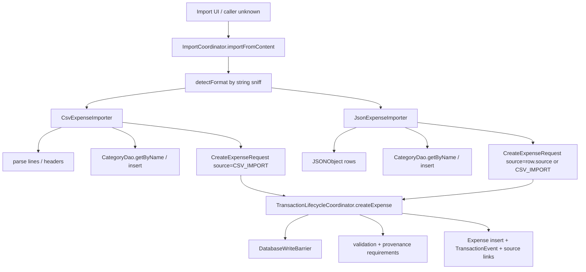
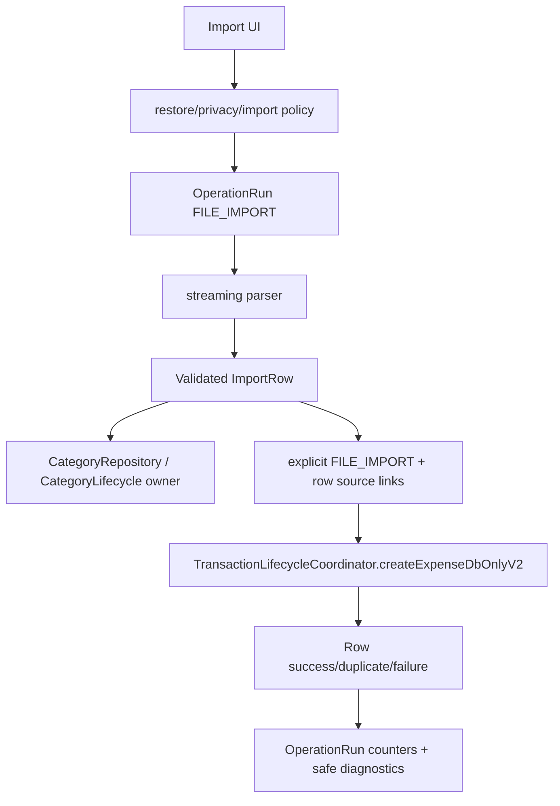

# P18 — Import Support Debug/Review Report

Target repository: `https://github.com/panospao7/Cost-agregator`  
Pinned commit: `83b798e849b4408b2bf683f52cb2746d37f7af16`  
Mode: **remote static review** through GitHub raw source/docs and prior P12/P13/P14/P16 findings.  
Build/test status: **NOT RUN** — no local checkout, `rg`, Gradle, Room test, or UI execution available.

---

## 1. Executive verdict

Verdict: **RED**

Import support exists, but it is not production-safe and may be partly non-functional for current lifecycle rules.

Important correction versus one previous P12 review:

```text
Import is not absent. It exists under:
- util/ImportCoordinator.kt
- util/CsvExpenseImporter.kt
- util/JsonExpenseImporter.kt
```

However, it is a thin utility layer, not a fully architecture-compliant import pipeline.

Highest-risk remaining issue:

```text
CSV import creates CreateExpenseRequest(source = CSV_IMPORT) but does not set csvImportBatchId/csvRowNumber or explicit sourceLinks. TransactionLifecycleCoordinator requires those provenance fields for CSV_IMPORT, so CSV rows likely fail validation after category creation has already happened.
```

Second-highest issue:

```text
Both importers direct-write CategoryDao before calling the transaction lifecycle coordinator. That bypasses CategoryRepository, write-barrier ownership, category normalization, operation-run atomicity, and can leave categories created even when the expense import row later fails.
```

Production safety assessment:

- **CSV import:** likely broken or severely partial due missing CSV provenance fields.
- **JSON import:** works only for rows whose `source` does not trigger provenance requirements; exported rows from notification/receipt/bank/email/group/import sources can fail because import does not restore the required source entities/links.
- **Roundtrip:** not reliable. Exported fields are far richer than imported fields.
- **Restore safety:** not safe because importer category writes happen outside an import-level barrier.
- **Idempotency:** weak; JSON `idempotencyKey` is ignored under `DeduplicationMode.STANDARD`, and CSV has no stable row idempotency.
- **Cancellation:** broad `catch (Exception)` / `runCatching`-style paths swallow `CancellationException`.

---

## 2. Import flow summary

Actual current flow:



Critical ordering problem:

```text
CategoryDao insert happens before TransactionLifecycleCoordinator checks write barrier and provenance requirements.
```

Desired flow:



---

## 3. Files reviewed

### Production files reviewed

| File | Role | Notes |
|---|---|---|
| `util/ImportCoordinator.kt` | Import entrypoint / format detection | Detects JSON/CSV by sniffing entire string and delegates; no barrier/run ledger. |
| `util/CsvExpenseImporter.kt` | CSV parser/importer | Uses lifecycle coordinator for expenses, but direct-writes `CategoryDao`, uses system timezone, catches broad `Exception`, no CSV provenance fields. |
| `util/JsonExpenseImporter.kt` | JSON parser/importer | Uses lifecycle coordinator, but direct-writes `CategoryDao`, catches broad `Exception`, defaults currency to EUR, ignores many export fields. |
| `domain/transaction/CreateExpenseRequest.kt` | Import request target | Supports import/source provenance fields like `fileImportRunId`, `csvImportBatchId`, `csvRowNumber`, `sourceLinks`. |
| `domain/provenance/CreateExpenseSourceLinkRequirements.kt` | Source provenance validation | Requires `csvImportBatchId` + `csvRowNumber` for `CSV_IMPORT`; other sources require their own source IDs. |
| `domain/provenance/CreateExpenseSourceLinkMapper.kt` | Source-link mapping | Can create `FILE_IMPORT` and `CSV_IMPORT_ROW` links if fields are populated. |
| `domain/transaction/lifecycle/TransactionLifecycleCoordinator.kt` | Legal expense creation owner | Checks write barrier, validates source requirements, inserts expense/event/source links. |
| `data/database/dao/CategoryDao.kt` | Category direct DAO | Importers call deprecated direct `insert()` instead of repository. |
| `data/repository/CategoryRepository.kt` | Legal category owner | Has write barrier, normalization, transactional `getOrInsertByNameNoCase`. |
| `domain/export/ExportTransaction.kt` | Export DTO | Has many fields not imported; TODO receipt links absent. |
| `domain/export/ExpenseExportMapper.kt` | Export mapper | Populates source links/currency/business fields. |
| `ui/screens/export/ExportOptionsViewModel.kt` | Export writer | Produces schema v2 JSON/CSV with many fields; no import UI verified. |
| `data/repository/ExportDataRepository.kt` | Export repository | Read-barrier export; source-link export support. |
| `di/ExportModule.kt` | Export DI | Binds accounting exporters only; importers rely on constructor injection. |
| `DB_WRITE_OWNERSHIP.md` | Legal DB ownership | Categories owned by `CategoryRepository`; expenses by `TransactionLifecycleCoordinator`. |
| `config/db_access_allowlist.yml` | Static DB guard allowlist | Allows `CsvExpenseImporter`/`JsonExpenseImporter` direct `CategoryDao` with `requires_write_barrier:false`. |

### Tests reviewed

No import tests were opened/run. Search required locally.

### Files intentionally skipped / incomplete

| Area | Reason |
|---|---|
| Import UI | Not found through sampled files; needs `rg`. |
| All `*Import*` tests | No local search. |
| Full export/import roundtrip tests | Not run. |
| Hilt generated graph | Not available. |
| Actual Room integration behavior | Requires local tests. |
| Large-file/malformed-file behavior | Static only. |

---

## 4. Architecture/doc comparison

| Area | Architecture expectation | Actual source | Status |
|---|---|---|---|
| Import existence | P12 docs expected import under domain/import or said absent | Import exists under `util/*Importer.kt`. | DOC DRIFT |
| Expense writes | Import-created expenses must use `TransactionLifecycleCoordinator` | CSV/JSON importers call coordinator. | PASS/PARTIAL |
| Provenance | CSV/file import should create file-import/row source links | Importers pass `fileImportRunId` optionally but do not set `csvImportBatchId`/`csvRowNumber` or explicit row source link. | FAIL |
| Category writes | Categories owned by `CategoryRepository` | Importers direct-call `CategoryDao.getByName` / `insert`. | FAIL |
| Write barrier | Every write entrypoint checks `DatabaseWriteBarrier` | Coordinator checks for expense; category insert happens before coordinator and no import-level barrier. | FAIL |
| Operation run | Batch import should track rows, failures, retries | `OperationRun` entity exists, but importers do not create/run/update operation run. | FAIL/PARTIAL |
| Restore safety | Import should be blocked in restore/maintenance | Expense create is blocked; category writes are not. | FAIL |
| Privacy/security | Externally supplied text should be sanitized and errors safe | Raw merchant/notes/category imported; errors include raw values/messages. No import privacy contract. | PARTIAL |
| Roundtrip | Export→import should preserve supported schema fields | Import ignores many export fields and may fail source-specific rows. | FAIL |
| Cancellation | CE must propagate | Both importers catch broad `Exception` and convert to row/import errors. | FAIL |

---

## 5. Import format support matrix

| Format / feature | Current support | Notes |
|---|---:|---|
| Legacy CSV `date,amount,merchant,category,description` | Partial | Parser expects header and imports date/amount/merchant/category/notes. Source provenance missing likely breaks rows. |
| Full current CSV export v2 | Partial/broken | Header recognized as `CSV_FULL`, but importer ignores most columns and still treats as legacy-style row. |
| JSON schema v1 | Partial/broken | Imports basic fields, uses source `CSV_IMPORT`; provenance requirement likely fails. |
| JSON schema v2 | Partial | Imports subset; source-specific exported rows may fail provenance validation. |
| Categories | Partial unsafe | Direct DAO insert, no barrier/repository normalization. |
| Business fields | Partial | JSON imports `isBusinessExpense`, `businessPurpose`; CSV ignores business fields. |
| Payment method | JSON only partial | CSV ignores `PaymentMethod`. |
| Transaction type | JSON v2 partial | CSV always `PURCHASE`. |
| Multi-currency | Partial | Currency parsed; conversion snapshots/status ignored. |
| Receipt links | Not supported | Export DTO TODO says receipt links not exported/imported. |
| Source links | Exported but not imported | Import ignores `sourceLinks` JSON field and does not recreate source links. |
| Shared flags | Not supported | `isNotMine`, `isSharedExpense`, shares ignored. |
| Bank provenance | Not supported | Exported bank-source rows likely fail requirements or lose provenance. |
| Group/split data | Not supported | Split/shared/group fields ignored. |
| Recurring/planned rows | Not supported | Import creates expenses only. |
| Budgets | Not supported | Not an expense import feature. |
| Attachments/receipts | Not supported | No asset/receipt import. |
| Encrypted import | Not supported | No encrypted import pipeline observed. |
| Redacted import | Not applicable | No specific redacted import policy. |
| Operation-run/checkpoint | Not supported | `fileImportRunId` accepted as param but not created by importer. |
| Streaming large files | Not supported | Entire content is a `String`; rows materialized via `lines()`. |

---

## 6. Import field coverage matrix vs export DTO

| Export field | JSON import | CSV import | Status |
|---|---:|---:|---|
| `id` | Used for `idempotencyKey`, but STANDARD dedupe ignores it | Ignored | Partial/ineffective |
| `date` string | Ignored if `timestamp` exists; `optLong("date")` falls back | Parsed as local date in CSV | Partial |
| `timestamp` | Used | Not present in CSV import | Partial |
| `createdAt` | Ignored | Ignored | Missing |
| `merchant` | Used | Used | Pass |
| `amount` | Used | Used | Pass |
| `effectiveAmount` | Used only as fallback for amount | Ignored | Partial |
| `currency` | Used, default EUR | Used if column present/symbol/home fallback | Partial |
| `transactionType` | Used with fallback `PURCHASE` | Ignored, always `PURCHASE` | Partial |
| `category` | Direct DAO get/insert | Direct DAO get/insert | Unsafe |
| `notes` | Used | Used | Pass |
| `source` | Parsed and reused | Ignored, source fixed `CSV_IMPORT` | Dangerous |
| `paymentMethod` | Parsed | Ignored | Partial |
| `sourceAccountName` | Ignored | Ignored | Missing |
| `originalCurrency` | Ignored | Ignored | Missing |
| `originalAmount` | Ignored | Ignored | Missing |
| `homeCurrency` | Ignored | Ignored | Missing |
| `baseAmount` | Ignored | Ignored | Missing |
| `baseCurrency` | Ignored | Ignored | Missing |
| `exchangeRateUsed` | Ignored | Ignored | Missing |
| `conversionRateUsed` | Ignored | Ignored | Missing |
| `conversionStatus` | Not exported/imported | Not exported/imported | Missing |
| `isBusinessExpense` | Used | Ignored | Partial |
| `businessPurpose` | Used | Ignored | Partial |
| `businessCategory` | Ignored | Ignored | Missing |
| `businessProject` | Ignored | Ignored | Missing |
| `requiresReceipt` | Ignored | Ignored | Missing |
| `sourceLinks` | Ignored | CSV SourceLinks ignored | Missing |
| receipt links | Not exported/imported | Not exported/imported | Missing |
| shared/not-mine flags | Not imported | Not imported | Missing |

---

## 7. Legal write path matrix

| Write | Current path | Legal? | Problem |
|---|---|---:|---|
| Expense row | Importer → `TransactionLifecycleCoordinator.createExpense()` | Mostly yes | Deprecated API used; provenance fields missing. |
| Transaction event | Coordinator writes | Yes if create passes | Import-specific events/source links not complete. |
| Source link | Coordinator maps request fields | Partial | Importers do not set row provenance fields / ignore exported sourceLinks. |
| Category lookup | Importer → `CategoryDao.getByName()` | Read-only OK-ish | Should probably use repository for normalization. |
| Category create | Importer → `CategoryDao.insert()` | **No** | Bypasses barrier and `CategoryRepository.normalizeAndInsert`/`getOrInsertByNameNoCase`. |
| Operation run | None | **No** | No import run ledger/correlation/checkpoint. |
| Import diagnostics | Row error list only | Partial | Not durable and can contain raw messages. |
| Restore barrier | Coordinator only | Partial/fail | Category writes occur before coordinator barrier. |
| File import row provenance | Not set | **No** | CSV_IMPORT requirements demand `csvImportBatchId` + `csvRowNumber`. |

---

## 8. Idempotency / dedupe matrix

| Scenario | Current behavior | Risk | Required behavior |
|---|---|---|---|
| Same CSV file imported twice | Standard expense dedupe only | Same merchant/amount/date skipped; legitimate duplicate same-day purchases may also be skipped; no row-scoped idempotency. | File/run/row external fingerprint + `BULK_IMPORT` or explicit source links. |
| Same JSON v2 file imported twice | `idempotencyKey="import:json:$id"` set but `DeduplicationMode.STANDARD` used | Idempotency key not used for STANDARD; dedupe is fuzzy content. | Use `STRICT_EXTERNAL_ID` or `BULK_IMPORT` with stable import namespace. |
| Rows without ID | Standard dedupe | Weak; no source-scoped row identity. | Generate row fingerprint from canonical row fields + file hash. |
| Partial import retry | No run checkpoint | Already imported rows may duplicate/skip unpredictably; categories may already be created. | OperationRun + row ledger + idempotent row keys. |
| Category creation retry | `getByName` then `insert` direct | Race mitigated by DB unique maybe, but direct deprecated insert can return ignored ID and not resolve existing. | Use `CategoryRepository.addCategory` or `CategoryDao.getOrInsertByNameNoCase` behind repository/barrier. |
| Source-link retry | Not created for CSV row | No durable row provenance. | Source link for FILE_IMPORT and CSV_IMPORT_ROW/JSON_IMPORT_ROW. |
| Failure after category insert before expense | Category remains | Partial side effect from failed row. | Category creation inside import transaction or treat category as separate explicit result. |

---

## 9. Currency/date/privacy issue list

| ID | Severity | Area | Issue |
|---|---:|---|---|
| Currency-1 | P1/P2 | Currency fallback | JSON defaults missing currency to `"EUR"`; CSV last-resort fallback is `"EUR"`. This conflicts with no-hardcoded-EUR policy unless documented legacy import behavior. |
| Currency-2 | P2 | Conversion fields | Import ignores base/home/exchange fields and conversion status, forcing transaction lifecycle to recalculate with current rates. |
| Currency-3 | P2 | Effective amount | CSV ignores `EffectiveAmount`; JSON uses it only as amount fallback. Shared/not-mine semantics are lost. |
| Date-1 | P2 | Timezone | CSV parses `yyyy-MM-dd` at `ZoneId.systemDefault()`, so same file imports to different epoch millis across timezones. |
| Date-2 | P2 | JSON date | JSON importer uses numeric `timestamp` when present; `date` string is ignored/fallback. This is okay only if timestamp exists. |
| Privacy-1 | P2 | Error text | Errors include `e.message`, invalid date/amount values, and parse messages; may expose raw file content. |
| Privacy-2 | P2 | Raw text import | Notes/merchant/category from external file are stored raw without import privacy policy/confirmation. |
| Security-1 | P2 | CSV formula | TODO says hardened CSV sanitizer should be applied before parsing; exported values are sanitized, imported formula strings can be stored and later re-exported. |
| Security-2 | P2 | Large file DoS | Entire content loaded as `String`, split into lines/JSON object; no file size/row count cap observed. |
| Security-3 | P2 | Malformed JSON/CSV | Broad catch returns errors; no row limit or structured error redaction. |
| Cancellation-1 | P1/P2 | CE propagation | Broad `catch (Exception)` in CSV/JSON importers can swallow `CancellationException`. |

---

## 10. New findings

| ID | Severity | Type | Title | Evidence | Impact | Reproduction path | Recommended fix | Required tests | Cross-pipeline impact |
|---|---:|---|---|---|---|---|---|---|---|
| P18-IMP-001 | P0/P1 | Broken import/provenance | CSV import does not satisfy `CSV_IMPORT` provenance requirements | `CsvExpenseImporter` sets `source = CSV_IMPORT` but no `csvImportBatchId`/`csvRowNumber`; `CreateExpenseSourceLinkRequirements` requires those for `CSV_IMPORT`; coordinator validates before insert. | CSV import likely imports zero expenses or fails every row after category side effects. | Import a valid CSV row; expect `ValidationFailed` for missing CSV fields. | Generate `csvImportBatchId`, set `csvRowNumber`, `externalFingerprint`, or pass explicit `SourceLinkPayload`; use `BULK_IMPORT`/strict row key. | `csv_import_valid_row_creates_expense_and_source_link`. | P2/P12/P13 |
| P18-IMP-002 | P1 | Partial side effects | Category is created before expense validation/barrier and can remain when row fails | CSV/JSON parse creates category via `CategoryDao` before `coordinator.createExpense`; provenance validation can then fail. | Failed import row mutates DB. Restore barrier can be bypassed by category insert. | Import CSV during restore or row that fails provenance after new category. | Move category creation into legal import transaction after barrier; use `CategoryRepository` or import coordinator owner. | `failed_import_row_does_not_create_category`; `import_category_blocked_during_restore`. | P13/P14/P7 |
| P18-IMP-003 | P1 | Direct DAO ownership | Importers write `CategoryDao` directly | `CsvExpenseImporter` and `JsonExpenseImporter` inject `CategoryDao`; allowlist explicitly permits with `requires_write_barrier:false`; DB ownership says categories owned by `CategoryRepository`. | Category normalization/barrier/cache invalidation may be bypassed. | Import new category with whitespace/case duplicate. | Inject `CategoryRepository`; add import-safe `getOrCreateCategoryForImport()` with barrier/normalization. | `import_uses_category_repository`; `import_category_normalized_case_insensitive`. | P13/P15 |
| P18-IMP-004 | P1 | Roundtrip/provenance | JSON import reuses exported `source`, causing source-specific rows to fail or lose provenance | JSON v2 parses `source` via `ExpenseSource.valueOf`; requirements demand rawNotificationId/scannedReceiptId/bankSyncRunId/etc. for those sources, but import does not restore those entities. | Exported notification/receipt/bank/email/group rows may fail import or cannot be roundtripped. | Export JSON with `source="RECEIPT_SCAN"` or `BANK_API_SYNC`; import into empty DB. | For file import, treat original source as metadata and create as `CSV_IMPORT`/`FILE_IMPORT` with explicit sourceLinks, or import full source entities first. | `json_import_exported_receipt_source_row_has_supported_behavior`; `json_import_preserves_original_source_as_metadata`. | P3/P10/P11/P12 |
| P18-IMP-005 | P1/P2 | Idempotency | JSON idempotency key is ineffective under `DeduplicationMode.STANDARD`; CSV has no row key | JSON sets `idempotencyKey` but `deduplicationMode = STANDARD`; CSV sets neither idempotency nor row number. | Retry/reimport depends on fuzzy duplicate logic; legitimate duplicate purchases can be skipped or duplicates can slip through if fields differ. | Import same file twice; import two same merchant/amount/date purchases. | Use `BULK_IMPORT` or `STRICT_EXTERNAL_ID` with file hash + row number/id; set source links. | `reimport_same_file_idempotent`; `two_legitimate_same_day_rows_not_collapsed_if_distinct_row_ids`. | P2/P12 |
| P18-IMP-006 | P1/P2 | Cancellation | CSV/JSON importers swallow `CancellationException` | Outer/per-row `catch (e: Exception)` in both importers; no CE rethrow. | User/restore cancellation can be converted into row errors/ImportResult. | Cancel import coroutine mid-file. | Add `if (e is CancellationException) throw e` in every catch; avoid broad `runCatching`. | `import_cancellation_propagates`. | P9/P17 |
| P18-IMP-007 | P2/P1 | Restore safety | ImportCoordinator has no top-level write barrier/read barrier | ImportCoordinator only detects format/delegates; category writes happen before coordinator barrier. | Import can mutate categories during restore and begin work before failing on expense barrier. | Start import during `RESTORE_PREPARING`. | ImportCoordinator checks `DatabaseWriteBarrier` before parsing/writes and every importer uses legal owners. | `import_blocked_during_restore_before_category_write`. | P7/P13/P14 |
| P18-IMP-008 | P2 | Operation ledger | Import does not create/update `OperationRun` despite `fileImportRunId` support | `OperationRun` entity exists; importers accept optional `fileImportRunId` but do not create it or update counters. | No durable import audit, resumability, partial-failure state, or row counts. | Kill app mid-import; no run ledger/checkpoint. | Add `FileImportRun`/`OperationRunRecorder` wrapper with counters/events. | `import_creates_operation_run_and_row_counts`; `stale_running_import_marked_aborted`. | P29/P12 |
| P18-IMP-009 | P2 | Field loss | Import ignores most export schema fields | CSV ignores payment/source/business/conversion/sourceLinks; JSON ignores sourceLinks, conversion fields, shared fields, receipt links, businessCategory/project, requiresReceipt. | Export→import does not preserve financial/tax/provenance semantics. | Export full JSON/CSV with business/shared/sourceLinks; import; compare. | Define supported import schema and import all supported fields or document omissions. | `json_roundtrip_supported_fields`; `csv_roundtrip_supported_fields`. | P5/P6/P12/P17 |
| P18-IMP-010 | P2 | Currency fallback | Hardcoded EUR fallback remains | JSON `optString("currency", "EUR")`; CSV home fallback final `"EUR"`. | Users with non-EUR home currency get wrong currency for missing field. | Import row without currency on USD home profile. | Require currency or use resolved home currency fail-closed; no hardcoded EUR. | `import_missing_currency_uses_home_or_fails_not_eur`. | P5/P6 |
| P18-IMP-011 | P2 | Date determinism | CSV imports dates using system default timezone | `LocalDate.parse(...).atStartOfDay(ZoneId.systemDefault())`. | Same file imports to different timestamps across timezones. | Import same CSV under UTC and America/Los_Angeles. | Use UTC or declared import timezone. | `csv_import_date_timezone_deterministic`. | P12/tax |
| P18-IMP-012 | P2 | CSV parsing | Header parsing is naïve `split(",")`; row parsing custom and no size caps | Header with quoted comma breaks; entire file loaded as lines; no row/size cap. | Malformed/large CSV can misparse or cause memory pressure. | Header `"Merchant, Name"` or huge file. | Use streaming RFC-4180 parser; enforce size/row limits. | `csv_import_quoted_header_supported`; `csv_import_large_file_bounded_memory`. | P12/P16 |
| P18-IMP-013 | P2 | Error privacy | Import errors expose raw parse/exception messages | CSV returns `Invalid date: $dateStr — ${e.message}`, invalid amount value, result exception message; JSON returns parse `e.message`. | Raw file content may show in UI/logs. | Import row containing PII in malformed field. | Return row number + error code; sanitize/truncate values. | `import_errors_are_privacy_safe`. | P8/P14/P16 |
| P18-IMP-014 | P2 | Security/formula | Imported formula-leading values can be stored as merchant/notes/category | CSV TODO says sanitizer before parsing; importer does not neutralize before DB. | Formula payload can later be exported/shared; export sanitizer may neutralize, but DB stores raw formula string. | Import merchant `=HYPERLINK(...)`. | Decide policy: store raw user text or neutralize dangerous spreadsheet payload on import; always sanitize on export. | `csv_formula_import_reexport_safe`; `import_formula_values_policy`. | P12/P16 |
| P18-IMP-015 | P2 | JSON schema compatibility | `date` string is not parsed; importer relies on numeric `timestamp` | JSON export includes both; third-party JSON with date only imports current time/default path depending `optLong`. | Date drift for date-only JSON. | Import JSON row with `"date":"2024-01-01"` and no timestamp. | Parse ISO date string deterministically. | `json_import_date_string_without_timestamp`. | P12 |
| P18-IMP-016 | P3 | Docs/path drift | Docs expected `domain/import/*`; source uses `util/*Importer.kt` | P12 review 404'd expected domain paths; actual files exist in util. | Agents may think import absent or miss real code. | Read docs vs source. | Move import into `domain/import` or update docs. | docs check. | Maintainability |

---

## 11. Universal contract audit

### Restore/write barrier

Status: **FAIL**

Evidence:
- `TransactionLifecycleCoordinator` checks write barrier for expense creation.
- `CategoryRepository` has barrier for category creation.
- Importers bypass `CategoryRepository` and insert categories directly.
- `ImportCoordinator` has no barrier.

Gaps:
- Category write can occur during restore.
- Category write can occur before row fails lifecycle validation.
- No import operation-level maintenance/read/write policy.

### Transaction lifecycle

Status: **PARTIAL**

Pass:
- Expense rows are submitted through `TransactionLifecycleCoordinator`.

Fail/gaps:
- Deprecated `createExpense()` API used with `@Suppress("DEPRECATION_ERROR")`.
- Missing CSV provenance fields cause lifecycle validation failure.
- JSON source-specific rows may fail requirements.
- Import does not use `createExpenseDbOnlyV2`/batch runner to aggregate side effects safely.
- Category writes bypass category lifecycle owner.

### Provenance/source links

Status: **FAIL/PARTIAL**

Pass:
- `CreateExpenseRequest` supports `fileImportRunId`, `csvImportBatchId`, `csvRowNumber`, `sourceLinks`.
- Mapper can create `FILE_IMPORT` and `CSV_IMPORT_ROW` links.

Fail:
- Importers do not populate row-level fields.
- Exported `sourceLinks` are ignored.
- Original source is reused unsafely instead of preserved as metadata or restored source entity.

### Idempotency/dedupe

Status: **FAIL/PARTIAL**

- Standard dedupe prevents some duplicate money rows.
- Import lacks stable per-file/per-row idempotency.
- JSON idempotency key is not active under STANDARD dedupe.
- CSV legitimate duplicate purchases can collapse.

### Privacy/security

Status: **PARTIAL**

- No network/cloud issue.
- Externally supplied raw merchant/notes/category stored directly.
- Error messages can include raw values.
- No file size/row limits.
- Formula-leading values can be stored.

### Money/currency/date

Status: **PARTIAL/FAIL**

- Amount/currency passes through coordinator validation.
- Hardcoded EUR fallback remains.
- CSV date uses system timezone.
- Conversion snapshot is recomputed, not roundtripped.
- Shared/effective amount semantics are lost.

### Diagnostics/operation runs

Status: **FAIL**

- No durable import run observed.
- Per-row errors are in-memory result only.
- No checkpoint/resume/stale abort.

### Import/export roundtrip

Status: **FAIL**

- Export schema is richer than import schema.
- Receipt links not supported.
- Source links ignored.
- Accounting formats not importable by this path.
- CSV v2 header recognized but most fields ignored.

---

## 12. Test coverage assessment

| Behavior | Existing test? | Missing test? | Recommended test |
|---|---:|---:|---|
| Valid CSV row imports | Not run | Yes | `csv_import_valid_row_creates_expense_and_source_link` |
| CSV import provenance fields | Not run | Yes | `csv_import_sets_batch_id_row_number_source_link` |
| Import blocked during restore | Not run | Yes | `import_blocked_during_restore_before_category_write` |
| Category creation legal owner | Not run | Yes | `import_uses_category_repository` |
| Failed row does not create category | Not run | Yes | `failed_import_row_does_not_create_category` |
| JSON v2 exported manual row imports | Not run | Yes | `json_exported_manual_row_imports` |
| JSON v2 exported receipt/bank/source row behavior | Not run | Yes | `json_import_source_specific_row_supported_or_fails_cleanly` |
| Reimport same JSON file idempotent | Not run | Yes | `reimport_same_json_is_idempotent` |
| Reimport same CSV file idempotent | Not run | Yes | `reimport_same_csv_is_idempotent` |
| Two same-day legitimate purchases | Not run | Yes | `import_preserves_distinct_duplicate_like_rows_with_row_ids` |
| JSON/CSV roundtrip supported fields | Not run | Yes | `json_export_import_roundtrip_supported_fields`, `csv_export_import_roundtrip_supported_fields` |
| Currency fallback | Not run | Yes | `missing_currency_not_hardcoded_eur` |
| Date determinism | Not run | Yes | `csv_import_date_timezone_deterministic` |
| Malformed CSV privacy | Not run | Yes | `import_errors_are_privacy_safe` |
| Cancellation | Not run | Yes | `import_cancellation_propagates` |
| Large file bounds | Not run | Yes | `csv_import_large_file_bounded_memory` |
| Formula payload | Not run | Yes | `csv_formula_import_reexport_safe` |

---

## 13. Recommended fix plan

### PR 1 — Make import legal and not broken

Fix:
1. Add import operation wrapper that checks `DatabaseWriteBarrier` before parsing/writes.
2. Generate `importBatchId` and row number/fingerprint for every row.
3. Set `csvImportBatchId`, `csvRowNumber`, `externalFingerprint`, and/or explicit `SourceLinkPayload`.
4. Stop using deprecated `createExpense()`; use `createExpenseStandaloneV2` or `createExpenseDbOnlyV2`.
5. Decide source policy:
   - imported expense source = `CSV_IMPORT` / file import,
   - original source preserved as metadata,
   - do not reuse source-specific values unless restoring full source entity.

Acceptance:
- Valid CSV imports at least one expense.
- Import creates source link / provenance.
- Import blocked during restore before any category/expense mutation.

### PR 2 — Category ownership and partial-side-effect safety

Fix:
1. Replace direct `CategoryDao` with `CategoryRepository` or category lifecycle owner.
2. Use normalization and transactional get-or-insert.
3. Ensure category creation does not happen for rows that later fail if product wants all-or-nothing row semantics.
4. Add operation-run counter for category-created warnings.

Acceptance:
- Failed row cannot silently create category unless result reports it.
- Case/whitespace duplicate categories do not appear.
- Static guard disallows importers injecting `CategoryDao`.

### PR 3 — Idempotency and operation ledger

Fix:
1. Add `OperationRun` creation for each import.
2. Add row ledger or row result table for restart/resume.
3. Use stable idempotency:
   - file hash + row number + row fingerprint,
   - or exported ID under `STRICT_EXTERNAL_ID`,
   - source-scoped namespace.
4. Return/import durable partial success state.

Acceptance:
- Reimport same file is idempotent.
- Partial import retry resumes/skips safely.
- Kill/restart marks stale import run.

### PR 4 — Roundtrip schema

Fix:
1. Define supported import schema v2.
2. Import or explicitly reject:
   - business/tax fields,
   - payment method,
   - transaction type,
   - shared/not-mine flags,
   - conversion status,
   - source links,
   - receipt links.
3. Add compatibility for date-only JSON.
4. Add source-link import if safe.

Acceptance:
- Export→import→export canonical roundtrip passes for supported fields.
- Unsupported fields produce explicit warnings, not silent loss.

### PR 5 — Currency/date/security hardening

Fix:
1. Remove hardcoded EUR fallback.
2. Require currency or use resolved home currency with explicit warning.
3. Use UTC/configured timezone for date-only imports.
4. Add file size/row count limits.
5. Use streaming parser for CSV.
6. Sanitize/truncate import error messages.
7. Decide formula storage policy and test re-export safety.
8. Re-throw `CancellationException`.

Acceptance:
- Timezone deterministic tests pass.
- Large/malformed file tests pass.
- Cancellation propagates.
- Error messages are privacy-safe.

### PR 6 — Docs/UI/tests

Fix:
1. Move import code from `util` to `domain/import` or update docs.
2. Add import UI action matrix.
3. Add import privacy/restore UI state.
4. Rename misleading “roundtrip” sanitizer-only test or add true roundtrip tests.
5. Add import static guard to CI.

Acceptance:
- P12/P18 docs match source.
- CI fails on direct `CategoryDao` import writes.
- True import roundtrip tests exist.

---

## 14. Required local validation commands

```bash
git rev-parse HEAD
git status --short
./gradlew :app:assembleDebug --stacktrace
./gradlew :app:testDebugUnitTest --stacktrace
./gradlew :app:check --stacktrace
```

Import-specific searches:

```bash
rg -n "ImportCoordinator|JsonExpenseImporter|CsvExpenseImporter|importFromContent|CSV_IMPORT|fileImportRunId|csvImportBatchId|csvRowNumber" app/src/main/java app/src/test app/src/androidTest

rg -n "CategoryDao|getByName|categoryDao.insert" app/src/main/java/com/yourname/expensetracker/util app/src/main/java

rg -n "Roundtrip|Import|CsvExpenseImporter|JsonExpenseImporter" app/src/test app/src/androidTest

rg -n "catch \\(e: Exception\\)|runCatching|CancellationException" app/src/main/java/com/yourname/expensetracker/util

rg -n "sourceLinks|receiptLinks|conversionStatus|EffectiveAmount|IsBusinessExpense|BusinessCategory|RequiresReceipt|PaymentMethod|TransactionType" app/src/main/java/com/yourname/expensetracker/util app/src/test app/src/androidTest
```

Focused tests:

```bash
./gradlew :app:testDebugUnitTest --tests "*Import*" --stacktrace
./gradlew :app:testDebugUnitTest --tests "*Roundtrip*" --stacktrace
./gradlew :app:testDebugUnitTest --tests "*CsvExpenseImporter*" --stacktrace
./gradlew :app:testDebugUnitTest --tests "*JsonExpenseImporter*" --stacktrace
./gradlew :app:testDebugUnitTest --tests "*Export*" --stacktrace
```

---

## 15. Final production-readiness decision

Verdict: **RED**

Import support should not be treated as production-ready.

Why:

1. CSV import likely fails current provenance validation.
2. Category creation bypasses legal owner and barrier.
3. Failed rows can leave category side effects.
4. JSON roundtrip fails for many source-specific exported rows.
5. Idempotency is weak and not row-scoped.
6. Import lacks operation run ledger/checkpoint/resume.
7. Import ignores most current export schema fields.
8. Hardcoded EUR fallback and system timezone remain.
9. Cancellation and error privacy are unsafe.
10. Large/malformed file handling is not robust.

Minimum before GREEN:

- import-level barrier,
- legal category owner,
- row-level provenance fields/source links,
- operation run ledger,
- deterministic idempotency,
- roundtrip field contract,
- currency/date hardening,
- cancellation propagation,
- privacy-safe errors,
- import tests and CI guard.

---

## 16. Source index

Repository commit:
- https://github.com/panospao7/Cost-agregator/commit/83b798e849b4408b2bf683f52cb2746d37f7af16

Import:
- `ImportCoordinator.kt`  
  https://raw.githubusercontent.com/panospao7/Cost-agregator/83b798e849b4408b2bf683f52cb2746d37f7af16/app/src/main/java/com/yourname/expensetracker/util/ImportCoordinator.kt
- `CsvExpenseImporter.kt`  
  https://raw.githubusercontent.com/panospao7/Cost-agregator/83b798e849b4408b2bf683f52cb2746d37f7af16/app/src/main/java/com/yourname/expensetracker/util/CsvExpenseImporter.kt
- `JsonExpenseImporter.kt`  
  https://raw.githubusercontent.com/panospao7/Cost-agregator/83b798e849b4408b2bf683f52cb2746d37f7af16/app/src/main/java/com/yourname/expensetracker/util/JsonExpenseImporter.kt

Transaction lifecycle / provenance:
- `CreateExpenseRequest.kt`  
  https://raw.githubusercontent.com/panospao7/Cost-agregator/83b798e849b4408b2bf683f52cb2746d37f7af16/app/src/main/java/com/yourname/expensetracker/domain/transaction/CreateExpenseRequest.kt
- `CreateExpenseResult.kt`  
  https://raw.githubusercontent.com/panospao7/Cost-agregator/83b798e849b4408b2bf683f52cb2746d37f7af16/app/src/main/java/com/yourname/expensetracker/domain/transaction/CreateExpenseResult.kt
- `ExpenseSource.kt`  
  https://raw.githubusercontent.com/panospao7/Cost-agregator/83b798e849b4408b2bf683f52cb2746d37f7af16/app/src/main/java/com/yourname/expensetracker/domain/transaction/ExpenseSource.kt
- `DeduplicationMode.kt`  
  https://raw.githubusercontent.com/panospao7/Cost-agregator/83b798e849b4408b2bf683f52cb2746d37f7af16/app/src/main/java/com/yourname/expensetracker/domain/transaction/DeduplicationMode.kt
- `TransactionLifecycleCoordinator.kt`  
  https://raw.githubusercontent.com/panospao7/Cost-agregator/83b798e849b4408b2bf683f52cb2746d37f7af16/app/src/main/java/com/yourname/expensetracker/domain/transaction/lifecycle/TransactionLifecycleCoordinator.kt
- `CreateExpenseSourceLinkRequirements.kt`  
  https://raw.githubusercontent.com/panospao7/Cost-agregator/83b798e849b4408b2bf683f52cb2746d37f7af16/app/src/main/java/com/yourname/expensetracker/domain/provenance/CreateExpenseSourceLinkRequirements.kt
- `CreateExpenseSourceLinkMapper.kt`  
  https://raw.githubusercontent.com/panospao7/Cost-agregator/83b798e849b4408b2bf683f52cb2746d37f7af16/app/src/main/java/com/yourname/expensetracker/domain/provenance/CreateExpenseSourceLinkMapper.kt

Category:
- `CategoryDao.kt`  
  https://raw.githubusercontent.com/panospao7/Cost-agregator/83b798e849b4408b2bf683f52cb2746d37f7af16/app/src/main/java/com/yourname/expensetracker/data/database/dao/CategoryDao.kt
- `CategoryRepository.kt`  
  https://raw.githubusercontent.com/panospao7/Cost-agregator/83b798e849b4408b2bf683f52cb2746d37f7af16/app/src/main/java/com/yourname/expensetracker/data/repository/CategoryRepository.kt

Export schema:
- `ExportTransaction.kt`  
  https://raw.githubusercontent.com/panospao7/Cost-agregator/83b798e849b4408b2bf683f52cb2746d37f7af16/app/src/main/java/com/yourname/expensetracker/domain/export/ExportTransaction.kt
- `ExpenseExportMapper.kt`  
  https://raw.githubusercontent.com/panospao7/Cost-agregator/83b798e849b4408b2bf683f52cb2746d37f7af16/app/src/main/java/com/yourname/expensetracker/domain/export/ExpenseExportMapper.kt
- `ExportDataRepository.kt`  
  https://raw.githubusercontent.com/panospao7/Cost-agregator/83b798e849b4408b2bf683f52cb2746d37f7af16/app/src/main/java/com/yourname/expensetracker/data/repository/ExportDataRepository.kt
- `ExportOptionsViewModel.kt`  
  https://raw.githubusercontent.com/panospao7/Cost-agregator/83b798e849b4408b2bf683f52cb2746d37f7af16/app/src/main/java/com/yourname/expensetracker/ui/screens/export/ExportOptionsViewModel.kt
- `ExportOptionsScreen.kt`  
  https://raw.githubusercontent.com/panospao7/Cost-agregator/83b798e849b4408b2bf683f52cb2746d37f7af16/app/src/main/java/com/yourname/expensetracker/ui/screens/export/ExportOptionsScreen.kt
- `ExportModule.kt`  
  https://raw.githubusercontent.com/panospao7/Cost-agregator/83b798e849b4408b2bf683f52cb2746d37f7af16/app/src/main/java/com/yourname/expensetracker/di/ExportModule.kt

Docs/config:
- `PIPELINE_12_CONSOLIDATED_ISSUES.md`  
  https://raw.githubusercontent.com/panospao7/Cost-agregator/83b798e849b4408b2bf683f52cb2746d37f7af16/docs/analyses%20and%20debug%20master/PIPELINE_12_CONSOLIDATED_ISSUES.md
- `DB_WRITE_OWNERSHIP.md`  
  https://raw.githubusercontent.com/panospao7/Cost-agregator/83b798e849b4408b2bf683f52cb2746d37f7af16/docs/DB_WRITE_OWNERSHIP.md
- `LEGAL_PATHS.md`  
  https://raw.githubusercontent.com/panospao7/Cost-agregator/83b798e849b4408b2bf683f52cb2746d37f7af16/docs/architecture/LEGAL_PATHS.md
- `db_access_allowlist.yml`  
  https://raw.githubusercontent.com/panospao7/Cost-agregator/83b798e849b4408b2bf683f52cb2746d37f7af16/config/db_access_allowlist.yml