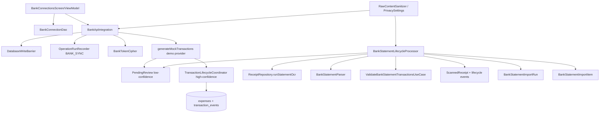

# Pipeline 10 Review — Bank Integration / Bank Imports

## 0. Review constraints

Target: `83b798e849b4408b2bf683f52cb2746d37f7af16`

Mode performed: **remote static review**. I could not run local checkout, `rg`, or Gradle.

Build/test status: **NOT RUN**

Required first validation command for a local agent:

```bash
git rev-parse HEAD
```

Expected:

```text
83b798e849b4408b2bf683f52cb2746d37f7af16
```

Primary sources:
- P10 issue doc: `docs/analyses and debug master/PIPELINE_10_CONSOLIDATED_ISSUES.md`
- P10 plan: `docs/analyses and debug master/pipelines issues implementantion plan/PIPELINE_10_IMPLEMENTATION_PLAN.md`
- Segment map: `docs/architecture/CODEBASE_SEGMENTS.md`
- DB write ownership: `docs/DB_WRITE_OWNERSHIP.md`
- Sensitive diagnostics policy: `docs/architecture/SENSITIVE_DIAGNOSTICS_POLICY.md`
- `domain/bank/BankApiIntegration.kt`
- `domain/bank/BankApiConfig.kt`
- `data/security/BankTokenCipher.kt`
- `ui/screens/bank/BankConnectionsViewModel.kt`
- `domain/receipt/lifecycle/BankStatementLifecycleProcessor.kt`
- `BankConnection`, `BankConnectionDao`, `BankStatementImportRun`, `BankStatementImportItem`

Source links used:
- https://raw.githubusercontent.com/panospao7/Cost-agregator/83b798e849b4408b2bf683f52cb2746d37f7af16/docs/analyses%20and%20debug%20master/PIPELINE_10_CONSOLIDATED_ISSUES.md
- https://raw.githubusercontent.com/panospao7/Cost-agregator/83b798e849b4408b2bf683f52cb2746d37f7af16/app/src/main/java/com/yourname/expensetracker/domain/bank/BankApiIntegration.kt
- https://raw.githubusercontent.com/panospao7/Cost-agregator/83b798e849b4408b2bf683f52cb2746d37f7af16/app/src/main/java/com/yourname/expensetracker/domain/receipt/lifecycle/BankStatementLifecycleProcessor.kt
- https://raw.githubusercontent.com/panospao7/Cost-agregator/83b798e849b4408b2bf683f52cb2746d37f7af16/app/src/main/java/com/yourname/expensetracker/ui/screens/bank/BankConnectionsViewModel.kt

---

## 1. Pipeline summary

P10 covers bank integration, demo bank API sync, bank connection storage, bank statement OCR/import, bank import ledgers, low-confidence review routing, token encryption, and bank-created expense/review paths.

At target SHA, P10 is **more implemented than its issue docs claim**, but it is still **not production-safe**:
- API integration is still `@StubForDemo` and release-disabled.
- Real OAuth/PKCE/callback/provider sync is not implemented.
- Several previously TODO items are now partly/fixed in code.
- Direct DAO write and raw bank-data privacy issues remain.

Data-flow diagram:



Entry points:
- Bank UI: `BankConnectionsScreen`, `BankConnectionsViewModel`
- Demo bank connection/sync: `BankApiIntegration.initiateConnection`, `completeConnection`, `syncTransactions`
- Statement import: `BankStatementLifecycleProcessor.processBankStatement`
- Token security: `BankTokenCipher`
- DAOs: `BankConnectionDao`, `BankStatementImportRunDao`, `BankStatementImportItemDao`

No real bank sync worker was found in reviewed files. Full `rg` is still required.

---

## 2. File inventory

| Category | Files reviewed | Why relevant | Notes |
|---|---|---|---|
| Issue docs | `PIPELINE_10_CONSOLIDATED_ISSUES.md`, P10 plan | Issue IDs/status | Docs are stale vs source. |
| Architecture | `CODEBASE_SEGMENTS.md`, `DB_WRITE_OWNERSHIP.md`, sensitive diagnostics policy | Segment 14, write ownership, privacy | DB ownership says `bank_connections` should have `BankConnectionLifecycleCoordinator`; current code lacks that. |
| Bank domain | `BankApiIntegration.kt`, `BankApiConfig.kt`, `StubForDemo.kt` | Demo sync/connection/token flow | Many tracker TODOs now partially fixed. Still demo-only. |
| Security | `BankTokenCipher.kt` | Token encryption/decryption | Key invalidation now typed as `DecryptResult.KeyInvalidated`. |
| UI | `BankConnectionsViewModel.kt`, `BankConnectionsScreen.kt` | Connection screen | ViewModel now injects DAO/API; still directly mutates DAO and has no connect/OAuth flow. |
| Statement import | `BankStatementLifecycleProcessor.kt` | OCR bank statement import | Has run/item ledger and barriers; stores raw merchant/description in review/import item rows. |
| DAOs/entities | `BankConnection.kt`, `BankConnectionDao.kt`, `BankStatementImportRun.kt`, `BankStatementImportItem.kt` | Persistence | Unique `bankId` only; import item stores raw `merchant`. |
| Not fully reviewed | AppDatabase/migrations/Hilt/tests/all P10 UI routes/provider workers/export backup | Need local `rg` | Required before final GREEN/YELLOW. |

Files intentionally skipped:
- Full migration/schema export: no local tree/Gradle.
- Full P12/P7 export/backup overlap: outside available static sample.
- Full tests: not runnable/opened locally.

---

## 3. Architecture comparison

### Segment ownership

`CODEBASE_SEGMENTS.md` defines Segment 14 as bank account sync/import and bank transaction ingestion. P10 code implements only a demo provider plus statement OCR import; no real provider/network/OAuth/webhook/cursor lifecycle was found in reviewed code.

### DB write ownership

`DB_WRITE_OWNERSHIP.md` says:
- `bank_connections` approved writer should be `BankConnectionLifecycleCoordinator` and marked “create coordinator”.
- Workers should not write DAOs directly.
- Every write entrypoint should check `DatabaseWriteBarrier`.

Current drift:
- `BankApiIntegration.completeConnection()` writes `BankConnectionDao.insert()` with a barrier — acceptable short-term but no coordinator.
- `BankConnectionsViewModel.disconnect()` calls `BankConnectionDao.disconnect()` directly with no barrier or lifecycle owner.
- `BankStatementLifecycleProcessor` writes import and pending review rows under barriers/transactions, but stores raw sensitive fields.

### Transaction lifecycle

Good:
- High-confidence bank API sync calls `TransactionLifecycleCoordinator.createExpenseStandaloneV2()` using `CreateExpenseRequest` with `source = BANK_API_SYNC` and `DeduplicationMode.STRICT_EXTERNAL_ID`.

Gaps:
- Low-confidence bank API sync and statement import route to `PendingReview`, not expense creation. That is acceptable, but they store raw merchant/description in review text.
- Statement import dedupe still uses local three-layer logic; source comment says shared `BankTransactionDeduper` is planned.

### Privacy/security

Good:
- `BankTokenCipher` encrypts tokens with Android Keystore AES/GCM.
- `BankApiIntegration.mapTransactionToExpense()` sanitizes description/reference via `RawContentSanitizer`.
- Provider IDs are hashed before provenance fields.

Gaps:
- `BankConnection` is a data class containing encrypted token strings; accidental `toString()` can expose encrypted secrets.
- `BankStatementLifecycleProcessor` writes raw `tx.merchant` into `PendingReview.notificationText` and `BankStatementImportItem.merchant`.
- `BankApiIntegration` low-confidence path writes `notificationTitle = "Bank Transaction: ${transaction.merchant}"` and `notificationText = "Imported from ${connection.bankName}: ${transaction.description}"`.

### Tracker/code drift

Major drift:
- `completeConnection()` now persists entity and sets `createdAt`.
- `BankApiConfig.isStubMode` is immutable.
- `BankTokenCipher` surfaces key invalidation.
- Mock generation is deterministic.
- Low-confidence review routing exists.
- Bank metadata/provenance fields are passed into `CreateExpenseRequest`.
- Token refresh persists stub tokens.

---

## 4. Runtime flow / call graph

### Bank connection/token flow

```text
BankConnectionsScreen
  -> BankConnectionsViewModel
      -> bankConnectionDao.getAllConnections()
      -> syncConnection(id): dao.getById(id) -> BankApiIntegration.syncTransactions()
      -> disconnect(id): bankConnectionDao.disconnect(id)  // unguarded direct DAO write
```

Demo connect flow:

```text
BankApiIntegration.initiateConnection(bankId)
  -> requireStubMode()
  -> writeBarrier.checkWritesAllowed()
  -> returns demo OAuth URL without state/PKCE

completeConnection(bankId, authCode)
  -> requireStubMode()
  -> writeBarrier.checkWritesAllowed()
  -> creates BankConnection with encrypted demo tokens
  -> bankConnectionDao.insert(connection)
```

### Provider sync

```text
syncTransactions(connection, since)
  -> requireStubMode()
  -> operationRunRecorder.runOperation("BANK_SYNC")
  -> writeBarrier.checkWritesAllowed()
  -> refreshToken if expired
  -> generateMockTransactions()
  -> for each transaction:
      low confidence -> PendingReview
      high confidence -> TransactionLifecycleCoordinator.createExpenseStandaloneV2()
```

There is no reviewed real provider, durable sync cursor, provider page checkpoint, or bank-specific sync-run entity.

### Statement import

```text
processBankStatement(uri)
  -> writeBarrier.checkWritesAllowed()
  -> pre-OCR duplicate by file hash
  -> run OCR
  -> parse BankStatementParser
  -> create BankStatementImportRun
  -> AI validation
  -> save ScannedReceipt via ReceiptRecordWriter
  -> for each transaction:
      check existing expense duplicate
      check pending review duplicate
      insert BankStatementImportItem + PendingReview
  -> finalize run counts/status
```

Good:
- item-level ledger exists;
- CE is rethrown in per-item and outer catches;
- barriers are rechecked before writes after OCR/parse;
- per-item review+item insert is transactional.

Gaps:
- raw merchant fields stored in import item/review rows;
- no shared bank dedupe abstraction;
- not full rollback: partial imports can create some review rows and then fail.

### Create expense from bank transaction

High-confidence API sync path:
```text
BankTransaction -> mapTransactionToExpense()
  -> CreateExpenseRequest(... source BANK_API_SYNC, bank metadata hashes, STRICT_EXTERNAL_ID)
  -> TransactionLifecycleCoordinator.createExpenseStandaloneV2()
```

Concern:
- `idempotencyKey` is based on hash of `transaction.id` only, while account hash is stored separately. If provider IDs collide across accounts/providers, strict external ID can conflict incorrectly unless lifecycle dedupe scopes source metadata.

---

## 5. Issue table

| ID | Severity | Status | File(s) | Evidence | Impact | Reproduction path | Recommended fix | Required tests | Cross-pipeline impact |
|---|---:|---|---|---|---|---|---|---|---|
| P10-FIND-001 | P1 | bug | `BankConnectionsViewModel.kt` | `disconnect()` directly calls `bankConnectionDao.disconnect(connectionId)` from ViewModel with no `DatabaseWriteBarrier` and no coordinator. | Writes during restore possible; violates DB ownership. | Enter restore mode, invoke disconnect from UI. | Add `BankConnectionLifecycleCoordinator` or repository method with barrier; ViewModel must call it. | `bank_disconnect_blocked_during_restore`; `viewmodel_does_not_call_bank_dao_directly` | P7 restore, P10 bank state |
| P10-FIND-002 | P1 | privacy bug | `BankStatementLifecycleProcessor.kt`, `BankApiIntegration.kt`, `BankStatementImportItem.kt` | Statement path stores `notificationText = "Imported from statement: ${tx.merchant}"` and `BankStatementImportItem.merchant = tx.merchant`; API low-confidence path stores merchant/description in notification title/text. | Raw bank merchant/description persisted against raw-storage policy. | Set raw bank mode DO_NOT_STORE/REDACTED; import statement or low-confidence sync; inspect pending/import rows. | Use `BankTransactionPersistencePayload`/`RawContentSanitizer` for pending review text and import item merchant; store hashes/redacted labels. | `bank_statement_do_not_store_does_not_persist_raw_merchant`; `low_confidence_bank_sync_redacts_review_text` | P8 privacy, P7 backup/export |
| P10-FIND-003 | P1 | partial | `BankApiIntegration.mapTransactionToExpense()` | `providerTxHash = hmac(transaction.id)`; account hash separate; `idempotencyKey = providerTxHash`. | Provider transaction ID may not be scoped by provider/account; duplicate or incorrect skip across accounts. | Two connections/accounts produce same provider transaction ID. | Include provider + connection/account scope in idempotency key/hash. | `provider_transaction_id_scoped_by_account_and_provider` | P2 expense dedupe, P5/P6 analytics |
| P10-FIND-004 | P1 | TODO/design | `BankApiIntegration.kt` | `initiateConnection()` returns demo URL; no OAuth state, PKCE, callback/session entity. | Real bank connection unsafe/unimplemented. | Try production OAuth flow. | Add `OAuthSessionManager` with durable state+PKCE; validate callback before token exchange. | `oauth_state_and_pkce_validated`; `callback_rejects_wrong_state` | Security, UI |
| P10-FIND-005 | P1 | partial | `BankApiIntegration.syncTransactions()` | Uses `OperationRun` but no `BankSyncRun`/cursor/page checkpoint; generated mock transactions only. | Real provider pagination cannot be safely resumed; cursor may be absent. | Simulate partial page failure/retry. | Add durable sync run/page checkpoint/cursor update after page commit. | `sync_cursor_advances_only_after_page_commit`; `sync_retry_no_duplicates` | P9 workers, P7 restore |
| P10-FIND-006 | P2 | partial | `BankStatementLifecycleProcessor.kt` | Comment says shared `BankTransactionDeduper` is planned; statement import has local dedupe, API sync uses strict external ID. | Dedupe behavior inconsistent across API/statement imports. | Import same transaction via statement and API with different merchant text. | Centralize bank dedupe policy by provider/account/amount/date/currency/type. | `statement_and_api_import_share_dedupe_policy` | P2/P5/P6 |
| P10-FIND-007 | P2 | partial | `BankConnection.kt` | `BankConnection` data class includes token fields; data-class `toString()` includes encrypted token payloads. | Encrypted token blobs can leak to logs/debug/export if object logged. | Log a `BankConnection`; tokens appear. | Override `toString()` or use non-data secret wrapper; ban token fields in diagnostics/export. | `bank_connection_toString_redacts_tokens` | P8/P7/P12 |
| P10-FIND-008 | P2 | partial | `BankConnectionsViewModel.kt`, `BankConnectionsScreen.kt` | ViewModel shows supported banks as disconnected placeholders; no connect implementation in reviewed UI. | Bank connection UX remains demo/incomplete. | Press connect; route may be unimplemented. | Implement connect screen/OAuth or mark demo-only clearly. | UI connect flow tests | UI |
| P10-FIND-009 | P2 | unknown | P9 worker registry | No bank worker found in reviewed files. | Bank sync may rely only on manual UI; no guarded background sync. | Run local `rg class .*Bank.*Worker`. | If any worker exists, wrap in `WorkerExecutionGuard`; otherwise document no P10 workers. | `bank_worker_guarded_or_not_present` | P9 |
| P10-FIND-010 | P3 | docs drift | P10 issue doc/plan | Docs still say several fixed items are TODO/open. | Agents may redo solved work. | Read docs vs source. | Sync tracker after local tests. | docs review | None |

---

## 6. Universal contract audit

### Restore barrier — PARTIAL / FAIL

Pass:
- `BankApiIntegration.initiateConnection`, `completeConnection`, and `syncTransactions` check `DatabaseWriteBarrier`.
- `BankStatementLifecycleProcessor` checks barrier before import and before later writes.

Fail:
- `BankConnectionsViewModel.disconnect()` directly calls DAO with no barrier.
- Full DAO mutation inventory not run.

Verdict: **PARTIAL/FAIL**

### Privacy/redaction/token security — PARTIAL / FAIL

Pass:
- Tokens encrypted with `BankTokenCipher`.
- Key invalidation is surfaced as `DecryptResult.KeyInvalidated`.
- High-confidence expense notes sanitize description/reference.

Fail:
- Pending review and import item paths persist raw merchant/description.
- Token-containing data class can leak encrypted token blobs via `toString()`.

Verdict: **PARTIAL/FAIL**

### Lifecycle ownership — PARTIAL

Pass:
- High-confidence API sync uses `TransactionLifecycleCoordinator`.

Fail:
- `bank_connections` lacks coordinator owner.
- ViewModel mutates DAO directly.
- Low-confidence review path direct-writes `PendingReview`; DB ownership says pending reviews belong to `NotificationRepository`, though statement import may need a documented exception/coordinator.

Verdict: **PARTIAL**

### Worker guard/run logging — NOT APPLICABLE / UNKNOWN

No P10 worker observed in reviewed source. Must verify locally.

Verdict: **UNKNOWN**

### Money/currency normalization — PARTIAL

Pass:
- Amount uses `abs(transaction.amount)`, currency passed through, transaction type inferred.
- `CreateExpenseRequest` likely delegates lifecycle validation/normalization.

Gaps:
- No explicit validation in bank path for finite amount/valid currency before review rows.
- Parser locale/date/currency tests not reviewed.

Verdict: **PARTIAL**

### Diagnostics/events — PARTIAL

Pass:
- `OperationRunRecorder` records sync events and sanitized hashed provider transaction IDs.
- Statement import has run/item ledger and lifecycle events.

Gaps:
- `Timber.e(e, "Failed to import transaction")` relies on exception sanitizer only if persisted elsewhere; release log policy needs full scan.
- Review/item rows store raw bank data, which can enter backup/export/debug.

Verdict: **PARTIAL**

### Import/export/backup — UNKNOWN/PARTIAL

- Bank tables exist and likely in Room, but backup verifier/export classification not reviewed.
- Tokens must be excluded/encrypted; no proof from sampled files.

Verdict: **UNKNOWN_NEEDS_RG**

### DAO conflict/timestamps — PARTIAL

Pass:
- `BankConnection.createdAt` set in `completeConnection`.
- Statement item has unique `(runId,itemIndex)`.

Gaps:
- `BankConnection` unique index only on `bankId`, not account/provider scope.
- DAO insert conflict behavior not checked for all paths.

Verdict: **PARTIAL**

---

## 7. P10 issue reconciliation

| Tracker issue | Tracker status | Code status at target SHA | Evidence | Final status | Notes |
|---|---|---|---|---|---|
| P10-P0-01 | Fixed | Fixed | `requireStubMode()` blocks non-debug/requires stub mode. | FIXED | Demo-only release guard. |
| P10-P0-02 | TODO | Partial | ViewModel injects DAO/API and can list/sync/disconnect; no connect implementation seen and uses placeholders. | PARTIALLY_FIXED | UI no longer no-op, but feature incomplete. |
| P10-P1-01 | TODO | Fixed | `completeConnection()` calls `bankConnectionDao.insert(connection)` and copies generated id. | FIXED | Tests needed. |
| P10-P1-02 | TODO | Open | Demo OAuth URL has no state/PKCE/session; callback validation absent. | OPEN | Security/feature gap. |
| P10-P1-03 | TODO | Partial | `OperationRunRecorder` ledger exists, but no durable bank sync cursor/page checkpoint. | PARTIALLY_FIXED | Real provider sync still unsafe. |
| P10-P1-04 | TODO | Fixed/partial | Low confidence goes to `PendingReview`. | PARTIALLY_FIXED | Raw review text privacy issue. |
| P10-P1-05 | TODO | Fixed | `CreateExpenseRequest` includes bank sync/connection/account/provider hashes. | FIXED_NEEDS_TEST | Verify lifecycle persists fields. |
| P10-P1-06 | TODO | Fixed for stub | `refreshToken()` persists generated encrypted stub tokens via `updateToken`. | FIXED/PARTIAL | Real provider refresh not implemented. |
| P10-P1-07 | Partial | Partial/open | Barriers in main classes; ViewModel direct DAO disconnect unguarded. | PARTIALLY_FIXED | Still P1. |
| P10-P1-08 | Partial | Partial | Stronger statement dedupe exists; shared deduper planned. | PARTIALLY_FIXED | API/statement dedupe not unified. |
| P10-P1-09 | TODO | Partial/open | Statement has run/item ledger; API sync has OperationRun only and per-item processing. | PARTIALLY_FIXED | No sync tx/page checkpoint. |
| NEW-P10-001 | Open in older plan; fixed in issue doc | Fixed | `BankApiConfig.isStubMode` is immutable `val`. | FIXED/TRACKER_DRIFT | Good. |
| NEW-P10-002 | Open in older plan; fixed in issue doc | Fixed | `BankTokenCipher.decryptWithResult()` returns `KeyInvalidated`. | FIXED/TRACKER_DRIFT | Good. |
| NEW-P10-003 | Fixed | Fixed | Statement processor rethrows CE in per-item and outer catches. | FIXED | Good. |
| NEW-P10-004 | Open in older plan; fixed in issue doc | Fixed | `generateMockTransactions()` uses seeded `Random`. | FIXED/TRACKER_DRIFT | Seed is deterministic by bank/since, not constant 42. |

---

## 8. Test coverage review

Tests were not run or inventoried.

Required local search:

```bash
rg -n "Bank|Statement|OpenBanking|Plaid|OFX|QIF|BankTransaction|BankImport|BankSync|Token|IBAN|Bank.*Privacy|Bank.*Worker" app/src/test app/src/androidTest
```

Missing/needed tests:
- connection complete persists entity and encrypts tokens;
- ViewModel has no direct DAO writes;
- disconnect blocked during restore;
- OAuth state/PKCE callback tests;
- provider transaction ID scoped by account/provider;
- repeated sync/import idempotency;
- statement/API shared dedupe;
- raw bank merchant/description not persisted in redacted/do-not-store modes;
- token `toString`/diagnostic redaction;
- parser locale/date/currency/sign tests;
- backup/export excludes/encrypts bank secrets;
- P10 worker absent/guarded test.

Weak tests to watch for:
- tests that only instantiate `BankApiIntegration` in debug stub mode;
- tests that assert import counts but not raw sensitive DB fields;
- tests that check one bank connection only, missing provider/account scoping.

---

## 9. Test plan

Unit:
- `complete_connection_persists_bank_connection`
- `complete_connection_encrypts_tokens`
- `bank_config_stub_mode_immutable`
- `bank_token_key_invalidation_surfaces_reauth`
- `provider_transaction_id_scoped_by_account_and_provider`
- `bank_connection_toString_redacts_tokens`
- `debit_credit_sign_mapping_expense_income_transfer`
- `blank_or_invalid_currency_rejected`

Integration:
- `bank_disconnect_blocked_during_restore`
- `viewmodel_does_not_call_bank_dao_directly`
- `resync_same_provider_transaction_is_idempotent`
- `same_provider_transaction_id_different_account_not_conflict`
- `bank_statement_do_not_store_does_not_persist_raw_merchant`
- `low_confidence_bank_sync_redacts_review_text`
- `statement_and_api_import_share_dedupe_policy`
- `sync_cursor_advances_only_after_page_commit` after real provider/cursor exists.

Regression:
- `statement_processor_rethrows_cancellation`
- `statement_import_failure_records_item_row`
- `token_refresh_persists_new_tokens_for_stub`
- `operation_run_records_restore_blocked_sync`

UI/instrumentation:
- connect button routes to real flow or shows explicit demo-disabled state;
- sync/disconnect errors are user-visible and privacy-safe.

Manual:
1. Debug build: complete demo connection, sync, verify expenses/reviews.
2. Release build: verify bank demo code is unreachable.
3. Restore mode: attempt sync/disconnect/import; verify blocked.
4. Redacted mode: import bank statement; inspect all bank/pending/review/export tables.

---

## 10. Optional deliverables

### Legal write path table

| Flow | Intended legal path | Current status |
|---|---|---|
| Bank connection create | UI → bank lifecycle coordinator/repository → barrier → DAO | Partial: API writes with barrier; no coordinator. |
| Bank disconnect | UI → coordinator/repository → barrier → DAO | FAIL: ViewModel calls DAO directly. |
| API sync high confidence | API integration → transaction lifecycle coordinator → expense/event tables | PASS/PARTIAL. |
| API sync low confidence | API integration → review queue owner → pending review | PARTIAL: direct DAO, raw text. |
| Statement import | receipt/bank statement processor → barrier → receipt/import/review DAOs | PARTIAL: ledger good, raw text issue. |
| Token refresh | API integration → token cipher → DAO update | PASS for demo stub only. |

### Bank import status-machine sketch

```text
BankStatementImportRun
RUNNING
  -> COMPLETED
  -> COMPLETED_WITH_SKIPS
  -> FAILED
  -> CANCELLED
  -> STALE_FAILED

BankStatementImportItem
CREATED_REVIEW
DUPLICATE_EXPENSE
DUPLICATE_PENDING_REVIEW
SKIPPED
FAILED
```

Missing for provider sync:
- no `BankSyncRun`;
- no page checkpoint;
- no cursor state transition.

### Safe PR split

1. **PR1 — Write ownership + privacy hotfix**
   - coordinator/repository for bank connection mutations;
   - remove direct ViewModel DAO writes;
   - sanitize pending review/import item bank text.

2. **PR2 — Idempotency/provenance**
   - provider/account-scoped idempotency keys;
   - shared bank deduper;
   - tests for reimport/resync.

3. **PR3 — Real connection lifecycle**
   - OAuth session, state, PKCE, callback validation;
   - real token refresh abstraction.

4. **PR4 — Sync ledger/cursor**
   - `BankSyncRun`, page/item checkpoint, cursor update after commit.

5. **PR5 — Export/backup/diagnostics**
   - bank table backup policy;
   - token/export redaction tests;
   - diagnostics guard.

6. **PR6 — Docs/tracker sync**

---

## 11. Final verdict

Verdict: **RED**

P10 is **not production-safe**.

Why:
- Core bank API remains demo-only/stubbed and release-disabled.
- Real OAuth/PKCE/provider sync/cursor semantics are missing.
- A direct ViewModel DAO write bypasses restore/write ownership.
- Raw bank merchant/description data is persisted in review/import paths.
- Provider transaction idempotency appears not scoped by account/provider.
- Backup/export/worker coverage is unverified.

Highest-risk remaining issue:
```text
Raw bank data and bank connection writes bypass final architecture contracts:
BankConnectionsViewModel direct DAO disconnect + raw merchant/description persistence in bank review/import item rows.
```

Must fix before GREEN:
1. introduce legal bank connection write owner with barrier;
2. sanitize/drop raw bank statement and low-confidence sync text at write time;
3. scope provider transaction idempotency by provider/account/connection;
4. implement or explicitly defer real OAuth/provider sync with RED/YELLOW status;
5. add sync ledger/cursor before real provider sync;
6. verify backup/export/token redaction;
7. run full P10 tests and update stale trackers.