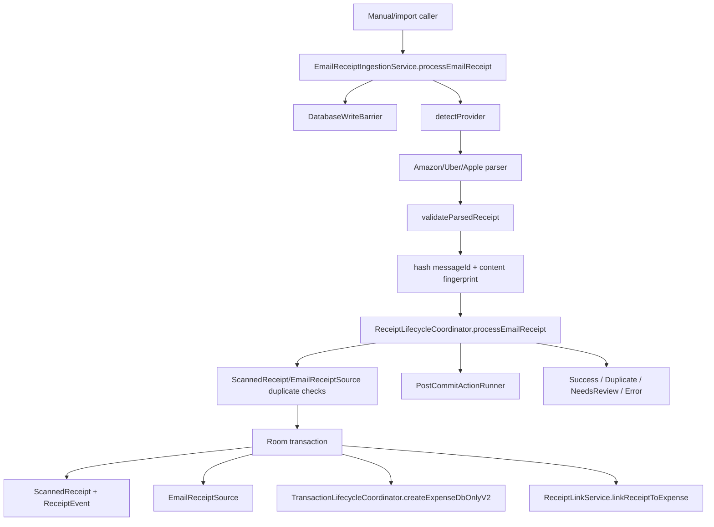

# Pipeline 11 Review — Email Receipt Inestion

## 0. Review constraints

Repository: `https://github.com/panospao7/Cost-agregator`  
Target commit: `83b798e849b4408b2bf683f52cb2746d37f7af16`  
Pipeline: **P11 — Email Receipt Ingestion**

Mode performed: **remote static review only**.

Build/test status: **NOT RUN**

Reason:
- No local checkout or terminal access.
- I could not run:
  - `git rev-parse HEAD`
  - `git status`
  - `rg`
  - Gradle tests

Mandatory first command for any implementation/validation agent:

```bash
git rev-parse HEAD
```

Expected:

```text
83b798e849b4408b2bf683f52cb2746d37f7af16
```

If not exact, stop.

Sources used:
- P11 issue doc: https://raw.githubusercontent.com/panospao7/Cost-agregator/83b798e849b4408b2bf683f52cb2746d37f7af16/docs/analyses%20and%20debug%20master/PIPELINE_11_CONSOLIDATED_ISSUES.md
- P11 implementation plan: https://raw.githubusercontent.com/panospao7/Cost-agregator/83b798e849b4408b2bf683f52cb2746d37f7af16/docs/analyses%20and%20debug%20master/pipelines%20issues%20implementantion%20plan/PIPELINE_11_IMPLEMENTATION_PLAN.md
- `EmailReceiptIngestionService.kt`: https://raw.githubusercontent.com/panospao7/Cost-agregator/83b798e849b4408b2bf683f52cb2746d37f7af16/app/src/main/java/com/yourname/expensetracker/data/email/EmailReceiptIngestionService.kt
- `ReceiptLifecycleCoordinator.kt`: https://raw.githubusercontent.com/panospao7/Cost-agregator/83b798e849b4408b2bf683f52cb2746d37f7af16/app/src/main/java/com/yourname/expensetracker/domain/receipt/lifecycle/ReceiptLifecycleCoordinator.kt
- `EmailReceiptSource.kt`: https://raw.githubusercontent.com/panospao7/Cost-agregator/83b798e849b4408b2bf683f52cb2746d37f7af16/app/src/main/java/com/yourname/expensetracker/data/database/entity/EmailReceiptSource.kt
- `EmailReceiptDao.kt`: https://raw.githubusercontent.com/panospao7/Cost-agregator/83b798e849b4408b2bf683f52cb2746d37f7af16/app/src/main/java/com/yourname/expensetracker/data/database/dao/EmailReceiptDao.kt
- `ScannedReceipt.kt`: https://raw.githubusercontent.com/panospao7/Cost-agregator/83b798e849b4408b2bf683f52cb2746d37f7af16/app/src/main/java/com/yourname/expensetracker/data/database/entity/ScannedReceipt.kt
- `ScannedReceiptDao.kt`: https://raw.githubusercontent.com/panospao7/Cost-agregator/83b798e849b4408b2bf683f52cb2746d37f7af16/app/src/main/java/com/yourname/expensetracker/data/database/dao/ScannedReceiptDao.kt
- `AmazonReceiptParser.kt`: https://raw.githubusercontent.com/panospao7/Cost-agregator/83b798e849b4408b2bf683f52cb2746d37f7af16/app/src/main/java/com/yourname/expensetracker/data/email/provider/AmazonReceiptParser.kt
- `UberReceiptParser.kt`: https://raw.githubusercontent.com/panospao7/Cost-agregator/83b798e849b4408b2bf683f52cb2746d37f7af16/app/src/main/java/com/yourname/expensetracker/data/email/provider/UberReceiptParser.kt
- `AppleReceiptParser.kt`: https://raw.githubusercontent.com/panospao7/Cost-agregator/83b798e849b4408b2bf683f52cb2746d37f7af16/app/src/main/java/com/yourname/expensetracker/data/email/provider/AppleReceiptParser.kt
- `EmailReceiptParser.kt`: https://raw.githubusercontent.com/panospao7/Cost-agregator/83b798e849b4408b2bf683f52cb2746d37f7af16/app/src/main/java/com/yourname/expensetracker/data/email/provider/EmailReceiptParser.kt
- `EmailReceiptPersistencePayload.kt`: https://raw.githubusercontent.com/panospao7/Cost-agregator/83b798e849b4408b2bf683f52cb2746d37f7af16/app/src/main/java/com/yourname/expensetracker/domain/privacy/EmailReceiptPersistencePayload.kt
- `RawPersistencePolicyResolver.kt`: https://raw.githubusercontent.com/panospao7/Cost-agregator/83b798e849b4408b2bf683f52cb2746d37f7af16/app/src/main/java/com/yourname/expensetracker/domain/privacy/RawPersistencePolicyResolver.kt
- `LEGAL_PATHS.md`: https://raw.githubusercontent.com/panospao7/Cost-agregator/83b798e849b4408b2bf683f52cb2746d37f7af16/docs/architecture/LEGAL_PATHS.md
- `SENSITIVE_DIAGNOSTICS_POLICY.md`: https://raw.githubusercontent.com/panospao7/Cost-agregator/83b798e849b4408b2bf683f52cb2746d37f7af16/docs/architecture/SENSITIVE_DIAGNOSTICS_POLICY.md
- `CODEBASE_SEGMENTS.md`: https://raw.githubusercontent.com/panospao7/Cost-agregator/83b798e849b4408b2bf683f52cb2746d37f7af16/docs/architecture/CODEBASE_SEGMENTS.md

---

# Pipeline 11 Review — Email Receipt Ingestion

## 1. Pipeline summary

P11 ingests receipt-like emails, detects provider, parses provider-specific receipt data, computes privacy-safe dedupe keys, and delegates receipt/expense mutation to `ReceiptLifecycleCoordinator`.

Primary responsibilities:
- detect provider from sender/subject/body,
- parse Amazon/Uber/Apple receipt emails,
- validate parsed receipt amount/merchant/date,
- hash message IDs and dedupe fingerprints,
- route high-confidence emails into receipt lifecycle / transaction lifecycle,
- route low-confidence emails to a review result,
- persist sanitized email source metadata,
- emit diagnostics,
- obey restore write barrier and raw-storage policy.

Main data flow:



Current high-level verdict:

```text
RED / high YELLOW
```

The current code fixes several stale tracker items, but P11 is not GREEN because:
1. provider detection still has broad body/sender fallback that can bypass narrowed `canParse()`;
2. batch ingestion is still sequential despite a semaphore;
3. same-message concurrent ingestion can still race because DB uniqueness is not on the hash/fingerprint fields that are used in restricted privacy modes;
4. low-confidence email receipts return `NeedsReview` but no visible `PendingReview` row is created in the reviewed email path;
5. parser/provider tests and privacy/export tests were not verified.

---

## 2. File inventory

| Category | Files reviewed | Why relevant | Notes |
|---|---|---|---|
| Pipeline docs | `PIPELINE_11_CONSOLIDATED_ISSUES.md`, `PIPELINE_11_IMPLEMENTATION_PLAN.md` | Tracker reconciliation | Docs are stale/inconsistent. Consolidated doc says parser issues fixed but summary still lists “OPEN new issues.” |
| Architecture docs | `CODEBASE_SEGMENTS.md`, `LEGAL_PATHS.md`, `SENSITIVE_DIAGNOSTICS_POLICY.md` | Segment ownership, legal receipt/expense paths, privacy logging policy | Receipt lifecycle and transaction lifecycle legal paths are normative. |
| Entry service | `EmailReceiptIngestionService.kt` | Main P11 entrypoint | Thin parser/delegate layer; has semaphore and diagnostics. `processBatch()` is sequential. |
| Provider parsers | `AmazonReceiptParser.kt`, `UberReceiptParser.kt`, `AppleReceiptParser.kt`, `EmailReceiptParser.kt` | Parser precision/date/amount/currency handling | Amazon/Uber `canParse()` narrowed. Service fallback remains broad. |
| Receipt lifecycle | `ReceiptLifecycleCoordinator.kt` | Owns mutations, receipt save, source insert, expense creation/link, side effects | Uses `DatabaseWriteBarrier` and email-specific raw-storage mode. Low-confidence returns `NeedsReview` but no reviewed `PendingReview` insert in email path. |
| Email persistence | `EmailReceiptSource.kt`, `EmailReceiptDao.kt` | Email source table, unique/index conflict behavior | Raw email fields nullable; unique only on `emailMessageId`; hashes are indexed but not unique. |
| Receipt entities/DAO | `ScannedReceipt.kt`, `ScannedReceiptDao.kt` | Duplicate race / sourceFingerprint evidence | File comment says fingerprint fields have no unique constraints. |
| Privacy | `EmailReceiptPersistencePayload.kt`, `RawPersistencePolicyResolver.kt` | Email storage modes and payload contract | Contract exists; coordinator manually sanitizes instead of using payload. |
| Hilt | `EmailIngestionModule.kt` | Parser module | Provides parser classes. Service itself is constructor-injected. |
| Not fully reviewed | AppDatabase, DatabaseMigrations, backup verifier/export, all tests, UI/ViewModels, full Hilt graph | Need local `rg` | Required before final GREEN. |

Files intentionally skipped / not fully reviewed:
- tests: no local test tree access via `rg`;
- backup/export/P12 serializers: no local inventory;
- pending-review UI/routes: no local `rg`;
- full migrations/schema JSON: not available through static review;
- direct DAO call inventory: needs local `rg`.

---

## 3. Architecture comparison

### Legal paths

`LEGAL_PATHS.md` says:
- expense creation from email/receipt must flow through `TransactionLifecycleCoordinator`;
- receipt mutations must flow through `ReceiptLifecycleCoordinator`;
- raw storage must use `RawStorageMode` and sanitized DB persistence;
- writes must be blocked by `DatabaseWriteBarrier`.

Reviewed code mostly follows this:
- `EmailReceiptIngestionService` delegates mutation to `ReceiptLifecycleCoordinator`.
- `ReceiptLifecycleCoordinator.processEmailReceipt()` checks `DatabaseWriteBarrier`.
- Expense creation uses `TransactionLifecycleCoordinator.createExpenseDbOnlyV2`.
- Link is done by `ReceiptLinkService`.
- Side effects run once after commit by `PostCommitActionRunner`.

Remaining architecture gaps:
- `processBatch()` comment implies batch import/backfill, but implementation is sequential and not a true bounded-concurrency path.
- No DB unique constraint protects the HMAC message ID or content fingerprint. `ScannedReceipt` itself documents no unique constraints for source/text/semantic fingerprints.
- `NeedsReview` path returns a typed result, but in the email path reviewed it does not create a `PendingReview` row. If no caller persists that result into a review queue, the “pending-review route” is incomplete.

### Privacy/raw-storage architecture

Good:
- `RawPersistencePolicyResolver` has `EMAIL_RECEIPT -> settings.emailReceiptStorageMode`.
- `ReceiptLifecycleCoordinator` uses `privacySettingsRepository.getSettings().emailReceiptStorageMode`.
- `EmailReceiptSource.emailSender`, `emailSubject`, and `emailMessageId` are nullable.
- raw message ID is stored only in `STORE_RAW`; HMAC hash is used for dedupe.

Gaps:
- `EmailReceiptPersistencePayload` exists but is not used in the reviewed coordinator path.
- `EmailReceiptSource` has no body field; body is stored as `ScannedReceipt.rawOcrText`, sanitized by email mode. That is acceptable if intentional, but should be documented/tested.
- Parsed items are retained as JSON in `STORE_RAW` and replaced with `"[REDACTED_ITEMS]"` in redacted mode; privacy tests must prove item text is not leaked.

### Sensitive diagnostics

Good:
- service uses hashed `messageId` and hashed `sender` in front-door diagnostics.
- diagnostics use `SafeEventMetadata`.
- `CancellationException` is rethrown in diagnostic catch blocks.

Gaps:
- service logs provider with `Timber.d`, acceptable only if stripped in release.
- parser warnings do not include raw email content.
- final full Timber/Log inventory not run.

### Doc/code drift

Major drift:
- Implementation plan says `NEW-P11-001`, parser broadness, date formatter, and Amazon regex issues are open; source shows partial/fixed code for these.
- Consolidated issue doc says `NEW-P11-001` fixed via semaphore, but `processBatch()` still maps sequentially.
- P11 docs say low-confidence route fixed; code returns `NeedsReview`, but does not visibly insert `PendingReview` for email receipts.

---

## 4. Runtime flow / call graph

### 4.1 Email service entry

```text
EmailReceiptIngestionService.processEmailReceipt(...)
  -> ingestionSemaphore.withPermit
  -> emit front_door diagnostic with hashed messageId/sender
  -> writeBarrier.checkWritesAllowed()
  -> detectProvider(sender, subject, body)
  -> parseEmailReceipt(emailBody, receivedAt, provider)
  -> validateParsedReceipt(amount > 0, merchant not blank, date > 0)
  -> normalize merchant
  -> createFingerprint(provider, merchant, amount, currency, hour bucket, orderNumber, senderDomain)
  -> hmac messageId
  -> ReceiptLifecycleCoordinator.processEmailReceipt(...)
```

### 4.2 Provider detection

`detectProvider()` first uses parser `canParse()`, but then falls back to:
- `sender.contains("amazon")`, `sender.contains("uber")`, etc.;
- body contains `amazon.com`, `uber.com`, `apple.com`, `itunes`;
- unknown provider then tries all parsers.

This partially undermines the narrowed parser `canParse()` fixes.

### 4.3 Parser path

- Amazon parser requires Amazon sender/domain in `canParse()`.
- Uber parser requires Uber sender/domain in `canParse()`.
- Apple parser accepts Apple sender or subject/body combination.
- Date formatters in `BaseEmailParser` are cached via `formatterCache`.
- Amazon regex uses raw `\s`/digit groups correctly, not double escaped.

### 4.4 Dedupe/fingerprint path

Service fingerprint includes:
- provider,
- normalized merchant,
- rounded amount,
- currency,
- sender domain,
- 1-hour date bucket,
- order number,
- SHA-256 prefix.

Coordinator dedupe checks:
- `scannedReceiptDao.getBySourceFingerprint(messageIdHash)`;
- `emailReceiptDao.getByFingerprint(fingerprint)`;
- receipt duplicate detector using text/semantic/externalSourceId;
- `insertOrIgnore(emailSource)` conflict resolution.

Critical detail:
- `EmailReceiptSource` unique index is only on nullable `emailMessageId`.
- `emailMessageIdHash` and `fingerprint` are indexed but not unique.
- `ScannedReceipt` has no unique constraint on source/text/semantic fingerprints; source file comment explicitly says duplicate receipts can be inserted if application-level dedupe races or is bypassed.

### 4.5 Receipt lifecycle / expense creation

Inside `ReceiptLifecycleCoordinator.processEmailReceipt()`:
- saves `ScannedReceipt`;
- inserts `EmailReceiptSource`;
- writes `ReceiptEvent`;
- if parsed data is valid and confidence is greater than `EMAIL_AUTO_EXPENSE_MIN_CONFIDENCE`, calls `TransactionLifecycleCoordinator.createExpenseDbOnlyV2`;
- links receipt via `ReceiptLinkService`;
- plans and runs side effects post-commit.

### 4.6 Low-confidence / review path

If confidence is `<= 0.75`, coordinator:
- saves receipt and email source;
- sets `needsReviewReason = "low_confidence"`;
- skips expense creation;
- returns `EmailReceiptProcessResult.NeedsReview`.

No `PendingReviewDao.insert()` is visible in the reviewed email branch, unlike the generic `processReceiptInput()` branch, which explicitly creates a `PendingReview`.

### 4.7 Batch/concurrency

`processBatch()` currently:

```kotlin
return emails.map { email -> processEmailReceipt(...) }
```

This is sequential. The semaphore limits concurrent callers, but `processBatch()` does not launch concurrent tasks, so the specific batch-concurrency claim is only partially fixed.

---

## 5. Issue table

| ID | Severity | Status | File(s) | Evidence | Impact | Reproduction path | Recommended fix | Required tests | Cross-pipeline impact |
|---|---:|---|---|---|---|---|---|---|---|
| P11-FIND-001 | P1 | bug/partial | `EmailReceiptIngestionService.kt` | `detectProvider()` still falls back to sender/body substring checks and unknown provider tries all parsers after parser `canParse()` narrows Amazon/Uber. | Unrelated email containing `amazon.com`, `uber.com`, or Apple keywords plus a total/date can be parsed as receipt and possibly auto-create expense if confidence clears threshold. | Email from non-Amazon sender with body containing `amazon.com`, total, and date. | Remove body-only provider forcing; require parser `canParse()` or strong sender+provider markers. Unknown fallback should parse only to `NeedsReview` or require high-confidence provider proof. | `amazon_body_marker_non_amazon_sender_not_auto_expensed`; `unknown_provider_weak_match_needs_review` | P3 receipt lifecycle, P5/P6 analytics |
| P11-FIND-002 | P1 | bug/partial | `EmailReceiptSource.kt`, `ScannedReceipt.kt`, `ScannedReceiptDao.kt`, `ReceiptLifecycleCoordinator.kt` | `EmailReceiptSource` unique index only on nullable `emailMessageId`; hashes/fingerprint not unique. `ScannedReceipt` comment says fingerprint fields lack unique constraints and app-level races can insert duplicates. | Concurrent same-message ingestion in restricted privacy modes can create duplicate receipts/expenses. | Two concurrent ingestions with same messageId under `STORE_REDACTED`/`DO_NOT_STORE`. | Add unique partial indexes on `emailMessageIdHash` and/or content fingerprint where non-null, or introduce transactional lock/claim table. Handle migration. | `same_message_id_concurrent_ingestion_one_receipt`; `do_not_store_message_hash_unique` | P2 expenses, P7 backup, P5/P6 reports |
| P11-FIND-003 | P2 | bug/partial | `EmailReceiptIngestionService.kt` | `ingestionSemaphore` exists, but `processBatch()` uses sequential `emails.map { processEmailReceipt(...) }`; no `async`/bounded parallelism. | Batch import/backfill remains serialized despite tracker claiming bounded concurrency fixed. | Process batch of 10 emails with slow parser; observe one-at-a-time execution. | Use `coroutineScope { emails.map { async { processEmailReceipt(...) } }.awaitAll() }`; semaphore still caps concurrency. | `batch_processing_runs_with_bounded_parallelism`; `batch_does_not_exceed_three_active_ingestions` | P9 if future worker uses batch |
| P11-FIND-004 | P1 | partial | `ReceiptLifecycleCoordinator.kt` | Low-confidence email branch sets `needsReviewReason` and returns `EmailReceiptProcessResult.NeedsReview`, but reviewed code does not insert `PendingReview`; generic receipt path does insert `PendingReview`. | User may never see uncertain email receipt in review queue unless caller handles result separately. | Low-confidence Amazon/Uber/Apple email; inspect `pending_reviews`. | Create `PendingReview` row inside email coordinator transaction or document/test caller-owned review creation. | `low_confidence_email_creates_pending_review_row`; `needs_review_result_has_review_queue_entry` | Review UI, P3 receipt lifecycle |
| P11-FIND-005 | P2 | partial | `ReceiptLifecycleCoordinator.kt`, `EmailReceiptPersistencePayload.kt` | Email-specific raw mode is used manually, but `EmailReceiptPersistencePayload` contract is not used in reviewed coordinator path. | Policy logic may drift; payload tests may not cover real write path. | Change payload behavior; coordinator still stores fields manually. | Refactor coordinator to build/use `EmailReceiptPersistencePayload`, or add tests proving manual path matches payload matrix. | `email_coordinator_matches_persistence_payload_for_all_modes` | P8 privacy, P12 export |
| P11-FIND-006 | P2 | bug/privacy | `ReceiptLifecycleCoordinator.kt` | `Timber.w(err.exception, "Email receipt %d create error", savedId)` logs exception object; exception messages may contain merchant/amount unless sanitized by producer. | Release warning/error logs can leak sensitive parse/transaction context. | Force transaction lifecycle error with message containing merchant/amount. | Log sanitized code only; do not pass raw exception to Timber warning in release path, or sanitize exception message first. | `email_create_error_log_sanitized`; diagnostic golden test | P8 sensitive diagnostics |
| P11-FIND-007 | P2 | needs verification | tests | P11 parser/dedupe/privacy tests were not enumerated or run. | Fixed claims may be unprotected. | Run P11 targeted Gradle commands. | Add missing tests listed below. | full P11 test suite | All P11 |

---

## 6. Universal contract audit

### Restore barrier — PASS/PARTIAL

Evidence:
- `EmailReceiptIngestionService.processEmailReceipt()` calls `writeBarrier.checkWritesAllowed`.
- `ReceiptLifecycleCoordinator.processEmailReceipt()` calls `writeBarrier.checkWritesAllowed`.
- `saveEmailReceiptTyped()` and `saveEmailReceipt()` call the write barrier.

Gaps:
- Full direct DAO write inventory not run.
- Need verify no alternate email service/coordinator exists.

Verdict: **PARTIAL PASS**

### Privacy/redaction/raw storage — PARTIAL

Evidence:
- `RawPersistencePolicyResolver` maps `EMAIL_RECEIPT` to `settings.emailReceiptStorageMode`.
- Coordinator uses `emailReceiptStorageMode` for `rawOcrText`, sender, subject, raw message ID, and parsed items.
- `EmailReceiptSource` raw fields are nullable.
- `EmailReceiptPersistencePayload` provides a formal matrix.

Gaps:
- Coordinator does not use `EmailReceiptPersistencePayload`.
- Unique dedupe hash is not enforced at DB level.
- Parsed item privacy needs tests.
- Exception logging may leak.

Verdict: **PARTIAL**

### Lifecycle ownership — PARTIAL PASS

Evidence:
- service does not write expenses/receipts directly.
- coordinator owns receipt/event/source/expense/link flow.
- expense creation uses `TransactionLifecycleCoordinator.createExpenseDbOnlyV2`.
- direct deprecated `createExpenseFromReceipt()` is disabled.

Gaps:
- low-confidence review route may not write `PendingReview`.
- race-level duplicate prevention lacks DB uniqueness.

Verdict: **PARTIAL PASS**

### Worker guard/run logging — NOT APPLICABLE / NEEDS VERIFICATION

No P11 worker was reviewed. Must run:

```bash
rg -n "class .*Email.*Worker|Email.*CoroutineWorker|EmailSync|EmailImport|enqueue.*Email|email.*Worker" app/src/main app/src/test app/src/androidTest
```

Verdict: **UNKNOWN / LIKELY N/A**

### Money/currency normalization — PARTIAL

Evidence:
- service validates amount > 0 and date > 0.
- parsers detect currency; coordinator passes parsed currency or home currency.
- coordinator resolves home currency before DB transaction and falls back to `XXX`.

Gaps:
- provider parser defaults still use `USD`/`EUR` fallbacks in several cases.
- no local parser golden tests run for locale/currency/date edge cases.

Verdict: **PARTIAL**

### Diagnostics/events — PARTIAL

Evidence:
- service emits front-door, provider, parser, validation, dedupe, and outcome diagnostics.
- metadata uses `SafeEventMetadata` and hashed IDs.
- diagnostic catch blocks rethrow CE.

Gaps:
- `Timber.w(err.exception, ...)` may leak exception messages.
- full release log inventory not run.

Verdict: **PARTIAL**

### Import/export/backup — UNKNOWN

Need verify:
- `email_receipt_sources` included in backup verifier or intentionally excluded.
- redacted export excludes raw sender/subject/messageId/body fields.
- restore preserves hash/fingerprint/source links.

Verdict: **UNKNOWN_NEEDS_RG**

### DAO conflict/timestamps — PARTIAL/FAIL

Pass:
- `EmailReceiptDao.insertOrIgnore()` result is checked.
- `EmailReceiptSource` FK cascades on receipt delete.
- timestamps use `timeProvider.now()`.

Fail/gap:
- unique conflict is on nullable raw message ID; in non-raw modes, hash/fingerprint conflicts do not enforce uniqueness.
- `ScannedReceipt` lacks unique constraints for source/text/semantic fingerprints.

Verdict: **PARTIAL/FAIL**

---

## 7. P11 issue reconciliation

| Tracker issue | Tracker status | Code status at target SHA | Evidence | Final status | Notes |
|---|---|---|---|---|---|
| P11-P1-01 fingerprint too coarse | Partial | Mostly fixed, but DB uniqueness/race remains | Fingerprint includes provider, merchant, amount, currency, sender domain, hour bucket, order number. | PARTIALLY_FIXED | Needs unique enforcement and tests. |
| P11-P1-02 existing duplicate/failure handling | Partial | Mostly fixed | DuplicateSkipped links existing expense; validation/insert/error set `needsReviewReason` and emit diagnostics. | PARTIALLY_FIXED | Needs review row and tests. |
| P11-P1-03 service partially uses lifecycle | Fixed | Fixed | Service delegates all mutation to `ReceiptLifecycleCoordinator`; no direct expense/receipt DAO writes in service. | FIXED | Verify no alternate path via `rg`. |
| P11-P1-04 raw email fields wrong privacy policy | Partial | Mostly fixed | Coordinator uses `emailReceiptStorageMode`, not OCR mode. | PARTIALLY_FIXED | Does not use payload contract; privacy tests needed. |
| P11-P1-05 restore barrier incomplete | Partial | Fixed in reviewed path | Service and coordinator use `DatabaseWriteBarrier`; no `RestoreMaintenanceMode` direct usage found in coordinator. | FIXED_NEEDS_RG | Full source search required. |
| P11-P1-06 source insert conflict ignored | Partial | Partial | `insertOrIgnore()` checked; conflict lookup includes messageId/fingerprint/hash. | PARTIALLY_FIXED | Hash/fingerprint not unique, so many conflicts never happen. |
| P11-P1-07 side effects skipped/double-dispatched | Fixed | Fixed in reviewed path | service does not dispatch; coordinator runs one combined post-commit batch. | FIXED_NEEDS_TEST | Good architecture. |
| P11-P1-08 no pending-review route | Fixed | Partial | returns `NeedsReview`, but no `PendingReviewDao.insert()` visible in email path. | PARTIALLY_FIXED | Needs queue persistence or caller test. |
| NEW-P11-001 mutex blocks batch | Fixed | Partial | semaphore exists, but `processBatch()` sequentially maps. | PARTIALLY_FIXED | Tracker overstates fix. |
| NEW-P11-002 Amazon canParse broad | Fixed | Parser fixed, service fallback partial | Amazon `canParse()` requires sender/domain; service body fallback remains broad. | PARTIALLY_FIXED | Fix service detection. |
| NEW-P11-003 Uber canParse broad | Fixed | Parser fixed, service fallback partial | Uber `canParse()` requires sender/domain; service body fallback remains broad. | PARTIALLY_FIXED | Fix service detection. |
| NEW-P11-004 date formatter allocation | Fixed | Fixed in base parser | `formatterCache` lazy list exists. | FIXED_NEEDS_TEST | Good. |
| NEW-P11-005 Amazon regex double escaping | Fixed | Fixed | Amazon raw regex uses `\s` and digit classes correctly. | FIXED_NEEDS_TEST | Good. |

---

## 8. Test coverage review

Tests were not run or inventoried.

Required local search:

```bash
rg -n "EmailReceipt|EmailIngestion|AmazonReceipt|UberReceipt|AppleReceipt|EmailDate|processEmailReceipt|emailStorageMode|messageId|fingerprint|NeedsReview" app/src/test app/src/androidTest
```

Existing tests found: **UNKNOWN**.

Missing/needed tests:
- `batch_processing_runs_with_bounded_parallelism`
- `batch_processing_does_not_exceed_three_active_ingestions`
- `amazon_body_marker_non_amazon_sender_not_auto_expensed`
- `uber_body_marker_non_uber_sender_not_auto_expensed`
- `unknown_provider_weak_match_needs_review`
- `same_message_id_concurrent_ingestion_is_idempotent`
- `do_not_store_message_hash_unique_or_claimed`
- `low_confidence_email_creates_pending_review_row`
- `email_coordinator_matches_persistence_payload_for_all_modes`
- `diagnostics_do_not_include_raw_email_body_subject_sender`
- `redacted_export_excludes_raw_email_fields`
- `backup_restore_preserves_email_hashes_and_links`

Weak tests to watch for:
- parser tests that call parser `canParse()` directly but not `EmailReceiptIngestionService.detectProvider()`;
- dedupe tests that are sequential only, not concurrent;
- privacy tests that check `EmailReceiptPersistencePayload` but not the actual coordinator write path;
- `NeedsReview` tests that only check return type, not `pending_reviews` table.

---

## 9. Test plan

### Unit tests

| Test | Purpose |
|---|---|
| `amazon_parser_accepts_real_amazon_sender` | Preserve fixed Amazon parser behavior. |
| `amazon_parser_rejects_non_amazon_total_email` | Prevent parser false positives. |
| `email_service_does_not_force_amazon_from_body_only_marker` | Covers service fallback, not just parser. |
| `uber_parser_rejects_non_uber_trip_email` | Prevent Uber false positives. |
| `date_formatters_are_cached` | NEW-P11-004 regression. |
| `amazon_order_regex_matches_real_order_ids` | NEW-P11-005 regression. |
| `fingerprint_includes_currency_domain_order_number` | P11-P1-01 regression. |
| `email_storage_mode_matrix_matches_payload` | Privacy mode correctness. |

### Integration tests

| Test | Purpose |
|---|---|
| `same_message_id_reimport_returns_duplicate` | Sequential idempotency. |
| `same_message_id_concurrent_ingestion_is_idempotent` | Race safety. |
| `same_merchant_amount_date_different_order_not_deduped` | Avoid false duplicate. |
| `low_confidence_email_creates_pending_review_row` | True review queue route. |
| `high_confidence_email_uses_receipt_and_transaction_lifecycle` | Legal path. |
| `duplicate_email_does_not_dispatch_side_effects_twice` | Side-effect idempotency. |
| `email_ingestion_blocked_during_restore` | Restore barrier. |
| `do_not_store_email_mode_drops_subject_sender_message_id_body` | Raw storage. |
| `store_redacted_email_mode_writes_redacted_fields` | Raw storage. |
| `message_id_hash_available_in_all_modes` | Privacy-safe dedupe. |

### Regression/static tests

```bash
./gradlew :app:testDebugUnitTest --tests "*EmailReceipt*"
./gradlew :app:testDebugUnitTest --tests "*EmailIngestion*"
./gradlew :app:testDebugUnitTest --tests "*AmazonReceipt*"
./gradlew :app:testDebugUnitTest --tests "*UberReceipt*"
./gradlew :app:testDebugUnitTest --tests "*AppleReceipt*"
./gradlew :app:testDebugUnitTest --tests "*EmailDate*"
./gradlew :app:testDebugUnitTest --tests "*ReceiptLifecycle*"
./gradlew :app:testDebugUnitTest --tests "*RawStorage*"
./gradlew :app:testDebugUnitTest --tests "*Privacy*"
./gradlew :app:testDebugUnitTest --tests "*Barrier*"
./gradlew :app:testDebugUnitTest --tests "*Diagnostic*"
```

### Manual validation

1. Import a real Amazon email twice; expect one receipt/source/expense.
2. Import the same email concurrently; expect one receipt/source/expense.
3. Import a non-Amazon email with an `amazon.com` link and a total; expect parse error or review, not auto-expense.
4. Set email storage to `DO_NOT_STORE`; verify no raw sender/subject/messageId/body persisted.
5. Restore/backup mode active; ingestion must fail closed before mutation.
6. Redacted export/backup should not expose raw email fields.

---

## 10. Optional deliverables

### Legal write path table

| Flow | Required legal path | Reviewed status |
|---|---|---|
| Email service | Parser/delegate only → no DAO writes | PASS |
| Receipt save | `ReceiptLifecycleCoordinator` → `ScannedReceiptDao` + `ReceiptEventDao` | PASS/PARTIAL |
| Email source insert | `ReceiptLifecycleCoordinator` → `EmailReceiptDao.insertOrIgnore` | PARTIAL due non-unique hash/fingerprint |
| Expense creation | `TransactionLifecycleCoordinator.createExpenseDbOnlyV2` | PASS |
| Receipt-expense link | `ReceiptLinkService.linkReceiptToExpense` | PASS |
| Low-confidence route | create durable review queue entry or documented caller-owned route | PARTIAL |
| Side effects | coordinator post-commit once | PASS |
| Raw storage | email-specific `RawStorageMode` | PASS/PARTIAL |

### Parser decision table

| Provider | `canParse()` status | Service fallback status | Risk |
|---|---|---|---|
| Amazon | sender/domain required | body/sender substring can still force provider | false-positive possible |
| Uber | sender/domain required | body/sender substring can still force provider | false-positive possible |
| Apple | sender or subject+body | broad subject/body combinations | medium |
| Unknown | tries all parsers | can parse without explicit provider identity | medium/high |

### Safe PR plan

1. **PR1 — Provider detection and batch concurrency**
   - remove broad body-only provider forcing;
   - make `processBatch()` truly bounded-concurrent;
   - add parser/service false-positive tests.

2. **PR2 — Dedupe race safety**
   - add unique indexes or claim table for email message hash/fingerprint;
   - handle migration;
   - add concurrent ingestion tests.

3. **PR3 — Review queue correctness**
   - ensure `NeedsReview` creates durable pending review row or document caller-owned review creation with tests.

4. **PR4 — Privacy/diagnostic hardening**
   - use `EmailReceiptPersistencePayload` or test equivalence;
   - sanitize exception logging;
   - add export/backup privacy tests.

5. **PR5 — Docs/tracker sync**
   - mark parser fixes accurately;
   - downgrade NEW-P11-001 and P11-P1-08 from fixed to partial until verified.

---

## 11. Final verdict

Verdict:

```text
RED / high YELLOW
```

P11 is much improved compared with the older implementation plan:
- service is a thin parser/delegate;
- coordinator owns receipt/expense mutation;
- write barriers are present in reviewed service/coordinator paths;
- email-specific raw storage mode is used;
- messageId is HMACed before coordinator use;
- parser regex/date formatter issues appear fixed;
- side effects are centralized post-commit.

However, P11 is **not production-safe GREEN** because:
1. service provider detection still allows broad body/sender fallback and can bypass narrowed `canParse()` fixes;
2. `processBatch()` is still sequential, so the batch-concurrency fix is overstated;
3. concurrent duplicate prevention lacks DB uniqueness on the privacy-safe hash/fingerprint fields;
4. low-confidence email receipts return `NeedsReview` but no reviewed email path inserts `PendingReview`;
5. privacy/export/backup/test coverage was not verified locally.

Highest-risk remaining issue:

```text
Concurrent duplicate email ingestion can still create duplicate receipts/expenses because the DB unique constraint is on nullable raw emailMessageId, while restricted privacy modes rely on non-unique messageIdHash/sourceFingerprint.
```

Must fix before GREEN:
- DB-level or equivalent transactional uniqueness for message hash/fingerprint;
- provider detection must be strict enough to avoid false-positive auto-expense creation;
- low-confidence receipts must produce a durable review queue entry;
- processBatch must truly use bounded concurrency if that is claimed;
- full local P11 targeted tests and export/backup privacy checks must pass.