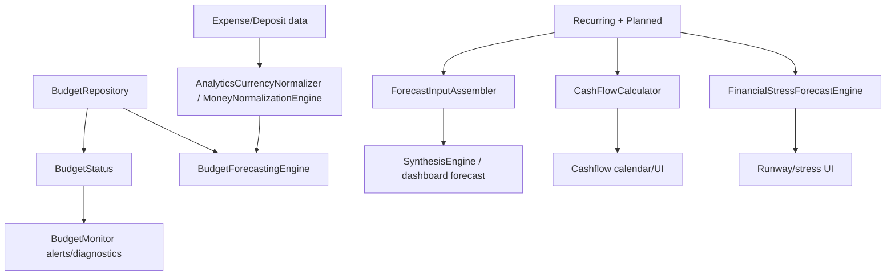

# Pipeline 6 Review — Budget / Forecasting / Cashflow

## 1. Pipeline summary

Target reviewed remotely at commit `83b798e849b4408b2bf683f52cb2746d37f7af16`; I could not run local `git checkout`, `rg`, or Gradle commands in this environment. GitHub confirms the target commit and tree are reachable. ([github.com](https://github.com/panospao7/Cost-agregator/commit/83b798e849b4408b2bf683f52cb2746d37f7af16))

P6 covers:
- budget lifecycle/status/alerts/rollover,
- budget forecasting and forecast persistence,
- forecast input assembly,
- stress/cashflow projection,
- multi-currency money handling for those flows.

Main data flow:

Architecture ownership matches docs: Forecasting/Runway is segment 1, Budget Management segment 2, Cash Flow Planning segment 13, Currency segment 16. ([raw.githubusercontent.com](https://raw.githubusercontent.com/panospao7/Cost-agregator/83b798e849b4408b2bf683f52cb2746d37f7af16/docs/architecture/CODEBASE_SEGMENTS.md)) Cross-engine risk is high for `CurrencyConverter`, `MoneyAggregate`, `TimePeriodUtils`, and `AnalyticsInputAssembler`. ([raw.githubusercontent.com](https://raw.githubusercontent.com/panospao7/Cost-agregator/83b798e849b4408b2bf683f52cb2746d37f7af16/docs/architecture/ENGINE_INTERACTION_MAP.md))

## 2. File inventory

| Category | Files reviewed | Why relevant | Notes |
|---|---|---|---|
| Issue docs | `PIPELINE_6_CONSOLIDATED_ISSUES.md`, P6 implementation plan, master/universal trackers | Tracker reconciliation | Docs are stale vs code in several places. P6 issue doc says 9 old fixed, 5 TODO, 16 new issues. ([raw.githubusercontent.com](https://raw.githubusercontent.com/panospao7/Cost-agregator/83b798e849b4408b2bf683f52cb2746d37f7af16/docs/analyses%20and%20debug%20master/PIPELINE_6_CONSOLIDATED_ISSUES.md)) |
| Architecture | `ARCHITECTURE.md`, `CODEBASE_SEGMENTS.md`, `LEGAL_PATHS.md`, `ENGINE_INTERACTION_MAP.md` | Ownership/legal-path validation | Legal paths mandate write/read barriers and coordinator ownership for recurring, restore, workers. ([raw.githubusercontent.com](https://raw.githubusercontent.com/panospao7/Cost-agregator/83b798e849b4408b2bf683f52cb2746d37f7af16/docs/architecture/LEGAL_PATHS.md)) |
| Budget repo | `BudgetRepository.kt` | CRUD, status, rollover, FX basis, delete | Barrier guards and CE rethrows present. Period-end FX basis mostly fixed. Rollover query count capped but loop still scans all periods in memory. |
| Budget monitor | `BudgetMonitor.kt` | Alerts/diagnostics | Uses adjusted spend; diagnostic writes rethrow CE. |
| Forecast engine | `BudgetForecastingEngine.kt` | Forecast refresh/persist/conflict/data quality | Uses write barrier, period-end limit conversion, data-quality persisted, unique conflict handling. |
| Forecast input | `ForecastInputAssembler.kt` | Planned/recurring input/status/dedup | Planned expenses normalized; recurring pattern merge still has TODO saying Synthesis sums raw recurring amounts. |
| Cashflow | `CashFlowCalculator.kt` | Daily cashflow, dedup, multicurrency, recurring direction | Actual income/expense normalized; recurring income still always treated as expense. |
| Stress | `FinancialStressForecastEngine.kt` | Stress horizons, PAID exclusion, patterns, account balance | PAID fixed; stale pattern only Timber warning; thresholds still constants/TODO; balance model remains net-cashflow estimate. |
| Time/period | `BudgetCalculator.kt` | Budget period windows | Uses `TimePeriodUtils.getWeekRange`; `TimePeriodUtils` not opened, so `WEEK_OF_YEAR` issue not fully verified. |
| Not fully reviewed | DAOs/entities/Hilt/UI/tests/import-export | Tool-call limit | Must be checked locally with `rg`/Gradle before final GREEN. |

## 3. Architecture comparison

- Restore/write barrier: P6 writes reviewed generally follow the architecture law that DB writes must be blocked during restore/maintenance. `BudgetRepository.add/update/delete/toggle/deleteAll/restoreDebugSnapshot` call `writeBarrier.checkWritesAllowed`. ([raw.githubusercontent.com](https://raw.githubusercontent.com/panospao7/Cost-agregator/83b798e849b4408b2bf683f52cb2746d37f7af16/app/src/main/java/com/yourname/expensetracker/data/repository/BudgetRepository.kt)) ([raw.githubusercontent.com](https://raw.githubusercontent.com/panospao7/Cost-agregator/83b798e849b4408b2bf683f52cb2746d37f7af16/app/src/main/java/com/yourname/expensetracker/data/repository/BudgetRepository.kt))
- Recurring read paths: `ForecastInputAssembler` and `CashFlowCalculator` project occurrences in memory and read materialized occurrences with a `DatabaseReadBarrier`, which aligns with legal paths forbidding uncontrolled lifecycle writes. ([raw.githubusercontent.com](https://raw.githubusercontent.com/panospao7/Cost-agregator/83b798e849b4408b2bf683f52cb2746d37f7af16/app/src/main/java/com/yourname/expensetracker/domain/forecasting/ForecastInputAssembler.kt)) ([raw.githubusercontent.com](https://raw.githubusercontent.com/panospao7/Cost-agregator/83b798e849b4408b2bf683f52cb2746d37f7af16/app/src/main/java/com/yourname/expensetracker/domain/cashflow/CashFlowCalculator.kt))
- Tracker drift: docs refer to `StressForecastEngine.kt`; actual implementation reviewed is `FinancialStressForecastEngine.kt`. P6 implementation plan also names `FinancialStressForecastEngine.kt`, confirming tracker/code drift. ([raw.githubusercontent.com](https://raw.githubusercontent.com/panospao7/Cost-agregator/83b798e849b4408b2bf683f52cb2746d37f7af16/docs/analyses%20and%20debug%20master/pipelines%20issues%20implementantion%20plan/PIPELINE_6_IMPLEMENTATION_PLAN.md))
- Stale tracker statuses: several issues listed TODO/open in docs appear fixed or partly fixed in code, especially P6-P1-06, P6-P1-11, P6-P1-14, NEW-P6-006/007/014.
- Still-open design gaps: stress balance semantics, recurring income direction, configurable risk thresholds, recurring-pattern normalization into synthesis.

## 4. Runtime flow / call graph

### Budget CRUD
`BudgetViewModel/UI` → `BudgetRepository.addBudget/updateBudget/deleteBudget/toggleBudget/deleteAll` → `DatabaseWriteBarrier` → `BudgetDao` / `BudgetForecastDao` → diagnostic event best-effort.

Evidence: `addBudget` checks barrier, validates finite amount/currency/thresholds, emits diagnostics, and rethrows `CancellationException`. ([raw.githubusercontent.com](https://raw.githubusercontent.com/panospao7/Cost-agregator/83b798e849b4408b2bf683f52cb2746d37f7af16/app/src/main/java/com/yourname/expensetracker/data/repository/BudgetRepository.kt)) Delete purges forecasts then budget in one transaction. ([raw.githubusercontent.com](https://raw.githubusercontent.com/panospao7/Cost-agregator/83b798e849b4408b2bf683f52cb2746d37f7af16/app/src/main/java/com/yourname/expensetracker/data/repository/BudgetRepository.kt))

### Budget status / alerts
`BudgetRepository.getBudgetStatuses()` combines day-boundary ticks, active budgets, categories, and expense invalidation, then `createBudgetStatus()`:
- computes period range,
- converts limit as-of period end,
- gets normalized aggregate spend,
- computes rollover,
- computes adjusted spend via shared-expense offset engine.

`BudgetMonitor.processBudgetStatus()` uses `adjustedSpendBreakdown.effectiveSpend` when present and computes alert percent from adjusted spend/effective limit. ([raw.githubusercontent.com](https://raw.githubusercontent.com/panospao7/Cost-agregator/83b798e849b4408b2bf683f52cb2746d37f7af16/app/src/main/java/com/yourname/expensetracker/domain/budget/BudgetMonitor.kt))

### Forecast refresh
`BudgetForecastingEngine.generateForecastResult()`:
- write-barrier guard,
- resolves home currency,
- converts budget amount with `RateBasis.PERIOD_END`,
- normalizes historical expenses,
- applies confidence penalty,
- persists `BudgetForecast` with valid timestamps/home currency/quality fields,
- inserts via typed conflict wrapper. ([raw.githubusercontent.com](https://raw.githubusercontent.com/panospao7/Cost-agregator/83b798e849b4408b2bf683f52cb2746d37f7af16/app/src/main/java/com/yourname/expensetracker/domain/budget/BudgetForecastingEngine.kt))

### Forecast input assembly
`ForecastInputAssembler.assemble()`:
- resolves home currency fail-closed,
- normalizes actual expense snapshots,
- projects active manual recurring occurrences read-only,
- reads materialized occurrences behind read barrier,
- uses only `PLANNED` occurrence keys,
- dedupes planned rows linked to occurrences,
- normalizes planned expenses via `MoneyNormalizationEngine`. ([raw.githubusercontent.com](https://raw.githubusercontent.com/panospao7/Cost-agregator/83b798e849b4408b2bf683f52cb2746d37f7af16/app/src/main/java/com/yourname/expensetracker/domain/forecasting/ForecastInputAssembler.kt)) ([raw.githubusercontent.com](https://raw.githubusercontent.com/panospao7/Cost-agregator/83b798e849b4408b2bf683f52cb2746d37f7af16/app/src/main/java/com/yourname/expensetracker/domain/forecasting/ForecastInputAssembler.kt))

### Cashflow
`CashFlowCalculator.calculateDailyCashFlow()`:
- resolves home currency and requires starting balance to match,
- projects/reads occurrences,
- dedupes actual vs predicted recurring,
- normalizes actual income/expenses via `MoneyNormalizationEngine`,
- converts predicted recurring with forecast-date rate,
- updates running balance.

Issue: `isIncomePattern()` currently returns `false`, so predicted recurring income cannot be represented. ([raw.githubusercontent.com](https://raw.githubusercontent.com/panospao7/Cost-agregator/83b798e849b4408b2bf683f52cb2746d37f7af16/app/src/main/java/com/yourname/expensetracker/domain/cashflow/CashFlowCalculator.kt))

### Stress
`FinancialStressForecastEngine.computeStressForecast()`:
- resolves display currency,
- uses `AccountBalanceProvider`,
- normalizes deposits/expenses,
- calculates 30/60/90 day horizons,
- status filter excludes PAID,
- computes projected balance as baseline + income - recurring - discretionary percentile. ([raw.githubusercontent.com](https://raw.githubusercontent.com/panospao7/Cost-agregator/83b798e849b4408b2bf683f52cb2746d37f7af16/app/src/main/java/com/yourname/expensetracker/domain/forecasting/FinancialStressForecastEngine.kt))

Issue: current mode is still `NET_CASHFLOW_ESTIMATE`; fallback provider is net cashflow, not real external/manual account balance. ([raw.githubusercontent.com](https://raw.githubusercontent.com/panospao7/Cost-agregator/83b798e849b4408b2bf683f52cb2746d37f7af16/app/src/main/java/com/yourname/expensetracker/domain/forecasting/FinancialStressForecastEngine.kt))

## 5. Issue table

| ID | Severity | Status | File(s) | Evidence | Impact | Recommended fix | Required tests | Cross-pipeline impact |
|---|---:|---|---|---|---|---|---|---|
| P6-FIND-001 | P1 | bug/partial | `ForecastInputAssembler.kt`, `SynthesisEngine` not opened | `mergeRecurringPatterns()` TODO says merged patterns retain original currency and Synthesis sums raw amounts. ([raw.githubusercontent.com](https://raw.githubusercontent.com/panospao7/Cost-agregator/83b798e849b4408b2bf683f52cb2746d37f7af16/app/src/main/java/com/yourname/expensetracker/domain/forecasting/ForecastInputAssembler.kt)) | Forecast can over/understate recurring obligations in mixed currency. | Normalize recurring patterns/confirmed occurrences or make downstream require normalized input. | `recurring_patterns_normalized_before_synthesis` | P4 recurring, P5 currency, dashboard |
| P6-FIND-002 | P1 | bug | `CashFlowCalculator.kt` | `isIncomePattern()` returns false with TODO. ([raw.githubusercontent.com](https://raw.githubusercontent.com/panospao7/Cost-agregator/83b798e849b4408b2bf683f52cb2746d37f7af16/app/src/main/java/com/yourname/expensetracker/domain/cashflow/CashFlowCalculator.kt)) | Recurring income/payday projections become outflows or are unsupported. | Add direction/source type to recurring model or integrate recurring income tracker. | `income_recurring_is_positive_in_cashflow` | P4/P6/dashboard |
| P6-FIND-003 | P2 | partial | `FinancialStressForecastEngine.kt` | stale patterns are excluded with Timber warning only; no result warning/diagnostic surfaced. ([raw.githubusercontent.com](https://raw.githubusercontent.com/panospao7/Cost-agregator/83b798e849b4408b2bf683f52cb2746d37f7af16/app/src/main/java/com/yourname/expensetracker/domain/forecasting/FinancialStressForecastEngine.kt)) | UI/user cannot know obligations were excluded. | Add `qualityWarnings`/diagnostic for stale pattern exclusions. | `stale_patterns_excluded_with_visible_warning` | Forecast UI |
| P6-FIND-004 | P2 | partial | `FinancialStressForecastEngine.kt` | risk thresholds are constants plus TODO to migrate to config. ([raw.githubusercontent.com](https://raw.githubusercontent.com/panospao7/Cost-agregator/83b798e849b4408b2bf683f52cb2746d37f7af16/app/src/main/java/com/yourname/expensetracker/domain/forecasting/FinancialStressForecastEngine.kt)) | Risk semantics hard to tune/localize. | Move to config/settings or explicitly document as product constants. | `risk_thresholds_from_config` | UI/product |
| P6-FIND-005 | P2 | partial | `BudgetRepository.kt` | rollover retained query window capped to 365, but loop still iterates from budget start to current period before dropping old entries. ([raw.githubusercontent.com](https://raw.githubusercontent.com/panospao7/Cost-agregator/83b798e849b4408b2bf683f52cb2746d37f7af16/app/src/main/java/com/yourname/expensetracker/data/repository/BudgetRepository.kt)) | Very old daily budgets still do O(total periods) date math. | Jump directly to first retained period or compute cycle index. | `rollover_does_not_iterate_all_historical_periods` | Budget status performance |
| P6-FIND-006 | P2 | partial/design | `BudgetRepository.kt` | status path uses period-end FX, but `getActiveBudgetSnapshots()` still uses latest conversion. ([raw.githubusercontent.com](https://raw.githubusercontent.com/panospao7/Cost-agregator/83b798e849b4408b2bf683f52cb2746d37f7af16/app/src/main/java/com/yourname/expensetracker/data/repository/BudgetRepository.kt)) | Dashboard/BudgetVsActual consumers may use latest basis while status uses period basis. | Audit consumers; add rate basis to `BudgetSnapshot` or use as-of basis where period-specific. | `budget_snapshot_rate_basis_consistent` | Dashboard analytics |
| P6-FIND-007 | P2 | design | `FinancialStressForecastEngine.kt` | uses `AccountBalanceProvider`, but docs/comment state no canonical account balance and fallback is net cashflow. Mode is `NET_CASHFLOW_ESTIMATE`. ([raw.githubusercontent.com](https://raw.githubusercontent.com/panospao7/Cost-agregator/83b798e849b4408b2bf683f52cb2746d37f7af16/app/src/main/java/com/yourname/expensetracker/domain/forecasting/FinancialStressForecastEngine.kt)) | Not a true account-balance forecast unless provider is real. | Keep UI label explicit or add real manual/bank balance provider. | `stress_mode_labels_net_cashflow_estimate` | Bank/manual balance |
| P6-FIND-008 | P3 | partial | `ForecastInputAssembler.kt` | no-baseline pace is encoded as `pacePercentage=0f` with `PaceStatus.NO_BASELINE`. ([raw.githubusercontent.com](https://raw.githubusercontent.com/panospao7/Cost-agregator/83b798e849b4408b2bf683f52cb2746d37f7af16/app/src/main/java/com/yourname/expensetracker/domain/forecasting/ForecastInputAssembler.kt)) | UI may display misleading 0% if it ignores status. | Make pace nullable or enforce UI display of N/A. | `pace_percentage_not_displayed_when_no_baseline` | UI |
| P6-FIND-009 | P2 | unverified risk | `CashFlowCalculator.kt` | uses `Calendar.getInstance()` and `calendar.add(DAY_OF_MONTH,1)` for daily loop. ([raw.githubusercontent.com](https://raw.githubusercontent.com/panospao7/Cost-agregator/83b798e849b4408b2bf683f52cb2746d37f7af16/app/src/main/java/com/yourname/expensetracker/domain/cashflow/CashFlowCalculator.kt)) | Potential DST/date-bucket edge cases. | Prefer `LocalDate`/`ZoneId` day iteration. | `cashflow_dst_boundary_days` | Cashflow UI |
| P6-FIND-010 | P3 | docs drift | Trackers | tracker says `StressForecastEngine.kt`; code has `FinancialStressForecastEngine.kt`. | Agent/reviewer confusion. | Sync tracker filenames. | docs check | None |

## 6. Universal contract audit

### Restore barrier — PARTIAL PASS
Budget and forecast writes are guarded; diagnostics also check barrier and rethrow CE. ([raw.githubusercontent.com](https://raw.githubusercontent.com/panospao7/Cost-agregator/83b798e849b4408b2bf683f52cb2746d37f7af16/app/src/main/java/com/yourname/expensetracker/data/repository/BudgetRepository.kt)) ([raw.githubusercontent.com](https://raw.githubusercontent.com/panospao7/Cost-agregator/83b798e849b4408b2bf683f52cb2746d37f7af16/app/src/main/java/com/yourname/expensetracker/domain/budget/BudgetForecastingEngine.kt)) Read-only occurrence paths use `DatabaseReadBarrier`. ([raw.githubusercontent.com](https://raw.githubusercontent.com/panospao7/Cost-agregator/83b798e849b4408b2bf683f52cb2746d37f7af16/app/src/main/java/com/yourname/expensetracker/domain/forecasting/ForecastInputAssembler.kt)) Full DAO/import/export audit not completed.

### Privacy/redaction — PARTIAL
Budget/forecast diagnostics reviewed store numeric amounts/currency/status, not merchants/raw transaction text. Exceptions may still include messages; SafeEventMetadata helps but exception redaction was not fully audited.

### Lifecycle ownership — PASS for reviewed paths
Expense legal paths are external to P6; recurring rule mutation is not performed by P6 cashflow/forecast read paths. Legal paths require recurring mutations through coordinators and forbid direct DAO lifecycle writes. ([raw.githubusercontent.com](https://raw.githubusercontent.com/panospao7/Cost-agregator/83b798e849b4408b2bf683f52cb2746d37f7af16/docs/architecture/LEGAL_PATHS.md))

### Worker guard/run logging — NOT APPLICABLE / UNVERIFIED
No P6 worker was found in reviewed inventory, but no full `rg` was possible. Architecture says all managed workers should use `WorkerExecutionGuard`. ([raw.githubusercontent.com](https://raw.githubusercontent.com/panospao7/Cost-agregator/83b798e849b4408b2bf683f52cb2746d37f7af16/docs/architecture/ARCHITECTURE.md))

### Money/currency normalization — PARTIAL
Budget status, forecast actuals, planned expenses, and cashflow actuals are normalized. Gaps remain for recurring pattern synthesis and possibly `BudgetSnapshot` latest-rate consumers.

### Diagnostics/events — PARTIAL PASS
Budget monitor diagnostics are durable, barrier-guarded, and CE-safe. ([raw.githubusercontent.com](https://raw.githubusercontent.com/panospao7/Cost-agregator/83b798e849b4408b2bf683f52cb2746d37f7af16/app/src/main/java/com/yourname/expensetracker/domain/budget/BudgetMonitor.kt)) Stale stress-pattern exclusion is only Timber, not surfaced.

### Import/export/backup — UNVERIFIED
Architecture states DB v147 and restore barriers exist. ([raw.githubusercontent.com](https://raw.githubusercontent.com/panospao7/Cost-agregator/83b798e849b4408b2bf683f52cb2746d37f7af16/docs/architecture/ARCHITECTURE.md)) P6 table roundtrip not inspected.

### DAO conflicts/timestamps — PASS for reviewed forecast path
Forecast rows use `createdAt=now`, currency `homeCurrency`, typed insert conflict handling, and non-UNIQUE constraints rethrow. ([raw.githubusercontent.com](https://raw.githubusercontent.com/panospao7/Cost-agregator/83b798e849b4408b2bf683f52cb2746d37f7af16/app/src/main/java/com/yourname/expensetracker/domain/budget/BudgetForecastingEngine.kt))

## 7. P6 issue reconciliation

| Tracker issue | Tracker status | Code status at target SHA | Final status | Notes |
|---|---|---|---|---|
| P6-P1-01 | fixed | fixed | fixed | `insertForecast()` maps UNIQUE duplicate only. |
| P6-P1-02 | fixed | fixed | fixed | `BudgetForecast` uses `createdAt=now`, `currency=homeCurrency`. |
| P6-P1-03 | fixed | fixed in reviewed writes | fixed/needs full DAO audit | Budget/forecast writes guarded. |
| P6-P1-04 | fixed | fixed | fixed | monitor uses adjusted spend. |
| P6-P1-05 | fixed | fixed/partial | fixed | rollover merges partial/warnings; performance partial separately. |
| P6-P1-06 | TODO | mostly fixed | partial/tracker stale | Status path uses period-end rate; snapshot path still latest. |
| P6-P1-07 | fixed | fixed | fixed | confidence penalty and quality fields present. |
| P6-P1-08 | TODO | planned fixed; recurring raw TODO | partial | recurring pattern normalization remains open. |
| P6-P1-09 | fixed | fixed | fixed | `mapPlannedExpenses` filters `PLANNED`. |
| P6-P1-10 | fixed | fixed | fixed | occurrences filtered to `PLANNED` for forecast input. |
| P6-P1-11 | TODO | fixed for actual daily cashflow | fixed/partial | predicted recurring converted; not via normalizer but not raw. |
| P6-P1-12 | fixed | fixed | fixed | content-aware dedup present. |
| P6-P1-13 | TODO | design partial | partial | account provider exists; current mode is net-cashflow estimate. |
| P6-P1-14 | TODO | fixed | tracker stale | active statuses exclude `PAID`. |
| P6-P1-15 | fixed | fixed | fixed | explicit forecast purge + FK cascade KDoc. |
| NEW-P6-001 | fixed | fixed | fixed | CE rethrow in stress catch. |
| NEW-P6-002 | fixed | fixed | fixed | alert diagnostic CE rethrow. |
| NEW-P6-003 | fixed | fixed | fixed | CHECK_FAILED diagnostic CE rethrow. |
| NEW-P6-004 | fixed/open drift | partial | partial | queries capped; in-memory loop still unbounded over age. |
| NEW-P6-005 | fixed | fixed | fixed | repository catches rethrow CE. |
| NEW-P6-006 | open | fixed | tracker stale | `computeAdjustedSpend` rethrows CE. |
| NEW-P6-007 | fixed/open drift | fixed | fixed | half-open `[start,end)` in pattern loop. |
| NEW-P6-008 | open | partial | partial | not silent in logs, but not surfaced to result/UI. |
| NEW-P6-009 | fixed | fixed in stress | fixed | uses `TimePeriodUtils.addDays`; TimePeriodUtils not inspected. |
| NEW-P6-010 | open | partial | open | constants remain, TODO AppConfig. |
| NEW-P6-011 | open | fixed | tracker stale | dead seasonal stub removed. |
| NEW-P6-012 | open | fixed | tracker stale | `MIN_HISTORY_MONTHS` not present; `DESIRED_HISTORY_MONTHS` used. |
| NEW-P6-013 | open | partial | partial | `pacePercentage=0f`, status `NO_BASELINE`. |
| NEW-P6-014 | open | fixed | tracker stale | hardcoded `/3.0` replaced by date-derived month count. |
| NEW-P6-015 | open | open | bug | recurring income direction unsupported. |
| NEW-P6-016 | open | unverified | unknown | Need `rg WEEK_OF_YEAR`; BudgetCalculator delegates to TimePeriodUtils. |

## 8. Test coverage review

I could not run Gradle or enumerate tests via `rg`. Repository tree includes `app/src/test` and `app/src/androidTest`. ([github.com](https://github.com/panospao7/Cost-agregator/tree/83b798e849b4408b2bf683f52cb2746d37f7af16/app/src)) Architecture claims broad test coverage and contract tests, but P6-specific assertions were not independently opened. ([raw.githubusercontent.com](https://raw.githubusercontent.com/panospao7/Cost-agregator/83b798e849b4408b2bf683f52cb2746d37f7af16/docs/architecture/ARCHITECTURE.md))

Missing/needed tests:
- recurring patterns normalized before SynthesisEngine;
- cashflow recurring income as positive inflow;
- stale stress patterns produce visible warnings;
- risk thresholds config/explicit product contract;
- rollover does not iterate all historical periods;
- budget snapshot rate-basis consistency;
- no-baseline pace UI displays N/A;
- DST-safe cashflow day loop;
- full P6 restore-barrier DAO write coverage;
- import/export/restore P6 table roundtrip.

## 9. Test plan

Unit:
- `forecast_recurring_patterns_are_home_currency_normalized`
- `planned_expenses_filter_planned_only_and_normalize`
- `budget_limit_uses_period_end_rate`
- `budget_snapshot_rate_basis_is_explicit`
- `stress_excludes_paid_occurrences`
- `stale_patterns_emit_quality_warning`
- `cashflow_normalizes_multi_currency_amounts`
- `cashflow_recurring_income_is_inflow`
- `rollover_query_and_iteration_count_bounded`
- `pace_no_baseline_is_null_or_NA`

Integration:
- create mixed-currency expenses + recurring + planned, then verify budget status, forecast input, cashflow, stress outputs.
- restore mode blocks budget/forecast writes and marks read-only recurring sections partial.
- delete budget with forecasts present.

Regression:
- CE thrown from offset engine, diagnostic writer, projection, currency converter must propagate if `CancellationException`.
- unique constraint vs FK constraint in forecast insert.

UI/manual:
- verify partial conversion warnings are visible in budget/cashflow/forecast cards.
- verify stress mode label says net-cashflow estimate unless real account balance provider is used.

## 10. Optional deliverables

### Legal write path table

| Flow | Legal path | Reviewed status |
|---|---|---|
| Budget CRUD | UI/ViewModel → `BudgetRepository` → barrier → DAO | PASS in snippets |
| Forecast row write | `BudgetForecastingEngine` → barrier → `BudgetForecastDao.insertWithDeactivation` | PASS |
| Recurring projection in forecast/cashflow | read-only projection + read barrier for materialized overrides | PASS |
| Stress snapshot writes | not reviewed | unknown |
| Diagnostics | writer behind barrier, best-effort, CE-safe | partial pass |

### Safe PR split

1. **Critical correctness**: normalize recurring patterns into synthesis; fix recurring income direction.
2. **Stress/data quality**: surface stale-pattern warnings; configure/document thresholds.
3. **Budget consistency/performance**: snapshot rate basis; rollover direct jump.
4. **UI/quality cleanup**: no-baseline pace N/A; DST-safe cashflow loop; tracker/docs sync.

## 11. Final verdict

**RED for full production GREEN.**

P6 is improved compared with the stale P6 tracker: many old TODO/open issues are actually fixed at the target SHA. However, it is **not production-safe for all supported financial scenarios** because:
1. recurring forecast patterns still appear to be passed in original currencies to synthesis,
2. cashflow recurring income is always treated as expense/unsupported,
3. stress forecast is still a net-cashflow estimate unless a real balance provider is supplied,
4. stale stress-pattern exclusions are not surfaced to users,
5. rollover and budget snapshot rate-basis consistency need follow-up.

Highest-risk remaining issue: **mixed-currency recurring forecast path** (`ForecastInputAssembler.mergeRecurringPatterns` TODO). It can materially corrupt forecast/cashflow decisions in multi-currency users.

Minimum fixes before GREEN:
- normalize recurring patterns/occurrences before synthesis,
- implement recurring income direction,
- surface stale-pattern quality warnings,
- make stress balance semantics/UI label explicit,
- complete local test/Gradle validation.