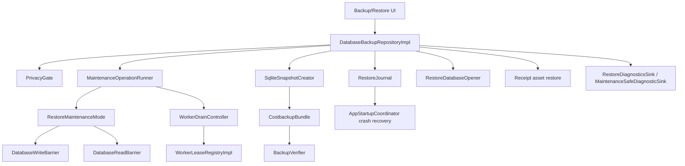

# Pipeline 7 Review — Backup / Restore

## 0. Review constraints

Target: `83b798e849b4408b2bf683f52cb2746d37f7af16`

Mode performed: **remote static review** via GitHub raw source/docs.

Build/test status: **NOT RUN**

Reason:
- I do not have a local checkout/terminal in this environment.
- I could not run:
  - `git rev-parse HEAD`
  - `git status`
  - `rg`
  - Gradle tests

Implementation agent must still run:

```bash
git rev-parse HEAD
git status --short
./gradlew :app:assembleDebug --stacktrace
./gradlew :app:testDebugUnitTest --stacktrace
./gradlew :app:check --stacktrace
```

If `git rev-parse HEAD` is not:

```text
83b798e849b4408b2bf683f52cb2746d37f7af16
```

stop.

Primary sources reviewed:
- P7 issue doc: https://raw.githubusercontent.com/panospao7/Cost-agregator/83b798e849b4408b2bf683f52cb2746d37f7af16/docs/analyses%20and%20debug%20master/PIPELINE_7_CONSOLIDATED_ISSUES.md
- P7 implementation plan: https://raw.githubusercontent.com/panospao7/Cost-agregator/83b798e849b4408b2bf683f52cb2746d37f7af16/docs/analyses%20and%20debug%20master/pipelines%20issues%20implementantion%20plan/PIPELINE_7_IMPLEMENTATION_PLAN.md
- Backup/restore barrier contract: https://raw.githubusercontent.com/panospao7/Cost-agregator/83b798e849b4408b2bf683f52cb2746d37f7af16/docs/backup-restore-barrier-contract.md
- `DatabaseBackupRepositoryImpl.kt`: https://raw.githubusercontent.com/panospao7/Cost-agregator/83b798e849b4408b2bf683f52cb2746d37f7af16/app/src/main/java/com/yourname/expensetracker/data/repository/DatabaseBackupRepositoryImpl.kt
- `RestoreMaintenanceMode.kt`: https://raw.githubusercontent.com/panospao7/Cost-agregator/83b798e849b4408b2bf683f52cb2746d37f7af16/app/src/main/java/com/yourname/expensetracker/data/backup/RestoreMaintenanceMode.kt
- `RestoreJournal.kt`: https://raw.githubusercontent.com/panospao7/Cost-agregator/83b798e849b4408b2bf683f52cb2746d37f7af16/app/src/main/java/com/yourname/expensetracker/data/backup/RestoreJournal.kt
- `CostbackupBundle.kt`: https://raw.githubusercontent.com/panospao7/Cost-agregator/83b798e849b4408b2bf683f52cb2746d37f7af16/app/src/main/java/com/yourname/expensetracker/data/backup/CostbackupBundle.kt
- `BackupVerifier.kt`: https://raw.githubusercontent.com/panospao7/Cost-agregator/83b798e849b4408b2bf683f52cb2746d37f7af16/app/src/main/java/com/yourname/expensetracker/data/backup/BackupVerifier.kt
- `SqliteSnapshotCreator.kt`: https://raw.githubusercontent.com/panospao7/Cost-agregator/83b798e849b4408b2bf683f52cb2746d37f7af16/app/src/main/java/com/yourname/expensetracker/data/backup/SqliteSnapshotCreator.kt
- `MaintenanceOperationRunner.kt`: https://raw.githubusercontent.com/panospao7/Cost-agregator/83b798e849b4408b2bf683f52cb2746d37f7af16/app/src/main/java/com/yourname/expensetracker/data/backup/MaintenanceOperationRunner.kt
- `DatabaseWriteBarrier.kt`: https://raw.githubusercontent.com/panospao7/Cost-agregator/83b798e849b4408b2bf683f52cb2746d37f7af16/app/src/main/java/com/yourname/expensetracker/data/backup/DatabaseWriteBarrier.kt
- `DatabaseReadBarrier.kt`: https://raw.githubusercontent.com/panospao7/Cost-agregator/83b798e849b4408b2bf683f52cb2746d37f7af16/app/src/main/java/com/yourname/expensetracker/data/backup/DatabaseReadBarrier.kt
- `AppStartupCoordinator.kt`: https://raw.githubusercontent.com/panospao7/Cost-agregator/83b798e849b4408b2bf683f52cb2746d37f7af16/app/src/main/java/com/yourname/expensetracker/startup/AppStartupCoordinator.kt
- `WorkerExecutionGuard.kt`: https://raw.githubusercontent.com/panospao7/Cost-agregator/83b798e849b4408b2bf683f52cb2746d37f7af16/app/src/main/java/com/yourname/expensetracker/domain/workers/WorkerExecutionGuard.kt
- `WorkerLeaseRegistryImpl.kt`: https://raw.githubusercontent.com/panospao7/Cost-agregator/83b798e849b4408b2bf683f52cb2746d37f7af16/app/src/main/java/com/yourname/expensetracker/domain/workers/WorkerLeaseRegistryImpl.kt
- `WorkerRegistry.kt`: https://raw.githubusercontent.com/panospao7/Cost-agregator/83b798e849b4408b2bf683f52cb2746d37f7af16/app/src/main/java/com/yourname/expensetracker/domain/workers/WorkerRegistry.kt
- Hilt modules:
  - https://raw.githubusercontent.com/panospao7/Cost-agregator/83b798e849b4408b2bf683f52cb2746d37f7af16/app/src/main/java/com/yourname/expensetracker/di/BackupRepositoryModule.kt
  - https://raw.githubusercontent.com/panospao7/Cost-agregator/83b798e849b4408b2bf683f52cb2746d37f7af16/app/src/main/java/com/yourname/expensetracker/di/WorkerModule.kt
  - https://raw.githubusercontent.com/panospao7/Cost-agregator/83b798e849b4408b2bf683f52cb2746d37f7af16/app/src/main/java/com/yourname/expensetracker/di/DatabaseModule.kt

---

# Pipeline 7 Review — Backup / Restore

## 1. Pipeline summary

Pipeline 7 owns:
- `.costbackup` creation and restore,
- legacy raw `.db` export/import,
- database reset,
- maintenance/read/write barriers,
- worker drain/resume during backup/restore,
- restore journal and startup crash recovery,
- backup verification,
- receipt asset backup/restore,
- restore diagnostics and operation-run preservation.

At the target SHA, code is **much newer than the P7 consolidated issue doc**. Several items still listed as TODO/open in docs are fixed or partially fixed in source.

Main flow:



Current high-level verdict:

```text
P7 is no longer as RED as the stale tracker says, but it is not GREEN.
Final verdict: YELLOW / RED-borderline.
```

Highest-risk remaining gaps:
1. **P7-P1-01 remains partially open:** restore verification uses fresh Room, but other Hilt-injected `AppDatabase` consumers can still hold stale singleton references after live DB file swap.
2. **P7-P1-04 remains partial:** receipt asset restore is journaled but not atomic/resumable enough; crash between DB path update and final asset rename can leave broken paths.
3. **P7-P1-02 remains partial/open:** write/read barrier is still caller-enforced, not a true global Room/SQLite interceptor.
4. **P7-P1-05 remains partial:** semantic aggregate verification exists in `BackupVerifier`, but the `.costbackup` manifest does not appear to carry semantic aggregate checkpoints and repository calls do not pass them.

---

## 2. File inventory

| Category | Files reviewed | Why relevant | Notes |
|---|---|---|---|
| P7 issue docs | `PIPELINE_7_CONSOLIDATED_ISSUES.md`, `PIPELINE_7_IMPLEMENTATION_PLAN.md` | Tracker reconciliation | Docs are stale. They still call many fixed source changes TODO/open. |
| Barrier contract | `docs/backup-restore-barrier-contract.md` | Normative P7 contract | Says `BACKUP_EXPORTING` blocks writes, restore modes block reads/writes, worker drain required. |
| Repository | `DatabaseBackupRepositoryImpl.kt` | Main P7 implementation | Contains backup, restore, legacy import/export, reset, asset restore. |
| Maintenance | `RestoreMaintenanceMode.kt` | Persistent mode + worker pause/resume | Uses `SharedPreferences`, `WorkerSpec.DEFAULTS`, `WorkerRegistry.scheduleAll`. |
| Read/write barriers | `DatabaseWriteBarrier.kt`, `DatabaseReadBarrier.kt`, `DatabaseReadBarrierFlowExt.kt` | App-level enforcement | Caller-by-caller, not global DB interceptor. |
| Journal | `RestoreJournal.kt` | Crash recovery, success/failure journal | Now synchronized, fsyncs temp files, preserves success/failure journals. |
| Bundle | `CostbackupBundle.kt` | `.costbackup` format, encryption, extract limits | Streamed extraction; fixed `FileInputStream` close; zip-slip and decompression caps present. |
| Verification | `BackupVerifier.kt` | Table tiers, manifest completeness, semantic checks | Privacy audit promoted to Tier 1; semantic aggregate support exists but not wired into manifest/repo. |
| Snapshot | `SqliteSnapshotCreator.kt` | Consistent backup snapshots | Prefers `VACUUM INTO`, falls back to drained file-copy. |
| Startup | `AppStartupCoordinator.kt` | Crash recovery on app start | Fail-closed `CRITICAL_RECOVERY_REQUIRED` behavior implemented. |
| Workers | `WorkerDrainController.kt`, `WorkerLeaseRegistryImpl.kt`, `WorkerExecutionGuard.kt`, `WorkerRegistry.kt`, `WorkerModule.kt` | Drain/guard/run logging | Worker drain and guard are much stronger than docs imply. |
| DI | `BackupRepositoryModule.kt`, `WorkerModule.kt`, `DatabaseModule.kt` | Runtime bindings | `WorkerLeaseRegistryImpl` bound as both lease registry and drain controller. |
| UI | Backup/restore ViewModel not fully opened | Restart-required dismiss path | Path from docs not found via raw URL; must verify with local `rg`. |
| Tests | Not opened locally | Coverage check | Required test files listed by prompt must be verified locally. |

Files intentionally not fully reviewed:
- all DAO/entity files,
- exported Room schemas,
- all backup/restore tests,
- full UI routes/screens,
- P12 import/export overlap,
- privacy anonymizer implementation,
- receipt asset store implementation.

Reason: no local checkout/`rg`; remote source was sampled through raw URLs.

---

## 3. Architecture comparison

### Legal path alignment

| Contract | Source status | Verdict |
|---|---|---|
| Backup/export must enter `BACKUP_EXPORTING` and drain workers | `createCostBackup()` calls `maintenanceOperationRunner.enterAndDrain(BACKUP_EXPORTING, "createCostBackup")`; raw debug export does same. | PASS for reviewed paths |
| Restore/import/reset must enter restore/reset mode and drain workers | `.costbackup` restore, legacy import, and reset use `MaintenanceOperationRunner`. | PASS for reviewed paths |
| Journal before destructive restore | `.costbackup` and legacy import create `RestoreJournal` before maintenance/destructive operations. | PASS |
| Fresh Room after swap | Restore verification uses `RestoreDatabaseOpener.openFreshDatabase()`; repository also reassigns its own mutable `database`. | PARTIAL |
| Global write barrier | `DatabaseWriteBarrier` exists, but enforcement depends on callers invoking it. | PARTIAL/FAIL |
| Startup crash recovery fail-closed | `AppStartupCoordinator` sets `CRITICAL_RECOVERY_REQUIRED` if safety backup recovery fails and exempts that mode from auto-reset. | PASS |
| Privacy audit preservation | `BackupVerifier` classifies `privacy_audit_events` as `TIER_1_EXACT`. | PASS |
| Semantic restore equivalence | `BackupVerifier` has aggregate support but manifest/repository do not appear to wire semantic aggregates. | PARTIAL |
| Receipt asset restore atomicity | Assets are journaled and copied via temp, but DB is updated before final file rename and startup does not resume tasks. | PARTIAL/FAIL |

### Doc/code drift

Major drift:
- P7 consolidated issue doc says `P7-P0-01` legacy import lacks journal/maintenance. Source now implements journal + maintenance + debug-only release gate.
- P7 issue doc says `P7-P1-03` backup does not freeze writes/use snapshot API. Source now enters `BACKUP_EXPORTING`, drains workers, checkpoints WAL, and uses `SqliteSnapshotCreator`.
- P7 issue doc says `NEW-P7-003`–`006` are open. Source appears to have fixed all four:
  - atomic critical mode commit,
  - synchronized journal append,
  - closed FileInputStream,
  - quoted source table count SQL.
- `DatabaseBackupRepositoryImpl.importDatabase()` KDoc still says legacy import has no journal/maintenance, but the implementation below it has journal/maintenance. This comment is stale and misleading.

---

## 4. Runtime flow / call graph

### 4.1 `.costbackup` creation

Flow:

```text
createCostBackup()
  -> operationRunRecorder.start("BACKUP_EXPORT")
  -> PrivacyGate ENCRYPTED_BACKUP
  -> maintenanceOperationRunner.enterAndDrain(BACKUP_EXPORTING)
  -> checkpointWal()
  -> require(!restoreMaintenanceMode.isWritesAllowed())
  -> SqliteSnapshotCreator.createSnapshot()
       -> VACUUM INTO if available
       -> drained file-copy fallback
  -> ExportAnonymizer.sanitizeExport(tempDb) if redacted
  -> BackupVerifier.collectTableCountsStrict(snapshotDb)
  -> BackupVerifier.verify(tempDb, tableCounts)
  -> collectReceiptAssetsForBackup() if includeReceiptImages && !redacted
  -> CostbackupBundle.create()
  -> run.success()
  -> finally restoreMaintenanceMode.exit(false)
```

Evidence:
- `createCostBackup()` enters `BACKUP_EXPORTING` and drains workers.
- It explicitly double-checks that writes are blocked before snapshot.
- `SqliteSnapshotCreator` tries `VACUUM INTO` and falls back to drained file-copy.
- `BackupVerifier.collectTableCountsStrict()` fails required table-count errors rather than writing fake zero counts.
- Receipt images are skipped when backup is redacted.

### 4.2 Debug raw export

Flow:

```text
exportDatabase()
  -> BuildConfig.DEBUG gate
  -> PrivacyGate RAW_DATABASE_EXPORT
  -> maintenanceOperationRunner.enterAndDrain(BACKUP_EXPORTING)
  -> optional ENCRYPTED_BACKUP / RAWBACKUP_EXPORT gate
  -> checkpointWal()
  -> copy DB to app-private files/export
  -> optional sanitize + encrypt
  -> finally restoreMaintenanceMode.exit(false)
```

Evidence:
- Release build throws `UnsupportedOperationException("Raw DB export disabled in release")`.
- Raw export is privacy-gated.
- Export path is app-private `files/exports`.

### 4.3 `.costbackup` restore

Flow:

```text
restoreCostBackup()
  -> operationRunRecorder.start("RESTORE_COSTBACKUP")
  -> restoreJournal.beginJournal()
  -> MaintenanceOperationRunner.enterAndDrain(RESTORE_PREPARING)
  -> CostbackupBundle.extract()
  -> BackupVerifier.validateManifestCompleteness()
  -> copy extracted DB to staging
  -> BackupVerifier.verifyQuick(staged)
  -> open staged Room to migrate
  -> post-migration verifyQuick()
  -> createSafetyBackupInternalAssumingMaintenance()
  -> journal SAFETY_BACKUP_CREATED
  -> journal SWAPPING
  -> closeLiveDatabaseForFileSwap()
  -> copy staged DB/WAL/SHM to live
  -> repository-local database = AppDatabase.fileBuilder(context).build()
  -> freshDb = RestoreDatabaseOpener.openFreshDatabase()
  -> BackupVerifier.verify(liveDbFile, manifestCounts)
  -> verifySummaryPreservedForVerification()
  -> journal ASSETS_RESTORING
  -> maintenance ASSETS_RESTORING
  -> restoreReceiptAssets()
  -> journal COMPLETE
  -> commitJournal()
  -> restoreMaintenanceMode.exit(forceRestartRequired = true)
```

Strengths:
- Journal exists before maintenance events.
- Wrong password/corrupt bundle failure exits maintenance without live DB swap.
- Manifest completeness is checked before destructive swap.
- Staging migration/verification happens before swap.
- Safety backup path is journaled before swap.
- Post-swap verification uses fresh Room.

Remaining weaknesses:
- Repository-local `database` reassignment does not update other Hilt-injected `AppDatabase` consumers.
- Asset restore is not fully atomic/resumable.
- Semantic aggregate verification is not wired from manifest.

### 4.4 Legacy `.db` import

Flow:

```text
importDatabase()
  -> if !BuildConfig.DEBUG: fail
  -> operationRunRecorder.start("RESTORE_LEGACY_DB")
  -> restoreJournal.beginJournal()
  -> MaintenanceOperationRunner.enterAndDrain(RESTORE_PREPARING)
  -> validate source file
  -> validateSourceDatabase()
  -> copy to staging
  -> preflightImportedFile()
  -> stagedImportVerifier()
  -> createSafetyBackupInternalAssumingMaintenance()
  -> journal SAFETY_BACKUP_CREATED
  -> journal SWAPPING
  -> closeLiveDatabaseForFileSwap()
  -> replaceDatabaseFiles()
  -> repository-local database = AppDatabase.fileBuilder(context).build()
  -> freshDb = RestoreDatabaseOpener.openFreshDatabase()
  -> liveImportVerifier()
  -> commitJournal()
  -> restoreMaintenanceMode.exit(forceRestartRequired = true)
```

Strengths:
- Now debug-only in release.
- Now journaled.
- Now enters maintenance and drains workers.
- Uses staging and safety backup.

Stale code comment:
- KDoc still says no journal/no maintenance, but implementation contradicts it.

### 4.5 Reset database

Flow:

```text
resetDatabase()
  -> begin journal
  -> MaintenanceOperationRunner.enterAndDrain(RESETTING_DATABASE)
  -> safety backup
  -> close DB
  -> delete live DB/WAL/SHM
  -> repository-local database = fresh builder
  -> commit journal
  -> restoreMaintenanceMode.exit(forceRestartRequired = true)
```

### 4.6 Startup crash recovery

Flow:

```text
AppStartupCoordinator.initialize()
  -> checkRestoreJournal()
       -> NoAction / CompleteClean / CleanedNonDestructive
       -> AssetsIncomplete => enter RESTORE_COMPLETE_RESTART_REQUIRED
       -> RecoveredFromSwap => copy safety backup to live
            -> verify PRAGMA integrity_check
            -> verify PRAGMA foreign_key_check
            -> open fresh Room
            -> success: clean staging + delete journal
            -> failure: failJournal + enterCriticalRecoveryRequired
  -> if writes allowed: schedule workers + import journals
```

Strength:
- Fail-closed path for unrecoverable restore crash is implemented.

Weakness:
- `ASSETS_RESTORING` recovery only blocks and warns; it does not resume asset tasks or repair DB paths.

---

## 5. Issue table

| ID | Severity | Status | File(s) | Evidence | Impact | Reproduction path | Recommended fix | Required tests | Cross-pipeline impact |
|---|---:|---|---|---|---|---|---|---|---|
| P7-FIND-001 / P7-P1-01 | P1 | partial | `DatabaseBackupRepositoryImpl.kt`, `RestoreDatabaseOpener.kt`, Hilt DB consumers | After swap, repository assigns its own `database = AppDatabase.fileBuilder(context).build()` and uses `restoreDatabaseOpener.openFreshDatabase()`, but comment notes this only updates repository-local reference; other Hilt singletons can still hold stale `AppDatabase`. | After dismissing restart-required, other repositories/workers may use stale/closed Room object against replaced DB. | Restore backup, dismiss restart warning without process restart, use another repository previously injected with `AppDatabase`. | Either require real process restart before unblocking writes, or introduce `DatabaseProvider`/reopenable singleton used by all repositories; do not merely mutate repository-local field. | `post_restore_other_repository_uses_fresh_database_or_writes_blocked`; `dismiss_restart_required_does_not_unblock_stale_db_consumers` | All pipelines using Room |
| P7-FIND-002 / P7-P1-04 | P1 | partial | `DatabaseBackupRepositoryImpl.restoreReceiptAssets`, `RestoreJournal`, `AppStartupCoordinator` | Asset file is copied to temp, DAO `imagePath` is updated to final path, then temp is renamed to final. Crash between DAO update and rename leaves DB pointing to missing file. Startup `ASSETS_RESTORING` does not resume tasks. | Broken receipt image links; orphan temp/final files; user-visible data inconsistency. | Crash after `dao.update(receipt.copy(imagePath = finalFile.absolutePath))` before rename. | Reverse order with temp/final staging, transactional path update only after durable final file exists; or journal enough data to resume/rollback. Implement startup asset-task recovery. | `asset_restore_crash_after_db_update_recovers_path`; `assets_restoring_startup_resumes_pending_tasks`; `asset_restore_failure_does_not_break_existing_paths` | P3 receipts, P7 restore |
| P7-FIND-003 / P7-P1-02 | P1 | partial/open | `DatabaseWriteBarrier.kt`, repositories/DAOs | Barrier exists as explicit `checkWritesAllowed()`. No global Room callback/interceptor proves every write is blocked. Prompt requires no caller-by-caller gaps. | A missed repository/DAO write can mutate DB during backup/restore. | Add a DAO/repository write that forgets barrier; current barrier cannot stop it globally. | Add architecture guard scanning all production mutating DAO callers, and/or centralize DB write access through guard/coordinator. Consider Room callback/SupportSQLiteOpenHelper wrapper if feasible. | `all_p7_mutating_calls_have_write_barrier`; `unguarded_write_during_restore_fails` | All DB pipelines |
| P7-FIND-004 / P7-P1-05 | P1 | partial | `BackupVerifier.kt`, `CostbackupBundle.kt`, `DatabaseBackupRepositoryImpl.kt` | `BackupVerifier` supports `manifestSemanticAggregates`, but `BackupManifest` has no semantic aggregate field and repository calls `BackupVerifier.verify(tempDb, tableCounts)` / `verify(liveDbFile, manifestTableCounts)` without aggregate map. | Restore can preserve row counts while changing financial/dashboard semantics. | Corrupt amount/category values without changing row counts; verification passes unless caught by FK/integrity. | Add semantic aggregate map to manifest, collect before bundling, verify staged/live after restore. Include money/currency/budget/receipt-link aggregates. | `semantic_verification_catches_amount_change_same_row_count`; `backup_manifest_contains_semantic_aggregates` | P5/P6 analytics/budget/currency |
| P7-FIND-005 | P2 | bug/privacy | `DatabaseBackupRepositoryImpl.restoreReceiptAssets`, `RestoreJournal` | Warnings/logs include `assetFile.name`; journal task `sourceRelativePath` stores filename. Receipt filenames may include user-provided names/PII. | PII can leak to logs/journal. | Restore bundle with receipt file named with merchant/user text. | Store hashed/basename-safe IDs only; log receiptId and asset kind, not raw filename. | `asset_restore_warnings_redact_filename`; `restore_journal_asset_tasks_do_not_store_raw_filename` | P8 privacy, P3 receipts |
| P7-FIND-006 | P2 | design/race | `RestoreMaintenanceMode`, `DatabaseBackupRepositoryImpl` | Maintenance mode has no operation owner/token. Repository methods call `restoreMaintenanceMode.exit(false)` unconditionally in many `finally`/early-failure paths. | Concurrent backup/restore/reset can clobber another operation’s maintenance state and re-enable writes. | Start backup, concurrently start restore or force nested maintenance; one exits and sets `NORMAL`. | Add owner token/session ID to maintenance enter/exit; reject concurrent maintenance operations; exit only owner session. | `concurrent_maintenance_exit_cannot_clear_other_operation`; `maintenance_enter_rejects_when_already_active` | All restore/barrier flows |
| P7-FIND-007 | P2 | partial | `SqliteSnapshotCreator.kt`, `DatabaseBackupRepositoryImpl.kt` | Fallback drained file-copy relies on caller having drained writes and checkpointed WAL. Because barrier is not global, snapshot consistency depends on all writers honoring barrier. | Rare inconsistent backup if unguarded writer races with fallback file copy. | Missing barrier write during `BACKUP_EXPORTING` while VACUUM INTO fallback copies file. | Fix global/call-graph barrier; add snapshot consistency integration test with attempted writes during backup. | `backup_snapshot_blocks_concurrent_write`; `drained_file_copy_has_no_wal_frames` | All writers |
| P7-FIND-008 | P3 | stale comment | `DatabaseBackupRepositoryImpl.importDatabase` KDoc | KDoc says legacy import has no journal/maintenance; implementation now has both. | Future agents may re-fix or misunderstand path. | Read KDoc. | Delete/update stale planned comment. | docs/static test optional | Docs/maintainability |
| P7-FIND-009 | P3 | needs verification | Backup/restore UI | Prompt says `dismissRestartRequired()` exits maintenance; source path was not opened. | UI behavior unverified. | Run `rg -n "dismissRestartRequired|restartRequired|BackupRestoreViewModel"`. | Verify UI calls `RestoreMaintenanceMode.exit(false)` intentionally or revise per stale DB fix. | `dismiss_restart_required_unblocks_only_when_safe` | UI/app shell |

---

## 6. Universal contract audit

### Restore/write barrier — PARTIAL / FAIL

Evidence:
- `RestoreMaintenanceMode.isWritesAllowed()` only returns true in `NORMAL`.
- `DatabaseWriteBarrier.checkWritesAllowed()` throws in non-`NORMAL`.
- `WorkerExecutionGuard` checks mode and write barrier.

Gap:
- Barrier is not global. It only works when code calls it.
- No reviewed Room/SQLite global interceptor enforces it for every DAO mutation.
- Full direct DAO write inventory was not possible without `rg`.

Verdict:

```text
PARTIAL
```

Required verification:

```bash
rg -n "insert\\(|update\\(|delete\\(|deleteAll\\(|@Query\\(\"UPDATE|@Query\\(\"DELETE|@Query\\(\"INSERT" app/src/main/java app/src/test/java app/src/androidTest/java
rg -n "DatabaseWriteBarrier|checkWritesAllowed|runWrite" app/src/main/java
```

### Read barrier — PARTIAL

Evidence:
- `DatabaseReadBarrier` blocks normal reads outside `NORMAL`.
- It permits `EXPORT_OR_BACKUP_SNAPSHOT_READ` during `NORMAL` or `BACKUP_EXPORTING`.
- `DatabaseReadBarrierFlowExt` provides flow wrappers.

Gap:
- Enforcement is still caller-by-caller.
- Need inventory of all Room Flow/read entry points.

Verdict:

```text
PARTIAL
```

### Worker guard / drain / run logging — PASS for reviewed paths

Evidence:
- `MaintenanceOperationRunner.enterAndDrain()` enters mode, requests worker stop, waits, aborts on timeout.
- `WorkerLeaseRegistryImpl` tracks active leases and cancels at checkpoints.
- `WorkerExecutionGuard` skips or blocks workers during restore modes and logs blocked operations.
- `WorkerRegistry.scheduleAll()` is single source of truth for rescheduling.

Gap:
- Need verify all workers use `WorkerExecutionGuard` and acquire/checkpoint leases.

Verdict:

```text
PASS/PARTIAL
```

### Privacy/redaction/raw-storage policy — PARTIAL

Passes:
- Raw DB export is release-disabled via `BuildConfig.DEBUG`.
- Raw export is privacy-gated.
- `.costbackup` is encrypted.
- Redacted backups skip receipt images.
- `RestoreJournal.toDiagnosticsJson()` removes internal path fields.
- `privacy_audit_events` is Tier 1 exact.

Gaps:
- `restoreReceiptAssets()` logs/warnings include raw asset filenames.
- `RestoreJournal.AssetRestoreTask.sourceRelativePath` stores receipt asset filename. Filenames can contain PII.

Verdict:

```text
PARTIAL
```

### Money/currency preservation — PARTIAL

Evidence:
- Whole DB snapshot should preserve tables.
- `exchange_rates` is currently `TIER_3_OPTIONAL`.

Risk:
- P5/P6 currency semantics can change if exchange-rate table is absent or altered, yet optional tier lets it pass. If “semantic equivalence” is claimed, exchange-rate/currency tables should be verified semantically or promoted.

Verdict:

```text
PARTIAL
```

### Transaction lifecycle ownership — PASS for file replacement model

Evidence:
- Restore/import does full database file replacement under maintenance, not per-expense DAO mutations.
- Post-restore asset path updates use `RestoreInternalWriteScope`.

Gap:
- Direct post-restore repair writes need full inventory.

Verdict:

```text
PASS/PARTIAL
```

### Receipt lifecycle/link ownership — PARTIAL / FAIL

Evidence:
- Receipt rows and links are Tier 1 exact.
- Receipt assets are restored after DB verification.
- Asset tasks are journaled.

Gap:
- Asset path update happens before final rename.
- Startup does not resume pending/failed asset tasks.
- Crash can leave broken DB paths.

Verdict:

```text
PARTIAL/FAIL
```

### Diagnostics/events — PARTIAL PASS

Evidence:
- `RestoreDiagnosticsSink` is used after live DB swap.
- `RestoreJournal` preserves success/failure journals.
- Startup imports journals only when writes are allowed.
- Journal append is synchronized and fsyncs temp files.

Gaps:
- Asset failure warning privacy.
- Need test verification for idempotent import.

Verdict:

```text
PARTIAL PASS
```

### Import/export schema/roundtrip — PARTIAL PASS

Evidence:
- `.costbackup` verifies manifest completeness before destructive swap.
- Staged DB is Room-opened/migrated before swap.
- Legacy import rejects schema outside supported range.
- `BackupVerifier` checks integrity, FK, Tier 1 row counts.

Gaps:
- Semantic aggregate verification not wired.
- `exchange_rates` optional may be too weak for financial equivalence.
- No local migration/schema tests run.

Verdict:

```text
PARTIAL PASS
```

### DAO conflict/timestamps — NOT PRIMARY / UNKNOWN

P7 mostly performs file-level replacement, not normal DAO conflict flows.

Unknown:
- operation-run journal import conflict/idempotency not opened.

Verdict:

```text
UNKNOWN_NEEDS_RG
```

---

## 7. P7 issue reconciliation

| Tracker issue | Tracker status in P7 doc | Code status at target SHA | Evidence | Final status | Notes |
|---|---|---|---|---|---|
| P7-P0-01 | TODO ONLY | Legacy import is debug-only, journaled, maintenance-drained, staged, safety-backed, verified. | `importDatabase()` begins `RestoreJournal`, calls `enterAndDrain(RESTORE_PREPARING)`, creates safety backup, swaps, verifies fresh DB. | FIXED / DOC DRIFT | KDoc still stale. |
| P7-P0-02 | Fixed | Startup fail-closed implemented. | `AppStartupCoordinator.checkRestoreJournal()` enters `CRITICAL_RECOVERY_REQUIRED` when safety recovery fails and does not auto-reset it. | FIXED | Good. |
| P7-P1-01 | TODO ONLY | Verification uses fresh DB, but full app singleton invalidation incomplete. | `RestoreDatabaseOpener.openFreshDatabase()` used; source comment notes repository-local hot-swap does not update other Hilt consumers. | PARTIALLY_FIXED | Still high risk if restart is dismissible. |
| P7-P1-02 | TODO ONLY | Caller-level write/read barrier exists; no global enforcement. | `DatabaseWriteBarrier` is explicit checker only. | PARTIALLY_FIXED / OPEN | Needs direct DAO inventory and guard. |
| P7-P1-03 | TODO ONLY | Backup enters `BACKUP_EXPORTING`, drains workers, checkpoints WAL, uses snapshot creator. | `createCostBackup()`, `SqliteSnapshotCreator`. | FIXED/PARTIAL | Depends on global barrier for absolute guarantee. |
| P7-P1-04 | TODO ONLY | Asset restore journaled but not atomic/resumable. | `restoreReceiptAssets()` updates DB path before final rename; startup `ASSETS_RESTORING` only blocks/warns. | PARTIALLY_FIXED / OPEN | Needs true resume/rollback. |
| P7-P1-05 | TODO ONLY | Some semantic integrity checks exist; semantic aggregate support not wired. | `BackupVerifier.verifySemanticAggregates()` exists; manifest/repository do not pass aggregate map. | PARTIALLY_FIXED / OPEN | Add manifest aggregates. |
| P7-P1-06 | TODO ONLY | `privacy_audit_events` is Tier 1 exact. | `BackupVerifier.TABLE_TIERS`. | FIXED / TRACKER DRIFT | Verify redacted mode behavior. |
| P7-P1-07 | Fixed | Worker pause/resume uses `WorkerSpec.DEFAULTS` and `WorkerRegistry.scheduleAll`. | `RestoreMaintenanceMode`, `WorkerRegistry`. | FIXED | Good. |
| P7-P1-08 | Fixed | Mode can exit to normal; UI path not fully reviewed. | Barrier contract says dismiss calls exit; source `RestoreMaintenanceMode.exit(false)` supports it. | FIXED/NEEDS_UI_VERIFICATION | Safety depends on stale singleton fix. |
| NEW-P7-001 | Fixed | `createCostBackup()` and `exportDatabase()` have `finally { restoreMaintenanceMode.exit(false) }`. | Repository methods. | FIXED | Watch owner-token issue. |
| NEW-P7-002 | Fixed | Privacy/WAL failures return through finally exit; privacy gate before enter. | `createCostBackup()`. | FIXED | Good. |
| NEW-P7-003 | OPEN | Single SharedPreferences commit now stores mode + reason + timestamp. | `enterCriticalRecoveryRequired()`. | FIXED / TRACKER DRIFT | Good. |
| NEW-P7-004 | OPEN | Journal append synchronized. | `RestoreJournal.appendEventToFile()` uses `synchronized(journalLock)`. | FIXED / TRACKER DRIFT | Process-local only. |
| NEW-P7-005 | OPEN | `FileInputStream` closed in finally. | `CostbackupBundle.extract()`. | FIXED / TRACKER DRIFT | Good. |
| NEW-P7-006 | OPEN | Table name quoted/escaped. | `countRowsFromSourceTable()`. | FIXED / TRACKER DRIFT | Good. |

---

## 8. Test coverage review

Tests were **not opened/run**. Prompt lists likely tests:
- `AppOperationalStateTest.kt`
- `AssetRestoreAtomicityTest.kt`
- `BackupVerifierManifestTest.kt`
- `CostbackupBundleLimitsTest.kt`
- `DatabaseBarrierTest.kt`
- `ExportReadBarrierTest.kt`
- `MaintenanceOperationRunnerTest.kt`
- `MaintenanceSafeDiagnosticSinkTest.kt`
- `P7BugFixesTest.kt`
- `RestoreJournalDurabilityTest.kt`
- `RestoreJournalImporterFailureTest.kt`
- `DatabaseBackupRepositoryImplTest.kt`
- `AppStartupCoordinatorRecoveryTest.kt`

Required local commands:

```bash
rg -n "Backup|Restore|Maintenance|Journal|costbackup|DatabaseBarrier|Snapshot|Reset|Room|WorkerDrain|PrivacyAudit" app/src/test app/src/androidTest
./gradlew :app:testDebugUnitTest --tests "*Backup*" --stacktrace
./gradlew :app:testDebugUnitTest --tests "*Restore*" --stacktrace
./gradlew :app:testDebugUnitTest --tests "*Maintenance*" --stacktrace
./gradlew :app:testDebugUnitTest --tests "*Journal*" --stacktrace
```

Weak/missing tests to verify or add:
- stale injected Room consumers remain blocked after restore unless process restarted;
- asset restore crash exactly after DAO path update but before rename;
- startup resumes or repairs `ASSETS_RESTORING`;
- manifest semantic aggregates are collected and verified;
- unguarded DAO mutation is caught by architecture guard;
- concurrent maintenance operations cannot clear each other’s mode;
- receipt asset filenames are redacted from logs/journal/warnings;
- `exchange_rates`/currency semantic preservation if P5/P6 equivalence is claimed.

---

## 9. Test plan

### Unit tests

| Test | Purpose |
|---|---|
| `legacy_import_creates_journal_before_maintenance` | Prevent regression of P7-P0-01. |
| `legacy_import_release_build_rejected` | Raw `.db` import not available in production. |
| `backup_enters_backup_exporting_and_drains_workers_before_snapshot` | P7-P1-03 regression. |
| `backup_snapshot_fails_if_required_table_count_query_fails` | Manifest does not fake zero required counts. |
| `critical_recovery_commit_is_atomic` | NEW-P7-003 regression. |
| `journal_concurrent_appends_do_not_lose_events` | NEW-P7-004 regression. |
| `bundle_extract_closes_stream_on_exception` | NEW-P7-005 regression. |
| `source_table_count_quotes_identifier` | NEW-P7-006 regression. |
| `privacy_audit_events_are_tier1_required` | P7-P1-06 regression. |

### Integration tests

| Test | Purpose |
|---|---|
| `restore_uses_fresh_room_for_verification` | Current fix validation. |
| `post_restore_existing_repository_cannot_write_until_safe_reopen` | Exposes stale Hilt singleton risk. |
| `dismiss_restart_required_does_not_unblock_stale_db_consumers` | Ensures P7-P1-08 does not violate P7-P1-01. |
| `asset_restore_crash_after_db_update_recovers` | Must fail on current partial implementation. |
| `startup_assets_restoring_resumes_or_flags_repairable` | Validate asset-crash recovery. |
| `semantic_verification_fails_same_row_count_different_amount` | P7-P1-05. |
| `backup_restore_preserves_currency_rate_semantics` | Cross P5/P6 preservation. |
| `concurrent_restore_and_backup_cannot_clear_mode` | Owner-token/concurrency guard. |

### Architecture guard tests

| Guard | Rule |
|---|---|
| P7 mutating DAO guard | Production DAO writes must have legal owner + barrier. |
| Restore-internal scope guard | Only asset restore path may use `RestoreInternalWriteScope`. |
| Worker guard | Every production Worker uses `WorkerExecutionGuard`/context or documented no-DB mode. |
| Privacy guard | No restore journal/export diagnostic stores raw paths/filenames. |
| Barrier guard | No repository write path can skip `DatabaseWriteBarrier`. |

### Manual validation

1. Create `.costbackup` with receipts and redaction on/off.
2. Restore wrong password: ensure live DB unchanged and maintenance exits.
3. Restore valid backup: verify restart-required state.
4. Dismiss restart-required: verify all screens/repositories work or remain blocked until process restart.
5. Kill app during:
   - staged DB migration,
   - safety backup,
   - DB swap,
   - live verification,
   - asset restore.
6. Restart and verify recovery mode/journal.
7. Verify worker scheduling resumes only when safe.

---

## 10. Optional deliverables

### 10.1 Legal write path table

| Flow | Legal path | Current status |
|---|---|---|
| `.costbackup` export | UI/ViewModel → `DatabaseBackupRepositoryImpl.createCostBackup()` → privacy gate → maintenance runner → snapshot → verifier → bundle | Mostly PASS |
| Debug raw export | debug UI only → `exportDatabase()` → DEBUG gate → privacy gate → maintenance runner → copy/encrypt | PASS |
| `.costbackup` restore | UI → `restoreCostBackup()` → journal → maintenance runner → stage/verify → safety backup → swap → fresh Room verify → assets → journal commit | PARTIAL |
| Legacy `.db` import | debug only → `importDatabase()` → journal → maintenance runner → stage/verify → safety backup → swap → fresh Room verify | Mostly PASS |
| Reset DB | UI/debug → `resetDatabase()` → journal → maintenance runner → safety backup → delete DB → restart required | Mostly PASS |
| Asset path updates | `restoreReceiptAssets()` → `RestoreInternalWriteScope` → `ScannedReceiptDao.update` | PARTIAL |
| Worker writes | Worker → `WorkerExecutionGuard` → write barrier/run logger | PASS for reviewed guard |

### 10.2 Direct DAO mutation inventory

Full inventory needs local `rg`. Preliminary table:

| DAO method | SQL mutation? | Caller(s) | Legal owner? | Barrier? | Audit event? | Classification | Fix |
|---|---:|---|---|---|---|---|---|
| `ScannedReceiptDao.update` | yes | `restoreReceiptAssets()` | Restore-internal asset path update | `RestoreInternalWriteScope` | journal event | LEGAL/PARTIAL | Make asset update atomic/recoverable. |
| `BackgroundJobRunDao.update` | yes | `WorkerExecutionGuard.recoverStaleRunningJobs` | Worker guard/startup | unknown direct barrier; only when startup writes allowed | run ledger | NEEDS_RG | Verify startup skips import/recovery when writes blocked. |
| Operation-run DAO writes | yes | `OperationRunRecorder` / journal importer | Diagnostics | unknown | yes | NEEDS_RG | Verify idempotency/conflicts. |
| Other DAOs | unknown | all repositories | pipeline owners | unknown | varies | UNKNOWN_NEEDS_RG | Run direct write inventory. |

Required command:

```bash
rg -n "insert\\(|insertAll\\(|update\\(|delete\\(|deleteAll\\(|@Query\\(\"UPDATE|@Query\\(\"DELETE|@Query\\(\"INSERT" app/src/main/java app/src/test/java app/src/androidTest/java
```

### 10.3 Safe PR plan

#### PR 1 — Restore safety hardening

Fix:
- stale AppDatabase consumer issue,
- restart-required dismiss safety,
- post-restore process/reopen contract.

Acceptance:
- no existing repository can use stale DB after restore;
- either real process restart is enforced or all DB access goes through reopenable provider.

#### PR 2 — Asset restore atomicity/resume

Fix:
- DB path update/final rename ordering,
- `ASSETS_RESTORING` startup resume/rollback,
- privacy-safe asset journal/logging.

Acceptance:
- crash at any asset-restore phase is recoverable;
- no broken DB image paths remain.

#### PR 3 — Global barrier / direct write guards

Fix:
- architecture guard for all mutating DAO callers,
- owner-token maintenance sessions,
- reject concurrent maintenance.

Acceptance:
- no unguarded production write path;
- one operation cannot clear another operation’s maintenance mode.

#### PR 4 — Semantic verification

Fix:
- add semantic aggregate manifest field,
- collect aggregate checkpoints at backup time,
- verify staged/live restore,
- include currency/rate/budget/receipt semantic checks.

Acceptance:
- same row count but different financial values fails restore verification.

#### PR 5 — Docs/tracker sync

Fix:
- update P7 consolidated issue registry,
- update P7 implementation plan,
- remove stale import KDoc,
- mark fixed/drift/partial issues accurately.

---

## 11. Final verdict

Verdict:

```text
YELLOW / RED-borderline
```

P7 is **not as RED as the stale docs claim**. Source at the target SHA includes many major fixes:
- legacy import now has journal + maintenance + debug-only gate,
- backup export now enters maintenance/drains workers and snapshots via `SqliteSnapshotCreator`,
- startup crash recovery is fail-closed,
- privacy audit events are Tier 1 exact,
- journal append race, critical mode atomicity, stream leak, and SQL quoting are fixed.

However, P7 is **not GREEN** because production-safety gaps remain:
1. **Stale Hilt `AppDatabase` consumers after restore** are not fully solved.
2. **Receipt asset restore is not truly atomic/resumable.**
3. **Maintenance/write barrier is not globally enforced.**
4. **Semantic equivalence is partial and not wired into `.costbackup` manifest.**
5. **Maintenance mode lacks owner/session protection against concurrent operations.**

Highest-risk remaining issue:

```text
P7-P1-01 — stale AppDatabase consumers after live DB swap.
```

Why highest risk:
- restore can complete successfully,
- UI can potentially dismiss restart-required,
- other repositories may still hold stale Room references,
- writes/reads after restore can be inconsistent or crash.

Production-safe status:

```text
Not fully production-safe for restore until stale DB invalidation/restart semantics and asset-restore atomicity are fixed.
```

Must fix before GREEN:
- enforce real process restart or global database provider invalidation after restore/reset/import;
- implement atomic/resumable receipt asset restore;
- add direct DAO write/barrier architecture guard;
- wire semantic aggregate verification into backup manifests;
- update stale docs/tracker after tests pass.