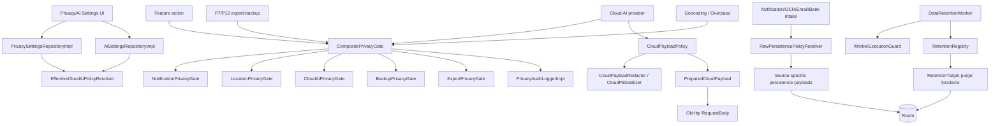

# Pipeline 8 Review — Privacy / AI / Redaction

## 0. Review constraints

Target commit: `83b798e849b4408b2bf683f52cb2746d37f7af16`

Mode performed: **remote static review** using GitHub raw source/docs.

Build/test status: **NOT RUN**

Reason:
- No local checkout/terminal access.
- I could not run `git rev-parse HEAD`, `rg`, or Gradle.
- Findings below are source-backed where files were opened, but full inventory still needs local verification.

Mandatory commands for implementation/validation agent:

```bash
git rev-parse HEAD
git status --short
./gradlew :app:assembleDebug --stacktrace
./gradlew :app:testDebugUnitTest --stacktrace
./gradlew :app:check --stacktrace
```

Expected SHA:

```text
83b798e849b4408b2bf683f52cb2746d37f7af16
```

Primary sources reviewed:
- P8 issue doc: https://raw.githubusercontent.com/panospao7/Cost-agregator/83b798e849b4408b2bf683f52cb2746d37f7af16/docs/analyses%20and%20debug%20master/PIPELINE_8_CONSOLIDATED_ISSUES.md
- P8 implementation plan: https://raw.githubusercontent.com/panospao7/Cost-agregator/83b798e849b4408b2bf683f52cb2746d37f7af16/docs/analyses%20and%20debug%20master/pipelines%20issues%20implementantion%20plan/PIPELINE_8_IMPLEMENTATION_PLAN.md
- Privacy UI architecture: https://raw.githubusercontent.com/panospao7/Cost-agregator/83b798e849b4408b2bf683f52cb2746d37f7af16/docs/architecture/PRIVACY_UI_ARCHITECTURE.md
- Sensitive diagnostics policy: https://raw.githubusercontent.com/panospao7/Cost-agregator/83b798e849b4408b2bf683f52cb2746d37f7af16/docs/architecture/SENSITIVE_DIAGNOSTICS_POLICY.md
- Codebase segments: https://raw.githubusercontent.com/panospao7/Cost-agregator/83b798e849b4408b2bf683f52cb2746d37f7af16/docs/architecture/CODEBASE_SEGMENTS.md
- Privacy settings repo: https://raw.githubusercontent.com/panospao7/Cost-agregator/83b798e849b4408b2bf683f52cb2746d37f7af16/app/src/main/java/com/yourname/expensetracker/data/privacy/PrivacySettingsRepositoryImpl.kt
- Privacy gates/contracts:
  - https://raw.githubusercontent.com/panospao7/Cost-agregator/83b798e849b4408b2bf683f52cb2746d37f7af16/app/src/main/java/com/yourname/expensetracker/domain/privacy/PrivacyGate.kt
  - https://raw.githubusercontent.com/panospao7/Cost-agregator/83b798e849b4408b2bf683f52cb2746d37f7af16/app/src/main/java/com/yourname/expensetracker/domain/privacy/CompositePrivacyGate.kt
  - https://raw.githubusercontent.com/panospao7/Cost-agregator/83b798e849b4408b2bf683f52cb2746d37f7af16/app/src/main/java/com/yourname/expensetracker/domain/privacy/PrivacyCapabilityHandlingPolicy.kt
- Cloud payload:
  - https://raw.githubusercontent.com/panospao7/Cost-agregator/83b798e849b4408b2bf683f52cb2746d37f7af16/app/src/main/java/com/yourname/expensetracker/domain/privacy/CloudPayloadPolicy.kt
  - https://raw.githubusercontent.com/panospao7/Cost-agregator/83b798e849b4408b2bf683f52cb2746d37f7af16/app/src/main/java/com/yourname/expensetracker/data/privacy/DefaultCloudPayloadPolicy.kt
  - https://raw.githubusercontent.com/panospao7/Cost-agregator/83b798e849b4408b2bf683f52cb2746d37f7af16/app/src/main/java/com/yourname/expensetracker/data/privacy/DefaultCloudPayloadRedactor.kt
- Retention:
  - https://raw.githubusercontent.com/panospao7/Cost-agregator/83b798e849b4408b2bf683f52cb2746d37f7af16/app/src/main/java/com/yourname/expensetracker/data/privacy/DataRetentionWorker.kt
  - https://raw.githubusercontent.com/panospao7/Cost-agregator/83b798e849b4408b2bf683f52cb2746d37f7af16/app/src/main/java/com/yourname/expensetracker/di/RetentionModule.kt
- Bank statement AI/lifecycle:
  - https://raw.githubusercontent.com/panospao7/Cost-agregator/83b798e849b4408b2bf683f52cb2746d37f7af16/app/src/main/java/com/yourname/expensetracker/domain/ai/usecase/ValidateBankStatementTransactionsUseCase.kt
  - https://raw.githubusercontent.com/panospao7/Cost-agregator/83b798e849b4408b2bf683f52cb2746d37f7af16/app/src/main/java/com/yourname/expensetracker/domain/receipt/lifecycle/BankStatementLifecycleProcessor.kt
- Location privacy:
  - https://raw.githubusercontent.com/panospao7/Cost-agregator/83b798e849b4408b2bf683f52cb2746d37f7af16/app/src/main/java/com/yourname/expensetracker/data/location/CompositeGeocodingService.kt
  - https://raw.githubusercontent.com/panospao7/Cost-agregator/83b798e849b4408b2bf683f52cb2746d37f7af16/app/src/main/java/com/yourname/expensetracker/data/location/NominatimGeocodingService.kt
  - https://raw.githubusercontent.com/panospao7/Cost-agregator/83b798e849b4408b2bf683f52cb2746d37f7af16/app/src/main/java/com/yourname/expensetracker/data/location/OverpassNearbyService.kt
- Static guard script: https://raw.githubusercontent.com/panospao7/Cost-agregator/83b798e849b4408b2bf683f52cb2746d37f7af16/scripts/verify_privacy_boundaries.py

---

# Pipeline 8 Review — Privacy / AI / Redaction

## 1. Pipeline summary

P8 owns privacy settings, privacy gates, AI/cloud redaction, raw-storage policy, retention purges, audit logging, denied-state UX, export/backup privacy gating, and external-location privacy.

Current code is much newer than the consolidated P8 tracker. The target SHA contains newer primitives that the tracker still treats as missing:
- `PreparedCloudPayload`
- `CloudPayloadPolicy`
- `DefaultCloudPayloadRedactor`
- `EffectiveCloudAiPolicy`
- `PrivacyAuditContext`
- `SafePrivacyMetadata`
- `RawPersistencePolicyResolver`
- `RetentionRegistry`
- `PrivacyBlocked`
- static privacy boundary guard script

However, P8 is **not production GREEN** because several privacy-critical gaps remain in actual runtime paths.

Main data flow:



Entry points:
- Privacy settings update: `PrivacySettingsRepositoryImpl.updateSettings`
- AI settings update: `AiSettingsRepositoryImpl.update`
- Privacy gate check: `CompositePrivacyGate.check`
- Cloud calls: `CloudReceiptAssistService`, `CloudReceiptItemCategorizationService`, `CloudWarrantyExtractionService`, bank statement validation path
- Raw storage: `NotificationPersistencePayload`, `ReceiptPersistencePayload`, `EmailReceiptPersistencePayload`, `BankTransactionPersistencePayload`
- Retention: `DataRetentionWorker`
- Export/backup: `ExportPrivacyGate`, `BackupPrivacyGate`
- Location: geocoding providers and Overpass service
- UI denied state: `PrivacyBlocked` + architecture-documented ViewModels/screens

---

## 2. File inventory

| Category | Files reviewed | Why relevant | Notes |
|---|---|---|---|
| Pipeline docs | `PIPELINE_8_CONSOLIDATED_ISSUES.md`, `PIPELINE_8_IMPLEMENTATION_PLAN.md`, master tracker | Tracker reconciliation | Docs are stale; many TODO/open items are partially or fully implemented. |
| Architecture/privacy docs | `PRIVACY_UI_ARCHITECTURE.md`, `SENSITIVE_DIAGNOSTICS_POLICY.md`, `CODEBASE_SEGMENTS.md` | Normative privacy UX/logging boundaries | Privacy UI doc claims typed `PrivacyBlocked`; diagnostics policy forbids raw merchant/OCR/notification/prompt/token in release logs/durable diagnostics. |
| Settings | `PrivacySettings.kt`, `PrivacySettingsRepositoryImpl.kt`, `AiSettingsRepositoryImpl.kt`, `AiSettingsRepository` | Fail-closed settings, worker cancellation, AI/privacy consistency | Privacy settings use corruption sentinel + Mutex. AI settings still use empty-prefs corruption fallback. |
| Gates | `PrivacyGate.kt`, `CompositePrivacyGate.kt`, `PrivacyCapability.kt`, `PrivacyDecision.kt`, `PrivacyCapabilityHandlingPolicy.kt`, concrete gates | Fail-closed capability enforcement | Composite final-audits once and fails closed for gate-handled capabilities. |
| Audit | `PrivacyAuditLogger.kt`, `PrivacyAuditContext.kt`, `SafePrivacyMetadata.kt`, `PrivacyAuditLoggerImpl.kt` | Durable privacy audit safety | Typed context exists, but legacy `Map` remains and impl only allowlists keys/length, not values. |
| Cloud payload | `CloudPayloadPolicy.kt`, `PreparedCloudPayload.kt`, `DefaultCloudPayloadPolicy.kt`, `DefaultCloudPayloadRedactor.kt`, `CloudPiiSanitizer.kt` | Redaction before cloud | Formal payload exists. Policy does not itself fail if cloud is disabled; providers must gate separately. |
| AI providers | `CloudReceiptAssistService.kt`, `CloudReceiptItemCategorizationService.kt`, `CloudWarrantyExtractionService.kt`, `SmartReceiptAssistService.kt`, `ValidateBankStatementTransactionsUseCase.kt` | Actual HTTP prompt paths | Many paths use payload policy, but CE handling and semantic redaction gaps remain. |
| Raw storage | `RawContentSanitizer.kt`, `RawPersistencePolicyResolver.kt`, source-specific persistence payloads | Write-time redaction/drop | Contracts exist, but bank statement lifecycle stores raw merchant in multiple tables. |
| Retention | `DataRetentionWorker.kt`, `RetentionRegistry.kt`, `RetentionTarget.kt`, `RetentionModule.kt` | Target coverage/checkpoint/failures | Expanded targets exist; anonymous targets in module swallow CE via `runCatching`. |
| Location | `CompositeGeocodingService.kt`, `NominatimGeocodingService.kt`, `OverpassNearbyService.kt`, `verify_privacy_boundaries.py` | External network privacy gate coverage | Providers checked gate before calls in reviewed files; static script rule G14 exists. |
| Diagnostics | `EventMetadataSanitizer.kt`, `SafeEventMetadata.kt` | Durable diagnostic redaction | Stronger than tracker, but exception sanitizer does not explicitly redact emails/URLs. |
| Security/hash | `DefaultSensitiveHashingService.kt` | Hashing sensitive identifiers | Uses deterministic purpose-derived key; comment says production should use AndroidKeyStore. |
| Not fully reviewed | Full notification listener, all email/bank repositories, all AI providers, all UI, tests, Hilt modules | Needs local `rg` | Required before final GREEN. |

Files intentionally skipped / not fully reviewed:
- All UI screens/ViewModels: no local `rg`, only architecture doc reviewed.
- Full Hilt module graph: only retention/known source paths sampled.
- All tests: not run/opened locally.
- Full DAO/entity/migration inventory: not possible remotely within tool budget.
- All cloud providers/search providers: key representatives opened; full static guard must run.

---

## 3. Architecture comparison

### Legal/privacy architecture

| Architecture rule | Source status | Verdict |
|---|---|---|
| All gated capabilities explicit | `PrivacyCapabilityHandlingPolicy.gateHandledCapabilities` and `localOnlyCapabilities` exist. | PASS/PARTIAL — needs policy test run. |
| Composite gate fail-closed | `CompositePrivacyGate.check()` fails closed when gate-handled capability has no handler. | PASS |
| Final decision audit once | Concrete gates largely do not audit; composite calls `auditLogger.logDecision`. | PASS/PARTIAL |
| Typed privacy denial UX | `PrivacyBlocked` sealed interface exists; UI architecture says ViewModels expose it. | PARTIAL — source UI not fully checked. |
| No raw audit context | `PrivacyAuditContext` exists, but `PrivacyGate.check` and `PrivacyAuditLogger.logDecision` still accept raw `Map`. | PARTIAL/FAIL |
| Cloud calls use prepared payload | Major reviewed providers use `CloudPayloadPolicy`/`PreparedCloudPayload`. | PARTIAL — full `RequestBody`/`OkHttp` `rg` required. |
| Redaction before cloud | Redactor catches many PII patterns, but does not semantically redact merchants/amounts/item descriptions for all purposes. | PARTIAL/FAIL |
| Raw storage applied at write time | Contracts exist, but bank statement lifecycle writes raw merchant into `PendingReview` and import item tables. | FAIL |
| Retention worker guarded | `DataRetentionWorker` uses `WorkerExecutionGuard`. | PASS/PARTIAL |
| Retention CE propagation | Worker outer catch rethrows CE, but `RetentionModule` targets use `runCatching`, swallowing CE. | FAIL |
| Sensitive diagnostics | `EventMetadataSanitizer` and `SafeEventMetadata` are strong; audit logger still allows raw values under allowlisted keys. | PARTIAL |
| Location calls gated | Reviewed providers check privacy before network; static guard G14 exists. | PASS/PARTIAL |

### Doc/code drift

Major drift:
- P8 docs say no `PreparedCloudPayload`; code has it.
- P8 docs say no `EffectiveCloudAiPolicy`; code has it.
- P8 docs say retention only covers raw notification/OCR; code’s `RetentionModule` includes AI artifacts, chat messages, email sources, notification intake, diagnostics, pending review text, background job errors, and bank import merchants.
- P8 docs say notification gate too late; code has `NotificationCaptureGate` that explicitly says callers must check before extras extraction.
- P8 docs say geocoding not statically guaranteed; code has `verify_privacy_boundaries.py` G14.

Still-valid docs:
- P8 remains high-risk because several TODOs are only partially fixed in actual call paths.
- Sensitive diagnostics policy is stricter than some current audit/logging paths.

---

## 4. Runtime flow / call graph

### 4.1 Privacy settings update

```text
PrivacySettingsScreen/ViewModel
  -> PrivacySettingsRepositoryImpl.updateSettings(transform)
  -> settingsMutex.withLock
  -> DataStore.edit { current = prefs.toLoadState().settings(); updated = transform(current) }
  -> persisted = getSettings()
  -> applyPrivacyChange(old, persisted)
       -> PrivacyRuntimeWorkerPolicy.disabledToggles/enabledToggles
       -> WorkManager.cancelUniqueWork(...)
       -> WorkerRegistry schedule(context)
```

Evidence:
- `PrivacySettingsRepositoryImpl` has `settingsMutex`.
- Corruption handler writes `_privacy_load_state = CORRUPTED`.
- `toLoadState()` maps corrupted sentinel to `PrivacySettings.FAIL_CLOSED_DEFAULTS`.
- Worker cancel/reschedule flows use `PrivacyRuntimeWorkerPolicy`.

Gap:
- `AiSettingsRepositoryImpl` uses empty-prefs corruption fallback, not a typed fail-closed load state. Cloud remains off by default, but `aiEnabled` defaults true and no worker reschedule logic is shown there.

### 4.2 Privacy gate check

```text
caller -> CompositePrivacyGate.check(capability, context)
  -> concrete gates return Allowed / Denied / FailClosed / NotApplicable
  -> no handler for gate-handled capability => FailClosed
  -> PrivacyAuditLoggerImpl.logDecision(...)
```

Evidence:
- `CompositePrivacyGate` loops gates and stops on Denied/FailClosed.
- It fails closed for `capability in gateHandledCapabilities` with no handler.
- It audits exactly once at composite level.

Gap:
- `context` is raw `Map<String,String>` in the core interface and logger.
- `PrivacyAuditLoggerImpl.sanitizeContext()` only retains allowlisted keys with length ≤200; it does not value-scan allowlisted values like `caller`, `provider`, `modelId`, or `correlationId`.

### 4.3 Cloud AI call

Example receipt assist:

```text
CloudReceiptAssistService.suggest(input)
  -> privacyGate.check(CLOUD_AI_RECEIPT_ASSIST or RECEIPT_IMAGE_CLOUD_UPLOAD)
  -> cloudPayloadPolicy.prepareReceiptAssist(rawPrompt, imagePath, ...)
  -> PreparedCloudPayload
  -> buildRequestPayloadFromPrepared(prepared)
  -> OkHttp RequestBody
```

Example bank statement:

```text
ValidateBankStatementTransactionsUseCase.validateTransactions(...)
  -> buildValidationPrompt(rawOcrText, candidates)
  -> on-device suggestFromText(prompt)
  -> privacyGate.check(CLOUD_AI_BANK_STATEMENT)
  -> SmartReceiptAssistService.suggestFromText(prompt)
  -> CloudReceiptAssistService.suggestFromText(prompt)
       -> privacyGate.check(CLOUD_AI_BANK_STATEMENT)
       -> cloudPayloadPolicy.prepareBankStatementValidation(prompt)
       -> OkHttp RequestBody from prepared.text
```

Good:
- Bank cloud path is redacted via `prepareBankStatementValidation()`.
- `CloudReceiptAssistService` self-defends with its own gate.

Gaps:
- `DefaultCloudPayloadPolicy.prepareText()` resolves policy but does not itself block when `cloudAllowed=false`; it assumes providers gate.
- Redaction is mostly pattern-based. `ITEM_CATEGORIZATION` and receipt/warranty prompts can still include merchant names, item descriptions, category names, dates, and amounts when those do not match regex PII patterns.
- `CloudReceiptItemCategorizationService` and `CloudWarrantyExtractionService` catch `Exception` without rethrowing `CancellationException`.

### 4.4 Notification capture write

Reviewed contract:
- `NotificationCaptureGate.isCaptureAllowed()` checks settings and `PrivacyGate.NOTIFICATION_CAPTURE` before extras extraction.
- `NotificationPersistencePayload.build()` stores raw/redacted/null fields based on `RawStorageMode`.

Needs local verification:
```bash
rg -n "NotificationCaptureGate|extras|rawNotification|NotificationPersistencePayload|NotificationListener" app/src/main app/src/test
```

### 4.5 OCR receipt write

Reviewed contract:
- `ReceiptPersistencePayload.build()` stores `rawOcrText` only in `STORE_RAW`.
- `RawContentSanitizer.sanitizeRawOcrNullable()` preserves null vs empty.

Gap:
- `ReceiptPersistencePayload.build()` takes non-null `rawOcrText: String`.
- `BankStatementLifecycleProcessor` still calls non-null `sanitizeRawOcr(...)`, which can conflate null/empty and returns `""` for `DO_NOT_STORE`.

### 4.6 Email receipt write

Reviewed contract:
- `EmailReceiptPersistencePayload` stores subject/sender/body/messageId only in `STORE_RAW`.
- It keeps HMAC hashes for dedupe.

Needs local verification:
```bash
rg -n "EmailReceiptPersistencePayload|emailReceiptStorageMode|bodyText|rawEmail" app/src/main app/src/test
```

### 4.7 Bank statement AI / persistence path

Flow:
```text
BankStatementLifecycleProcessor.processBankStatement(uri)
  -> ReceiptRepository.runStatementOcr(uri)
  -> BankStatementParser.parse(...)
  -> ValidateBankStatementTransactionsUseCase.validateTransactions(rawOcrText,...)
  -> save ScannedReceipt.rawOcrText = RawContentSanitizer.sanitizeRawOcr(...)
  -> create PendingReview(notificationText = "Imported from statement: ${tx.merchant}")
  -> BankStatementImportItem(merchant = tx.merchant, amount = tx.amount, ...)
```

Critical gap:
- Raw merchant names from bank statements are written into `PendingReview.notificationText` and `BankStatementImportItem.merchant` at write time.
- Retention later redacts `bank_statement_import_items.merchant`, but that is store-first-purge-later, violating P8 write-time policy.

### 4.8 Retention worker

```text
DataRetentionWorker.doWork()
  -> WorkerExecutionGuard.runGuardedWithContext("data_retention")
  -> retentionRegistry.allTargets().sortedBy { name }
  -> checkpoint per target
  -> target.purge(cutoff)
  -> mark complete/failed
  -> clear checkpoint
  -> privacy audit counts for notification/OCR
```

Gaps:
- `RetentionModule` target implementations use `runCatching { ... }.getOrElse { ... }`, which catches `CancellationException`.
- Worker clears checkpoint after all targets even when one target failed; next run starts over, but WorkManager result appears success/guard result rather than retry.
- Error messages from targets can propagate into logs without sanitizer.

### 4.9 Privacy audit logging

```text
CompositePrivacyGate.check()
  -> PrivacyAuditLoggerImpl.logDecision(capability, decision, context)
  -> sanitizeContext(context)
  -> PrivacyAuditEvent(... context = JSONObject(...).toString())
```

Gaps:
- Legacy raw `Map` remains public API.
- Allowlisted key values are not scanned by `SafePrivacyMetadata` / `EventMetadataSanitizer`.
- Typed `PrivacyAuditContext.toMap()` includes `"metadata"`, but `PrivacyAuditLoggerImpl.allowedContextKeys` does not include `"metadata"`, so metadata is silently dropped.

### 4.10 Export/backup gate

Reviewed:
- `ExportPrivacyGate`:
  - `EXPENSE_EXPORT` allowed.
  - `EXPENSE_EXPORT_RAW` requires `debugDataPersistenceEnabled`.
  - `DEBUG_RAW_EXPORT` requires debug build + consent.
  - `RAW_DATABASE_EXPORT` denied in release.
  - `RAWBACKUP_EXPORT` denied.
- `BackupPrivacyGate` owns only `ENCRYPTED_BACKUP`; raw backup is intentionally owned by `ExportPrivacyGate`.

Needs local P7/P12 call verification:
```bash
rg -n "exportDatabase|RAW_DATABASE_EXPORT|RAWBACKUP_EXPORT|EXPENSE_EXPORT_RAW|ExportPrivacyGate|BackupPrivacyGate" app/src/main app/src/test
```

### 4.11 Location/geocoding call

Reviewed:
- `CompositeGeocodingService`, `NominatimGeocodingService`, and `OverpassNearbyService` check `PrivacyGate` before external requests.
- Static script rule G14 exists for external provider gate coverage.

Needs CI verification:
```bash
python3 scripts/verify_privacy_boundaries.py
```

### 4.12 UI privacy denial

Reviewed:
- Architecture doc says typed `PrivacyBlocked` is used in `PrivacySettingsScreen`, `AssistantSheet`, `SpendingMapScreen`, etc.
- `PrivacyBlocked` sealed interface exists with typed states and `toPrivacyBlocked()` mapper.

Needs local UI verification:
```bash
rg -n "PrivacyBlocked|PrivacyBlockedCard|toPrivacyBlocked|privacyBlocked|gpsPrivacyBlocked|BackupRestore|ExportOptions|Assistant" app/src/main app/src/test app/src/androidTest
```

---

## 5. Issue table

| ID | Severity | Status | File(s) | Evidence | Impact | Reproduction path | Recommended fix | Required tests | Cross-pipeline impact |
|---|---:|---|---|---|---|---|---|---|---|
| P8-FIND-001 | P1 | bug | `BankStatementLifecycleProcessor.kt`, `RetentionModule.kt` | `PendingReview.notificationText = "Imported from statement: ${tx.merchant}"`; `BankStatementImportItem(merchant = tx.merchant, amount = tx.amount...)`; retention later has target `bank_statement_import_items.merchant`. | Raw bank merchant data is stored at write time despite raw bank storage modes. Retention later is not enough. | Set `rawBankStatementStorageMode=DO_NOT_STORE`, import statement; inspect `pending_reviews.notificationText` / `bank_statement_import_items.merchant`. | Build `BankTransactionPersistencePayload` before writing pending review/import items; store redacted or hashed merchant fields according to policy; avoid raw merchant in notificationText. | `bank_statement_do_not_store_does_not_persist_raw_merchant`; `bank_statement_redacted_mode_writes_redacted_pending_review_text` | P10/P3/P12, privacy, bank import |
| P8-FIND-002 | P1 | partial/bug | `DefaultCloudPayloadRedactor.kt`, `CloudReceiptItemCategorizationService.kt`, `CloudReceiptAssistService.kt`, `CloudWarrantyExtractionService.kt` | Redactor for `ITEM_CATEGORIZATION`/receipt/warranty uses `CloudPiiSanitizer.sanitizeText`, which catches email/phone/card/IBAN/etc. but does not semantically redact merchant names, category names, item descriptions, amounts/dates. Prompts include “Store: $safeMerchant”, items, amounts, receipt text. | When `redactBeforeCloud=true`, merchant/item/financial details can still be sent to cloud if they do not match regex PII. | Enable cloud with redaction, categorize item for merchant “LIDL”, item “Insulin”, amount. Request body can contain those strings. | Add purpose-specific semantic redaction: hash merchants, pseudonymize category names, optionally bucket/omit amounts for non-essential purposes; enforce redacted prompt builders rather than regex-only sanitizer. | `redact_before_cloud_hashes_merchant_in_item_categorization`; `receipt_assist_redaction_removes_raw_merchant_when_required` | P3/P5/P8/P10 |
| P8-FIND-003 | P1 | bug | `RetentionModule.kt` | Every retention target wraps purge in `runCatching { ... }.getOrElse { RetentionPurgeResult(... false, it.message) }`; `runCatching` catches `CancellationException`. | WorkManager cancellation/restore stop can be swallowed inside target purge and converted to failure row instead of aborting. | Cancel worker during a DAO purge inside a retention target. | Replace `runCatching` with explicit `try/catch`; rethrow `CancellationException` in every target. | `retention_targets_rethrow_cancellation`; `retention_worker_cancellation_propagates_from_target` | P7/P9 workers |
| P8-FIND-004 | P2 | partial | `DataRetentionWorker.kt` | Worker logs partial failure but returns `guardResult.toWorkerResult()`; it clears checkpoint after loop even if `anyFailure`. | Failed targets are retried next daily run but not immediately retried; failures may look successful in worker run result. | Create a target returning `success=false`; worker completes. | Decide retry semantics. If any target failed, return retry or structured partial result in `WorkerRunContext`; preserve failed checkpoint. | `retention_failed_target_returns_retry_or_records_partial_failure`; `failed_target_not_cleared_as_success` | P9 workers/diagnostics |
| P8-FIND-005 | P2/P1 | bug/partial | `PrivacyAuditLogger.kt`, `PrivacyAuditLoggerImpl.kt`, `PrivacyAuditContext.kt` | Public audit/gate API still accepts raw `Map`; logger allowlists keys and length only. `caller`, `provider`, `modelId`, `correlationId` values are not pattern-scanned. `metadata` from `PrivacyAuditContext.toMap()` is not in allowlist and is dropped. | Caller can store raw PII in audit context via allowlisted key, e.g. `caller=email@example.com`. Typed metadata may silently disappear. | `privacyGate.check(CLOUD_AI_GENERAL, mapOf("caller" to "john@example.com"))`; inspect `privacy_audit_events.context`. | Deprecate raw `Map` overload; route all context through `PrivacyAuditContext` or `SafePrivacyMetadata`; value-scan allowlisted keys; include sanitized `"metadata"` if intended. | `audit_context_allowlisted_value_redacts_email`; `privacy_audit_context_metadata_preserved_safely` | All gate callers |
| P8-FIND-006 | P2 | design/security | `DefaultSensitiveHashingService.kt` | Comment says production should use AndroidKeyStore, but implementation derives deterministic key from purpose string. | HMAC hashes are stable across installs and guessable if implementation known; weakens privacy for dedupe hashes. | Compare same email/messageId across installs: same hash. | Use app-install secret from AndroidKeyStore/SecureKeyStorage; version hashes if migration needed. | `sensitive_hashing_uses_keystore_secret`; `same_value_different_install_different_hash` | Email/bank/notification dedupe |
| P8-FIND-007 | P2 | bug | `CloudReceiptItemCategorizationService.kt`, `CloudWarrantyExtractionService.kt`, `ValidateBankStatementTransactionsUseCase.kt` | Item categorization and warranty providers catch `Exception` without CE rethrow. Bank validation uses `runCatching { ... }.getOrNull()` around on-device/cloud calls. | Coroutine cancellation can be swallowed, causing stale cloud/network work. | Cancel coroutine during cloud call or on-device call; function returns null/fallback. | Add `if (e is CancellationException) throw e`; avoid `runCatching` around suspend calls or rethrow CE. | `cloud_item_categorization_rethrows_cancellation`; `warranty_extraction_rethrows_cancellation`; `bank_validation_rethrows_cancellation` | P9 workers/AI |
| P8-FIND-008 | P2 | partial | `DefaultCloudPayloadPolicy.kt`, `EffectiveCloudAiPolicy.kt` | `DefaultCloudPayloadPolicy.prepareText()` uses policy only for redaction and never checks `policy.cloudAllowed`. `EffectiveCloudAiPolicy.requireAllowed()` exists but is not used there and recognizes only a subset of capabilities. | Any caller using payload policy without separate gate can prepare a payload despite cloud being disabled; future cloud providers can fail open. | Call `prepareText()` under fail-closed/no-cloud settings; it returns a payload. | Make policy require explicit capability and fail if cloud disallowed; change interface to `prepareText(capability, purpose, ...)`; use `policy.requireAllowed(capability)`. | `cloud_payload_policy_fails_when_cloud_disabled`; `prepare_text_requires_capability` | All cloud AI |
| P8-FIND-009 | P2 | partial | `RawContentSanitizer.kt`, `BankStatementLifecycleProcessor.kt` | Null-aware `sanitizeRawOcrNullable()` exists, but bank statement path uses non-null `sanitizeRawOcr()` and `rawOcrText` field receives `""` under DO_NOT_STORE. | Null vs empty semantics remain inconsistent in real caller path; may hide “not captured” vs “dropped”. | Import blank/absent OCR with DO_NOT_STORE; inspect `ScannedReceipt.rawOcrText`. | Use nullable sanitizer and set purge/status metadata intentionally. | `bank_statement_raw_ocr_null_distinct_from_dropped`; `do_not_store_sets_null_not_empty` | P3 receipts/bank |
| P8-FIND-010 | P2 | partial | `CloudPiiSanitizer.kt`, `SafePrivacyMetadata.kt`, `EventMetadataSanitizer.kt` | `CloudPiiSanitizer` adds SSN/NI/SIN/TFN/passport but not Greek AFM/tax ID, URLs, API keys, addresses. `EventMetadataSanitizer` doc admits email/URL not explicitly matched. | PII patterns can pass through cloud redaction or durable diagnostics. | Send Greek AFM, URL, API key-like string to redactor/diagnostic. | Add missing patterns and tests; prefer allowlist/purpose-specific redaction over regex-only. | `sanitizer_redacts_greek_afm_urls_api_keys`; `diagnostic_exception_redacts_email_url` | P8/P29 |
| P8-FIND-011 | P2 | needs verification | `ReceiptPersistencePayload.kt` | In STORE_REDACTED, `parsedItemsJson` is retained; no evidence it is item-redacted before persistence. | Item names can carry sensitive purchase details. | Process receipt with sensitive item names under STORE_REDACTED. | Confirm parsed items are safe or redact item descriptions before persistence. | `receipt_redacted_mode_does_not_store_raw_item_names` | P3/P5 |
| P8-FIND-012 | P3 | docs drift | P8 issue doc | Tracker says no prepared payload/effective policy/retention expansion; code has them. | Future agents waste work or reintroduce stale fixes. | Read tracker. | Sync docs after validation. | docs-only | None |

---

## 6. Universal contract audit

### Restore barrier — PARTIAL

Evidence:
- `DataRetentionWorker` uses `WorkerExecutionGuard.runGuardedWithContext`.
- Bank statement lifecycle uses `DatabaseWriteBarrier.checkWritesAllowed` before DB writes.
- Privacy settings DataStore writes are not Room writes.

Gaps:
- Retention target DAO writes in `RetentionModule` do not directly show restore barrier; they rely on `DataRetentionWorker` guard.
- Full direct DAO write inventory not run.

Verdict: **PARTIAL**

Required check:
```bash
rg -n "DataRetentionWorker|RetentionTarget|DatabaseWriteBarrier|checkWritesAllowed|insert\\(|update\\(|delete\\(" app/src/main app/src/test
```

### Privacy/redaction/raw storage — FAIL/PARTIAL

Passes:
- Source-specific payload contracts exist.
- `RawPersistencePolicyResolver` maps notification/OCR/email/bank/AI/export modes.
- Cloud payload contract exists.
- Export/privacy gates exist.

Fails:
- Bank statement lifecycle stores raw merchant text in pending review/import item rows.
- Regex-based cloud redaction does not semantically redact merchant/item/amount/category data for all purposes.
- Public audit `Map` can carry raw values under allowlisted keys.

Verdict: **FAIL**

### Lifecycle ownership — PARTIAL

Evidence:
- Bank statement processing uses lifecycle processor and write barrier.
- Notification/OCR/email contracts exist.

Gaps:
- P8 sanitization must happen before write; bank statement path violates this.
- Full P1/P3/P10/P11 raw write paths not fully inventoried.

Verdict: **PARTIAL**

### Worker guard/run logging — PARTIAL/FAIL

Passes:
- `DataRetentionWorker` uses `WorkerExecutionGuard`.
- `PrivacyRuntimeWorkerPolicy` maps privacy toggles to worker cancellation/reschedule and exempts `data_retention`.

Fails:
- Retention targets swallow CE via `runCatching`.
- Partial target failure does not clearly retry/fail the worker run.

Verdict: **PARTIAL/FAIL**

### Money/financial-data redaction — FAIL/PARTIAL

Evidence:
- Sensitive diagnostics policy says financial amounts should not appear in release logs.
- AI prompts include amounts, categories, and transaction lines; redaction may preserve them for receipt/warranty purposes.
- Bank import stores amount and merchant in import item rows; amount may be necessary but merchant should be policy-controlled.

Verdict: **PARTIAL**

### Diagnostics/events — PARTIAL

Passes:
- `EventMetadataSanitizer` has strong blocked-key and value scanning.
- `SafeEventMetadata` exists.
- `PrivacyAuditContext` exists.

Gaps:
- `PrivacyAuditLoggerImpl` does not use `EventMetadataSanitizer` for allowlisted context values.
- `metadata` from typed context is silently dropped.
- Logs in retention/location/cloud mostly use hashes/correlation IDs, but full Timber/Log `rg` still required.

Verdict: **PARTIAL**

### Import/export/backup — PARTIAL PASS

Passes:
- `ExportPrivacyGate` denies raw DB export in release and requires debug+consent for debug raw export.
- `BackupPrivacyGate` handles encrypted backup only; raw backup belongs to export gate.

Gaps:
- Need verify P7/P12 callers use correct capabilities.
- Need verify redacted export removes raw PII and formula-injection risk.

Verdict: **PARTIAL PASS**

### DAO conflict/timestamps — PARTIAL/UNKNOWN

- Privacy audit timestamps are set via `TimeProvider`.
- Retention purge timestamps are set in targets.
- Full DAO conflict/idempotency not reviewed.

Verdict: **UNKNOWN_NEEDS_RG**

---

## 7. P8 issue reconciliation

| Tracker issue | Tracker status | Code status at target SHA | Evidence | Final status | Notes |
|---|---|---|---|---|---|
| P8-P1-01 | Fixed | Fixed/mostly | `PrivacySettingsRepositoryImpl.applyPrivacyChange()` cancels/reschedules through `PrivacyRuntimeWorkerPolicy`/`WorkerRegistry`. | FIXED_NEEDS_TEST | Verify active worker cancellation locally. |
| P8-P1-02 | TODO | Partially fixed | `EffectiveCloudAiPolicyResolver` reconciles `PrivacySettings` and `AiSettings` for cloud. | PARTIALLY_FIXED | `DefaultCloudPayloadPolicy` does not enforce `cloudAllowed` itself; AI settings corruption not typed fail-closed. |
| P8-P1-03 | TODO | Mostly fixed | Concrete gates avoid audit; composite audits final decision once; logger adds capability description. | FIXED/PARTIAL | Audit context issues remain. |
| P8-P1-04 | TODO | Partial | `PrivacyAuditContext`/`SafePrivacyMetadata` exist; raw `Map` remains and allowlisted values not scanned. | PARTIALLY_FIXED | Still actionable. |
| P8-P1-05 | Partial | Partial/open | Source payloads exist; bank statement path stores raw merchant in pending/import tables. | OPEN/PARTIAL | Highest-risk raw storage gap. |
| P8-P1-06 | TODO | Partially fixed | `RetentionModule` has broad targets. | PARTIALLY_FIXED | CE/failure semantics still broken; full target list needs test. |
| P8-P1-07 | TODO | Mostly fixed | `CloudReceiptAssistService.suggestFromText()` uses `prepareBankStatementValidation()`; use case also gates cloud. | FIXED/PARTIAL | CE swallowed by `runCatching`; but raw cloud text issue appears fixed. |
| P8-P1-08 | TODO | Partially fixed | `CloudPayloadPolicy`/`PreparedCloudPayload` exist and reviewed providers use them. | PARTIALLY_FIXED | Policy must enforce capability/cloudAllowed; full provider inventory required. |
| P8-P1-09 | TODO | Partially fixed | `NotificationCaptureGate` checks settings + privacy gate before extras extraction by contract. | PARTIALLY_FIXED | Must verify every caller actually checks before extras. |
| P8-P1-10 | TODO | Mostly fixed | Reviewed geocoding/Overpass providers gate; static G14 exists. | FIXED_NEEDS_CI | Run guard script. |
| P8-P1-11 | TODO | Mostly fixed | `ExportPrivacyGate` release-denies raw DB export and raw backup. | FIXED_NEEDS_CALLER_RG | Verify P7/P12 call paths. |
| P8-P1-12 | TODO | Mostly fixed | `PrivacyBlocked` typed sealed interface + UI architecture. | FIXED_NEEDS_UI_RG | Verify ViewModels/screens. |
| NEW-P8-001 | Open | Fixed | `settingsMutex.withLock` around privacy settings update. | FIXED | Tracker drift. |
| NEW-P8-002 | Open | Partial | Per-target checkpoint exists in `DataRetentionWorker`. | PARTIALLY_FIXED | Clears after failures; target CE swallowed. |
| NEW-P8-003 | Open | Fixed | `MERCHANT_LINE_REGEX` tightened in `DefaultCloudPayloadRedactor`. | FIXED_NEEDS_TEST | Redaction quality still semantic gap. |
| NEW-P8-004 | Open | Partial | `CloudPiiSanitizer` added SSN/NI/SIN/TFN/passport. | PARTIALLY_FIXED | Missing Greek AFM/API key/URL/address patterns. |
| NEW-P8-005 | Open | Partial | `EffectiveCloudAiPolicy.requireAllowed(capability)` checks some capabilities; composite gate fails closed. | PARTIALLY_FIXED | `requireAllowed` recognizes too few cloud capabilities and is not used in payload policy. |
| NEW-P8-006 | Open | Partial | Worker catches per-target failures and continues. | PARTIALLY_FIXED | Anonymous targets swallow CE; worker result soft-success. |
| NEW-P8-007 | Open | Partial | `sanitizeRawOcrNullable()` exists. | PARTIALLY_FIXED | Real bank caller still uses non-null sanitizer. |
| NEW-P8-008 | Open | Fixed | `detectRedactedFields()` detects truncated markers. | FIXED_NEEDS_TEST | Tracker drift. |

---

## 8. Test coverage review

Tests were not run/opened locally.

Architecture docs claim tests exist:
- `PrivacyGateEnforcementGoldenTest`
- `PrivacyDoNotStoreTest`
- `PrivacyCapabilityHandlingPolicyTest`
- `PrivacyBehavioralRegressionTest`
- `PR5PrivacyContractTest`
- ViewModel denied-state tests
- `GlobalDurableDiagnosticsGoldenTest`
- `DurableDiagnosticsAcceptanceTest`

Needs local verification:
```bash
rg -n "Privacy|Retention|Sanitizer|Redaction|CloudPayload|RawStorage|PreparedCloudPayload|Audit|SafePrivacy|Sensitive|AiSettings|PrivacyGate|PrivacyBlocked|DataRetention|ExportPrivacy|LocationPrivacy" app/src/test app/src/androidTest
```

Missing or weak tests to add/verify:
- bank statement import does not store raw merchant under `DO_NOT_STORE`/`STORE_REDACTED`;
- cloud redaction removes/hashes merchant/item/category/financial details where policy requires;
- all retention targets rethrow `CancellationException`;
- retention partial failure returns retry or durable partial failure;
- audit allowlisted values are value-sanitized;
- `DefaultSensitiveHashingService` uses non-static secret;
- cloud payload policy fails when cloud disabled;
- full provider `RequestBody` guard passes;
- UI denied state tests cover assistant/export/backup/location;
- static guard script runs in CI.

---

## 9. Test plan

### Unit tests

| Test | Purpose |
|---|---|
| `privacy_settings_concurrent_updates_preserve_all_changes` | NEW-P8-001 regression. |
| `privacy_settings_corruption_fail_closed_defaults` | DataStore corruption sentinel. |
| `effective_cloud_policy_blocks_if_ai_or_privacy_settings_disable_cloud` | P8-P1-02. |
| `cloud_payload_policy_fails_when_cloud_disabled` | Prevent policy-only fail-open. |
| `cloud_payload_policy_requires_specific_capability` | NEW-P8-005 completion. |
| `audit_context_allowlisted_value_redacts_email_token_path_iban` | P8-P1-04. |
| `privacy_audit_context_metadata_preserved_safely` | Ensure typed metadata not silently dropped. |
| `retention_targets_rethrow_cancellation` | CE propagation. |
| `retention_failed_target_returns_retry_or_records_partial_failure` | NEW-P8-006. |
| `raw_ocr_nullable_used_by_bank_statement_path` | NEW-P8-007 real path. |
| `sanitizer_redacts_greek_afm_url_api_key` | NEW-P8-004. |
| `merchant_regex_does_not_match_normal_sentence` | NEW-P8-003 regression. |
| `redaction_detector_flags_truncated_markers` | NEW-P8-008. |
| `sensitive_hashing_uses_keystore_secret` | Hash privacy. |

### Integration tests

| Test | Purpose |
|---|---|
| `bank_statement_do_not_store_does_not_persist_raw_merchant` | Highest-risk write-time raw storage gap. |
| `bank_statement_store_redacted_redacts_pending_review_and_import_items` | Bank raw policy. |
| `bank_statement_cloud_prompt_is_redacted_before_request` | P8-P1-07 regression. |
| `receipt_item_categorization_redaction_hashes_merchant_when_required` | Semantic cloud redaction. |
| `notification_capture_disabled_drops_before_persist` | P8-P1-09 real caller. |
| `email_body_not_stored_when_policy_denies` | P11/P8 boundary. |
| `external_geocoding_denied_prevents_network_call` | P8-P1-10. |
| `raw_database_export_denied_in_release_and_without_debug_consent` | P8-P1-11/P7. |
| `durable_diagnostics_do_not_store_raw_ocr_notification_prompt` | Sensitive diagnostics. |

### Architecture/static guard tests

```bash
python3 scripts/verify_privacy_boundaries.py
```

Additional guards:
- no `Request.Builder().post()` in cloud providers unless body derives from `PreparedCloudPayload`;
- no `runCatching` around suspend calls in P8 unless CE is rethrown;
- no direct `PrivacyAuditLogger.logDecision(..., Map)` outside wrapper helpers;
- no raw `tx.merchant` writes in bank statement import path under P8-sensitive tables;
- every `PrivacyCapability` appears in exactly one handling policy set.

### Instrumentation/UI tests

- Assistant cloud denied shows `PrivacyBlockedCard`.
- Export denied shows typed reason.
- Backup encrypted disabled shows clear error.
- Spending map GPS/external geocoding denied shows banner.
- Privacy settings corrupted state shows fail-closed warning.

### Manual validation

1. Turn off cloud AI in privacy settings; attempt every cloud feature.
2. Enable cloud AI but require redaction; inspect captured test HTTP requests.
3. Set raw bank storage to DO_NOT_STORE; import bank statement; inspect all related tables.
4. Disable notification capture; send notification; verify no raw row/pending review.
5. Disable geocoding; attempt map/search; verify no network call.
6. Run retention and cancel mid-run; verify cancellation propagates.
7. Export/backup in release/debug modes; verify capabilities and redaction.

---

## 10. Optional deliverables

### 10.1 Legal privacy-gate table

| Capability | Gate owner | Reviewed behavior | Status |
|---|---|---|---|
| `NOTIFICATION_CAPTURE` | `NotificationPrivacyGate` + `NotificationCaptureGate` | Checks master toggle and composite gate. | PASS/PARTIAL |
| `CLOUD_AI_*` | `CloudAiPrivacyGate` | Uses `EffectiveCloudAiPolicyResolver`. | PASS/PARTIAL |
| `RECEIPT_IMAGE_CLOUD_UPLOAD` | `CloudAiPrivacyGate` | Denies if cloud disabled, image upload disabled, or redaction required. | PASS |
| `CLOUD_AI_BANK_STATEMENT` | `CloudAiPrivacyGate` + cloud service self-defense | Bank path gates and redacts. | PASS/PARTIAL |
| `EXTERNAL_GEOCODING` | `LocationPrivacyGate` | Reviewed providers check before network. | PASS |
| `OVERPASS_API` | `LocationPrivacyGate` | Overpass checks gate and fail-safe. | PASS |
| `ENCRYPTED_BACKUP` | `BackupPrivacyGate` | Allowed only if encrypted backups enabled. | PASS |
| `RAWBACKUP_EXPORT` | `ExportPrivacyGate` | Denied. | PASS |
| `RAW_DATABASE_EXPORT` | `ExportPrivacyGate` | Debug+consent only; release denied. | PASS/PARTIAL |
| `EXPENSE_EXPORT` | `ExportPrivacyGate` | Normal export allowed, separate from raw backup. | PASS |

### 10.2 Raw-storage policy table

| Source | Policy object | Current status | Remaining risk |
|---|---|---|---|
| Notifications | `NotificationPersistencePayload` | Good contract; caller verification needed. | Ensure gate before extras. |
| Receipt OCR | `ReceiptPersistencePayload` / `RawContentSanitizer` | Good contract; nullable path inconsistent. | Parsed items may contain sensitive item names. |
| Email receipts | `EmailReceiptPersistencePayload` | Good contract. | Verify all P11 callers use it. |
| Bank statements | `BankTransactionPersistencePayload` | Contract exists. | Lifecycle bypass writes raw merchant to pending/import rows. |
| AI artifacts | `RawPersistencePolicyResolver` + retention target | Partial. | Verify artifact writes use policy. |
| Debug/export | `ExportPrivacyGate` | Mostly good. | Verify P7/P12 callers. |

### 10.3 Safe PR plan

1. **PR1 — Stop raw bank statement leakage**
   - sanitize pending review/import item merchant fields at write time;
   - add tests for DO_NOT_STORE/STORE_REDACTED.

2. **PR2 — Cloud payload fail-closed + semantic redaction**
   - require capability in payload policy;
   - block if `cloudAllowed=false`;
   - add merchant/item/category/amount redaction tests.

3. **PR3 — Retention cancellation/failure correctness**
   - remove `runCatching` CE swallowing in targets;
   - define partial failure retry semantics;
   - preserve checkpoint for failed target.

4. **PR4 — Audit context hardening**
   - deprecate raw `Map`;
   - value-sanitize allowlisted fields;
   - preserve safe metadata.

5. **PR5 — Static guards + UI/caller coverage**
   - run `verify_privacy_boundaries.py` in CI;
   - add no-raw-cloud/no-raw-storage/no-runCatching guards;
   - validate UI denied states.

6. **PR6 — Docs/tracker sync**
   - mark tracker drift/fixed/partial accurately.

---

## 11. Final verdict

Verdict: **RED**

P8 is significantly improved from the stale issue tracker, but it is **not production-safe** for privacy-sensitive users yet.

Highest-risk remaining issue:

```text
Raw bank statement merchant data is persisted at write time in PendingReview and BankStatementImportItem despite raw bank storage policy.
```

Why this is highest risk:
- It is actual source-level evidence in the bank statement lifecycle path.
- It violates the explicit P8 invariant that raw sensitive data must be redacted/dropped before persistence, not retained until a later purge.
- It affects bank import, pending review UI, backup/export, diagnostics, and retention.

Second-highest risk:
- Cloud “redaction” is pattern-based and can still send raw merchant/item/category/amount details when `redactBeforeCloud=true`.

P8 can move to YELLOW only after:
- bank statement raw persistence is fixed,
- cloud payload policy enforces capability/cloudAllowed and semantic redaction,
- retention targets rethrow `CancellationException`,
- audit context cannot store raw PII under allowlisted keys,
- static privacy guards and focused tests pass.

P8 can move to GREEN only after full local inventory confirms:
- every cloud/network path uses `PreparedCloudPayload`,
- every raw storage write uses the source-specific payload/policy,
- every privacy-denied UI path is visible and typed,
- no durable logs/audits/diagnostics store raw OCR/notification/email/bank/prompt/token data,
- all P8 targeted Gradle tests and static guards pass.