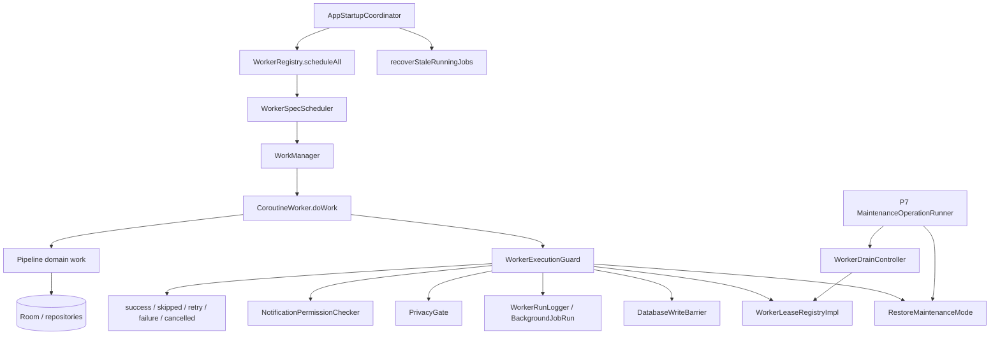

# Pipeline 9 Review — Workers / Background Jobs

## 0. Review constraints

Target repository: `https://github.com/panospao7/Cost-agregator`  
Target commit: `83b798e849b4408b2bf683f52cb2746d37f7af16`

Build/test status: **NOT RUN**

Reason:
- Remote/static review only.
- No local checkout, `rg`, or Gradle execution available.

Required first command for any follow-up agent:

```bash
git rev-parse HEAD
```

Expected:

```text
83b798e849b4408b2bf683f52cb2746d37f7af16
```

If not exact, stop.

Sources used:
- P9 issue doc: https://raw.githubusercontent.com/panospao7/Cost-agregator/83b798e849b4408b2bf683f52cb2746d37f7af16/docs/analyses%20and%20debug%20master/PIPELINE_9_CONSOLIDATED_ISSUES.md
- P9 implementation plan: https://raw.githubusercontent.com/panospao7/Cost-agregator/83b798e849b4408b2bf683f52cb2746d37f7af16/docs/analyses%20and%20debug%20master/pipelines%20issues%20implementantion%20plan/PIPELINE_9_IMPLEMENTATION_PLAN.md
- Worker guard: https://raw.githubusercontent.com/panospao7/Cost-agregator/83b798e849b4408b2bf683f52cb2746d37f7af16/app/src/main/java/com/yourname/expensetracker/domain/workers/WorkerExecutionGuard.kt
- Worker context/logger/spec/scheduler/registry/lease:
  - https://raw.githubusercontent.com/panospao7/Cost-agregator/83b798e849b4408b2bf683f52cb2746d37f7af16/app/src/main/java/com/yourname/expensetracker/domain/workers/WorkerRunContext.kt
  - https://raw.githubusercontent.com/panospao7/Cost-agregator/83b798e849b4408b2bf683f52cb2746d37f7af16/app/src/main/java/com/yourname/expensetracker/domain/workers/WorkerRunLogger.kt
  - https://raw.githubusercontent.com/panospao7/Cost-agregator/83b798e849b4408b2bf683f52cb2746d37f7af16/app/src/main/java/com/yourname/expensetracker/domain/workers/WorkerSpec.kt
  - https://raw.githubusercontent.com/panospao7/Cost-agregator/83b798e849b4408b2bf683f52cb2746d37f7af16/app/src/main/java/com/yourname/expensetracker/domain/workers/WorkerSpecScheduler.kt
  - https://raw.githubusercontent.com/panospao7/Cost-agregator/83b798e849b4408b2bf683f52cb2746d37f7af16/app/src/main/java/com/yourname/expensetracker/domain/workers/WorkerRegistry.kt
  - https://raw.githubusercontent.com/panospao7/Cost-agregator/83b798e849b4408b2bf683f52cb2746d37f7af16/app/src/main/java/com/yourname/expensetracker/domain/workers/WorkerLeaseRegistryImpl.kt
- Workers:
  - https://raw.githubusercontent.com/panospao7/Cost-agregator/83b798e849b4408b2bf683f52cb2746d37f7af16/app/src/main/java/com/yourname/expensetracker/data/privacy/DataRetentionWorker.kt
  - https://raw.githubusercontent.com/panospao7/Cost-agregator/83b798e849b4408b2bf683f52cb2746d37f7af16/app/src/main/java/com/yourname/expensetracker/data/location/LocationBackfillWorker.kt
  - https://raw.githubusercontent.com/panospao7/Cost-agregator/83b798e849b4408b2bf683f52cb2746d37f7af16/app/src/main/java/com/yourname/expensetracker/data/location/MerchantKeyBackfillWorker.kt
  - https://raw.githubusercontent.com/panospao7/Cost-agregator/83b798e849b4408b2bf683f52cb2746d37f7af16/app/src/main/java/com/yourname/expensetracker/service/reminder/BillReminderWorker.kt
  - https://raw.githubusercontent.com/panospao7/Cost-agregator/83b798e849b4408b2bf683f52cb2746d37f7af16/app/src/main/java/com/yourname/expensetracker/service/receiptmatching/ReceiptMatchingWorker.kt
  - https://raw.githubusercontent.com/panospao7/Cost-agregator/83b798e849b4408b2bf683f52cb2746d37f7af16/app/src/main/java/com/yourname/expensetracker/data/ai/worker/DailyBriefingWorker.kt
  - https://raw.githubusercontent.com/panospao7/Cost-agregator/83b798e849b4408b2bf683f52cb2746d37f7af16/app/src/main/java/com/yourname/expensetracker/service/warranty/WarrantyExpirationWorker.kt
  - https://raw.githubusercontent.com/panospao7/Cost-agregator/83b798e849b4408b2bf683f52cb2746d37f7af16/app/src/main/java/com/yourname/expensetracker/worker/NotificationIntakeWorker.kt
- Startup / barrier:
  - https://raw.githubusercontent.com/panospao7/Cost-agregator/83b798e849b4408b2bf683f52cb2746d37f7af16/app/src/main/java/com/yourname/expensetracker/startup/AppStartupCoordinator.kt
  - https://raw.githubusercontent.com/panospao7/Cost-agregator/83b798e849b4408b2bf683f52cb2746d37f7af16/docs/backup-restore-barrier-contract.md
- Hilt worker module: https://raw.githubusercontent.com/panospao7/Cost-agregator/83b798e849b4408b2bf683f52cb2746d37f7af16/app/src/main/java/com/yourname/expensetracker/di/WorkerModule.kt
- Codebase segments: https://raw.githubusercontent.com/panospao7/Cost-agregator/83b798e849b4408b2bf683f52cb2746d37f7af16/docs/architecture/CODEBASE_SEGMENTS.md

---

# Pipeline 9 Review — Workers / Background Jobs

## 1. Pipeline summary

P9 owns the background runtime:
- shared `WorkerExecutionGuard`,
- durable `BackgroundJobRun` logging,
- WorkManager spec/registry/scheduler,
- worker lease/drain used by backup/restore,
- stale RUNNING recovery on startup,
- privacy and notification-permission gating for workers,
- runtime cancellation/checkpoints,
- registered periodic/one-shot workers.

Registered workers at this SHA:
- `data_retention` — `DataRetentionWorker`
- `location_backfill` — `LocationBackfillWorker`
- `merchant_key_backfill` — `MerchantKeyBackfillWorker`
- `bill_reminder_periodic` — `BillReminderWorker`
- `receipt_matching` — `ReceiptMatchingWorker`
- `ai_daily_briefing` — `DailyBriefingWorker`
- `warranty_expiration_check` — `WarrantyExpirationWorker`

Bespoke worker:
- `NotificationIntakeWorker`

Main flow:



High-level status:
- Many tracker-listed issues are fixed in code.
- The old P9 implementation plan is stale.
- The P9 consolidated issue doc is also too optimistic: it classifies `NEW-P9-008` as low-risk partial, but source shows broader restore-drain and run-ledger gaps for `NotificationIntakeWorker`.
- Additional source-level defects remain in worker leases and scheduler behavior.

Final verdict: **RED / high YELLOW**. P9 is improved but not production-GREEN because restore drain can miss active work in realistic cases.

---

## 2. File inventory

| Category | Files reviewed | Why relevant | Notes |
|---|---|---|---|
| Issue docs | `PIPELINE_9_CONSOLIDATED_ISSUES.md`, P9 implementation plan, master tracker | Tracker reconciliation | Consolidated doc says complete except partial `NEW-P9-008`; implementation plan is older/stale. |
| Architecture docs | `CODEBASE_SEGMENTS.md`, `backup-restore-barrier-contract.md` | Segment ownership + restore/worker drain contract | Segment 12 owns workers. Barrier contract requires workers drained before backup/restore snapshot/file mutation. |
| Worker infrastructure | `WorkerExecutionGuard.kt`, `WorkerRunContext.kt`, `WorkerRunLogger.kt`, `WorkerSpec.kt`, `WorkerSpecScheduler.kt`, `WorkerRegistry.kt`, `WorkerLeaseRegistryImpl.kt` | Core P9 runtime | Guard is strong, but lease registry and one-shot version policy have issues. |
| Registered workers | `DataRetentionWorker.kt`, `LocationBackfillWorker.kt`, `MerchantKeyBackfillWorker.kt`, `BillReminderWorker.kt`, `ReceiptMatchingWorker.kt`, `DailyBriefingWorker.kt`, `WarrantyExpirationWorker.kt` | All registry workers | Mostly guarded; some worker-specific gaps. |
| Bespoke worker | `NotificationIntakeWorker.kt` | P1/P3 intake background path | Uses checkpoint only, no lease/run ledger/full guard. Reads before barrier. |
| Startup | `AppStartupCoordinator.kt` | Startup scheduling and stale-run recovery | Uses `WorkerRegistry.scheduleAll`; skips scheduling in maintenance; recovers stale RUNNING rows. |
| Hilt | `WorkerModule.kt` | Runtime binding | `WorkerLeaseRegistryImpl` bound as both `WorkerLeaseRegistry` and `WorkerDrainController`. |
| Not fully reviewed | all tests, DAOs/entities, every companion schedule/cancel method, restore maintenance runner, privacy runtime policy | No local `rg` | Must be verified locally before final GREEN. |

Files discovered but not fully reviewed:
- `BackgroundJobRunDao.kt`, `BackgroundJobRun.kt`
- `RestoreMaintenanceMode.kt`, `MaintenanceOperationRunner.kt`
- `PrivacySettingsRepositoryImpl.kt`, `PrivacyRuntimeWorkerPolicy`
- `NotificationPermissionChecker` implementations
- `RecurringReminderDeliveryDao`, `WarrantyReminderDeliveryDao`, `NotificationIntakeDao`
- all worker tests and architecture guard tests

---

## 3. Architecture comparison

### Segment / ownership

`CODEBASE_SEGMENTS.md` identifies Segment 12 as Startup & Background Runtime, owning boot wiring, workers, and periodic runtime jobs. P9 code follows this by centralizing:
- worker specs in `WorkerSpec.DEFAULTS`;
- scheduling in `WorkerSpecScheduler`;
- registry in `WorkerRegistry`;
- guard/run logging in `WorkerExecutionGuard` + `WorkerRunLogger`.

### Backup/restore barrier contract

The barrier contract says destructive DB operations must call `enterAndDrain()` and that workers must be drained before snapshot/file mutation. The registered-worker path mostly supports this through `WorkerLeaseRegistryImpl`.

Critical mismatch:
- `WorkerLeaseRegistryImpl` stores active leases by `workerName` in a single-value map. Concurrent same-name workers overwrite each other.
- `NotificationIntakeWorker` does not acquire a lease because it does not call full `runGuarded` / `runGuardedWithContext`.

Therefore, the code does **not** fully meet the “workers are drained before backup/restore” contract.

### Tracker/code drift

- `PIPELINE_9_IMPLEMENTATION_PLAN.md` is stale: many issues it marks open are fixed in code.
- `PIPELINE_9_CONSOLIDATED_ISSUES.md` is partly stale/over-optimistic:
  - It marks `NEW-P9-006` fixed, but one-shot version bumps use `ExistingWorkPolicy.KEEP`, not an update/replace policy.
  - It marks `NEW-P9-015` fixed, but `WorkerRunLogger.Handle` uses `get()` then `set(true)`, not atomic `compareAndSet`.
  - It treats `NEW-P9-008` as low-risk partial, but the missing lease means P7 worker drain cannot see `NotificationIntakeWorker`.

### Stale or misleading comments

- `WorkerSpec.kt` comment says bill reminders are disabled by default, but `bill_reminder_periodic` has `enabled = true`.
- `WorkerSpecScheduler.kt` comments say version bump forces UPDATE for one-shot workers, but implementation returns `ExistingWorkPolicy.KEEP` on version change.

---

## 4. Runtime flow / call graph

### Startup scheduling

```text
AppStartupCoordinator.initialize()
  -> checkRestoreJournal()
  -> if maintenance active: skip scheduling
  -> else:
       WorkerRegistry.scheduleAll(application)
       syncProactiveBriefingWork()
       recoverStaleWorkerRuns()
       importRestoreJournals()
```

Evidence:
- `AppStartupCoordinator.scheduleStartupWork()` delegates to `WorkerRegistry.scheduleAll`.
- Startup skips worker scheduling if `RestoreMaintenanceMode.isWritesAllowed()` is false.
- Startup recovers stale RUNNING rows via `workerExecutionGuard.recoverStaleRunningJobs(...)`.

### Worker registry/spec parity

`WorkerRegistry.entries` has 7 entries and matches `WorkerSpec.DEFAULTS` keys for the 7 registered workers. `NotificationIntakeWorker` is intentionally outside the registry.

### Worker guard lifecycle

```text
doWork()
  -> executionGuard.runGuardedWithContext(request)
     -> check maintenance mode
     -> write/read barrier
     -> acquire lease
     -> start BackgroundJobRun
     -> check spec enabled
     -> check privacy capabilities
     -> check notification permission if requested
     -> run block(ctx)
     -> terminal log in NonCancellable
     -> release lease
```

Good:
- lease release is in `finally`;
- timeout classified as retry;
- `CancellationException` rethrown;
- terminal logging done in `NonCancellable`;
- `startRunSafely()` checks write barrier immediately before run logger insert.

Gaps:
- active leases are keyed by worker name and can be overwritten;
- `NotificationIntakeWorker` does not enter this lifecycle.

### Restore / maintenance drain

```text
P7 MaintenanceOperationRunner
  -> WorkerDrainController.requestStopAndAwaitDrain()
  -> WorkerLeaseRegistryImpl.requestStopAll()
  -> awaitNoActiveWorkers()
  -> proceed with snapshot/swap if drained
```

Gap:
- drain only sees entries in `activeLeases`.
- same-name lease overwrite and bespoke intake worker bypass mean drain can report success while background work is still running.

### Registered workers

| Worker | Guarded? | Context counters? | Notable behavior |
|---|---:|---:|---|
| `DataRetentionWorker` | yes | rowsUpdated | deterministic target order + checkpoint; partial failure soft-success issue remains. |
| `LocationBackfillWorker` | yes | scanned/updated/skipped | throws `RetryableWorkerException` on `isStopped`. |
| `MerchantKeyBackfillWorker` | yes | scanned/updated/errors | bounded batches; throws retry on stop/no progress. |
| `BillReminderWorker` | yes | skipped/notifications | settings/quiet-hours inside guard; no guard notification-permission request. |
| `ReceiptMatchingWorker` | yes | scanned/updated/notifications | manual `runOnce()` can overlap, data-layer claim handles duplicate linking. |
| `DailyBriefingWorker` | yes | notificationsSent | reschedules next midnight after success/skip; failure to reschedule is logged but swallowed. |
| `WarrantyExpirationWorker` | yes | scanned/updated/notifications | uses `TimeProvider`, DB durable sent state, notification-permission guard. |

### NotificationIntakeWorker bespoke path

```text
NotificationIntakeWorker.doWork()
  -> read intakeDao.getById(intakeId)
  -> writeBarrier.writesAllowed()
  -> executionGuard.checkpoint("notification_intake")
  -> claimForProcessing()
  -> process repository pipeline
  -> markTerminal / retry / final failure
```

Gaps:
- reads DB before any read/write barrier;
- no full guard;
- no lease;
- no `BackgroundJobRun`;
- no `WorkerRunContext`;
- no registry/spec;
- no notification permission/privacy capability check in guard lifecycle.

---

## 5. Issue table

| ID | Severity | Status | File(s) | Evidence | Impact | Reproduction path | Recommended fix | Required tests | Cross-pipeline impact |
|---|---:|---|---|---|---|---|---|---|---|
| P9-FIND-001 | P1 | bug | `WorkerLeaseRegistryImpl.kt` | `activeLeases` is `ConcurrentHashMap<workerName, lease>` and `acquire()` assigns `activeLeases[workerName] = lease`; `close()` removes by workerName. | Concurrent same-name workers can overwrite each other. First close can remove the second lease; backup/restore drain can falsely see zero active workers. | Run periodic and manual `ReceiptMatchingWorker` concurrently; first closing lease removes map entry while second still runs; start backup drain. | Store leases by unique lease ID, with workerName metadata, or `workerName -> set<leaseId>`. Remove by lease ID only. | `concurrent_same_name_leases_are_all_tracked`; `drain_waits_for_second_same_name_worker_after_first_closes` | P7 backup/restore, P38 receipt matching |
| P9-FIND-002 / NEW-P9-008 | P1 | bug/partial | `NotificationIntakeWorker.kt` | Worker reads `intakeDao.getById()` before barrier, checks `writeBarrier.writesAllowed()`, calls only `executionGuard.checkpoint()`, never `runGuarded*`, never acquires lease, never writes `BackgroundJobRun`. | Worker drain cannot see active notification intake work. A backup/restore may proceed while intake is running. Read during restore can hit stale/swapped DB. | Start `NotificationIntakeWorker`, enter backup/restore before/after checkpoint; drain sees no lease. | Wrap with `runGuardedWithContext` or add `WorkerLeaseRegistry` lease + read/write barriers + run logger. At minimum barrier before first DAO read and lease around whole work. | `notification_intake_acquires_lease`; `notification_intake_blocked_during_restore_before_first_read`; `notification_intake_records_background_job_run_or_documented_intake_ledger` | P1/P3 notification pipeline, P7 restore |
| P9-FIND-003 / NEW-P9-006 | P2 | bug | `WorkerSpecScheduler.kt` | Comments say one-shot version bump forces UPDATE; implementation uses `ExistingWorkPolicy.KEEP` when `versionChanged`. | One-shot worker spec/constraint changes may not replace stale pending work. | Have pending `ai_daily_briefing`, bump spec version, call schedule; KEEP preserves old work. | For one-shot version change use `ExistingWorkPolicy.REPLACE` or explicit cancel+enqueue. Keep non-version policy as configured. | `one_shot_version_bump_replaces_existing_work`; `daily_briefing_version_bump_updates_constraints` | P20 AI, P19 merchant backfill |
| P9-FIND-004 / NEW-P9-015 | P2 | bug | `WorkerRunLogger.kt` | Terminal methods use `if (completed.get()) return; completed.set(true)` instead of `compareAndSet(false, true)`. | Concurrent terminal calls can both write terminal status, corrupting run ledger. | Race `success()` and `retry()` on same handle in test. | Replace with `if (!completed.compareAndSet(false, true)) return`. | `worker_run_handle_terminal_methods_are_atomic_under_race` | Diagnostics/P29 |
| P9-FIND-005 | P2 | partial | `DataRetentionWorker.kt` | Target failure sets `anyFailure` and logs, but worker still returns guard success; checkpoint cleared after all targets even with failures. | Failed retention target may appear successful in WorkManager and run ledger. Retry waits until next schedule. | Add failing target returning `success=false`; worker returns `Result.success`. | Return retry for any non-permanent target failure, or record `PARTIAL_FAILED` status/retry reason; preserve failed checkpoint. | `retention_target_failure_returns_retry_or_partial_status`; `failed_target_checkpoint_not_cleared_as_success` | P8 privacy retention |
| P9-FIND-006 / NEW-P9-012 | P2 | partial | `DailyBriefingWorker.kt` | Reschedule failure is logged via `runCatching { aiWorkScheduler.scheduleDailyBriefing() }.onFailure`, but result still returns prior guard result. | Midnight one-shot chain can die until next startup after reschedule failure. | Make scheduler throw; worker returns success and no next work is scheduled. | If reschedule fails after success/skip, return retry or persist a durable reschedule-needed flag. | `daily_briefing_reschedule_failure_returns_retry_or_repairs_chain` | P20 AI daily briefing |
| P9-FIND-007 | P2 | partial | `BillReminderWorker.kt` | `WorkerGuardRequest` does not set `requiresNotificationPermission=true`; permission failure is handled after claim in `sendNotification`. | Runs are not durably classified as `NOTIFICATION_PERMISSION_DENIED`; deliveries may be marked FAILED instead of skipped by guard. | Disable notification permission; run worker. | Decide desired semantics. Prefer guard notification-permission check like warranty worker if no pre-claim state changes should occur when permission denied. | `bill_reminder_notification_permission_denied_is_guard_skipped` | P36 bill reminders |
| P9-FIND-008 | P3 | diagnostics | `WorkerRegistry.kt` | `scheduleAll()` wraps each schedule in `runCatching` but does not log failures. | Startup/restore worker schedule failures are silent. | Make one entry throw; no log/diagnostic. | Log sanitized failure or write diagnostic event; rethrow CE if converted to suspend later. | `worker_registry_schedule_all_logs_entry_failure` | P7 restore resume, startup |
| P9-FIND-009 | P3 | docs drift | `WorkerSpec.kt`, `WorkerSpecScheduler.kt`, P9 docs | Comments conflict with source: bill reminders “disabled by default” but enabled; one-shot “UPDATE” but code uses KEEP. | Future agents may plan wrong fixes. | Read files. | Update comments/docs after source behavior fixed. | docs/static test | None |

---

## 6. Universal contract audit

### Restore barrier — **FAIL/PARTIAL**

Pass:
- Registered workers use `WorkerExecutionGuard`.
- Guard checks maintenance mode, write barrier, and checkpoints.
- P7 contract requires drain before destructive operations.

Fail/gap:
- `WorkerLeaseRegistryImpl` cannot correctly track multiple same-name workers.
- `NotificationIntakeWorker` does not acquire a lease and reads before barrier.
- Therefore P7 drain can miss active work.

### Worker guard / run logging — **PARTIAL**

Pass:
- 7 registered workers use `runGuardedWithContext`.
- `WorkerRunContext` counters are atomic.
- Timeout and CE classification are mostly correct.
- `startRunSafely()` checks write barrier before `BackgroundJobRun` insert.
- Startup recovers stale RUNNING rows.

Fail/gap:
- `NotificationIntakeWorker` lacks full run logging.
- `WorkerRunLogger.Handle` idempotency is not atomic under races.
- `DataRetentionWorker` partial failures soft-success.
- `WorkerRegistry.scheduleAll` swallows schedule failures.

### Privacy/redaction — **PARTIAL**

Pass:
- Location backfill requires `BACKGROUND_LOCATION_BACKFILL`.
- Daily briefing requires `CLOUD_AI_DAILY_BRIEFING`.
- Data retention is allowed to run without user feature gate.
- Worker errors stored by `WorkerRunLogger` are sanitized by `EventMetadataSanitizer`.

Gaps:
- Bill reminder notification-permission denial is not enforced by guard.
- Full `Timber/Log` raw PII inventory was not run.
- Notification intake privacy gating belongs to P1/P8 and needs full local verification.

### Lifecycle ownership — **PARTIAL PASS**

Pass:
- Bill reminders use `RecurringLifecycleCoordinator`.
- Receipt matching uses `ReceiptLinkService` with `requireUnmatchedClaim`.
- Warranty sent-state is DB durable.

Gaps:
- Notification intake uses repository pipeline, but without full P9 guard/ledger.

### Money/currency — **NOT APPLICABLE/PARTIAL**

P9 does not own money math. It touches bill reminder notifications with amounts and dashboard briefing via downstream P20/P5/P6. No money aggregation issue found in reviewed worker infrastructure.

### Diagnostics/events — **PARTIAL**

Pass:
- `BackgroundJobRun` ledger is used by registered workers.
- Receipt matching records durable match events for skip/attempt/no-match/failure.
- Startup recovers stale RUNNING rows.

Gaps:
- `NotificationIntakeWorker` lacks `BackgroundJobRun`.
- `WorkerRunLogger` terminal race.
- Scheduler failures can be silent.

### Import/export/backup — **FAIL/PARTIAL**

Pass:
- Startup skips scheduling during maintenance.
- Registry helps restore/startup symmetry.

Fail/gap:
- Lease tracking bug and intake worker bypass can break “workers drained before snapshot/swap.”

### DAO conflict/timestamps — **PARTIAL**

Pass:
- Warranty delivery uses claim-before-notify state machine and `TimeProvider`.
- Bill reminders claim before notify via coordinator.

Gaps:
- Need local DAO inspection for all `IGNORE` insert results.
- Notification intake uses `System.currentTimeMillis()` in workerId; minor but inconsistent with `TimeProvider`.

---

## 7. P9 issue reconciliation

| Tracker issue | Tracker status | Code status at target SHA | Evidence | Final status | Notes |
|---|---|---|---|---|---|
| P9-P1-01 BackgroundJobRun unused | Fixed | Fixed for registered workers | `WorkerExecutionGuard` starts `WorkerRunLogger`; registered workers use guard. | FIXED/PARTIAL | `NotificationIntakeWorker` still lacks run ledger. |
| P9-P1-02 no shared guard | Fixed | Fixed for 7 registered workers | Registered workers use `runGuardedWithContext`. | FIXED/PARTIAL | Bespoke intake partial. |
| P9-P1-03 restore/backup cancellation not barrier | Fixed | Partial | Guard+lease exists, but lease map and intake bypass break drain correctness. | PARTIALLY_FIXED | High-risk. |
| P9-P1-04 daily briefing chain breaks | Fixed | Partial | Reschedules on success/skip, but reschedule failure is swallowed/logged only. | PARTIALLY_FIXED | Needs retry/repair. |
| P9-P1-05 bill reminder static disabled | Fixed | Fixed | `WorkerSpec.DEFAULTS["bill_reminder_periodic"].enabled = true`. | FIXED | Comment stale. |
| P9-P1-06 bill reminders exactly-once | Fixed | Mostly fixed | Claim-before-notify via coordinator; revalidate after claim. | FIXED_NEEDS_TEST | Permission semantics gap separate. |
| P9-P1-07 receipt `runOnce()` bypass unique scheduling | Fixed | Fixed by data-layer claim | Manual one-shot uses KEEP; atomic receipt claim handles overlap. | FIXED/PARTIAL | Lease overlap still affects drain, not matching correctness. |
| P9-P1-08 matching outcomes not durable | Fixed | Fixed | `safeRecordMatchEvent` records skip/attempt/not-found/link-failed. | FIXED | Good. |
| P9-P1-09 warranty sent-state outside DB | Fixed | Fixed | `WarrantyReminderDelivery` claim/send/mark protocol. | FIXED | Good. |
| P9-P1-10 pause/resume hardcoded/asymmetric | Fixed | Mostly fixed | `WorkerRegistry.entries` and `WorkerSpec.DEFAULTS`; startup uses registry. | FIXED/PARTIAL | `NotificationIntakeWorker` bespoke. |
| P9-P1-11 privacy changes do not cancel workers | Fixed | Needs verification | P8 source reportedly has runtime worker policy. | NEEDS_RUNTIME_VERIFICATION | Run privacy policy RG/tests. |
| P9-NEW-03 zero counts | Fixed | Fixed for registered workers | `runGuardedWithContext` and context counters. | FIXED/PARTIAL | Intake no `BackgroundJobRun`; DataRetention failures soft. |
| NEW-P9-001 timeout misclassified | Fixed | Fixed | Guard checks `TimeoutCancellationException` before CE. | FIXED | Good. |
| NEW-P9-002 BillReminder guard bypass | Fixed | Fixed | settings/quiet-hours inside `runGuardedWithContext`. | FIXED | Notification permission gap separate. |
| NEW-P9-003 counters not thread-safe | Fixed | Fixed | `WorkerRunContext` uses `AtomicInteger`. | FIXED | Good. |
| NEW-P9-004 Warranty uses no context | Fixed | Fixed | `WarrantyExpirationWorker` uses `runGuardedWithContext`. | FIXED | Good. |
| NEW-P9-005 Warranty uses `System.currentTimeMillis` | Fixed | Fixed | Uses injected `TimeProvider`. | FIXED | Good. |
| NEW-P9-006 scheduler deprecated REPLACE | Fixed | Partial | Periodic uses UPDATE on version bump; one-shot version bump uses KEEP and comments conflict. | PARTIALLY_FIXED | Needs fix. |
| NEW-P9-007 version write atomicity | Fixed | Mostly fixed | version written after enqueue in try. | FIXED | Crash after enqueue before prefs safe. |
| NEW-P9-008 intake not guard/registry | Partial | Worse than docs say | Checkpoint only; no lease/full guard/run ledger; reads before barrier. | OPEN/P1 | Must fix before GREEN. |
| NEW-P9-009 Location `isStopped` success | Fixed | Fixed | throws `RetryableWorkerException` after loop if stopped. | FIXED | Good. |
| NEW-P9-010 Merchant backfill `isStopped` success | Fixed | Fixed | throws `RetryableWorkerException`. | FIXED | Good. |
| NEW-P9-011 midnight delay edge | Fixed | Fixed | `maxOf(rawDelayMs, 60_000L)`. | FIXED | Good. |
| NEW-P9-012 DailyBriefing reschedule swallowed | Fixed | Partial | failure logged but result still success/skip. | PARTIALLY_FIXED | Chain can die. |
| NEW-P9-013 read-only path exception handling | Fixed | Fixed | guard wraps read barrier in try/catch. | FIXED | Good. |
| NEW-P9-014 merchant backfill battery | Fixed | Fixed | spec has `setRequiresBatteryNotLow(true)`. | FIXED | Good. |
| NEW-P9-015 handle not idempotent | Fixed | Partial | uses AtomicBoolean but not compare-and-set. | PARTIALLY_FIXED | Race remains. |

---

## 8. Test coverage review

Tests were not opened or run.

Existing tests likely present but must be verified with:

```bash
rg -n "Worker|WorkManager|WorkerExecutionGuard|WorkerRun|WorkerSpec|WorkerRegistry|WorkerLease|BackgroundJobRun|DataRetention|BillReminder|DailyBriefing|LocationBackfill|MerchantKeyBackfill|ReceiptMatching|WarrantyExpiration|NotificationIntake|Scheduler|Guard|Drain|Maintenance" app/src/test app/src/androidTest
```

Missing/needed tests:
- same-name concurrent leases are both tracked;
- drain waits for overlapping manual/periodic receipt matching;
- notification intake acquires lease or full guard;
- notification intake blocks before first DAO read during restore;
- one-shot version bump replaces existing work;
- worker run handle terminal calls are atomic;
- data retention failure returns retry/partial status;
- daily briefing reschedule failure preserves chain;
- bill reminder permission denial uses guard semantics or documented alternative;
- WorkerRegistry schedule failure logs diagnostic.

Weak tests to watch for:
- tests that only instantiate `WorkerExecutionGuard` without asserting terminal ledger state;
- scheduler tests that check periodic workers only, missing one-shot version changes;
- drain tests with one worker only, missing same-name overlap;
- intake tests that check checkpoint but not lease/run ledger/read barrier.

---

## 9. Test plan

### Unit tests

```kotlin
concurrent_same_name_leases_are_all_tracked()
drain_waits_for_second_same_name_worker_after_first_closes()
worker_run_handle_terminal_methods_are_atomic_under_race()
one_shot_version_bump_replaces_existing_work()
worker_registry_schedule_all_logs_entry_failure()
```

### Worker integration tests

```kotlin
notification_intake_acquires_lease_for_entire_run()
notification_intake_blocked_during_restore_before_first_dao_read()
notification_intake_records_background_job_run_or_has_documented_intake_ledger()
daily_briefing_reschedule_failure_returns_retry_or_repairs_chain()
retention_failed_target_returns_retry_or_partial_status()
bill_reminder_permission_denied_is_guard_skipped_or_documented()
```

### Regression tests for fixed claims

```kotlin
timeout_classified_as_retry()
bill_reminder_settings_and_quiet_hours_inside_guard()
worker_run_context_counters_atomic()
warranty_worker_uses_context_and_time_provider()
location_isStopped_returns_retry()
merchant_key_isStopped_returns_retry()
schedule_at_midnight_has_minimum_delay()
merchant_key_backfill_has_battery_constraint()
```

### Architecture/static tests

- Worker registry/spec parity:
  - every `WorkerRegistry.Entry.specName` exists in `WorkerSpec.DEFAULTS`;
  - every enabled recurring background worker has a registry entry or documented bespoke reason.
- Worker subclass inventory:
  - every `CoroutineWorker` either uses full `WorkerExecutionGuard` or is explicitly allowlisted with equivalent lease/barrier/run-ledger tests.
- No raw DB writes in worker body without guard checkpoint/barrier.

### Manual validation

1. Start long-running receipt matching manual + periodic overlap; start backup; confirm drain waits for both.
2. Start notification intake; immediately enter restore/backup mode; confirm worker retries/skips before DB read/write.
3. Disable notification permission; run bill/warranty reminders; inspect `BackgroundJobRun`.
4. Force WorkManager scheduling failure for daily briefing; confirm chain repairs or retries.
5. Kill app during worker; restart; verify stale RUNNING marked `STALE_ABORTED`.

---

## 10. Optional deliverables

### 10.1 Worker registry/spec parity table

| Worker name | Worker class | In `WorkerSpec.DEFAULTS` | In `WorkerRegistry.entries` | Full guard | Notes |
|---|---|---:|---:|---:|---|
| `data_retention` | `DataRetentionWorker` | yes | yes | yes | Partial failure semantics weak. |
| `location_backfill` | `LocationBackfillWorker` | yes | yes | yes | Good. |
| `merchant_key_backfill` | `MerchantKeyBackfillWorker` | yes | yes | yes | One-shot version policy bug. |
| `bill_reminder_periodic` | `BillReminderWorker` | yes | yes | yes | Missing guard notification-permission flag. |
| `receipt_matching` | `ReceiptMatchingWorker` | yes | yes | yes | Manual overlap data-safe, lease tracking unsafe. |
| `ai_daily_briefing` | `DailyBriefingWorker` | yes | yes | yes | Reschedule failure soft-swallowed. |
| `warranty_expiration_check` | `WarrantyExpirationWorker` | yes | yes | yes | Good. |
| bespoke intake | `NotificationIntakeWorker` | no | no | no | Uses checkpoint only; high-risk for drain. |

### 10.2 Legal worker write path table

| Flow | Legal path | Status |
|---|---|---|
| Registered worker DB writes | WorkManager → Worker → `WorkerExecutionGuard` → lease/barrier/run logger → repository/DAO | PASS/PARTIAL |
| Notification intake writes | WorkManager → `NotificationIntakeWorker` → writeBarrier/checkpoint → DAO/repository | FAIL/PARTIAL |
| Backup/restore drain | P7 runner → `WorkerDrainController` → `WorkerLeaseRegistryImpl` | FAIL/PARTIAL due same-name lease overwrite and intake bypass |
| Receipt matching links | Worker → `ReceiptLinkService.linkReceiptToExpense(requireUnmatchedClaim=true)` | PASS |
| Bill reminders | Worker → `RecurringLifecycleCoordinator` claim/revalidate/mark | PASS/PARTIAL |
| Warranty reminders | Worker → `WarrantyReminderDeliveryDao` seed/claim/send/mark | PASS |

### 10.3 Safe fix plan

1. **PR1 — Drain/lease correctness**
   - multi-lease registry;
   - tests for concurrent same-name workers;
   - drain waits for all active leases.

2. **PR2 — NotificationIntakeWorker full guard**
   - wrap with `runGuardedWithContext` or explicit lease + run ledger;
   - barrier before first DAO read;
   - preserve per-intake ledger semantics.

3. **PR3 — Scheduler/run-ledger correctness**
   - one-shot version bump replace/cancel+enqueue;
   - atomic `compareAndSet` terminal handle;
   - schedule failure diagnostics.

4. **PR4 — Worker-specific polish**
   - retention failure retry/partial status;
   - daily briefing reschedule failure repair;
   - bill reminder notification-permission guard decision.

5. **PR5 — Docs/tracker sync**
   - update P9 issue doc and stale comments.

---

## 11. Final verdict

Verdict: **RED / high YELLOW**

P9 is not as broken as the older implementation plan suggests; most registered workers are guarded and many tracker issues are fixed. However, it is **not production GREEN** because worker drain correctness is not guaranteed.

Highest-risk remaining issue:

```text
P9-FIND-001 + P9-FIND-002:
worker drain can miss active work because same-name leases overwrite each other and NotificationIntakeWorker does not acquire a lease/full guard.
```

Why this matters:
- Backup/restore depends on draining workers before DB snapshot/swap.
- Receipt matching can intentionally overlap manual and periodic runs with the same guard worker name.
- Notification intake is a DB-writing worker but is invisible to the lease registry.
- A false “drained” state can allow destructive maintenance while background writes are still running.

Production safety:
- Registered workers are mostly safe under normal operation.
- Backup/restore safety remains incomplete.
- Notification intake remains the major bespoke exception.

Must fix before GREEN:
1. Track multiple concurrent leases per worker name.
2. Bring `NotificationIntakeWorker` under full guard/lease/run-log or equivalent tested contract.
3. Fix one-shot version-bump policy.
4. Make `WorkerRunLogger.Handle` terminal idempotency atomic.
5. Add architecture guard tests for every Worker subclass.
6. Run full P9 targeted tests and update stale docs.