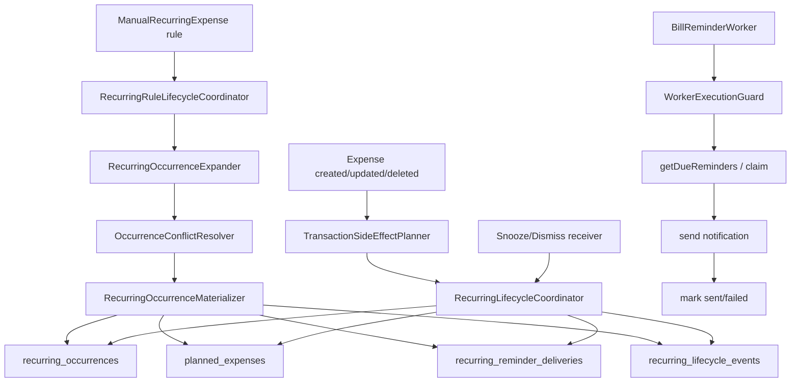

# Pipeline 4 Review — Recurring / Bill Reminders

Repository: `panospao7/Cost-agregator`  
Pinned commit: `83b798e849b4408b2bf683f52cb2746d37f7af16`  
Mode: review/audit only.  
Limitation: I reviewed via GitHub/raw source in this environment; I could not run local `rg`, Gradle, Room schema validation, or tests.

---

## 1. Pipeline summary

P4 owns recurring rules, generated occurrences, planned-expense projection, actual-payment reconciliation, reminder delivery, reminder worker dispatch, and snooze/dismiss actions.

Main runtime flow:

```text
Rule CRUD
→ RecurringRuleLifecycleCoordinator
→ Expander → ConflictResolver → Materializer
→ RecurringOccurrence + PlannedExpense + ReminderDelivery + RecurringLifecycleEvent

Actual expense create/update/delete
→ TransactionLifecycleCoordinator
→ TransactionSideEffectPlanner post-commit action
→ RecurringLifecycleCoordinator link/reconcile/unlink
→ occurrence PAID/PLANNED, planned fulfilled/reopened, reminders suppressed/regenerated

Reminder dispatch
→ BillReminderWorker
→ WorkerExecutionGuard
→ getDueReminders()
→ claim delivery
→ revalidate claimed occurrence still PLANNED
→ Android notification
→ mark SENT / FAILED

Snooze/dismiss
→ BroadcastReceiver
→ RecurringLifecycleCoordinator.snoozeReminderDelivery()/dismissReminderDelivery()
```

High-level data-flow:



---

## 2. File inventory

| Category | Files reviewed | Why relevant | Notes |
|---|---|---|---|
| P4 issue/docs | `PIPELINE_4_CONSOLIDATED_ISSUES.md`, implementation plan, master tracker, universal tracker | Tracker/status baseline | P4 doc says several NEW-P4 issues remain open; code fixes some, but not all. Source doc shows old/new issue list and open statuses. |
| Architecture | `LEGAL_PATHS.md`, `CODEBASE_SEGMENTS.md`, `DEPENDENCY_MAP.md`, DAO map | Legal write paths and ownership | `LEGAL_PATHS.md` defines recurring legal paths, worker guard rules, event requirements, and forbidden direct DAO/event bypasses. |
| Rule lifecycle | `RecurringRuleLifecycleCoordinator.kt` | Rule create/update/activate/deactivate/delete | Main CRUD path. Uses write barrier and transactions for rule operations, but direct event DAO insert is widespread. |
| Occurrence lifecycle | `RecurringLifecycleCoordinator.kt` | Generate/link/unlink/status/reminder/reconcile | Main coordinator. Contains fixed race in link transaction, but also hidden write in `getDueReminders`, query-like write in `reconcilePlannedVsActual`, and non-atomic status/event writes. |
| Materializer | `RecurringOccurrenceMaterializer.kt` | Occurrence insert/update/reminder/planned fulfillment | Uses transaction via `materialize`; checks insert result and terminal statuses; writes events directly via DAO. |
| Expander/resolver | `RecurringOccurrenceExpander.kt`, `OccurrenceConflictResolver.kt` | Key generation and actual-expense matching | `occurrenceKey` now includes source type. Resolver still has TODO that same expense can pay multiple rules. |
| DAOs/entities | `ManualRecurringExpenseDao`, `RecurringOccurrenceDao`, `RecurringReminderDeliveryDao`, `PlannedExpenseDao`, entities | Conflict behavior, claims, schema constraints | Occurrence key unique; linkedExpenseId only indexed, not unique. Reminder claim/mark-sent are conditional. |
| Planned projection | `RecurringPlanProjectionService.kt`, `PlannedExpenseRepository.kt` | Planned row creation | `projectFromRule()` has explicit TODO for full atomicity and inserts planned rows after generation. |
| Worker/reminders | `BillReminderWorker.kt`, `BillReminderManager.kt`, `SnoozeReminderReceiver.kt`, `DismissReminderReceiver.kt`, settings repo | Dispatch, legacy reminders, receiver actions | Worker uses guard and `TimeProvider`, but does not request notification-permission guard. Receivers swallow `CancellationException`. |
| Worker infrastructure | `WorkerSpec.kt`, `WorkerRegistry.kt`, `WorkerExecutionGuard.kt` | Scheduling, guard/logging | Bill reminder spec is enabled and registered. Guard supports notification-permission checks but worker does not request them. |
| Transaction cross-pipeline | `TransactionLifecycleCoordinator.kt`, `TransactionSideEffectPlanner.kt` | Actual expenses trigger P4 | Create/update/delete side effects include recurring matching/reconcile/unlink post-commit. |
| Tests | `RecurringLifecycleFixesTest.kt`, `RecurringLifecycleCoordinatorTest.kt`, `BillReminderWorkerTimeProviderTest.kt` | Regression coverage | One P4 test file is ignored; worker time-provider test appears stale/inconsistent with current code. |

Files intentionally not fully reviewed:
- UI/ViewModel files: no recurring UI source was opened in this browser-limited run.
- Full migrations/schema JSON: not opened due tool-call limit. Entity/DAO constraints were reviewed from source.
- All Hilt modules: not exhaustively opened; constructor injection paths were inferred from source and WorkerRegistry.

---

## 3. Architecture comparison

### Follows legal paths

- Rule CRUD largely routes through `RecurringRuleLifecycleCoordinator`; repository methods delegate create/update/delete to that coordinator.
- `linkExpenseToOccurrence()` performs lookup and claim inside `database.withTransaction`, fixing the known NEW-P4-003 race.
- Reminder delivery claim/mark-sent/mark-failed are conditional on current status, improving exactly-once behavior.
- Worker is enabled in `WorkerSpec.DEFAULTS` and registered in `WorkerRegistry`.
- Legacy `BillReminderManager.markBillPaid()` is removed via `DeprecationLevel.ERROR` and throws.

### Violates or partially violates legal paths

- `getDueReminders()` has a hidden write through `recoverStaleClaimedDeliveries()` but does not check `DatabaseWriteBarrier` itself.
- `BillReminderWorker` does not set `requiresNotificationPermission = true` in `WorkerGuardRequest`, even though the worker sends notifications and the guard supports that contract.
- Many lifecycle events are written directly via `RecurringLifecycleEventDao.insert()` instead of `RecurringLifecycleEventWriter`, despite legal docs forbidding direct DAO critical event writes.
- Several state mutation + event pairs are not atomic: `updateOccurrenceStatus()`, `markReminderSent()`, `markReminderFailed()`, `cancelClaimedReminderDelivery()`.

### Doc/code/tracker drift

- P4 consolidated doc says NEW-P4-003, 005, 006, 008, 009, 010 are open.
- Code actually fixes:
  - NEW-P4-003: lookup inside transaction and conditional claim.
  - NEW-P4-009: most user-provided metadata uses `JSONObject.put()`.
  - NEW-P4-010: impossible state returns `Error`.
- Code still leaves:
  - NEW-P4-008 open by explicit TODO in `reconcilePlannedVsActual()`.
  - NEW-P4-005/006 partially fixed but with residual modulo collision risk.
- `BillReminderWorkerTimeProviderTest` claims quiet-hours/disabled settings short-circuit before guard, but current worker intentionally checks settings inside guard; the test is stale and likely failing or ignored by configuration.

---

## 4. Runtime flow / call graph

### Rule create

```text
RecurringExpenseRepository.addRecurringExpense()/insert()
→ RecurringRuleLifecycleCoordinator.createRule()
→ writeBarrier.checkWritesAllowed()
→ database.withTransaction {
    ManualRecurringExpenseDao.insert()
    RecurringOccurrenceExpander.expand()
    OccurrenceConflictResolver.resolve()
    RecurringOccurrenceMaterializer.materializeInCurrentTransaction()
    RecurringPlanProjectionService.projectFromOccurrencesInCurrentTransaction()
    RecurringLifecycleEventDao.insert(RULE_CREATED_GENERATED)
  }
```

Evidence: repository delegates to coordinator; coordinator create transaction generates occurrences, projects planned rows, writes event.

### Rule update/delete/deactivate/activate

```text
RecurringRuleLifecycleCoordinator.updateRule()/deleteRule()/deactivateRule()/activateRule()
→ write barrier
→ database.withTransaction
→ delete/update open future rows/reminders/planned rows
→ regenerate when needed
→ lifecycle event
```

Evidence: deactivate/delete are transactional and delete open planned/reminder rows; update regenerates inside one transaction.

### Occurrence generation

```text
RecurringLifecycleCoordinator.generateOccurrences()
→ write barrier
→ load active rule
→ expand candidates
→ fetch actual expenses
→ resolver.resolve()
→ materializer.materialize()
```

Evidence: `generateOccurrences()` checks barrier and calls materializer.

### Expense create/update/delete side effect

```text
TransactionLifecycleCoordinator create/update/delete
→ TransactionSideEffectPlanner.planCreated/planUpdated/planDeleted
→ PostCommitActionRunner
→ RecurringLifecycleCoordinator.linkExpenseToOccurrenceDetailed()
   or reconcileExpenseLinkAfterUpdate()
   or unlinkExpenseFromOccurrenceDetailed()
```

Evidence: planner creates recurring matching, reconcile, and unlink post-commit actions.

### Reminder dispatch

```text
BillReminderWorker.doWork()
→ WorkerExecutionGuard.runGuardedWithContext()
→ settings/quiet-hours check inside guard
→ coordinator.getDueReminders()
→ claimReminderDelivery()
→ getDispatchableClaimedReminder()
→ sendNotification()
→ markReminderSent() or markReminderFailed()
```

Evidence: worker uses guard and post-claim revalidation.

### Snooze/dismiss

```text
SnoozeReminderReceiver / DismissReminderReceiver
→ launch IO coroutine
→ coordinator.snoozeReminderDelivery()/dismissReminderDelivery()
→ write barrier
→ database.withTransaction
→ update delivery + event
```

Evidence: receivers call coordinator; coordinator snooze/dismiss are transactional with write barrier.

---

## 5. Issue table

| ID | Severity | Status | File(s) | Evidence | Impact | Reproduction path | Recommended fix | Required tests | Cross-pipeline impact |
|---|---:|---|---|---|---|---|---|---|---|
| P4-AUDIT-001 | P1 | bug | `BillReminderWorker.kt`, `WorkerExecutionGuard.kt`, `RecurringReminderDeliveryDao.kt` | Worker’s `WorkerGuardRequest` sets only `workerName` and `allowDuringBackupExport`; it does not set `requiresNotificationPermission = true`. Guard supports notification permission gating. On `SecurityException`, worker marks delivery failed. Pending query only returns SCHEDULED/SNOOZED, not FAILED_PERMISSION. | If notification permission is missing, due reminders can be claimed and moved to `FAILED_PERMISSION`, then never retried automatically after permission is granted. User misses bill reminders. | Disable notification permission, create due scheduled delivery, run worker. Delivery becomes `FAILED_PERMISSION` and disappears from due query. | Set `requiresNotificationPermission = true` in worker guard request. Prefer guard skip before claim so delivery remains SCHEDULED. If retaining failure marking, add recovery on permission grant. | Worker permission denied leaves delivery scheduled; run logged as skipped; no claim occurs. Permission re-enabled dispatches same delivery. | P9 worker contract; Android 13 notification permission UX. |
| P4-AUDIT-002 | P1 | bug | `RecurringLifecycleCoordinator.kt`, `RecurringReminderDeliveryDao.kt` | `getDueReminders()` calls `recoverStaleClaimedDeliveries()` before reading due reminders. Recovery performs an UPDATE in DAO. No `writeBarrier.checkWritesAllowed()` is present in `getDueReminders()`/recovery. | Public read-looking method can write during restore/maintenance if called outside worker guard. Violates “every P4 write checks DatabaseWriteBarrier.” | Call `coordinator.getDueReminders()` in maintenance mode from a non-worker caller. Stale CLAIMED rows can be mutated. | Split into explicit `recoverStaleClaimedDeliveries()` with write barrier or add barrier before recovery. Consider making pure `peekDueReminders()` read-only. | Restore-barrier contract test for `getDueReminders()`; blocked write test; worker guard still passes in NORMAL. | Backup/restore safety; worker runtime. |
| P4-AUDIT-003 | P1 | bug/partial | `OccurrenceConflictResolver.kt`, `RecurringOccurrenceMaterializer.kt`, `RecurringOccurrenceDao.kt`, `RecurringOccurrence.kt` | Resolver TODO admits same expense can pay multiple rules. Resolver only prevents reuse within one candidate list. `linkedExpenseId` has only a non-unique index. Materializer auto-PAID path fulfills planned rows by occurrence key when resolver matched an expense. | Two recurring rules with same merchant/date/amount/currency can both become PAID from the same actual expense during rule generation/materialization, fulfilling multiple planned rows with one payment. | Create actual Netflix expense. Create two active Netflix monthly rules with same next date/amount/currency. Generate/update both rules. Both occurrences can be PAID with same `linkedExpenseId`. | Add global exclusion: resolver/materializer must ignore actual expenses already linked to any occurrence. Add unique or partial unique constraint on `linkedExpenseId` where not null if design allows. | Two matching rules + one actual expense must only link one occurrence; second should remain PLANNED/NoMatch. Migration test if unique index added. | Transaction lifecycle recurring side effects; forecast/planned fulfillment correctness. |
| P4-AUDIT-004 | P1/P2 | partial | `RecurringLifecycleCoordinator.kt`, `RecurringOccurrenceMaterializer.kt`, `RecurringRuleLifecycleCoordinator.kt`, `RecurringLifecycleEventWriter.kt` | Legal docs require critical lifecycle events through writer and forbid direct DAO event writes. Code directly inserts events in coordinator/materializer/rule coordinator. `markReminderSent()` updates first, then best-effort inserts event outside a transaction. `updateOccurrenceStatus()` updates status then inserts event without transaction. | State/event drift: delivery can become SENT/FAILED or occurrence SKIPPED/CANCELLED without durable event if insert fails/crashes. | Inject failing event DAO after `markSentFromClaimed()` succeeds; delivery remains SENT with no `REMINDER_SENT` event. | Wrap state mutation + event insert in `database.withTransaction`; use `eventWriter.writeCritical()` or a transaction-aware event writer; do not swallow failures for critical events. | Forced event insert failure rolls back status mutation; success writes exactly one event. | Diagnostics/provenance; auditability. |
| P4-AUDIT-005 | P2 | TODO/open | `RecurringLifecycleCoordinator.kt` | `reconcilePlannedVsActual()` explicitly documents write side effects and TODO NEW-P4-008, then calls `generateOccurrences()` before reading report data. | Query-like report mutates DB, can create occurrences/events during analytics/report reads; surprising write-barrier failures in read contexts. | Call report from a dashboard/forecast path during write-blocked maintenance; it attempts writes via generation. | Split into `ensureOccurrencesGeneratedForReconciliation()` and pure `getPlannedVsActualReport()`. Keep old method deprecated or explicitly named `ensureAndReconcile...`. | Pure report performs zero DAO writes; explicit ensure method writes and is barrier-guarded. | Forecast/dashboard, backup read modes. |
| P4-AUDIT-006 | P2 | TODO/open | `RecurringPlanProjectionService.kt` | `projectFromRule()` has `// TODO: Full atomicity — wrap coordinator + planned inserts in a single transaction`; it calls `generateOccurrences()` then separately loops and inserts planned rows. | Partial projection possible: occurrences/reminders created but planned rows missing if later insert fails/cancels. | Force planned insert failure after `generateOccurrences()` succeeds. | Add coordinator method that expands/materializes/project planned rows inside one transaction, or make `projectFromRule()` use in-current-transaction generation path. | Failure rolls back occurrences/reminders/planned rows together. | P6 forecast/budget planned rows. |
| P4-AUDIT-007 | P2 | test gap/stale test | `BillReminderWorkerTimeProviderTest.kt`, `BillReminderWorker.kt` | Worker settings/quiet-hours check is inside `runGuardedWithContext()`. Test asserts guard is not invoked for quiet-hours/disabled cases. | Regression tests contradict current worker contract; CI may fail or, if not running, gives false confidence. | Run `BillReminderWorkerTimeProviderTest`; expectations conflict with implementation. | Update tests to expect guard called and run logged as success/skipped. Add assertions on run log outcome. | Quiet-hours and disabled-reminder tests under guard. | P9 worker run logging. |
| P4-AUDIT-008 | P2/P3 | bug | `SnoozeReminderReceiver.kt`, `DismissReminderReceiver.kt` | Receivers launch a new `CoroutineScope(SupervisorJob()+Dispatchers.IO)` and catch `Exception` without rethrowing `CancellationException`. | Cancellation can be swallowed in receiver path; work is not tied to an application scope. | Cancel launched job while coordinator call is suspended; catch logs as failure and finishes normally. | Use injected application scope or structured receiver helper; rethrow `CancellationException` after `pendingResult.finish()` in `finally`. | Cancellation propagation tests for both receivers. | Universal cancellation contract. |
| P4-AUDIT-009 | P3 | partial/design | `BillReminderWorker.kt` | IDs no longer use `hashCode`; they use `(delivery.id % Int.MAX_VALUE).toInt()` and dismiss = xor flag. | Stable and mostly safe, but modulo collisions remain for delivery IDs separated by `Int.MAX_VALUE`. | Synthetic delivery IDs `1` and `Int.MAX_VALUE + 1` share notification ID/request code for same action. | Persist a unique notification ID at delivery creation, or use a collision-checked allocator. | Deterministic uniqueness across large Long IDs. | Reminder UX. |
| P4-AUDIT-010 | P3 | architecture gap | `ManualRecurringExpenseDao.kt` | DAO comment explicitly says direct mutation surface is public and needs guard/internal visibility. | Future code can bypass `RecurringRuleLifecycleCoordinator`, missing events/rollback/reminder cleanup. | Any injected DAO caller can call `insert/update/delete/setActiveStatus`. | Add restricted mutation annotation/static architecture test like `ExpenseDao`; document allowed owners. | Static test banning direct DAO mutation outside coordinator/tests/migrations. | Architecture enforcement. |

---

## 6. Universal contract audit

### Restore barrier — PARTIAL

PASS:
- Rule CRUD checks write barrier before mutations.
- Link/unlink/status/reminder methods generally check barrier before mutation.
- Worker uses `WorkerExecutionGuard.runGuardedWithContext()`.

FAIL/PARTIAL:
- `getDueReminders()` performs stale-claim recovery UPDATE without a local write barrier.
- `RecurringPlanProjectionService.projectFromRule()` is guarded, but not atomic.

### Privacy/redaction — PARTIAL

- Durable metadata mostly uses `JSONObject.put()` for user-controlled strings such as merchant, currency, and reason.
- Notification body includes merchant + amount + currency: acceptable for a bill reminder, but there is no visible lock-screen privacy/minimal-content setting in reviewed code.
- Timber/Log usage in worker logs IDs/reasons; no raw body/OCR-like PII found in P4 files.

### Lifecycle ownership — PARTIAL

PASS:
- Repository rule writes delegate to `RecurringRuleLifecycleCoordinator`.
- Legacy `markBillPaid()` is removed/error-level deprecated.

FAIL/PARTIAL:
- DAO mutator surface is public with TODO to restrict it.
- Direct `RecurringLifecycleEventDao.insert()` bypasses `RecurringLifecycleEventWriter` in many critical paths.
- Some mutation + event pairs are non-atomic.

### Worker guard/run logging — PARTIAL

PASS:
- Worker is enabled and registered.
- Worker executes inside `runGuardedWithContext()` and has checkpoints.
- Guard logs and classifies cancellation/retry/permanent failure.

FAIL:
- Worker does not request notification-permission gating despite sending notifications.
- Tests are stale and expect settings skips outside guard.

### Money/currency normalization — PARTIAL

- Matching requires same currency and finite amount tolerance checks in resolver/coordinator.
- Entities still use raw `Double` and default EUR in some planned/manual entities. This may be legacy but should be monitored under the money contract.

### Diagnostics/events — PARTIAL

- Many events exist: occurrence generated/status changed, planned fulfilled, reminder scheduled/sent/failed/snoozed/dismissed.
- Critical event writing is not consistently through `RecurringLifecycleEventWriter`.
- Several state changes can commit without event due non-atomic best-effort event insert.

### Import/export/backup — NOT FULLY VERIFIED

- Restore/worker pause architecture is present via `WorkerRegistry` and guard.
- I did not inspect full backup/export serializers or schema JSON due environment/tool constraints.

### DAO conflict/timestamps — PARTIAL

PASS:
- Occurrence insert uses IGNORE; materializer checks `-1L` and loads existing row.
- Reminder insert checks positive delivery ID before counting.
- Conditional claim/mark-sent/mark-failed are atomic at DAO level.

FAIL/PARTIAL:
- `linkedExpenseId` is not unique, enabling duplicate actual-payment links across occurrences.
- Some DAO update calls return `Unit` or ignored row count, then event is still written or not atomic.

---

## 7. P4 issue reconciliation

| Tracker issue | Tracker status | Code status at target SHA | Evidence | Final status | Notes |
|---|---|---|---|---|---|
| P4-P0-01 actual payment does not fulfill planned expense | Fixed | Fixed for direct link/materializer path | Direct link calls `plannedExpenseDao.linkToActualExpense()` and writes `PLANNED_FULFILLED`; materializer fulfills by occurrence key. | PARTIAL | Global duplicate actual across multiple rules remains. |
| P4-P0-02 paid occurrence suppresses reminders | Fixed | Fixed | Link suppresses open deliveries; DAO suppresses SCHEDULED/SNOOZED/CLAIMED/FAILED_TRANSIENT. | FIXED | Good post-payment suppression. |
| P4-P1-01 reminder dispatch not exactly-once safe | Fixed | Mostly fixed | Conditional claim, revalidation, mark sent from CLAIMED. | PARTIAL | Permission guard gap can terminally fail reminders; event atomicity gap. |
| P4-P1-02 rule CRUD bypasses lifecycle/events | Fixed | Mostly fixed | Repository delegates to coordinator. | PARTIAL | Public DAO mutators remain. |
| P4-P1-03 worker disabled by default | Fixed | Fixed | WorkerSpec says enabled=true for `bill_reminder_periodic`. | FIXED | Registered in WorkerRegistry. |
| P4-P1-04 reminder deliveries only with caller windows | Fixed | Fixed | `DEFAULT_REMINDER_WINDOWS` and options default exist. | FIXED | Create/update use defaults. |
| P4-P1-05 occurrenceKey collides across source types | Deferred | Code fixed for new keys | Key builder includes `sourceType|sourceId|day|frequency`; DB has unique occurrenceKey. | DRIFT / PARTIAL | If legacy keys exist, migration/backfill still needs verification. |
| P4-P1-06 expense→occurrence linking globally guaranteed | Fixed | Partial | Transaction side effects call recurring link/reconcile/unlink. | OPEN/PARTIAL | Materializer/Resolver can still link same actual to multiple rules. |
| P4-P1-07 PAID downgraded by regeneration | Fixed | Fixed | Materializer skips terminal existing statuses and terminal set includes PAID/CANCELLED/SKIPPED/MISSED/IGNORED. | FIXED | Good. |
| P4-P1-08 materializer status update without event | Fixed | Fixed for materializer | Writes `OCCURRENCE_STATUS_CHANGED` on status change. | FIXED/PARTIAL | Direct DAO writer rather than event writer. |
| P4-P1-09 shared recurring write methods miss restore guard | Fixed | Partial | Most methods guard; `getDueReminders()` hidden recovery lacks barrier. | PARTIAL | Needs fix. |
| P4-P1-10 legacy `markBillPaid()` mixed behavior | Fixed | Fixed | Error-level deprecated method throws. | FIXED | Good. |
| NEW-P4-001 CE swallowed in bulk reconcile | Fixed | Fixed | Bulk reconcile catch rethrows `CancellationException`. | FIXED | Good. |
| NEW-P4-002 scheduledAt computed twice | Fixed | Fixed | Materializer comment says redundant shadow removed; single `scheduledAt` used. | FIXED | Good. |
| NEW-P4-003 race in link lookup outside transaction | Open in P4 doc | Fixed | Lookup and claim are inside `database.withTransaction`. | FIXED / tracker stale | Good. |
| NEW-P4-004 worker uses `System.currentTimeMillis` | Fixed | Fixed for worker | Worker uses injected `timeProvider.now()` for settings/quiet hours. | FIXED | Side-effect planner still has unrelated `System.currentTimeMillis()` idempotency keys, not the worker issue. |
| NEW-P4-005 notification ID collision | Open | Mostly fixed | Uses delivery ID modulo Int, not hashCode. | PARTIAL | Residual modulo collision. |
| NEW-P4-006 PendingIntent request code collision | Open | Mostly fixed | Snooze uses delivery ID modulo; dismiss xor flag and different receiver component. | PARTIAL | Residual same-action modulo collision. |
| NEW-P4-007 CE swallowed in regenerate deliveries | Fixed | Fixed | Best-effort catches rethrow CE in regeneration paths. | FIXED | Good. |
| NEW-P4-008 reconcile write side effects | Open | Open | Explicit TODO and `generateOccurrences()` call inside report method. | OPEN | Must split. |
| NEW-P4-009 JSON injection metadata | Open | Mostly fixed | Most user strings use `JSONObject.put()` in rule/coordinator/materializer paths. | FIXED/PARTIAL | Raw string metadata remains for numeric/static fields; acceptable but should use builder consistently. |
| NEW-P4-010 impossible state returns skipped | Open | Fixed | `linkExpenseToOccurrenceDetailed()` returns `Error` when successful claim cannot be found. | FIXED / tracker stale | Good. |

---

## 8. Test coverage review

Existing tests found/reviewed:

1. `RecurringLifecycleCoordinatorTest`
   - Proves `generateOccurrences()` calls expander/resolver/materializer.
   - Proves inactive projection is read-only.
   - Proves `projectOccurrences()` performs no writes and no write barrier.
   - Weakness: mostly mock interaction tests; does not verify real Room transactions, event atomicity, duplicate linkedExpenseId behavior, reminder claim state machine, or restore barrier on hidden writes.

2. `RecurringLifecycleFixesTest`
   - Entire class ignored because it references removed APIs.
   - Provides no active regression value.

3. `BillReminderWorkerTimeProviderTest`
   - Intended to prove worker uses `TimeProvider`.
   - But current assertions contradict implementation: test expects guard not invoked for quiet-hours/disabled settings, while code now checks settings inside guard.
   - Likely stale/failing or not run.

Missing critical tests:

- Notification permission denied must not claim or terminally fail scheduled reminders.
- `getDueReminders()` restore barrier must block stale-claim recovery.
- Same actual expense cannot pay two recurring rules.
- `markReminderSent()` event insert failure rolls back state, or state/event consistency is asserted.
- `updateOccurrenceStatus()` mutation + event atomicity.
- `reconcilePlannedVsActual()` pure-report split.
- `RecurringPlanProjectionService.projectFromRule()` rollback on planned insert failure.
- Receiver cancellation propagation.
- Static architecture test: `ManualRecurringExpenseDao` mutation methods only called by allowed owners.
- Worker ID/request-code collision regression.

---

## 9. Test plan

### Unit tests

- `BillReminderWorkerPermissionGuardTest`
  - Given notifications disabled, worker returns success/skipped, does not call `claimReminderDelivery()`, and leaves delivery SCHEDULED.
  - Given notifications enabled, normal claim/send path works.

- `RecurringLifecycleCoordinatorBarrierTest`
  - In restore/backup mode, `getDueReminders()` does not call `recoverStaleClaimedDeliveries()` and returns blocked/skipped behavior as designed.

- `RecurringDuplicateActualLinkTest`
  - Two matching rules, one actual expense.
  - Generate both.
  - Assert only one occurrence has `linkedExpenseId = actualId`; second is PLANNED or NoMatch.

- `RecurringEventAtomicityTest`
  - Force event DAO failure during `markReminderSent()`, `markReminderFailed()`, `updateOccurrenceStatus()`.
  - Assert state rollback or explicit durable failure.

- `ReconcilePlannedVsActualPurityTest`
  - Pure report performs zero writes.
  - Explicit ensure/generate method performs expected writes.

- `ReceiverCancellationTest`
  - Coordinator suspends then cancellation is issued.
  - Receiver coroutine does not swallow cancellation silently.

### Integration / Room tests

- Reminder claim → post-claim paid race → cancellation/suppression works.
- Mark sent only from CLAIMED.
- Stale CLAIMED recovery respects barrier and threshold.
- Rule create/update/delete rollback if materializer or planned projection fails.
- Migration/schema test for unique/partial linkedExpenseId if added.

### Static architecture tests

- Ban direct `ManualRecurringExpenseDao.insert/update/delete/setActiveStatus/updateNextDate` outside coordinator/tests/migrations.
- Ban direct `RecurringLifecycleEventDao.insert` outside writer or explicitly transaction-owned internal helper.
- Ban raw `runCatching`/`catch(Exception)` swallowing `CancellationException` in P4 files.
- Ban `reconcilePlannedVsActual()` callers until split.

### Manual validation

- Android 13+ notification permission denied → due reminder remains pending and reappears after permission grant.
- Snooze/dismiss notification actions work after process death.
- Rule update preserves PAID terminal occurrence and regenerates future planned rows only.

---

## 10. Optional deliverables

### Legal write path table

| Operation | Legal owner | Current code | Verdict |
|---|---|---|---|
| Create/update/delete rule | `RecurringRuleLifecycleCoordinator` | Repository delegates to coordinator | PASS, except DAO surface public |
| Generate occurrence | `RecurringLifecycleCoordinator` + materializer | Present | PASS/PARTIAL |
| Link expense to occurrence | `RecurringLifecycleCoordinator.linkExpenseToOccurrenceDetailed()` | Present; lookup+claim inside transaction | PASS for direct link |
| Materializer auto-paid conflict resolution | Materializer/resolver | Can reuse same actual across rules | FAIL/PARTIAL |
| Reminder dispatch | `BillReminderWorker` + guard | Present, but missing notification-permission guard flag | PARTIAL |
| Snooze/dismiss | Coordinator methods | Present, but receiver cancellation issue | PARTIAL |
| Critical event write | `RecurringLifecycleEventWriter` | Many direct DAO inserts | PARTIAL/FAIL |
| Restore barrier | `DatabaseWriteBarrier` | Most writes guard; hidden recovery write not guarded | PARTIAL |

### Safe PR split

1. **Reminder worker safety**
   - Add notification permission guard flag.
   - Keep deliveries pending on permission-denied skip.
   - Fix stale worker tests.

2. **Recurring data-integrity**
   - Prevent same actual expense linking to multiple occurrences.
   - Consider unique/partial index on `linkedExpenseId`.
   - Add integration tests.

3. **Barrier/atomicity**
   - Guard stale recovery write.
   - Make reminder sent/failed/status updates atomic with events.
   - Route critical events through writer/helper.

4. **Query purity/planned projection**
   - Split `reconcilePlannedVsActual()`.
   - Make `projectFromRule()` atomic.

5. **Architecture/test cleanup**
   - Restrict DAO mutation surface.
   - Rewrite ignored recurring tests.
   - Add static guards.

---

## 11. Final verdict

**RED**

P4 is significantly improved versus the old tracker, but I would not mark it production-safe yet.

Highest-risk remaining issues:

1. **Notification permission guard is missing**: reminders can be claimed and marked `FAILED_PERMISSION`, then disappear from the due-reminder query.
2. **Same actual expense can fulfill multiple recurring rules** through resolver/materializer auto-PAID paths.
3. **Hidden write without barrier** in `getDueReminders()` can mutate during restore if called outside the worker guard.
4. **State/event atomicity gaps** can leave reminder/occurrence state without durable lifecycle events.

Must fix before GREEN:

- Add worker notification-permission guard behavior and tests.
- Enforce global one-actual-expense-to-one-occurrence linkage.
- Add write barrier around stale claimed recovery or split the method.
- Make critical recurring state changes atomic with lifecycle events.
- Split `reconcilePlannedVsActual()` into pure read and explicit write/generate methods.
- Replace/repair stale ignored tests and worker tests.