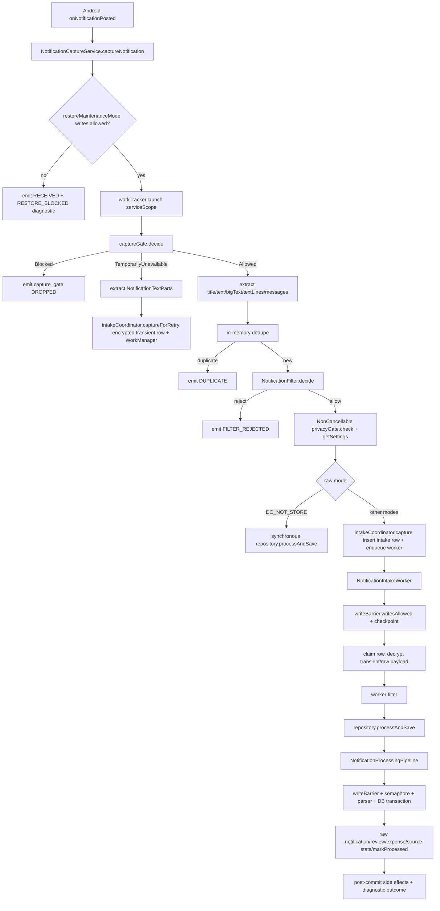

# Pipeline 1 — Notification Capture Debug/Review Report

## 1. Executive verdict

Verdict: RED

Remote static review was performed against pinned commit `83b798e849b4408b2bf683f52cb2746d37f7af16`. I did not find evidence that Pipeline 1 is production-safe. Several tracker items are genuinely fixed, but two high-risk contract failures remain: notification text can be extracted/persisted before the capture gate reaches `Allowed`, and intake/recovery writes can bypass the restore/write barrier. In addition, the worker can decrypt/process queued payloads without re-checking notification privacy/blocked-package state, and worker terminal paths often update `notification_intake` without emitting durable `PipelineDiagnosticEvent`s.

Highest-risk remaining issue: privacy-gate bypass in the gate-not-ready/deferred path plus worker replay without a privacy gate.

Production safety assessment: NOT SAFE for production until P0 privacy and restore-barrier issues are fixed and regression tests pass.

Validation not run:
- `git rev-parse HEAD` — no local checkout.
- `./gradlew testDebugUnitTest` — no local shell.
- `./gradlew assembleDebug` — no local shell.

Line-number caveat: many Kotlin files in the raw view are minified into very long lines; line references below are raw-view line numbers.

## 2. Pipeline flow summary

Actual runtime flow:

Important deviations:
- `TemporarilyUnavailable` extracts text before `Allowed`.
- Worker decrypts before any notification privacy/capture gate.
- `NotificationIntakeCoordinator` writes without its own `DatabaseWriteBarrier`.

## 3. Files reviewed

### Production files reviewed

| File | Role | Notes |
|---|---|---|
| `NotificationCaptureService.kt` | Android listener entry/capture orchestration | Reviewed restore checks, gate, extraction, filter, NonCancellable, privacy settings, dedupe, diagnostics. |
| `NotificationFilter.kt` / `NotificationFilterDecision.kt` | Capture filter | Deposit/failed fixes appear in code; tests are stale. |
| `NotificationCaptureGate.kt` | Pre-extraction gate | Fail-closed mostly, observer retry present; gate-not-ready path is undermined by service extraction. |
| `NotificationTextParts.kt` | Text extraction | Includes `EXTRA_TEXT_LINES` and `EXTRA_MESSAGES`. |
| `NotificationCaptureDeduper.kt` | In-memory dedupe | Atomic TTL cache; cleanup wired on listener connect. |
| `NotificationIntakeCoordinator.kt` | Durable intake insert/enqueue | Major barrier/privacy gaps. |
| `NotificationTransientPayloadCrypto.kt` / key provider | Transient encryption | AES-GCM via Android Keystore. |
| `NotificationIntakeWorker.kt` | Deferred processing | Write barrier present, but privacy gate/diagnostics/run logging incomplete. |
| `NotificationProcessingPipeline.kt` | Parser + raw/review/expense processing | Typed outcomes, write barrier, transaction-local `markProcessed`; some remaining gaps. |
| `NotificationRepository.kt` | Repository facade | Delegates to pipeline; write barrier on mutating repository methods. |
| `NotificationPipelineOutcome.kt` | Outcome model | Sealed typed outcomes exist. |
| `RawNotificationFingerprint.kt` | DB fingerprint | Still uses local `MessageDigest`, contrary to “SHA consolidated” claim. |
| `NotificationIntakeEntity.kt` / `NotificationIntakeStatus.kt` | Intake schema/status ledger | Useful durable status, not a replacement for diagnostics. |
| `NotificationIntakeDao.kt` / `RawNotificationDao.kt` | Intake/raw DAO | IGNORE conflicts, fingerprint indexes, markProcessed. |
| `PipelineDiagnosticEvent*` and `NotificationDiagnosticEmitter.kt` | Diagnostics | Safe fallback emitter exists; not used by worker paths. |
| Architecture docs | Expectations | Checked issue trackers, architecture, dependency map, legal paths, engine map. |

### Test files reviewed

| File | Coverage area | Notes |
|---|---|---|
| `NotificationCaptureServiceCleanupTest.kt` | workTracker, sensitive key set, structural NonCancellable/settings checks | Mostly reflection/structural; does not prove runtime loss prevention. |
| `NotificationCaptureServiceFallbackTest.kt` | fallback expression | Does not call production extractor. |
| `NotificationFilterTest.kt` | filter | Stale: asserts finance packages always capture, contradicts current filter. |
| `NotificationIntakeWorkerTimeoutTest.kt` | timeout vs cancellation | Likely stale: test row is filtered before mocked repository timeout. |
| `DedupeKeyProducerConsistencyTest.kt` | type-aware expense dedupe | Pure policy test. |
| `CancellationPropagationContractTest.kt` | static CE guard | Covers selected files only; misses P1 repairer catch. |
| `LifecycleBarrierContractTest.kt` | static barrier scan | Repository/coordinator-name based; misses `NotificationIntakeCoordinator`. |
| `PrivacyStorageContractTest.kt` | static DO_NOT_STORE checks | Does not catch encrypted transient pre-consent capture. |

### Files not fully reviewed

| File | Reason |
|---|---|
| `AndroidManifest.xml` | Raw web open returned no content in tool. |
| Full `DatabaseMigrations.kt`, exported schemas | Not fully traversed due web/tool limits. |
| `import-graph.json` | Not opened due size/tool limits. |
| Some cross-pipeline DAOs/entities/modules | Only P1-relevant paths were traced statically. |

## 4. Architecture/doc comparison

| Area | Architecture expectation | Actual code | Status |
|---|---|---|---|
| Pinned version | Review commit `83b798e...` only. | Remote commit page shows `83b798e`. | OK |
| Notification segment ownership | Docs map notification listener → intake → worker → pipeline → lifecycle. | Code follows this broad shape. | OK |
| Legal expense path | Notification-created expenses must go through `TransactionLifecycleCoordinator`. | Auto-accept uses `coordinator.createExpenseDbOnlyV2(...)` inside pipeline transaction. | OK |
| Privacy/raw storage | No extraction before notification capture gate `Allowed`; DO_NOT_STORE no raw persisted. | Normal allowed path OK, but gate-not-ready path extracts text and stores encrypted transient payload before allowed decision. Worker later decrypts without gate. | FAIL |
| Restore/write barrier | All DB writes blocked during restore/maintenance. | Service/gate/worker check, but `NotificationIntakeCoordinator`, repairer, and recovery scheduler perform DAO writes without their own barrier. | FAIL |
| Worker guard/logging | Architecture says most workers use guard/run logger; `NotificationIntakeWorker` is allowlisted. | Worker injects `WorkerExecutionGuard` only for `checkpoint`, not `runGuarded`; no run logger/diagnostics for many terminal paths. | YELLOW |
| Diagnostics/drop reasons | Every terminal/drop/retry path should have durable diagnostic/drop reason. | Service/pipeline mostly emit diagnostics; worker pre-pipeline paths only update intake status. | PARTIAL |
| Tracker status | Master says all P1 items fixed. | Code contradicts for privacy, barrier, diagnostics, tests. | DRIFT |
| P1 consolidated issue doc | Still listed some open/partial items. | Some are fixed in code, but some master “fixed” claims are overbroad. | DRIFT |

## 5. Previous issue reconciliation

| Issue ID | P1 doc status | Master status | Actual code status | Evidence | Test coverage | Notes |
|---|---|---|---|---|---|---|
| P1-P1-01 | FIXED | FIXED | FIXED | `NotificationPipelineOutcome.kt` defines sealed outcomes; pipeline returns typed outcomes. | Not deeply behavioral. | No flattening found. |
| P1-P1-02 | FIXED | FIXED | PARTIAL | Service/pipeline emit diagnostics, but `NotificationIntakeWorker.kt` marks filter/payload/max-attempt/failure statuses without `NotificationDiagnosticEmitter`. | Missing worker diagnostic tests. | Durable intake status exists but diagnostic ledger incomplete. |
| P1-P1-03 | FIXED | FIXED | FIXED | `NotificationTextParts.kt` extracts `EXTRA_TEXT_LINES` and `MessagingStyle.Message`. | Fallback test does not call production extractor. | Add direct `NotificationTextParts.extract` tests. |
| P1-P1-05 | FIXED | FIXED | NOT FULLY FIXED | Normal path gates first, but `TemporarilyUnavailable` branch extracts `NotificationTextParts` before allowed gate. | Missing warm-up privacy race test. | Privacy architecture violation. |
| P1-P1-06 | FIXED | FIXED | PARTIAL/FAIL | Pipeline/repository/worker check barriers; intake coordinator/recovery/repairer write without their own barrier. | Static barrier test misses coordinator. | Restore TOCTOU remains. |
| P1-P1-07 | PARTIAL | FIXED | PARTIAL | Post-filter path uses `withContext(NonCancellable)`, but test is structural only; early diagnostic emission still cancellable; coordinator not app-scope/barrier-safe. | Structural reflection only. | Improved, not fully proven. |
| NEW-P1-001 | FIXED | FIXED | MOSTLY FIXED, gaps | Service/pipeline/worker CE guards present; `NotificationIntakePayloadRepairer` catches `Exception` in suspend repair loop without CE rethrow. | Contract test does not cover repairer. | Add P1 repairer to CE contract. |
| NEW-P1-002 | FIXED | FIXED | LIKELY FIXED | Source-link diagnostics deferred post-commit; code documents sourceLinkWriter as DAO write only. | Missing direct failure test. | Could not inspect writer implementation. |
| NEW-P1-003 | OPEN | FIXED | FIXED | workTracker has no `acceptingNewWork`; launch returns `Job`. | Cleanup test. | OK. |
| NEW-P1-004 | OPEN | FIXED | FIXED for null launch; cancellation gap remains | `emitOrderedNotificationEvents` no longer handles nullable job. | Cleanup test only. | Use NonCancellable for terminal diagnostics. |
| NEW-P1-005 | FIXED | FIXED | FIXED | Deposit denied only when no expense signal. | Missing explicit deposit-fee regression in opened test. | Code OK. |
| NEW-P1-006 | FIXED | FIXED | FIXED | `failed` denied only in payment/auth context. | Missing explicit merchant-name “Failed Pizza” regression in opened test. | Code OK. |
| NEW-P1-007 | OPEN | FIXED | UNSAFE/PARTIAL | Gate-not-ready defers, but extracts/persists encrypted payload before `Allowed`; worker lacks gate. | Missing. | Master status overstates fix. |
| NEW-P1-008 | FIXED | FIXED | FIXED | Pipeline uses `Semaphore(4)`. | Not verified perf test. | OK. |
| NEW-P1-009 | BLOCKED/OPEN | FIXED | FIXED for sync path | Service fetches settings once and passes to `processNotification`. | Structural test only. | Worker current-privacy behavior still missing. |
| NEW-P1-010 | OPEN | FIXED | FIXED | `dao.markProcessed(rawId)` inside pipeline transaction branches; worker/repo best-effort removed. | Missing atomic rollback test. | Code appears OK. |
| NEW-P1-011 | OPEN | FIXED | PARTIAL | Service uses shared hashing; `RawNotificationFingerprint.kt` still has local `MessageDigest`. | Missing architecture guard. | P3 cleanup. |
| NEW-P1-012 | FIXED | FIXED | FIXED | `computeDedupeKey` has no postTime parameter. | Not behaviorally tested. | OK. |
| NEW-P1-013 | FIXED | FIXED | FIXED for filter | Filter gets `parts.bigText`, not combined body. | Missing exact regression. | Processing still uses combined body intentionally. |
| NEW-P1-014 | FIXED | FIXED | FIXED | `deduper.cleanupExpired` called on listener connection. | Not much. | OK. |
| NEW-P1-015 | FIXED | FIXED | MOSTLY FIXED | Source-link failures collected/deferred; no throw for review link failure. | Missing rollback/orphan test. | There is still a `check(...)` in insert conflict path, but transaction rollback should protect DB. |
| NEW-P1-016 | OPEN | FIXED | FIXED for listed camelCase | Sensitive key set has camelCase variants and case-insensitive matching. | Cleanup test. | Still exact-key, not substring/pattern matching. |
| NEW-P1-017 | FIXED | FIXED | FIXED | Settings/blocked package observers retry in `while(true)` with CE rethrow. | Missing observer restart test. | OK. |

## 6. New findings

| ID | Severity | Type | Title | File(s) | Evidence | Impact | Reproduction path | Recommended fix | Required tests | Cross-pipeline impact |
|---|---|---|---|---|---|---|---|---|---|---|
| P1-AUD-001 | P0 | Privacy | Gate-not-ready path extracts and persists notification text before capture gate is `Allowed`; worker replays without gate | `NotificationCaptureService.kt`, `NotificationIntakeCoordinator.kt`, `NotificationIntakeWorker.kt`, `NotificationCaptureGate.kt` | Gate contract says no extraction unless allowed; service `TemporarilyUnavailable` branch extracts text and calls `captureForRetry`; coordinator encrypts/stores transient payload; worker decrypts before privacy check. | Raw notification PII can be persisted encrypted and later processed even when notification capture is disabled/fail-closed/blocked. Violates legal privacy path. | Delay/corrupt settings load so `captureGate.decide` returns `TemporarilyUnavailable`; post a bank notification; observe transient ciphertext row created before allowed privacy state. | Do not read `sbn.notification.extras` on `TemporarilyUnavailable`. Store metadata-only retry or drop with retryable diagnostic. Worker must check `NotificationCaptureGate`/`PrivacyGate` before decrypting payload; if blocked, purge payload and terminal-drop with diagnostic. | Cold-start gate-not-ready with capture disabled; fail-closed settings; worker privacy disabled after enqueue; no transient ciphertext created before allowed. | PrivacyGate/RawStorageMode universal contract. |
| P1-AUD-002 | P0 | Restore safety | Intake/recovery/repair writes bypass `DatabaseWriteBarrier` | `NotificationIntakeCoordinator.kt`, `NotificationIntakeRecoveryScheduler.kt`, `NotificationIntakePayloadRepairer.kt`, `NotificationCaptureService.kt` | Coordinator constructor has no barrier; `capture` and `captureForRetry` call DAO insert/enqueue directly. Recovery releases/enqueues rows. Repairer mutates rows. Service/gate checks are TOCTOU only. | DB writes can occur after restore begins, during DB swap/maintenance, risking restore corruption or exceptions. | Start capture while restore mode flips between gate check and intake insert; or listener reconnects during restore and repair/recovery runs. | Inject `DatabaseWriteBarrier` into coordinator, repairer, recovery scheduler; call `checkWritesAllowed` immediately before every DAO mutation and WorkManager enqueue. Emit maintenance-safe diagnostics on blocked writes. | Restore flip race around intake insert; onListenerConnected during restore; repairer during restore. | Backup/restore global contract. |
| P1-AUD-003 | P1 | Diagnostics | Worker terminal/retry/drop paths lack durable diagnostic events | `NotificationIntakeWorker.kt`, `NotificationDiagnosticEmitter.kt` | Worker writes `markTerminal`, `markRetryableFailure`, `markFinalFailure`, purges payload, but does not inject/emit `NotificationDiagnosticEmitter`. Emitter exists with maintenance fallback. | Filter rejection, payload unavailable, max attempts, timeout, retry, final worker failure, write-block retry are not visible in `pipeline_diagnostic_events`. | Enqueue intake row with no payload or filter-rejected content; worker returns success with status only. | Inject emitter; emit terminal/retry diagnostics with safe hashed metadata for every worker exit before/after repository. | Tests for every worker terminal path checking diagnostic emission. | Debug/observability contract. |
| P1-AUD-004 | P1 | Test/build | Opened tests are stale and likely fail against current code | `NotificationFilterTest.kt`, `NotificationIntakeWorkerTimeoutTest.kt` | Filter test asserts finance packages capture empty content; current filter requires amount and rejects no-amount. Worker timeout test uses unknown package/title/text with no amount, so worker filter returns before mocked repository timeout. | `testDebugUnitTest` may fail; regressions cannot be trusted. | Run `./gradlew testDebugUnitTest --tests "*NotificationFilterTest"` and worker timeout test. | Update tests to current filter contract and use transaction-like payload in worker timeout test. | Corrected filter tests; timeout test with `Payment €1.00`. | CI quality. |
| P1-AUD-005 | P2 | Correctness | Deferred retry payload drops `textLines`/messages and uses over-broad deferred fingerprint | `NotificationCaptureService.kt`, `NotificationIntakeCoordinator.kt` | Service passes only title/text/bigText/subText to `captureForRetry`; `combinedBody`, `textLines`, `messages` are lost. Deferred fingerprint is `DEFERRED_${notificationKeyHash}`. | First notification after cold start can lose the only amount/merchant text. Multiple different updates with same Android key can collapse. | MessagingStyle/textLines bank notification arrives while gate not ready. | If deferral is kept, payload must include full `combinedBody` and message/text line fields after allowed privacy state; fingerprint should include content/postTime hash. | Gate-not-ready textLines/messages processing test; same key different postTime/content test. | Parser/dedupe. |
| P1-AUD-006 | P2 | Cancellation | Repairer swallows `CancellationException` in suspend loop | `NotificationIntakePayloadRepairer.kt` | `repairLegacyPlaintextTransientRows` catches `Exception` per row without CE rethrow. | Shutdown/restore cancellation can be delayed or converted into best-effort warning. | Cancel service scope during repair encryption/DAO call throwing CE. | Add `if (e is CancellationException) throw e`; add to contract test. | CE propagation test for repairer. | Universal cancellation contract. |
| P1-AUD-007 | P2 | Diagnostics/lifecycle | Early terminal diagnostics are launched in cancellable service scope | `NotificationCaptureService.kt`, `NotificationDiagnosticEmitter.kt` | `emitOrderedNotificationEvents` uses `workTracker.launch(serviceScope)`; `onDestroy` cancels `serviceJob`; emitter has NonCancellable variants but they are not used here. | Restore-blocked/shutdown-blocked diagnostics can be lost if service is destroyed immediately. | Post notification during restore, immediately destroy service. | Use `emitOrderedNonCancellable` for terminal pre-launch paths or app-scope diagnostics. | Service-destroy diagnostic durability test. | Diagnostics contract. |
| P1-AUD-008 | P3 | Cleanup | SHA-256 consolidation incomplete | `RawNotificationFingerprint.kt`, `NotificationCaptureService.kt` | Service uses shared `sha256`; fingerprint object still constructs `MessageDigest` directly. | Maintenance drift; inconsistent hashing policy risk. | Static grep for `MessageDigest.getInstance("SHA-256")`. | Move fingerprint to shared hashing helper. | Architecture guard. | Cross-pipeline hashing consistency. |

## 7. Universal contract audit

### Restore/write barrier
Status: FAIL.

Evidence:
- Service and capture gate check restore mode before processing.
- Pipeline checks `writeBarrier.checkWritesAllowed`.
- Worker checks `writeBarrier.writesAllowed`.
- `NotificationIntakeCoordinator`, `NotificationIntakeRecoveryScheduler`, and `NotificationIntakePayloadRepairer` perform writes without their own barrier.

Gaps:
- TOCTOU between service/gate check and intake insert.
- Recovery/repair can mutate during restore.
- Restore-blocked worker returns retry without diagnostic.

### Privacy/redaction/raw storage
Status: FAIL.

Evidence:
- Normal allowed path uses capture gate before extraction and snapshots `PrivacySettings`.
- `DO_NOT_STORE` bypasses durable intake and sync-processes sanitized storage.
- Transient payloads are AES-GCM encrypted.
- Gate-not-ready path extracts text before `Allowed`.
- Worker decrypts before current privacy/capture/blocked-package check.

Gaps:
- Pre-consent encrypted transient payload.
- Worker privacy-disabled replay.
- No test for first-notification warm-up with disabled/fail-closed privacy.

### Transaction lifecycle
Status: YELLOW/GREEN.

Evidence:
- Auto-accept uses `TransactionLifecycleCoordinator.createExpenseDbOnlyV2`.
- `markProcessed(rawId)` is inside pipeline transaction branches.
- Source-link diagnostics are deferred post-commit.

Gaps:
- Need rollback tests for source-link failure and insert-conflict exception path.
- Extra AI audit event path should be tested for failure isolation.

### Worker guard/run logging
Status: YELLOW.

Evidence:
- `NotificationIntakeWorker` injects `WorkerExecutionGuard` and calls `checkpoint`.
- Architecture docs note this worker is allowlisted from full guard usage.

Gaps:
- No `runGuarded`/`WorkerRunLogger` rows for intake worker.
- No durable diagnostics for many worker outcomes.
- No privacy gate before decrypt/process.

### Diagnostics/drop reasons
Status: PARTIAL/FAIL.

Evidence:
- Service and pipeline emit diagnostics for many paths.
- `NotificationDiagnosticEmitter` has safe maintenance fallback.
- Worker primarily records status in `notification_intake`.

Gaps:
- Worker filter, payload unavailable, max attempts, retry/final failure, write-block retry lack diagnostic events.
- Early service diagnostics can be cancelled.

### Money/currency normalization
Status: YELLOW.

Evidence:
- Filter requires money signal for finance packages.
- Pipeline fallback detection uses `AmountUtils` and currency resolver comments.
- Duplicate key includes transaction type.

Gaps:
- Pipeline has TODO noting parser fallback currency can cause duplicate false negatives.
- Amount is still `Double` through parser/pipeline path; no full MoneyNormalizationEngine verification in this review.
- Deposit/transfer classification needs behavioral tests.

### DAO conflict/timestamp handling
Status: YELLOW.

Evidence:
- Raw/intake fingerprints use unique indexes and `IGNORE`.
- Pipeline uses `insertRawNotificationIfNotDuplicate`.
- `markProcessed` now transactional.

Gaps:
- Deferred fingerprint uses only notification key hash.
- Some timestamps use `System.currentTimeMillis` for worker ID, though not business timestamp.
- Intake `insertOrIgnore` conflict in `capture` returns dropped without diagnostic.

## 8. Test coverage assessment

| Behavior | Existing test? | Missing test? | Recommended test |
|---|---|---|---|
| Privacy fail-closed before extraction | No | Yes | Gate not ready/fail-closed must not read extras or create transient payload. |
| Worker privacy disabled after enqueue | No | Yes | Enqueue row, disable notification capture, worker purges/drops before decrypting. |
| DO_NOT_STORE no raw persistence | Static only | Yes | Integration test proves no raw/text/transient ciphertext rows. |
| Encrypted transient payload | Partial/implicit | Yes | Verify ciphertext/nonce set and visible fields null; decrypt only after gate. |
| Restore TOCTOU around intake insert | No | Yes | Flip barrier after gate before `insertOrIgnore`; assert no DAO write/enqueue. |
| Worker restore blocked diagnostic | No | Yes | Worker returns retry and emits restore-blocked diagnostic. |
| Service shutdown after filter pass | Structural only | Yes | Runtime cancellation test with fake coordinator proving insert completes. |
| Cancellation propagation | Partial | Yes | Add repairer and `processNotification` raw extras catch. |
| Duplicate notifications | Partial | Yes | DB + in-memory + deferred same-key/different-content cases. |
| Deposit/refund edge cases | Code only | Yes | Deposit fee captured; salary deposit dropped; refund policy explicit. |
| Failed merchant-name edge | Code only | Yes | “Failed Pizza €12.00” captured/reviewed; “payment failed” dropped. |
| `textLines` and messages extraction | Not production-direct | Yes | `NotificationTextParts.extract` with Bundle arrays and MessagingStyle. |
| Worker timeout retry | Existing stale | Fix needed | Use payload that passes filter so repository timeout branch is reached. |
| Diagnostics every terminal outcome | No | Yes | Parameterized terminal path diagnostic assertions. |

## 9. Recommended fix plan

### PR 1 — Critical correctness/privacy/data-safety
1. Remove text extraction from `TemporarilyUnavailable` path. On gate-not-ready, either:
   - store metadata-only retry with no raw content, or
   - wait for bounded self-heal and if still not allowed, emit retry/drop diagnostic without reading extras.
2. Add current privacy/capture/blocked-package check in `NotificationIntakeWorker` before decrypting transient payload.
3. Inject `DatabaseWriteBarrier` into:
   - `NotificationIntakeCoordinator`
   - `NotificationIntakeRecoveryScheduler`
   - `NotificationIntakePayloadRepairer`
4. Check barrier immediately before all intake DAO mutations and WorkManager enqueue.
5. On privacy/restore block, purge payload and emit maintenance-safe terminal diagnostic.

### PR 2 — Worker/retry/diagnostics
1. Inject `NotificationDiagnosticEmitter` into worker.
2. Emit diagnostic for:
   - payload unavailable
   - filter rejected
   - duplicate
   - retryable failure
   - max attempts
   - timeout
   - final failure
   - restore blocked
   - cancellation
3. Use NonCancellable terminal diagnostics where needed.
4. Decide whether `NotificationIntakeWorker` remains allowlisted; if yes, document why and add compensating run logs/diagnostics.

### PR 3 — Tests/regression
1. Fix stale `NotificationFilterTest`.
2. Fix `NotificationIntakeWorkerTimeoutTest` to use payload that passes filter.
3. Add privacy warm-up tests.
4. Add restore barrier race tests.
5. Add worker privacy replay tests.
6. Add `textLines`/messages extraction production tests.
7. Add worker terminal diagnostic tests.
8. Add deferred same-key/different-content dedupe tests.

### PR 4 — Cleanup/docs drift
1. Update P1 consolidated tracker and master tracker to reflect actual status.
2. Consolidate `RawNotificationFingerprint` hashing.
3. Add static guard so non-repository “coordinator/scheduler/repairer” DAO writes require `DatabaseWriteBarrier`.
4. Replace structural-only tests with behavior tests where possible.

## 10. Final production-readiness decision

RED.

Pipeline 1 has made real progress: typed outcomes exist, extraction is richer, normal-path privacy/raw storage is better, transaction-local `markProcessed` is fixed, and legal expense creation routes through the lifecycle coordinator. However, the remaining privacy and restore gaps are high-impact contract violations. A notification can be captured before the gate is allowed, queued payloads can be processed after privacy state changes, and intake/recovery writes can bypass restore safety. Combined with stale tests that likely fail or do not exercise production behavior, this pipeline should not be shipped as production-ready.

## Source links used

- Commit: https://github.com/panospao7/Cost-agregator/commit/83b798e849b4408b2bf683f52cb2746d37f7af16
- P1 issue registry: https://raw.githubusercontent.com/panospao7/Cost-agregator/83b798e849b4408b2bf683f52cb2746d37f7af16/docs/analyses%20and%20debug%20master/PIPELINE_1_CONSOLIDATED_ISSUES.md
- Master tracker: https://raw.githubusercontent.com/panospao7/Cost-agregator/83b798e849b4408b2bf683f52cb2746d37f7af16/docs/analyses%20and%20debug%20master/PIPELINE_ISSUES_MASTER_TRACKER.md
- Universal tracker: https://raw.githubusercontent.com/panospao7/Cost-agregator/83b798e849b4408b2bf683f52cb2746d37f7af16/docs/analyses%20and%20debug%20master/UNIVERSAL_ISSUE_TRACKER.md
- Architecture: https://raw.githubusercontent.com/panospao7/Cost-agregator/83b798e849b4408b2bf683f52cb2746d37f7af16/docs/architecture/ARCHITECTURE.md
- Legal paths: https://raw.githubusercontent.com/panospao7/Cost-agregator/83b798e849b4408b2bf683f52cb2746d37f7af16/docs/architecture/LEGAL_PATHS.md
- Dependency map: https://raw.githubusercontent.com/panospao7/Cost-agregator/83b798e849b4408b2bf683f52cb2746d37f7af16/docs/architecture/DEPENDENCY_MAP.md
- Engine map: https://raw.githubusercontent.com/panospao7/Cost-agregator/83b798e849b4408b2bf683f52cb2746d37f7af16/docs/architecture/ENGINE_INTERACTION_MAP.md
- Core source files under: https://raw.githubusercontent.com/panospao7/Cost-agregator/83b798e849b4408b2bf683f52cb2746d37f7af16/app/src/main/java/com/yourname/expensetracker/
- Tests under: https://raw.githubusercontent.com/panospao7/Cost-agregator/83b798e849b4408b2bf683f52cb2746d37f7af16/app/src/test/java/com/yourname/expensetracker/