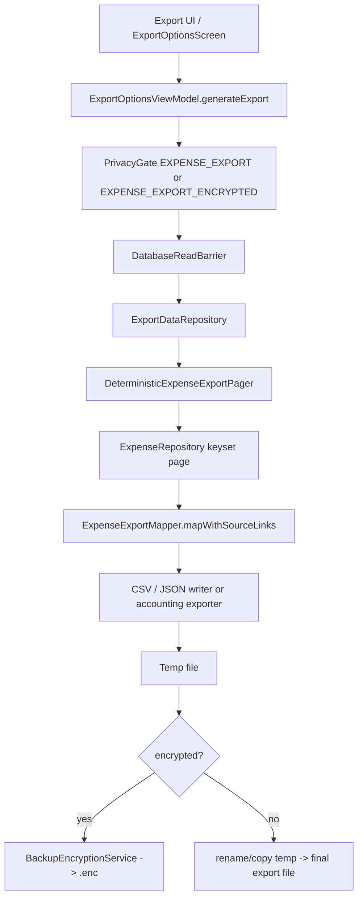
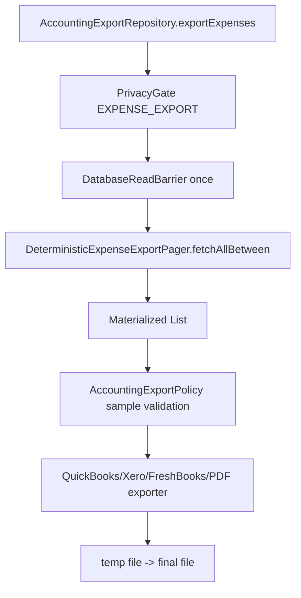

# Pipeline 12 Review — Import / Export / Accounting

Target commit: `83b798e849b4408b2bf683f52cb2746d37f7af16`  
Mode: review only; no code changes.  
Build/test status: **NOT RUN** — browser/API static review only.

Sources used include the P12 issue registry, P12 plan, master tracker, export repository, export ViewModel, accounting exporters, mapper/DTO, pager, and tests at the pinned commit.

---

## 1. Pipeline summary

P12 covers:
- generic CSV export,
- generic JSON export,
- QuickBooks IIF,
- Xero CSV,
- FreshBooks CSV,
- accountant PDF report,
- export privacy gate/encryption hooks,
- restore/read-barrier safety,
- source-link/provenance export,
- claimed import/roundtrip scope.

Main data flow:



Separate older/accounting repository flow:



No real app-level CSV/JSON import pipeline was found in the reviewed tree. The expected files `ImportCoordinator.kt`, `JsonExpenseImporter.kt`, and `CsvExpenseImporter.kt` 404 at the target SHA.

---

## 2. File inventory

| Category | Files reviewed | Why relevant | Notes |
|---|---|---|---|
| P12 docs | `PIPELINE_12_CONSOLIDATED_ISSUES.md`, P12 implementation plan, master tracker | Tracker reconciliation | Registry says P12 has stale/mixed statuses and 15 remaining items; plan says RED with JSON/import/snapshot/privacy gaps. |
| Generic export repository | `ExportDataRepository.kt` | Main export read/file boundary | Has repository-level `DatabaseReadBarrier`, fixed extension sanitation, source-link bulk read, encryption wrapper, and explicit “not true snapshot” warning. |
| Export UI/ViewModel | `ExportOptionsViewModel.kt` | Main runtime path | Handles privacy capability, read barrier, bounded validation, streaming writer, temp cleanup, encryption, JSON/CSV generation. |
| Export paging | `DeterministicExpenseExportPager.kt` | Ordering/large-export behavior | Keyset pagination; explicitly not point-in-time snapshot. |
| Accounting repository | `AccountingExportRepository.kt` | Alternate accounting export path | Uses privacy gate/read barrier, but materializes all rows and catches broad `Exception`. |
| Accounting exporters | `AccountingExporters.kt` | QuickBooks/Xero/FreshBooks output | Uses `ZoneId.systemDefault()` and materialized `List<ExportTransaction>`; comments admit non-streaming/OOM/atomicity concerns. |
| Accounting validation | `AccountingExportPolicy.kt` | Single-currency/purchase-only validation | Validation samples/takes first `maxValidationRows`, not global. |
| DTO/schema | `ExportTransaction.kt` | Export field completeness | Has currency/business/source fields but TODO for receipt links; no `conversionStatus` field. |
| Mapper | `ExpenseExportMapper.kt` | Entity→export DTO mapping | Populates currency audit fields, business fields, source links; finite-number guard. |
| Source-link DTO | `SourceLinkExportRef.kt` | Provenance export | Export-safe source-link representation exists. |
| PDF exporter | `AccountantReportPdfExporter.kt` | Accountant report | Groups by currency; still uses `ZoneId.systemDefault()` and raw per-currency sums only. |
| Domain export folder | `domain/export` tree | Current implementation inventory | No standalone `JsonExporter.kt`, `CsvExporter.kt`, or `IifExporter.kt`; actual files are accounting exporters, mapper, DTO, sanitizer, policy, PDF. |
| Import files | expected `domain/import/*` | Import/roundtrip existence | Expected import files 404 at this SHA. Domain/data trees do not show an import package. |
| Tests | domain export tests, export ViewModel tests, golden CSV sanitizer test | Regression coverage | Export tests exist for sanitizer, CSV escaping, policy, mapper, ViewModel encryption/privacy. |
| Workers | not fully reviewed | P12 worker check | No P12-specific worker located in reviewed P12 files. Run `rg "Export.*Worker|Import.*Worker"` locally to close this. |
| Hilt modules | not fully reviewed | Binding path | ViewModel/repositories are injectable, but full Hilt map was not locally verified. |

Files intentionally skipped:
- full database migrations/schema JSON: no P12 schema change is proposed here.
- full privacy module internals: only P12 runtime privacy calls were reviewed.
- full UI composable: behavior review focused on ViewModel/runtime path.

Files discovered but not fully reviewed:
- all `ExpenseRepository` DAO implementations behind keyset paging.
- read-barrier implementation details.
- FileProvider XML/path config.
- all architecture guard tests.

---

## 3. Architecture comparison

### Legal paths / ownership

P12 export mostly follows the read-only export boundary:
- Generic export reads go through `ExportDataRepository`, which checks `DatabaseReadBarrier` for count, pages, category map, and source links.
- No P12 export code reviewed performs direct expense writes.
- Import lifecycle ownership cannot be validated because no real import pipeline was found.

### Segment 18 export/import ownership

Partial:
- Export exists and is increasingly hardened.
- Import/roundtrip is effectively absent despite pipeline name and tracker scope.
- Snapshot consistency is explicitly not implemented in repository, pager, and ViewModel comments.

### Privacy/security docs

Partial:
- ViewModel uses `EXPENSE_EXPORT` for normal export and `EXPENSE_EXPORT_ENCRYPTED` for encrypted export, and rejects blank passphrases.
- Encrypted ViewModel flow deletes plaintext temp in `finally`.
- AccountingExportRepository uses `EXPENSE_EXPORT`, but has no encrypted accounting-export option and catches broad `Exception`.

### Restore barrier contract

Partial/pass for generic path:
- `ExportDataRepository` read methods are barrier-guarded.
- `ExportOptionsViewModel.loadExpenseCount()` catches `DatabaseAccessBlockedException` and returns restore-specific UX text.
- AccountingExportRepository checks barrier once at operation start, then reads categories through `CategoryRepository` without a per-read barrier in that method.

### Doc/code drift

Significant:
- P12 docs mention `JsonExporter.kt`, `CsvExporter.kt`, `IifExporter.kt`, `AccountingValidation.kt`, `ExportFileManager.kt`. At this SHA, the actual active generic JSON/CSV writer is inside `ExportOptionsViewModel.kt`; accounting IIF/CSV are in `AccountingExporters.kt`; validation is `AccountingExportPolicy.kt`; file creation is in `ExportDataRepository.kt`.
- Consolidated P12 doc says several NEW issues remain open, but code contains later fixes for JSON comma/source links, CSV negative amounts, path extension sanitation, restore-specific count errors, and encryption hooks.

### Misleading/stale TODO/comment

- `ExportTransaction.kt` still has a live TODO for receipt links.
- `AccountingExporters.kt` and ViewModel comments correctly warn that system timezone and snapshot consistency are not fixed.

---

## 4. Runtime flow / call graph

### Generic CSV export

1. `ExportOptionsViewModel.generateExport()`
2. checks passphrase if encrypted.
3. checks `PrivacyGate` with `EXPENSE_EXPORT` or `EXPENSE_EXPORT_ENCRYPTED`.
4. checks `DatabaseReadBarrier`.
5. gets categories/count through `ExportDataRepository`.
6. creates final file handle with sanitized extension.
7. writes hidden temp file.
8. writes CSV metadata/header.
9. streams pages via `getExpensesPage()`.
10. fetches source links per page through repository.
11. maps `Expense` to `ExportTransaction`.
12. writes full generic CSV row.
13. renames temp to final file or encrypts temp to `.enc`.
14. deletes temp in `finally`.

### JSON export

Same path as generic CSV, except:
- header writes schema wrapper with `schemaVersion:2`.
- each page row is manually string-built in `writeJsonPageRows`.
- `sourceLinksJson` is appended as raw JSON for JSON output, not escaped string.
- dates use `ZoneId.systemDefault()`.

### Accounting export through ViewModel

- ViewModel validates only first 10,000 rows before streaming.
- Then streams all pages and writes rows through `XeroCSVExporter`, `QuickBooksIIFExporter`, or `FreshBooksExporter`.
- Exporters themselves accept materialized page lists row-by-row but are called page-by-page by ViewModel.

### AccountingExportRepository path

- Checks privacy/read barrier.
- calls `fetchAllBetween()` and materializes all rows.
- validates sampled subset.
- writes entire accounting output to temp file, then rename/copy.
- catches broad `Exception` and returns `ExportResult`.

### PDF export

- `AccountantReportPdfExporter.export()` filters to purchase by default.
- groups totals by currency and avoids combined mixed-currency total.
- uses device locale/timezone.

### Encrypted export

Only clearly wired in ViewModel:
- blank passphrase fails before repository/file work.
- temp plaintext is hidden and app-private.
- encryptor writes `.enc`.
- partial ciphertext deleted on encryption failure.
- plaintext temp deleted in `finally`.

### Import / roundtrip

No real runtime import flow found. The “roundtrip” golden test is sanitizer-focused and does not import into Room or use transaction lifecycle.

### Diagnostics/events

No durable P12 export/import operation-run event writer was found in reviewed P12 files. Logging is Timber-only in several paths.

---

## 5. Issue table

| ID | Severity | Status | File(s) | Evidence | Impact | Reproduction path | Recommended fix | Required tests | Cross-pipeline impact |
|---|---|---|---|---|---|---|---|---|---|
| P12-OPEN-001 | P0/P1 | TODO | missing import files | `ImportCoordinator.kt`, `JsonExpenseImporter.kt`, `CsvExpenseImporter.kt` return 404; no domain/data import package in tree | Product cannot perform claimed import/roundtrip; no lifecycle/idempotency guarantees. | Search/import UI; try export→import. | Build explicit import coordinator or document import unsupported. | JSON/CSV import, idempotency, lifecycle, conflict, restore-blocked tests. | P2 transaction lifecycle, P3 receipt links, P10/P11 provenance. |
| P12-OPEN-002 | P1 | OPEN | `ExportDataRepository`, `DeterministicExpenseExportPager`, `ExportOptionsViewModel` | All explicitly say keyset pagination is deterministic but not point-in-time snapshot. | Concurrent writes can cause rowCount mismatch/missed/included rows. | Export while inserting/updating/deleting matching expenses. | Snapshot table or read transaction/snapshot DB; otherwise label export “best effort”. | Concurrent insert/update/delete snapshot tests. | All pipelines writing expenses. |
| P12-OPEN-003 | P1 | OPEN/PARTIAL | `AccountingExportPolicy.kt`, `ExportOptionsViewModel.kt` | Validation samples first 10,000 rows; not global. | Invalid currency/type after sample can enter accounting export. | Put mixed-currency/transfer row after row 10,000. | Paginated global validation with capped error collection. | Invalid row after 10,000 fails. | Accounting/tax, P5 currency. |
| P12-OPEN-004 | P2/P1 | OPEN | `AccountingExportRepository.kt` | It calls `fetchAllBetween()` and maps all expenses before writing. | OOM on large accounting/PDF exports. | Export 100k+ rows through AccountingExportRepository. | Stream/paginate accounting repository too. | Large dataset bounded-memory test. | Accounting UI/API if using repository. |
| P12-OPEN-005 | P1 | OPEN | `ExportTransaction.kt`, `ExpenseExportMapper.kt` | DTO has exchange/base/original fields but no `conversionStatus`; mapper cannot report missing/stale/partial conversion. | Export consumers cannot audit conversion quality. | Export multi-currency row with missing/stale rate. | Add/version `conversionStatus` and warnings. | Missing/stale/identity conversion tests. | P5 currency, tax/accounting. |
| P12-OPEN-006 | P1 | OPEN | `ExportTransaction.kt` | Receipt links are TODO and not exported. | Roundtrip/restore loses receipt associations. | Export receipt-created expense. | Add receipt-link read/model/schema fields. | Receipt link JSON/CSV export tests. | P3/P11 receipt lifecycle. |
| P12-OPEN-007 | P1 | PARTIAL | generic writer, accounting exporters | Generic CSV/JSON include many fields, but accounting exporters only include narrow field sets; no shared/not-mine, receipt links, conversionStatus. | Silent field loss in accounting outputs. | Export shared/business/tax/receipt expense to Xero/FreshBooks/IIF. | Field coverage matrix; versioned schema; document accounting N/A fields. | DTO-field coverage tests. | P2/P5/P6/P3. |
| P12-OPEN-008 | P2 | OPEN | `AccountingExporters.kt`, `ExportOptionsViewModel.kt`, `AccountantReportPdfExporter.kt` | Machine-readable dates use `ZoneId.systemDefault()`; comments call this nondeterministic. | Same row can export different accounting date across devices/timezones. | Near-midnight UTC expense, run export under two timezones. | UTC or declared configured timezone in manifest. | Timezone determinism tests. | Tax/accounting, analytics. |
| P12-OPEN-009 | P2 | OPEN | `AccountingExportRepository.kt` | Outer `catch (e: Exception)` wraps cancellation into `ExportResult`. | Cancellation may be misclassified as normal failure and parent cancellation swallowed. | Cancel coroutine during accounting export. | Catch/rethrow `CancellationException` before `Exception`. | Cancellation propagation + temp cleanup tests. | Worker/background if added. |
| P12-PARTIAL-010 | P2 | PARTIAL | `ExportOptionsViewModel.kt` | `catch (CancellationException)` sets UI state but does not rethrow. | Possibly acceptable user cancel, but violates “do not swallow CancellationException” contract for structured cancellation. | Cancel export job externally. | If user-initiated cancel, document; otherwise rethrow after cleanup. | Cancel path tests. | UI/worker consistency. |
| P12-PARTIAL-011 | P2 | PARTIAL | `AccountingExportRepository.kt` | It checks read barrier once, then category flow read is not explicitly barrier-checked in that method. | Restore could start after initial check; category read may not be fenced. | Start restore after expenses read before category read. | Route category reads through barrier-checked export repository method or recheck barrier before every export read. | Barrier race/category read test. | P7 restore/backup. |
| P12-FIXED-012 | P1 | FIXED_SOURCE | `CsvCellSanitizer.kt`, tests | Sanitizer preserves plain negative numbers and neutralizes formula prefixes; tests cover negative and formula cases. | Prevents corrupted negative numbers/CSV injection. | `-15.50`, `-2+3+cmd`. | Keep tests. | Accounting export. |
| P12-FIXED-013 | P1 | FIXED_WITH_TEST_GAP | `ExportOptionsViewModel.kt` | JSON active writer includes comma after nullable fields and raw sourceLinks JSON append. | Old invalid JSON/double-escape likely fixed. | Export null notes/source/sourceLinks. | Add parser tests for full file and multi-page output. | Import/roundtrip. |
| P12-FIXED-014 | P2 | FIXED_SOURCE | `ExportDataRepository.kt` | `createExportFile()` sanitizes extension and uses fixed `expenses_timestamp.ext` under app-private exports dir. | Path traversal via extension mitigated. | Pass `../../db` as extension. | Add canonical-parent assertion test. | Privacy/export. |
| P12-FIXED-015 | P3 | FIXED_SOURCE | `ExportOptionsViewModel.kt` | `loadExpenseCount()` has restore-specific catch/message. | UX clearer during restore. | Count during restore. | Add unit test. | P7 restore UX. |
| P12-DRIFT-016 | P3 | TRACKER_DRIFT | docs vs code | P12 doc/plan still names absent files and old open issues. Actual active writers moved into ViewModel/export domain. | Future agents chase stale files. | `rg JsonExporter`. | Update docs/tracker. | Maintainers. |
| P12-TEST-017 | P2 | NEEDS_VERIFICATION | `ExpenseExportMapperTest.kt`, `ExpenseExportMapper.kt` | Test appears to expect shared 25% to affect `result.amount`, but mapper sets `amount = expense.amount` and `effectiveAmount = expense.effectiveAmount`. | Test/source/schema semantics may be inconsistent. | Run `*ExpenseExportMapperTest*`. | Decide: amount=original and effectiveAmount=share, or amount=effective. Fix test/schema. | Shared expenses, accounting. |

---

## 6. Universal contract audit

### Restore/read/write barrier — **PARTIAL**

Evidence:
- Generic export repository methods check `DatabaseReadBarrier` with `EXPORT_OR_BACKUP_SNAPSHOT_READ` for expenses, count, pages, category map, and source links.
- ViewModel also checks read barrier before export.
- AccountingExportRepository checks read barrier once before operation.

Gaps:
- AccountingExportRepository category read is not visibly routed through a barrier-checked export boundary.
- Snapshot consistency is not provided.

### Privacy/redaction/encryption — **PARTIAL**

Pass:
- ViewModel normal export uses `EXPENSE_EXPORT`, encrypted export uses `EXPENSE_EXPORT_ENCRYPTED`, blank passphrase fails closed.
- Tests cover real gate routing and encrypted temp cleanup.

Gaps:
- AccountingExportRepository has no encrypted export variant.
- No redacted export mode found.
- Plaintext default remains possible by design.

### Lifecycle ownership — **FAIL for import / PASS for export**

- Export is read-only.
- No app import coordinator found, so import-created expenses cannot be proven to go through `TransactionLifecycleCoordinator`.

### Worker guard/run logging — **NOT APPLICABLE / NEEDS_RG**

No P12 worker reviewed. Required local verification:

```bash
rg -n "class .*Export.*Worker|class .*Import.*Worker|enqueue.*Export|enqueue.*Import" app/src/main app/src/test
```

### Money/currency normalization — **PARTIAL**

Pass:
- Export DTO includes original/home/base/exchange fields.
- PDF avoids combined mixed-currency totals and groups by currency.

Gaps:
- No `conversionStatus`.
- No stale/missing-rate state.
- Accounting exporters validate single original currency but do not expose normalized conversion quality.

### Diagnostics/events — **PARTIAL/FAIL**

- Timber logs exist.
- No durable export/import run ledger or diagnostic event writer found in reviewed P12 files.
- Cancellation may be swallowed in AccountingExportRepository.

### Import/export/backup — **PARTIAL**

- Export exists and is fairly hardened.
- Import/roundtrip is absent.
- Backup encryption service is reused for encrypted export in ViewModel, but accounting repository does not expose encryption.

### DAO conflict/timestamps — **NOT APPLICABLE for export / FAIL for import**

- Export does not mutate.
- Import conflict/idempotency cannot be audited because no import implementation exists.

---

## 7. P12 issue reconciliation

| Tracker issue | Tracker status | Code status at target SHA | Evidence | Final status | Notes |
|---|---|---|---|---|---|
| P12-P0-01 No app-level CSV/JSON import roundtrip | TODO | No import coordinator/importer found | Expected import files 404; no import package in tree | TODO / OPEN | Highest release-scope gap if import is advertised. |
| P12-P1-01 Xero/FreshBooks CSV escaping | Fixed | Sanitizer and tests exist | RFC-4180 sanitizer; CSV tests | FIXED | Keep parser/golden tests. |
| P12-P1-02 Accounting validation per-page/sample | Partial | Still sample-based | `take(maxValidationRows)` / first 10k only | OPEN/PARTIAL | Needs global paginated validation. |
| P12-P1-03 Multi-currency fields incomplete | Partial | Currency fields present, status missing | DTO has fields but no conversion status | PARTIAL | Add `conversionStatus`. |
| P12-P1-04 Snapshot consistency not real | TODO | Explicitly not implemented | Comments in repo/pager/ViewModel | OPEN | Design issue. |
| P12-P1-05 Plaintext/not privacy-gated | TODO/PARTIAL | Privacy gate/encryption now wired in ViewModel; accounting repo gated only | ViewModel gate/encryption; accounting gate | PARTIAL / TRACKER_DRIFT | Remaining: accounting encryption/redaction/default plaintext policy. |
| P12-P1-06 Dropped app fields | TODO | Generic export improved; accounting still drops fields | Generic header has many fields; DTO missing receipt/shared flags | PARTIAL | Needs field matrix. |
| P12-P1-07 Receipt links not exported | TODO | Still TODO in DTO | DTO comment says receipt links not exported | OPEN | P1 if roundtrip claimed. |
| P12-P1-08 Business/tax fields not exported | Partial | Generic CSV/JSON includes; accounting formats omit most | DTO has fields; tests cover generic JSON/CSV | PARTIAL | Accounting exporters need documented field mapping/N/A. |
| P12-P1-09 PDF raw mixed-currency total | Fixed | Groups by currency | PDF writes per-currency totals and no combined total | FIXED | Timezone remains P2. |
| P12-P1-10 Export during restore | Partial | Mostly fixed for generic export and repository reads | Barriers in `ExportDataRepository`; specific count message | FIXED/PARTIAL | Accounting per-read barrier gap remains. |
| NEW-P12-001 Invalid JSON null comma | Open in old plan | Active writer appears fixed | Nullable fields append comma before next field | FIXED_WITH_TEST_GAP | Need full JSON parser/multi-page test. |
| NEW-P12-002 sourceLinksJson double-escaped | Open in old plan | Fixed for JSON active writer | Raw append of prebuilt JSON in JSON output | FIXED_WITH_TEST_GAP | Need source-link golden test. |
| NEW-P12-003 negative amount corrupted | Open in old plan | Fixed and tested | Plain-number exception; tests | FIXED | Good. |
| NEW-P12-004 path traversal | Open in old plan | Fixed for extension/path pattern | Sanitizes extension, fixed file name | FIXED_WITH_TEST_GAP | Add canonical path test. |
| NEW-P12-005 validation OOM | Open | Still open in accounting repository; ViewModel bounded but sample-only | `fetchAllBetween`; sample validation | OPEN | P1/P2. |
| NEW-P12-006 generic restore count error | Open | Fixed in ViewModel | Specific catch/message | FIXED_WITH_TEST_GAP | Add test. |
| NEW-P12-007 sanitizeIif leading dash | Open in old plan | Fixed as safe neutralization | Tests expect neutralization of leading dash text | FIXED / POLICY_DECISION | It preserves data with leading `'`, not raw. |

---

## 8. Test coverage review

Existing tests found:
- `CsvCellSanitizerNegativeAmountTest.kt`: proves negative numeric values are preserved and formula-like values are neutralized.
- `CsvEscapingTest.kt`: proves Xero/FreshBooks CSV escaping and QuickBooks IIF delimiter/formula sanitization.
- `AccountingExportPolicyTest.kt`: proves small mixed-currency and non-purchase datasets fail.
- `ExpenseExportMapperTest.kt`: proves payment-method label derivation and attempts shared expense mapping, but may conflict with mapper semantics.
- `ExportOptionsViewModelTest.kt`: covers generic CSV/JSON preview, business fields, accounting policy failures, privacy gate routing, encrypted passphrase and cleanup.
- `CsvExportImportRoundtripGoldenTest.kt`: despite its name, only verifies sanitizer roundtrip, not app export→import→DB roundtrip.

Missing or weak tests:
- No true import/roundtrip DB test.
- No source-link JSON parser test.
- No receipt-link export test.
- No JSON full-file parser test for multi-page output.
- No snapshot concurrent write test.
- No timezone determinism test.
- No global accounting validation test beyond 10,000 rows.
- No AccountingExportRepository cancellation propagation test.
- No AccountingExportRepository large dataset bounded-memory test.
- No conversionStatus export test.
- No redacted export test.
- No durable diagnostics/event tests.

Weak tests:
- JSON ViewModel test checks preview substrings, not parsing the full output with `JSONObject`.
- Accounting policy tests are small-list only and do not assert sample-limit behavior.
- “Roundtrip” golden test name is misleading because it does not import expenses.

---

## 9. Test plan

### Unit tests

```bash
./gradlew :app:testDebugUnitTest --tests "*CsvCellSanitizer*" --stacktrace
./gradlew :app:testDebugUnitTest --tests "*CsvEscaping*" --stacktrace
./gradlew :app:testDebugUnitTest --tests "*AccountingExportPolicy*" --stacktrace
./gradlew :app:testDebugUnitTest --tests "*ExpenseExportMapper*" --stacktrace
./gradlew :app:testDebugUnitTest --tests "*ExportOptionsViewModel*" --stacktrace
```

### Regression tests to add

| Test | Purpose |
|---|---|
| `jsonExport_parsesWithNullFieldsAndMultiplePages` | Parse full generated JSON with null notes/source and page boundary comma. |
| `jsonExport_sourceLinksAreNestedJsonNotStringEscaped` | Assert `sourceLinks` is a JSON array. |
| `accountingValidation_detectsInvalidRowAfter10000` | Prove global validation. |
| `accountingRepository_doesNotMaterializeAllRows` | Bounded memory/page-by-page behavior. |
| `exportSnapshot_consistentUnderConcurrentInsertUpdateDelete` | Prove snapshot or document failure. |
| `exportDates_areDeterministicAcrossTimezones` | Catch `ZoneId.systemDefault()` drift. |
| `exportIncludesConversionStatus` | Conversion audit field. |
| `exportIncludesReceiptLinks` | Receipt lifecycle roundtrip. |
| `importCreatedExpenseUsesTransactionLifecycle` | Prevent direct DAO bypass. |
| `reimportSameFileIsIdempotent` | Prevent duplicate money records. |
| `accountingExportCancellationPropagates` | Do not swallow `CancellationException`. |
| `genericAndAccountingExportBlockedDuringRestore` | Barrier coverage including category/source-link reads. |
| `redactedExportExcludesSensitiveRawFields` | Privacy/redaction if feature exists. |

### Integration tests

- Seed Room DB with:
  - receipt-created expense,
  - notification-created expense,
  - bank/import-created expense,
  - shared/not-mine expense,
  - multi-currency expense with missing/stale/exact rate,
  - business/tax fields,
  - source links and receipt links.
- Export JSON/CSV.
- Parse output.
- If import implemented, import into empty DB through legal lifecycle and compare supported fields.

### Manual validation scenarios

- Export 100k rows.
- Export during restore mode.
- Export while a new expense is inserted mid-export.
- Run export under UTC and non-UTC timezone.
- Open Xero/FreshBooks CSV in spreadsheet and verify formula neutralization.
- Try encrypted export with blank, weak, and non-blank passphrase.
- Verify temp plaintext files are removed after success/failure/cancel.

---

## 10. Optional deliverables

### Export schema field-coverage matrix

| Source field / concept | DTO | Generic JSON | Generic CSV | Xero/FreshBooks | QuickBooks IIF | PDF | Status |
|---|---:|---:|---:|---:|---:|---:|---|
| id | yes | yes | yes | ref only | no/id absent | no | partial |
| date/timestamp | yes | yes | yes | yes | yes | yes | pass |
| createdAt | yes | yes | yes | no | no | no | partial |
| merchant | yes | yes | yes | yes | yes | yes | pass |
| notes | yes | yes | yes | no | memo yes | no | partial |
| category name | via map | yes | yes | yes | yes | yes | pass |
| amount | yes | yes | yes | yes | yes | yes | pass |
| effectiveAmount | yes | yes | yes | no | no | PDF uses effective | partial |
| originalCurrency/originalAmount | yes | yes | yes | yes | no | no | partial |
| base/home amount/currency | yes | yes | yes | home yes, base amount no | no | no | partial |
| exchangeRateUsed | yes | yes | yes | conversion rate yes | no | no | partial |
| conversionStatus | no | no | no | no | no | no | fail |
| transactionType | yes | yes | yes | validation only | validation only | default purchase filter | partial |
| paymentMethod/sourceAccountName | yes | yes | yes | no | account yes | no | partial |
| source | yes | yes | yes | no | no | no | partial |
| source links | yes | yes | flat JSON string | no | no | no | partial |
| receipt links | no | no | no | no | no | no | fail |
| business/tax fields | yes | yes | yes | no | no | no | partial |
| shared/not-mine flags | no | no | no | no | no | no | fail |
| import/roundtrip support | no | no | no | no | no | no | fail |

### Privacy/encryption table

| Path | Privacy capability | Encryption option | Temp cleanup | Remaining gap |
|---|---|---|---|---|
| `ExportOptionsViewModel` normal | `EXPENSE_EXPORT` | optional | yes | plaintext default, no redacted mode found |
| `ExportOptionsViewModel` encrypted | `EXPENSE_EXPORT_ENCRYPTED` | yes, nonblank passphrase | yes | cancellation rethrow policy unclear |
| `AccountingExportRepository` | `EXPENSE_EXPORT` | no | temp cleanup on inner failure | no encrypted path; broad `Exception` catch |

### Legal read/write path table

| Operation | Legal path | Current path | Verdict |
|---|---|---|---|
| Generic export expense read | barrier-checked export repository | `ExportDataRepository -> pager -> ExpenseRepository` | PASS |
| Generic export source-link read | barrier-checked export repository | `ExportDataRepository.getSourceLinksForExpenses` | PASS |
| Generic export category read | barrier-checked export repository | `ExportDataRepository.getCategoryNameMap` | PASS |
| Accounting export expense read | barrier-checked repository path | `AccountingExportRepository -> pager` after one barrier | PARTIAL |
| Accounting export category read | barrier-checked export path | `CategoryRepository.allCategories.first()` after initial barrier | PARTIAL |
| Import expense write | transaction lifecycle coordinator | no implementation found | FAIL/TODO |

### Safe PR split

1. **PR1 — Remaining correctness tests/docs drift**
   - Parser tests for JSON/sourceLinks.
   - Fix docs referring to missing files.
2. **PR2 — Global accounting validation + streaming accounting repository**
   - Paginated validation; no all-row materialization.
3. **PR3 — Conversion status + field matrix**
   - Add `conversionStatus`; document unsupported fields.
4. **PR4 — Receipt links + source-link schema tests**
   - Export receipt links.
5. **PR5 — Snapshot consistency**
   - Snapshot table or explicit non-snapshot UI/schema contract.
6. **PR6 — Import roundtrip**
   - Import coordinator through transaction lifecycle.
7. **PR7 — Timezone policy**
   - UTC/configured timezone; schema manifest.
8. **PR8 — Cancellation/privacy parity**
   - Rethrow cancellation; accounting encryption/redaction parity.

---

## 11. Final verdict

**RED** for the full P12 pipeline.

Why:
- The pipeline is named Import / Export / Accounting, but no real app-level CSV/JSON import/roundtrip pipeline was found.
- Snapshot consistency is explicitly not implemented.
- Accounting validation is sample-limited and can miss invalid rows after the first 10,000.
- Accounting repository still materializes all rows and can OOM.
- Receipt links and conversion status are absent.
- Timezone determinism is unresolved.
- Cancellation handling is not fully contract-safe.

Highest-risk remaining issue:
1. **No real import/roundtrip pipeline** if product claims import support.
2. **No true snapshot consistency** for export data integrity.
3. **Sample-only accounting validation** that can produce invalid accounting files.

Production safety:
- **Generic export is likely usable with caveats**: privacy-gated, barrier-checked, streaming, temp-file based, and many format bugs appear fixed.
- **Full P12 is not production-safe as GREEN** because import, snapshot consistency, receipt-link roundtrip, and accounting global validation remain unresolved.

Must fix before GREEN:
- implement or explicitly de-scope import;
- implement snapshot semantics or document best-effort export clearly;
- make accounting validation global and paginated;
- add conversion status and receipt links;
- define deterministic timezone policy;
- close cancellation and accounting encryption/privacy parity gaps;
- add parser/concurrency/roundtrip tests.