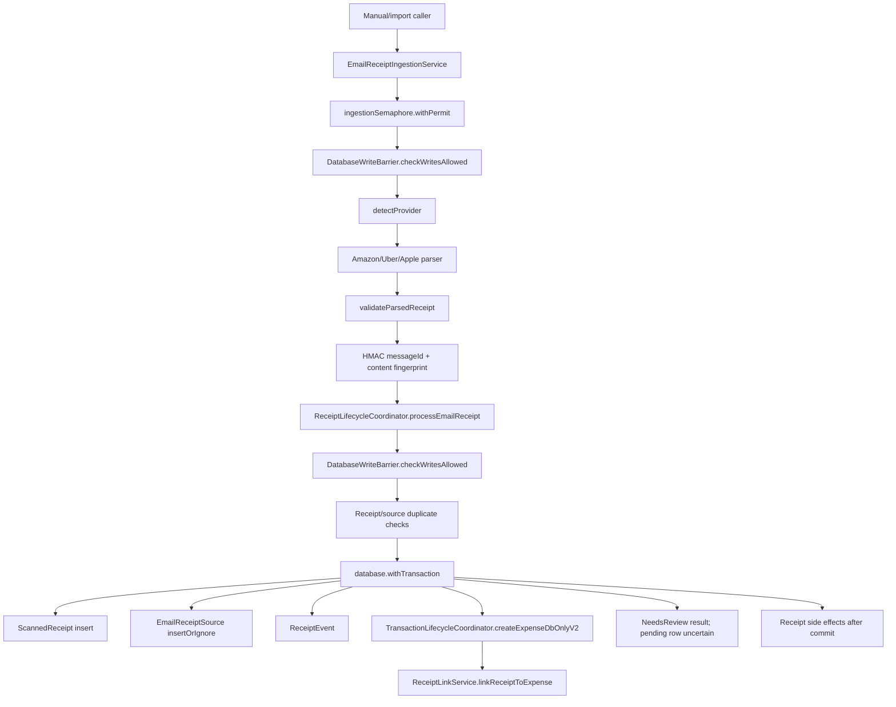

# Pipeline 11 — Email Receipt Ingestion Master Implementation Plan

## 1. Executive summary

Current state: Pipeline 11 is partially hardened at commit `83b798e849b4408b2bf683f52cb2746d37f7af16`. The email ingestion service is mostly a parser/delegate layer, receipt/expense mutations flow through `ReceiptLifecycleCoordinator`, and the reviewed service/coordinator paths use `DatabaseWriteBarrier`. However, tracker/docs overstate several fixes.

Build/test status: **NOT RUN**

Reason:
- This plan is based on remote static review.
- No local checkout/terminal was available for `git rev-parse HEAD`, `rg`, or Gradle.

Static review completed: **yes, partial source-backed review**

Key source evidence:
- `EmailReceiptIngestionService.kt`: main entrypoint; uses semaphore, barrier, diagnostics, provider detection, batch processing.
- `ReceiptLifecycleCoordinator.kt`: owns email receipt mutation, source insert, receipt creation, expense creation/link, side effects.
- `EmailReceiptSource.kt`: unique index only on nullable `emailMessageId`; hashes/fingerprint indexed but not unique.
- `ScannedReceipt.kt`: comments state fingerprint fields are not unique and application-level dedupe races can insert duplicates.
- `AmazonReceiptParser.kt`, `UberReceiptParser.kt`, `AppleReceiptParser.kt`: parser-specific fixes appear partly present.
- `EmailReceiptPersistencePayload.kt`, `RawPersistencePolicyResolver.kt`: privacy contracts exist but reviewed coordinator path manually implements storage mode.

Production risk:
- **P1:** concurrent ingestion in privacy modes that do not store raw `emailMessageId` can create duplicate receipts/expenses because DB uniqueness is not on `emailMessageIdHash` or fingerprint.
- **P1:** provider detection in `EmailReceiptIngestionService.detectProvider()` still has broad body/sender fallback and can bypass narrowed parser `canParse()` behavior.
- **P1/P2:** low-confidence email receipts return `NeedsReview`, but reviewed email path does not visibly create a durable `PendingReview` row.
- **P2:** `processBatch()` is sequential despite the tracker claiming bounded concurrency was fixed.
- **P2:** raw-storage policy is implemented manually instead of through `EmailReceiptPersistencePayload`; drift risk remains.
- **P2:** exception logging around email create errors may leak sensitive details.

Implementation strategy:
1. Verify exact commit and build/test baseline.
2. Fix provider false-positive and durable review-route issues first.
3. Fix race-safe dedupe with a minimal approved schema/migration or equivalent claim table.
4. Align privacy write path with `EmailReceiptPersistencePayload`.
5. Make batch concurrency truthful and tested.
6. Add architecture/static guards and update stale docs only after tests pass.

Recommended verdict before implementation: **RED / high YELLOW**.

---

## 2. Scope

### In scope

- Email ingestion service entrypoint and batch path.
- Provider detection and Amazon/Uber/Apple parser precision.
- Receipt lifecycle integration for email receipts.
- Low-confidence review routing.
- Email source dedupe keys, insert conflicts, and concurrent idempotency.
- Raw email storage mode and diagnostics.
- Restore/write barrier for email writes.
- P11 tests and architecture guards.
- P11 docs/tracker sync.

### Out of scope

- Broad rewrite of receipt lifecycle.
- New email provider/sync implementation unless discovered by `rg`.
- UI redesign except tests/changes needed to surface `PendingReview`.
- New WorkManager email worker unless one already exists.
- Schema migration unless approved for dedupe uniqueness.
- Changes to generic receipt OCR behavior unless needed for email source correctness.

### Assumptions

- Pipeline 11 means **Email Receipt Ingestion**.
- Code at the pinned SHA is source of truth.
- `ReceiptLifecycleCoordinator` remains the legal receipt/expense mutation owner.
- Email ingestion service should stay parser/delegate-only.
- Raw email body/subject/sender/messageId are sensitive.
- Duplicate email-created expenses are P0/P1 risk.
- If DB uniqueness is needed, a Room migration and schema export are required and must be explicitly included.

### Stop conditions

Stop before editing if:
- `git rev-parse HEAD` differs from target SHA.
- baseline `:app:assembleDebug` fails for unrelated reasons.
- local `rg` finds a different email ingestion path not included in this plan.
- dedupe race fix requires schema migration and migration approval is not granted.
- low-confidence review ownership is already implemented in a caller not seen in static review; update plan before code changes.
- any fix would move receipt/expense mutation out of `ReceiptLifecycleCoordinator`.

---

## 3. Source/doc reconciliation

| Area / Issue | Pipeline doc claim | Master tracker claim | Source-code truth | Status | Evidence |
|---|---|---|---|---|---|
| P11-P1-01 duplicate fingerprint too coarse | Partial/fixed-ish | Unknown | Service fingerprint includes provider, merchant, rounded amount, currency, sender domain, hour bucket, order number. But DB unique constraints do not enforce hash/fingerprint uniqueness. | PARTIALLY_FIXED | `EmailReceiptIngestionService.createFingerprint`; `EmailReceiptSource` indexes; `ScannedReceipt` comments. |
| P11-P1-02 duplicate/failure handling | Partial/fixed | Unknown | Duplicate result paths exist, non-duplicate failures emit errors; low-confidence/review path needs durable row verification. | PARTIALLY_FIXED | `ReceiptLifecycleCoordinator.processEmailReceipt`. |
| P11-P1-03 service partially uses lifecycle | Fixed | Unknown | Reviewed service delegates mutations to coordinator and does not directly write receipt/expense DAOs. | FIXED_NEEDS_RG | `EmailReceiptIngestionService.processEmailReceipt`. |
| P11-P1-04 raw email fields wrong policy | Partial | Unknown | Coordinator uses `emailReceiptStorageMode`, not OCR mode, but manually implements policy instead of `EmailReceiptPersistencePayload`. | PARTIALLY_FIXED | `ReceiptLifecycleCoordinator.processEmailReceipt`; `EmailReceiptPersistencePayload`. |
| P11-P1-05 restore barrier incomplete | Partial/fixed | Unknown | Service and coordinator both call `DatabaseWriteBarrier`. | FIXED_NEEDS_RG | service/coordinator barrier calls. |
| P11-P1-06 source insert conflicts ignored | Partial | Unknown | `insertOrIgnore()` result is checked; conflict lookup exists, but hash/fingerprint are not unique so races still pass. | PARTIALLY_FIXED | `EmailReceiptDao.insertOrIgnore`; `EmailReceiptSource` indexes. |
| P11-P1-07 side effects skipped/double dispatched | Fixed | Unknown | Service does not dispatch; coordinator runs post-commit side effects once. | FIXED_NEEDS_TEST | `PostCommitActionRunner` usage in coordinator. |
| P11-P1-08 no pending-review route | Fixed | Unknown | Coordinator returns `NeedsReview`; reviewed path does not insert `PendingReview`. | PARTIALLY_FIXED | `EmailReceiptProcessResult.NeedsReview` branch. |
| NEW-P11-001 ingestion mutex blocks batch | Fixed | Unknown | Semaphore exists, but `processBatch()` sequentially maps. | PARTIALLY_FIXED | `EmailReceiptIngestionService.processBatch`. |
| NEW-P11-002 Amazon `canParse()` broad | Fixed | Unknown | Amazon parser narrowed, but service fallback can force Amazon on body/sender substring. | PARTIALLY_FIXED | `AmazonReceiptParser.canParse`; `detectProvider`. |
| NEW-P11-003 Uber `canParse()` broad | Fixed | Unknown | Uber parser narrowed, but service fallback can force Uber on body/sender substring. | PARTIALLY_FIXED | `UberReceiptParser.canParse`; `detectProvider`. |
| NEW-P11-004 date formatter allocation | Fixed | Unknown | Base parser uses cached formatter list. | FIXED_NEEDS_TEST | `BaseEmailParser` / parser formatter cache. |
| NEW-P11-005 Amazon regex double escaped | Fixed | Unknown | Regex appears corrected in raw strings. | FIXED_NEEDS_TEST | `AmazonReceiptParser` patterns. |
| P11-FIND-A service provider fallback too broad | Not explicit | N/A | Body-only markers can bypass parser `canParse()`. | OPEN | `EmailReceiptIngestionService.detectProvider`. |
| P11-FIND-B low-confidence review row missing | Not explicit | N/A | `NeedsReview` returned, but no reviewed `PendingReviewDao.insert`. | OPEN/NEEDS_VERIFICATION | coordinator email path. |
| P11-FIND-C privacy payload not used | Not explicit | N/A | Contract exists but not used in coordinator. | PARTIAL | `EmailReceiptPersistencePayload`. |

Existing tests: **NEEDS_VERIFICATION**

Run:
```bash
rg -n "EmailReceipt|EmailIngestion|AmazonReceipt|UberReceipt|AppleReceipt|EmailDate|processEmailReceipt|emailStorageMode|messageId|fingerprint|NeedsReview" app/src/test app/src/androidTest
```

---

## 4. Architecture contracts for this pipeline

| Contract | Required legal path | Current code | Gap | Fix required |
|---|---|---|---|---|
| Email service boundary | service parses/validates/delegates only; no direct receipt/expense DAO writes | Reviewed service delegates to coordinator. | Full source RG needed. | Add architecture guard for no direct `ExpenseDao`/`ScannedReceiptDao` in email service. |
| Receipt lifecycle ownership | `ReceiptLifecycleCoordinator` owns receipt/source/expense/link/event mutations | Present. | Low-confidence review queue not durably created in reviewed email branch. | P11-WI-004. |
| Transaction lifecycle ownership | email-created expenses go through transaction lifecycle | Coordinator uses `TransactionLifecycleCoordinator.createExpenseDbOnlyV2`. | Need tests for high-confidence path. | Add integration test. |
| Restore barrier | every write path checks `DatabaseWriteBarrier` | Service and coordinator do. | Alternate paths unknown. | RG + guard test. |
| Dedupe/idempotency | repeated/concurrent same email cannot create duplicate receipt/expense | App-level checks exist. | DB uniqueness not on privacy-safe keys; race remains. | P11-WI-003 with migration or claim mechanism. |
| Raw storage | email-specific mode at write time | `emailReceiptStorageMode` used manually. | Payload contract not used; drift risk. | P11-WI-005. |
| Diagnostics | no raw body/sender/subject/messageId; sanitized metadata; CE rethrow | Service diagnostics use hashed values and SafeEventMetadata. | Some `Timber.w(exception)` risk; full log RG needed. | P11-WI-006. |
| Batch concurrency | if claimed bounded concurrency, actual batch must parallelize with cap | Semaphore exists. | `processBatch()` sequential. | P11-WI-002. |
| Worker guard | if email worker exists, use P9 guard | No worker reviewed. | Needs RG. | P11-WI-011 if found. |
| Backup/export | email source table/raw fields preserved/redacted appropriately | Unknown. | Need P7/P12 verification. | P11-WI-010. |

### Direct DAO mutation inventory

Preliminary; full inventory requires local `rg`.

| DAO method | SQL mutation? | Caller(s) | Legal owner? | Barrier? | Audit event? | Classification | Fix |
|---|---:|---|---|---|---|---|---|
| `EmailReceiptDao.insertOrIgnore` | yes | `ReceiptLifecycleCoordinator.processEmailReceipt` | Receipt lifecycle coordinator | yes | receipt event/diagnostic | LEGAL/PARTIAL | Add unique hash/fingerprint or claim. |
| `ScannedReceiptDao.insert*` | yes | `ReceiptLifecycleCoordinator` | Receipt lifecycle coordinator | yes | receipt event | LEGAL | Guard no email service direct calls. |
| `ExpenseDao` via transaction lifecycle | yes | `TransactionLifecycleCoordinator` from coordinator | Transaction lifecycle owner | yes upstream | transaction event | LEGAL | Verify no direct email calls. |
| `PendingReviewDao.insert` | yes | generic receipt path; email path not found | receipt/review owner | yes if in coordinator | UNKNOWN | Add email review row if absent. |
| Diagnostic/event DAOs | yes | diagnostic writers/coordinator | diagnostic owner | varies | yes | UNKNOWN_NEEDS_RG | Verify safe metadata. |

---

## 5. Current runtime flow



Key current behavior:
- Single email path is guarded and lifecycle-based.
- Batch path calls single email path sequentially.
- Provider detection can bypass parser `canParse()` via broad fallback.
- Dedupe depends mostly on app-level lookups plus raw `emailMessageId` unique index.
- Privacy-safe hash/fingerprint uniqueness is not enforced by DB.

---

## 6. Implementation phases

### PR 0 — Verification / inventory

Goal:
- Confirm checkout and discover full P11 runtime/test inventory.

Risk:
- None.

Files:
- none.

Work items:
- Run commands in section 11.
- Confirm no additional email worker/path.
- Confirm current tests.
- Verify actual DB schema version and migrations.

Tests:
- existing only.

Acceptance criteria:
- exact SHA verified;
- source inventory complete;
- any unexpected path reported before PR 1.

---

### PR 1 — Critical parser decision and review route correctness

Goal:
- Prevent false-positive auto-expense creation and ensure low-confidence emails are visible to review.

Risk:
- Medium/high; changes classification/routing.

Files:
- `EmailReceiptIngestionService.kt`
- `ReceiptLifecycleCoordinator.kt`
- `PendingReview`/review helper files if needed
- tests

Work items:
- P11-WI-001: remove or harden broad provider fallback.
- P11-WI-004: make `NeedsReview` create durable review queue row or prove caller-owned route.

Tests:
- `amazon_body_marker_non_amazon_sender_not_auto_expensed`
- `uber_body_marker_non_uber_sender_not_auto_expensed`
- `unknown_provider_weak_match_needs_review`
- `low_confidence_email_creates_pending_review_row`
- `high_confidence_email_uses_receipt_lifecycle`

Acceptance criteria:
- body-only provider markers cannot auto-create expenses.
- low-confidence email receipt is visible in the app’s review queue or has a tested documented caller-owned route.

---

### PR 2 — Dedupe/idempotency race safety

Goal:
- Prevent duplicate receipts/expenses under repeated/concurrent email ingestion.

Risk:
- High because it may require migration.

Files:
- `EmailReceiptSource.kt`
- `EmailReceiptDao.kt`
- `ScannedReceipt.kt` / DAO only if chosen
- `DatabaseMigrations.kt`
- exported schema JSON if present
- `ReceiptLifecycleCoordinator.kt`
- tests

Work items:
- P11-WI-003: enforce privacy-safe unique dedupe at DB or claim level.
- P11-WI-012: add migration/backfill if unique indexes are chosen.

Preferred implementation:
- Add unique indexes on `EmailReceiptSource.emailMessageIdHash` where non-null and `EmailReceiptSource.fingerprint` where non-null, if Room/SQLite partial unique indexes are supported in project style.
- Before adding migration, query current schema/data assumptions and decide duplicate backfill behavior.
- If schema migration not approved, implement transactional claim/lock table or serialized per-message hash critical section as interim; document as partial.

Tests:
- `same_message_id_reimport_returns_duplicate`
- `same_message_id_concurrent_ingestion_is_idempotent`
- `do_not_store_message_hash_unique`
- `same_merchant_amount_day_different_order_not_deduped`
- `same_amount_different_currency_not_deduped`
- migration duplicate handling test if schema changes.

Acceptance criteria:
- concurrent duplicate email ingestion creates at most one receipt/source/expense and dispatches side effects once.

---

### PR 3 — Privacy/raw storage and diagnostic hardening

Goal:
- Make email raw-storage contract single-sourced and diagnostics/logs safe.

Risk:
- Medium.

Files:
- `ReceiptLifecycleCoordinator.kt`
- `EmailReceiptPersistencePayload.kt`
- `RawPersistencePolicyResolver.kt` if needed
- diagnostics/logging tests
- backup/export files if touched

Work items:
- P11-WI-005: use `EmailReceiptPersistencePayload` or add equivalence tests for all modes.
- P11-WI-006: sanitize exception logging and diagnostic metadata.
- P11-WI-010: verify backup/export redaction for email source/raw fields.

Tests:
- `do_not_store_email_mode_drops_body_subject_sender_message_id`
- `store_redacted_email_mode_writes_redacted_fields`
- `store_raw_email_mode_preserves_raw_when_allowed`
- `message_id_hash_available_in_all_modes`
- `diagnostics_do_not_include_raw_email_body_subject_sender`
- `redacted_export_excludes_raw_email_fields`
- `backup_restore_preserves_email_hashes_and_links`

Acceptance criteria:
- Actual coordinator write path exactly matches email persistence policy matrix.
- No raw email content appears in durable diagnostics or release logs.
- Export/backup behavior is proven or documented.

---

### PR 4 — Batch concurrency, cancellation, and parser regression tests

Goal:
- Align batch behavior with claimed bounded concurrency and preserve fixed parser regressions.

Risk:
- Low/medium.

Files:
- `EmailReceiptIngestionService.kt`
- parser tests

Work items:
- P11-WI-002: make `processBatch()` truly bounded-concurrent if desired, or update docs to not claim concurrency.
- P11-WI-007: add parser/date/regex regression tests.
- P11-WI-008: add CE propagation tests.

Tests:
- `batch_processing_runs_with_bounded_parallelism`
- `batch_processing_does_not_exceed_max_concurrency`
- `email_ingestion_rethrows_cancellation`
- `amazon_parser_accepts_real_amazon_sender`
- `amazon_parser_rejects_non_amazon_total_email`
- `uber_parser_rejects_non_uber_trip_email`
- `amazon_order_regex_matches_real_order_ids`
- `email_date_formatters_reused_or_static`

Acceptance criteria:
- Batch behavior is either truly concurrent with cap or docs/tracker says sequential.
- Parser fixes are protected.
- CE is rethrown.

---

### PR 5 — Architecture guards and docs/tracker sync

Goal:
- Prevent future bypasses and update stale docs.

Risk:
- Low.

Files:
- architecture tests
- P11 docs/tracker
- code comments

Work items:
- P11-WI-009: add no direct DAO lifecycle bypass guard.
- P11-WI-011: classify email workers if any.
- P11-WI-013: docs/tracker sync.

Tests:
- architecture/static tests.

Acceptance criteria:
- Email service cannot directly call `ExpenseDao` or `ScannedReceiptDao`.
- If email worker exists, it is guarded or documented.
- Docs reflect source truth.

---

## 7. Detailed work items

| ID | Severity | Title | Files | Implementation steps | Tests | Acceptance criteria |
|---|---:|---|---|---|---|---|
| P11-WI-001 | P1 | Harden provider detection | `EmailReceiptIngestionService.kt` | Change `detectProvider` to trust parser `canParse()` only, or require strong sender/domain proof for provider selection. Remove body-only provider forcing. Unknown fallback can parse but must set confidence cap or force review unless provider proof exists. | `amazon_body_marker_non_amazon_sender_not_auto_expensed`; `uber_body_marker_non_uber_sender_not_auto_expensed`; `unknown_provider_weak_match_needs_review` | Unrelated emails with provider keywords cannot auto-create expenses. |
| P11-WI-002 | P2 | Make batch concurrency truthful | `EmailReceiptIngestionService.kt` | If bounded concurrency is required, implement `coroutineScope { emails.map { async { processEmailReceipt(...) } }.awaitAll() }`; semaphore remains the cap. Rethrow CE. If sequential is desired, remove fixed-concurrency claim from docs. | `batch_processing_runs_with_bounded_parallelism`; `batch_processing_does_not_exceed_max_concurrency` | Batch behavior matches docs/tests. |
| P11-WI-003 | P1 | Race-safe email dedupe | `EmailReceiptSource.kt`, `EmailReceiptDao.kt`, `DatabaseMigrations.kt`, coordinator | Add unique constraints/partial indexes on `emailMessageIdHash` and `fingerprint` where non-null, or implement transactional claim table. Update conflict lookup to use these keys. Add migration/backfill if schema changes. | `same_message_id_concurrent_ingestion_is_idempotent`; `do_not_store_message_hash_unique` | Concurrent duplicate creates one receipt/source/expense. |
| P11-WI-004 | P1 | Durable pending-review route for low confidence | `ReceiptLifecycleCoordinator.kt`, pending review helper/DAO | In the email `NeedsReview` branch, inside transaction create a `PendingReview` entry with sanitized body/metadata, or call documented review coordinator. Ensure duplicate does not create duplicate pending review. | `low_confidence_email_creates_pending_review_row`; `duplicate_low_confidence_email_reuses_existing_review` | User-visible review queue entry exists. |
| P11-WI-005 | P2 | Single-source email raw storage policy | `ReceiptLifecycleCoordinator.kt`, `EmailReceiptPersistencePayload.kt` | Build `EmailReceiptPersistencePayload` in coordinator and use its sanitized sender/subject/message/body/hash fields. If field model differs, add helper converting payload to `EmailReceiptSource` + receipt raw text/items. | `email_coordinator_matches_persistence_payload_for_all_modes`; raw mode tests | Actual DB writes match policy. |
| P11-WI-006 | P2 | Sanitize exception/log diagnostics | `ReceiptLifecycleCoordinator.kt`, diagnostics code | Replace `Timber.w(err.exception, ...)` with sanitized exception class/code or use `EventMetadataSanitizer`; never log raw email/merchant/item. Keep CE rethrow. | `email_create_error_log_sanitized`; `diagnostics_do_not_include_raw_email_body_subject_sender` | No raw email or merchant in logs/diagnostics. |
| P11-WI-007 | P2/P3 | Parser regression coverage | parser tests | Add real/near-miss fixtures for Amazon/Uber/Apple. Verify date formatter cache and Amazon regex. | parser tests listed above | Fixed parser issues cannot regress. |
| P11-WI-008 | P2 | Cancellation propagation tests | service/coordinator tests | Inject parser/coordinator throwing CE and assert `processEmailReceipt`/`processBatch` rethrows. | `email_ingestion_rethrows_cancellation`; `diagnostic_failure_rethrows_cancellation` | No CE swallowed. |
| P11-WI-009 | P1 | Direct DAO architecture guard | architecture test | Source-scan email package. Fail if email service directly calls `ExpenseDao`, `ScannedReceiptDao`, `PendingReviewDao` except through `ReceiptLifecycleCoordinator`/review coordinator. | `email_service_has_no_direct_receipt_or_expense_dao_writes` | Lifecycle ownership enforced. |
| P11-WI-010 | P2 | Backup/export privacy verification | P7/P12 files/tests if needed | Verify `email_receipt_sources` in backup verifier; redacted export excludes raw sender/subject/messageId/body; hashes/fingerprint preserved. | `redacted_export_excludes_raw_email_fields`; `backup_restore_preserves_email_hashes_and_links` | P7/P12 contracts safe. |
| P11-WI-011 | P2 | Email worker classification | worker/module tests if discovered | Run RG. If email worker exists, wrap with `WorkerExecutionGuard`; if none, document N/A and add guard. | `no_email_worker_or_email_worker_guarded` | P9 contract satisfied. |
| P11-WI-012 | P1 | Migration/backfill for dedupe uniqueness | `DatabaseMigrations.kt`, schemas | If adding unique indexes, write migration that handles existing duplicates deterministically: keep earliest source per hash/fingerprint and mark/report duplicates or skip unique index until cleanup. Stop for approval if destructive cleanup needed. | migration test | Schema matches dedupe invariant. |
| P11-WI-013 | P3 | Docs/tracker sync | P11 docs | Update tracker statuses after code/tests. | docs review | No stale fixed/open claims. |

---

## 8. File-by-file change plan

| File | Change type | Exact changes | Risk | Tests covering it |
|---|---|---|---:|---|
| `data/email/EmailReceiptIngestionService.kt` | MODIFY | Harden `detectProvider`; implement bounded-concurrent `processBatch`; keep barrier/CE behavior. | Medium | provider/batch/CE tests |
| `domain/receipt/lifecycle/ReceiptLifecycleCoordinator.kt` | MODIFY | Durable pending review row for email `NeedsReview`; use `EmailReceiptPersistencePayload`; sanitize exception logging. | High | lifecycle/review/privacy tests |
| `data/database/entity/EmailReceiptSource.kt` | MIGRATION/MODIFY optional | Add unique index on `emailMessageIdHash`/`fingerprint` if approved. | High | migration/dedupe tests |
| `data/database/dao/EmailReceiptDao.kt` | MODIFY | Add lookup/insert conflict helpers for hash/fingerprint uniqueness. | Medium | dedupe tests |
| `data/database/entity/ScannedReceipt.kt` | NO_CHANGE_READ_ONLY unless chosen | Prefer not to add broad unique receipt constraints unless needed; document app-level dedupe if not changed. | High if changed | dedupe tests |
| `data/database/DatabaseMigrations.kt` | MIGRATION if unique indexes | Add migration for indexes/backfill. | High | migration tests |
| exported Room schema JSON | MIGRATION if schema changes | Update generated schema only with migration. | Medium | Room migration tests |
| `domain/privacy/EmailReceiptPersistencePayload.kt` | MODIFY optional | Add helper fields/functions needed by coordinator. | Low | raw storage tests |
| Parser files | NO_CHANGE_READ_ONLY unless tests reveal bug | Prefer tests first; only adjust if service/parser tests fail. | Low | parser tests |
| P7/P12 export/backup files | MODIFY if verification finds leak | Ensure raw email redaction and backup inclusion. | Medium | export/backup tests |
| architecture test file | ADD_GUARD | Direct DAO + worker classification guards. | Low | architecture tests |
| P11 docs/tracker | UPDATE_DOC | Sync after fixes. | Low | docs review |

---

## 9. Database / schema / migration plan

Default plan may require schema migration for true race-safe dedupe.

### Option A — Preferred GREEN path: schema migration

| Change | Entity/DAO | Migration required? | Schema export required? | Backfill required? | Tests |
|---|---|---:|---:|---:|---|
| Unique index on `emailMessageIdHash` where not null | `EmailReceiptSource` | YES | YES | YES, handle existing duplicates | migration + concurrent dedupe |
| Unique index on `fingerprint` where not null | `EmailReceiptSource` | YES | YES | YES | migration + fingerprint tests |
| PendingReview insertion | existing `PendingReview` | No if using existing schema | No | No | review route tests |
| Use payload for storage | none | No | No | No | raw mode tests |

Stop and ask before migration if:
- existing duplicate rows exist and cleanup/backfill is destructive;
- Room version/schema policy is unclear;
- SQLite partial unique indexes are not supported by current Room annotation style.

### Option B — No-schema interim

If migration is not approved:
- introduce an application-level per-message-hash/fingerprint lock/claim inside coordinator.
- This reduces in-process race but does not protect multi-process or app restart races.
- Verdict remains **YELLOW**, not GREEN.

---

## 10. Test plan

### Existing tests to run

```bash
./gradlew :app:assembleDebug --stacktrace
./gradlew :app:testDebugUnitTest --stacktrace
./gradlew :app:check --stacktrace
```

### Focused tests

```bash
./gradlew :app:testDebugUnitTest --tests "*EmailReceipt*" --stacktrace
./gradlew :app:testDebugUnitTest --tests "*EmailIngestion*" --stacktrace
./gradlew :app:testDebugUnitTest --tests "*AmazonReceipt*" --stacktrace
./gradlew :app:testDebugUnitTest --tests "*UberReceipt*" --stacktrace
./gradlew :app:testDebugUnitTest --tests "*AppleReceipt*" --stacktrace
./gradlew :app:testDebugUnitTest --tests "*EmailDate*" --stacktrace
./gradlew :app:testDebugUnitTest --tests "*ReceiptLifecycle*" --stacktrace
./gradlew :app:testDebugUnitTest --tests "*RawStorage*" --stacktrace
./gradlew :app:testDebugUnitTest --tests "*Privacy*" --stacktrace
./gradlew :app:testDebugUnitTest --tests "*Barrier*" --stacktrace
./gradlew :app:testDebugUnitTest --tests "*Diagnostic*" --stacktrace
./gradlew :app:testDebugUnitTest --tests "*Restore*" --stacktrace
./gradlew :app:testDebugUnitTest --tests "*Backup*" --stacktrace
./gradlew :app:testDebugUnitTest --tests "*Export*" --stacktrace
```

### New tests to add

| Test file | Test name | Behavior covered |
|---|---|---|
| `EmailReceiptIngestionServiceTest.kt` | `amazon_body_marker_non_amazon_sender_not_auto_expensed` | Provider false-positive. |
| `EmailReceiptIngestionServiceTest.kt` | `uber_body_marker_non_uber_sender_not_auto_expensed` | Provider false-positive. |
| `EmailReceiptIngestionServiceTest.kt` | `unknown_provider_weak_match_needs_review` | Unknown weak emails not auto-expensed. |
| `EmailReceiptIngestionServiceTest.kt` | `batch_processing_runs_with_bounded_parallelism` | Effective concurrency. |
| `EmailReceiptIngestionServiceTest.kt` | `batch_processing_does_not_exceed_max_concurrency` | Semaphore cap. |
| `EmailReceiptIngestionServiceTest.kt` | `email_ingestion_rethrows_cancellation` | CE propagation. |
| `ReceiptLifecycleCoordinatorEmailTest.kt` | `low_confidence_email_creates_pending_review_row` | Durable review route. |
| `ReceiptLifecycleCoordinatorEmailTest.kt` | `high_confidence_email_uses_receipt_lifecycle` | Legal path. |
| `ReceiptLifecycleCoordinatorEmailTest.kt` | `duplicate_email_does_not_dispatch_side_effects_twice` | Side-effect idempotency. |
| `EmailReceiptDedupeTest.kt` | `same_message_id_reimport_returns_duplicate` | Sequential idempotency. |
| `EmailReceiptDedupeTest.kt` | `same_message_id_concurrent_ingestion_is_idempotent` | Race safety. |
| `EmailReceiptDedupeTest.kt` | `same_merchant_amount_day_different_order_not_deduped` | Avoid false dupes. |
| `EmailReceiptDedupeTest.kt` | `same_amount_different_currency_not_deduped` | Currency in fingerprint. |
| `EmailReceiptRawStorageTest.kt` | `do_not_store_email_mode_drops_body_subject_sender_message_id` | Privacy mode. |
| `EmailReceiptRawStorageTest.kt` | `store_redacted_email_mode_writes_redacted_fields` | Privacy mode. |
| `EmailReceiptRawStorageTest.kt` | `message_id_hash_available_in_all_modes` | Privacy-safe dedupe. |
| `EmailReceiptDiagnosticsTest.kt` | `diagnostics_do_not_include_raw_email_body_subject_sender` | Sensitive diagnostics. |
| `EmailReceiptBackupExportTest.kt` | `redacted_export_excludes_raw_email_fields` | P7/P12 overlap. |
| `EmailReceiptBackupExportTest.kt` | `backup_restore_preserves_email_hashes_and_links` | Backup/restore. |
| `AmazonReceiptParserTest.kt` | `amazon_order_regex_matches_real_order_ids` | NEW-P11-005. |
| `EmailDateParserTest.kt` | `email_date_formatters_reused_or_static` | NEW-P11-004. |
| Architecture guard test | `email_service_has_no_direct_receipt_or_expense_dao_writes` | Lifecycle ownership. |
| Architecture guard test | `no_email_worker_or_email_worker_guarded` | P9 overlap. |

### Architecture guard tests

| Guard | Expected rule |
|---|---|
| No direct receipt/expense DAO from service | `EmailReceiptIngestionService` must not call `ExpenseDao`, `ScannedReceiptDao`, `PendingReviewDao` directly. |
| Receipt lifecycle owner | Email source/receipt/expense/link writes happen in `ReceiptLifecycleCoordinator` or documented review coordinator. |
| Write barrier | Email service and coordinator call `DatabaseWriteBarrier` before mutation. |
| Raw email diagnostics | No diagnostic metadata/log calls include `emailBody`, raw `subject`, raw `sender`, raw `messageId`. |
| Worker guard | If any email worker exists, it uses `WorkerExecutionGuard`; otherwise N/A documented. |
| Parser false-positive | Provider service detection cannot classify by body-only provider URL. |

---

## 11. Validation commands

Mandatory:

```bash
git rev-parse HEAD
git status --short
```

Expected SHA:

```text
83b798e849b4408b2bf683f52cb2746d37f7af16
```

Source discovery:

```bash
find app/src/main/java -type f | sort
find app/src/test/java -type f | sort
find app/src/androidTest/java -type f | sort

rg -n "EmailReceipt|email receipt|EmailIngestion|EmailImport|EmailSync|processEmailReceipt|processBatch" app/src/main app/src/test app/src/androidTest docs config scripts

rg -n "parseLocalizedDate|DateTimeFormatter|canParse|ParsedEmailReceipt|BaseEmailParser|ReceiptItem|orderNumber|Trip ID|Order ID" app/src/main app/src/test app/src/androidTest

rg -n "ReceiptLifecycleCoordinator|TransactionLifecycleCoordinator|ExpenseDao|ScannedReceiptDao|insert\\(" app/src/main app/src/test app/src/androidTest

rg -n "emailBody|sender|subject|messageId|emailMessageId|emailMessageIdHash|contentFingerprint|fingerprint" app/src/main app/src/test app/src/androidTest

rg -n "RawPersistencePolicy|emailStorageMode|rawOcrStorageMode|RawContentSanitizer|EmailReceiptPersistencePayload" app/src/main app/src/test app/src/androidTest

rg -n "DatabaseWriteBarrier|RestoreMaintenanceMode|checkWritesAllowed|isWritesAllowed" app/src/main app/src/test app/src/androidTest

rg -n "DiagnosticEvent|SafeEventMetadata|Timber\\.|Log\\.|println" app/src/main app/src/test app/src/androidTest

rg -n "CancellationException|catch \\(e: Exception\\)|catch \\(t: Throwable\\)" app/src/main app/src/test app/src/androidTest

rg -n "Semaphore|Mutex|withPermit|async|awaitAll" app/src/main app/src/test app/src/androidTest

rg -n "OnConflictStrategy.IGNORE|insertOrIgnore|getByMessageId|getByMessageIdHash|getByFingerprint" app/src/main app/src/test app/src/androidTest

rg -n "class .*Email.*Worker|Email.*CoroutineWorker|EmailSync|EmailImport|enqueue.*Email|email.*Worker" app/src/main app/src/test app/src/androidTest

rg -n "email_receipt_sources|EmailReceiptSource|EmailReceiptDao|BackupVerifier|ExportAnonymizer|redacted export|emailSender|emailSubject|emailMessageId" app/src/main app/src/test app/src/androidTest
```

Validation:

```bash
./gradlew :app:assembleDebug --stacktrace
./gradlew :app:testDebugUnitTest --stacktrace
./gradlew :app:check --stacktrace
```

Focused validation:

```bash
./gradlew :app:testDebugUnitTest --tests "*EmailReceipt*" --stacktrace
./gradlew :app:testDebugUnitTest --tests "*EmailIngestion*" --stacktrace
./gradlew :app:testDebugUnitTest --tests "*AmazonReceipt*" --stacktrace
./gradlew :app:testDebugUnitTest --tests "*UberReceipt*" --stacktrace
./gradlew :app:testDebugUnitTest --tests "*AppleReceipt*" --stacktrace
./gradlew :app:testDebugUnitTest --tests "*EmailDate*" --stacktrace
./gradlew :app:testDebugUnitTest --tests "*ReceiptLifecycle*" --stacktrace
./gradlew :app:testDebugUnitTest --tests "*RawStorage*" --stacktrace
./gradlew :app:testDebugUnitTest --tests "*Privacy*" --stacktrace
./gradlew :app:testDebugUnitTest --tests "*Barrier*" --stacktrace
./gradlew :app:testDebugUnitTest --tests "*Diagnostic*" --stacktrace
```

Instrumentation:
```bash
./gradlew :app:connectedDebugAndroidTest --stacktrace
```

Run only if pending-review UI or import UI changes.

---

## 12. Documentation updates

| Doc | Required update | Reason |
|---|---|---|
| `PIPELINE_11_CONSOLIDATED_ISSUES.md` | Mark NEW-P11-001 and P11-P1-08 partial until batch/review row fixed; mark parser issues fixed only with tests. | Current doc overstates fixes. |
| `PIPELINE_11_IMPLEMENTATION_PLAN.md` | Replace stale open/fixed claims with current PR plan. | Prevent duplicate/wrong work. |
| `PIPELINE_ISSUES_MASTER_TRACKER.md` | Update final P11 verdict after code/tests. | Master tracker must match source. |
| `UNIVERSAL_ISSUE_TRACKER.md` | Update only if raw-storage/barrier universal status changes. | P11 touches privacy/barrier contracts. |
| `LEGAL_PATHS.md` | Only update if review route ownership is clarified or new email claim table added. | Architecture clarity. |
| `SENSITIVE_DIAGNOSTICS_POLICY.md` | Add email exception/logging examples if missing. | Prevent raw email leaks. |
| Code comments in `ScannedReceipt.kt` / `EmailReceiptSource.kt` | Update if DB uniqueness changes. | Avoid stale warning comments. |

---

## 13. Risk and rollback plan

| Risk | Probability | Impact | Mitigation | Rollback |
|---|---:|---:|---|---|
| Unique index migration fails due existing duplicate rows | Medium | High | Preflight duplicate query; deterministic backfill; stop for approval if destructive cleanup needed. | Revert migration; use app-level claim lock as interim. |
| Provider detection becomes too strict and misses valid emails | Medium | Medium | Add real fixture tests; route uncertain parses to review rather than failure. | Reintroduce provider-specific fallback only with sender/domain proof. |
| PendingReview insertion duplicates existing review rows | Medium | Medium | Add uniqueness/dedupe for review source hash; test duplicate low-confidence email. | Return `NeedsReview` without insert but document caller-owned path. |
| Batch async introduces ordering differences | Medium | Low/Medium | Preserve result order by mapping async results in input order; cap concurrency. | Keep sequential and update docs. |
| Payload refactor changes stored fields | Medium | Medium | Matrix tests for all storage modes before/after. | Revert to manual mapping with equivalence tests. |
| Diagnostics sanitization hides useful debug info | Low | Low | Log sanitized codes/hashes; keep raw details out of release. | Debug-only safe detail behind policy. |
| Export/backup tests reveal broader P7/P12 issue | Medium | Medium | Scope P11 table fix; create P7/P12 follow-up if outside P11. | Document risk if not fixed in P11 PR. |

### Cross-pipeline impact

| Fix ID | Affected pipeline(s) | Why affected | Extra tests needed |
|---|---|---|---|
| P11-WI-001 | P3/P5/P6 | Prevent false email-created expenses that affect reports/budgets. | High-confidence lifecycle tests. |
| P11-WI-003/012 | P2/P3/P5/P6/P7 | Prevent duplicate receipts/expenses and backup/restore source consistency. | Concurrent dedupe + migration tests. |
| P11-WI-004 | P3/UI | Low-confidence receipts must appear in generic review queue. | Pending review UI/ViewModel tests. |
| P11-WI-005/006 | P8/P12 | Raw email privacy and export/diagnostic safety. | Privacy/export tests. |
| P11-WI-010 | P7/P12 | Backup/export table inclusion/redaction. | Backup/restore/export tests. |
| P11-WI-011 | P9 | Email worker, if present, must use worker guard. | Worker guard test. |

---

## 14. Final acceptance criteria

Implementation is complete only when:

- [ ] `git rev-parse HEAD` equals `83b798e849b4408b2bf683f52cb2746d37f7af16`.
- [ ] Working tree clean before each PR.
- [ ] Full P11 source/test inventory completed.
- [ ] P11 docs reconciled with source.
- [ ] Master/universal trackers reconciled with source.
- [ ] Legal receipt/transaction paths verified.
- [ ] Direct DAO mutation inventory completed.
- [ ] Email service has no illegal direct receipt/expense writes.
- [ ] Restore/write barrier preserved on service and coordinator paths.
- [ ] Provider detection cannot auto-expense weak/body-only matches.
- [ ] Low-confidence email receipts create durable review route or documented tested caller route.
- [ ] Concurrent/repeated ingestion cannot create duplicate receipt/expense.
- [ ] Raw email body/sender/subject/messageId obey email storage policy at write time.
- [ ] Diagnostics/logs contain no raw email content.
- [ ] Side effects dispatch exactly once after successful commit.
- [ ] `CancellationException` is not swallowed.
- [ ] Backup/export behavior for email source/raw fields verified.
- [ ] Existing tests pass.
- [ ] New tests pass.
- [ ] Architecture guards pass.
- [ ] Docs/tracker updated.
- [ ] Remaining risks documented.

---

## 15. Handoff instructions for coding agent

1. Verify target:
   ```bash
   git rev-parse HEAD
   git status --short
   ```
2. If SHA differs from `83b798e849b4408b2bf683f52cb2746d37f7af16`, stop.
3. Run source discovery commands from section 11.
4. Record baseline build/test status.
5. Implement **PR 1 only**:
   - provider detection hardening;
   - durable review route verification/fix.
6. Run:
   ```bash
   ./gradlew :app:testDebugUnitTest --tests "*EmailIngestion*" --stacktrace
   ./gradlew :app:testDebugUnitTest --tests "*ReceiptLifecycle*" --stacktrace
   ```
7. Commit PR 1 only when green.
8. Implement **PR 2 only**:
   - dedupe race fix;
   - migration if approved.
9. Run dedupe + migration tests.
10. Commit PR 2 only when green.
11. Implement **PR 3 only**:
   - raw storage payload alignment;
   - diagnostic sanitization;
   - export/backup verification.
12. Run privacy/raw-storage/diagnostic/export tests.
13. Commit PR 3 only when green.
14. Implement **PR 4 only**:
   - batch concurrency;
   - parser regression tests;
   - CE tests.
15. Run parser/batch tests.
16. Commit PR 4 only when green.
17. Implement **PR 5 only**:
   - architecture guards and docs/tracker sync.
18. Run full validation:
   ```bash
   ./gradlew :app:assembleDebug --stacktrace
   ./gradlew :app:testDebugUnitTest --stacktrace
   ./gradlew :app:check --stacktrace
   ```
19. Do not combine unrelated phases.
20. Do not make broad style-only changes.
21. Do not change Room schema without approved migration plan.
22. Do not weaken tests or guards.
23. Do not swallow `CancellationException`.
24. Do not log raw email body/sender/subject/messageId.
25. Do not bypass `ReceiptLifecycleCoordinator` or `TransactionLifecycleCoordinator`.
26. Report unexpected code/doc drift before modifying more files.