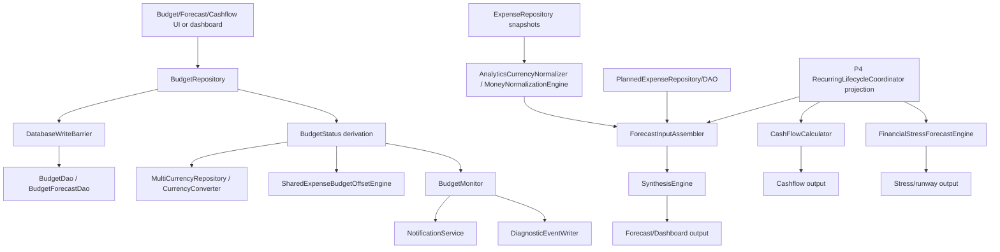

# Pipeline 6 — Budget / Forecasting / Cashflow Master Implementation Plan

## 1. Executive summary

Current state: **static remote review only** against target commit `83b798e849b4408b2bf683f52cb2746d37f7af16`. Local `git rev-parse HEAD`, `rg`, and Gradle were **not run** in this environment. The implementation agent must verify the checkout before editing.

Production risk: **RED before implementation**. Many tracker-listed P6 issues are already fixed in source, but remaining gaps can still misstate financial projections:
- recurring income is not representable in `RecurringPattern`; `CashFlowCalculator.isIncomePattern()` always returns `false`;
- stress forecast is explicitly `NET_CASHFLOW_ESTIMATE`, not a canonical real balance model;
- stale detected recurring patterns are logged but not surfaced as forecast quality warnings;
- Synthesis/block-party paths can fall back to raw foreign-currency amounts when conversion fails;
- budget snapshot API still uses latest-rate conversion while period status uses period-end basis;
- no-baseline pace still carries `pacePercentage = 0f`.

Implementation strategy:
1. **Do not re-fix already-fixed tracker items.**
2. First run required verification commands.
3. Fix remaining correctness gaps without broad refactors.
4. Treat schema-changing recurring-income or real-account-balance support as a stop/design condition unless a persisted source already exists.
5. Add regression tests per issue.
6. Update stale P6 tracker/docs only after code and tests pass.

Recommended verdict before implementation: **RED**.

Build/test status: **NOT RUN**

Reason:
- No local checkout/terminal execution available.
- Source was reviewed via GitHub raw links only.

Mandatory first command for coding agent:

```bash
git rev-parse HEAD
```

Expected output:

```text
83b798e849b4408b2bf683f52cb2746d37f7af16
```

If not exact, stop.

---

## 2. Scope

### In scope

- P6 budget status, snapshots, rollover, alerts, diagnostics.
- Budget forecast persistence, rate basis, quality propagation.
- Forecast input assembly for actual/planned/recurring data.
- Cashflow calendar calculations.
- Stress forecast/stress quality warnings.
- P6-related Room write barriers and DAO write ownership.
- P6 tests, guard tests, and tracker/docs updates.

### Out of scope

- Broad architecture rewrites.
- New bank sync/manual balance product unless required to resolve P6-P1-13.
- Schema migrations unless recurring-income direction or real balance source cannot be represented otherwise.
- Cloud AI/privacy features except diagnostics redaction.
- Expense lifecycle fixes outside P6 unless P6 bypass is discovered.

### Assumptions

- Pipeline 6 in this repository means **Budget / Forecasting / Cashflow**, not the generic example “Privacy / Cloud AI”.
- Architecture docs are normative unless code proves them stale.
- Code at target SHA is source of truth.
- Existing `DatabaseWriteBarrier` / `DatabaseReadBarrier` contracts must remain intact.

### Stop conditions

Stop and report before editing if:
- `git rev-parse HEAD` differs from target SHA.
- `rg` shows production P6 writes directly calling DAOs outside legal owners.
- fixing recurring income requires adding a new persisted field/table.
- fixing stress balance requires schema/product source not present.
- test baseline does not compile before changes.
- Hilt graph cannot be updated without broad refactor.

---

## 3. Source/doc reconciliation

Sources used:
- P6 issue doc: `docs/analyses and debug master/PIPELINE_6_CONSOLIDATED_ISSUES.md` — https://raw.githubusercontent.com/panospao7/Cost-agregator/83b798e849b4408b2bf683f52cb2746d37f7af16/docs/analyses%20and%20debug%20master/PIPELINE_6_CONSOLIDATED_ISSUES.md
- P6 implementation plan: https://raw.githubusercontent.com/panospao7/Cost-agregator/83b798e849b4408b2bf683f52cb2746d37f7af16/docs/analyses%20and%20debug%20master/pipelines%20issues%20implementantion%20plan/PIPELINE_6_IMPLEMENTATION_PLAN.md
- Legal paths: https://raw.githubusercontent.com/panospao7/Cost-agregator/83b798e849b4408b2bf683f52cb2746d37f7af16/docs/architecture/LEGAL_PATHS.md
- Budget repository: https://raw.githubusercontent.com/panospao7/Cost-agregator/83b798e849b4408b2bf683f52cb2746d37f7af16/app/src/main/java/com/yourname/expensetracker/data/repository/BudgetRepository.kt
- Budget forecast engine: https://raw.githubusercontent.com/panospao7/Cost-agregator/83b798e849b4408b2bf683f52cb2746d37f7af16/app/src/main/java/com/yourname/expensetracker/domain/budget/BudgetForecastingEngine.kt
- Forecast input assembler: https://raw.githubusercontent.com/panospao7/Cost-agregator/83b798e849b4408b2bf683f52cb2746d37f7af16/app/src/main/java/com/yourname/expensetracker/domain/forecasting/ForecastInputAssembler.kt
- Cashflow calculator: https://raw.githubusercontent.com/panospao7/Cost-agregator/83b798e849b4408b2bf683f52cb2746d37f7af16/app/src/main/java/com/yourname/expensetracker/domain/cashflow/CashFlowCalculator.kt
- Stress engine: https://raw.githubusercontent.com/panospao7/Cost-agregator/83b798e849b4408b2bf683f52cb2746d37f7af16/app/src/main/java/com/yourname/expensetracker/domain/forecasting/FinancialStressForecastEngine.kt
- Synthesis engine: https://raw.githubusercontent.com/panospao7/Cost-agregator/83b798e849b4408b2bf683f52cb2746d37f7af16/app/src/main/java/com/yourname/expensetracker/domain/logic/SynthesisEngine.kt
- TimePeriodUtils: https://raw.githubusercontent.com/panospao7/Cost-agregator/83b798e849b4408b2bf683f52cb2746d37f7af16/app/src/main/java/com/yourname/expensetracker/domain/util/TimePeriodUtils.kt

| Area / Issue | Pipeline doc claim | Master tracker claim | Source-code truth | Status | Evidence |
|---|---|---|---|---|---|
| P6-P1-01 forecast refresh unique conflict | Fixed | Fixed/complete | `BudgetForecastDao.insertWithDeactivation()` uses ABORT insert; `BudgetForecastingEngine.insertForecast()` maps only UNIQUE conflicts to duplicate and rethrows non-UNIQUE constraints. | FIXED, tests need verification | `BudgetForecastingEngine.insertForecast`; `BudgetForecastDao.insertWithDeactivation` |
| P6-P1-02 forecast `createdAt=0`, wrong currency | Fixed | Fixed | Forecast row uses `createdAt = now`, `currency = homeCurrency`. | FIXED | `BudgetForecastingEngine.generateForecastResult` |
| P6-P1-03 budget/forecast/planned writes lack restore guard | Fixed | Fixed | Reviewed budget/forecast/planned write paths call `DatabaseWriteBarrier`. Full direct DAO caller `rg` still required. | PARTIALLY_FIXED / NEEDS_RUNTIME_VERIFICATION | `BudgetRepository.add/update/delete/toggle/deleteAll`, `BudgetForecastingEngine`, `PlannedExpenseRepository` |
| P6-P1-04 budget alerts use gross percent | Fixed | Fixed | `BudgetMonitor.processBudgetStatus()` uses `adjustedSpendBreakdown?.effectiveSpend ?: spentAmount` and recomputes `adjustedPercent`. | FIXED | `BudgetMonitor.processBudgetStatus` |
| P6-P1-05 rollover ignores partial conversion | Fixed | Fixed | Rollover aggregates `isPartial` and warning messages. | FIXED | `BudgetRepository.createBudgetStatus` |
| P6-P1-06 budget limit latest/current rate | TODO | Design/TODO | Budget status path uses period-end `convertAsOf`; however `getActiveBudgetSnapshots()` still uses `convertBudgetAmountToHomeCurrencyLatest`. | PARTIALLY_FIXED | `BudgetRepository.createBudgetStatus`; `BudgetRepository.getActiveBudgetSnapshots` |
| P6-P1-07 data quality ignored by synthesis | Fixed | Fixed | `SynthesisEngine.synthesize(input)` subtracts `input.dataQuality.confidencePenalty` and propagates warnings/excluded counts. | FIXED | `SynthesisEngine.synthesize` |
| P6-P1-08 planned expenses not normalized | TODO | TODO/design | Planned expenses are normalized in `assemble()` and `assembleNormalized()`. Recurring TODO in assembler is stale because Synthesis converts display currency, but conversion-failure fallbacks still need hardening. | FIXED_WITH_REMAINING_HARDENING | `ForecastInputAssembler.assemble`, `assembleNormalized`, `SynthesisEngine` |
| P6-P1-09 cancelled/skipped planned enter forecast | Fixed | Fixed | `mapPlannedExpenses` filters `status == "PLANNED"`; Synthesis filters again. | FIXED | `ForecastInputAssembler.mapPlannedExpenses`; `SynthesisEngine` |
| P6-P1-10 occurrence status lost | Fixed | Fixed | Forecast/cashflow/stress merge materialized occurrences and filter PLANNED/active statuses. | FIXED | `ForecastInputAssembler`, `CashFlowCalculator`, `FinancialStressForecastEngine` |
| P6-P1-11 cashflow raw-sums multi-currency | TODO | TODO | `CashFlowCalculator` now uses `MoneyNormalizationEngine.aggregateExpenses`; predicted recurring uses `convertOutcome`. | FIXED | `CashFlowCalculator.calculateDailyCashFlow` |
| P6-P1-12 pre-dedup recurring predictions displayed | Fixed | Fixed | Cashflow uses content-aware dedupe before output. | FIXED | `CashFlowCalculator` |
| P6-P1-13 stress not real balance forecast | TODO | TODO/design | Engine mode is `NET_CASHFLOW_ESTIMATE`; comments say future real balance providers may be added. | PARTIALLY_FIXED / DESIGN | `StressForecastMode`, `resolveStartingBalanceBaseline` |
| P6-P1-14 stress counts PAID | TODO | TODO | `ACTIVE_OCCURRENCE_STATUSES = PLANNED, OVERDUE, DUE`; PAID excluded. | FIXED / TRACKER_DRIFT | `FinancialStressForecastEngine` |
| P6-P1-15 delete budget can fail after forecasts | Fixed | Fixed | Delete explicitly purges forecasts inside transaction; FK described as CASCADE. | FIXED | `BudgetRepository.deleteBudget` |
| NEW-P6-001 stress CE swallowed | Fixed | Fixed | `computeStressForecast` catch rethrows `CancellationException`. | FIXED | `FinancialStressForecastEngine.computeStressForecast` |
| NEW-P6-002 alert diagnostic CE swallowed | Fixed | Fixed | `writeAlertDiagnostic` rethrows CE. | FIXED | `BudgetMonitor.writeAlertDiagnostic` |
| NEW-P6-003 CHECK_FAILED diagnostic CE swallowed | Fixed | Fixed | CHECK_FAILED diagnostic catch rethrows CE. | FIXED | `BudgetMonitor.checkBudgets` |
| NEW-P6-004 unbounded rollover loop/O(N) daily queries | Fixed in docs | Fixed in docs | Query count bounded by retained deque size, but loop still iterates all historical periods before dropping old entries; comments still call out N+1. | PARTIALLY_FIXED | `BudgetRepository.MAX_ROLLOVER_PERIODS`, rollover loop |
| NEW-P6-005 BudgetRepository CRUD CE swallowed | Fixed | Fixed | CRUD catch blocks rethrow CE. | FIXED | `BudgetRepository` |
| NEW-P6-006 computeAdjustedSpend CE swallowed | Open | Unknown | Source rethrows CE in `computeAdjustedSpend`. | FIXED / TRACKER_DRIFT | `BudgetRepository.computeAdjustedSpend` |
| NEW-P6-007 stress closed interval | Fixed/open drift | Unknown | `expandDetectedPatterns` uses half-open `[start,end)`. | FIXED | `FinancialStressForecastEngine.expandDetectedPatterns` |
| NEW-P6-008 stale detected patterns silently skipped | Open | Open | Stale patterns are excluded with Timber warning only; warning is not returned in `StressForecastResult.qualityWarnings`. | PARTIALLY_FIXED | `FinancialStressForecastEngine.expandDetectedPatterns` |
| NEW-P6-009 DST-unsafe stress day arithmetic | Fixed | Fixed | Stress uses `TimePeriodUtils.addDays`; cashflow daily loop still uses `Calendar.add`, which is calendar-aware but should be tested across DST. | FIXED_FOR_STRESS / TEST_GAP_FOR_CASHFLOW | `FinancialStressForecastEngine`; `CashFlowCalculator` |
| NEW-P6-010 hardcoded risk thresholds | Open | Open | Thresholds extracted to constants with TODO to migrate to AppConfig/provider. | PARTIALLY_FIXED | `FinancialStressForecastEngine` companion object |
| NEW-P6-011 seasonal stub | Open | Open | Stub removed; comment says seasonal may return when real data exists. | FIXED / TRACKER_DRIFT | `BudgetForecastingEngine.calculatePredictedSpending` |
| NEW-P6-012 unused `MIN_HISTORY_MONTHS` | Open | Open | No `MIN_HISTORY_MONTHS`; `DESIRED_HISTORY_MONTHS` used. | FIXED / TRACKER_DRIFT | `BudgetForecastingEngine` |
| NEW-P6-013 pace 0 no baseline | Open | Open | `buildSpendingPace()` sets `pacePercentage = 0f` when no baseline and `PaceStatus.NO_BASELINE`. | OPEN | `ForecastInputAssembler.buildSpendingPace` |
| NEW-P6-014 income estimate divides by 3.0 | Open | Open | Uses actual month count from deposit date range. | FIXED / TRACKER_DRIFT | `FinancialStressForecastEngine.estimateIncome` |
| NEW-P6-015 income recurring treated as expense | Open | Open | `RecurringPattern` has no direction/type; `CashFlowCalculator.isIncomePattern()` always returns false. | OPEN / DESIGN_DEPENDENT | `RecurringPattern`; `CashFlowCalculator.isIncomePattern` |
| NEW-P6-016 weekly period locale-dependent | Open | Open | `TimePeriodUtils.getWeekRange` is Monday-start and locale-independent; `getWeekOfYear` sets Monday/minimalDays=1, but call-site `rg` is required. | NEEDS_RUNTIME_VERIFICATION / LIKELY_STALE_DOC | `TimePeriodUtils` |

---

## 4. Architecture contracts for this pipeline

| Contract | Required legal path | Current code | Gap | Fix required |
|---|---|---|---|---|
| Budget CRUD ownership | UI/ViewModel → `BudgetRepository` → `DatabaseWriteBarrier` → `BudgetDao` | Reviewed CRUD methods are barrier guarded. | Need full caller search for direct `BudgetDao` writes. | Add/extend architecture guard test. |
| Forecast writes | `BudgetForecastingEngine` → write barrier → `BudgetForecastDao.insertWithDeactivation()` | Present. | None known. | Tests for FK/UNIQUE distinction and write barrier. |
| Planned expense writes | `PlannedExpenseRepository` / P4 lifecycle owner → write barrier → `PlannedExpenseDao` | `PlannedExpenseRepository.add/delete` guarded. Other DAO status updates need caller inventory. | Unknown direct callers. | Run `rg` and classify. |
| Recurring occurrences | P4 `RecurringLifecycleCoordinator` owns materialization/status writes; P6 read paths must not materialize | P6 forecast/cashflow/stress uses read-only projection plus read-barrier materialized read. | Full direct write caller check needed. | Guard test: P6 does not call occurrence write methods. |
| Restore barrier | All P6 writes blocked in non-NORMAL modes; selected reads blocked during restore | Budget/forecast/planned writes reviewed. Occurrence reads guarded. | Need stress snapshot/import/export check. | Add barrier regression tests. |
| Money/currency | No raw cross-currency sums; warnings must propagate | Major paths normalized. Block-party conversion fallbacks can use raw amount on conversion failure. | Partial precision risk. | Exclude failed conversions and surface partial state. |
| Diagnostics/privacy | No raw merchant/category/user text in diagnostic metadata unless safe/redacted | Budget diagnostics mainly numeric/status. Stress stale warning currently logs merchant name. | Timber may include raw merchant in stale pattern warning. | Replace with count/reason; no merchant in diagnostics/logs. |
| CE propagation | Never swallow `CancellationException` | Reviewed catches mostly rethrow CE. | Need `rg runCatching`/`catch` full repo. | Add guard or targeted tests. |
| Side effects | DB mutation commits before notification side effects where applicable | Budget alert timestamp write occurs only after delivery. Diagnostics best-effort. | Notification side effect occurs before timestamp write by design. | No change; test timestamp not updated on failed notification. |

---

## 5. Current runtime flow



### Budget create/update/delete

`BudgetRepository.addBudget/updateBudget/updateBudgetOrThrow/deleteBudget/toggleBudget/deleteAll/restoreDebugSnapshot`
→ `writeBarrier.checkWritesAllowed(...)`
→ validate finite amount/currency/thresholds
→ DAO mutation
→ best-effort diagnostic, CE rethrown.

### Budget status / alert

`BudgetRepository.getBudgetStatuses()`
→ active budgets + categories + expense invalidation + day ticker
→ `createBudgetStatus()`
→ period range
→ period-end budget limit conversion
→ normalized spend aggregation
→ rollover
→ adjusted spend
→ `BudgetMonitor.processBudgetStatus()`
→ adjusted percent
→ notification
→ notification timestamp update only if delivered
→ diagnostic.

### Forecast refresh

`BudgetForecastingEngine.generateForecastResult()`
→ write barrier
→ home currency resolution
→ period-end limit conversion
→ historical expense normalization
→ confidence penalty
→ `BudgetForecast` row with valid timestamps/currency/quality fields
→ `insertForecast()` via `BudgetForecastDao.insertWithDeactivation()`.

### Forecast input assembly

`ForecastInputAssembler.assemble()`
→ fail-closed home currency
→ normalize actual snapshots
→ project active recurring rules read-only
→ read materialized occurrences with `DatabaseReadBarrier`
→ filter PLANNED occurrences
→ planned expense status filter/dedup/normalization
→ build spending pace
→ data-quality object
→ `SynthesisEngine.synthesize()`.

### Cashflow

`CashFlowCalculator.calculateDailyCashFlow()`
→ home-currency starting balance required
→ project/read recurring occurrences
→ classify actual expenses by transaction type/direction
→ dedupe predicted recurring
→ normalize actual income/expense
→ convert predicted recurring
→ update running balance
→ return `DailyCashFlow`.

Current gap: recurring predicted income cannot be represented; `isIncomePattern()` returns false.

### Stress forecast

`FinancialStressForecastEngine.computeStressForecast()`
→ display currency
→ account balance provider / net-cashflow fallback
→ normalize deposits/expenses
→ compute 30/60/90 horizons
→ recurring outflows via active occurrence statuses
→ Monte Carlo discretionary spending
→ quality warnings from normalizer.

Current gaps: stale pattern warnings not surfaced; risk thresholds are code constants; mode remains net-cashflow estimate.

---

## 6. Implementation phases

### PR 0 — Verification-only preflight

Goal: verify source inventory and baseline tests before code changes.

Risk: none.

Files: none.

Work items:
1. Run checkout and search commands from section 11.
2. Build direct DAO mutation inventory.
3. Confirm test baseline.

Tests: none added.

Acceptance criteria:
- exact SHA verified;
- existing tests either pass or baseline failures documented;
- all P6 direct DAO writes classified.

---

### PR 1 — Critical financial correctness: cashflow/forecast currency hardening

Goal: prevent misleading cashflow/forecast output for recurring direction and conversion failures.

Risk: medium; changes visible forecast/cashflow numbers.

Files:
- `domain/cashflow/CashFlowCalculator.kt`
- `domain/model/RecurringPattern.kt` **only if no existing direction model exists and schema decision is approved**
- `domain/logic/SynthesisEngine.kt`
- related Hilt/module/model/UI files if data-quality fields need propagation
- tests under `app/src/test/java/...`

Work items:
- P6-WI-001: Fix or explicitly gate recurring income support.
- P6-WI-002: Remove raw fallback amounts from Synthesis/block-party conversion paths.
- P6-WI-003: Add focused currency/direction tests.

Tests:
- `cashflow_recurring_income_is_positive_when_direction_available`
- `cashflow_recurring_income_unsupported_is_not_silently_expense`
- `synthesis_excludes_unconverted_recurring_amounts`
- `block_party_marks_partial_on_conversion_failure`

Acceptance criteria:
- no recurring income is subtracted as expense;
- if recurring-income source is absent, UI/API exposes “recurring income unsupported” rather than showing it as expense;
- Synthesis never falls back to raw foreign-currency amount when display currency conversion fails;
- partial/excluded counts propagate.

---

### PR 2 — Stress quality and configurability

Goal: make stress forecast quality truthful and thresholds explicit/configurable.

Risk: medium; risk tiers may change in tests if thresholds injected.

Files:
- `domain/forecasting/FinancialStressForecastEngine.kt`
- add `domain/forecasting/StressRiskThresholds.kt` or provider class
- Hilt module that provides forecasting engines/config
- tests

Work items:
- P6-WI-004: Return stale-pattern warnings/counts.
- P6-WI-005: Replace companion risk constants with injected/default threshold provider.
- P6-WI-006: Keep CE propagation and half-open interval tests.

Tests:
- `stress_stale_detected_patterns_emit_quality_warning_without_pii`
- `stress_risk_thresholds_are_injected`
- `stress_threshold_provider_defaults_match_old_behavior`
- `stress_excludes_paid_occurrences_regression`
- `stress_pattern_expansion_half_open_boundary_regression`

Acceptance criteria:
- stale detected patterns contribute to `StressForecastResult.qualityWarnings` and `excludedCount`;
- warnings contain reason/count, not raw merchant names;
- thresholds can be changed in tests without editing engine constants;
- PAID remains excluded.

---

### PR 3 — Budget consistency/performance + no-baseline UX

Goal: remove remaining budget precision/performance issues and stop displaying no-baseline pace as 0%.

Risk: low-medium; may affect dashboard values.

Files:
- `data/repository/BudgetRepository.kt`
- `domain/budget/BudgetCalculator.kt` if helper is placed there
- `domain/forecasting/ForecastInputAssembler.kt`
- `domain/analytics/SpendingPace.kt` or relevant data class
- UI/ViewModel files that display pace if present
- tests

Work items:
- P6-WI-007: Optimize rollover to compute only retained windows.
- P6-WI-008: Make budget snapshot rate basis explicit.
- P6-WI-009: Represent no-baseline pace as nullable/N/A/flagged.

Tests:
- `rollover_does_not_iterate_all_historical_daily_periods`
- `rollover_uses_at_most_max_retained_period_queries`
- `budget_snapshot_rate_basis_is_explicit`
- `pace_no_baseline_not_rendered_as_zero_percent`
- `week_range_locale_independent_regression`

Acceptance criteria:
- 10-year daily rollover does not loop through every completed day;
- budget status and snapshot APIs document/use consistent rate basis, or snapshot is explicitly “latest-rate display only”;
- UI/dashboard cannot display no-baseline pace as 0%;
- week logic verified across locales/year boundary.

---

### PR 4 — Stress balance design decision + docs/tracker cleanup

Goal: resolve P6-P1-13 and synchronize stale docs.

Risk: high if adding real balance source; low if clarifying mode only.

Files:
- `domain/forecasting/AccountBalanceProvider.kt`
- `domain/forecasting/NetCashflowBalanceProvider.kt`
- `domain/forecasting/FinancialStressForecastEngine.kt`
- stress UI/ViewModel if labels exist
- P6 docs/tracker files

Work items:
- P6-WI-010: Decide and implement one:
  - **Option A:** keep model as `NET_CASHFLOW_ESTIMATE`, ensure all UI labels use that exact language, and mark P6-P1-13 as accepted design limitation.
  - **Option B:** add real balance source/provider and mode; compute running balance from canonical initial balance.
- P6-WI-011: Update stale tracker/code drift.
- P6-WI-012: Add guard tests for direct DAO writes/barriers.

Tests:
- `stress_mode_label_is_net_cashflow_estimate_when_no_real_balance`
- or `stress_forecast_uses_real_account_balance_provider`
- `stress_forecast_running_balance_formula`
- architecture guard tests.

Acceptance criteria:
- P6-P1-13 is no longer ambiguous;
- production UI does not claim real account balance unless source is canonical;
- docs reflect actual code status.

---

## 7. Detailed work items

| ID | Severity | Title | Files | Implementation steps | Tests | Acceptance criteria |
|---|---:|---|---|---|---|---|
| P6-WI-001 | P1 | Do not treat recurring income as expense | `CashFlowCalculator.kt`, `RecurringPattern.kt`, recurring model/source files | Run `rg -n "RecurringIncome|income recurring|transactionType|sourceType|RecurringPattern"`. If an existing recurring-income source exists, map it to explicit direction and implement `isIncomePattern`. If no persisted source exists, do **not** infer from merchant/name; return unsupported quality state and update issue as design. | `cashflow_recurring_income_is_positive_when_direction_available`; `cashflow_recurring_income_unsupported_is_not_silently_expense` | Income recurrence is either positive inflow or explicitly unsupported; never silently outflow. |
| P6-WI-002 | P1 | Remove raw conversion fallback in Synthesis/block-party | `SynthesisEngine.kt` | Replace `convertAmount(...) ?: rawAmount` paths with exclusion + failure count. Carry failure count into `FinancialForecast.isPartial/excludedCount/qualityWarnings` or nearest existing quality model. Avoid raw merchant/description in warnings. | `synthesis_excludes_unconverted_planned_amounts`; `block_party_marks_partial_on_conversion_failure` | No cross-currency raw sums/fallbacks remain. |
| P6-WI-003 | P2 | Cashflow LocalDate day iteration | `CashFlowCalculator.kt` | Replace mutable `Calendar` while loop with `LocalDate` iteration in system zone; convert each day to start/end instants using `TimePeriodUtils` or new helper. Keep half-open `[start,end)`. | `cashflow_dst_spring_forward_no_duplicate_or_missing_days`; `cashflow_dst_fall_back_no_duplicate_or_missing_days` | Output contains exactly one row per calendar date across DST. |
| P6-WI-004 | P2 | Surface stale stress-pattern exclusions | `FinancialStressForecastEngine.kt` | Change `expandDetectedPatterns()` to return `DetectedExpansionResult(total, staleExcludedCount, conversionFailedCount, warnings)`. Merge into `RecurringOutflowResult`, horizons, and final `StressForecastResult.qualityWarnings/excludedCount`. Remove raw merchant from Timber. | `stress_stale_detected_patterns_emit_quality_warning_without_pii` | User-visible quality warning exists; logs/diagnostics are redacted. |
| P6-WI-005 | P2 | Inject stress risk thresholds | `FinancialStressForecastEngine.kt`, add `StressRiskThresholds.kt`, Hilt module | Add data class `StressRiskThresholds(low, moderate, elevated, high)` with validation `0<low<moderate<elevated<high<1`. Inject provider/defaults. Replace companion constants. | `stress_risk_thresholds_are_injected`; `invalid_thresholds_rejected` | Risk tier thresholds configurable/test-injectable. |
| P6-WI-006 | P2 | Preserve fixed stress invariants | tests only unless regression found | Add regression tests for CE propagation, PAID exclusion, half-open intervals, actual month-count income. | listed in PR2 | Existing fixes cannot regress. |
| P6-WI-007 | P2 | Avoid scanning all rollover history | `BudgetRepository.kt`, maybe `BudgetCalculator.kt` | Add helper that returns last `MAX_ROLLOVER_PERIODS` completed windows directly. Prefer walking backward from current period then reverse. Do not iterate from original budget start for old daily budgets. | `rollover_does_not_iterate_all_historical_daily_periods`; fake calculator counter test | 10-year daily budget visits ≤365 retained windows plus small constant. |
| P6-WI-008 | P2 | Make budget snapshot rate basis explicit | `BudgetRepository.kt`, `BudgetSnapshot` model/callers | Search callers of `getActiveBudgetSnapshots()`. If used for current/dashboard display only, add field/comment `rateBasis=LATEST_AVAILABLE` and warnings. If used for period comparison, add `getActiveBudgetSnapshotsAsOf(asOfMillis)` using `convertBudgetAmountToHomeCurrencyAsOf`. | `budget_snapshot_latest_basis_documented`; `budget_snapshot_asof_uses_period_end_rate` | Consumers cannot confuse latest snapshot with period-stable status. |
| P6-WI-009 | P3 | No-baseline pace must not be 0% | `ForecastInputAssembler.kt`, `SpendingPace`, UI/ViewModels | Prefer `pacePercentage: Float?`. If too broad, add `hasPaceBaseline` and update every UI/caller to show N/A when `PaceStatus.NO_BASELINE`. | `pace_no_baseline_not_rendered_as_zero_percent` | No UI/API represents missing baseline as 0%. |
| P6-WI-010 | P1/design | Resolve stress balance semantics | `AccountBalanceProvider`, stress engine/UI | Option A: keep `NET_CASHFLOW_ESTIMATE` and enforce label. Option B: provider returns canonical balance + mode and engine computes running balance from it. Stop if schema/product source needed. | `stress_mode_label_is_net_cashflow_estimate_when_no_real_balance` or `stress_forecast_uses_real_account_balance_provider` | No false claim of real balance forecast. |
| P6-WI-011 | P3 | Tracker/docs sync | P6 docs/master tracker | After tests pass, mark stale issues fixed/partial/open based on source. Rename `StressForecastEngine.kt` references to `FinancialStressForecastEngine.kt`. | docs review | Tracker no longer contradicts code. |
| P6-WI-012 | P1 | Direct DAO/write-barrier guard | tests/config | Add guard test using source scan or existing architecture-test framework: P6 production code must not call mutating DAO methods except legal owners; writes must call `checkWritesAllowed`. | `p6_direct_dao_writes_follow_legal_owners` | Future bypasses fail tests. |

---

## 8. File-by-file change plan

| File | Change type | Exact changes | Risk | Tests covering it |
|---|---|---|---:|---|
| `app/src/main/java/.../domain/cashflow/CashFlowCalculator.kt` | MODIFY | Implement direction-safe recurring handling; replace day loop with LocalDate if accepted; keep CE rethrows. | Medium | Cashflow tests |
| `app/src/main/java/.../domain/model/RecurringPattern.kt` | MODIFY or NO_CHANGE_READ_ONLY | Only add direction/source field if existing persisted source supports it and migration/design approved. Otherwise no schema/model change. | High if changed | Recurring/cashflow tests |
| `app/src/main/java/.../domain/logic/SynthesisEngine.kt` | MODIFY | Remove `?: rawAmount` conversion fallbacks; propagate partial/excluded counts. | Medium | Synthesis/block-party tests |
| `app/src/main/java/.../domain/forecasting/FinancialStressForecastEngine.kt` | MODIFY | Return stale/conversion warnings from recurring expansion; inject risk thresholds; preserve PAID/CE/half-open behavior. | Medium | Stress tests |
| `app/src/main/java/.../domain/forecasting/StressRiskThresholds.kt` | ADD | Validated threshold data class/provider contract. | Low | Threshold tests |
| Hilt forecasting/config module | MODIFY | Provide default `StressRiskThresholds`. Locate exact module with `rg -n "FinancialStressForecastEngine|Forecasting|@Module"`. | Low | Hilt compile |
| `app/src/main/java/.../data/repository/BudgetRepository.kt` | MODIFY | Rollover retained-window helper; explicit snapshot rate-basis or as-of snapshot API. | Medium | Budget tests |
| `app/src/main/java/.../domain/budget/BudgetCalculator.kt` | MODIFY optional | Add previous/retained period helper if cleaner than repository helper. | Medium | Period tests |
| `app/src/main/java/.../domain/forecasting/ForecastInputAssembler.kt` | MODIFY | No-baseline pace representation; keep planned normalization. | Medium | Forecast input tests |
| `SpendingPace` model file | MODIFY optional | Add nullable/flagged pace baseline. Locate exact file with `rg -n "data class SpendingPace"`. | Medium | UI/domain tests |
| Budget/forecast/cashflow UI files | MODIFY if reached | Show N/A/partial warnings; stress mode label. Locate with UI `rg`. | Medium | ViewModel/UI tests |
| `docs/analyses.../PIPELINE_6_CONSOLIDATED_ISSUES.md` | UPDATE_DOC | Sync issue statuses after code/tests. | Low | docs review |
| `docs/analyses.../PIPELINE_ISSUES_MASTER_TRACKER.md` | UPDATE_DOC | Sync P6 status and filename drift. | Low | docs review |
| `app/src/test/.../CashFlowCalculatorTest.kt` | ADD_TEST/UPDATE_TEST | Direction, normalization, DST. | Low | Gradle |
| `app/src/test/.../FinancialStressForecastEngineTest.kt` | ADD_TEST/UPDATE_TEST | Stale warnings, thresholds, PAID exclusion, CE. | Low | Gradle |
| `app/src/test/.../BudgetRepositoryTest.kt` | ADD_TEST/UPDATE_TEST | Rollover cap/iteration, snapshot rate basis. | Low | Gradle |
| `app/src/test/.../ForecastInputAssemblerTest.kt` | ADD_TEST/UPDATE_TEST | No-baseline pace, planned normalization regression. | Low | Gradle |
| `app/src/test/.../SynthesisEngineTest.kt` | ADD_TEST/UPDATE_TEST | Conversion failure partial/excluded behavior. | Low | Gradle |
| Architecture guard test file | ADD_TEST | Direct DAO/barrier grep guard. | Low | `:app:testDebugUnitTest` |

---

## 9. Database / schema / migration plan

Default plan: **No schema migration required** for PR1–PR3 if recurring income is not made persistent and stress remains net-cashflow estimate/config-injected.

Potential schema stop points:

| Change | Entity/DAO | Migration required? | Schema export required? | Backfill required? | Tests |
|---|---|---:|---:|---:|---|
| Add direction to recurring rules/patterns | `ManualRecurringExpense`, `RecurringOccurrence`, maybe `RecurringPattern` | YES if persisted | YES | YES, default existing rows to EXPENSE | Recurring migration + cashflow |
| Add manual account balance source | New or existing account/balance entity | YES unless existing provider exists | YES | Product-defined | Stress balance integration |
| Add pace baseline field only in domain model | none | NO | NO | NO | Forecast/UI tests |
| Add stress threshold provider defaults | none | NO | NO | NO | Unit/Hilt tests |
| Add budget as-of snapshot overload | none | NO | NO | NO | Budget tests |

If a schema change becomes necessary:
1. stop implementation;
2. produce migration plan;
3. inspect `AppDatabase`, `DatabaseMigrations`, exported schemas;
4. add migration + schema export + migration test.

---

## 10. Test plan

### Existing tests to run

```bash
./gradlew :app:assembleDebug --stacktrace
./gradlew :app:testDebugUnitTest --stacktrace
./gradlew :app:check --stacktrace
```

### Focused tests

```bash
./gradlew :app:testDebugUnitTest --tests "*Budget*" --stacktrace
./gradlew :app:testDebugUnitTest --tests "*Forecast*" --stacktrace
./gradlew :app:testDebugUnitTest --tests "*CashFlow*" --stacktrace
./gradlew :app:testDebugUnitTest --tests "*Stress*" --stacktrace
./gradlew :app:testDebugUnitTest --tests "*Synthesis*" --stacktrace
./gradlew :app:testDebugUnitTest --tests "*Currency*" --stacktrace
./gradlew :app:testDebugUnitTest --tests "*Money*" --stacktrace
./gradlew :app:testDebugUnitTest --tests "*Planned*" --stacktrace
./gradlew :app:testDebugUnitTest --tests "*Recurring*" --stacktrace
```

### New tests to add

| Test file | Test name | Behavior covered |
|---|---|---|
| `CashFlowCalculatorTest.kt` | `cashflow_recurring_income_is_positive_when_direction_available` | Direction source produces inflow. |
| `CashFlowCalculatorTest.kt` | `cashflow_recurring_income_unsupported_is_not_silently_expense` | No direction source does not subtract as expense. |
| `CashFlowCalculatorTest.kt` | `cashflow_dst_spring_forward_no_duplicate_or_missing_days` | DST-safe day loop. |
| `SynthesisEngineTest.kt` | `synthesis_excludes_unconverted_recurring_amounts` | No raw currency fallback. |
| `SynthesisEngineTest.kt` | `block_party_marks_partial_on_conversion_failure` | Block-party quality state. |
| `FinancialStressForecastEngineTest.kt` | `stress_stale_detected_patterns_emit_quality_warning_without_pii` | Stale exclusions visible/redacted. |
| `FinancialStressForecastEngineTest.kt` | `stress_risk_thresholds_are_injected` | Configurable thresholds. |
| `FinancialStressForecastEngineTest.kt` | `stress_excludes_paid_occurrences_regression` | PAID remains excluded. |
| `FinancialStressForecastEngineTest.kt` | `stress_pattern_expansion_half_open_boundary_regression` | No boundary double-count. |
| `BudgetRepositoryTest.kt` | `rollover_does_not_iterate_all_historical_daily_periods` | No full-history scan. |
| `BudgetRepositoryTest.kt` | `budget_snapshot_asof_uses_period_end_rate` | Snapshot rate-basis clarity. |
| `ForecastInputAssemblerTest.kt` | `pace_no_baseline_not_rendered_as_zero_percent` | No-baseline pace N/A/null/flagged. |
| `TimePeriodUtilsTest.kt` | `week_range_consistent_across_locales` | NEW-P6-016 regression. |
| Architecture guard test | `p6_direct_dao_writes_follow_legal_owners` | No illegal direct DAO writes. |

### Architecture guard tests

| Guard | Expected rule |
|---|---|
| Direct DAO write guard | P6 production code may call mutating budget/forecast/planned DAOs only through legal repository/engine/coordinator paths. |
| Barrier guard | Every production P6 write owner has `DatabaseWriteBarrier.checkWritesAllowed`. |
| CE guard | P6 catches of `Exception` rethrow `CancellationException`. |
| Money guard | No `sumOf { amount/effectiveAmount }` across mixed-currency inputs unless normalized or display-currency converted with failure handling. |
| Occurrence guard | P6 read paths may project/read occurrences but must not materialize/update recurring occurrence statuses. |

---

## 11. Validation commands

Preflight:

```bash
git rev-parse HEAD
git status --short
```

Required discovery:

```bash
find app/src/main/java -type f | sort
find app/src/test/java -type f | sort
find app/src/androidTest/java -type f | sort

rg -n "Budget|budget|Forecast|forecast|CashFlow|cashflow|Stress|stress|Rollover|rollover|PlannedExpense|RecurringOccurrence" app/src/main app/src/test app/src/androidTest docs config scripts

rg -n "withTransaction|DatabaseWriteBarrier|DatabaseReadBarrier|RestoreMaintenanceMode|checkWritesAllowed|checkReadAllowed|DatabaseAccessBlockedException" app/src/main app/src/test app/src/androidTest

rg -n "insert\\(|insertAll\\(|update\\(|delete\\(|deleteAll\\(|@Query\\(\"UPDATE|@Query\\(\"DELETE|@Query\\(\"INSERT" app/src/main/java app/src/test/java app/src/androidTest/java

rg -n "catch \\(e: Exception\\)|runCatching|CancellationException|NonCancellable|SupervisorJob|launch|async" app/src/main app/src/test app/src/androidTest

rg -n "WEEK_OF_YEAR|getWeekOfYear|getWeekBasedYear|getWeekRange|Calendar.getInstance" app/src/main app/src/test app/src/androidTest

rg -n "RecurringIncome|income recurring|isIncomePattern|transactionType|sourceType|RecurringPattern" app/src/main app/src/test app/src/androidTest

rg -n "StressForecastEngine|FinancialStressForecastEngine|ACTIVE_OCCURRENCE_STATUSES|expandDetectedPatterns|estimateIncome|RISK_THRESHOLD" app/src/main app/src/test docs
```

Build/tests:

```bash
./gradlew :app:assembleDebug --stacktrace
./gradlew :app:testDebugUnitTest --stacktrace
./gradlew :app:testDebugUnitTest --tests "*Budget*" --stacktrace
./gradlew :app:testDebugUnitTest --tests "*Forecast*" --stacktrace
./gradlew :app:testDebugUnitTest --tests "*CashFlow*" --stacktrace
./gradlew :app:testDebugUnitTest --tests "*Stress*" --stacktrace
./gradlew :app:testDebugUnitTest --tests "*Synthesis*" --stacktrace
./gradlew :app:testDebugUnitTest --tests "*Currency*" --stacktrace
./gradlew :app:testDebugUnitTest --tests "*Money*" --stacktrace
./gradlew :app:testDebugUnitTest --tests "*Planned*" --stacktrace
./gradlew :app:testDebugUnitTest --tests "*Recurring*" --stacktrace
./gradlew :app:check --stacktrace
```

If UI is touched:

```bash
./gradlew :app:connectedDebugAndroidTest --stacktrace
```

---

## 12. Documentation updates

| Doc | Required update | Reason |
|---|---|---|
| `PIPELINE_6_CONSOLIDATED_ISSUES.md` | Mark tracker drift: P6-P1-14, NEW-P6-006/007/011/012/014 fixed; NEW-P6-015 open/design; P6-P1-13 design. | Current doc is stale vs code. |
| `PIPELINE_6_IMPLEMENTATION_PLAN.md` | Replace old fixed/open plan with actual PR plan from this document. | Avoid agents re-fixing solved issues. |
| `PIPELINE_ISSUES_MASTER_TRACKER.md` | Update P6 verdict after PRs and tests. | Master tracker claims may overstate GREEN. |
| `UNIVERSAL_ISSUE_TRACKER.md` | Only update if universal guard/test added. | Keep cross-pipeline contract current. |
| Architecture docs / `LEGAL_PATHS.md` | Only update if recurring-income or account-balance legal path is added. | Schema/lifecycle ownership change. |
| P6 comments/TODOs | Remove stale TODO that says Synthesis raw-sums recurring if PR confirms fixed; keep TODO for actual unsupported income. | Reduce code/doc drift. |

---

## 13. Direct DAO mutation inventory

NEEDS_VERIFICATION with `rg`; preliminary classification from reviewed files:

| DAO method | SQL mutation? | Caller(s) | Legal owner? | Barrier? | Audit event? | Classification | Fix |
|---|---:|---|---|---|---|---|---|
| `BudgetDao.insert` | yes | `BudgetDao` helpers, `BudgetRepository.addBudget`, debug restore | BudgetRepository | yes via repository | yes for add; debug restore no per-row audit | LEGAL | Guard caller inventory. |
| `BudgetDao.update` | yes | `updateAndEnforceActiveScope` | BudgetRepository | yes | yes for repo update | LEGAL | none |
| `BudgetDao.delete` | yes | `BudgetRepository.deleteBudget` | BudgetRepository | yes | yes | LEGAL | none |
| `BudgetDao.deleteAll` | yes | `BudgetRepository.deleteAll`, debug restore helper | BudgetRepository/debug | yes | partial | LEGAL | consider diagnostic for deleteAll if required. |
| `BudgetDao.updateWarning/Critical/ExceededNotification` | yes | `BudgetRepository.update*Notification` | BudgetRepository | yes | alert diagnostic exists | LEGAL | none |
| `BudgetForecastDao.insertWithDeactivation` | yes | `BudgetForecastingEngine.insertForecast` | BudgetForecastingEngine | yes | forecast diagnostics | LEGAL | none |
| `BudgetForecastDao.update` | yes | `BudgetForecastingEngine.updateForecastAccuracy` | BudgetForecastingEngine | yes | Timber only | LEGAL/PARTIAL_DIAG | add diagnostic only if contract requires. |
| `BudgetForecastDao.deleteForecastsForBudget` | yes | `BudgetRepository.deleteBudget` | BudgetRepository | yes | budget delete diagnostic | LEGAL | none |
| `PlannedExpenseDao.insertPlannedExpense` | yes | `PlannedExpenseRepository.addPlannedExpense` | PlannedExpenseRepository/P4 owner | yes | yes | LEGAL | full caller search. |
| `PlannedExpenseDao.delete*` | yes | `PlannedExpenseRepository`, P4 lifecycle likely | Planned/P4 lifecycle | yes where reviewed | yes where reviewed | LEGAL/UNKNOWN_NEEDS_RG | verify all callers. |
| `PlannedExpenseDao.updateStatus/link/unlink/fulfill/cancel` | yes | unknown from static limited review | P4 lifecycle owner | unknown | unknown | UNKNOWN_NEEDS_RG | classify after `rg`; add work item if direct unguarded caller. |
| `RecurringOccurrenceDao` writes | yes | not reviewed | P4 coordinator only | unknown | lifecycle event required | UNKNOWN_NEEDS_RG | verify P6 has no write callers. |
| `StressForecastSnapshotDao` writes | yes | not reviewed | stress snapshot owner | unknown | unknown | UNKNOWN_NEEDS_RG | inspect before GREEN. |
| `PipelineDiagnosticEventDao` writes | yes | diagnostic writer | Diagnostics writer | barrier at P6 call sites | diagnostic itself | LEGAL | ensure redaction. |

---

## 14. Cross-pipeline impact

| Fix ID | Affected pipeline(s) | Why affected | Extra tests needed |
|---|---|---|---|
| P6-WI-001 | P4 recurring/planned, P6 cashflow, dashboard | Recurring rule model/projection may need direction; can affect occurrence/planned generation. | Recurring lifecycle + cashflow tests. |
| P6-WI-002 | P5/P8 currency-money, dashboard | Currency conversion failures affect forecast and block-party output. | Currency failure tests, dashboard forecast tests. |
| P6-WI-004 | P8 diagnostics/privacy | Stale pattern warnings/logging must not leak merchant names. | Redaction test. |
| P6-WI-005 | DI/config | New threshold provider affects Hilt graph. | Hilt compile/test. |
| P6-WI-007 | Budget/dashboard | Rollover values feed budget UI/dashboard. | Golden budget status tests. |
| P6-WI-008 | Dashboard/analytics | Snapshot API may feed dashboard totals. | Dashboard snapshot tests. |
| P6-WI-009 | UI/dashboard | Pace display state changes. | ViewModel/UI tests. |
| P6-WI-010 | Bank/manual balance future pipeline | Real balance provider touches account/bank/manual source if implemented. | Provider integration tests. |
| P6-WI-012 | All DB-write pipelines | Guard tests may expose non-P6 direct writes. | Architecture test baseline. |

---

## 15. Risk and rollback plan

| Risk | Probability | Impact | Mitigation | Rollback |
|---|---:|---:|---|---|
| Recurring income requires schema | Medium | High | Stop before migration; design review. | Revert model changes; keep unsupported flag. |
| Synthesis conversion fallback change lowers totals | Medium | Medium | Surface partial/excluded warnings; add golden tests. | Revert to previous behavior only if product accepts mixed-currency risk. |
| Stress thresholds injection breaks Hilt | Low | Medium | Add default provider in same module; compile early. | Inline defaults temporarily. |
| Rollover optimization changes old carryover semantics | Medium | High | Test old vs new for recent 365 periods; document dropped older carryover policy. | Revert helper; keep query cap. |
| Pace nullable breaks callers | Medium | Medium | Prefer additive `hasBaseline` if nullable is too broad. | Use additive flag only. |
| Docs updated before code proven | Low | Medium | Docs only in final PR after tests. | Revert docs commit. |
| Architecture guard catches existing unrelated violations | Medium | Medium | Scope guard to P6 first; list unrelated as follow-up. | Narrow guard allowlist with TODO. |

---

## 16. Final acceptance criteria

Implementation is complete only when:

- [ ] `git rev-parse HEAD` equals `83b798e849b4408b2bf683f52cb2746d37f7af16`.
- [ ] Working tree clean before each PR.
- [ ] All affected source files inspected with `rg`.
- [ ] Pipeline docs reconciled with source.
- [ ] Master/universal trackers reconciled with source.
- [ ] Legal paths verified.
- [ ] Direct DAO mutation inventory completed.
- [ ] No illegal direct DAO writes remain.
- [ ] Restore/write barrier contract preserved.
- [ ] No `CancellationException` swallowed.
- [ ] No raw cross-currency fallback sums remain in touched P6 paths.
- [ ] Recurring income is either correctly modeled as inflow or explicitly unsupported.
- [ ] Stress stale-pattern exclusions are visible and redacted.
- [ ] Stress thresholds are configurable/injectable or explicitly accepted as product constants.
- [ ] Stress balance mode cannot be mislabeled as real account balance.
- [ ] No-baseline pace cannot display as 0%.
- [ ] Existing tests pass.
- [ ] New tests pass.
- [ ] Architecture guards pass.
- [ ] Docs/tracker updated.
- [ ] Remaining design limitations documented.

---

## 17. Handoff instructions for coding agent

1. Start from verified commit:
   ```bash
   git rev-parse HEAD
   ```
2. Run preflight `rg` inventory before editing.
3. Do **PR 0** verification and record baseline.
4. Implement **PR 1 only**.
5. Run focused CashFlow/Synthesis/Currency tests.
6. Commit PR 1 only when tests pass.
7. Implement **PR 2**.
8. Run focused Stress tests and Hilt compile.
9. Commit PR 2 only when tests pass.
10. Implement **PR 3**.
11. Run Budget/Forecast/UI tests.
12. Commit PR 3 only when tests pass.
13. Implement **PR 4** docs/guard/design resolution.
14. Run full validation:
    ```bash
    ./gradlew :app:assembleDebug --stacktrace
    ./gradlew :app:testDebugUnitTest --stacktrace
    ./gradlew :app:check --stacktrace
    ```
15. Do not combine unrelated phases.
16. Do not make broad style-only changes.
17. Do not rename public APIs unless required by a tested bug fix.
18. Do not change DB schema without stopping for a migration plan.
19. Do not weaken architecture tests.
20. Do not remove tests to make the build pass.
21. Do not add raw PII to logs, diagnostics, or analytics.
22. Report unexpected code/doc drift before modifying more files.