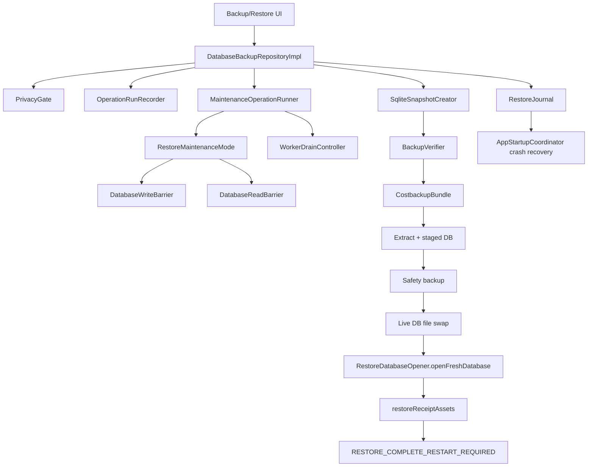

# Pipeline 7 — Backup / Restore Master Implementation Plan

## 1. Executive summary

Current state: static remote review completed against target commit `83b798e849b4408b2bf683f52cb2746d37f7af16`; local checkout and Gradle were **not run**. Code is newer than the P7 tracker: several tracker TODO/open items are already fixed in source, but critical restore-safety gaps remain.

Build/test status: **NOT RUN**

Reason:
- No local checkout/terminal available.
- `git rev-parse HEAD`, `rg`, and Gradle validation must be run by the implementation agent.

Static review completed: **yes**

Primary source links:
- P7 issue doc: https://raw.githubusercontent.com/panospao7/Cost-agregator/83b798e849b4408b2bf683f52cb2746d37f7af16/docs/analyses%20and%20debug%20master/PIPELINE_7_CONSOLIDATED_ISSUES.md
- P7 plan: https://raw.githubusercontent.com/panospao7/Cost-agregator/83b798e849b4408b2bf683f52cb2746d37f7af16/docs/analyses%20and%20debug%20master/pipelines%20issues%20implementantion%20plan/PIPELINE_7_IMPLEMENTATION_PLAN.md
- Barrier contract: https://raw.githubusercontent.com/panospao7/Cost-agregator/83b798e849b4408b2bf683f52cb2746d37f7af16/docs/backup-restore-barrier-contract.md
- Main repo impl: https://raw.githubusercontent.com/panospao7/Cost-agregator/83b798e849b4408b2bf683f52cb2746d37f7af16/app/src/main/java/com/yourname/expensetracker/data/repository/DatabaseBackupRepositoryImpl.kt
- `RestoreMaintenanceMode`: https://raw.githubusercontent.com/panospao7/Cost-agregator/83b798e849b4408b2bf683f52cb2746d37f7af16/app/src/main/java/com/yourname/expensetracker/data/backup/RestoreMaintenanceMode.kt
- `BackupVerifier`: https://raw.githubusercontent.com/panospao7/Cost-agregator/83b798e849b4408b2bf683f52cb2746d37f7af16/app/src/main/java/com/yourname/expensetracker/data/backup/BackupVerifier.kt
- `CostbackupBundle`: https://raw.githubusercontent.com/panospao7/Cost-agregator/83b798e849b4408b2bf683f52cb2746d37f7af16/app/src/main/java/com/yourname/expensetracker/data/backup/CostbackupBundle.kt
- `AppStartupCoordinator`: https://raw.githubusercontent.com/panospao7/Cost-agregator/83b798e849b4408b2bf683f52cb2746d37f7af16/app/src/main/java/com/yourname/expensetracker/startup/AppStartupCoordinator.kt
- `DatabaseModule`: https://raw.githubusercontent.com/panospao7/Cost-agregator/83b798e849b4408b2bf683f52cb2746d37f7af16/app/src/main/java/com/yourname/expensetracker/di/DatabaseModule.kt

Production risk:
- **P1:** Restore/import/reset mutate live DB files while other Hilt-injected repositories may still hold the old singleton `AppDatabase`.
- **P1:** Receipt asset restore can update DB path before final file rename, leaving broken image paths on crash.
- **P1:** Write/read barriers are caller-enforced, not globally guaranteed.
- **P1/P2:** Semantic restore equivalence is still TODO in `BackupVerifier`.
- **P2:** Maintenance mode has no owner/session protection; concurrent maintenance operations can clear each other.

Implementation strategy:
1. Verify exact SHA and baseline tests first.
2. Do not reimplement fixed tracker items.
3. Make restore fail-closed around stale Room first.
4. Make receipt asset restore crash-resumable and privacy-safe.
5. Add architecture guard tests for write/read barriers.
6. Add semantic checkpoints to `.costbackup` manifest without DB schema migration.
7. Update stale docs only after source/tests pass.

Recommended verdict before implementation: **RED**.

---

## 2. Scope

### In scope

- `.costbackup` backup/restore safety.
- Legacy debug `.db` import/export safety.
- Reset database flow.
- Maintenance mode, write/read barriers, worker drain.
- Restore journal durability and startup recovery.
- Receipt asset restore atomicity/resume.
- Verification manifest and semantic checkpoints.
- P7 privacy-safe diagnostics.
- P7 docs/tracker reconciliation.
- P7 architecture guard tests.

### Out of scope

- Broad Room/DI rewrite unless product requires immediate post-restore use without process restart.
- New cloud backup provider.
- New public backup format version beyond additive manifest fields.
- Changes to normal transaction/receipt lifecycle except restore-internal asset path repair.
- DB schema migration, unless an unexpected persisted field is required.

### Assumptions

- Pipeline 7 here means **Backup / Restore**.
- Source at `83b798e849b4408b2bf683f52cb2746d37f7af16` is authoritative.
- Architecture docs are normative unless source proves them stale.
- `.costbackup` manifest can accept additive optional fields while preserving old restore compatibility.
- Immediate post-restore writes are unsafe unless every repository uses a reopenable DB provider or the process restarts.

### Stop conditions

Stop before code edits if:
- `git rev-parse HEAD` is not `83b798e849b4408b2bf683f52cb2746d37f7af16`.
- baseline `:app:assembleDebug` fails for unrelated reasons.
- fixing stale Room requires a global DB provider refactor larger than one PR and product refuses process-restart gating.
- semantic checkpoint SQL cannot be written without confirming actual table/column names.
- receipt asset restore requires schema changes.
- direct DAO mutation inventory reveals unguarded production writes outside P7 scope.

---

## 3. Source/doc reconciliation

| Area / Issue | Pipeline doc claim | Master tracker claim | Source-code truth | Status | Evidence |
|---|---|---|---|---|---|
| P7-P0-01 legacy `.db` import lacks journal/maintenance | TODO | TODO | `importDatabase()` is debug-only, creates `RestoreJournal`, enters `RESTORE_PREPARING`, drains workers, stages, safety-backs up, swaps, verifies. | FIXED / STALE_DOC | `DatabaseBackupRepositoryImpl.importDatabase`; KDoc above it still stale. |
| P7-P0-02 crash recovery resumes writes after failed recovery | Fixed | Fixed | Startup enters `CRITICAL_RECOVERY_REQUIRED` on safety-backup recovery failure and exempts it from auto-reset. | FIXED, tests need run | `AppStartupCoordinator.checkRestoreJournal`. |
| P7-P1-01 stale injected Room after swap | TODO | TODO | Repo mutates its own `private var database` and uses fresh DB for verification, but `DatabaseModule` still provides singleton `AppDatabase` to other consumers. | PARTIALLY_FIXED | `DatabaseBackupRepositoryImpl` hot-swap comment; `DatabaseModule.provideDatabase()`. |
| P7-P1-02 maintenance mode not global barrier | TODO | TODO | `DatabaseWriteBarrier` / `DatabaseReadBarrier` are explicit checks only. No global interceptor found in reviewed files. | PARTIALLY_FIXED / NEEDS_RG | `DatabaseWriteBarrier.checkWritesAllowed`; `DatabaseReadBarrier.checkReadAllowed`. |
| P7-P1-03 backup does not freeze writes/use snapshot | TODO | TODO | `createCostBackup()` enters `BACKUP_EXPORTING`, drains workers, checkpoints WAL, double-checks barrier, uses `SqliteSnapshotCreator`. | FIXED, dependent on barrier guard | `createCostBackup`; `SqliteSnapshotCreator`. |
| P7-P1-04 receipt asset restore not atomic | TODO | TODO | Asset restore prepopulates journal tasks but copies temp → updates DB → renames final. Crash after DB update leaves broken path. Startup only blocks/warns on `ASSETS_RESTORING`. | PARTIALLY_FIXED / OPEN | `restoreReceiptAssets`; `AppStartupCoordinator.AssetsIncomplete`. |
| P7-P1-05 no semantic equivalence | TODO | TODO | `BackupVerifier` TODO explicitly says semantic checks are future work. Manifest only has `tableCounts`. | OPEN | `BackupVerifier` header TODO; `CostbackupBundle.BackupManifest`. |
| P7-P1-06 privacy audit optional | TODO | TODO | `privacy_audit_events` is `TIER_1_EXACT`. | FIXED / TRACKER_DRIFT | `BackupVerifier.TABLE_TIERS`. |
| P7-P1-07 worker pause/resume not spec-driven | Fixed | Fixed | Worker registry/spec path is present; full worker RG still required. | FIXED / NEEDS_RUNTIME_VERIFICATION | `RestoreMaintenanceMode`, `WorkerRegistry`. |
| P7-P1-08 restore leaves app blocked / UI dismiss | Fixed | Fixed | Contract says dismiss exits to `NORMAL`; this conflicts with stale DB risk. | PARTIAL / DESIGN_CONFLICT | `backup-restore-barrier-contract.md`; `RestoreMaintenanceMode.exit`. |
| NEW-P7-001 export never exits maintenance | Fixed | Fixed | Reviewed export/backup paths use finally exit. | FIXED | `exportDatabase`, `createCostBackup`. |
| NEW-P7-002 privacy/WAL failure leaks maintenance | Fixed | Fixed | Early failures call exit/finally. | FIXED | `createCostBackup`, `exportDatabase`. |
| NEW-P7-003 critical state two-commit | Open | Open | `enterCriticalRecoveryRequired` uses one `commit()` with reason/timestamp/mode. | FIXED / TRACKER_DRIFT | `RestoreMaintenanceMode.enterCriticalRecoveryRequired`. |
| NEW-P7-004 journal append race | Open | Open | append path uses `synchronized(journalLock)` and fsynced temp rename. | FIXED / TRACKER_DRIFT | `RestoreJournal.appendEventToFile`. |
| NEW-P7-005 `FileInputStream` leak | Open | Open | `CostbackupBundle.extract()` closes `fis` in finally. | FIXED / TRACKER_DRIFT | `CostbackupBundle.extract`. |
| NEW-P7-006 unquoted table name | Open | Open | Reviewed count paths quote table names. Need local grep for all paths. | FIXED / NEEDS_RG | `BackupVerifier.collectTableCountsStrict`; `countRowsForVerification`. |
| P7-FIND-A maintenance owner/session | Not listed | Not listed | `RestoreMaintenanceMode.enter/exit` has no owner token; `exit(false)` unconditionally sets `NORMAL`. | OPEN | `RestoreMaintenanceMode.exit`. |
| P7-FIND-B asset metadata PII | Not listed | Not listed | `RestoreJournal.AssetRestoreTask.sourceRelativePath` stores filename; restore warnings/logs include `assetFile.name`. | OPEN | `RestoreJournal.AssetRestoreTask`; `restoreReceiptAssets`. |

Existing tests: **NEEDS_VERIFICATION**
- Run `rg -n "Backup|Restore|Maintenance|Journal|costbackup|DatabaseBarrier|Snapshot|Reset|Room|WorkerDrain|PrivacyAudit" app/src/test app/src/androidTest`.
- Do not mark issue fixed unless source and tests cover it.

---

## 4. Architecture contracts for this pipeline

| Contract | Required legal path | Current code | Gap | Fix required |
|---|---|---|---|---|
| Backup creation | UI/ViewModel → `DatabaseBackupRepositoryImpl.createCostBackup()` → privacy gate → `MaintenanceOperationRunner.enterAndDrain(BACKUP_EXPORTING)` → WAL checkpoint → `SqliteSnapshotCreator` → `BackupVerifier` → `CostbackupBundle` | Mostly present. | Needs tests and barrier guard. | Add snapshot consistency + required table failure tests. |
| Legacy raw export | Debug UI only → `exportDatabase()` → `BuildConfig.DEBUG` + privacy gate → backup mode → private export | Present. | Need UI entrypoint verification. | Add release/debug gate tests. |
| `.costbackup` restore | Repo → journal before maintenance → drain → extract/verify/stage → safety backup → swap → fresh DB verify → assets → restart-required | Mostly present. | Stale Hilt DB consumers; asset atomicity. | PR1/PR2. |
| Legacy `.db` import | Debug only → journal → maintenance → stage/verify → safety backup → swap → fresh DB verify | Present. | Stale KDoc; same stale DB risk. | Docs + PR1 tests. |
| Reset DB | Journal → `RESETTING_DATABASE` → safety backup → delete live DB → restart-required | Present. | Same stale DB risk. | PR1 tests. |
| Write barrier | All writes blocked outside `NORMAL`; restore-internal asset writes only in `ASSETS_RESTORING`. | Explicit `DatabaseWriteBarrier`; not global. | Caller-by-caller gaps possible. | PR3 architecture guard; optionally global provider later. |
| Read barrier | Normal reads blocked during restore; backup snapshot reads allowed. | Explicit `DatabaseReadBarrier`. | Flow/read coverage unknown. | PR3 guard/inventory. |
| Worker drain | Destructive DB ops call `MaintenanceOperationRunner.enterAndDrain`. | Reviewed paths do. | Worker coverage needs RG. | Worker guard tests. |
| Diagnostics | Journal terminal success/failure must survive stale Room. | Journal + `RestoreDiagnosticsSink` exists. | Asset warnings may contain raw filenames. | Redact asset metadata in PR2. |
| Privacy | No raw DB export in release; encrypted backup gated; redaction honored. | Mostly present. | Receipt filename leak in journal/logs. | PR2. |
| Semantic verification | Restore success must prove business equivalence where claimed. | TODO only. | Manifest lacks semantic checkpoint. | PR4. |

### Direct DAO mutation inventory

Full table requires local `rg`. Preliminary plan table:

| DAO method | SQL mutation? | Caller(s) | Legal owner? | Barrier? | Audit event? | Classification | Fix |
|---|---:|---|---|---|---|---|---|
| `ScannedReceiptDao.update` | yes | `restoreReceiptAssets()` | Restore-internal P7 path | `RestoreInternalWriteScope` | Journal task/event | LEGAL but PARTIAL | PR2 atomic/resumable update. |
| Operation-run DAO writes | yes | `OperationRunRecorder`, `RestoreJournalImporter` | Diagnostics owner | only when startup writes allowed | yes | UNKNOWN_NEEDS_RG | Verify idempotent import and barrier. |
| Worker run DAO writes | yes | `WorkerExecutionGuard` | Worker runtime owner | guard checks mode | yes | UNKNOWN_NEEDS_RG | Verify all workers use guard. |
| All other DAO writes | yes | repositories/coordinators | pipeline owners | unknown | varies | UNKNOWN_NEEDS_RG | Add architecture guard. |

Required local command:

```bash
rg -n "insert\\(|insertAll\\(|update\\(|delete\\(|deleteAll\\(|@Query\\(\"UPDATE|@Query\\(\"DELETE|@Query\\(\"INSERT" app/src/main/java app/src/test/java app/src/androidTest/java
```

---

## 5. Current runtime flow



Actual high-risk paths:
1. After live DB file swap, `DatabaseBackupRepositoryImpl` reassigns only its own `private var database`; other injected repositories still hold the original singleton from `DatabaseModule`.
2. `restoreReceiptAssets()` currently updates `ScannedReceipt.imagePath` before final file rename.
3. `RestoreMaintenanceMode.exit(false)` unconditionally returns to `NORMAL`, and docs say restart-required is dismissible, which can unblock stale DB consumers.

---

## 6. Implementation phases

### PR 0 — Preflight inventory and baseline

Goal: verify checkout, source inventory, and test baseline before modifying code.

Risk: none.

Files: no source changes.

Work items:
- Run required commands in section 11.
- Build direct DAO write inventory.
- Build P7 UI/ViewModel inventory.
- Confirm exact test files and current failures.

Tests:
- existing only.

Acceptance criteria:
- exact SHA verified;
- dirty tree is empty;
- existing baseline recorded;
- direct DAO writes classified.

---

### PR 1 — Critical restore lifecycle safety / stale Room fail-closed

Goal: prevent any post-restore/import/reset app write from using stale Hilt-injected `AppDatabase`.

Risk: medium/high; affects restore UX.

Files:
- `DatabaseBackupRepositoryImpl.kt`
- `RestoreMaintenanceMode.kt`
- backup/restore ViewModel/UI file found by `rg`
- `MainActivity` / app shell if it handles operational state
- tests

Work items:
- P7-WI-001: enforce restart-required fail-closed after live DB swap.
- P7-WI-002: prevent dismiss action from unblocking writes unless global DB provider invalidation exists.
- P7-WI-003: remove/update stale legacy import KDoc.
- P7-WI-004: add post-restore stale DB regression tests.

Acceptance criteria:
- after restore/import/reset, app remains in `RESTORE_COMPLETE_RESTART_REQUIRED` until process restart or explicit safe DB-provider invalidation is implemented;
- dismissing a banner must not call `RestoreMaintenanceMode.exit(false)` unless all DB consumers are reopened;
- all post-swap verification uses fresh DB and closes it;
- no workers reschedule before safe DB state.

Implementation decision:
- **Default minimal fix:** require process restart to unblock writes. This avoids broad DI refactor.
- **Stop condition:** if product requires immediate use after restore, implement a separate global `ReopenableAppDatabaseProvider` PR before allowing dismiss-to-normal.

---

### PR 2 — Receipt asset restore atomicity, recovery, and privacy

Goal: make asset restore crash-safe and remove raw filename leakage.

Risk: medium; touches receipt asset paths.

Files:
- `DatabaseBackupRepositoryImpl.kt`
- `RestoreJournal.kt`
- `AppStartupCoordinator.kt`
- possibly `ReceiptAssetStore.kt`
- tests

Work items:
- P7-WI-005: reorder asset restore so final file exists before DB path update.
- P7-WI-006: make pending asset tasks resumable on startup.
- P7-WI-007: redact raw filenames/paths from journal/logs/warnings.
- P7-WI-008: add crash-injection tests for each phase.

Acceptance criteria:
- crash after file copy but before DB update leaves at worst an orphan file, not broken DB path;
- crash after DB update is only possible after final file exists;
- startup in `ASSETS_RESTORING` either resumes incomplete tasks or remains fail-closed with actionable state;
- no journal/diagnostic/log warning stores raw receipt filename.

---

### PR 3 — Maintenance exclusivity and barrier architecture guards

Goal: prevent concurrent maintenance mode clobber and enforce barrier usage.

Risk: medium; may expose existing write-path violations.

Files:
- `MaintenanceOperationRunner.kt`
- `RestoreMaintenanceMode.kt`
- architecture test file under `app/src/test`
- possibly repository write owners if guard exposes missing barriers

Work items:
- P7-WI-009: serialize backup/restore/reset operations with an operation mutex/session.
- P7-WI-010: add direct DAO mutation architecture guard.
- P7-WI-011: add read-barrier guard for P7-relevant Flow/read entrypoints.
- P7-WI-012: add worker guard coverage.

Acceptance criteria:
- two concurrent maintenance operations cannot both enter and one cannot exit the other to `NORMAL`;
- every production mutating DAO call is classified legal/guarded or fails guard test;
- all P7 worker-affecting flows use `WorkerExecutionGuard` or are documented no-DB workers.

---

### PR 4 — Semantic restore verification and manifest hardening

Goal: prove more than row counts for critical financial/receipt/privacy data.

Risk: medium; adds backup format fields and verification failures.

Files:
- `BackupVerifier.kt`
- `CostbackupBundle.kt`
- `DatabaseBackupRepositoryImpl.kt`
- tests

Work items:
- P7-WI-013: add additive semantic checkpoint field to `BackupManifest`.
- P7-WI-014: collect checkpoints at backup time from the sanitized snapshot.
- P7-WI-015: verify checkpoints pre-swap/post-swap as appropriate.
- P7-WI-016: add tests for same-row-count semantic corruption.

Acceptance criteria:
- backups include semantic checkpoint map for new format;
- restore of older backup without checkpoint still works with warning/legacy mode;
- new backups fail restore if amount/category/currency/receipt-link/privacy semantic checkpoints differ while row counts match.

---

### PR 5 — Docs/tracker cleanup

Goal: sync docs after code/tests prove status.

Risk: low.

Files:
- `PIPELINE_7_CONSOLIDATED_ISSUES.md`
- `PIPELINE_7_IMPLEMENTATION_PLAN.md`
- `PIPELINE_ISSUES_MASTER_TRACKER.md`
- `UNIVERSAL_ISSUE_TRACKER.md` only if guard affects universal status
- `backup-restore-barrier-contract.md`

Acceptance criteria:
- tracker no longer says fixed source is open;
- no stale KDoc claiming no journal/maintenance;
- restart-required behavior doc matches final code.

---

## 7. Detailed work items

| ID | Severity | Title | Files | Implementation steps | Tests | Acceptance criteria |
|---|---:|---|---|---|---|---|
| P7-WI-001 | P1 | Fail-closed after DB file swap | `DatabaseBackupRepositoryImpl.kt`, `RestoreMaintenanceMode.kt`, UI/ViewModel | Ensure `restoreCostBackup`, `importDatabase`, `resetDatabase` end in `RESTORE_COMPLETE_RESTART_REQUIRED`. Do not call `exit(false)` from dismiss unless safe provider exists. Add helper `requireRestartAfterLiveDbSwap(reason)`. | `restore_success_keeps_writes_blocked_until_restart`; `legacy_import_success_keeps_writes_blocked_until_restart`; `reset_success_keeps_writes_blocked_until_restart` | No writes/workers resume against possibly stale singleton. |
| P7-WI-002 | P1 | Guard restart banner dismissal | `BackupRestoreViewModel` or equivalent, `MainActivity` | Locate `dismissRestartRequired`. Change behavior to hide only UI banner or launch restart prompt, not transition mode to `NORMAL`. If product demands resume, stop and implement provider refactor. | `dismiss_restart_required_does_not_exit_maintenance_without_reopen_provider` | User dismissal cannot unblock stale DB writes. |
| P7-WI-003 | P3 | Remove stale legacy import KDoc | `DatabaseBackupRepositoryImpl.kt` | Delete or update comment saying legacy import lacks journal/maintenance. | compile only | Docs/comments match source. |
| P7-WI-004 | P1 | Stale DB regression harness | tests | Create fake injected old DB consumer or repository before restore; perform restore/import; verify consumer blocked until restart or provider invalidated. | `post_restore_existing_repository_cannot_write_until_restart`; `workers_not_rescheduled_before_restart` | P7-P1-01 covered. |
| P7-WI-005 | P1 | Atomic asset path update | `DatabaseBackupRepositoryImpl.restoreReceiptAssets` | For each asset: parse receiptId; copy bundle asset to temp; fsync file if feasible; rename/copy to final; verify `finalFile.exists`; then run `RestoreInternalWriteScope` DAO update; mark journal complete after DB update. Never update DB before final exists. | `asset_restore_crash_before_db_update_keeps_old_path`; `asset_restore_db_path_points_to_existing_file` | No broken `imagePath` after crash/failure. |
| P7-WI-006 | P1 | Resume incomplete asset tasks | `RestoreJournal.kt`, `AppStartupCoordinator.kt`, `DatabaseBackupRepositoryImpl.kt` | Add `resumeReceiptAssetRestore(entry)` using `extractTempDirPath` and receiptId-based scan. On `AssetsIncomplete`, attempt resume under `ASSETS_RESTORING`; if temp dir missing, keep restart-required/repairable state and do not reset to normal. | `startup_assets_restoring_resumes_pending_tasks`; `assets_restoring_missing_temp_dir_stays_blocked_with_warning` | Startup handles crash during asset phase. |
| P7-WI-007 | P2 | Redact asset metadata | `RestoreJournal.kt`, `DatabaseBackupRepositoryImpl.kt` | Replace `sourceRelativePath` with PII-safe fields: `receiptId`, `sourceHash`, `extension`, `status`, `targetPathHash` or no target. Logs/warnings use receiptId only. If raw path needed internally, keep in active journal only encrypted/private and omit from diagnostics JSON. | `asset_restore_warnings_do_not_include_filename`; `restore_journal_diagnostics_redact_asset_paths` | No raw filename/path in logs/diagnostics. |
| P7-WI-008 | P1 | Asset crash injection tests | tests | Add injectable failpoints around copy, final rename, DAO update, journal complete. | `asset_restore_crash_after_final_rename_resumes`; `asset_restore_crash_after_db_update_has_existing_file` | Every phase recoverable. |
| P7-WI-009 | P2 | Maintenance operation exclusivity | `MaintenanceOperationRunner.kt`, `RestoreMaintenanceMode.kt`, P7 repo methods | Add in-process `Mutex` held for entire operation via `runExclusive`. Convert P7 public methods to use it or add repository-level `Mutex`. Optionally add persisted `operationId` owner if straightforward. | `concurrent_backup_restore_second_operation_rejected`; `operation_exit_cannot_clear_other_active_mode` | Concurrent maintenance cannot clear another operation. |
| P7-WI-010 | P1 | Mutating DAO guard | `app/src/test/.../architecture/P7DatabaseWriteBarrierGuardTest.kt` | Source-scan production files. Allowlist legal owners. Fail if mutating DAO call occurs without barrier or restore-internal scope. | `p7_mutating_dao_calls_are_guarded` | Future bypasses fail tests. |
| P7-WI-011 | P2 | Read barrier guard | architecture tests | Scan P7 backup/restore read flows and Flow wrappers. Ensure restore-sensitive reads use `DatabaseReadBarrier` or fresh one-shot DB. | `p7_restore_sensitive_reads_are_barrier_guarded` | No unguarded restore reads. |
| P7-WI-012 | P2 | Worker guard coverage | tests | Verify every `WorkerRegistry.DEFAULTS` worker uses `WorkerExecutionGuard` or documented no-DB mode. | `registered_workers_use_execution_guard` | Worker writes blocked during restore. |
| P7-WI-013 | P1 | Add semantic checkpoint manifest field | `CostbackupBundle.kt` | Add optional `semanticChecks: Map<String, String>` to `BackupManifest` JSON. Preserve backward compatibility with default empty map. | `manifest_roundtrip_preserves_semantic_checks`; `old_manifest_without_semantic_checks_still_parses` | No backup format break. |
| P7-WI-014 | P1 | Collect semantic checkpoints | `BackupVerifier.kt`, `DatabaseBackupRepositoryImpl.kt` | Add `BackupVerifier.collectSemanticChecks(db)`. Include PII-safe stable digests/aggregates for expenses totals by currency/type/categoryId, budgets totals, receipt-link broken count, exchange-rate count/digest, privacy audit count by capability/action, recurring/planned counts by status. | `collect_semantic_checks_for_core_tables`; `semantic_checks_are_pii_safe` | New backup manifest has checkpoints. |
| P7-WI-015 | P1 | Verify semantic checkpoints | `BackupVerifier.kt`, restore paths | Add `verifySemanticChecks(db, manifest.semanticChecks)`. For new backups, mismatch fails before success; for legacy missing checks, warn but do not fail. | `semantic_verification_catches_same_row_count_amount_change`; `legacy_backup_missing_semantic_checks_warns_only` | Restore success proves semantic invariants for new backups. |
| P7-WI-016 | P2 | Privacy audit Tier 1 regression | tests | Assert `privacy_audit_events` remains required exact. | `privacy_audit_events_are_tier1_required` | Tracker drift cannot regress. |
| P7-WI-017 | P3 | Tracker sync | docs | Update P7 issue doc/master tracker after implementation. | docs review | Docs reflect source truth. |

---

## 8. File-by-file change plan

| File | Change type | Exact changes | Risk | Tests covering it |
|---|---|---|---:|---|
| `data/repository/DatabaseBackupRepositoryImpl.kt` | MODIFY | Enforce restart-required after swap; asset restore order final-file-before-DAO; privacy-safe warnings; wire semantic checks into backup/restore; remove stale KDoc. | High | Restore, import, reset, asset, semantic tests |
| `data/backup/RestoreMaintenanceMode.kt` | MODIFY | Add owner/session or support runner exclusivity if needed; ensure `exit(false)` not used to unblock post-swap unsafe state. | Medium | maintenance exclusivity tests |
| `data/backup/MaintenanceOperationRunner.kt` | MODIFY | Add operation mutex/session wrapper held across operation; convert P7 repo to use it or repository-level mutex. | Medium | concurrent operation tests |
| `data/backup/RestoreJournal.kt` | MODIFY | Replace raw asset path/filename in diagnostics; add resume-friendly but PII-safe asset task metadata. | Medium | journal redaction + resume tests |
| `startup/AppStartupCoordinator.kt` | MODIFY | Resume or fail-closed on `AssetsIncomplete`; do not reset to normal after incomplete asset restore unless repaired. | High | startup asset recovery tests |
| `data/backup/CostbackupBundle.kt` | MODIFY | Add optional `semanticChecks` field to manifest JSON; backward-compatible parse. | Medium | manifest roundtrip tests |
| `data/backup/BackupVerifier.kt` | MODIFY | Add semantic checkpoint collection/verification; keep privacy audit Tier 1; add helpers for safe SQL/column existence. | Medium | semantic verifier tests |
| `di/DatabaseModule.kt` | NO_CHANGE_READ_ONLY by default | Only change if product chooses reopenable provider option. | High if changed | Hilt compile/provider tests |
| Backup/restore ViewModel file found by `rg` | MODIFY | Dismiss must not call `exit(false)` unless safe provider exists. | Medium | ViewModel tests |
| `MainActivity.kt` or app shell | MODIFY if needed | Show restart-required lock/action consistently. | Medium | UI/instrumentation |
| `app/src/test/.../DatabaseBackupRepositoryImplTest.kt` | UPDATE_TEST | Add restore/import/reset stale DB and semantic wiring tests. | Low | Gradle |
| `app/src/test/.../AssetRestoreAtomicityTest.kt` | UPDATE_TEST | Add crash-failpoint tests. | Low | Gradle |
| `app/src/test/.../BackupVerifierManifestTest.kt` | UPDATE_TEST | Add semantic fields and privacy audit Tier 1 tests. | Low | Gradle |
| `app/src/test/.../MaintenanceOperationRunnerTest.kt` | UPDATE_TEST | Add concurrent operation tests. | Low | Gradle |
| `app/src/test/.../P7DatabaseWriteBarrierGuardTest.kt` | ADD_GUARD | Source-scan mutating DAO callers. | Low | Gradle |
| P7 docs/tracker | UPDATE_DOC | Sync issue status after code/tests. | Low | docs review |

---

## 9. Database / schema / migration plan

No Room schema migration required by the default plan.

| Change | Entity/DAO | Migration required? | Schema export required? | Backfill required? | Tests |
|---|---|---:|---:|---:|---|
| Restart-required fail-closed | none | No | No | No | restore/import/reset tests |
| Asset restore order/resume | none | No | No | No | asset crash tests |
| Maintenance exclusivity | none | No | No | No | concurrency tests |
| Manifest semantic checkpoints | `.costbackup` manifest only | No Room migration | No | No | manifest backward-compat tests |
| Reopenable DB provider option | DI only unless chosen | No Room migration | No | No | Hilt/provider tests |

Stop and create a separate migration plan if:
- adding persistent restore state to Room tables becomes necessary;
- asset tasks need a DB table instead of the existing file journal;
- recurring/receipt asset metadata requires entity changes.

---

## 10. Test plan

### Existing tests to run

```bash
./gradlew :app:assembleDebug --stacktrace
./gradlew :app:testDebugUnitTest --stacktrace
./gradlew :app:check --stacktrace
```

### Focused tests

```bash
./gradlew :app:testDebugUnitTest --tests "*Backup*" --stacktrace
./gradlew :app:testDebugUnitTest --tests "*Restore*" --stacktrace
./gradlew :app:testDebugUnitTest --tests "*Maintenance*" --stacktrace
./gradlew :app:testDebugUnitTest --tests "*Journal*" --stacktrace
./gradlew :app:testDebugUnitTest --tests "*Asset*" --stacktrace
./gradlew :app:testDebugUnitTest --tests "*DatabaseBarrier*" --stacktrace
./gradlew :app:testDebugUnitTest --tests "*WorkerDrain*" --stacktrace
./gradlew :app:testDebugUnitTest --tests "*PrivacyAudit*" --stacktrace
```

If UI/app shell changes:

```bash
./gradlew :app:connectedDebugAndroidTest --stacktrace
```

### New tests to add

| Test file | Test name | Behavior covered |
|---|---|---|
| `DatabaseBackupRepositoryImplTest.kt` | `restore_success_keeps_writes_blocked_until_restart` | P7-P1-01 fail-closed. |
| `DatabaseBackupRepositoryImplTest.kt` | `legacy_import_success_keeps_writes_blocked_until_restart` | Same for debug import. |
| `DatabaseBackupRepositoryImplTest.kt` | `reset_success_keeps_writes_blocked_until_restart` | Same for reset. |
| Backup/restore ViewModel test | `dismiss_restart_required_does_not_exit_maintenance_without_reopen_provider` | UI cannot unblock stale DB. |
| `AssetRestoreAtomicityTest.kt` | `asset_restore_db_path_points_to_existing_file` | DB never points to missing file. |
| `AssetRestoreAtomicityTest.kt` | `startup_assets_restoring_resumes_pending_tasks` | Crash recovery resumes asset restore. |
| `AssetRestoreAtomicityTest.kt` | `asset_restore_warnings_do_not_include_filename` | Privacy-safe warnings. |
| `RestoreJournalDurabilityTest.kt` | `restore_journal_diagnostics_redact_asset_paths` | Journal redaction. |
| `MaintenanceOperationRunnerTest.kt` | `concurrent_backup_restore_second_operation_rejected` | Maintenance exclusivity. |
| Architecture guard test | `p7_mutating_dao_calls_are_guarded` | Direct DAO write barrier guard. |
| Architecture guard test | `registered_workers_use_execution_guard` | Worker guard coverage. |
| `BackupVerifierManifestTest.kt` | `manifest_roundtrip_preserves_semantic_checks` | Manifest additive field. |
| `BackupVerifierManifestTest.kt` | `old_manifest_without_semantic_checks_still_parses` | Backward compatibility. |
| `BackupVerifierManifestTest.kt` | `semantic_verification_catches_same_row_count_amount_change` | P7-P1-05. |
| `BackupVerifierManifestTest.kt` | `privacy_audit_events_are_tier1_required` | P7-P1-06 regression. |

### Architecture guard tests

| Guard | Expected rule |
|---|---|
| Direct DAO writes | Production `insert/update/delete` DAO calls must be in legal owner and barrier-guarded or restore-internal scoped. |
| Restore-internal writes | Only P7 asset restore path may use `RestoreInternalWriteScope`. |
| Read barrier | Restore-sensitive app reads must use `DatabaseReadBarrier`; snapshot reads must use `EXPORT_OR_BACKUP_SNAPSHOT_READ` or fresh one-shot DB. |
| Worker guard | Every registered worker that can touch DB uses `WorkerExecutionGuard` and lease checkpoints. |
| Privacy | Restore journal/diagnostics/log metadata must not contain raw asset filenames, raw paths, OCR text, notifications, emails, or bank tokens. |
| CE handling | P7 `catch (Exception)` blocks rethrow `CancellationException`. |

---

## 11. Validation commands

Mandatory first commands:

```bash
git rev-parse HEAD
git status --short
```

Expected SHA:

```text
83b798e849b4408b2bf683f52cb2746d37f7af16
```

Inventory commands:

```bash
find app/src/main/java -type f | sort
find app/src/test/java -type f | sort
find app/src/androidTest/java -type f | sort

rg -n "Backup|Restore|costbackup|exportDatabase|restoreCostBackup|importDatabase|resetDatabase|maintenance|journal" app/src/main app/src/test app/src/androidTest docs config scripts

rg -n "withTransaction|DatabaseWriteBarrier|DatabaseReadBarrier|RestoreMaintenanceMode|checkWritesAllowed|checkReadAllowed|DatabaseAccessBlockedException|RestoreInternalWriteScope" app/src/main app/src/test app/src/androidTest

rg -n "insert\\(|insertAll\\(|update\\(|delete\\(|deleteAll\\(|@Query\\(\"UPDATE|@Query\\(\"DELETE|@Query\\(\"INSERT" app/src/main/java app/src/test/java app/src/androidTest/java

rg -n "catch \\(e: Exception\\)|catch \\(t: Throwable\\)|runCatching|CancellationException|NonCancellable|SupervisorJob|launch|async" app/src/main app/src/test app/src/androidTest

rg -n "BuildConfig.DEBUG|debug|restore|maintenance|allowlist|Restricted|Deprecated" app/src/main app/src/test config scripts

rg -n "dismissRestartRequired|restartRequired|BackupRestoreViewModel|operationalStateFlow|RESTORE_COMPLETE_RESTART_REQUIRED" app/src/main app/src/test app/src/androidTest

rg -n "class .*Worker|CoroutineWorker|ListenableWorker|WorkerExecutionGuard|WorkerRegistry.DEFAULTS" app/src/main app/src/test app/src/androidTest

rg -n "AssetRestoreTask|sourceRelativePath|imagePath|restoreReceiptAssets|ASSETS_RESTORING" app/src/main app/src/test app/src/androidTest

rg -n "semantic|tableCounts|BackupManifest|collectTableCountsStrict|privacy_audit_events|exchange_rates" app/src/main app/src/test app/src/androidTest
```

Validation commands:

```bash
./gradlew :app:assembleDebug --stacktrace
./gradlew :app:testDebugUnitTest --stacktrace
./gradlew :app:testDebugUnitTest --tests "*Backup*" --stacktrace
./gradlew :app:testDebugUnitTest --tests "*Restore*" --stacktrace
./gradlew :app:testDebugUnitTest --tests "*Maintenance*" --stacktrace
./gradlew :app:testDebugUnitTest --tests "*Journal*" --stacktrace
./gradlew :app:testDebugUnitTest --tests "*Asset*" --stacktrace
./gradlew :app:testDebugUnitTest --tests "*DatabaseBarrier*" --stacktrace
./gradlew :app:testDebugUnitTest --tests "*WorkerDrain*" --stacktrace
./gradlew :app:testDebugUnitTest --tests "*PrivacyAudit*" --stacktrace
./gradlew :app:check --stacktrace
```

---

## 12. Documentation updates

| Doc | Required update | Reason |
|---|---|---|
| `PIPELINE_7_CONSOLIDATED_ISSUES.md` | Mark P7-P0-01, P7-P1-03, P7-P1-06, NEW-P7-003/004/005/006 as fixed/source-drift if tests pass; mark P7-P1-01/02/04/05 as fixed only after PRs. | Current doc is stale. |
| `PIPELINE_7_IMPLEMENTATION_PLAN.md` | Replace old PR plan that asks to add already-existing journal/maintenance fixes. | Prevent duplicate work. |
| `PIPELINE_ISSUES_MASTER_TRACKER.md` | Update final P7 verdict after PRs. | Master tracker must match code. |
| `backup-restore-barrier-contract.md` | Update restart-required dismiss semantics to match final safety model. If process restart is required, remove claim that dismiss unblocks writes. | Current contract conflicts with stale DB risk. |
| `DatabaseBackupRepositoryImpl.kt` KDoc | Remove stale comment that legacy import lacks journal/maintenance. | Source comment is misleading. |
| Architecture docs / DB ownership docs | Add explicit restore-internal asset-write owner and barrier guard summary if missing. | Clarify legal write path. |

---

## 13. Risk, rollback, and cross-pipeline plan

### Risk and rollback

| Risk | Probability | Impact | Mitigation | Rollback |
|---|---:|---:|---|---|
| Restart-required fail-closed worsens UX | Medium | Medium | Communicate in UI; offer restart action; optional future reopenable provider. | Revert UI behavior only after provider fix. |
| Asset resume corrupts paths | Medium | High | Add crash failpoints around each phase; update DB only after final exists. | Revert to fail-closed asset warning; do not update paths. |
| Architecture guard reveals many existing violations | High | Medium | Scope first guard to P7/restore-sensitive writes; create allowlist with TODOs for unrelated pipelines. | Narrow guard temporarily, keep findings documented. |
| Semantic checks fail on legacy data/columns | Medium | Medium | Use column-existence checks; legacy missing semantic map warns only. | Disable only specific checkpoint with documented reason. |
| Maintenance mutex deadlocks | Low | High | Use structured `try/finally`; tests for cancellation and timeout. | Revert to existing runner and keep operation-level repository mutex. |
| Manifest additive field breaks old parser | Low | High | Default empty parse via `optJSONObject`; test old manifests. | Remove field or gate by format version. |
| PII leaks in active journal | Medium | High | Store receiptId/hash only; diagnostics JSON must redact paths. | Revert to no asset task path, require manual repair. |

### Cross-pipeline impact

| Fix ID | Affected pipeline(s) | Why affected | Extra tests needed |
|---|---|---|---|
| P7-WI-001/002 | All Room pipelines | Writes/readers remain blocked after restore until safe DB state. | Smoke tests for budget, transaction, receipt repositories after restart. |
| P7-WI-005/006 | P3 receipt lifecycle | Receipt image paths and asset files restored/repaired. | Receipt attachment open/link tests. |
| P7-WI-007 | P8 privacy/diagnostics | Journal/log redaction changes diagnostic metadata. | Privacy redaction tests. |
| P7-WI-009 | Workers/background runtime | Maintenance operations drain/serialize worker interactions. | Worker scheduling/resume tests. |
| P7-WI-010/011 | All DB write/read owners | Guard may expose non-P7 bypasses. | Architecture guard baseline. |
| P7-WI-013/014/015 | P5/P6 analytics/budget/currency | Semantic checks cover dashboard, budget, exchange-rate, and cashflow-critical tables. | P5/P6 aggregate equivalence tests. |
| P7-WI-016 | P8 privacy audit | Audit table becomes explicitly regression-protected. | Privacy audit backup/restore test. |

---

## 14. Final acceptance criteria

Implementation is complete only when:

- [ ] `git rev-parse HEAD` equals `83b798e849b4408b2bf683f52cb2746d37f7af16`.
- [ ] Working tree is clean before each PR.
- [ ] All P7 source files and tests discovered by `rg` are inspected.
- [ ] Pipeline docs reconciled with source.
- [ ] Master/universal trackers reconciled with source.
- [ ] Legal paths verified.
- [ ] Direct DAO mutation inventory completed.
- [ ] No illegal direct DAO writes remain.
- [ ] Restore/write/read barrier contract preserved or strengthened.
- [ ] Workers drain before backup/restore/reset file mutation.
- [ ] No stale `AppDatabase` consumer can write after restore/import/reset.
- [ ] Receipt asset restore is atomic or startup-resumable.
- [ ] Restore journal remains durable and privacy-safe.
- [ ] Semantic checkpoints are collected and verified for new backups.
- [ ] Privacy audit events remain Tier 1 exact.
- [ ] `CancellationException` is not swallowed.
- [ ] Side effects do not run before successful DB/file commit unless documented best-effort.
- [ ] Existing tests pass.
- [ ] New tests pass.
- [ ] Architecture guards pass.
- [ ] Docs/tracker updated.
- [ ] Remaining known risks documented.

---

## 15. Handoff instructions for coding agent

1. Verify target:
   ```bash
   git rev-parse HEAD
   git status --short
   ```
2. If SHA differs from `83b798e849b4408b2bf683f52cb2746d37f7af16`, stop.
3. Run PR 0 inventory commands.
4. Record baseline build/test status.
5. Implement **PR 1 only**.
6. Run focused restore/import/reset tests.
7. Commit PR 1 only when green.
8. Implement **PR 2 only**.
9. Run asset/journal/privacy tests.
10. Commit PR 2 only when green.
11. Implement **PR 3 only**.
12. Run architecture guard + maintenance/worker tests.
13. Commit PR 3 only when green.
14. Implement **PR 4 only**.
15. Run manifest/verifier/semantic tests.
16. Commit PR 4 only when green.
17. Implement **PR 5 docs only** after source and tests pass.
18. Run full validation:
    ```bash
    ./gradlew :app:assembleDebug --stacktrace
    ./gradlew :app:testDebugUnitTest --stacktrace
    ./gradlew :app:check --stacktrace
    ```
19. Do not combine unrelated phases.
20. Do not make style-only broad refactors.
21. Do not change Room schema unless a new migration plan is approved.
22. Do not weaken tests or guards.
23. Do not log raw filenames, paths, OCR text, notifications, emails, bank data, or locations.
24. Do not swallow `CancellationException`.
25. Report unexpected code/doc drift before modifying more files.