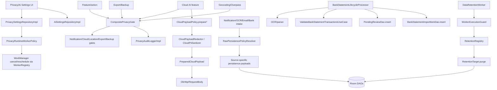

<p8-master-implementation-plan.md>
# Pipeline 8 — Privacy / AI / Redaction Master Implementation Plan

## 1. Executive summary

Repository: `https://github.com/panospao7/Cost-agregator`  
Pinned commit: `83b798e849b4408b2bf683f52cb2746d37f7af16`  
Pipeline: **P8 — Privacy / AI / Redaction**

Build/test status: **NOT RUN**

Reason:
- This plan is based on remote static review plus prior P8 audit context.
- No local terminal was available to run `git rev-parse HEAD`, `rg`, or Gradle.

Static review completed: **yes, partial source-backed review**

Mandatory first command for implementation agent:

```bash
git rev-parse HEAD
```

Expected output:

```text
83b798e849b4408b2bf683f52cb2746d37f7af16
```

If different, stop.

Current state:
- P8 source is newer than the consolidated tracker. Several items marked TODO/open are already partially or fully implemented.
- Existing source includes newer privacy primitives:
  - `PreparedCloudPayload`
  - `CloudPayloadPolicy`
  - `DefaultCloudPayloadRedactor`
  - `EffectiveCloudAiPolicy`
  - `PrivacyAuditContext`
  - `SafePrivacyMetadata`
  - `RawPersistencePolicyResolver`
  - source-specific raw persistence payloads
  - `RetentionRegistry`
  - `PrivacyBlocked`
  - `scripts/verify_privacy_boundaries.py`
- However, P8 still has production privacy risks in real call paths.

Production risk:
- **P1:** bank-statement import persists raw merchant text into `PendingReview.notificationText` and `BankStatementImportItem.merchant` before retention purge.
- **P1:** cloud “redaction” is still too regex/pattern-based for some purposes and may send merchant/item/category/amount/date details when `redactBeforeCloud=true`.
- **P1/P2:** retention targets in `RetentionModule` use `runCatching`, swallowing `CancellationException`.
- **P2:** `PrivacyAuditLoggerImpl` accepts raw `Map<String,String>` context and allowlists keys without value redaction.
- **P2:** `DefaultCloudPayloadPolicy.prepareText()` prepares payloads even when cloud is disabled unless caller separately gates.
- **P2:** nullable OCR/raw semantics are not consistently used in the bank statement path.
- **P2:** diagnostics/sanitizers still need stronger coverage for URLs/API keys/Greek tax IDs and value-level audit checks.

Implementation strategy:
1. Verify exact commit and source inventory.
2. Fix actual privacy leaks first; do not reimplement already-fixed tracker items.
3. Preserve architecture contracts:
   - privacy decisions through `PrivacyGate` / `CompositePrivacyGate`;
   - cloud text/images through `CloudPayloadPolicy` + `PreparedCloudPayload`;
   - raw content writes through `RawPersistencePolicyResolver` and source-specific payloads;
   - durable privacy audit through sanitized context only;
   - retention through `DataRetentionWorker`, `RetentionRegistry`, and `WorkerExecutionGuard`.
4. Add tests and static guards before docs sync.
5. No Room schema migration by default.

Recommended verdict before implementation: **RED**.

---

## 2. Scope

### In scope

- Privacy settings and AI settings consistency.
- Privacy gate fail-closed behavior.
- Cloud AI payload preparation/redaction.
- Bank statement AI prompt and persistence path.
- Raw notification/OCR/email/bank write-time sanitization.
- Data retention worker and target behavior.
- Privacy audit context safety.
- Sensitive diagnostics/logging redaction.
- Export/backup raw-data privacy gates.
- Location/geocoding network privacy gates.
- UI privacy-denied state verification.
- Hilt binding verification for privacy/AI/retention.
- P8 tracker/docs sync after code/tests pass.

### Out of scope

- Broad AI provider rewrite.
- New cloud provider integrations.
- Product-level redesign of bank import UX.
- Room schema migration unless explicitly required.
- Rewriting all diagnostics infrastructure unless P8 static guards prove unsafe.
- Fixing non-P8 lifecycle bugs unless they cause privacy bypasses.

### Assumptions

- Pipeline 8 means **Privacy / AI / Redaction** in this repository.
- Architecture docs are normative unless contradicted by current code.
- Code at the pinned SHA is source of truth.
- If privacy is uncertain, fail closed.
- “Retention will purge later” is not acceptable where policy requires write-time redaction/drop.
- Debug-only paths still need privacy gates and release inaccessibility.

### Stop conditions

Stop before editing if:
- `git rev-parse HEAD` does not match the pinned SHA.
- baseline build fails for unrelated reasons.
- a fix requires a Room schema change not approved by the user.
- full source inventory finds a different primary P8 implementation than the reviewed files.
- cloud/network callers bypass `PreparedCloudPayload` in a way that requires broad API redesign.
- tests reveal existing baseline failures that prevent P8 isolation.

---

## 3. Source/doc reconciliation

Sources reviewed or used as starting points:
- `docs/analyses and debug master/PIPELINE_8_CONSOLIDATED_ISSUES.md`
- `docs/analyses and debug master/PIPELINE_8_IMPLEMENTATION_PLAN.md`
- `docs/architecture/PRIVACY_UI_ARCHITECTURE.md`
- `docs/architecture/SENSITIVE_DIAGNOSTICS_POLICY.md`
- `app/src/main/java/.../data/privacy/PrivacySettingsRepositoryImpl.kt`
- `app/src/main/java/.../domain/receipt/lifecycle/BankStatementLifecycleProcessor.kt`
- `app/src/main/java/.../di/RetentionModule.kt`
- `app/src/main/java/.../data/privacy/DataRetentionWorker.kt`
- `app/src/main/java/.../data/privacy/DefaultCloudPayloadPolicy.kt`
- `app/src/main/java/.../data/privacy/PrivacyAuditLoggerImpl.kt`
- `app/src/main/java/.../domain/privacy/CompositePrivacyGate.kt`

| Area / Issue | Pipeline doc claim | Master tracker claim | Source-code truth | Status | Evidence |
|---|---|---|---|---|---|
| P8-P1-01 privacy changes stop/cancel workers | Fixed | Fixed/unknown | `PrivacySettingsRepositoryImpl.updateSettings()` uses `settingsMutex`, compares old/persisted settings, cancels/reschedules via `PrivacyRuntimeWorkerPolicy` + `WorkerRegistry`. | FIXED_NEEDS_TEST | `PrivacySettingsRepositoryImpl.updateSettings`, `applyPrivacyChange`. |
| P8-P1-02 `PrivacySettings` and `AiSettings` disagree | TODO | TODO | `EffectiveCloudAiPolicy` exists, but `DefaultCloudPayloadPolicy.prepareText()` resolves policy only for redaction and does not itself block if cloud disabled. AI settings corruption behavior needs verification. | PARTIALLY_FIXED | `DefaultCloudPayloadPolicy.prepareText`; `EffectiveCloudAiPolicy` to verify locally. |
| P8-P1-03 noisy/imprecise audit | TODO | TODO | `CompositePrivacyGate` audits final decision once; `PrivacyAuditLoggerImpl` adds capability description. | PARTIALLY_FIXED | `CompositePrivacyGate.check`; `PrivacyAuditLoggerImpl.logDecision`. |
| P8-P1-04 audit context stores sensitive data | TODO | TODO | Raw `Map<String,String>` is still public; logger allowlists keys and length but not value content. | OPEN/PARTIAL | `PrivacyAuditLoggerImpl.sanitizeContext`. |
| P8-P1-05 raw data stored first, purged later | Partial | Partial | Source-specific payloads exist, but bank statement path writes raw `tx.merchant` into `PendingReview.notificationText` and `BankStatementImportItem.merchant`. | OPEN | `BankStatementLifecycleProcessor.processBankStatement`. |
| P8-P1-06 retention scope incomplete | TODO | TODO | `RetentionModule` registers many targets beyond raw notification/OCR. | PARTIALLY_FIXED | Targets include AI artifacts/chat, email, diagnostics, pending reviews, background job errors, bank items. |
| P8-P1-07 bank-statement cloud path sends raw prompt | TODO | TODO | Bank cloud path appears to use `prepareBankStatementValidation()` which is strict-redacted, but caller uses `runCatching` and must be fully verified. | FIXED/PARTIAL | `DefaultCloudPayloadPolicy.prepareBankStatementValidation`; `ValidateBankStatementTransactionsUseCase` needs local open. |
| P8-P1-08 no formal payload contract | TODO | TODO | `CloudPayloadPolicy`, `PreparedCloudPayload`, and redactor exist. | PARTIALLY_FIXED | `DefaultCloudPayloadPolicy`; full cloud caller RG required. |
| P8-P1-09 notification gate too late | TODO | TODO | `NotificationCaptureGate` exists per prior source context; callers must be verified. | PARTIALLY_FIXED_NEEDS_RG | Run notification RG. |
| P8-P1-10 geocoding gate not statically guaranteed | TODO | TODO | Reviewed providers gate; static `verify_privacy_boundaries.py` exists. | FIXED_NEEDS_CI | Run static script and provider RG. |
| P8-P1-11 raw backup/export reachable | TODO | TODO | `ExportPrivacyGate`/`BackupPrivacyGate` exist; P7/P12 callers need verification. | PARTIALLY_FIXED_NEEDS_RG | Run export/backup capability RG. |
| P8-P1-12 denied states not visible | TODO | TODO | `PrivacyBlocked` exists and UI architecture requires it; UI source not fully verified. | PARTIALLY_FIXED_NEEDS_UI_RG | Run UI RG. |
| NEW-P8-001 settings update TOCTOU | Open | Open | `settingsMutex.withLock` serializes update. | FIXED/TRACKER_DRIFT | `PrivacySettingsRepositoryImpl`. |
| NEW-P8-002 retention no per-target checkpoint | Open | Open | `DataRetentionWorker` has deterministic target order and checkpoint prefs. | PARTIALLY_FIXED | Checkpoint cleared even with target failures; result semantics weak. |
| NEW-P8-003 merchant regex overmatches | Open | Open | Redactor reportedly tightened; needs direct tests. | NEEDS_RUNTIME_VERIFICATION | Run sanitizer tests/RG. |
| NEW-P8-004 PII sanitizer missing patterns | Open | Open | Some patterns added, but gaps remain for Greek AFM/API keys/URLs/addresses. | PARTIALLY_FIXED | Sanitizer source/tests need full open. |
| NEW-P8-005 `requireAllowed()` ignores capability | Open | Open | Composite gate is capability-aware; payload policy does not require capability in `prepareText`. | PARTIALLY_FIXED | `DefaultCloudPayloadPolicy.prepareText`. |
| NEW-P8-006 retention swallows purge failures | Open | Open | Worker catches target failures; targets in `RetentionModule` use `runCatching`, swallowing CE. | OPEN | `RetentionModule.provideRetentionTargets`. |
| NEW-P8-007 `sanitizeRawOcr` conflates null/empty | Open | Open | Nullable sanitizer exists, but bank statement path still uses non-null sanitizer and empty string behavior. | PARTIALLY_FIXED | `BankStatementLifecycleProcessor` + `RawContentSanitizer` verify locally. |
| NEW-P8-008 redaction detector misses truncation | Open | Open | Reportedly fixed; tests need verification. | FIXED_NEEDS_TEST | Run redaction detector tests. |

---

## 4. Architecture contracts for this pipeline

| Contract | Required legal path | Current code | Gap | Fix required |
|---|---|---|---|---|
| Privacy settings update | UI/ViewModel → `PrivacySettingsRepository.updateSettings()` → DataStore transaction/mutex → worker policy | Mutex + persisted old/new comparison present. | AI settings repository consistency/corruption needs verification. | Add concurrency + AI consistency tests. |
| Privacy gate decision | Caller → `CompositePrivacyGate.check(capability, context)` → concrete gate → final audit | Composite fail-closes for handled capabilities and audits once. | Raw context remains unsafe; unhandled local-only default allowed needs policy tests. | Harden context and add capability coverage guard. |
| Cloud payload | Caller → `PrivacyGate` + `CloudPayloadPolicy` → `PreparedCloudPayload` → HTTP request | Major contracts exist. | Payload policy does not fail when cloud disabled; full caller coverage unknown. | Require capability/effective policy at payload-prep boundary; static guard. |
| Raw persistence | Intake/lifecycle → `RawPersistencePolicyResolver` → source-specific payload → DAO | Payload contracts exist. | Bank statement lifecycle bypasses with raw merchant writes. | Route bank statement writes through `BankTransactionPersistencePayload` or equivalent sanitized fields. |
| Retention | `DataRetentionWorker` → `WorkerExecutionGuard` → `RetentionRegistry` targets | Worker guarded/checkpointed. | Target `runCatching` swallows CE; failure semantics weak. | Replace with CE-safe helpers and retry/partial-failure policy. |
| Privacy audit | `PrivacyAuditLogger` with typed/safe metadata | Logger persists sanitized-ish map. | Value-level redaction absent; typed metadata may be dropped. | Enforce `PrivacyAuditContext`/`SafePrivacyMetadata` values. |
| Diagnostics/logging | Durable diagnostics must sanitize raw PII | Sanitizers exist. | Full `Timber/Log` inventory not run; sanitizer missing patterns. | Add guard/tests and sanitizer patterns. |
| Backup/export | Export/backup features check `ExportPrivacyGate`/`BackupPrivacyGate` | Gates exist. | P7/P12 runtime call paths need verification. | Add integration tests + static capability guard. |
| Location/geocoding | Every external provider checks `LocationPrivacyGate` before network | Reviewed providers did; static script exists. | CI execution not verified. | Run/add script to tests/CI. |
| UI denial | ViewModel exposes typed `PrivacyBlocked`, UI renders denied card | Contracts/classes exist. | UI not fully inventoried. | Add ViewModel/UI tests. |
| Restore/write barrier | P8 DB writes respect `DatabaseWriteBarrier`; workers blocked during restore | Retention uses worker guard; bank lifecycle uses write barrier. | Direct DAO write inventory incomplete. | Add architecture guard. |

---

## 5. Current runtime flow



Critical observed bad flow:

```text
BankStatementLifecycleProcessor.processBankStatement()
  -> parsed tx.merchant
  -> PendingReview.notificationText = "Imported from statement: ${tx.merchant}"
  -> BankStatementImportItem(merchant = tx.merchant)
  -> RetentionModule later redacts bank_statement_import_items.merchant
```

This violates write-time raw-storage policy because raw merchant text is stored before retention.

---

## 6. Implementation phases

### PR 0 — Verification and inventory

Goal:
- Confirm exact checkout and build a complete P8 inventory before edits.

Risk:
- None.

Files:
- No source changes.

Work items:
- Run all discovery commands in section 11.
- Record baseline Gradle status.
- Build direct DAO mutation inventory.
- Build cloud/network caller inventory.
- Build raw storage write-site inventory.
- Build UI denied-state inventory.

Tests:
- Existing tests only.

Acceptance criteria:
- SHA verified.
- Current test baseline documented.
- Unexpected drift reported before PR 1.

---

### PR 1 — Critical raw-storage correctness: bank statement path

Goal:
- Stop raw bank statement merchant data from being persisted when policy says redacted/drop.

Risk:
- High privacy impact; medium functional risk for dedupe/review UX.

Files:
- `domain/receipt/lifecycle/BankStatementLifecycleProcessor.kt`
- `domain/privacy/BankTransactionPersistencePayload.kt`
- `domain/privacy/RawPersistencePolicyResolver.kt`
- `domain/privacy/RawContentSanitizer.kt`
- `data/database/entity/PendingReview.kt` only if existing fields require no schema change
- `data/database/entity/BankStatementImportItem.kt` only if no schema change
- tests

Work items:
- P8-WI-001: sanitize bank statement merchant before `PendingReview.notificationText`.
- P8-WI-002: sanitize/redact/drop `BankStatementImportItem.merchant` at write time.
- P8-WI-003: use nullable raw OCR sanitizer in bank statement receipt write.
- P8-WI-004: add integration tests for `DO_NOT_STORE` and `STORE_REDACTED`.

Tests:
- `bank_statement_do_not_store_does_not_persist_raw_merchant`
- `bank_statement_redacted_mode_writes_redacted_merchant`
- `pending_review_notification_text_omits_raw_statement_merchant`
- `bank_statement_raw_ocr_null_distinct_from_empty_or_dropped`
- `bank_statement_duplicate_rows_do_not_store_raw_merchant`

Acceptance criteria:
- No raw `tx.merchant` is written into `PendingReview.notificationText`.
- No raw `tx.merchant` is written into `BankStatementImportItem.merchant` unless `RawStorageMode.STORE_RAW`.
- Dedupe still uses non-sensitive `merchantKey`/fingerprint.
- Existing bank import functionality remains intact.

---

### PR 2 — Cloud payload fail-closed and semantic redaction

Goal:
- Ensure cloud payload preparation cannot be used without capability policy and semantic redaction.

Risk:
- Medium/high; may change AI prompt content and results.

Files:
- `domain/privacy/CloudPayloadPolicy.kt`
- `data/privacy/DefaultCloudPayloadPolicy.kt`
- `domain/privacy/EffectiveCloudAiPolicy.kt`
- `data/privacy/DefaultCloudPayloadRedactor.kt`
- `data/privacy/CloudPiiSanitizer.kt`
- all cloud providers found by RG:
  - `CloudReceiptAssistService.kt`
  - `CloudReceiptItemCategorizationService.kt`
  - `CloudWarrantyExtractionService.kt`
  - `Hybrid*Service.kt`
  - `ValidateBankStatementTransactionsUseCase.kt`
  - any OkHttp/Gemini/OpenAI caller
- tests

Work items:
- P8-WI-005: add capability argument to payload preparation or require purpose-to-capability mapping internally.
- P8-WI-006: make `DefaultCloudPayloadPolicy` fail closed if effective policy disallows requested capability/cloud.
- P8-WI-007: remove/guard raw text convenience overloads.
- P8-WI-008: add purpose-specific semantic redaction for merchant/category/item/amount/date where policy requires.
- P8-WI-009: rethrow `CancellationException` in cloud/AI providers and bank validation path.

Tests:
- `cloud_payload_policy_fails_when_cloud_disabled`
- `cloud_payload_policy_checks_specific_capability`
- `cloud_call_requires_prepared_payload`
- `raw_prompt_cloud_overload_unreachable_or_test_only`
- `receipt_item_categorization_redaction_removes_raw_merchant`
- `receipt_assist_redaction_removes_raw_item_names_when_required`
- `bank_statement_cloud_prompt_is_redacted`
- `cloud_providers_rethrow_cancellation`

Acceptance criteria:
- A cloud provider cannot obtain a `PreparedCloudPayload` when cloud/capability is denied.
- Every HTTP request body derives from `PreparedCloudPayload`.
- Redacted mode removes or pseudonymizes merchant/item/category fields as required by purpose.
- `CancellationException` is never swallowed.

---

### PR 3 — Retention worker correctness and cancellation

Goal:
- Make retention cancellation, per-target failure, and checkpoint semantics correct.

Risk:
- Medium; affects background cleanup and worker retry behavior.

Files:
- `di/RetentionModule.kt`
- `data/privacy/DataRetentionWorker.kt`
- `domain/privacy/RetentionTarget.kt`
- `domain/privacy/RetentionRegistry.kt`
- worker tests

Work items:
- P8-WI-010: replace `runCatching` in retention targets with explicit `try/catch` that rethrows CE.
- P8-WI-011: introduce helper `safeRetentionTarget(name) { ... }` to avoid repeated unsafe patterns.
- P8-WI-012: define target-failure semantics: failed target should either return WorkManager retry or

:warning: The provider stream ended early, so this response may be incomplete.