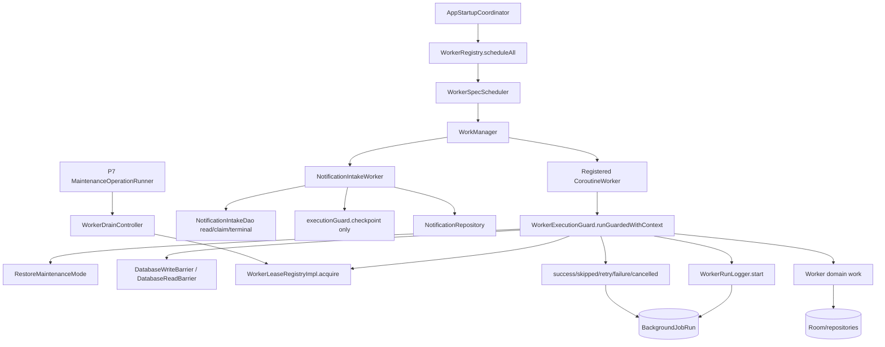

# Pipeline 9 — Workers / Background Jobs Master Implementation Plan

## 1. Executive summary

Current state: Pipeline 9 is substantially implemented at commit `83b798e849b4408b2bf683f52cb2746d37f7af16`, but tracker/docs are not fully reliable. The consolidated P9 issue doc claims **23 fixed, 1 partial, 0 open**, with only `NEW-P9-008` partial. Source review shows several items are genuinely fixed, but there are still production-relevant gaps around worker drain, bespoke notification intake, one-shot scheduling, and run-ledger idempotency.

Build/test status: **NOT RUN**

Reason:
- This plan is based on remote/static review.
- No local checkout/terminal was available for `git rev-parse HEAD`, `rg`, or Gradle.

Static review completed: **yes, partial source-backed review**

Key source evidence:
- P9 issue doc: https://raw.githubusercontent.com/panospao7/Cost-agregator/83b798e849b4408b2bf683f52cb2746d37f7af16/docs/analyses%20and%20debug%20master/PIPELINE_9_CONSOLIDATED_ISSUES.md
- `WorkerLeaseRegistryImpl.kt`: https://raw.githubusercontent.com/panospao7/Cost-agregator/83b798e849b4408b2bf683f52cb2746d37f7af16/app/src/main/java/com/yourname/expensetracker/domain/workers/WorkerLeaseRegistryImpl.kt
- `NotificationIntakeWorker.kt`: https://raw.githubusercontent.com/panospao7/Cost-agregator/83b798e849b4408b2bf683f52cb2746d37f7af16/app/src/main/java/com/yourname/expensetracker/worker/NotificationIntakeWorker.kt
- `WorkerSpecScheduler.kt`: https://raw.githubusercontent.com/panospao7/Cost-agregator/83b798e849b4408b2bf683f52cb2746d37f7af16/app/src/main/java/com/yourname/expensetracker/domain/workers/WorkerSpecScheduler.kt
- `WorkerRunLogger.kt`: https://raw.githubusercontent.com/panospao7/Cost-agregator/83b798e849b4408b2bf683f52cb2746d37f7af16/app/src/main/java/com/yourname/expensetracker/domain/workers/WorkerRunLogger.kt
- `WorkerRegistry.kt`: https://raw.githubusercontent.com/panospao7/Cost-agregator/83b798e849b4408b2bf683f52cb2746d37f7af16/app/src/main/java/com/yourname/expensetracker/domain/workers/WorkerRegistry.kt
- `DataRetentionWorker.kt`: https://raw.githubusercontent.com/panospao7/Cost-agregator/83b798e849b4408b2bf683f52cb2746d37f7af16/app/src/main/java/com/yourname/expensetracker/data/privacy/DataRetentionWorker.kt
- `DailyBriefingWorker.kt`: https://raw.githubusercontent.com/panospao7/Cost-agregator/83b798e849b4408b2bf683f52cb2746d37f7af16/app/src/main/java/com/yourname/expensetracker/data/ai/worker/DailyBriefingWorker.kt
- `BillReminderWorker.kt`: https://raw.githubusercontent.com/panospao7/Cost-agregator/83b798e849b4408b2bf683f52cb2746d37f7af16/app/src/main/java/com/yourname/expensetracker/service/reminder/BillReminderWorker.kt
- `ReceiptMatchingWorker.kt`: https://raw.githubusercontent.com/panospao7/Cost-agregator/83b798e849b4408b2bf683f52cb2746d37f7af16/app/src/main/java/com/yourname/expensetracker/service/receiptmatching/ReceiptMatchingWorker.kt

Production risk:
- **P1:** worker drain can miss active work because `WorkerLeaseRegistryImpl` tracks only one lease per worker name.
- **P1:** `NotificationIntakeWorker` is a DB-writing worker but does not use full `runGuarded` / `runGuardedWithContext`, does not acquire a lease, and reads from `NotificationIntakeDao` before barrier/guard.
- **P2:** one-shot spec version changes are documented as forced update/replace, but source uses `ExistingWorkPolicy.KEEP`.
- **P2:** `WorkerRunLogger.Handle` terminal idempotency uses `get()` then `set(true)`, not atomic `compareAndSet`.
- **P2:** `DataRetentionWorker` soft-succeeds with failed targets and clears checkpoints.
- **P2:** `DailyBriefingWorker` logs reschedule failure but returns the prior worker result, risking a dead midnight chain.
- **P2/P3:** `WorkerRegistry.scheduleAll()` swallows scheduling failures with no log/diagnostic.

Implementation strategy:
1. Verify exact checkout and test baseline.
2. Fix restore/drain correctness first.
3. Bring `NotificationIntakeWorker` under a tested guard/lease contract.
4. Fix scheduler and run-ledger race issues.
5. Harden worker-specific partial failures.
6. Add architecture guards so new workers cannot bypass P9 contracts.
7. Update stale docs only after code and tests pass.

Recommended verdict before implementation: **RED / high YELLOW**.

---

## 2. Scope

### In scope

- `WorkerExecutionGuard`, `WorkerGuardRequest`, `WorkerGuardResult`, `toWorkerResult`.
- `WorkerRunContext`, `WorkerRunLogger`, `BackgroundJobRun`.
- `WorkerLeaseRegistry`, `WorkerLeaseRegistryImpl`, `WorkerDrainController`.
- `WorkerSpec`, `WorkerSpecScheduler`, `WorkerRegistry`.
- Registered workers:
  - `DataRetentionWorker`
  - `LocationBackfillWorker`
  - `MerchantKeyBackfillWorker`
  - `BillReminderWorker`
  - `ReceiptMatchingWorker`
  - `DailyBriefingWorker`
  - `WarrantyExpirationWorker`
- Bespoke worker:
  - `NotificationIntakeWorker`
- Startup and restore integration:
  - `AppStartupCoordinator`
  - `RestoreMaintenanceMode`
  - `MaintenanceOperationRunner`
- Privacy runtime cancellation/reschedule checks.
- Worker DAO writes and run-ledger writes.
- Tests, static guards, and tracker/docs sync.

### Out of scope

- Broad rewrite of WorkManager architecture.
- Changing domain semantics of notification parsing, receipt matching, recurring reminders, or warranties unless required for worker safety.
- New DB schema unless a test proves `BackgroundJobRun`/worker ledger cannot represent needed state.
- P8 retention target content fixes except worker-level retry/cancellation/checkpoint behavior.
- P7 restore file-swap logic except worker drain interaction.

### Assumptions

- Pipeline 9 means **Workers / Background Jobs** in this repo, despite generic prompt examples listing P9 as analytics.
- Code at the pinned SHA is source of truth.
- `NotificationIntakeWorker` may remain bespoke and outside `WorkerRegistry`, but only if it has equivalent lease/barrier/run-ledger guarantees and tests.
- Background writes during restore/backup maintenance are P1/P0-risk and must fail closed.
- No worker should swallow `CancellationException`.
- P9 fixes should not weaken privacy gates, notification permission gates, or restore barriers.

### Stop conditions

Stop before editing if:
- `git rev-parse HEAD` does not equal `83b798e849b4408b2bf683f52cb2746d37f7af16`.
- baseline `:app:assembleDebug` fails for unrelated reasons.
- full `rg` finds additional Worker subclasses not in the plan.
- `NotificationIntakeWorker` cannot be wrapped in guard/lease without changing notification pipeline semantics; report before refactor.
- WorkManager API version lacks a safe one-shot replacement policy; propose a scheduler-specific design before changing.
- any fix requires a Room migration.

---

## 3. Source/doc reconciliation

| Area / Issue | Pipeline doc claim | Master tracker claim | Source-code truth | Status | Evidence |
|---|---|---|---|---|---|
| P9-P1-01 `BackgroundJobRun` unused | Fixed | Fixed | Registered workers use `WorkerExecutionGuard`, which starts `WorkerRunLogger`; `NotificationIntakeWorker` does not. | PARTIALLY_FIXED | `WorkerExecutionGuard.runGuarded*`; `NotificationIntakeWorker.doWork`. |
| P9-P1-02 no shared guard | Fixed | Fixed | Seven registered workers use guard; `NotificationIntakeWorker` only calls `executionGuard.checkpoint()`. | PARTIALLY_FIXED | `NotificationIntakeWorker` imports guard but not `runGuarded*`. |
| P9-P1-03 restore/backup cancellation not running-worker barrier | Fixed | Fixed | Lease/drain exists, but `WorkerLeaseRegistryImpl.activeLeases` is `workerName -> lease`; same-name workers overwrite. Intake worker has no lease. | OPEN/PARTIAL | `WorkerLeaseRegistryImpl.acquire`, `close`. |
| P9-P1-04 daily briefing chain breaks | Fixed | Fixed | Worker reschedules after success/skip, but reschedule failure is logged and previous result returned. | PARTIALLY_FIXED | `DailyBriefingWorker.doWork`, `runCatching { aiWorkScheduler.scheduleDailyBriefing() }`. |
| P9-P1-05 bill reminder disabled | Fixed | Fixed | `WorkerSpec.DEFAULTS["bill_reminder_periodic"].enabled = true`; comment still says disabled by default. | FIXED + STALE_COMMENT | `WorkerSpec.DEFAULTS`. |
| P9-P1-06 bill reminders exactly-once | Fixed | Fixed | Worker claims before notify and revalidates after claim. | FIXED_NEEDS_TEST | `BillReminderWorker.doWork`. |
| P9-P1-07 receipt `runOnce` bypass | Fixed | Fixed | Data-layer claim prevents duplicate linking, but overlapping same-name leases affect drain. | PARTIALLY_FIXED | `ReceiptMatchingWorker` comment says per-receipt claim is safety net. |
| P9-P1-08 receipt matching outcomes durable | Fixed | Fixed | Worker records match attempted/skipped/not found/link failed via match service. | FIXED_NEEDS_TEST | `ReceiptMatchingWorker.safeRecordMatchEvent`. |
| P9-P1-09 warranty sent-state outside DB | Fixed | Fixed | Source indicates warranty worker uses durable delivery DAO/state and `TimeProvider`. | FIXED_NEEDS_RG | Open full DAO/tests locally. |
| P9-P1-10 pause/resume hardcoded/asymmetric | Fixed | Fixed | `WorkerRegistry.entries` centralizes seven workers; `NotificationIntakeWorker` is bespoke. | PARTIALLY_FIXED | `WorkerRegistry.entries`. |
| P9-P1-11 privacy changes do not cancel workers | Fixed | Fixed | Claimed via `PrivacyRuntimeWorkerPolicy`; not reopened in this plan. | NEEDS_RUNTIME_VERIFICATION | Run privacy worker policy RG/tests. |
| P9-NEW-03 zero counts | Fixed | Fixed | Registered workers use `WorkerRunContext`; intake has no `BackgroundJobRun`. | PARTIALLY_FIXED | `runGuardedWithContext`; `NotificationIntakeWorker`. |
| NEW-P9-001 timeout misclassified | Fixed | Fixed | Guard checks `TimeoutCancellationException` before generic CE. | FIXED_NEEDS_TEST | `WorkerExecutionGuard`. |
| NEW-P9-002 bill settings/quiet-hours bypass guard | Fixed | Fixed | Settings/quiet-hours inside `runGuardedWithContext`. | FIXED | `BillReminderWorker.doWork`. |
| NEW-P9-003 counters not thread-safe | Fixed | Fixed | `WorkerRunContext` uses atomic counters per prior review; must verify tests. | FIXED_NEEDS_TEST | Open `WorkerRunContext.kt`. |
| NEW-P9-004 warranty no context | Fixed | Fixed | Claimed fixed; must verify full file. | FIXED_NEEDS_RG | Run RG/open worker. |
| NEW-P9-005 warranty `System.currentTimeMillis` | Fixed | Fixed | Claimed fixed with `TimeProvider`; must verify. | FIXED_NEEDS_RG | Run RG. |
| NEW-P9-006 scheduler deprecated `REPLACE` | Fixed | Fixed | Periodic path uses `UPDATE`, but one-shot version bump logs “forcing UPDATE” and uses `ExistingWorkPolicy.KEEP`. | OPEN/PARTIAL | `WorkerSpecScheduler.scheduleFromSpec`, `scheduleAtMidnight`. |
| NEW-P9-007 version write atomicity | Fixed | Fixed | Version written after enqueue inside try. | FIXED | `WorkerSpecScheduler`. |
| NEW-P9-008 notification intake not full guard | Partial | Partial | Still partial and higher risk: no lease, no run ledger, DAO read before barrier. | OPEN/P1 | `NotificationIntakeWorker.doWork`. |
| NEW-P9-009 location `isStopped` success | Fixed | Fixed | Claimed fixed; needs focused test. | FIXED_NEEDS_TEST | Open worker locally. |
| NEW-P9-010 merchant `isStopped` success | Fixed | Fixed | Claimed fixed; needs focused test. | FIXED_NEEDS_TEST | Open worker locally. |
| NEW-P9-011 midnight delay edge | Fixed | Fixed | `maxOf(rawDelayMs, 60_000L)` present. | FIXED | `WorkerSpecScheduler.scheduleAtMidnight`. |
| NEW-P9-012 daily reschedule swallowed | Fixed | Fixed | Source logs reschedule failure but returns prior result. | PARTIALLY_FIXED | `DailyBriefingWorker.doWork`. |
| NEW-P9-013 read-only guard exception handling | Fixed | Fixed | Guard catches read-barrier exceptions. | FIXED_NEEDS_TEST | `WorkerExecutionGuard`. |
| NEW-P9-014 merchant battery constraint | Fixed | Fixed | `setRequiresBatteryNotLow(true)` present for merchant one-shot. | FIXED | `WorkerSpec.DEFAULTS`. |
| NEW-P9-015 handle idempotency | Fixed | Fixed | Uses `AtomicBoolean`, but with non-atomic `get()` then `set(true)`. | PARTIALLY_FIXED | `WorkerRunLogger.Handle`. |

Existing tests: **NEEDS_VERIFICATION**

Command:
```bash
rg -n "Worker|WorkManager|WorkerExecutionGuard|WorkerRun|WorkerSpec|WorkerRegistry|WorkerLease|BackgroundJobRun|DataRetention|BillReminder|DailyBriefing|LocationBackfill|MerchantKeyBackfill|ReceiptMatching|WarrantyExpiration|NotificationIntake|Scheduler|Guard|Drain|Maintenance" app/src/test app/src/androidTest
```

---

## 4. Architecture contracts for this pipeline

| Contract | Required legal path | Current code | Gap | Fix required |
|---|---|---|---|---|
| Registered worker lifecycle | WorkManager → Worker `doWork()` → `WorkerExecutionGuard.runGuardedWithContext` → lease → write/read barrier → run logger → domain work | Mostly present for 7 registered workers. | Must verify every Worker subclass. | Add Worker subclass guard test. |
| Worker drain before backup/restore | P7 `MaintenanceOperationRunner` → `WorkerDrainController.requestStopAndAwaitDrain` → all active leases drained | Drain sees only `activeLeases`. | Same-name active workers overwrite; intake has no lease. | P9-WI-001, P9-WI-002. |
| Bespoke notification intake | WorkManager one-shot per intake row → barrier/lease/run ledger → notification repository pipeline | Current: DAO read first, `writesAllowed`, checkpoint only. | Missing full guard/lease/run ledger/read barrier before first DAO read. | P9-WI-002. |
| Run logging | Every guarded run records RUNNING and one terminal state | Registered workers use logger. | Handle terminal race; intake no background run row. | P9-WI-004, P9-WI-002. |
| Scheduler/spec ownership | `WorkerSpec.DEFAULTS` + `WorkerRegistry.entries` are single source | Seven registered workers present. | One-shot version change uses KEEP despite comment saying update/replace. | P9-WI-003. |
| Startup scheduling | `AppStartupCoordinator` schedules via `WorkerRegistry.scheduleAll` when writes allowed | Present. | `scheduleAll` swallows failures silently. | P9-WI-008. |
| Restore scheduling | Restore exit/startup use same registry | Mostly present. | Bespoke intake not registry-managed; acceptable only if documented/tested. | P9-WI-002, P9-WI-010. |
| Privacy-gated workers | Guard `requiredCapabilities` where needed | Location/daily briefing use capability; retention allowed. | Full RG required; notification intake privacy belongs P1/P8. | Guard test. |
| Notification permission | Guard can skip before work when `requiresNotificationPermission=true` | Warranty likely uses it; bill reminder handles permission after claim. | Bill reminder may mark deliveries failed instead of guard-skipped. | P9-WI-007. |
| CE propagation | Workers must rethrow `CancellationException` | Reviewed registered workers mostly do. | Full RG still required. | CE guard test. |
| Diagnostics/privacy | Background errors sanitized | `WorkerRunLogger` uses `EventMetadataSanitizer`. | Scheduler failure not durable; raw log inventory needed. | P9-WI-008 + RG. |

### Pipeline-specific checklist

Entry points:
- UI/ViewModel entry points: none primary; settings/privacy may reschedule/cancel workers.
- Worker entry points: all `CoroutineWorker.doWork()` methods.
- Repository entry points: domain repositories used by workers.
- Coordinator/service entry points:
  - `RecurringLifecycleCoordinator`
  - `ReceiptLinkService`
  - `ReceiptMatchLifecycleService`
  - `GenerateDashboardBriefingUseCase`
  - retention targets
- Import/external source entry points:
  - notification intake
  - receipt matching
  - AI daily briefing
  - location backfill

Core owner:
- Legal lifecycle owner: `WorkerExecutionGuard` + worker-specific domain coordinators.
- Direct collaborators: `WorkerRegistry`, `WorkerSpecScheduler`, `WorkerLeaseRegistryImpl`, `WorkerRunLogger`.
- Event writer: `WorkerRunLogger` / `BackgroundJobRunDao`, plus pipeline-specific diagnostics.
- DAO owner: each worker’s repository/coordinator owns domain DAO writes.
- Side-effect dispatcher/planner: worker-specific services, after claims where needed.

Persistence:
- Entities:
  - `BackgroundJobRun`
  - `NotificationIntakeEntity`
  - `RecurringReminderDelivery`
  - `WarrantyReminderDelivery`
  - receipt match/link/event entities
  - privacy audit / retention target tables
- DAOs:
  - `BackgroundJobRunDao`
  - `NotificationIntakeDao`
  - reminder/warranty/receipt/privacy DAOs
- Migrations: must inspect `DatabaseMigrations.kt`; no new migration planned.
- Schema version: NEEDS_VERIFICATION.
- Indexes/constraints: claim/terminal transitions must be verified in DAOs.

Audit / diagnostics:
- Lifecycle event table/entity: worker run ledger + domain-specific receipt/reminder/warranty events.
- Diagnostic event table/entity: pipeline diagnostic/event writer where used.
- Required terminal events: every guarded run exactly one terminal status.
- Missing event cases: notification intake run ledger; scheduler failure diagnostics.

Barriers:
- Write barrier locations: `WorkerExecutionGuard`, `NotificationIntakeWorker.writeBarrier` currently after first read.
- Read barrier locations: `WorkerExecutionGuard` read-only path.
- Maintenance/debug exceptions: read-only backup export allowed only if explicitly requested.
- Blocked-write behavior: registered workers skip/retry through guard; intake should retry before any DAO read.

Tests:
- Existing unit tests: NEEDS_VERIFICATION.
- Existing contract tests: NEEDS_VERIFICATION.
- Existing architecture tests: NEEDS_VERIFICATION.
- Existing androidTest tests: NEEDS_VERIFICATION.
- Missing tests listed in section 10.

---

## 5. Current runtime flow



Critical current flows to change:
1. `WorkerLeaseRegistryImpl.acquire(workerName)` writes `activeLeases[workerName] = lease`, so concurrent same-name leases overwrite.
2. `NotificationIntakeWorker.doWork()` reads `intakeDao.getById(intakeId)` before barrier/guard and does not acquire a lease.
3. `WorkerSpecScheduler` logs one-shot version bump as “forcing UPDATE” but uses `ExistingWorkPolicy.KEEP`.
4. `WorkerRunLogger.Handle` terminal methods are not atomic under concurrent terminal calls.

---

## 6. Implementation phases

### PR 0 — Verification / inventory only

Goal:
- Confirm checkout and baseline before edits.

Risk:
- None.

Files:
- No source changes.

Work items:
- Run validation/discovery commands.
- Classify every Worker subclass.
- Inventory direct DAO writes in worker paths.
- Record baseline Gradle failures if any.

Tests:
- Existing tests only.

Acceptance criteria:
- Exact SHA verified.
- Full worker inventory completed.
- Any unexpected Worker subclass or direct DAO bypass reported before PR 1.

---

### PR 1 — Critical restore-drain correctness

Goal:
- Ensure worker drain sees all active workers, including concurrent same-name work and notification intake.

Risk:
- Medium/high. Touches core P9/P7 contract.

Files:
- `WorkerLeaseRegistryImpl.kt`
- `WorkerLeaseRegistry.kt` only if needed
- `WorkerDrainController.kt` only if needed
- `NotificationIntakeWorker.kt`
- tests

Work items:
- P9-WI-001: track leases by unique lease ID, not only worker name.
- P9-WI-002: wrap or equivalently guard `NotificationIntakeWorker` with lease/barrier/run ledger before first DAO read.
- P9-WI-010: add architecture guard classifying every Worker subclass.

Tests:
- `concurrent_same_name_leases_are_all_tracked`
- `drain_waits_for_second_same_name_worker_after_first_closes`
- `notification_intake_acquires_lease_for_entire_run`
- `notification_intake_blocked_during_restore_before_first_dao_read`
- `all_worker_subclasses_are_guarded_or_allowlisted`

Acceptance criteria:
- P7 drain cannot report empty while any guarded/bespoke DB-writing worker is active.
- Notification intake cannot read/write DB during restore maintenance.
- Full guard/lease behavior has regression coverage.

---

### PR 2 — Scheduler and run-ledger correctness

Goal:
- Fix one-shot version changes, terminal run-ledger races, and scheduling observability.

Risk:
- Medium.

Files:
- `WorkerSpecScheduler.kt`
- `WorkerRunLogger.kt`
- `WorkerRegistry.kt`
- tests

Work items:
- P9-WI-003: correct one-shot version bump behavior.
- P9-WI-004: replace handle `get()`/`set()` with atomic `compareAndSet`.
- P9-WI-008: log or report `WorkerRegistry.scheduleAll()` per-entry failures without hiding all failures.

Tests:
- `one_shot_version_bump_replaces_or_reenqueues_existing_work`
- `schedule_at_midnight_version_bump_does_not_keep_stale_work`
- `worker_run_handle_terminal_methods_are_atomic_under_race`
- `worker_registry_schedule_all_reports_entry_failure_and_continues`

Acceptance criteria:
- Version bump never preserves stale one-shot work.
- A worker run handle can be completed only once under race.
- Schedule failures are visible.

---

### PR 3 — Worker-specific correctness polish

Goal:
- Fix lower-risk worker-specific partial behavior.

Risk:
- Medium.

Files:
- `DataRetentionWorker.kt`
- `DailyBriefingWorker.kt`
- `BillReminderWorker.kt`
- possibly `RetentionModule.kt`
- tests

Work items:
- P9-WI-005: make retention target failure retry/partial semantics explicit and keep failed checkpoint.
- P9-WI-006: make daily briefing reschedule failure repair/retry the chain.
- P9-WI-007: decide and implement bill reminder notification-permission guard behavior.

Tests:
- `retention_failed_target_returns_retry_or_partial_status`
- `failed_retention_target_checkpoint_not_cleared_as_success`
- `daily_briefing_reschedule_failure_returns_retry_or_sets_repair_flag`
- `bill_reminder_notification_permission_denied_guard_skips_before_claim`

Acceptance criteria:
- Failed retention target is not reported as full success.
- Daily briefing chain cannot silently die on reschedule failure.
- Notification-permission denial is either guard-skipped or explicitly documented/tested as post-claim failure.

---

### PR 4 — Architecture guards, tests, docs/tracker sync

Goal:
- Prevent regressions and sync stale docs.

Risk:
- Low/medium.

Files:
- architecture test source
- P9 docs/tracker
- comments in `WorkerSpec.kt`, `WorkerSpecScheduler.kt`
- maybe `backup-restore-barrier-contract.md`

Work items:
- P9-WI-009: add worker subclass/guard/run-ledger architecture guard.
- P9-WI-011: add direct DAO mutation guard for worker paths.
- P9-WI-012: update stale docs/comments after tests pass.

Tests:
- Architecture guard tests.
- Full P9 focused Gradle run.

Acceptance criteria:
- No Worker subclass can be added without guard/allowlist.
- Direct worker DAO writes are classified.
- P9 tracker matches source truth.

---

## 7. Detailed work items

| ID | Severity | Title | Files | Implementation steps | Tests | Acceptance criteria |
|---|---:|---|---|---|---|---|
| P9-WI-001 | P1 | Track multiple active leases per worker | `WorkerLeaseRegistryImpl.kt` | Replace `ConcurrentHashMap<workerName, lease>` with `ConcurrentHashMap<leaseId, LeaseRecord(workerName, lease)>`. Generate unique ID on acquire. `close()` removes by lease ID only. Drain checks all records. Logs group names/counts. Keep public interface unchanged. | `concurrent_same_name_leases_are_all_tracked`; `drain_waits_for_second_same_name_worker_after_first_closes` | Same-name overlapping workers are all visible to drain until each closes. |
| P9-WI-002 | P1 | Guard `NotificationIntakeWorker` before first DAO read | `NotificationIntakeWorker.kt` | Move only inputData validation before guard. Wrap DB read/claim/process in `executionGuard.runGuardedWithContext(WorkerGuardRequest(workerName="notification_intake", requiresDatabaseWrite=true))`. Inside block read intake row, call `ctx.checkpoint`, increment counters. Preserve existing per-intake terminal statuses. For `Skipped` restore/write-barrier reasons, return `Result.retry()` so pending row is retried. Do not add to `WorkerRegistry` unless design approved. | `notification_intake_blocked_during_restore_before_first_dao_read`; `notification_intake_acquires_lease_for_entire_run`; `notification_intake_records_background_job_run` | Intake has lease, run ledger, barrier before DAO read, and retry behavior under restore. |
| P9-WI-003 | P2 | Fix one-shot version bump scheduling | `WorkerSpecScheduler.kt` | For one-shot workers, if `versionChanged`, do not use `KEEP`. Verify WorkManager API: if `ExistingWorkPolicy.REPLACE` is not deprecated for one-time work, use it. If unavailable/deprecated in this project, perform explicit `cancelUniqueWork(workerName)` then enqueue with `REPLACE`/configured policy after cancellation future completes or documented safe fallback. Update comments. | `one_shot_version_bump_replaces_or_reenqueues_existing_work`; `schedule_at_midnight_version_bump_does_not_keep_stale_work` | Version bump cannot preserve stale pending one-shot work. |
| P9-WI-004 | P2 | Make worker run terminal idempotency atomic | `WorkerRunLogger.kt` | Replace every `if (completed.get()) return; completed.set(true)` with `if (!completed.compareAndSet(false, true)) { log duplicate; return }`. Keep terminal update code unchanged. | `worker_run_handle_terminal_methods_are_atomic_under_race` | Only one terminal DAO update happens under concurrent terminal calls. |
| P9-WI-005 | P2 | Retention target failure must not soft-success | `DataRetentionWorker.kt`, maybe `RetentionModule.kt` | If any `RetentionPurgeResult.success=false`, preserve failed/incomplete checkpoint and throw `RetryableWorkerException` after counters/audit are recorded, or add explicit partial-failure terminal state if existing logger supports it. Do not clear checkpoint on failures. Ensure CE rethrows in all target helpers. | `retention_failed_target_returns_retry_or_partial_status`; `failed_retention_target_checkpoint_not_cleared_as_success`; `retention_target_cancellation_rethrows` | Failed targets retry or have durable partial-failure status; not reported as full success. |
| P9-WI-006 | P2 | Daily briefing reschedule failure must repair chain | `DailyBriefingWorker.kt` | If `shouldRescheduleNextMidnight` and `aiWorkScheduler.scheduleDailyBriefing()` throws, return `Result.retry()` or persist a repair-needed diagnostic/job. Prefer `Result.retry()` with sanitized log. If ledger success mismatch is unacceptable, move reschedule into guarded block for success case and add diagnostic for skipped case. | `daily_briefing_reschedule_failure_returns_retry_or_sets_repair_flag`; `daily_briefing_success_reschedules_next_midnight` | One-shot chain cannot silently die after scheduler failure. |
| P9-WI-007 | P2 | Bill reminder notification permission semantics | `BillReminderWorker.kt` | Decide whether permission-denied should skip before claim. Preferred: set `requiresNotificationPermission=true` in `WorkerGuardRequest`, so no delivery is claimed if notifications disabled. If product requires marking failed deliveries, document and test that behavior. | `bill_reminder_notification_permission_denied_guard_skips_before_claim`; or documented alternative test | Permission denial behavior is durable and not misleading. |
| P9-WI-008 | P3 | Report worker registry scheduling failures | `WorkerRegistry.kt`, maybe startup diagnostics | Replace silent `runCatching` with explicit try/catch that logs `Timber.w` or calls optional `onFailure`. Rethrow CE. Preserve “continue scheduling other entries”. Consider overload `scheduleAll(context, onFailure)` for startup diagnostics. | `worker_registry_schedule_all_reports_entry_failure_and_continues` | Startup/restore scheduling failures are visible. |
| P9-WI-009 | P1 | Worker subclass architecture guard | Add test under `app/src/test/.../architecture` | Source-scan `class .*Worker : CoroutineWorker/ListenableWorker`. Assert every worker either calls `runGuarded/runGuardedWithContext` or is allowlisted with equivalent lease/barrier/run-ledger tests. | `all_worker_subclasses_are_guarded_or_allowlisted` | Future workers cannot bypass P9 contracts silently. |
| P9-WI-010 | P1 | Restore-drain integration test | tests | Simulate same-name overlapping workers and maintenance drain. Include NotificationIntakeWorker. Assert drain blocks until all active work releases. | `backup_restore_drain_waits_for_all_active_worker_leases` | P7/P9 contract is tested. |
| P9-WI-011 | P1 | Direct DAO write inventory guard | architecture test | Source-scan worker files for direct DAO writes. Classify allowed owner paths. Fail if a worker writes DAO without guard/ctx checkpoint or documented safe domain coordinator. | `worker_direct_dao_writes_are_guarded_or_owned` | No hidden worker write bypasses. |
| P9-WI-012 | P3 | Docs/tracker sync | P9 docs, comments | After tests pass, update consolidated issue doc: NEW-P9-008 fixed, NEW-P9-006/012/015 statuses accurate. Remove stale comments in `WorkerSpec`/scheduler. | docs review | Trackers no longer overstate GREEN. |

---

## 8. File-by-file change plan

| File | Change type | Exact changes | Risk | Tests covering it |
|---|---|---|---:|---|
| `domain/workers/WorkerLeaseRegistryImpl.kt` | MODIFY | Track leases by unique ID; close removes by lease ID; drain logs all active lease names/counts. | High | lease/drain tests |
| `worker/NotificationIntakeWorker.kt` | MODIFY | Wrap processing in `runGuardedWithContext`; no DAO read before guard; counters; restore skip maps to retry. | High | notification intake guard tests |
| `domain/workers/WorkerSpecScheduler.kt` | MODIFY | Fix one-shot versionChanged policy; update misleading comments. | Medium | scheduler tests |
| `domain/workers/WorkerRunLogger.kt` | MODIFY | Use `compareAndSet(false, true)` for all terminal methods. | Medium | terminal race test |
| `data/privacy/DataRetentionWorker.kt` | MODIFY | Preserve failed checkpoint and return retry/partial status on target failure. | Medium | retention tests |
| `di/RetentionModule.kt` | MODIFY if RG confirms unsafe target helpers | Replace `runCatching` target helpers with CE-safe try/catch. | Medium | CE tests |
| `data/ai/worker/DailyBriefingWorker.kt` | MODIFY | Reschedule failure returns retry or writes repair diagnostic. | Medium | daily briefing tests |
| `service/reminder/BillReminderWorker.kt` | MODIFY | Add `requiresNotificationPermission=true` or document/test post-claim permission behavior. | Medium | bill reminder permission tests |
| `domain/workers/WorkerRegistry.kt` | MODIFY | Report per-entry scheduling failures; continue scheduling remaining entries; no silent `runCatching`. | Low | registry tests |
| `domain/workers/WorkerSpec.kt` | UPDATE_DOC | Fix stale comment saying bill reminders disabled by default and version bump forces update if code differs. | Low | compile/docs |
| `app/src/test/.../WorkerLeaseRegistryImplTest.kt` | ADD_TEST/UPDATE_TEST | Multi-lease and drain tests. | Low | Gradle |
| `app/src/test/.../NotificationIntakeWorkerTest.kt` | ADD_TEST/UPDATE_TEST | Guard/barrier/run-ledger tests. | Medium | Gradle |
| `app/src/test/.../WorkerSpecSchedulerTest.kt` | UPDATE_TEST | One-shot version bump behavior. | Low | Gradle |
| `app/src/test/.../WorkerRunLoggerTest.kt` | UPDATE_TEST | Concurrent terminal idempotency. | Low | Gradle |
| `app/src/test/.../DataRetentionWorkerTest.kt` | UPDATE_TEST | Target failure retry/checkpoint. | Low | Gradle |
| `app/src/test/.../DailyBriefingWorkerTest.kt` | UPDATE_TEST | Reschedule failure chain repair. | Low | Gradle |
| `app/src/test/.../BillReminderWorkerTest.kt` | UPDATE_TEST | Notification permission gating. | Low | Gradle |
| `app/src/test/.../architecture/P9WorkerGuardTest.kt` | ADD_GUARD | Worker subclass guard/DAO mutation/source-scan tests. | Low | Gradle |
| P9 docs/tracker | UPDATE_DOC | Sync issue statuses after code/tests. | Low | docs review |

---

## 9. Database / schema / migration plan

No schema migration required by the default plan.

| Change | Entity/DAO | Migration required? | Schema export required? | Backfill required? | Tests |
|---|---|---:|---:|---:|---|
| Multi-lease tracking | none | No | No | No | lease/drain tests |
| Notification intake full guard | `BackgroundJobRun` existing table | No | No | No | intake run-ledger tests |
| Scheduler policy change | SharedPreferences only | No | No | No | scheduler tests |
| Run handle atomicity | `BackgroundJobRunDao.update` existing | No | No | No | logger race test |
| Retention retry/checkpoint | SharedPreferences only | No | No | No | retention tests |
| Daily briefing reschedule retry | WorkManager only | No | No | No | briefing tests |

Stop and produce a migration plan if:
- `BackgroundJobRun` lacks fields needed for partial failure and cannot represent retry reason;
- notification intake must persist a separate worker run ID;
- retention checkpoint must move from SharedPreferences to Room.

---

## 10. Test plan

### Existing tests to run

```bash
./gradlew :app:assembleDebug --stacktrace
./gradlew :app:testDebugUnitTest --stacktrace
./gradlew :app:check --stacktrace
```

### Focused tests

```bash
./gradlew :app:testDebugUnitTest --tests "*Worker*" --stacktrace
./gradlew :app:testDebugUnitTest --tests "*WorkManager*" --stacktrace
./gradlew :app:testDebugUnitTest --tests "*WorkerExecutionGuard*" --stacktrace
./gradlew :app:testDebugUnitTest --tests "*WorkerRun*" --stacktrace
./gradlew :app:testDebugUnitTest --tests "*WorkerSpec*" --stacktrace
./gradlew :app:testDebugUnitTest --tests "*WorkerRegistry*" --stacktrace
./gradlew :app:testDebugUnitTest --tests "*WorkerLease*" --stacktrace
./gradlew :app:testDebugUnitTest --tests "*BackgroundJobRun*" --stacktrace
./gradlew :app:testDebugUnitTest --tests "*DataRetention*" --stacktrace
./gradlew :app:testDebugUnitTest --tests "*BillReminder*" --stacktrace
./gradlew :app:testDebugUnitTest --tests "*DailyBriefing*" --stacktrace
./gradlew :app:testDebugUnitTest --tests "*LocationBackfill*" --stacktrace
./gradlew :app:testDebugUnitTest --tests "*MerchantKeyBackfill*" --stacktrace
./gradlew :app:testDebugUnitTest --tests "*ReceiptMatching*" --stacktrace
./gradlew :app:testDebugUnitTest --tests "*WarrantyExpiration*" --stacktrace
./gradlew :app:testDebugUnitTest --tests "*NotificationIntake*" --stacktrace
./gradlew :app:testDebugUnitTest --tests "*Scheduler*" --stacktrace
./gradlew :app:testDebugUnitTest --tests "*Drain*" --stacktrace
./gradlew :app:testDebugUnitTest --tests "*Maintenance*" --stacktrace
```

### New tests to add

| Test file | Test name | Behavior covered |
|---|---|---|
| `WorkerLeaseRegistryImplTest.kt` | `concurrent_same_name_leases_are_all_tracked` | Lease map no longer overwrites same worker name. |
| `WorkerLeaseRegistryImplTest.kt` | `drain_waits_for_second_same_name_worker_after_first_closes` | P7 drain safety. |
| `NotificationIntakeWorkerTest.kt` | `notification_intake_blocked_during_restore_before_first_dao_read` | Barrier before DAO read. |
| `NotificationIntakeWorkerTest.kt` | `notification_intake_acquires_lease_for_entire_run` | Drain sees intake. |
| `NotificationIntakeWorkerTest.kt` | `notification_intake_records_background_job_run` | Run ledger exists or documented alternative. |
| `WorkerSpecSchedulerTest.kt` | `one_shot_version_bump_replaces_or_reenqueues_existing_work` | No stale one-shot work. |
| `WorkerSpecSchedulerTest.kt` | `schedule_at_midnight_version_bump_does_not_keep_stale_work` | AI midnight chain spec update. |
| `WorkerRunLoggerTest.kt` | `worker_run_handle_terminal_methods_are_atomic_under_race` | One terminal update. |
| `DataRetentionWorkerTest.kt` | `retention_failed_target_returns_retry_or_partial_status` | Failed target not full success. |
| `DataRetentionWorkerTest.kt` | `failed_retention_target_checkpoint_not_cleared_as_success` | Resume/retry safety. |
| `DailyBriefingWorkerTest.kt` | `daily_briefing_reschedule_failure_returns_retry_or_sets_repair_flag` | Chain repair. |
| `BillReminderWorkerTest.kt` | `bill_reminder_notification_permission_denied_guard_skips_before_claim` | Permission behavior. |
| `WorkerRegistryTest.kt` | `worker_registry_schedule_all_reports_entry_failure_and_continues` | Scheduling observability. |
| `P9WorkerGuardArchitectureTest.kt` | `all_worker_subclasses_are_guarded_or_allowlisted` | No future worker bypass. |
| `P9WorkerDaoArchitectureTest.kt` | `worker_direct_dao_writes_are_guarded_or_owned` | Direct DAO guard. |

### Architecture guard tests

| Guard | Expected rule |
|---|---|
| Worker subclass guard | Every `CoroutineWorker` / `ListenableWorker` uses `runGuarded*` or is allowlisted with equivalent tested lease/barrier/run-ledger. |
| Registry/spec parity | Every `WorkerRegistry.Entry.specName` exists in `WorkerSpec.DEFAULTS`; every managed spec has registry entry unless intentionally one-shot/bespoke. |
| Direct DAO mutation guard | Worker files cannot directly call mutating DAO methods unless inside guard/checkpoint or via legal coordinator/repository. |
| CE propagation guard | Worker `catch (Exception)` blocks rethrow `CancellationException`; `runCatching` in worker paths is banned or CE-safe. |
| Restore barrier guard | DB-writing worker must acquire lease and check write barrier before DAO write; no DAO read during restore unless explicitly read-safe. |
| Notification intake allowlist | If kept bespoke, intake must have tests proving equivalent guard behavior. |

### Manual validation scenarios

1. Start overlapping manual and periodic receipt matching; start backup; verify drain waits for both.
2. Start `NotificationIntakeWorker`; immediately enter restore mode; verify it retries before first DAO read.
3. Force one-shot spec version bump with pending work; verify old pending work is replaced/re-enqueued.
4. Race two terminal calls on same `WorkerRunLogger.Handle`; verify one DB update.
5. Disable notification permission and run bill reminders; verify no misleading delivery claim/failure.
6. Force daily briefing reschedule failure; verify WorkManager retry or repair diagnostic.
7. Kill app during worker; restart; verify stale RUNNING rows marked `STALE_ABORTED`.

---

## 11. Validation commands

Mandatory first commands:

```bash
git rev-parse HEAD
git status --short
```

Expected SHA:

```text
83b798e849b4408b2bf683f52cb2746d37f7af16
```

Source discovery:

```bash
find app/src/main/java -type f | sort
find app/src/test/java -type f | sort
find app/src/androidTest/java -type f | sort

rg -n "Worker|WorkManager|WorkerExecutionGuard|WorkerRun|WorkerSpec|WorkerRegistry|WorkerLease|BackgroundJobRun|DataRetention|BillReminder|DailyBriefing|LocationBackfill|MerchantKeyBackfill|ReceiptMatching|WarrantyExpiration|NotificationIntake|Scheduler|Guard|Drain|Maintenance" app/src/main app/src/test app/src/androidTest docs config scripts

rg -n "class .*Worker|CoroutineWorker|ListenableWorker|OneTimeWorkRequestBuilder|PeriodicWorkRequestBuilder|enqueueUniqueWork|enqueueUniquePeriodicWork" app/src/main app/src/test app/src/androidTest

rg -n "WorkerExecutionGuard|runGuarded|runGuardedWithContext|WorkerGuardRequest|checkpoint" app/src/main app/src/test app/src/androidTest

rg -n "WorkerSpec.DEFAULTS|WorkerRegistry|scheduleFromSpec|scheduleAtMidnight|ExistingPeriodicWorkPolicy|ExistingWorkPolicy" app/src/main app/src/test app/src/androidTest

rg -n "BackgroundJobRun|WorkerRunLogger|rowsScanned|rowsUpdated|notificationsSent|STALE_ABORTED" app/src/main app/src/test app/src/androidTest

rg -n "WorkerLease|WorkerDrain|requestStopAndAwaitDrain|awaitNoActiveWorkers|resetStopFlag" app/src/main app/src/test app/src/androidTest

rg -n "isStopped|Result.success\\(\\)|Result.retry\\(\\)|RetryableWorkerException" app/src/main app/src/test app/src/androidTest

rg -n "TimeoutCancellationException|CancellationException|catch \\(e: Exception\\)|catch \\(t: Throwable\\)|runCatching" app/src/main app/src/test app/src/androidTest

rg -n "System.currentTimeMillis\\(|TimeProvider|Instant.now|LocalDate.now" app/src/main app/src/test app/src/androidTest

rg -n "cancelUniqueWork|enqueueUniqueWork|enqueueUniquePeriodicWork|WorkManager.getInstance" app/src/main app/src/test app/src/androidTest

rg -n "requiresNotificationPermission|PrivacyCapability|PrivacyGate|writesAllowed|writeBarrier|readBarrier" app/src/main app/src/test app/src/androidTest

rg -n "insert\\(|update\\(|delete\\(" app/src/main/java/com/yourname/expensetracker
```

Validation:

```bash
./gradlew :app:assembleDebug --stacktrace
./gradlew :app:testDebugUnitTest --stacktrace
./gradlew :app:check --stacktrace
```

Focused commands:

```bash
./gradlew :app:testDebugUnitTest --tests "*WorkerLease*" --stacktrace
./gradlew :app:testDebugUnitTest --tests "*NotificationIntake*" --stacktrace
./gradlew :app:testDebugUnitTest --tests "*WorkerSpecScheduler*" --stacktrace
./gradlew :app:testDebugUnitTest --tests "*WorkerRunLogger*" --stacktrace
./gradlew :app:testDebugUnitTest --tests "*DataRetentionWorker*" --stacktrace
./gradlew :app:testDebugUnitTest --tests "*DailyBriefingWorker*" --stacktrace
./gradlew :app:testDebugUnitTest --tests "*BillReminderWorker*" --stacktrace
./gradlew :app:testDebugUnitTest --tests "*P9Worker*" --stacktrace
```

Instrumentation tests:
```bash
./gradlew :app:connectedDebugAndroidTest --stacktrace
```

Only required if worker UI/notification integration or Android notification permission behavior cannot be covered in unit tests.

---

## 12. Documentation updates

| Doc | Required update | Reason |
|---|---|---|
| `PIPELINE_9_CONSOLIDATED_ISSUES.md` | Update NEW-P9-008 from partial to fixed only after full intake guard/lease tests; correct NEW-P9-006/012/015 if source fixed. | Current doc overstates completion. |
| `PIPELINE_9_IMPLEMENTATION_PLAN.md` | Mark older open items stale and replace with current PR plan. | Prevent re-fixing solved issues. |
| `PIPELINE_ISSUES_MASTER_TRACKER.md` | Update final P9 verdict after tests. | Master tracker must reflect code truth. |
| `UNIVERSAL_ISSUE_TRACKER.md` | Update only if worker guard/drain universal status changes. | Worker guard affects restore/barrier universal contracts. |
| `backup-restore-barrier-contract.md` | Clarify worker-drain guarantee now includes same-name leases and bespoke intake worker. | P7/P9 contract. |
| `WorkerSpec.kt` comments | Remove stale “bill reminder disabled by default” comment. | Source has `enabled=true`. |
| `WorkerSpecScheduler.kt` comments | Replace misleading “one-shot UPDATE” comments with actual safe one-shot policy. | Avoid doc/code drift. |

---

## 13. Risk and rollback plan

| Risk | Probability | Impact | Mitigation | Rollback |
|---|---:|---:|---|---|
| Multi-lease registry changes drain behavior | Medium | High | Keep public interface unchanged; add concurrency tests. | Revert to old map only if drain contract tests replaced by external mechanism. |
| Notification intake guard changes retry semantics | Medium | High | Preserve per-intake terminal DAO states; map restore skipped to retry. | Revert worker wrapper but keep barrier-before-read as minimum hotfix. |
| One-shot version replacement cancels intended pending work | Medium | Medium | Limit replacement to `versionChanged`; non-version path keeps configured policy. | Restore old policy and document spec updates require app restart. |
| Run logger compareAndSet hides duplicate terminal calls | Low | Low | Log duplicate attempts; test terminal update count. | Revert if existing code depends on duplicate updates, unlikely. |
| Retention retry causes repeated expensive purges | Medium | Medium | Preserve failed checkpoint and retry only failed/incomplete target. | Soft-success with durable partial-failure diagnostic if retry unacceptable. |
| Daily briefing retry causes extra WorkManager run | Low | Medium | Retry only if scheduling failed; artifact freshness prevents duplicate content. | Persist repair-needed flag and return success. |
| Bill reminder permission guard changes delivery status | Medium | Medium | Decide with product; test either pre-claim skip or documented post-claim failure. | Keep current post-claim behavior but document and test. |
| Architecture guard exposes many unrelated violations | Medium | Medium | Scope first guard to P9 worker files; allowlist documented legacy paths. | Narrow guard and create follow-up issues. |

### Cross-pipeline impact

| Fix ID | Affected pipeline(s) | Why affected | Extra tests needed |
|---|---|---|---|
| P9-WI-001 | P7 Backup/Restore, P38 Receipt Matching | Drain must see all active workers before DB swap/snapshot. | Backup/restore drain integration; receipt matching overlap. |
| P9-WI-002 | P1/P3 Notification Intake, P7 Restore, P8 Privacy | Intake worker writes notification/expense/review state and stores raw payloads. | Notification intake lifecycle + privacy raw-storage tests. |
| P9-WI-003 | P20 AI, P19 Location/Merchant | One-shot work scheduling affects AI daily briefing and merchant key backfill. | Scheduler one-shot tests. |
| P9-WI-004 | P29 Diagnostics | Background job run terminal status integrity. | Logger race tests. |
| P9-WI-005 | P8 Privacy/Retention | Retention worker cleanup and audit behavior. | Retention target tests. |
| P9-WI-006 | P20 AI Platform | Daily briefing chain continuity. | Daily briefing scheduling tests. |
| P9-WI-007 | P36 Bill Reminders | Reminder claim/send/failed semantics. | Reminder delivery state tests. |
| P9-WI-008 | Startup/P7 Restore | Worker scheduling after startup/restore must be observable. | Startup schedule failure test. |
| P9-WI-009/011 | All worker pipelines | Architecture guard may expose bypasses. | Full worker guard tests. |

---

## 14. Final acceptance criteria

Implementation is complete only when:

- [ ] `git rev-parse HEAD` equals `83b798e849b4408b2bf683f52cb2746d37f7af16`.
- [ ] Working tree is clean before each PR.
- [ ] Full Worker subclass inventory completed.
- [ ] P9 issue doc reconciled with source.
- [ ] Master/universal trackers reconciled with source.
- [ ] Segment 12 / restore-barrier legal path verified.
- [ ] Direct worker DAO mutation inventory completed.
- [ ] No illegal direct DAO writes remain.
- [ ] Restore/write/read barrier contract preserved or strengthened.
- [ ] Multiple same-name active workers are tracked and drained.
- [ ] `NotificationIntakeWorker` is guard/lease/run-ledger safe before first DAO read.
- [ ] Every registered worker still uses `WorkerExecutionGuard`.
- [ ] Every worker run has exactly one terminal ledger state unless explicitly allowlisted.
- [ ] Scheduler version changes cannot preserve stale one-shot work.
- [ ] Retention target failures are not reported as full success.
- [ ] Daily briefing chain cannot silently die on reschedule failure.
- [ ] Notification permission behavior is durable and tested.
- [ ] Privacy-sensitive diagnostics are sanitized.
- [ ] No `CancellationException` swallowed in touched worker paths.
- [ ] Existing tests pass.
- [ ] New focused tests pass.
- [ ] Architecture guards pass.
- [ ] Docs/tracker updated.
- [ ] Remaining risks documented.

---

## 15. Handoff instructions for coding agent

1. Verify target:
   ```bash
   git rev-parse HEAD
   git status --short
   ```
2. If SHA differs from `83b798e849b4408b2bf683f52cb2746d37f7af16`, stop.
3. Run source discovery commands from section 11.
4. Record baseline build/test status.
5. Implement **PR 1 only**:
   - multi-lease registry;
   - notification intake guard;
   - worker subclass guard test.
6. Run:
   ```bash
   ./gradlew :app:testDebugUnitTest --tests "*WorkerLease*" --stacktrace
   ./gradlew :app:testDebugUnitTest --tests "*NotificationIntake*" --stacktrace
   ./gradlew :app:testDebugUnitTest --tests "*P9Worker*" --stacktrace
   ```
7. Commit PR 1 only when green.
8. Implement **PR 2 only**:
   - scheduler one-shot version fix;
   - run logger compare-and-set;
   - registry scheduling failure visibility.
9. Run scheduler/logger/registry tests.
10. Commit PR 2 only when green.
11. Implement **PR 3 only**:
   - retention failure semantics;
   - daily briefing reschedule repair;
   - bill reminder notification permission decision.
12. Run retention/daily/bill reminder tests.
13. Commit PR 3 only when green.
14. Implement **PR 4 only**:
   - architecture guards;
   - docs/tracker/comment sync.
15. Run full validation:
   ```bash
   ./gradlew :app:assembleDebug --stacktrace
   ./gradlew :app:testDebugUnitTest --stacktrace
   ./gradlew :app:check --stacktrace
   ```
16. Do not combine unrelated phases.
17. Do not make broad style-only changes.
18. Do not change Room schema unless a separate migration plan is approved.
19. Do not weaken tests or architecture guards.
20. Do not swallow `CancellationException`.
21. Do not add network or long-running I/O inside Room transactions.
22. Do not log raw PII or raw notification/receipt/bank text in worker diagnostics.
23. Report unexpected code/doc drift before modifying more files.