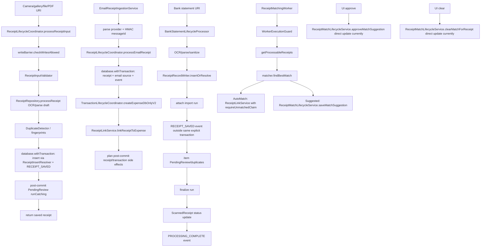

# Pipeline 3 — Receipt Capture / OCR / Email Master Implementation Plan

Repository: https://github.com/panospao7/Cost-agregator  
Pinned commit: `83b798e849b4408b2bf683f52cb2746d37f7af16`  
Pipeline ID/name: **Pipeline 3 — Receipt Capture / OCR / Email / Receipt Lifecycle**  
Build/test status: **NOT RUN**. This plan is based on static browser/source review. The implementation agent must run the validation commands in §11.

Source links used:
- P3 issue registry: https://raw.githubusercontent.com/panospao7/Cost-agregator/83b798e849b4408b2bf683f52cb2746d37f7af16/docs/analyses%20and%20debug%20master/PIPELINE_3_CONSOLIDATED_ISSUES.md
- Master tracker: https://raw.githubusercontent.com/panospao7/Cost-agregator/83b798e849b4408b2bf683f52cb2746d37f7af16/docs/analyses%20and%20debug%20master/PIPELINE_ISSUES_MASTER_TRACKER.md
- Legal paths: https://raw.githubusercontent.com/panospao7/Cost-agregator/83b798e849b4408b2bf683f52cb2746d37f7af16/docs/architecture/LEGAL_PATHS.md
- `ReceiptLifecycleCoordinator.kt`: https://github.com/panospao7/Cost-agregator/blob/83b798e849b4408b2bf683f52cb2746d37f7af16/app/src/main/java/com/yourname/expensetracker/domain/receipt/lifecycle/ReceiptLifecycleCoordinator.kt
- `ReceiptMatchLifecycleService.kt`: https://raw.githubusercontent.com/panospao7/Cost-agregator/83b798e849b4408b2bf683f52cb2746d37f7af16/app/src/main/java/com/yourname/expensetracker/domain/receipt/lifecycle/ReceiptMatchLifecycleService.kt
- `ReceiptLinkService.kt`: https://raw.githubusercontent.com/panospao7/Cost-agregator/83b798e849b4408b2bf683f52cb2746d37f7af16/app/src/main/java/com/yourname/expensetracker/domain/receipt/lifecycle/ReceiptLinkService.kt
- `BankStatementLifecycleProcessor.kt`: https://github.com/panospao7/Cost-agregator/blob/83b798e849b4408b2bf683f52cb2746d37f7af16/app/src/main/java/com/yourname/expensetracker/domain/receipt/lifecycle/BankStatementLifecycleProcessor.kt
- `ReceiptRepository.kt`: https://github.com/panospao7/Cost-agregator/blob/83b798e849b4408b2bf683f52cb2746d37f7af16/app/src/main/java/com/yourname/expensetracker/data/repository/ReceiptRepository.kt
- `ScannedReceiptDao.kt`: https://github.com/panospao7/Cost-agregator/blob/83b798e849b4408b2bf683f52cb2746d37f7af16/app/src/main/java/com/yourname/expensetracker/data/database/dao/ScannedReceiptDao.kt
- `ReceiptExpenseLinkDao.kt`: https://github.com/panospao7/Cost-agregator/blob/83b798e849b4408b2bf683f52cb2746d37f7af16/app/src/main/java/com/yourname/expensetracker/data/database/dao/ReceiptExpenseLinkDao.kt
- `ReceiptMatchingWorker.kt`: https://github.com/panospao7/Cost-agregator/blob/83b798e849b4408b2bf683f52cb2746d37f7af16/app/src/main/java/com/yourname/expensetracker/service/receiptmatching/ReceiptMatchingWorker.kt
- `EmailReceiptIngestionService.kt`: https://github.com/panospao7/Cost-agregator/blob/83b798e849b4408b2bf683f52cb2746d37f7af16/app/src/main/java/com/yourname/expensetracker/data/email/EmailReceiptIngestionService.kt

---

## 1. Executive summary

### Current state

Pipeline 3 is partially hardened:

- Main receipt capture has write-barrier checks, validation diagnostics, typed insert conflict handling, and `RECEIPT_SAVED` event inside the insert transaction.
- Email ingestion delegates to `ReceiptLifecycleCoordinator.processEmailReceipt()` and hashes message IDs before handoff.
- Auto-match worker uses `WorkerExecutionGuard`, records durable match outcomes, and uses `ReceiptLinkService.linkReceiptToExpense(... requireUnmatchedClaim = true)` for concurrent auto-match safety.
- `ReceiptInsertResolver` checks ignored inserts and resolves duplicates.
- OCR parse failure is represented as `PARSE_FAILED`, not `OCR_COMPLETED`.

Remaining production risks:

1. **Manual match approval/clear bypasses `ReceiptLinkService`** and directly mutates `ScannedReceipt.expenseId`, so the join table, downstream warranty/return/item links, and link events can diverge.
2. **Bank statement receipt insert/status/event writes are not fully atomic**.
3. **PendingReview creation after receipt save is non-atomic and failure is swallowed**, so low-confidence/batch receipts can be saved but never reviewed.
4. **`ReceiptLinkService` still has cancellation/privacy issues in item-category propagation** via `runCatching` and category detail logs.
5. **Deprecated/direct receipt DAO mutation paths remain callable or misleading**, including repository direct delete/clear methods and stale `ReplaceWith` references.
6. **Receipt-created-expense coordinator API must be verified**. `ReceiptRepository.createExpenseFromReceipt()` points callers to `ReceiptLifecycleCoordinator.createExpenseAndLinkReceipt(request)`, but that method was not located in the browser source search. Local `rg` is required before coding.

### Production risk

**RED before implementation.** P3 can create durable state/event/link inconsistencies in critical receipt matching and bank-statement flows.

### Implementation strategy

Use four small PRs:

1. **PR 1: lifecycle ownership and manual match/link correctness.**
2. **PR 2: atomicity for receipt save + review and bank statement state/events.**
3. **PR 3: cancellation/privacy/side-effect hardening.**
4. **PR 4: architecture guards, deprecated API cleanup, docs/tracker sync.**

### Recommended verdict before implementation

**RED** until PR 1 and PR 2 are complete and tested.

---

## 2. Scope

### In scope

- Receipt lifecycle coordinator paths:
  - camera/gallery/file/PDF receipt capture,
  - email receipt handoff,
  - bank statement receipt lifecycle.
- Receipt matching:
  - suggestions,
  - approval,
  - rejection,
  - clear/unlink,
  - auto-match worker interaction.
- Receipt-to-expense linking:
  - join table,
  - legacy `ScannedReceipt.expenseId`,
  - warranty/return/item categorization propagation,
  - receipt events,
  - source links.
- Pending review creation for batch/low-confidence receipt parses.
- Bank statement receipt save/status/final lifecycle event atomicity.
- Cancellation propagation and production-log privacy in P3 code.
- Deprecated/direct DAO mutation path cleanup.
- P3 tests, contract tests, and architecture guard tests.
- P3 tracker/docs update after fixes.

### Out of scope

- New OCR engine features.
- New bank-statement parser heuristics beyond lifecycle/atomicity.
- New email provider parsers.
- Large schema redesign.
- UI redesign.
- Broad refactors outside affected legal paths.
- P11 email-ingestion-only fixes unless required for P3 handoff correctness.
- P2 transaction lifecycle internals except through receipt-created expense/link integration tests.

### Assumptions

- Room nested transactions may currently work, but PR 1 should avoid relying on nested public service calls where atomic link + match events are required.
- No schema migration should be needed for planned fixes.
- `SourceLinkWriter.linkExpense()` / `linkTarget()` writes are DB provenance writes. If local inspection shows file/network I/O, move them post-commit or into an outbox.
- `ReceiptLifecycleEventWriter.write()` is a DAO insert wrapper and can be called inside `database.withTransaction`.
- Existing test infrastructure has in-memory Room DB tests for lifecycle coordinators. If not, add fakes only where Room setup is too heavy.

### Stop conditions

Stop and report before editing if:

1. `git rev-parse HEAD` is not `83b798e849b4408b2bf683f52cb2746d37f7af16`.
2. Local `rg` shows a newer implementation already fixed these issues.
3. A fix requires a schema migration not listed here.
4. Architecture docs contradict code in a way that would require product/design approval.
5. `ReceiptLifecycleCoordinator.createExpenseAndLinkReceipt` exists with a different signature than expected; adapt the plan and report drift before editing.

---

## 3. Source/doc reconciliation

| Area / Issue | Pipeline doc claim | Master tracker claim | Source-code truth | Status | Evidence |
|---|---|---|---|---|---|
| P3-P0-01 createdAt = 0 | Fixed | Fixed | Main coordinator uses `ReceiptTimestampPolicy.forInsert`; bank statement sets `createdAt/updatedAt`; email uses timestamp policy. | FIXED | `ReceiptLifecycleCoordinator.processReceiptInput()` around receipt insert; `BankStatementLifecycleProcessor` statement receipt fields. |
| P3-P1-01 receipt save/update/event atomic | Fixed | Fixed | Main capture insert + `RECEIPT_SAVED` is transactional, but bank statement insert/event and final status/event are outside one explicit transaction. | PARTIALLY_FIXED | `ReceiptLifecycleCoordinator.kt` `database.withTransaction` around insert/event; `BankStatementLifecycleProcessor.kt` writes `RECEIPT_SAVED` after `insertOrResolve` and updates status before event. |
| P3-P1-02 link service lacks restore guard | Fixed | Fixed | `ReceiptLinkService.linkReceiptToExpense()` and `unlinkReceiptFromExpense()` call write barrier. | FIXED | `ReceiptLinkService.kt` writeBarrier checks. |
| P3-P1-03 matching result not persisted | Fixed in master | Fixed | Suggestions/no-match events are persisted; auto-match links; but manual approve/clear directly updates `ScannedReceipt` instead of link/unlink path. | PARTIALLY_FIXED | `ReceiptMatchLifecycleService.approveMatchSuggestion()` directly calls `scannedReceiptDao.update(receipt.copy(expenseId = suggestedId...))`; `clearMatchForReceipt()` directly clears `expenseId`. |
| P3-P1-04 receipt-created expense + link not atomic | Partial in P3 doc | Fixed in master | Email path creates expense and links inside coordinator transaction; legacy repository path disabled. But legal coordinator method named in deprecation must be verified; nested public link service call inside transaction should be tested. | PARTIALLY_FIXED / NEEDS_VERIFICATION | `ReceiptRepository.createExpenseFromReceipt()` returns disabled error and points to `createExpenseAndLinkReceipt`; browser search did not find that method in `ReceiptLifecycleCoordinator`. |
| P3-P1-05 direct repository/DAO bypass | Partial | Fixed | Deprecated repository methods still perform direct DAO mutations (`insertReceipt`, `deleteReceipt`, `clearAllScannedReceipts`, `updateCategorizationStatus`); match service direct update is a real bypass. | OPEN/PARTIAL | `ReceiptRepository.kt` deprecated methods; `ReceiptMatchLifecycleService.kt` direct updates. |
| P3-P1-06 IGNORE conflict not checked | Fixed | Fixed | `ReceiptInsertResolver.insertOrResolve()` checks insert ID and resolves ignored insert. | FIXED | `ReceiptInsertResolver.kt` `id = scannedReceiptDao.insert(receipt); if (id > 0) ... else resolve`. |
| P3-P1-07 EUR fallback | Fixed | Fixed | Reviewed paths use `resolveHomeCurrency()` or `"XXX"` fallback; repository notes never silently defaults to EUR. | FIXED | `ReceiptRepository.homeCurrency()` returns resolved code or `XXX`; coordinator email resolves home before transaction. |
| P3-P1-08 parse failures as OCR_COMPLETED | Fixed | Fixed | Repository catches parse failure, creates `PARSE_FAILED` draft for coordinator insert/event. | FIXED | `ReceiptRepository.kt` parse catch sets `ReceiptProcessingStatus.PARSE_FAILED`. |
| P3-P1-09 batch pending reviews | TODO in P3 doc | Fixed in master | Review creation exists but is after receipt commit and failure is swallowed. | PARTIALLY_FIXED | `ReceiptLifecycleCoordinator.processReceiptInput()` creates `PendingReview` in post-insert `runCatching` and logs failure only. |
| P3-P1-10 bank statement dedupe | TODO in P3 doc | Fixed in master | Dedupe appears stronger than old doc, but full runtime verification needed. Not a primary implementation item unless tests fail. | NEEDS_RUNTIME_VERIFICATION | `BankStatementLifecycleProcessor` code should be validated with statement duplicate tests. |
| NEW-P3-001 CE swallowed in side-effect dispatcher | Fixed | Fixed | Named site reportedly fixed; local search still required for broad `runCatching`. | NEEDS_VERIFICATION | Run required `rg` in §11. |
| NEW-P3-002 CE swallowed in bank per-item | Fixed | Fixed | Per-item catch rethrows CE in inspected snippets; residual `runCatching` must be checked. | NEEDS_VERIFICATION | Run required `rg`. |
| NEW-P3-003 CE swallowed in unlink | Fixed | Fixed | `unlinkReceiptFromExpense()` rethrows `CancellationException`; link category propagation still uses `runCatching`. | PARTIALLY_FIXED | `ReceiptLinkService.linkReceiptToExpense()` category propagation block. |
| NEW-P3-004 double attachReceipt | Fixed | Fixed | Insert and duplicate paths have one attach each. | FIXED | `BankStatementLifecycleProcessor` inserted branch attaches new ID; duplicate branch attaches existing ID. |
| NEW-P3-005 post-OCR duplicate race | Open in P3 doc | Fixed in code for persisted insert | Duplicate check/insert conflict resolution exists; no new work unless local tests expose race. | FIXED/NEEDS_TEST | `ReceiptInsertResolver`; coordinator post-OCR duplicate path. |
| NEW-P3-006 privacy leak merchant/category logs | Open in P3 doc | Fixed in master | Some logs are redacted, but `ReceiptLinkService` logs category IDs/frequencies. | PARTIALLY_FIXED | `ReceiptLinkService.kt` logs `categoryId=$catId` frequency details. |
| NEW-P3-007 delete event for missing receipt | Open in P3 doc | Claimed fixed | Browser search did not locate coordinator `deleteReceipt`; repository delete is deprecated direct DAO. | NEEDS_VERIFICATION | Run `rg -n "deleteReceipt"`; if coordinator method exists, validate. |
| NEW-P3-008 homeCurrency inside withContext | Open/TODO universal | Claimed fixed | Email resolves home currency before DB transaction; full flow needs local search. | NEEDS_VERIFICATION | `ReceiptLifecycleCoordinator.processEmailReceipt()` resolves home currency before `database.withTransaction`. |

---

## 4. Architecture contracts for this pipeline

| Contract | Required legal path | Current code | Gap | Fix required |
|---|---|---|---|---|
| Receipt processing | `ReceiptLifecycleCoordinator.processReceiptInput()` owns insert + event + metadata | Main capture follows this path | PendingReview after commit; event/review not atomic | PR 2 |
| Email handoff | `EmailReceiptIngestionService` parses only; coordinator owns mutation | Email service delegates to coordinator | Nested public link service call inside coordinator transaction needs test/possible internal primitive | PR 1/2 verification |
| Bank statement receipt lifecycle | Should be lifecycle-owned and evented atomically | Processor directly uses `ReceiptRecordWriter`, run DAO, status update, event writer | Insert/attach/event and finalize/status/event are not atomic | PR 2 |
| Link/unlink | `ReceiptLinkService.linkReceiptToExpense()` / `unlinkReceiptFromExpense()` only | Auto/email links use service; manual approve/clear bypasses | Manual approval/clear mutate legacy field only | PR 1 |
| Matching state | `ReceiptMatchLifecycleService` owns suggestion/approval/reject/clear with events | Suggestions/reject OK; approval/clear direct-update receipt | Join table and downstream state omitted | PR 1 |
| Expense from receipt | `ReceiptLifecycleCoordinator` + `TransactionLifecycleCoordinator` + link service in one transaction | Email path implements variant; repository legacy disabled | Named coordinator API may be missing/stale | PR 1 verification/API cleanup |
| Restore/write barrier | Every DB mutation checks `DatabaseWriteBarrier` | Most services check; deprecated repository mutators also check | Direct deprecated mutators remain possible; architecture guard missing | PR 4 |
| Event atomicity | Critical mutation + event in same transaction | Main capture OK; link OK; bank statement partial; pending review has no event | Bank/final/review drift possible | PR 2 |
| Cancellation | Never swallow `CancellationException` | Many catches rethrow; link category block uses `runCatching` | CE can be swallowed in link category propagation | PR 3 |
| Privacy/logging | No raw/sensitive merchant/category/OCR/email details in production logs | OCR/email mostly sanitized; category detail logs remain | Category IDs/frequencies leak user spending taxonomy | PR 3 |
| Side effects | Post-commit only | Email plans side effects after mutation; link category propagation occurs inside link transaction | Verify category assignment port does not run long/non-DB I/O in transaction | PR 3 verification |

---

## 5. Current runtime flow



---

## 6. Implementation phases

### PR 1 — Critical correctness / lifecycle ownership

**Goal:** Make manual match approve/clear use the receipt link legal path; verify/add coordinator-owned receipt-created-expense API.

**Risk:** Medium. Touches link/match services used by UI and worker.

**Files:**

- `ReceiptLinkService.kt`
- `ReceiptMatchLifecycleService.kt`
- `ReceiptLifecycleCoordinator.kt`
- `ReceiptRepository.kt`
- tests under `domain/receipt/lifecycle`
- possibly ViewModels if they call deprecated repository methods

**Work items:**

- P3-IMPL-001: add transaction-owned internal link/unlink primitives in `ReceiptLinkService`.
- P3-IMPL-002: refactor `ReceiptMatchLifecycleService.approveMatchSuggestion()` and `clearMatchForReceipt()` to use those primitives.
- P3-IMPL-003: verify and, if absent, add or correct `ReceiptLifecycleCoordinator.createExpenseAndLinkReceipt(...)`.

**Tests:**

- Manual approval creates `receipt_expense_links`, updates legacy `expenseId`, clears suggestion, writes link + match events.
- Manual clear removes join-table row, clears legacy field only when no remaining primary link, writes unlink + match-cleared events.
- Link failure during approve rolls back all mutations.
- Receipt-created expense + required link rollback test.

**Acceptance criteria:**

- No manual match path directly mutates `ScannedReceipt.expenseId`.
- All link/unlink side effects still run through `ReceiptLinkService`.
- `rg "expenseId = .*suggested|matchStatus = MatchStatus.MANUALLY_MATCHED"` shows no illegal direct update outside link service/test fixtures.
- Existing auto-match behavior remains unchanged.

---

### PR 2 — Atomicity / idempotency / derived data

**Goal:** Make receipt save + pending review and bank statement state/event writes atomic.

**Risk:** Medium-high. Touches bank import and receipt capture commit boundaries.

**Files:**

- `ReceiptLifecycleCoordinator.kt`
- `BankStatementLifecycleProcessor.kt`
- `ReceiptRecordWriter.kt` only if helper API is needed
- tests under `domain/receipt/lifecycle` and `data/repository`

**Work items:**

- P3-IMPL-004: move required `PendingReview` creation into the same transaction as receipt insert + `RECEIPT_SAVED`.
- P3-IMPL-005: wrap bank statement insert/attach/`RECEIPT_SAVED` in one transaction.
- P3-IMPL-006: wrap bank import finalize/status/`PROCESSING_COMPLETE` or `PROCESSING_FAILED` in one transaction.
- P3-IMPL-007: add durable event/diagnostic for pending review creation failure if design chooses non-rollback behavior; preferred behavior is rollback when review is mandatory.

**Tests:**

- Forced `PendingReviewDao.insert()` failure leaves no saved receipt when review is mandatory.
- Bank statement `RECEIPT_SAVED` writer failure rolls back inserted receipt or attached run.
- Bank statement `PROCESSING_COMPLETE` writer failure rolls back status update/finalize, or test accepted atomic failure behavior.
- Duplicate bank statement path does not write duplicate events or double attach.

**Acceptance criteria:**

- No receipt requiring review can be saved without either a `PendingReview` or explicit durable failure result.
- Bank statement status and lifecycle event cannot diverge.
- No external/network/file I/O added inside Room transactions.

---

### PR 3 — Diagnostics / privacy / cancellation / side effects

**Goal:** Remove residual cancellation swallowing and privacy-sensitive category logs; verify side effects stay post-commit or DB-only.

**Risk:** Low-medium.

**Files:**

- `ReceiptLinkService.kt`
- `ReceiptSideEffectDispatcher.kt`
- `BankStatementLifecycleProcessor.kt`
- `ReceiptLifecycleCoordinator.kt`
- `EmailReceiptIngestionService.kt`
- contract/static tests

**Work items:**

- P3-IMPL-008: replace `runCatching` in suspend lifecycle code with explicit `try/catch` that rethrows `CancellationException`.
- P3-IMPL-009: remove/gate production logs containing category IDs/frequencies or merchant/category detail.
- P3-IMPL-010: inspect `ExpenseCategoryAssignmentPort` implementation; if it opens its own transaction or runs side effects, make category propagation a post-commit action or an explicit DB-only in-transaction method.
- P3-IMPL-011: ensure all diagnostic/event metadata uses `SafeEventMetadata` or sanitizer helpers instead of raw string interpolation for user-controlled values.

**Tests:**

- Cancellation propagation through link category propagation.
- Static privacy test forbidding `Timber.*` with `categoryId=`, `parsedMerchant`, raw OCR/email fields in P3 production files.
- Side-effect contract test: failure in category assignment does not rollback link unless intentionally configured, and cancellation does rollback/propagate.

**Acceptance criteria:**

- `rg "runCatching"` in P3 production lifecycle code either returns no hits or only documented non-suspending safe blocks.
- No production P3 log includes raw category IDs/frequencies, raw OCR text, raw email body, raw asset path, or raw merchant beyond user-facing notification/UI contexts.
- `CancellationException` propagates.

---

### PR 4 — Architecture guards / docs / cleanup

**Goal:** Prevent regression through static ownership tests and sync docs/trackers.

**Risk:** Low.

**Files:**

- `ReceiptRepository.kt`
- `ScannedReceiptDao.kt` or architecture test fixtures
- `app/src/test/java/.../architecture/...`
- docs/tracker files

**Work items:**

- P3-IMPL-012: elevate or disable deprecated direct repository mutators if no production callers remain.
- P3-IMPL-013: add architecture guard test banning direct receipt DAO mutations outside allowed owners.
- P3-IMPL-014: add guard against P3 `runCatching` swallowing CE and unsafe `Timber` PII patterns.
- P3-IMPL-015: update P3 consolidated issue registry and master tracker after tests pass.

**Tests:**

- Static architecture test lists allowed owners for:
  - `ScannedReceiptDao.insert/update/delete/deleteAll/linkToExpense/claimForAutoMatch`
  - `ReceiptExpenseLinkDao.insert/unlink/deleteAllLinksForReceipt`
  - `PendingReviewDao.insert` for receipt-review creation paths
  - `ReceiptEventDao.insert` or `ReceiptLifecycleEventWriter.write`
- Existing P3 tests pass.

**Acceptance criteria:**

- CI fails if future code directly mutates receipt lifecycle tables outside legal owners.
- Docs reflect actual fixed/partial/deferred status.

---

## 7. Detailed work items

| ID | Severity | Title | Files | Implementation steps | Tests | Acceptance criteria |
|---|---:|---|---|---|---|---|
| P3-IMPL-001 | P1 | Add transaction-owned link/unlink primitives | `ReceiptLinkService.kt` | Extract the body of `linkReceiptToExpense()` into `internal suspend fun linkReceiptToExpenseInCurrentTransaction(...)`. Public method keeps barrier + `database.withTransaction`. Internal method must not call barrier, must assume caller transaction, and must do: existing-link check, insert join row, update legacy receipt field, propagate warranty/return/item links, write `RECEIPT_LINKED_TO_EXPENSE`, optionally write source link. Do same for unlink as `unlinkReceiptFromExpenseInCurrentTransaction(...)`. | New `ReceiptLinkServiceTransactionPrimitiveTest`; update existing link tests. | Public behavior unchanged; internal primitive enables atomic composition from match/coordinator services. |
| P3-IMPL-002 | P1 | Route manual match approval through link service | `ReceiptMatchLifecycleService.kt`, `ReceiptLinkService.kt` | Inject `ReceiptLinkService`. In `approveMatchSuggestion()`: guard; `database.withTransaction`; load receipt; require `suggestedExpenseId`; call `linkReceiptToExpenseInCurrentTransaction(receiptId, suggestedId, linkType="MATCH_APPROVAL", source="MATCH_LIFECYCLE", createdBy="system:match_lifecycle", confidence=receipt.matchConfidence, allowRelink=false, matchStatus=MANUALLY_MATCHED, writeSourceLink=true)`; insert `MATCH_APPROVED` event in same transaction. Do not directly update `ScannedReceipt.expenseId`. | `approveMatchSuggestion_createsJoinLinkAndEvents`; `approveMatchSuggestion_linkConflictRollsBackMatchEvent`. | Manual approval creates join table link, legacy field, downstream links, `RECEIPT_LINKED_TO_EXPENSE`, and `MATCH_APPROVED` atomically. |
| P3-IMPL-003 | P1 | Route clear match through unlink service | `ReceiptMatchLifecycleService.kt`, `ReceiptLinkService.kt` | In `clearMatchForReceipt()`: guard; transaction; load receipt and target expense/link. If `receipt.expenseId != null`, call `unlinkReceiptFromExpenseInCurrentTransaction(receiptId, expenseId)`. If only stale suggestion exists, clear suggestion/status via a narrow match-state update and event. Insert `MATCH_CLEARED` in same transaction. Do not directly clear link state except through unlink primitive. | `clearMatch_removesJoinLinkAndLegacyField`; `clearSuggestion_withoutExpense_doesNotWriteUnlinkEvent`; `clearMatch_noReceipt_noEvent`. | Join table, legacy field, warranty/return/item links, and events stay consistent. |
| P3-IMPL-004 | P1 | Verify/add coordinator receipt-created-expense legal API | `ReceiptLifecycleCoordinator.kt`, `ReceiptRepository.kt`, possibly UI/ViewModels | Run `rg -n "createExpenseAndLinkReceipt|createExpenseFromReceipt"`. If `ReceiptLifecycleCoordinator.createExpenseAndLinkReceipt(...)` is absent, add it or correct deprecated guidance. Preferred API: `suspend fun createExpenseAndLinkReceipt(receiptId: Long, request: CreateExpenseRequest, requireLink: Boolean = true): CreateExpenseResult/MutationResult`. Inside: guard; precheck `receiptLinkService.checkCanLinkReceipt`; `database.withTransaction { transactionLifecycleCoordinator.createExpenseDbOnlyV2(request.copy(scannedReceiptId=receiptId)); linkReceiptToExpenseInCurrentTransaction(...) }`; collect post-commit actions; run actions after commit only. | `createExpenseAndLinkReceipt_linkFailureRollsBackExpense`; `createExpenseAndLinkReceipt_runsSideEffectsAfterCommit`; compile check for `ReplaceWith`. | A documented coordinator legal path exists and legacy repository guidance is accurate. |
| P3-IMPL-005 | P1 | Make PendingReview creation atomic with receipt save | `ReceiptLifecycleCoordinator.kt` | Compute `requiresReview = options.createReview || parsed.confidence < threshold`. Move `PendingReview` construction and `pendingReviewDao.insert(review)` into the same `database.withTransaction` that inserts the receipt and `RECEIPT_SAVED`. Insert optional `PENDING_REVIEW_CREATED` receipt event in same transaction. Remove post-transaction `runCatching`. If review insert fails, throw so receipt insert rolls back. | `processReceiptInput_requiredReviewInsertedInSameTransaction`; `pendingReviewInsertFailure_rollsBackReceipt`; `lowConfidenceCreatesReview`. | No saved required-review receipt exists without review row/event. |
| P3-IMPL-006 | P1 | Bank statement insert/attach/save-event atomic | `BankStatementLifecycleProcessor.kt` | Inject/use `AppDatabase` if not already available. Replace sequence `receiptRecordWriter.insertOrResolve` → `attachReceipt` → event with `database.withTransaction { insertOrResolve; attach; write RECEIPT_SAVED; PDF_PARTIAL event if applicable }`. Keep file hash/OCR/privacy reads outside transaction. For duplicate path, transactionally attach run and finalize duplicate status; do not mutate receipt. | `bankStatementReceiptSavedEventAtomic`; `bankStatementDuplicateAttachOnce`. | Crash/event failure cannot leave inserted bank receipt without `RECEIPT_SAVED` or unattached run. |
| P3-IMPL-007 | P1 | Bank statement finalize/status/completion-event atomic | `BankStatementLifecycleProcessor.kt` | Replace finalize → status update → event sequence with `database.withTransaction { finalize import run; if success update receipt status; write PROCESSING_COMPLETE else write PROCESSING_FAILED }`. If failed import should return failure, do so after transaction commits failure evidence. | `bankStatementFinalizeAndCompletionEventAtomic`; `processingFailedEventCommittedBeforeFailureReturn`. | Import run final state, receipt status, and lifecycle event cannot diverge. |
| P3-IMPL-008 | P1 | Fix residual cancellation swallowing | `ReceiptLinkService.kt`, P3 lifecycle files found by `rg` | Replace `runCatching` around category propagation with explicit `try { ... } catch (e: CancellationException) { throw e } catch (e: Exception) { Timber.w(...) }`. Repeat for any P3 suspend lifecycle `runCatching` found by `rg`. | `linkReceiptToExpense_categoryPropagationCancellationPropagates`; update `CancellationPropagationContractTest`. | No P3 production suspend lifecycle block converts CE to success/failure value. |
| P3-IMPL-009 | P2 | Remove category/merchant production log leaks | `ReceiptLinkService.kt`, any P3 file found by log search | Remove detailed category-frequency log. Replace with safe count-only debug log gated by `BuildConfig.DEBUG` or no log. Do not log merchant/category/OCR/email body/asset paths in production. Use hashed IDs only if necessary. | Static `SensitiveDiagnosticsPolicyTest`/architecture test. | `rg -n "categoryId=|parsedMerchant|rawOcrText|emailBody|imagePath|assetPath" ... Timber|Log` has no production leaks. |
| P3-IMPL-010 | P2 | Verify category propagation side-effect legality | `ReceiptLinkService.kt`, `ExpenseCategoryAssignmentPort` implementation | Locate implementation via `rg -n "class .*ExpenseCategoryAssignmentPort|assignCategoryIfUnset"`. If it calls transaction lifecycle with its own side effects, add DB-only/in-current-transaction category assignment API or defer category assignment post-commit. Keep receipt link atomic independent from optional category assignment. | `linkReceipt_categoryAssignmentFailureDoesNotCorruptLink`; side-effect contract test. | No non-DB long-running work inside Room transaction; transaction lifecycle events preserved. |
| P3-IMPL-011 | P2 | Repair deprecated direct repository mutation paths | `ReceiptRepository.kt` | Run caller search. For no production callers, change direct mutators to `DeprecationLevel.ERROR` and body `error("Disabled: use ...")`: `insertReceipt`, `deleteReceipt`, `clearAllScannedReceipts`, `clearMatchForReceipt` if not already disabled. Keep read/query methods. If production callers exist, migrate them first. | Compile; architecture guard test. | No production path can silently bypass coordinator/link/match lifecycle. |
| P3-IMPL-012 | P2 | Add receipt DAO ownership architecture guard | Add test file, maybe annotation | Add test scanning `app/src/main/java` for direct calls to restricted DAO mutation methods. Allowed owners: `ReceiptInsertResolver`, `ReceiptRecordWriter`, `ReceiptLifecycleCoordinator`, `ReceiptLinkService`, `ReceiptMatchLifecycleService` only for suggestion/reject non-link state, `BankStatementLifecycleProcessor` until fully owned, migrations/backfills/debug test allowlist. | `ReceiptDaoOwnershipArchitectureTest`. | CI blocks new direct DAO mutation bypass. |
| P3-IMPL-013 | P2 | Add terminal diagnostics/events for review/link failures | `ReceiptLifecycleCoordinator.kt`, `ReceiptMatchLifecycleService.kt` | For failure paths that return typed failure after rollback, emit safe diagnostic outside transaction if durable diagnostic contract requires. Do not leak raw parsed fields. For link failure in manual approval, return/throw typed error and write no success event. | Failure-path tests with diagnostic fake. | Terminal failures are observable without false success events. |
| P3-IMPL-014 | P3 | Update P3 docs/trackers | P3 issue doc, master tracker, maybe legal paths if method names changed | After tests pass, update statuses: P3-P1-01 partial fixed to fixed, P3-P1-03 fixed, P3-P1-05 narrowed, P3-P1-09 fixed, NEW-P3-006 fixed/partial, etc. Document any deferred design. | Docs diff review. | Trackers match code truth. |

---

## 8. File-by-file change plan

| File | Change type | Exact changes | Risk | Tests covering it |
|---|---|---|---|---|
| `domain/receipt/lifecycle/ReceiptLinkService.kt` | MODIFY | Extract internal in-transaction link/unlink primitives; public methods delegate. Replace category `runCatching` with cancellation-safe try/catch. Remove category detail logs. Optionally split category assignment out if implementation is not DB-only. | Medium | Link service transaction tests; cancellation/privacy tests. |
| `domain/receipt/lifecycle/ReceiptMatchLifecycleService.kt` | MODIFY | Inject `ReceiptLinkService`. Replace direct `scannedReceiptDao.update()` in approve/clear with link/unlink primitives. Write `MATCH_APPROVED`/`MATCH_CLEARED` in same transaction. | Medium | Match lifecycle tests. |
| `domain/receipt/lifecycle/ReceiptLifecycleCoordinator.kt` | MODIFY | Move mandatory `PendingReview` insert into receipt insert transaction. Add/verify `createExpenseAndLinkReceipt` legal API if absent. Use internal link primitive where coordinator already has an outer transaction. | Medium-high | Coordinator atomicity and receipt-created-expense tests. |
| `domain/receipt/lifecycle/BankStatementLifecycleProcessor.kt` | MODIFY | Wrap bank receipt insert/attach/save-event and final run/status/event writes in transactions. Keep OCR/file/privacy work outside transactions. | Medium-high | Bank statement lifecycle atomicity tests. |
| `data/repository/ReceiptRepository.kt` | MODIFY | Disable or elevate deprecated direct mutators after caller migration. Correct stale `ReplaceWith` if coordinator method name differs. | Medium | Compile and architecture guard. |
| `data/repository/ReceiptRecordWriter.kt` | MODIFY/NO_CHANGE_READ_ONLY | Prefer no change. If needed, document it is transaction-compatible and does not create its own transaction. | Low | Bank statement tests. |
| `domain/receipt/lifecycle/ReceiptLifecycleEventWriter.kt` | NO_CHANGE_READ_ONLY | Can be used inside caller transactions. Change only if tests need transaction-aware helper naming. | Low | Event atomicity tests. |
| `service/receiptmatching/ReceiptMatchingWorker.kt` | NO_CHANGE_READ_ONLY unless tests fail | Auto-match path already uses link service with `requireUnmatchedClaim`. Update only if internal primitive signature requires no change to public API. | Low | Worker tests. |
| `data/email/EmailReceiptIngestionService.kt` | NO_CHANGE_READ_ONLY | Already delegates mutation to coordinator and hashes message IDs. Update only if coordinator API signature changes. | Low | Email ingestion tests. |
| `app/src/test/java/.../ReceiptMatchLifecycleServiceTest.kt` | ADD_TEST/UPDATE_TEST | Add manual approve/clear join-table and rollback coverage. | Low | N/A |
| `app/src/test/java/.../ReceiptLifecycleCoordinatorTest.kt` | UPDATE_TEST | Add PendingReview atomicity and receipt-created-expense atomicity coverage. | Low | N/A |
| `app/src/test/java/.../BankStatementLifecycleProcessorTest.kt` or existing file | ADD_TEST/UPDATE_TEST | Add bank statement receipt/event/finalize atomicity tests. | Low | N/A |
| `app/src/test/java/.../contracts/CancellationPropagationContractTest.kt` | UPDATE_TEST | Add link-service category propagation cancellation case. | Low | N/A |
| `app/src/test/java/.../contracts/PrivacyStorageContractTest.kt` or new static test | ADD_TEST | Add P3 logging/privacy grep test. | Low | N/A |
| `app/src/test/java/.../architecture/ReceiptDaoOwnershipArchitectureTest.kt` | ADD_GUARD | Static allowlist for direct DAO mutations. | Low | N/A |
| P3 tracker docs | UPDATE_DOC | Sync statuses after implementation. | Low | Docs review. |

---

## 9. Database / schema / migration plan

No schema migration required for the planned fixes.

| Change | Entity/DAO | Migration required? | Schema export required? | Backfill required? | Tests |
|---|---|---:|---:|---:|---|
| Manual match approval now writes existing `receipt_expense_links` row | `ReceiptExpenseLinkDao` / `ReceiptExpenseLink` | No | No | No | Manual approve test |
| Pending review inserted in same transaction | `PendingReviewDao` / `PendingReview` | No | No | No | Pending review atomicity test |
| Bank statement events/status atomic | Existing receipt/import/event tables | No | No | No | Bank statement atomicity tests |
| Deprecated path cleanup | N/A | No | No | No | Compile + architecture test |

Schema change is not recommended in this phase. If local verification finds the join table lacks a needed uniqueness constraint beyond current `OnConflictStrategy.IGNORE`, stop and propose a separate migration plan.

---

## 10. Test plan

### Existing tests to run

```bash
./gradlew :app:testDebugUnitTest --stacktrace
./gradlew :app:assembleDebug --stacktrace
./gradlew :app:check --stacktrace
```

### Focused tests

```bash
./gradlew :app:testDebugUnitTest --tests "*ReceiptLifecycleCoordinatorTest*" --stacktrace
./gradlew :app:testDebugUnitTest --tests "*ReceiptLifecycleBugFixesTest*" --stacktrace
./gradlew :app:testDebugUnitTest --tests "*ReceiptLifecycleHardeningTest*" --stacktrace
./gradlew :app:testDebugUnitTest --tests "*ReceiptMatchLifecycleServiceTest*" --stacktrace
./gradlew :app:testDebugUnitTest --tests "*ReceiptMatchingWorkerTest*" --stacktrace
./gradlew :app:testDebugUnitTest --tests "*ReceiptRepositoryStatementDuplicateTest*" --stacktrace
./gradlew :app:testDebugUnitTest --tests "*CancellationPropagationContractTest*" --stacktrace
./gradlew :app:testDebugUnitTest --tests "*LifecycleBarrierContractTest*" --stacktrace
./gradlew :app:testDebugUnitTest --tests "*PrivacyStorageContractTest*" --stacktrace
./gradlew :app:testDebugUnitTest --tests "*SideEffectContractTest*" --stacktrace
```

### New tests to add

| Test file | Test name | Behavior covered |
|---|---|---|
| `ReceiptMatchLifecycleServiceTest.kt` | `approveMatchSuggestion_usesLinkServiceAndCreatesJoinRow` | Manual approval creates join row, legacy field, events. |
| `ReceiptMatchLifecycleServiceTest.kt` | `approveMatchSuggestion_linkFailureRollsBackMatchApproval` | No match approval event/status if link fails. |
| `ReceiptMatchLifecycleServiceTest.kt` | `clearMatchForReceipt_usesUnlinkServiceAndClearsDownstreamState` | Clear removes join row and downstream state. |
| `ReceiptMatchLifecycleServiceTest.kt` | `clearMatchForReceipt_withoutExpenseClearsOnlySuggestion` | Suggestion-only clear does not emit unlink event. |
| `ReceiptLifecycleCoordinatorTest.kt` | `processReceiptInput_requiredReviewInsertedAtomically` | Receipt and PendingReview committed together. |
| `ReceiptLifecycleCoordinatorTest.kt` | `processReceiptInput_pendingReviewFailureRollsBackReceipt` | No receipt saved when mandatory review insert fails. |
| `ReceiptLifecycleCoordinatorTest.kt` | `createExpenseAndLinkReceipt_linkFailureRollsBackExpense` | Required receipt-created expense cannot orphan without link. |
| `BankStatementLifecycleProcessorTest.kt` | `statementReceiptInsertAttachAndSavedEventAreAtomic` | Receipt insert/attach/event rollback together. |
| `BankStatementLifecycleProcessorTest.kt` | `statementFinalizeStatusAndCompletionEventAreAtomic` | Final status/event cannot diverge. |
| `CancellationPropagationContractTest.kt` | `receiptLinkCategoryPropagationRethrowsCancellation` | `CancellationException` propagates. |
| `PrivacyStorageContractTest.kt` or static test | `receiptLifecycleLogsDoNotExposeCategoryDetails` | No category IDs/frequencies or raw content in production logs. |
| `ReceiptDaoOwnershipArchitectureTest.kt` | `receiptDaoMutationsOnlyFromAllowedOwners` | Direct DAO mutation guard. |

### Architecture guard tests

| Guard | Expected rule |
|---|---|
| Receipt DAO ownership | `ScannedReceiptDao.insert/update/delete/deleteAll/linkToExpense/claimForAutoMatch` only from allowed lifecycle owners, resolver/writer, migrations/backfills, tests. |
| Receipt link DAO ownership | `ReceiptExpenseLinkDao.insert/unlink/deleteAllLinksForReceipt` only from `ReceiptLinkService`, migrations/backfills, tests. |
| Pending review ownership | P3 receipt review creation only from `ReceiptLifecycleCoordinator`/bank lifecycle/review queue owners. |
| Cancellation | No raw `runCatching` in suspend P3 lifecycle paths unless allowlisted with explicit CE rethrow. |
| Sensitive logs | No P3 production `Timber`/`Log` message includes raw OCR/email body/path/category detail/merchant detail except approved UI-facing notifications. |

---

## 11. Validation commands

The implementation agent must run:

```bash
git rev-parse HEAD
```

Expected:

```text
83b798e849b4408b2bf683f52cb2746d37f7af16
```

Discovery commands before editing:

```bash
find app/src/main/java -type f | sort
find app/src/test/java -type f | sort
find app/src/androidTest/java -type f | sort

rg -n "ReceiptLifecycleCoordinator|processReceiptInput|createExpenseAndLinkReceipt|createExpenseFromReceipt|deleteReceipt|ReceiptLinkService|linkReceiptToExpense|unlinkReceiptFromExpense|ReceiptMatchLifecycleService|saveMatchSuggestion|approveMatchSuggestion|rejectAllSuggestions|clearMatch" app/src/main app/src/test app/src/androidTest

rg -n "ScannedReceiptDao\\.|scannedReceiptDao\\.(insert|insertOrIgnore|update|delete|deleteAll|update.*Expense|update.*Match|claimForAutoMatch|linkToExpense)|ReceiptExpenseLinkDao|receiptExpenseLinkDao\\.(insert|unlink|deleteAllLinksForReceipt)|PendingReviewDao|pendingReviewDao\\.insert" app/src/main app/src/test app/src/androidTest

rg -n "withTransaction|database.withTransaction|TransactionLifecycleCoordinator|createExpenseDbOnlyV2|createExpense\\(|SideEffectMode.DEFER|PostCommitActionRunner|ReceiptSideEffectPlanner|ReceiptSideEffectDispatcher" app/src/main app/src/test

rg -n "CancellationException|catch \\(e: Exception\\)|runCatching|NonCancellable|SupervisorJob|launch|async|withContext|withTimeout|withTimeoutOrNull|Flow.first" app/src/main/java/com/yourname/expensetracker/domain/receipt app/src/main/java/com/yourname/expensetracker/data/repository app/src/main/java/com/yourname/expensetracker/service/receiptmatching app/src/main/java/com/yourname/expensetracker/data/email app/src/test

rg -n "RawContentSanitizer|RedactionSanitizer|PrivacyDecision|RawStorageMode|DO_NOT_STORE|REDACTED|METADATA|PII|Timber\\.|Log\\.|merchant|category|ocrText|rawText|emailBody|imagePath|assetPath" app/src/main app/src/test

rg -n "BankStatementParser|BankStatementLifecycleProcessor|bank statement|statement import|attachReceipt|statement duplicate|PROCESSING_COMPLETE|RECEIPT_SAVED" app/src/main app/src/test
```

Validation after each PR:

```bash
./gradlew :app:testDebugUnitTest --tests "*ReceiptMatchLifecycleServiceTest*" --stacktrace
./gradlew :app:testDebugUnitTest --tests "*ReceiptLifecycleCoordinatorTest*" --stacktrace
./gradlew :app:testDebugUnitTest --tests "*BankStatement*" --stacktrace
./gradlew :app:testDebugUnitTest --tests "*CancellationPropagationContractTest*" --stacktrace
./gradlew :app:testDebugUnitTest --tests "*PrivacyStorageContractTest*" --stacktrace
./gradlew :app:testDebugUnitTest --tests "*Architecture*" --stacktrace
./gradlew :app:testDebugUnitTest --stacktrace
./gradlew :app:assembleDebug --stacktrace
./gradlew :app:check --stacktrace
```

If instrumentation is needed for WorkManager/Room behavior:

```bash
./gradlew :app:connectedDebugAndroidTest --stacktrace
```

---

## 12. Documentation updates

| Doc | Required update | Reason |
|---|---|---|
| `docs/analyses and debug master/PIPELINE_3_CONSOLIDATED_ISSUES.md` | Update actual statuses for P3-P1-01, P3-P1-03, P3-P1-04, P3-P1-05, P3-P1-09, NEW-P3-006, NEW-P3-007/008 after verification. | Current doc/tracker drift exists. |
| `docs/analyses and debug master/PIPELINE_ISSUES_MASTER_TRACKER.md` | Change master tracker only after source/tests pass. Mark partial/deferred items accurately. | Master tracker currently overstates some fixes. |
| `docs/architecture/LEGAL_PATHS.md` | If coordinator receipt-created-expense method name/signature changes, update legal path examples. | Prevent stale guidance. |
| `docs/DB_WRITE_OWNERSHIP.md` | Add/confirm receipt DAO mutation owner allowlist. | Architecture guard should match docs. |
| `docs/SENSITIVE_DIAGNOSTICS_POLICY.md` | Add explicit category/merchant log restriction if missing. | Prevent recurring privacy regressions. |
| `docs/expense-mutation-inventory.md` | If category assignment/link changes affect transaction lifecycle, document. | Cross-pipeline P2/P3 traceability. |

---

## 13. Risk and rollback plan

| Risk | Probability | Impact | Mitigation | Rollback |
|---|---:|---:|---|---|
| Manual approval behavior changes UI expectations | Medium | High | Keep public method names and result behavior; add tests at service/ViewModel if present. | Revert PR 1 only; no schema change. |
| Internal link primitive duplicates logic incorrectly | Medium | High | Extract existing implementation rather than rewrite; public link tests must pass unchanged. | Revert extraction; restore old public method. |
| Bank statement transaction wraps too much work | Medium | Medium | Keep OCR/file/hash/privacy reads outside transaction. Only DB insert/attach/event/finalize/status inside. | Revert bank PR; no migration. |
| PendingReview insert failure now fails receipt save | Low-medium | Medium | This is intended when review is mandatory. If product wants partial success, return typed partial result with durable diagnostic instead. | Adjust failure mode in PR 2 before merge. |
| Architecture guard false positives | Medium | Low | Start with allowlist and report-only local test, then enforce after cleanup. | Relax allowlist; do not remove guard entirely. |
| Category assignment moved post-commit changes timing | Low | Medium | If assignment is optional, document timing and emit diagnostic on failure. | Keep DB-only category assignment inside transaction if safe. |
| Tests require complex Room setup | Medium | Low | Use existing in-memory DB helpers; otherwise add targeted fakes for failure injection. | Keep unit tests with fakes plus one integration test. |
| Docs updated before code fully verified | Low | Low | Update docs only in PR 4 after green tests. | Revert docs PR. |

---

## 14. Final acceptance criteria

Implementation is complete only when:

- [ ] `git rev-parse HEAD` was verified before editing.
- [ ] Local `rg` source inventory was completed.
- [ ] P3 issue doc was reconciled with source.
- [ ] Master tracker was reconciled with source.
- [ ] Legal receipt paths were verified.
- [ ] `approveMatchSuggestion()` no longer directly mutates `ScannedReceipt.expenseId`.
- [ ] `clearMatchForReceipt()` no longer directly clears link state outside `ReceiptLinkService`.
- [ ] Manual approval creates `receipt_expense_links`.
- [ ] Manual clear removes/updates join-table and downstream state correctly.
- [ ] Receipt-created expense legal coordinator API exists or stale guidance is fixed.
- [ ] Mandatory PendingReview creation is atomic with receipt save.
- [ ] Bank statement receipt insert/attach/save-event is atomic.
- [ ] Bank statement finalize/status/completion-event is atomic.
- [ ] All P3 write paths preserve `DatabaseWriteBarrier`.
- [ ] No illegal direct DAO writes remain in production paths.
- [ ] Lifecycle/audit events are preserved and not misleading.
- [ ] Side effects run only after successful commit unless they are DB-only in-transaction writes.
- [ ] `CancellationException` is not swallowed.
- [ ] Privacy-sensitive diagnostics/logs are safe.
- [ ] Existing P3 tests pass.
- [ ] New tests pass.
- [ ] Architecture guards pass.
- [ ] Docs/tracker updated after code/tests.
- [ ] Remaining risks documented.

---

## 15. Handoff instructions for coding agent

1. Start from a clean checkout.
2. Run:

   ```bash
   git rev-parse HEAD
   ```

   Stop unless it prints `83b798e849b4408b2bf683f52cb2746d37f7af16`.

3. Run the discovery `rg` commands in §11.
4. Confirm whether `ReceiptLifecycleCoordinator.createExpenseAndLinkReceipt` exists.
5. Implement **PR 1 only**:
   - extract link/unlink in-transaction primitives,
   - refactor manual approve/clear,
   - repair/add receipt-created-expense coordinator API if needed.
6. Run focused PR 1 tests.
7. Do not continue to PR 2 until PR 1 tests compile and pass.
8. Implement **PR 2 only**:
   - PendingReview atomicity,
   - bank statement atomicity.
9. Run focused PR 2 tests.
10. Implement **PR 3 only**:
    - cancellation-safe `try/catch`,
    - privacy log cleanup,
    - side-effect legality verification.
11. Run contract/privacy tests.
12. Implement **PR 4 only**:
    - architecture guards,
    - deprecated path cleanup,
    - docs/tracker sync.
13. Run full validation:

    ```bash
    ./gradlew :app:testDebugUnitTest --stacktrace
    ./gradlew :app:assembleDebug --stacktrace
    ./gradlew :app:check --stacktrace
    ```

14. Do not make broad style-only changes.
15. Do not rename public APIs unless necessary.
16. Do not change database schema unless explicitly approved.
17. Do not remove or weaken tests to make the build pass.
18. Do not swallow `CancellationException`.
19. Do not add network/file/long-running I/O inside Room transactions.
20. Do not add raw PII to logs, diagnostics, events, or analytics.
21. Report unexpected code/doc drift before modifying unrelated files.

---

## Appendix A — Pipeline-specific checklist

### Entry points

- UI/ViewModel entry points:
  - `ReceiptScanViewModel`
  - `ReceiptMatchingViewModel`
  - `ReviewViewModel`
  - NEEDS_VERIFICATION via `rg`.
- Worker entry points:
  - `ReceiptMatchingWorker.doWork()`.
- Repository entry points:
  - `ReceiptRepository.processReceipt()`
  - deprecated `ReceiptRepository.createExpenseFromReceipt()`
  - deprecated direct insert/delete/clear methods.
- Coordinator/service entry points:
  - `ReceiptLifecycleCoordinator.processReceiptInput()`
  - `ReceiptLifecycleCoordinator.processEmailReceipt()`
  - `ReceiptLifecycleCoordinator.processBankStatement()`
  - `ReceiptLinkService.linkReceiptToExpense()`
  - `ReceiptLinkService.unlinkReceiptFromExpense()`
  - `ReceiptMatchLifecycleService.saveMatchSuggestion()/approve/reject/clear`.
- Import/external source entry points:
  - `EmailReceiptIngestionService.processEmailReceipt()`
  - `BankStatementLifecycleProcessor.processBankStatement()`.

### Core owner

- Legal lifecycle owner:
  - receipt save/email/bank handoff: `ReceiptLifecycleCoordinator` / bank lifecycle processor with coordinator-equivalent rules.
  - link/unlink: `ReceiptLinkService`.
  - matching mutation: `ReceiptMatchLifecycleService`.
  - expense creation: `TransactionLifecycleCoordinator`.
- Direct collaborators:
  - `ReceiptRepository`
  - `ReceiptInsertResolver`
  - `ReceiptRecordWriter`
  - `ReceiptDuplicateDetector`
  - `ReceiptSideEffectPlanner`
  - `ReceiptSideEffectDispatcher`
  - `PostCommitActionRunner`
  - `SourceLinkWriter`.
- Event writer:
  - `ReceiptLifecycleEventWriter`
  - direct `ReceiptEventDao` in coordinator/match service.
- DAO owner:
  - `ScannedReceiptDao`
  - `ReceiptEventDao`
  - `ReceiptExpenseLinkDao`
  - `PendingReviewDao`
  - `EmailReceiptDao`
  - warranty/return/item DAOs through link service.
- Side-effect dispatcher/planner:
  - `ReceiptSideEffectPlanner`
  - `ReceiptSideEffectDispatcher`
  - transaction `PostCommitActionBatch`.

### Persistence

- Entities:
  - `ScannedReceipt`
  - `ReceiptEvent`
  - `ReceiptExpenseLink`
  - `PendingReview`
  - `EmailReceiptSource`
  - `Warranty`
  - `ReturnWindow`
  - `ReceiptItemCategorization`.
- DAOs:
  - `ScannedReceiptDao`
  - `ReceiptEventDao`
  - `ReceiptExpenseLinkDao`
  - `PendingReviewDao`
  - `EmailReceiptDao`
  - `WarrantyDao`
  - `ReturnWindowDao`
  - `ReceiptItemCategorizationDao`.
- Migrations:
  - No migration planned.
- Schema version:
  - NEEDS_VERIFICATION in `AppDatabase.kt` and schema folder.
- Indexes/constraints:
  - Existing `ScannedReceiptDao.insert` uses `OnConflictStrategy.IGNORE`.
  - `ReceiptExpenseLinkDao.insert` uses `OnConflictStrategy.IGNORE`.

### Audit / diagnostics

- Lifecycle event table/entity:
  - `ReceiptEvent`.
- Diagnostic event table/entity:
  - `PipelineDiagnosticEvent` via diagnostic writer.
- Required terminal events:
  - `RECEIPT_SAVED`
  - `PARSE_FAILED`
  - `OCR_FAILED`
  - `PENDING_REVIEW_CREATED` or equivalent
  - `RECEIPT_LINKED_TO_EXPENSE`
  - `RECEIPT_UNLINKED_FROM_EXPENSE`
  - `MATCH_SUGGESTED`
  - `MATCH_APPROVED`
  - `MATCH_REJECTED`
  - `MATCH_CLEARED`
  - `MATCH_NOT_FOUND`
  - `AUTO_MATCH_LINK_FAILED`
  - `PROCESSING_COMPLETE`
  - `PROCESSING_FAILED`
  - `DELETED`.
- Missing event cases:
  - PendingReview failure/success in main capture is not currently atomic/durable.
  - Bank final status/event can diverge.

### Barriers

- Write barrier locations:
  - coordinator process input/email,
  - link/unlink service,
  - match service,
  - bank statement write/finalize,
  - email ingestion front door.
- Read barrier locations:
  - NEEDS_VERIFICATION for read-only receipt queries during restore.
- Maintenance/debug exceptions:
  - Debug receipt export must remain debug/privacy gated.
- Blocked-write behavior:
  - Email front door emits blocked diagnostic.
  - Other blocked writes should be verified and possibly diagnostic-enhanced.

### Tests

- Existing unit tests:
  - `ReceiptLifecycleCoordinatorTest`
  - `ReceiptLifecycleBugFixesTest`
  - `ReceiptLifecycleHardeningTest`
  - `ReceiptMatchLifecycleServiceTest`
  - `ReceiptRepositoryStatementDuplicateTest`
  - `ReceiptRepositoryStressTest`
  - `ReceiptMatchingWorkerTest`.
- Existing contract tests:
  - `CancellationPropagationContractTest`
  - `LifecycleBarrierContractTest`
  - `MoneyContractTest`
  - `PrivacyStorageContractTest`
  - `SideEffectContractTest`.
- Existing architecture tests:
  - NEEDS_VERIFICATION.
- Existing androidTest tests:
  - NEEDS_VERIFICATION.
- Missing tests:
  - manual match link ownership,
  - pending review atomicity,
  - bank statement atomicity,
  - category propagation cancellation,
  - privacy log static guard,
  - receipt DAO ownership guard.

---

## Appendix B — Direct DAO mutation inventory

Classification is based on inspected source plus required local `rg`; unresolved callers are marked `UNKNOWN_NEEDS_RG`.

| DAO method | SQL mutation? | Caller(s) | Legal owner? | Barrier? | Audit event? | Classification | Fix |
|---|---:|---|---|---|---|---|---|
| `ScannedReceiptDao.insert` | Yes | `ReceiptInsertResolver`, possibly tests/legacy | Legal through resolver/coordinator/writer | Caller-dependent | Caller-dependent | LEGAL via resolver; UNKNOWN_NEEDS_RG for others | Guard test allowlist. |
| `ScannedReceiptDao.update` | Yes | `ReceiptLinkService`, `ReceiptMatchLifecycleService`, `BankStatementLifecycleProcessor`, `ReceiptRepository` deprecated methods | Link service legal; match approve/clear currently illegal; bank partial; repository deprecated | Mostly yes | Partial | BUG/PARTIAL | PR 1/2/4. |
| `ScannedReceiptDao.delete` | Yes | `ReceiptRepository.deleteReceipt` deprecated, possibly coordinator | Coordinator legal; repository direct path not ideal | Repository checks barrier | No event in repository path | BUG if production caller | Migrate callers; disable repository method. |
| `ScannedReceiptDao.deleteById` | Yes | UNKNOWN_NEEDS_RG | Legal only lifecycle owner/backfill | Unknown | Unknown | UNKNOWN_NEEDS_RG | Guard test. |
| `ScannedReceiptDao.deleteAll` | Yes | `ReceiptRepository.clearAllScannedReceipts` deprecated | Not legal for production receipt lifecycle | Barrier in repository | No per-receipt events | BUG unless debug/backfill | Disable or debug-gate. |
| `ScannedReceiptDao.linkToExpense` | Yes | UNKNOWN_NEEDS_RG | Should not be used; link service uses update/claim | Unknown | Unknown | UNKNOWN_NEEDS_RG | Guard test should forbid production use. |
| `ScannedReceiptDao.claimForAutoMatch` | Yes | `ReceiptLinkService` | Legal for auto-match claim | Link service barrier | Link event written | LEGAL | Keep. |
| `ScannedReceiptDao.updateCategorizationStatus` | Yes | `ReceiptRepository.updateCategorizationStatus` | Possibly legal if categorization lifecycle owns it; verify | Repository barrier | No receipt event | UNKNOWN_NEEDS_RG | Verify ownership; add event if critical. |
| `ReceiptExpenseLinkDao.insert` | Yes | `ReceiptLinkService` | Legal | Yes | Yes | LEGAL | Keep; use internal primitive. |
| `ReceiptExpenseLinkDao.unlink` | Yes | `ReceiptLinkService` | Legal | Yes | Yes when affected rows > 0 | LEGAL | Keep; use internal primitive. |
| `ReceiptExpenseLinkDao.deleteAllLinksForReceipt` | Yes | UNKNOWN_NEEDS_RG | Legal only delete lifecycle/migration | Unknown | Unknown | UNKNOWN_NEEDS_RG | Guard test. |
| `ReceiptEventDao.insert` | Yes | `ReceiptLifecycleCoordinator`, `ReceiptMatchLifecycleService`, `ReceiptLifecycleEventWriter`, repository helper | Legal in lifecycle owners/writer; repository helper deprecated | Caller-dependent | N/A | PARTIAL | Prefer writer/helper and transaction atomicity. |
| `PendingReviewDao.insert` | Yes | `ReceiptLifecycleCoordinator`, bank lifecycle, review queue | Legal in coordinator/bank/review owner | Caller-dependent | Currently missing in main capture | PARTIAL | Move required review insert into transaction + event. |
| `EmailReceiptDao.insertOrIgnore` | Yes | `ReceiptLifecycleCoordinator.processEmailReceipt` | Legal | Coordinator barrier | Receipt event written | LEGAL | Keep. |
| `WarrantyDao.updateExpenseIdByReceiptId` | Yes | `ReceiptLinkService` | Legal link side-effect | Link service barrier | Link event | LEGAL | Keep. |
| `ReturnWindowDao.updateExpenseIdByReceiptId` | Yes | `ReceiptLinkService` | Legal link side-effect | Link service barrier | Link event | LEGAL | Keep. |
| `ReceiptItemCategorizationDao.linkToExpense/clearExpenseId` | Yes | `ReceiptLinkService` | Legal link side-effect | Link service barrier | Link/unlink event | LEGAL | Keep; privacy/cancellation cleanup. |

---

## Appendix C — Cross-pipeline impact

| Fix ID | Affected pipeline(s) | Why affected | Extra tests needed |
|---|---|---|---|
| P3-IMPL-001/002/003 | P2 Transaction Lifecycle, P9 Workers, P11 Email | Receipt links connect expenses, worker auto-match, email receipt expenses. | Transaction side-effect tests; receipt matching worker tests; email receipt process tests. |
| P3-IMPL-004 | P2 Transaction Lifecycle, P11 Email, Review UI | Receipt-created expense API uses transaction coordinator and review approval flows. | Expense create/link rollback; UI/ViewModel compile tests. |
| P3-IMPL-005 | Review/Pending queue pipeline | PendingReview creation changes from best-effort to mandatory rollback. | Review queue display/query tests. |
| P3-IMPL-006/007 | P10 Bank/Import, P5 Backup/Restore | Bank statement import run state and receipt lifecycle events. | Bank import duplicate/retry tests; restore barrier tests. |
| P3-IMPL-008 | Universal cancellation, workers | Cancellation propagation contract across P3. | `CancellationPropagationContractTest`. |
| P3-IMPL-009/011 | P6 Privacy/Cloud AI, P29 Diagnostics | Logging/diagnostic policy. | Privacy storage/static log tests. |
| P3-IMPL-012 | Architecture/CI, all receipt callers | Static guard may flag other modules. | Architecture allowlist review. |