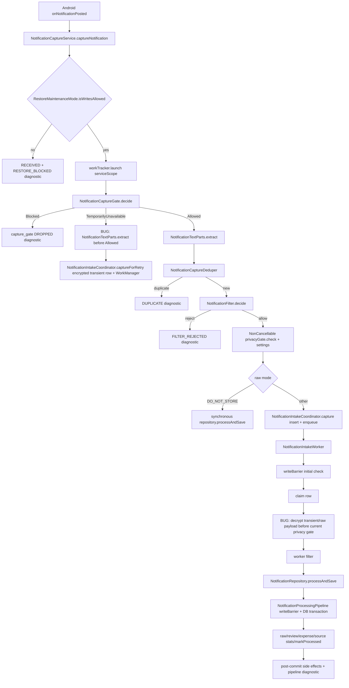
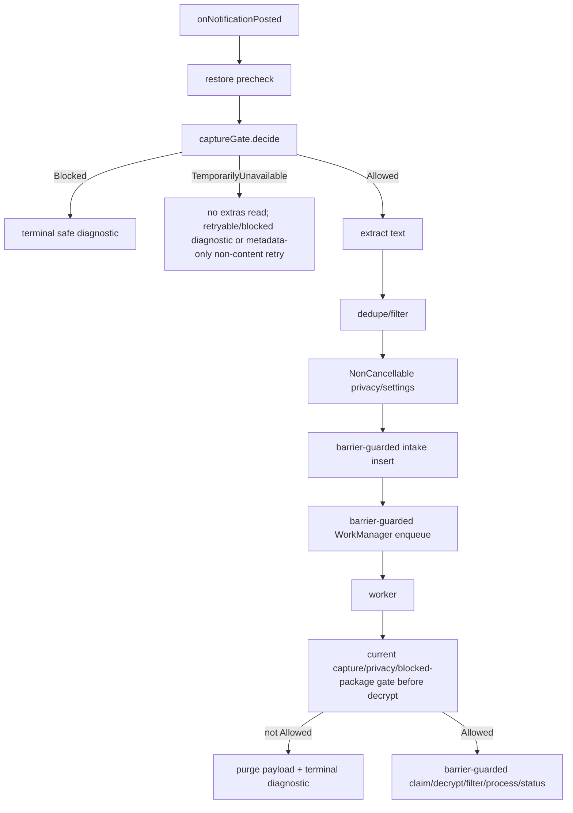

# Pipeline 1 — Notification Capture / Notification Intake Master Implementation Plan

Repository: `https://github.com/panospao7/Cost-agregator`  
Pinned commit: `83b798e849b4408b2bf683f52cb2746d37f7af16`  
Pipeline: **P1 — Notification Capture / Notification Intake**  
Mode: implementation planning only; no code changes.  
Build/test status: **NOT RUN** — static review only.

Source anchors:
- Commit: `https://github.com/panospao7/Cost-agregator/commit/83b798e849b4408b2bf683f52cb2746d37f7af16`
- P1 consolidated issues: `docs/analyses and debug master/PIPELINE_1_CONSOLIDATED_ISSUES.md`
- Master tracker: `docs/analyses and debug master/PIPELINE_ISSUES_MASTER_TRACKER.md`
- Universal tracker: `docs/analyses and debug master/UNIVERSAL_ISSUE_TRACKER.md`
- Legal paths: `docs/architecture/LEGAL_PATHS.md`
- Main source files:
  - `app/src/main/java/com/yourname/expensetracker/service/NotificationCaptureService.kt`
  - `app/src/main/java/com/yourname/expensetracker/service/NotificationFilter.kt`
  - `app/src/main/java/com/yourname/expensetracker/domain/notification/capture/NotificationCaptureGate.kt`
  - `app/src/main/java/com/yourname/expensetracker/domain/notification/capture/NotificationTextParts.kt`
  - `app/src/main/java/com/yourname/expensetracker/domain/notification/capture/NotificationIntakeCoordinator.kt`
  - `app/src/main/java/com/yourname/expensetracker/domain/notification/capture/NotificationIntakeRecoveryScheduler.kt`
  - `app/src/main/java/com/yourname/expensetracker/domain/notification/capture/NotificationIntakePayloadRepairer.kt`
  - `app/src/main/java/com/yourname/expensetracker/worker/NotificationIntakeWorker.kt`
  - `app/src/main/java/com/yourname/expensetracker/domain/notification/NotificationProcessingPipeline.kt`
  - `app/src/main/java/com/yourname/expensetracker/data/repository/NotificationRepository.kt`
  - `app/src/main/java/com/yourname/expensetracker/domain/diagnostics/NotificationDiagnosticEmitter.kt`
  - `app/src/main/java/com/yourname/expensetracker/data/database/dao/NotificationIntakeDao.kt`
  - `app/src/main/java/com/yourname/expensetracker/data/database/dao/RawNotificationDao.kt`

---

## 1. Executive summary

Current state:
- P1 has several real fixes: typed `NotificationPipelineOutcome`, richer notification text extraction, improved filter rules, in-memory dedupe cleanup, legal transaction creation through `TransactionLifecycleCoordinator`, transactional `markProcessed(rawId)` in the processing pipeline, and better normal-path privacy handling.
- P1 is still **not production-safe**. The current code can extract notification text before the capture gate reaches `Allowed` in the `TemporarilyUnavailable` path, then persist encrypted transient payload through `NotificationIntakeCoordinator.captureForRetry()`. The worker later decrypts queued payload without re-checking current notification privacy/capture/blocked-package state.
- Restore/write-barrier coverage is incomplete. `NotificationIntakeCoordinator`, `NotificationIntakeRecoveryScheduler`, and `NotificationIntakePayloadRepairer` mutate `notification_intake` / enqueue WorkManager jobs without owning their own `DatabaseWriteBarrier` check.
- Worker terminal paths mostly update `notification_intake` statuses but do not emit durable `PipelineDiagnosticEvent` / `NotificationDiagnosticEmitter` records.
- Some tests are stale or structural-only and do not prove production behavior.

Production risk:
- **P0 privacy risk**: raw notification PII can be extracted before capture is allowed and replayed later.
- **P0 restore/write risk**: intake/recovery/repair writes can occur during restore/maintenance.
- **P1 observability risk**: worker terminal paths lack durable diagnostics.
- **P1 test risk**: stale tests may fail or falsely pass.

Implementation strategy:
1. Fix privacy and barrier issues first.
2. Make worker replay fail closed and diagnostic-rich.
3. Repair stale tests and add behavior tests for privacy warm-up, restore races, and worker replay.
4. Add architecture guards preventing future ungated extraction, unbarriered intake writes, and cancellation swallowing.
5. Update P1 trackers/docs only after test-backed verification.

Recommended verdict before implementation: **RED**.

---

## 2. Scope

### In scope

- `NotificationCaptureService` listener and refresh capture paths.
- `NotificationCaptureGate` fail-closed behavior and gate-not-ready handling.
- `NotificationTextParts` extraction ordering and usage.
- `NotificationIntakeCoordinator` durable intake insert/enqueue.
- `NotificationIntakeWorker` replay/decrypt/process path.
- `NotificationIntakeRecoveryScheduler` pending/stale recovery.
- `NotificationIntakePayloadRepairer` legacy plaintext repair.
- `NotificationProcessingPipeline` only where needed for test coverage and diagnostics.
- `NotificationDiagnosticEmitter` worker/service terminal diagnostics.
- `NotificationIntakeDao` and `RawNotificationDao` mutation ownership/barriers.
- Test fixes and architecture guards.
- P1 docs/tracker reconciliation.

### Out of scope

- Full parser/model redesign.
- Broad transaction lifecycle changes outside notification-created expenses.
- Receipt/bank/import pipelines except cross-pipeline regression tests.
- DB schema migration unless local verification proves status/reason fields are insufficient.
- UI redesign of notification onboarding/privacy settings.
- Changing Android notification listener manifest unless local verification shows missing declaration/permission.

### Assumptions

- Implementation starts from exactly:

```bash
git rev-parse HEAD
```

Expected:

```text
83b798e849b4408b2bf683f52cb2746d37f7af16
```

- `LEGAL_PATHS.md` privacy and restore/write-barrier rules are normative.
- Notification text/extras must not be read until `NotificationCaptureGate` returns `Allowed`.
- Encrypted transient notification content is still sensitive and counts as persisted notification data.
- WorkManager enqueue is treated as a side effect and must not be scheduled before successful intake insert; it must also be restore/write safe.
- If the capture gate is temporarily unavailable, privacy must fail closed even if that means dropping/defer-with-metadata-only rather than storing notification text.

### Stop conditions

Stop and report before coding if:
- checkout SHA differs;
- local source paths differ materially from this plan;
- `NotificationCaptureGate` already has an unreviewed allowed-before-extraction path that changes the fix;
- product explicitly chooses to store notification text during gate warm-up despite privacy law;
- `DatabaseWriteBarrier` has no injectable binding for coordinator/scheduler/repairer/worker;
- Hilt/WorkManager cannot inject new dependencies into `NotificationIntakeWorker`;
- a DB migration appears required for diagnostic/status fields.

---

## 3. Source/doc reconciliation

| Area / Issue | Pipeline doc claim | Master tracker claim | Source-code truth | Status | Evidence |
|---|---|---|---|---|---|
| P1-P1-01 typed outcomes | Fixed | Fixed | Sealed `NotificationPipelineOutcome` exists and pipeline returns typed outcomes. | FIXED | `NotificationPipelineOutcome.kt`; `NotificationProcessingPipeline.kt`. |
| P1-P1-02 diagnostics/drop reasons | Fixed | Fixed | Service/pipeline emit many diagnostics, but worker pre-pipeline paths mostly only update intake status. | PARTIALLY_FIXED | `NotificationIntakeWorker.kt` terminal branches call DAO status updates without `NotificationDiagnosticEmitter`. |
| P1-P1-03 richer extraction | Fixed | Fixed | `NotificationTextParts.extract()` supports text lines/messages. | FIXED_WITH_TEST_GAP | `NotificationTextParts.kt`; production-direct tests missing. |
| P1-P1-05 privacy gate before extraction | Fixed | Fixed | Normal allowed path gates before extraction, but `TemporarilyUnavailable` branch extracts text before allowed. | OPEN | `NotificationCaptureService.captureNotification()` calls `NotificationTextParts.extract()` in gate-not-ready branch. |
| P1-P1-06 restore/write barrier | Fixed | Fixed | Pipeline/repository/worker have checks, but coordinator/recovery/repair writes lack their own barrier. | OPEN | `NotificationIntakeCoordinator` constructor lacks barrier and writes through `intakeDao`; scheduler/repairer write without local barrier. |
| P1-P1-07 shutdown loss after filter | Partial | Fixed | Post-filter path uses `NonCancellable`, but early terminal diagnostics can still be launched in cancellable service scope. | PARTIALLY_FIXED | `emitOrderedNotificationEvents()` uses `workTracker.launch(serviceScope)`. |
| NEW-P1-001 CancellationException swallowed | Fixed | Fixed | Most paths rethrow CE; repairer catches `Exception` in suspend loop without CE rethrow. | PARTIALLY_FIXED | `NotificationIntakePayloadRepairer.repairLegacyPlaintextTransientRows()`. |
| NEW-P1-002 source-link post-commit | Fixed | Fixed | Appears fixed; source-link diagnostics deferred post-commit. | FIXED_WITH_TEST_GAP | Needs rollback/failure isolation test. |
| NEW-P1-003 workTracker null launch | Open in old doc | Fixed | `NotificationServiceWorkTracker.launch()` always returns `Job`. | FIXED | `NotificationCaptureService.kt`. |
| NEW-P1-004 nullable job terminal diagnostics | Open in old doc | Fixed for null job; durability gap remains | No nullable job branch; early diagnostics still cancellable. | PARTIALLY_FIXED | `emitOrderedNotificationEvents()`. |
| NEW-P1-005 deposit filter | Fixed | Fixed | Deposit denied only when no expense signal. | FIXED_WITH_TEST_GAP | `NotificationFilter.kt`; add explicit regression tests. |
| NEW-P1-006 failed filter | Fixed | Fixed | “failed” denied only in payment/auth context. | FIXED_WITH_TEST_GAP | `NotificationFilter.kt`; add merchant-name regression tests. |
| NEW-P1-007 gate-not-ready handling | Open | Fixed | Gate-not-ready defers but extracts/stores encrypted text; worker lacks replay gate. | OPEN | `captureForRetry()` stores encrypted transient payload. |
| NEW-P1-008 semaphore/backpressure | Fixed | Fixed | Pipeline uses semaphore. | FIXED_SOURCE_SUPPORTED | Verify locally in `NotificationProcessingPipeline.kt`. |
| NEW-P1-009 settings TOCTOU | Open | Fixed | Synchronous path passes already-fetched settings; worker replay still uses row settings and no current privacy check. | PARTIALLY_FIXED | `processNotification(... settings)` fixed; `NotificationIntakeWorker` gap remains. |
| NEW-P1-010 markProcessed atomic | Open | Fixed | `markProcessed(rawId)` moved into pipeline transaction branches. | FIXED_WITH_TEST_GAP | Add rollback test. |
| NEW-P1-011 SHA consolidation | Open | Fixed | `RawNotificationFingerprint.kt` still uses local `MessageDigest`. | PARTIALLY_FIXED/P3 | Static grep needed. |
| NEW-P1-012 postTime dedupe | Fixed | Fixed | `computeDedupeKey` no postTime parameter. | FIXED | Static source. |
| NEW-P1-013 filter uses structured parts | Fixed | Fixed | Filter gets structured fields. | FIXED_WITH_TEST_GAP | Add regression for bigText/combined behavior. |
| NEW-P1-014 deduper cleanup | Fixed | Fixed | Cleanup called on listener connect. | FIXED | `onListenerConnected()` calls `deduper.cleanupExpired`. |
| NEW-P1-015 source link orphan | Fixed | Fixed | Likely fixed; still needs transaction rollback test for insert-conflict/check path. | FIXED_WITH_TEST_GAP | `NotificationProcessingPipeline.kt`. |
| NEW-P1-016 sensitive keys | Fixed | Fixed | CamelCase keys and case-insensitive matching present. | FIXED | `SENSITIVE_EXTRAS_KEYS`. |
| NEW-P1-017 observer retry | Fixed | Fixed | Settings/blocked package observers retry with CE rethrow. | FIXED_WITH_TEST_GAP | `NotificationCaptureGate.kt`. |
| P1-AUD-001 gate-not-ready privacy bypass | New | N/A | Text extracted and encrypted before `Allowed`; worker decrypts without current gate. | OPEN/P0 | `NotificationCaptureService`; `NotificationIntakeCoordinator`; `NotificationIntakeWorker`. |
| P1-AUD-002 intake/recovery/repair barrier bypass | New | N/A | DAO writes lack local `DatabaseWriteBarrier`. | OPEN/P0 | `NotificationIntakeCoordinator`, `NotificationIntakeRecoveryScheduler`, `NotificationIntakePayloadRepairer`. |
| P1-AUD-003 worker diagnostics missing | New | N/A | Terminal worker branches update status but do not emit diagnostics. | OPEN/P1 | `NotificationIntakeWorker`. |
| P1-AUD-004 stale tests | New | N/A | Review found filter/worker timeout tests contradict current code. | OPEN/P1 | `NotificationFilterTest`, `NotificationIntakeWorkerTimeoutTest`. |
| P1-AUD-005 deferred payload drops textLines/messages | New | N/A | `captureForRetry()` only takes title/text/bigText/subText; current fix should remove content deferral entirely. | OPEN/P2 | `captureForRetry` signature. |
| P1-AUD-006 repairer CE swallowed | New | N/A | `catch (Exception)` without CE rethrow. | OPEN/P2 | `NotificationIntakePayloadRepairer`. |
| P1-AUD-007 early diagnostics cancellable | New | N/A | Ordered terminal diagnostics launched in cancellable service scope. | OPEN/P2 | `emitOrderedNotificationEvents()`. |
| P1-AUD-008 local SHA usage | New | N/A | `RawNotificationFingerprint` still uses `MessageDigest`. | OPEN/P3 | `RawNotificationFingerprint.kt`. |

---

## 4. Architecture contracts for this pipeline

| Contract | Required legal path | Current code | Gap | Fix required |
|---|---|---|---|---|
| Pre-extraction privacy gate | No notification extras/title/text read before `NotificationCaptureGate.Allowed`. | Normal path OK; `TemporarilyUnavailable` branch extracts text and defers encrypted payload. | P0 privacy leak. | Remove extraction from gate-not-ready path; fail closed or metadata-only retry. |
| Worker replay privacy | Worker must re-check current capture/privacy/blocked-package state before decrypting stored payload. | Worker loads row, claims, decrypts transient/raw payload, then filters. | P0 replay bypass. | Inject/use capture gate or equivalent privacy+blocked-package checks before decrypt. |
| Raw storage policy | `DO_NOT_STORE` must never persist raw or encrypted notification text. | Direct capture skips durable intake for `DO_NOT_STORE`; gate-not-ready uses `STORE_METADATA_ONLY` transient encrypted payload. | Encrypted text stored before privacy settings are known/allowed. | Remove content-bearing deferred intake. |
| Restore/write barrier | Every DB mutation and WorkManager enqueue that writes app/WorkManager DB must be barrier-safe. | Pipeline/repository check; coordinator/recovery/repair not locally guarded. Worker checks once, not around every intake status mutation. | TOCTOU and hidden write risk. | Inject barrier and guard every intake DAO mutation/enqueue. |
| Transaction/lifecycle ownership | Notification-created expenses must go through transaction lifecycle coordinator. | Pipeline uses `TransactionLifecycleCoordinator.createExpenseDbOnlyV2`. | Appears OK; tests needed. | Add regression tests; no broad change. |
| Diagnostics | Every terminal/drop/retry path should have durable safe diagnostic. | Service/pipeline mostly emit; worker does not. | Missing worker diagnostics. | Inject emitter into worker; emit safe diagnostic for each outcome. |
| Cancellation | `CancellationException` must not be swallowed. | Worker mostly rethrows; repairer does not. | Repairer contract violation; early diagnostics cancellable. | Add CE catch/rethrow and contract guard. |
| Side effects after commit | WorkManager enqueue after intake insert; post-commit side effects only after successful DB work. | Coordinator inserts then enqueues; no transaction boundary around enqueue; no barrier before enqueue. | If barrier flips after insert, enqueue may write during restore. | Check barrier before enqueue; if blocked, leave row pending for recovery. |
| Privacy-safe metadata | Diagnostics/logs must not contain raw notification text. | Mostly hashed metadata; some exception messages may be included. | Worker diagnostics to add must remain safe. | Use hashed package/key/correlation/intake IDs only. |

---

## 5. Current runtime flow



Target runtime flow after PR1:



---

## 6. Implementation phases

### PR 1 — Critical privacy and restore/write safety

Goal:
- No notification extras/text extraction until capture gate is `Allowed`.
- Worker replay checks current privacy/capture/blocked-package state before decrypting.
- Every intake/recovery/repair/worker status mutation and enqueue is `DatabaseWriteBarrier` guarded.

Risk:
- Medium/high. Privacy fail-closed behavior may drop first notifications during gate warm-up.

Files:
- `NotificationCaptureService.kt`
- `NotificationIntakeCoordinator.kt`
- `NotificationIntakeWorker.kt`
- `NotificationIntakeRecoveryScheduler.kt`
- `NotificationIntakePayloadRepairer.kt`
- Hilt modules if constructor injections change
- focused tests

Work items:
- P1-PRIV-001
- P1-PRIV-002
- P1-BARRIER-003
- P1-BARRIER-004
- P1-CANCEL-005

Tests:
- gate-not-ready does not call `NotificationTextParts.extract`;
- no encrypted transient payload created before allowed;
- worker privacy disabled after enqueue purges without decrypting;
- restore flip before insert/enqueue blocks writes;
- recovery/repair during restore performs no mutation;
- repairer rethrows CE.

Acceptance criteria:
- No content-bearing deferred intake exists before `Allowed`.
- Worker cannot decrypt/process if current capture state is denied/fail-closed/blocked.
- No P1 production DAO mutation lacks barrier coverage.

### PR 2 — Worker diagnostics and durable terminal evidence

Goal:
- Emit `NotificationDiagnosticEmitter` events for every worker terminal/retry/drop path.
- Make early service terminal diagnostics non-cancellable.
- Preserve privacy-safe metadata.

Risk:
- Medium. Diagnostic paths must not reintroduce restore writes or PII.

Files:
- `NotificationIntakeWorker.kt`
- `NotificationCaptureService.kt`
- `NotificationDiagnosticEmitter.kt` if helper methods needed
- tests

Work items:
- P1-DIAG-006
- P1-DIAG-007
- P1-DIAG-008

Tests:
- payload unavailable, filter rejected, max attempts, retryable failure, timeout, final failure, restore-blocked retry all emit safe diagnostics;
- early restore/shutdown diagnostic survives service cancellation;
- no diagnostic metadata includes raw notification text.

Acceptance criteria:
- Durable diagnostics exist for all worker exits.
- Diagnostics remain safe under maintenance fallback and cancellation.

### PR 3 — Behavioral test repair and intake correctness

Goal:
- Replace stale/structural tests with runtime behavior tests.
- Add extraction/filter/dedupe regressions.
- Verify transaction lifecycle path remains legal.

Risk:
- Low/medium.

Files:
- `NotificationFilterTest.kt`
- `NotificationIntakeWorkerTimeoutTest.kt`
- `NotificationCaptureService*Test.kt`
- `NotificationTextPartsTest.kt`
- `NotificationProcessingPipeline*Test.kt`
- architecture/contract tests

Work items:
- P1-TEST-009
- P1-TEST-010
- P1-DEDUPE-011
- P1-LIFECYCLE-012

Tests:
- finance package with no amount is rejected;
- deposit fee captured, salary deposit dropped;
- merchant name containing “Failed” with amount is not dropped as failed payment;
- worker timeout test reaches repository branch;
- textLines/messages extraction via production extractor;
- same notification key but different content/postTime behavior after removing deferred content payload;
- notification-created expense uses transaction lifecycle and source link rollback behavior.

Acceptance criteria:
- Focused P1 tests pass.
- Tests assert production behavior, not only structural source strings.

### PR 4 — Architecture guards, hashing cleanup, docs/tracker sync

Goal:
- Prevent regression.
- Reconcile stale trackers.
- Consolidate SHA helper use.

Risk:
- Low.

Files:
- architecture guard tests
- `RawNotificationFingerprint.kt`
- P1 docs/tracker

Work items:
- P1-GUARD-013
- P1-HASH-014
- P1-DOC-015

Tests:
- static guards pass:
  - no `NotificationTextParts.extract` before gate allowed;
  - no `captureForRetry` content parameters / no encrypted transient in gate-not-ready path;
  - all P1 DAO writes have nearby barrier guard or allowed owner;
  - no `catch(Exception)` without CE handling in P1 files;
  - no direct local `MessageDigest.getInstance("SHA-256")` outside shared helper.

Acceptance criteria:
- Docs reflect real status.
- P1 can be reclassified only after code/tests pass.

---

## 7. Detailed work items

| ID | Severity | Title | Files | Implementation steps | Tests | Acceptance criteria |
|---|---|---|---|---|---|---|
| P1-PRIV-001 | P0 | Remove text extraction from gate-not-ready path | `NotificationCaptureService.kt`, `NotificationIntakeCoordinator.kt` | In `captureNotification()`, delete `NotificationTextParts.extract()` from `TemporarilyUnavailable` branch. Do not pass title/text/bigText/subText to `captureForRetry`. Prefer: emit `FAILED_RETRYABLE` diagnostic and return. If product wants retry, make it metadata-only and non-processing: package hash, key hash, postTime, correlationId only. Do not persist encrypted title/text/body. Update KDoc that gate-not-ready never reads extras. | `gateTemporarilyUnavailableDoesNotExtractExtras`; `gateTemporarilyUnavailableCreatesNoTransientCiphertext`; `gateTemporarilyUnavailableEmitsRetryableDiagnostic`. | No notification text/extras are read or persisted before `Allowed`. |
| P1-PRIV-002 | P0 | Worker must re-check capture/privacy/blocked-package state before decrypting | `NotificationIntakeWorker.kt`, Hilt modules | Inject `NotificationCaptureGate` or equivalent `PrivacyGate` + blocked-package checker. After loading row metadata and before `claimForProcessing` or decrypting, call `captureGate.decide(current.packageName, isShuttingDown=false)` or a worker-safe preflight. If `Blocked`, mark terminal safe status, purge raw/transient payload without decrypting, emit diagnostic, return success. If `TemporarilyUnavailable`, do not decrypt; mark retryable or return `Result.retry()` with diagnostic. Only `Allowed` may claim/decrypt/filter/process. | `workerPrivacyDeniedAfterEnqueuePurgesWithoutDecrypt`; `workerBlockedPackageAfterEnqueuePurgesWithoutDecrypt`; `workerGateTemporarilyUnavailableDoesNotDecryptAndRetries`; crypto fake asserts decrypt not called. | Queued notification payload cannot be replayed when current privacy/capture state is not allowed. |
| P1-BARRIER-003 | P0 | Add write barrier to intake coordinator insert/enqueue | `NotificationIntakeCoordinator.kt`, DI | Inject `DatabaseWriteBarrier`. Before `intakeDao.existsByFingerprint` if DB reads are restore-restricted use read barrier if available; at minimum call `writeBarrier.checkWritesAllowed("NotificationIntakeCoordinator.capture.insert")` immediately before `insertOrIgnore`. After successful insert and before `WorkManager.enqueueUniqueWork`, call `checkWritesAllowed("NotificationIntakeCoordinator.capture.enqueue")`. If enqueue is blocked after insert, leave row `RECEIVED` for recovery and emit maintenance-safe diagnostic; do not delete row unless rollback semantics are explicitly approved. Apply same to metadata-only deferred method if retained. | `captureRestoreBlockedBeforeInsertDoesNotWrite`; `captureRestoreFlipsBeforeEnqueueLeavesPendingAndNoWorkEnqueued`; `captureForRetryRestoreBlockedDoesNotWrite`. | Intake coordinator owns barrier checks; no TOCTOU from service-only precheck. |
| P1-BARRIER-004 | P0 | Add write barrier to worker, recovery scheduler, repairer writes | `NotificationIntakeWorker.kt`, `NotificationIntakeRecoveryScheduler.kt`, `NotificationIntakePayloadRepairer.kt` | In worker, wrap every `intakeDao` mutation (`claimForProcessing`, `markFinalFailure`, `markTerminal`, `markRetryableFailure`, `purgeRawPayload`, `purgeTransientPayload`) in a helper that calls `writeBarrier.checkWritesAllowed(stage)` immediately before mutation. In recovery scheduler, check barrier before release/re-enqueue/status updates and before WorkManager enqueue. In repairer, check barrier before any repair mutation. If blocked, emit safe diagnostic and skip/retry. | `workerRestoreFlipBeforeClaimDoesNotClaim`; `workerRestoreFlipBeforeTerminalMarkDoesNotMutate`; `recoveryDuringRestoreDoesNotMutateOrEnqueue`; `repairerDuringRestoreDoesNotMutate`. | Every notification intake write is guarded at owner level. |
| P1-CANCEL-005 | P2 | Repairer must rethrow CancellationException | `NotificationIntakePayloadRepairer.kt`, cancellation tests | Add `catch (e: CancellationException) { throw e }` before broad `Exception`, or `if (e is CancellationException) throw e` inside catch. Add repairer to CE static contract test. | `repairLegacyPlaintextRowsRethrowsCancellationException`; update `CancellationPropagationContractTest`. | CE is never swallowed by repairer. |
| P1-DIAG-006 | P1 | Emit worker diagnostics for terminal/drop/retry paths | `NotificationIntakeWorker.kt` | Inject `NotificationDiagnosticEmitter`. Add helper `emitWorkerDiagnostic(stage,outcome,reason,status,intake,exception?)` using `SafeEventMetadata`: hash packageName, include intakeId, attempt count, status, correlationId; never include title/text/body/extras. Emit for invalid intake ID if possible, intake row missing, max attempts, payload unavailable, privacy denied, blocked package, gate unavailable, filter rejected, duplicate/policy outcomes, retryable failure, timeout, final failure, restore blocked. | Parameterized `workerTerminalPathEmitsDiagnostic` tests for each branch. | Intake status ledger and diagnostic ledger both reflect worker outcomes. |
| P1-DIAG-007 | P2 | Make early service terminal diagnostics non-cancellable | `NotificationCaptureService.kt`, possibly `NotificationDiagnosticEmitter.kt` | Replace `emitOrderedNotificationEvents()` launch in cancellable `serviceScope` with `withContext(NonCancellable)` inside app/service-safe scope, or add emitter method `emitOrderedNonCancellable`. Ensure `onDestroy` cannot cancel restore/shutdown terminal diagnostics mid-write. Keep no raw PII. | `restoreBlockedDiagnosticSurvivesServiceDestroy`; `shutdownBlockedDiagnosticSurvivesServiceDestroy`. | RECEIVED + terminal diagnostics are durable for pre-launch drops. |
| P1-DIAG-008 | P2 | Privacy-safe exception/failure metadata | Worker/service/pipeline diagnostics | Audit newly added diagnostics; use reason enums/hashes, not raw exception messages if they may contain notification text. If exception stored, pass through existing sanitizer only. | `workerDiagnosticsDoNotContainRawNotificationText`; `exceptionMetadataSanitized`. | No raw title/text/extras in diagnostic rows/logs. |
| P1-TEST-009 | P1 | Fix stale filter and timeout tests | `NotificationFilterTest.kt`, `NotificationIntakeWorkerTimeoutTest.kt` | Update filter tests: finance package alone is not enough; amount/transaction signal required. Add positive amount cases. Update worker timeout fixture so decrypted/raw payload passes filter, e.g. package bank app + title/text containing `Payment €1.00`; repository mock timeout branch is reached. | Existing fixed tests plus new regressions. | Focused tests reflect current production filter. |
| P1-TEST-010 | P1 | Add privacy warm-up and replay tests | New/updated service and worker tests | Use fake `StatusBarNotification` / fake extras that throws or records access. Gate returns `TemporarilyUnavailable`; assert extras not accessed and coordinator not passed content. Enqueue row under allowed, then make worker gate denied; assert crypto decrypt not called, payload purged, diagnostic emitted. | Tests named above. | P0 privacy fixes are proven behaviorally. |
| P1-DEDUPE-011 | P2 | Fix/de-scope deferred fingerprint issue | `NotificationIntakeCoordinator.kt`, tests | If `captureForRetry` remains metadata-only, mark rows as non-processing and avoid broad `DEFERRED_${notificationKeyHash}` conflicts causing content loss. If content-bearing deferral is removed entirely, delete/limit method and tests accordingly. Do not hash raw content before allowed gate. | `sameKeyDifferentContentDuringGateUnavailableDoesNotCollapseContentBecauseNoContentIsStored`; or `metadataOnlyDeferredRowsDoNotProcess`. | Gate-unavailable path cannot lose or process sensitive content. |
| P1-LIFECYCLE-012 | P1/P2 | Add legal transaction/source-link regression tests | `NotificationProcessingPipeline*Test.kt`, transaction lifecycle tests | Verify notification-created auto-accepted expense goes through `TransactionLifecycleCoordinator.createExpenseDbOnlyV2` or current legal method. Add rollback test: source-link failure after expense/raw insert does not orphan inconsistent DB state, or is recorded as diagnostic post-commit according to contract. | `autoAcceptedNotificationUsesTransactionLifecycle`; `sourceLinkFailureDoesNotOrphanExpenseOrRaw`. | Legal transaction path remains intact while P1 fixes land. |
| P1-GUARD-013 | P1 | Add P1 architecture guards | architecture test package | Static scan guards: no `NotificationTextParts.extract` in `TemporarilyUnavailable` branch; no `captureForRetry` overload accepting title/text/bigText/subText; every `NotificationIntakeDao` mutation caller in production has `DatabaseWriteBarrier` or is allowlisted test/migration; worker decrypt occurs only after gate preflight; no P1 `catch(Exception)` without CE handling. | `P1NotificationLegalPathGuardTest`. | Future privacy/barrier/cancellation regressions fail CI. |
| P1-HASH-014 | P3 | Consolidate SHA helper in raw fingerprint | `RawNotificationFingerprint.kt`, shared hash tests | Replace local `MessageDigest.getInstance("SHA-256")` with `domain.common.sha256` / `sha256Fingerprint`. Add static guard for direct SHA use outside helper. | `rawNotificationFingerprintMatchesSharedSha256`; guard test. | Hashing policy is centralized. |
| P1-DOC-015 | P3 | Update P1 docs and trackers | P1 issue docs, master tracker, universal tracker | Mark master “all fixed” status as stale until P0/P1 tests pass. Record fixed/partial/open statuses from this plan. Document new gate-not-ready policy and worker privacy replay contract. | Docs review. | Future agents do not trust stale green status. |

---

## 8. File-by-file change plan

| File | Change type | Exact changes | Risk | Tests covering it |
|---|---|---|---|---|
| `NotificationCaptureService.kt` | MODIFY | Remove `NotificationTextParts.extract()` from `TemporarilyUnavailable`; do not call content-bearing `captureForRetry`; use non-cancellable ordered diagnostics for restore/shutdown terminal paths; keep extraction only after `Allowed`. | High | privacy warm-up tests, diagnostic durability tests |
| `NotificationIntakeCoordinator.kt` | MODIFY | Inject `DatabaseWriteBarrier`; guard insert and enqueue; remove or restrict content-bearing `captureForRetry`; make deferred path metadata-only/non-processing if retained. | High | restore race tests, gate-not-ready tests |
| `NotificationIntakeWorker.kt` | MODIFY | Inject `NotificationCaptureGate` or equivalent current privacy/blocked checker and `NotificationDiagnosticEmitter`; preflight before claim/decrypt; guard every intake DAO mutation; emit diagnostics for all outcomes. | High | worker privacy replay, barrier, diagnostics, timeout tests |
| `NotificationIntakeRecoveryScheduler.kt` | MODIFY | Inject barrier; check before release/re-enqueue/status mutations and WorkManager enqueue; emit blocked diagnostic. | Medium | recovery restore tests |
| `NotificationIntakePayloadRepairer.kt` | MODIFY | Inject barrier; check before repair mutations; rethrow `CancellationException`; emit safe blocked/failure diagnostic if needed. | Medium | repair restore + CE tests |
| `NotificationCaptureGate.kt` | NO_CHANGE_READ_ONLY / MODIFY if needed | Prefer no broad change. If worker-safe gate method needed, add `decideForReplay(packageName)` that does not require `StatusBarNotification`. | Medium | worker gate tests |
| `NotificationTextParts.kt` | NO_CHANGE_READ_ONLY | Keep extractor; add direct production tests for textLines/messages. | Low | extraction tests |
| `NotificationFilter.kt` | NO_CHANGE_READ_ONLY / UPDATE_TEST | Do not change unless stale tests reveal actual bug. | Low | filter tests |
| `NotificationDiagnosticEmitter.kt` | MODIFY if needed | Add `emitOrderedNonCancellable` or worker helper only if existing API insufficient. | Medium | diagnostic durability tests |
| `NotificationProcessingPipeline.kt` | NO_CHANGE_READ_ONLY / UPDATE_TEST | Only add tests unless lifecycle/source-link regression found. | Low | lifecycle/source-link tests |
| `RawNotificationFingerprint.kt` | MODIFY | Use shared SHA helper. | Low | hash tests/guard |
| `NotificationFilterTest.kt` | UPDATE_TEST | Align expectations to current filter contract. | Low | focused tests |
| `NotificationIntakeWorkerTimeoutTest.kt` | UPDATE_TEST | Use payload that passes filter and reaches repository timeout branch. | Low | focused worker tests |
| `NotificationCaptureService*Test.kt` | ADD_TEST/UPDATE_TEST | Add gate-not-ready, no-extraction, non-cancellable diagnostic tests. | Medium | itself |
| `NotificationIntakeWorker*Test.kt` | ADD_TEST/UPDATE_TEST | Add privacy replay, barrier, terminal diagnostics, CE behavior. | Medium | itself |
| `P1NotificationLegalPathGuardTest.kt` | ADD_GUARD | Static guards for privacy/barrier/CE/hash rules. | Medium | architecture check |
| P1 docs/tracker | UPDATE_DOC | Reconcile statuses and implementation notes. | Low | docs review |

---

## 9. Database / schema / migration plan

Default plan:

```text
No schema migration required.
```

Expected changes use existing:
- `notification_intake` statuses/failure fields,
- existing transient payload purge columns,
- existing diagnostic event table,
- existing WorkManager enqueue.

Potential schema change only if local verification shows there is no status/reason capable of representing:
- privacy denied after enqueue,
- blocked package after enqueue,
- gate temporarily unavailable after enqueue,
- restore-blocked retry.

If schema change is needed:

| Change | Entity/DAO | Migration required? | Schema export required? | Backfill required? | Tests |
|---|---|---:|---:|---:|---|
| Add enum/status value only | `NotificationIntakeStatus` | No, if string column accepts arbitrary enum names | No | No | status compatibility tests |
| Add new failure reason column | `NotificationIntakeEntity` / `NotificationIntakeDao` | Yes | Yes | Optional default null | migration + DAO tests |
| Add durable worker diagnostic table | Prefer existing diagnostic table | Avoid | Avoid | No | diagnostic tests |

Recommendation:
- Do not migrate for PR1/PR2 unless absolutely required.
- Use existing string `status`, `failureCode`, `finalOutcome`, and diagnostic event metadata.

---

## 10. Test plan

### Existing tests to run

```bash
./gradlew :app:testDebugUnitTest --stacktrace
./gradlew :app:assembleDebug --stacktrace
```

### Focused tests

```bash
./gradlew :app:testDebugUnitTest --tests "*Notification*" --stacktrace
./gradlew :app:testDebugUnitTest --tests "*NotificationCaptureService*" --stacktrace
./gradlew :app:testDebugUnitTest --tests "*NotificationIntakeWorker*" --stacktrace
./gradlew :app:testDebugUnitTest --tests "*NotificationIntakeCoordinator*" --stacktrace
./gradlew :app:testDebugUnitTest --tests "*NotificationIntakeRecovery*" --stacktrace
./gradlew :app:testDebugUnitTest --tests "*NotificationIntakePayloadRepairer*" --stacktrace
./gradlew :app:testDebugUnitTest --tests "*NotificationFilter*" --stacktrace
./gradlew :app:testDebugUnitTest --tests "*NotificationTextParts*" --stacktrace
./gradlew :app:testDebugUnitTest --tests "*NotificationProcessingPipeline*" --stacktrace
./gradlew :app:testDebugUnitTest --tests "*CancellationPropagationContract*" --stacktrace
./gradlew :app:testDebugUnitTest --tests "*LifecycleBarrierContract*" --stacktrace
./gradlew :app:testDebugUnitTest --tests "*PrivacyStorageContract*" --stacktrace
./gradlew :app:testDebugUnitTest --tests "*P1NotificationLegalPathGuard*" --stacktrace
```

### New tests to add

| Test file | Test name | Behavior covered |
|---|---|---|
| `NotificationCaptureServicePrivacyGateTest.kt` | `temporarilyUnavailableGateDoesNotReadNotificationExtras` | No extraction before `Allowed`. |
| `NotificationCaptureServicePrivacyGateTest.kt` | `temporarilyUnavailableGateDoesNotCreateTransientPayload` | No encrypted content pre-consent. |
| `NotificationCaptureServicePrivacyGateTest.kt` | `blockedGateEmitsTerminalDiagnosticWithoutExtraction` | Blocked path safe. |
| `NotificationIntakeWorkerPrivacyReplayTest.kt` | `privacyDeniedAfterEnqueuePurgesPayloadWithoutDecrypting` | Worker replay privacy. |
| `NotificationIntakeWorkerPrivacyReplayTest.kt` | `blockedPackageAfterEnqueuePurgesPayloadWithoutDecrypting` | Worker blocked-package replay. |
| `NotificationIntakeWorkerPrivacyReplayTest.kt` | `gateUnavailableAfterEnqueueRetriesWithoutDecrypting` | Worker fail-closed retry. |
| `NotificationIntakeCoordinatorBarrierTest.kt` | `captureBlockedByRestoreBeforeInsertDoesNotWriteOrEnqueue` | Coordinator barrier. |
| `NotificationIntakeCoordinatorBarrierTest.kt` | `restoreFlipBeforeEnqueueLeavesPendingRowAndNoWorkEnqueue` | Insert/enqueue TOCTOU. |
| `NotificationIntakeWorkerBarrierTest.kt` | `restoreFlipBeforeClaimDoesNotClaimRow` | Worker mutation barrier. |
| `NotificationIntakeRecoverySchedulerBarrierTest.kt` | `recoveryDuringRestoreDoesNotMutateOrEnqueue` | Recovery barrier. |
| `NotificationIntakePayloadRepairerTest.kt` | `repairerDuringRestoreDoesNotMutate` | Repair barrier. |
| `NotificationIntakePayloadRepairerTest.kt` | `repairerRethrowsCancellationException` | CE propagation. |
| `NotificationIntakeWorkerDiagnosticsTest.kt` | `payloadUnavailableEmitsDiagnostic` | Worker diagnostic. |
| `NotificationIntakeWorkerDiagnosticsTest.kt` | `filterRejectedEmitsDiagnostic` | Worker diagnostic. |
| `NotificationIntakeWorkerDiagnosticsTest.kt` | `maxAttemptsExceededEmitsDiagnostic` | Worker diagnostic. |
| `NotificationIntakeWorkerDiagnosticsTest.kt` | `timeoutRetryAndFinalFailureEmitDiagnostics` | Worker retry/final diagnostics. |
| `NotificationCaptureServiceDiagnosticsTest.kt` | `restoreBlockedDiagnosticSurvivesServiceDestroy` | Non-cancellable terminal diagnostics. |
| `NotificationTextPartsTest.kt` | `extractsTextLinesAndMessagingStyleMessages` | Production extractor. |
| `NotificationFilterTest.kt` | `financePackageWithoutAmountIsRejected` | Current filter contract. |
| `NotificationFilterTest.kt` | `depositFeeWithAmountIsCapturedButSalaryDepositDropped` | Deposit regression. |
| `NotificationFilterTest.kt` | `failedMerchantNameWithAmountIsNotDroppedAsPaymentFailure` | Failed-word regression. |
| `NotificationIntakeWorkerTimeoutTest.kt` | `repositoryTimeoutMarksRetryableWhenPayloadPassesFilter` | Fixed stale test. |
| `NotificationProcessingPipelineLifecycleTest.kt` | `autoAcceptedNotificationUsesTransactionLifecycle` | Legal expense path. |
| `NotificationProcessingPipelineSourceLinkTest.kt` | `sourceLinkFailureDoesNotLeaveOrphanState` | Source/provenance safety. |
| `P1NotificationLegalPathGuardTest.kt` | `noNotificationTextExtractionBeforeCaptureGateAllowed` | Static privacy guard. |
| `P1NotificationLegalPathGuardTest.kt` | `notificationIntakeDaoMutationsRequireWriteBarrier` | Static barrier guard. |
| `P1NotificationLegalPathGuardTest.kt` | `p1CatchesExceptionRethrowCancellationException` | Static CE guard. |

### Architecture guard tests

| Guard | Expected rule |
|---|---|
| Pre-extraction guard | `NotificationTextParts.extract`, `sbn.notification.extras`, and raw extras access must appear only after `NotificationCaptureDecision.Allowed` in service capture path. |
| Deferred content guard | `captureForRetry` must not accept or persist title/text/bigText/subText; any metadata-only retry must not be processed as content. |
| Worker decrypt guard | `crypto.decrypt` must occur after current gate/privacy preflight in `NotificationIntakeWorker`. |
| Intake barrier guard | Production `NotificationIntakeDao` mutation callers must have `DatabaseWriteBarrier.checkWritesAllowed` in method or delegated guarded helper. |
| WorkManager enqueue guard | P1 enqueue of notification-intake work must be barrier-checked and occur after insert success. |
| CE guard | No P1 production `catch (Exception)` / `runCatching` swallows `CancellationException`. |
| Hash guard | No direct `MessageDigest.getInstance("SHA-256")` outside shared hash helper and allowlisted tests. |
| PII diagnostics guard | Worker diagnostic metadata builders must not include `title`, `text`, `bigText`, `extrasJson`, or decrypted payload. |

---

## 11. Validation commands

Initial verification:

```bash
git rev-parse HEAD
git status --short
```

Expected SHA:

```text
83b798e849b4408b2bf683f52cb2746d37f7af16
```

Source discovery:

```bash
find app/src/main/java -type f | sort
find app/src/test/java -type f | sort
find app/src/androidTest/java -type f | sort

rg -n "NotificationCapture|NotificationIntake|NotificationTextParts|NotificationFilter|RawNotification|PipelineDiagnostic|NotificationDiagnostic" app/src/main app/src/test app/src/androidTest docs config scripts

rg -n "withTransaction|DatabaseWriteBarrier|DatabaseReadBarrier|RestoreMaintenanceMode|checkWritesAllowed|checkReadsAllowed|DatabaseAccessBlockedException" app/src/main app/src/test app/src/androidTest

rg -n "TransactionEvent|LifecycleEvent|DiagnosticEvent|PipelineDiagnosticEvent|Audit|EventWriter" app/src/main app/src/test app/src/androidTest

rg -n "insert\\(|insertAll\\(|update\\(|delete\\(|deleteAll\\(|@Query\\(\"UPDATE|@Query\\(\"DELETE|@Query\\(\"INSERT" app/src/main/java app/src/test/java app/src/androidTest/java

rg -n "catch \\(e: Exception\\)|runCatching|CancellationException|NonCancellable|SupervisorJob|launch|async" app/src/main app/src/test app/src/androidTest

rg -n "NotificationTextParts\\.extract|sbn\\.notification\\.extras|captureForRetry|crypto\\.decrypt|NotificationIntakeDao|WorkManager|enqueueUniqueWork|MessageDigest.getInstance" app/src/main app/src/test app/src/androidTest
```

Focused validation:

```bash
./gradlew :app:testDebugUnitTest --tests "*NotificationCaptureService*" --stacktrace
./gradlew :app:testDebugUnitTest --tests "*NotificationIntakeWorker*" --stacktrace
./gradlew :app:testDebugUnitTest --tests "*NotificationIntakeCoordinator*" --stacktrace
./gradlew :app:testDebugUnitTest --tests "*NotificationIntakeRecovery*" --stacktrace
./gradlew :app:testDebugUnitTest --tests "*NotificationIntakePayloadRepairer*" --stacktrace
./gradlew :app:testDebugUnitTest --tests "*NotificationFilter*" --stacktrace
./gradlew :app:testDebugUnitTest --tests "*NotificationTextParts*" --stacktrace
./gradlew :app:testDebugUnitTest --tests "*P1NotificationLegalPathGuard*" --stacktrace
```

Full validation:

```bash
./gradlew :app:testDebugUnitTest --stacktrace
./gradlew :app:assembleDebug --stacktrace
./gradlew :app:check --stacktrace
```

Instrumentation tests if Android notification listener/Bundle behavior cannot be fully faked:

```bash
./gradlew connectedDebugAndroidTest
```

---

## 12. Documentation updates

| Doc | Required update | Reason |
|---|---|---|
| `docs/analyses and debug master/PIPELINE_1_CONSOLIDATED_ISSUES.md` | Reconcile actual statuses; add P1-AUD-001 through P1-AUD-008; mark master-fixed privacy/barrier claims as reopened until tests pass. | Current tracker overstates fixes. |
| `docs/analyses and debug master/PIPELINE_ISSUES_MASTER_TRACKER.md` | Set P1 RED until PR1/PR2 complete; update issue rows after validation. | Release gating. |
| `docs/analyses and debug master/UNIVERSAL_ISSUE_TRACKER.md` | Note P1 remaining restore barrier, cancellation, and privacy-gate replay issues. | Universal contract status. |
| `docs/architecture/LEGAL_PATHS.md` | If new gate-not-ready or worker replay policy is introduced, document it: no extraction before Allowed; worker preflight before decrypt. | Architecture law alignment. |
| `docs/DB_WRITE_OWNERSHIP.md` | Add/confirm `NotificationIntakeCoordinator`, `NotificationIntakeWorker`, recovery scheduler, and repairer as allowed writers only when barrier-guarded. | DAO ownership. |
| `docs/testing/` or architecture guard docs | Document new P1 legal-path guards. | Regression prevention. |

---

## 13. Risk and rollback plan

| Risk | Probability | Impact | Mitigation | Rollback |
|---|---:|---:|---|---|
| Gate-not-ready notifications are dropped instead of deferred with content | High | Medium user-data loss | Privacy law wins; emit retryable diagnostic and rely on refresh/next notification. Consider metadata-only retry that re-checks active notification without persisted text if feasible. | Restore old content deferral only behind explicit product/privacy approval; not recommended. |
| Worker preflight uses capture gate that depends on service-only state | Medium | Medium | Add worker-safe gate method using privacy + blocked package + maintenance only. | Use direct `PrivacyGate` + `BlockedPackageDao` instead of full gate. |
| Barrier check after insert before enqueue leaves pending rows | Medium | Low/Medium | Recovery scheduler picks up pending rows after maintenance; add test. | If unacceptable, wrap insert in transaction and mark blocked status; do not enqueue. |
| Diagnostics during maintenance fail | Medium | Low | Use existing emitter maintenance-safe fallback; diagnostics best-effort but no raw PII. | Log safe hashed metadata only if DB blocked. |
| Hilt injection breaks worker construction | Medium | Medium | Update Worker/Hilt module tests and compile after PR1. | Revert to a small injected `NotificationWorkerPrivacyPreflight` service already bound. |
| Static guards false-positive due minified one-line source | Medium | Low | Use regex over source text carefully and allowlist tests/comments. | Narrow guard scope; do not remove guard. |
| Stale tests require broad fixture work | Medium | Medium | Fix focused tests first; avoid broad refactor. | Quarantine only if test references removed API and replacement behavior test is added. |
| Current raw stored rows remain after privacy mode change | Medium | High | Worker preflight purges payload on denied/blocked; consider one-time cleanup task after privacy toggle. | If cleanup too broad, purge only rows owned by worker preflight. |

---

## 14. Pipeline-specific checklist

### Entry points

- UI/ViewModel entry points:
  - notification/privacy settings screens controlling `PrivacyCapability.NOTIFICATION_CAPTURE`, raw storage mode, blocked packages.
  - Needs local `rg -n "NOTIFICATION_CAPTURE|RawStorageMode|blockedPackage" app/src/main/java/com/yourname/expensetracker/ui`.
- Worker entry points:
  - `NotificationIntakeWorker.doWork()`.
  - WorkManager unique work from `NotificationIntakeCoordinator.capture()` and `captureForRetry()` if retained.
- Repository entry points:
  - `NotificationRepository.processAndSave()`.
- Coordinator/service entry points:
  - `NotificationCaptureService.onNotificationPosted()`.
  - `NotificationCaptureService.refreshActiveNotifications()` / `processNotificationBypassDedupe()` if present.
  - `NotificationIntakeCoordinator.capture()`.
  - `NotificationIntakeRecoveryScheduler.recoverPending()`.
  - `NotificationIntakePayloadRepairer.repairLegacyPlaintextTransientRows()`.
- Import/external source entry points:
  - Android `NotificationListenerService` / `StatusBarNotification`.
  - WorkManager replay of queued intake.

### Core owner

- Legal lifecycle owner:
  - Notification capture: `NotificationCaptureService` + `NotificationCaptureGate`.
  - Durable intake: `NotificationIntakeCoordinator`.
  - Deferred processing: `NotificationIntakeWorker`.
  - Expense creation: `TransactionLifecycleCoordinator` through `NotificationProcessingPipeline`.
- Direct collaborators:
  - `PrivacyGate`
  - `PrivacySettingsRepository`
  - `BlockedPackageDao`
  - `RestoreMaintenanceMode`
  - `DatabaseWriteBarrier`
  - `NotificationIntakeDao`
  - `RawNotificationDao`
  - `NotificationDiagnosticEmitter`
  - `NotificationTransientPayloadCrypto`
  - `WorkManager`
- Event writer:
  - `NotificationDiagnosticEmitter` / pipeline diagnostic event writer.
  - Transaction event writer indirectly through `TransactionLifecycleCoordinator`.
- DAO owner:
  - `NotificationIntakeDao`: coordinator, worker, recovery scheduler, repairer only, all barrier-guarded.
  - `RawNotificationDao`: `NotificationProcessingPipeline` / `NotificationRepository` only, barrier + transaction.
- Side-effect dispatcher/planner:
  - WorkManager enqueue after intake insert.
  - Transaction post-commit side effects after auto-accepted expense creation.

### Persistence

- Entities:
  - `NotificationIntakeEntity`
  - `RawNotification`
  - review entity if parser requires review
  - expense/source-link entities through transaction pipeline
  - diagnostic event entities
- DAOs:
  - `NotificationIntakeDao`
  - `RawNotificationDao`
  - `BlockedPackageDao`
  - review/source-link DAOs indirectly
- Migrations:
  - none expected.
- Schema version:
  - unchanged by default.
- Indexes/constraints:
  - existing unique fingerprint/index behavior retained.
  - no new index planned.

### Audit / diagnostics

- Lifecycle event table/entity:
  - transaction lifecycle events for auto-accepted expenses.
- Diagnostic event table/entity:
  - `PipelineDiagnosticEvent` / `DiagnosticEvent` via `NotificationDiagnosticEmitter`.
- Required terminal events:
  - received,
  - restore blocked,
  - capture gate blocked,
  - gate temporarily unavailable,
  - privacy denied,
  - filter rejected,
  - duplicate,
  - intake insert conflict,
  - payload unavailable,
  - worker retryable failure,
  - worker max attempts/final failure,
  - timeout,
  - processed / auto accepted / needs review / parser failed.
- Missing event cases:
  - worker terminal/retry/drop paths before pipeline.
  - early terminal diagnostics cancellable.

### Barriers

- Write barrier locations:
  - coordinator insert,
  - coordinator WorkManager enqueue,
  - worker claim/status/purge mutations,
  - recovery scheduler release/re-enqueue/status mutations,
  - repairer repair mutations,
  - processing pipeline DB transaction.
- Read barrier locations:
  - if `DatabaseReadBarrier` required by restore contract for notification reads, add to worker/coordinator reads. Needs local docs verification.
- Maintenance/debug exceptions:
  - none planned.
- Blocked-write behavior:
  - service drops with restore diagnostic;
  - coordinator returns dropped/blocked result without insert;
  - worker returns retry if writes blocked before claim, or terminal/purge only when writes allowed;
  - recovery/repair skip and diagnostic safely.

### Tests

- Existing unit tests:
  - `NotificationCaptureServiceCleanupTest`
  - `NotificationCaptureServiceFallbackTest`
  - `NotificationFilterTest`
  - `NotificationIntakeWorkerTimeoutTest`
  - `DedupeKeyProducerConsistencyTest`
  - `CancellationPropagationContractTest`
  - `LifecycleBarrierContractTest`
  - `PrivacyStorageContractTest`
  - plus locally discover with `rg`.
- Existing contract tests:
  - cancellation, lifecycle barrier, privacy storage static tests.
- Existing architecture tests:
  - discover locally.
- Existing androidTest tests:
  - discover locally with `find app/src/androidTest/java -type f | sort`.
- Missing tests:
  - listed in section 10.

---

## 15. Direct DAO mutation inventory

| DAO method | SQL mutation? | Caller(s) | Legal owner? | Barrier? | Audit event? | Classification | Fix |
|---|---:|---|---|---|---|---|---|
| `NotificationIntakeDao.insertOrIgnore` | Yes | `NotificationIntakeCoordinator.capture`, `captureForRetry` | Intake coordinator | Missing local barrier | Coordinator diagnostic | BUG | Inject barrier; check before insert. |
| `NotificationIntakeDao.existsByFingerprint` | No | `NotificationIntakeCoordinator.capture` | Intake coordinator | Read barrier if required | N/A | LEGAL/NEEDS_VERIFICATION | Verify read barrier contract. |
| `NotificationIntakeDao.claimForProcessing` | Yes | `NotificationIntakeWorker` | Intake worker | Initial `writesAllowed` only; TOCTOU | Worker diagnostic needed | PARTIAL | Guard immediately before claim. |
| `NotificationIntakeDao.markTerminal` | Yes | `NotificationIntakeWorker` | Intake worker | Initial check only | Missing worker diagnostic | PARTIAL | Guard + emit diagnostic. |
| `NotificationIntakeDao.markRetryableFailure` | Yes | `NotificationIntakeWorker` | Intake worker | Initial check only | Missing worker diagnostic | PARTIAL | Guard + emit diagnostic. |
| `NotificationIntakeDao.markFinalFailure` | Yes | `NotificationIntakeWorker` | Intake worker | Initial check only | Missing worker diagnostic | PARTIAL | Guard + emit diagnostic. |
| `NotificationIntakeDao.purgeRawPayload` | Yes | `NotificationIntakeWorker`, possibly repair/recovery | Intake worker/repairer | In worker purge catch only; barrier gap | Diagnostic optional | PARTIAL | Guard before purge. |
| `NotificationIntakeDao.purgeTransientPayload` | Yes | `NotificationIntakeWorker`, possibly repair/recovery | Intake worker/repairer | Barrier gap | Diagnostic optional | PARTIAL | Guard before purge. |
| Intake recovery update/release methods | Yes | `NotificationIntakeRecoveryScheduler` | Recovery scheduler | Missing local barrier | Missing/partial | BUG | Inject barrier; guard all mutations and enqueues. |
| Intake repair update methods | Yes | `NotificationIntakePayloadRepairer` | Repairer | Missing local barrier | Missing/partial | BUG | Inject barrier; guard mutations; CE rethrow. |
| `RawNotificationDao.insert* / markProcessed` | Yes | `NotificationProcessingPipeline` | Notification processing pipeline/repository | Pipeline barrier + transaction | Pipeline diagnostic | LEGAL_SOURCE_SUPPORTED | Add rollback tests; no PR1 code change. |
| review/source-link DAO writes | Yes | `NotificationProcessingPipeline` / source link writer | Pipeline / legal source writer | Pipeline transaction/post-commit contract | Pipeline diagnostics | LEGAL_NEEDS_TEST | Add source-link failure tests. |
| `ExpenseDao` mutations | Yes | Through `TransactionLifecycleCoordinator` only | Transaction lifecycle | Coordinator-owned | Transaction event | LEGAL_SOURCE_SUPPORTED | Add legal path test; no direct DAO writes. |

Verification command:

```bash
rg -n "NotificationIntakeDao|RawNotificationDao|ExpenseDao|insertOrIgnore|claimForProcessing|markTerminal|markRetryableFailure|markFinalFailure|purgeRawPayload|purgeTransientPayload|enqueueUniqueWork" app/src/main/java app/src/test/java app/src/androidTest/java
```

Any production P1 DAO mutation outside listed owners, or without barrier after PR1, is a P0/P1 blocker.

---

## 16. Cross-pipeline impact

| Fix ID | Affected pipeline(s) | Why affected | Extra tests needed |
|---|---|---|---|
| P1-PRIV-001 | P8 privacy/security, P29 diagnostics | Changes fail-closed behavior and diagnostic evidence for notification capture. | Privacy storage tests; diagnostic tests. |
| P1-PRIV-002 | P8 privacy/security, P9 workers | Worker replay now respects current privacy/capture/blocked state. | Worker privacy replay tests; worker guard tests if relevant. |
| P1-BARRIER-003 | P7 backup/restore, P9 workers | Intake insert/enqueue cannot occur during restore; WorkManager recovery behavior changes. | Restore race tests. |
| P1-BARRIER-004 | P7 backup/restore | Recovery/repair/worker status updates blocked during maintenance. | Recovery/repair blocked-write tests. |
| P1-DIAG-006 | P29 diagnostics | Adds terminal/retry diagnostic records. | Safe metadata tests. |
| P1-TEST-009 | CI/all pipelines | Fixes stale notification tests that may block full suite. | Focused and full unit tests. |
| P1-LIFECYCLE-012 | P2 transaction lifecycle, P4 recurring, P5 dashboard, P12 export | Notification-created expenses feed recurring matching, dashboard totals, exports. | Auto-accepted expense lifecycle/source-link tests. |
| P1-HASH-014 | Cross-pipeline hashing/dedupe | Shared SHA helper consistency. | Hash guard tests. |

---

## 17. Special implementation constraints

The coding agent must:

- Do not make broad style-only changes.
- Do not rename public APIs unless necessary for privacy/barrier correctness.
- Do not change database schema unless explicitly required and approved.
- Do not update generated schema files unless migration is required.
- Do not weaken architecture tests.
- Do not remove tests to make build pass.
- Do not suppress warnings without explaining why.
- Do not swallow `CancellationException`.
- Do not add network or long-running I/O inside Room transactions.
- Do not add raw notification title/text/bigText/extras to logs, diagnostics, events, or analytics.
- Do not read notification extras before `NotificationCaptureGate.Allowed`.
- Do not store encrypted transient notification text before capture is allowed.
- Do not decrypt worker payload before current privacy/capture/blocked-package preflight.
- Do not bypass `DatabaseWriteBarrier` for intake/recovery/repair/worker writes.
- Do not enqueue WorkManager notification-intake work before successful intake insert.
- Do not create expenses outside `TransactionLifecycleCoordinator`.

---

## 18. If build/tests cannot run

Build/test status: **NOT RUN**

Reason:
- This plan was created from the attached P1 review and static GitHub/raw-source inspection only.
- No local checkout, Gradle, Room schema validation, or full `rg/find` inventory was run in this environment.

Static review completed:
- yes for key P1 source paths and review findings.
- no for full Hilt graph, manifest, every test file, schema JSON, and import graph.

Commands that must be run by implementation agent:
- all commands in section 11.

NEEDS_VERIFICATION:
1. Manifest path:
   - command: `rg -n "NotificationCaptureService|NotificationListenerService|BIND_NOTIFICATION_LISTENER_SERVICE" app/src/main/AndroidManifest.xml app/src/main`
   - expected evidence: listener service declaration and permissions.
   - decision: whether manifest tests/docs need update.
2. Full DAO mutation callers:
   - command: `rg -n "NotificationIntakeDao|RawNotificationDao|ExpenseDao" app/src/main/java app/src/test/java app/src/androidTest/java`
   - expected evidence: all mutation call sites.
   - decision: barrier guard allowlist.
3. Hilt worker injection:
   - command: `rg -n "NotificationIntakeWorker|HiltWorker|WorkerFactory|Notification.*Module|PrivacyGate|NotificationCaptureGate" app/src/main/java`
   - expected evidence: bindings for new worker dependencies.
   - decision: DI changes needed.
4. CaptureGate internals:
   - command: `sed -n '1,260p' app/src/main/java/com/yourname/expensetracker/domain/notification/capture/NotificationCaptureGate.kt`
   - expected evidence: whether worker-safe `decide` is appropriate.
   - decision: inject gate vs create dedicated replay preflight service.
5. Existing diagnostics API:
   - command: `sed -n '1,260p' app/src/main/java/com/yourname/expensetracker/domain/diagnostics/NotificationDiagnosticEmitter.kt`
   - expected evidence: ordered/non-cancellable/maintenance fallback methods.
   - decision: add helper or use existing methods.
6. Stale tests:
   - command: focused Gradle commands for `NotificationFilterTest` and `NotificationIntakeWorkerTimeoutTest`.
   - expected evidence: fail/pass and exact assertions.
   - decision: update tests.

---

## 19. Final acceptance criteria

Implementation is complete only when:

- [ ] Pinned commit/branch verified.
- [ ] All affected source files inspected locally.
- [ ] Pipeline docs reconciled with source.
- [ ] Master tracker reconciled with source.
- [ ] Legal path verified.
- [ ] No illegal direct DAO writes remain.
- [ ] Restore/write barrier contract preserved.
- [ ] Notification extras/text are never read before capture gate `Allowed`.
- [ ] Gate-not-ready path stores no title/text/body/extras ciphertext.
- [ ] Worker checks current privacy/capture/blocked-package state before decrypting payload.
- [ ] Worker purges/drops queued payload safely when current privacy denies capture.
- [ ] Intake coordinator, worker, recovery scheduler, and repairer writes are barrier-guarded.
- [ ] WorkManager enqueue is barrier-safe and post-insert.
- [ ] Lifecycle/audit events preserved for notification-created expenses.
- [ ] Worker terminal/retry/drop paths emit privacy-safe diagnostics.
- [ ] Early service terminal diagnostics are durable under cancellation/shutdown.
- [ ] `CancellationException` is not swallowed in P1 files.
- [ ] Privacy-sensitive diagnostics contain no raw notification content.
- [ ] Stale tests fixed.
- [ ] Existing tests pass.
- [ ] New tests pass.
- [ ] Architecture guards pass.
- [ ] Docs/tracker updated.
- [ ] Remaining known risks documented.

---

## 20. Handoff instructions for coding agent

1. Verify checkout:

```bash
git rev-parse HEAD
git status --short
```

2. If SHA is not `83b798e849b4408b2bf683f52cb2746d37f7af16`, stop.

3. Run discovery commands from section 11.

4. Implement **PR 1 only**:
   - P1-PRIV-001
   - P1-PRIV-002
   - P1-BARRIER-003
   - P1-BARRIER-004
   - P1-CANCEL-005

5. Run focused tests:

```bash
./gradlew :app:testDebugUnitTest --tests "*NotificationCaptureService*" --stacktrace
./gradlew :app:testDebugUnitTest --tests "*NotificationIntakeWorker*" --stacktrace
./gradlew :app:testDebugUnitTest --tests "*NotificationIntakeCoordinator*" --stacktrace
./gradlew :app:testDebugUnitTest --tests "*NotificationIntakeRecovery*" --stacktrace
./gradlew :app:testDebugUnitTest --tests "*NotificationIntakePayloadRepairer*" --stacktrace
```

6. Commit PR 1 separately.

7. Implement **PR 2** only after PR 1 is green:
   - P1-DIAG-006
   - P1-DIAG-007
   - P1-DIAG-008

8. Implement **PR 3** only after PR 2 is green:
   - P1-TEST-009
   - P1-TEST-010
   - P1-DEDUPE-011
   - P1-LIFECYCLE-012

9. Implement **PR 4** last:
   - P1-GUARD-013
   - P1-HASH-014
   - P1-DOC-015

10. Do not combine unrelated cleanup with P0 privacy/barrier fixes.

11. Final validation:

```bash
./gradlew :app:testDebugUnitTest --stacktrace
./gradlew :app:assembleDebug --stacktrace
./gradlew :app:check --stacktrace
```

12. Report any unexpected code/doc drift before modifying additional files.