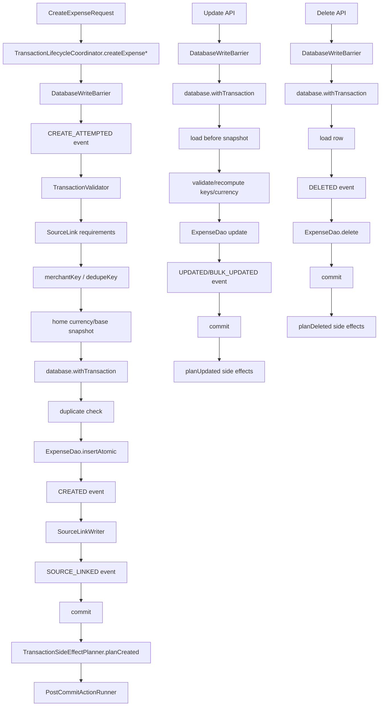

# Pipeline 2 — Transaction Lifecycle Master Implementation Plan

Repository: `https://github.com/panospao7/Cost-agregator`  
Pinned commit: `83b798e849b4408b2bf683f52cb2746d37f7af16`  
Pipeline: **P2 — Transaction Lifecycle**  
Mode: implementation planning only; no code changes.  
Build/test status: **NOT RUN** — static review only.

Source anchors:
- P2 issue doc: `docs/analyses and debug master/PIPELINE_2_CONSOLIDATED_ISSUES.md`
- Master tracker: `docs/analyses and debug master/PIPELINE_ISSUES_MASTER_TRACKER.md`
- Universal tracker: `docs/analyses and debug master/UNIVERSAL_ISSUE_TRACKER.md`
- Legal paths: `docs/architecture/LEGAL_PATHS.md`
- DB ownership: `docs/DB_WRITE_OWNERSHIP.md`
- Main files:
  - `app/src/main/java/com/yourname/expensetracker/domain/transaction/lifecycle/TransactionLifecycleCoordinator.kt`
  - `app/src/main/java/com/yourname/expensetracker/domain/transaction/lifecycle/TransactionSideEffectPlanner.kt`
  - `app/src/main/java/com/yourname/expensetracker/domain/transaction/DefaultExpenseCategoryAssignmentService.kt`
  - `app/src/main/java/com/yourname/expensetracker/domain/transaction/validation/TransactionValidator.kt`
  - `app/src/main/java/com/yourname/expensetracker/data/database/dao/ExpenseDao.kt`
  - `app/src/main/java/com/yourname/expensetracker/data/database/dao/TransactionEventDao.kt`
  - `app/src/main/java/com/yourname/expensetracker/data/database/dao/RestrictedExpenseDaoMutation.kt`
  - `app/src/main/java/com/yourname/expensetracker/domain/provenance/SourceLinkWriter.kt`
  - `app/src/main/java/com/yourname/expensetracker/domain/provenance/SourceLinkWriterImpl.kt`
  - `app/src/main/java/com/yourname/expensetracker/domain/provenance/CreateExpenseSourceLinkMapper.kt`
  - `app/src/main/java/com/yourname/expensetracker/domain/provenance/CreateExpenseSourceLinkRequirements.kt`
  - `app/src/main/java/com/yourname/expensetracker/domain/provenance/SourceLinkEventMetadataBuilder.kt`
  - `app/src/main/java/com/yourname/expensetracker/data/repository/ExpenseRepository.kt`
  - `app/src/main/java/com/yourname/expensetracker/data/repository/ManualExpenseRepository.kt`
  - `app/src/main/java/com/yourname/expensetracker/data/repository/ReviewQueueRepository.kt`
  - `app/src/main/java/com/yourname/expensetracker/data/repository/NotificationProcessingPipeline.kt`

---

## 1. Executive summary

Current state:
- P2 is mostly centralized around `TransactionLifecycleCoordinator`.
- Normal create/update/delete paths generally use:
  - `DatabaseWriteBarrier`,
  - Room `withTransaction`,
  - `ExpenseDao` mutation,
  - `TransactionEvent` audit,
  - provenance/source-link handling,
  - post-commit side-effect planning.
- Several stale P2 doc items are already fixed in source:
  - update snapshots are loaded inside transactions,
  - merchant/type/location updates carry correlation IDs,
  - merchant updates recompute keys,
  - bulk updates emit only when affected rows > 0,
  - side-effect planner uses update trigger type.
- Remaining open risks are mostly lifecycle-evidence, idempotency, and ownership hardening issues.

Production risk:
- **YELLOW** before implementation.
- Not RED for normal lifecycle because main create/update/delete is mostly legal-path compliant.
- Not GREEN because:
  1. `deleteExpense(expense: Expense)` can return success and run delete side effects when DB row is already missing.
  2. update validation failures are not durably recorded.
  3. create duplicate handling uses negative ID sentinel and can double-log duplicate/conflict events.
  4. duplicate source-link policy records `LINK_SOURCE_TO_EXISTING` intent but does not actually link source to existing expense.
  5. category assignment service performs semi-bypass DAO update with non-standard event type.
  6. some `ExpenseDao` mutation methods remain public/unannotated bypass surfaces.
  7. `homeCurrency().first()` can hang without timeout/safe resolution.
  8. bulk side-effect idempotency keys use wall-clock time.

Implementation strategy:
1. Fix correctness and lifecycle evidence first.
2. Replace ambiguous sentinel flows with explicit sealed outcomes.
3. Close provenance duplicate-link policy.
4. Standardize category assignment through coordinator/canonical events.
5. Harden DAO mutation guards and static tests.
6. Update docs/tracker only after tests pass.

Recommended verdict before implementation: **YELLOW**.

---

## 2. Scope

### In scope

- Transaction create/update/delete lifecycle.
- Bulk merchant/category/type/location/business/ownership/transfer update paths.
- Expense validation and validation-failure audit.
- Expense dedupe/idempotency.
- Source-link/provenance creation on create and duplicate create.
- Post-commit side-effect planning.
- Restore/write barrier coverage.
- DAO mutation ownership and architecture guards.
- Transaction event correlation and event metadata.
- P2 docs/tracker reconciliation.

### Out of scope

- Broad transaction UI redesign.
- Changing Room schema unless explicitly approved.
- Full currency/money normalization redesign.
- Import-specific dedupe policy beyond ensuring imported creates use coordinator/source links.
- Receipt/notification/bank parser behavior except their use of P2 coordinator.
- Backup/restore implementation internals, except barrier safety for P2 writes.

### Assumptions

- Implementation starts from exactly:

```bash
git rev-parse HEAD
```

Expected:

```text
83b798e849b4408b2bf683f52cb2746d37f7af16
```

- `TransactionLifecycleCoordinator` is the legal owner of `expenses` and `transaction_events`.
- `ExpenseDao` mutation methods should only be called from legal owners:
  - `TransactionLifecycleCoordinator`,
  - documented debug/restore/backfill methods in `ExpenseRepository`,
  - tests/migrations.
- `SourceLinkWriterImpl` does not open its own transaction; caller must call it inside the lifecycle transaction.
- Post-commit side effects must not run if DB mutation did not happen.
- Direct DAO mutations in `DefaultExpenseCategoryAssignmentService` are an exception to eliminate or explicitly legalize.

### Stop conditions

Stop and report before editing if:
- checkout SHA differs;
- working tree is dirty;
- local `rg` shows cross-pipeline direct `ExpenseDao` mutation outside known legal owners;
- changing duplicate source-link behavior requires schema changes not approved;
- `CreateExpenseResult` / update/delete result APIs cannot express failure without breaking public callers;
- `homeCurrency()` safe timeout policy is not agreed by product/architecture;
- tests reveal current source differs materially from attached P2 review.

---

## 3. Source/doc reconciliation

| Area / Issue | Pipeline doc claim | Master tracker claim | Source-code truth | Status | Evidence |
|---|---|---|---|---|---|
| P2-P1-01 business/tax barrier | Fixed | Fixed | `updateBusinessExpensePatch()` checks write barrier. | FIXED | `TransactionLifecycleCoordinator.updateBusinessExpensePatch`. |
| P2-P1-02 create validation/audit events | Fixed | Fixed | Create writes attempted, validation failed, duplicate/conflict, created events. | FIXED_SOURCE_SUPPORTED | `TransactionLifecycleCoordinator.createExpense*`. |
| P2-P1-03 strict idempotency | Fixed | Fixed | Strict mode requires external identity/fingerprint and resolves existing conflict. | FIXED_SOURCE_SUPPORTED | `DeduplicationMode.STRICT_EXTERNAL`; create duplicate logic. |
| P2-P1-04 debug delete/restore | Fixed | Fixed | Debug restore/delete require `BuildConfig.DEBUG`, barrier, audit writer. | FIXED_SOURCE_SUPPORTED | `ExpenseRepository` debug methods. |
| P2-P1-05 direct DAO mutation | Fixed | Fixed | Mitigated by restricted annotation and architecture guard claim, but DAO methods remain public and some are unannotated. | PARTIALLY_FIXED | `ExpenseDao`, `RestrictedExpenseDaoMutation`. |
| NEW-P2-001 update loads before row in txn | Fixed | Fixed | `updateExpense()` loads existing row inside transaction. | FIXED | `TransactionLifecycleCoordinator.updateExpense`. |
| NEW-P2-002 partial updates snapshot inside txn | Fixed | Fixed | Category/location/business/merchant/type/transfer/ownership update paths load inside transaction. | FIXED_SOURCE_SUPPORTED | Coordinator update methods. |
| NEW-P2-003 delete rereads fresh row | Fixed | Fixed | Entity overload rereads row, but if missing it still returns success and runs side effects. | PARTIALLY_FIXED / OPEN_BUG | `deleteExpense(expense: Expense)` missing-row branch. |
| NEW-P2-004 duplicate check transaction-local | Fixed | Fixed | Duplicate checks moved inside create transaction. | FIXED_WITH_GAP | Negative sentinel/double-event gap remains. |
| NEW-P2-005 category assignment bypass | Open | Design/TODO | Service has barrier + event but directly calls DAO and writes non-enum event type. | OPEN | `DefaultExpenseCategoryAssignmentService`. |
| NEW-P2-006 notification review direct path | Open | Design/TODO | Not fully verified. Review found coordinator injection but call body incomplete. | NEEDS_RUNTIME_VERIFICATION | Run local `rg` for `ExpenseDao` and coordinator calls in notification/review. |
| NEW-P2-007 conversion failure stale base | Fixed | Fixed | Update conversion failure clears base fields/sentinel. | FIXED | Coordinator update conversion path. |
| NEW-P2-008 stale dedupe DAO method | Open | Design/TODO | `updateMerchantForMerchant()` still exists and preserves stale dedupe key by warning. | OPEN/P3 | `ExpenseDao.updateMerchantForMerchant`. |
| NEW-P2-009 side-effect update trigger | Fixed | Fixed | Planner update paths use `EXPENSE_UPDATED`. | FIXED | `TransactionSideEffectPlanner.planUpdated`. |
| NEW-P2-010 bulk event count | Fixed | Fixed | Bulk category paths write event only when affected rows > 0. | FIXED | Coordinator bulk update methods. |
| NEW-P2-011 location correlation | Open in P2 doc | Design/TODO | `updateLocation()` writes correlationId. | FIXED / DOC_DRIFT | Coordinator source. |
| NEW-P2-012 merchant correlation | Open in P2 doc | Design/TODO | `updateMerchant()` writes correlationId. | FIXED / DOC_DRIFT | Coordinator source. |
| NEW-P2-013 type correlation | Open in P2 doc | Design/TODO | `updateType()` writes correlationId. | FIXED / DOC_DRIFT | Coordinator source. |
| NEW-P2-014 merchant key/dedupe recompute | Open in P2 doc | Design/TODO | `updateMerchant()` recomputes merchantKey and dedupeKey. | FIXED / DOC_DRIFT | Coordinator source. |
| NEW-P2-015 bulk idempotency key time | Open | Design/TODO | Bulk side-effect keys use `System.currentTimeMillis()`. | OPEN/P3 | `TransactionSideEffectPlanner`. |
| NEW-P2-016 homeCurrency first hang | Open / do-not-fix local | Do-not-fix/local | `homeCurrency().first()` still used without timeout in create/update. | OPEN/P3 | Coordinator currency snapshot path. |
| P2-NEW-A delete stale entity false success | New | N/A | Missing row in entity delete returns success and runs side effects. | OPEN/P2 | Attached review. |
| P2-NEW-B update validation diagnostics | New | N/A | Update validation exceptions do not emit durable `UPDATE_VALIDATION_FAILED`. | OPEN/P2 | Coordinator helper exists but not used by update failure paths. |
| P2-NEW-C duplicate sentinel double event | New | N/A | Duplicate branch writes event then returns negative ID; outer `insertedId <= 0` writes duplicate/conflict again. | OPEN/P2 | Create transaction flow. |
| P2-NEW-D duplicate source link policy | New | N/A | Metadata records policy but link-to-existing deferred. | OPEN/P2 | Coordinator duplicate create metadata/comment. |
| P2-NEW-E unannotated DAO mutations | New | N/A | `incrementBackfillAttempts`, `conditionallySetLocation` public `UPDATE` without restricted annotation. | OPEN/P2 | `ExpenseDao`. |
| P2-NEW-F missing correlation params | New | N/A | Transfer/type+transfer/ownership public APIs omit or pass null correlation IDs. | OPEN/P3 | Coordinator methods. |
| P2-NEW-G bulk side-effect key wall-clock | New | N/A | Bulk planner uses time. | OPEN/P3 | `TransactionSideEffectPlanner`. |
| P2-NEW-H category assignment event nonstandard | New | N/A | Service writes `"EXPENSE_CATEGORY_ASSIGNED"` and direct DAO update. | OPEN/P3/P2 | `DefaultExpenseCategoryAssignmentService`. |

---

## 4. Architecture contracts for this pipeline

| Contract | Required legal path | Current code | Gap | Fix required |
|---|---|---|---|---|
| Expense mutation owner | `TransactionLifecycleCoordinator` owns all normal expense create/update/delete. | Main paths comply. | Category assignment and backfill/debug exceptions exist; some DAO methods public/unannotated. | Add guards; route category assignment through coordinator or legalize/document. |
| Write barrier | Every expense write checks `DatabaseWriteBarrier`. | Coordinator and repository backfills check barrier. | DAO surface not self-protected; category service has barrier but bypasses owner. | Guard tests and docs; no new bypasses. |
| Create atomicity | Validation/provenance/dedupe/insert/event/source links in one transaction. | Mostly implemented. | Duplicate sentinel can emit duplicate/conflict event twice; duplicate source links not applied. | Replace sentinel with explicit sealed outcome; implement link-to-existing. |
| Update atomicity | Load before snapshot, validate, mutate, write event inside same transaction. | Mostly implemented. | Update validation failures may roll back event or not be emitted. | Emit validation failure outside failed transaction or before throwing inside separate audit path. |
| Delete atomicity | Load current row, write deleted event, delete row in one transaction; no side effects if no row. | Delete-by-id likely OK; entity overload missing-row false success. | Side effects can run for nonexistent row. | Return failure/no-op and skip side effects. |
| Side effects | Run only after successful DB commit. | Post-commit runner used. | False delete success triggers side effects; bulk keys non-deterministic. | Fix delete result; stable side-effect keys. |
| Source/provenance | Required source fields validated; source links written atomically. | Create source links in transaction. | Duplicate create policy does not link source to existing. | Implement `LINK_SOURCE_TO_EXISTING`. |
| Diagnostics/audit | Every terminal lifecycle outcome has durable event. | Create strong; update validation/restore-blocked updates weaker. | Missing update validation event. | Add `UPDATE_VALIDATION_FAILED` / blocked events where contract requires. |
| Privacy-safe metadata | Events must avoid raw PII/external raw IDs. | Source metadata builder truncates/avoids raw IDs. | New events must follow same policy. | Use `SourceLinkEventMetadataBuilder` / safe metadata helpers. |

---

## 5. Current runtime flow



Known deviation:
- Entity delete missing-row path exits transaction but still returns success and runs `planDeleted`.
- Duplicate create path uses negative ID sentinel instead of a typed `InsertOutcome`.
- Category assignment service updates category outside the coordinator’s canonical update flow.

---

## 6. Implementation phases

### PR 1 — Critical correctness / lifecycle ownership

Goal:
- Fix false-success delete.
- Make duplicate create outcome explicit.
- Add durable update validation-failure event.
- Keep side effects strictly post-success.

Risk:
- Medium; touches core coordinator create/update/delete.

Files:
- `TransactionLifecycleCoordinator.kt`
- `CreateExpenseResult.kt` or local private sealed outcome if public API need not change
- `LifecycleEventType.kt` if missing update validation type
- tests

Work items:
- P2-DEL-001
- P2-DUPE-002
- P2-AUDIT-003

Tests:
- stale entity delete returns failure/no-op and no side effects.
- duplicate standard create writes exactly one duplicate event.
- insert conflict writes exactly one correct event.
- invalid update writes `UPDATE_VALIDATION_FAILED`.

Acceptance:
- No side effects for no-op delete.
- No duplicate lifecycle events for one duplicate create.
- Update validation failures are visible in audit.

### PR 2 — Atomicity / idempotency / currency safety

Goal:
- Make currency home resolution bounded/safe.
- Stabilize bulk side-effect idempotency keys.
- Add concurrency/idempotency tests.

Risk:
- Low/medium.

Files:
- `TransactionLifecycleCoordinator.kt`
- `TransactionSideEffectPlanner.kt`
- possibly new `HomeCurrencyResolverForTransactionLifecycle.kt`
- tests

Work items:
- P2-CUR-004
- P2-SIDEFX-005

Tests:
- home currency flow timeout uses safe default/failure policy.
- bulk side-effect keys are stable for same mutation/correlation.
- update/create cancellation still propagates.

Acceptance:
- `homeCurrency().first()` cannot hang indefinitely.
- Bulk side-effect idempotency no longer uses wall-clock time.

### PR 3 — Diagnostics / provenance / side effects

Goal:
- Implement duplicate source-link-to-existing policy.
- Standardize category assignment through coordinator or canonical event.
- Add correlation ID plumbing to transfer/ownership APIs.

Risk:
- Medium; affects cross-pipeline provenance and category assignment.

Files:
- `TransactionLifecycleCoordinator.kt`
- `CreateExpenseSourceLinkMapper.kt`
- `SourceLinkWriter.kt` / impl if needed
- `DefaultExpenseCategoryAssignmentService.kt`
- `ExpenseDao.kt`
- `TransactionSideEffectPlanner.kt`
- repository/caller APIs if correlation params added
- tests

Work items:
- P2-PROV-006
- P2-CAT-007
- P2-CORR-008

Tests:
- duplicate receipt/bank/notification source links to existing expense.
- category assignment emits canonical UPDATED event with before/after snapshot.
- correlation ID is present in transfer/type/ownership events.

Acceptance:
- Duplicate create can attach provenance to existing row inside transaction.
- No non-standard transaction event type for normal category lifecycle.

### PR 4 — Architecture guards / docs / cleanup

Goal:
- Harden DAO mutation ownership.
- Annotate/allowlist every DAO mutating query.
- Reconcile stale docs and tracker.

Risk:
- Low/medium; mostly tests/docs, but guard false positives possible.

Files:
- `ExpenseDao.kt`
- `RestrictedExpenseDaoMutation.kt`
- architecture tests
- docs/tracker files

Work items:
- P2-GUARD-009
- P2-HASHDOC-010
- P2-DOC-011

Tests:
- static guard scans all `@Query("UPDATE|DELETE|INSERT")` and mutation functions.
- direct `ExpenseDao` mutation outside allowed owners fails.
- all mutation methods are annotated/allowlisted.

Acceptance:
- Future direct DAO bypasses fail CI.
- P2 docs match source truth.

---

## 7. Detailed work items

| ID | Severity | Title | Files | Implementation steps | Tests | Acceptance criteria |
|---|---|---|---|---|---|---|
| P2-DEL-001 | P2 | `deleteExpense(Expense)` must not succeed for missing row | `TransactionLifecycleCoordinator.kt`, tests | In entity overload, track transaction result as sealed `DeleteOutcome.Deleted(snapshot, sideEffects)` or `NotFound`. If `expenseDao.getById(expense.id)` returns null, write optional `DELETE_NOT_FOUND`/diagnostic event if event type exists, return failure/no-op result, and do not call `planDeleted`. Do not use stale passed entity for side effects. | `deleteExpenseEntityMissingReturnsFailureNoSideEffects`; `deleteExpenseEntityExistingDeletesAndPlansSideEffects`. | Missing DB row produces no `DELETED` event, no DAO delete, no side effects, and no false success. |
| P2-DUPE-002 | P2 | Replace create duplicate negative-ID sentinel with typed insert outcome | `TransactionLifecycleCoordinator.kt`, maybe private sealed class | Replace transaction `Long` return sentinel with private sealed `CreateInsertOutcome`: `Inserted(id)`, `Duplicate(existingId, reason, eventWritten)`, `Conflict(existingId?, reason, eventWritten)`, `ValidationFailed`, etc. Ensure duplicate precheck writes one lifecycle event and outer code does not reclassify it via `insertedId <= 0`. Keep public `CreateExpenseResult` stable if possible. | `standardDuplicateWritesExactlyOneDuplicateEvent`; `insertConflictWritesExactlyOneConflictEvent`; `strictExternalRetryReturnsExistingId`. | One lifecycle terminal event per duplicate/conflict create attempt; no negative sentinel ambiguity. |
| P2-AUDIT-003 | P2 | Emit durable update validation-failure events | `TransactionLifecycleCoordinator.kt`, `LifecycleEventType.kt` if missing | Identify update methods that call validator and can throw `TransactionValidationException`. Refactor to validate before mutation within transaction, but on validation failure write `UPDATE_VALIDATION_FAILED` safely. If transaction rollback would erase the event, catch outside transaction and write a best-effort audit event with expenseId/correlationId/request type and sanitized errors, then rethrow/return failure as current API expects. Do not commit partial mutation. | `invalidTransferUpdateWritesUpdateValidationFailedEvent`; `invalidTypeUpdateWritesUpdateValidationFailedEvent`; `validationFailureDoesNotMutateExpense`. | Invalid update has durable event and no data mutation. |
| P2-CUR-004 | P3 | Bound `homeCurrency().first()` resolution | `TransactionLifecycleCoordinator.kt`, possibly new resolver | Replace raw `homeCurrency().first()` with helper `resolveHomeCurrencyForLifecycle()` using `withTimeoutOrNull(...)` or repository method with default/failure policy. On timeout, either return validation failure/diagnostic or use documented home default from settings only. Do not silently use hardcoded EUR unless architecture allows. Preserve CE propagation. | `homeCurrencyTimeoutDoesNotHangCreate`; `homeCurrencyTimeoutDoesNotHangUpdate`; `cancellationDuringCurrencyResolutionPropagates`. | Create/update cannot hang indefinitely waiting on Flow. |
| P2-SIDEFX-005 | P3 | Stable bulk side-effect idempotency keys | `TransactionSideEffectPlanner.kt`, caller metadata | Replace `System.currentTimeMillis()` in bulk action keys with deterministic input: operation type + correlationId if present + affected IDs hash or merchant/category/type fields + event ID. If no correlationId, generate one before transaction and pass through event and planner. | `bulkCategoryUpdateSameCorrelationProducesStableSideEffectKey`; `bulkMerchantUpdateDifferentCorrelationProducesDifferentKey`. | Bulk side-effect keys are deterministic and collision-resistant without wall clock. |
| P2-PROV-006 | P2 | Apply duplicate source-link `LINK_SOURCE_TO_EXISTING` policy | `TransactionLifecycleCoordinator.kt`, `CreateExpenseSourceLinkMapper.kt`, `SourceLinkWriter.kt`, tests | In duplicate create branch, if request/source policy is `LINK_SOURCE_TO_EXISTING` and existing expense ID is known, call `sourceLinkWriter.link(...)` inside same transaction to attach source to existing expense. Use insert-ignore semantics and write `SOURCE_LINKED` or `SOURCE_LINK_DUPLICATE_IGNORED` event with safe metadata. Do not create new expense. If existing ID unknown, write `SOURCE_LINK_DEFERRED_FAILED` event. | `receiptDuplicateLinksSourceToExistingExpense`; `bankDuplicateLinksSourceToExistingExpense`; `duplicateSourceLinkInsertIgnoreWritesSafeEvent`. | Retried receipt/bank/email/notification/import creates preserve provenance on existing expense. |
| P2-CAT-007 | P2/P3 | Standardize default category assignment lifecycle | `DefaultExpenseCategoryAssignmentService.kt`, `TransactionLifecycleCoordinator.kt`, `ExpenseDao.kt` | Preferred: replace direct `expenseDao.updateCategory()` in service with coordinator method `assignCategory(expenseId, categoryId, reason, correlationId)` that loads before snapshot inside transaction, updates category, writes canonical `LifecycleEventType.UPDATED` or `CATEGORY_ASSIGNED` enum if it exists, and plans update side effects. If a separate port is required, document it as legal owner and use enum event type + before/after metadata. Remove raw string `"EXPENSE_CATEGORY_ASSIGNED"`. | `defaultCategoryAssignmentUsesCoordinatorOrCanonicalEvent`; `categoryAssignmentWritesBeforeAfterSnapshot`; `categoryAssignmentBlockedByWriteBarrier`. | Category assignment no longer bypasses lifecycle/audit conventions. |
| P2-CORR-008 | P3 | Propagate correlation IDs in transfer/type/ownership APIs | `TransactionLifecycleCoordinator.kt`, repositories/callers/tests | Add optional `correlationId: String? = null` to public update methods lacking it: `updateTransferDetails`, `updateTypeAndTransferDetails`, ownership update method(s). Pass to transaction events and side-effect planner. Preserve source compatibility with default null. Update callers where correlation exists. | `updateTransferDetailsEventContainsCorrelationId`; `updateOwnershipEventContainsCorrelationId`. | Traceability is consistent across update APIs. |
| P2-GUARD-009 | P1/P2 | Harden ExpenseDao mutation ownership guard | `ExpenseDao.kt`, `RestrictedExpenseDaoMutation.kt`, architecture tests | Annotate all mutating DAO methods, including `incrementBackfillAttempts`, `conditionallySetLocation`, `clearLocation`, `updateMerchantKey`, with `@RestrictedExpenseDaoMutation` or an explicit maintenance annotation. Add static test that parses all `@Query("UPDATE|DELETE|INSERT")` and DAO mutating functions and checks allowed callers. Allowlist coordinator, documented repository maintenance/debug, migrations, tests only. | `expenseDaoMutationMethodsAreRestricted`; `expenseDaoMutationsOnlyCalledFromAllowedOwners`. | Direct DAO bypass cannot compile unnoticed or pass architecture tests. |
| P2-HASHDOC-010 | P3 | Verify cross-pipeline create/update callers use coordinator | repository tests/architecture tests | Run `rg` for `ExpenseDao` injection/use in P1/P3/P10/P11/P12. Add guard that production repositories cannot call `ExpenseDao.insert/update/delete` directly unless allowlisted. | `crossPipelineExpenseCreatesUseTransactionLifecycleCoordinator`. | Notification, receipt, review, bank/import creates go through coordinator. |
| P2-DOC-011 | P3 | Update stale P2 docs and comments | docs, `ExpenseRepository.kt` comments | Replace stale `ExpenseWriteStore.kt` references with `TransactionLifecycleCoordinator.kt`. Update statuses for fixed correlation/key issues. Remove/adjust comment saying business/tax updates unimplemented if coordinator now supports them. Mark remaining open issues. | docs review | Docs/tracker match source and tests. |

---

## 8. File-by-file change plan

| File | Change type | Exact changes | Risk | Tests covering it |
|---|---|---|---|---|
| `TransactionLifecycleCoordinator.kt` | MODIFY | Fix delete missing-row outcome; replace duplicate negative sentinel with sealed outcome; emit update validation failure events; add safe home currency resolver; implement duplicate source-link-to-existing; add category assignment method if chosen; add correlation parameters. | High | lifecycle coordinator tests |
| `TransactionSideEffectPlanner.kt` | MODIFY | Replace wall-clock bulk idempotency keys with deterministic correlation/input hash. | Medium | side-effect planner tests |
| `DefaultExpenseCategoryAssignmentService.kt` | MODIFY | Delegate to coordinator or write canonical lifecycle event via approved path; remove raw event type string. | Medium | category assignment lifecycle tests |
| `ExpenseDao.kt` | MODIFY | Annotate/mark every mutation method; optionally deprecate dangerous `updateMerchantForMerchant`; add read helper only if needed. | Medium | architecture guard |
| `RestrictedExpenseDaoMutation.kt` | MODIFY / NO_CHANGE | If current warning-level opt-in insufficient, document and pair with hard guard; no API change unless approved. | Low | architecture guard |
| `TransactionEventDao.kt` | NO_CHANGE_READ_ONLY | Should not need changes unless new event query helpers required. | Low | event tests |
| `LifecycleEventType.kt` | MODIFY if needed | Add `UPDATE_VALIDATION_FAILED`, `DELETE_NOT_FOUND`, `SOURCE_LINK_DUPLICATE_IGNORED`, or use existing enum if already present. | Medium | event enum tests |
| `CreateExpenseResult.kt` | NO_CHANGE / MODIFY | Prefer no public API change. Only add typed duplicate/conflict info if needed and backward-compatible. | Medium | create result tests |
| `SourceLinkWriter.kt` / `SourceLinkWriterImpl.kt` | MODIFY if needed | Expose link-to-existing helper or reuse existing insert-ignore method inside transaction. | Medium | source-link duplicate tests |
| `CreateExpenseSourceLinkMapper.kt` | MODIFY if needed | Ensure duplicate create can map source links for existing expense without raw PII. | Low/medium | provenance tests |
| `SourceLinkEventMetadataBuilder.kt` | MODIFY if needed | Add safe metadata for duplicate-link-to-existing outcome. | Low | metadata tests |
| `ExpenseRepository.kt` | UPDATE_DOC / MODIFY | Fix stale comments; ensure public methods route through coordinator; keep debug/backfill barrier guarded. | Low/medium | repository tests/guard |
| `ManualExpenseRepository.kt` | NO_CHANGE_READ_ONLY | Verify manual create still runs returned side effects post-commit. | Low | cross-pipeline guard |
| `ReviewQueueRepository.kt` | NO_CHANGE_READ_ONLY / MODIFY if needed | Verify review approval uses coordinator and source-link requirements. | Medium | review approval lifecycle tests |
| `NotificationProcessingPipeline.kt` | NO_CHANGE_READ_ONLY / MODIFY if needed | Verify auto-accept uses coordinator. | Medium | notification lifecycle tests |
| architecture test package | ADD_GUARD | Add P2 DAO mutation and coordinator ownership guards. | Medium | guard tests |
| P2 tests | ADD_TEST / UPDATE_TEST | Add lifecycle, duplicate, validation, provenance, category, side-effect key tests. | Medium | itself |
| P2 docs/tracker | UPDATE_DOC | Reconcile stale statuses and owner names. | Low | docs review |

---

## 9. Database / schema / migration plan

Default plan:

```text
No schema migration required.
```

Expected work uses existing:
- `expenses`,
- `transaction_events`,
- `entity_source_links`,
- existing event metadata,
- existing source-link insert-ignore.

Potential schema changes only if local verification shows:
- no event type can represent update validation failure / duplicate source-link ignored,
- unique source-link constraints do not support linking duplicate source to existing,
- category assignment requires new enum storage not compatible with current string/event type field.

If schema/event enum changes are needed:

| Change | Entity/DAO | Migration required? | Schema export required? | Backfill required? | Tests |
|---|---|---:|---:|---:|---|
| Add enum constant only in Kotlin mapped to string | `LifecycleEventType` | No | No | No | event serialization tests |
| Add new DB column for event classification | `TransactionEvent` | Yes | Yes | Optional | migration tests |
| Add unique/index for source-link duplicates | `EntitySourceLink` | Yes if changing DB constraints | Yes | Maybe | source-link migration tests |

Recommendation:
- Avoid schema migration for PR1–4.
- Use existing transaction event type string/enum and metadata where possible.

---

## 10. Test plan

### Existing tests to run

```bash
./gradlew :app:testDebugUnitTest --stacktrace
./gradlew :app:assembleDebug --stacktrace
```

### Focused tests

```bash
./gradlew :app:testDebugUnitTest --tests "*TransactionLifecycle*" --stacktrace
./gradlew :app:testDebugUnitTest --tests "*TransactionSideEffect*" --stacktrace
./gradlew :app:testDebugUnitTest --tests "*ExpenseDao*" --stacktrace
./gradlew :app:testDebugUnitTest --tests "*SourceLink*" --stacktrace
./gradlew :app:testDebugUnitTest --tests "*CategoryAssignment*" --stacktrace
./gradlew :app:testDebugUnitTest --tests "*ExpenseRepository*" --stacktrace
./gradlew :app:testDebugUnitTest --tests "*ReviewQueue*" --stacktrace
./gradlew :app:testDebugUnitTest --tests "*NotificationProcessingPipeline*" --stacktrace
./gradlew :app:testDebugUnitTest --tests "*P2*" --stacktrace
```

### New tests to add

| Test file | Test name | Behavior covered |
|---|---|---|
| `TransactionLifecycleCoordinatorDeleteTest.kt` | `deleteExpenseEntityMissingReturnsFailureAndNoSideEffects` | Fix P2-DEL-001. |
| `TransactionLifecycleCoordinatorDeleteTest.kt` | `deleteExpenseEntityExistingWritesDeletedEventAndRunsSideEffects` | Normal delete still works. |
| `TransactionLifecycleCoordinatorCreateDuplicateTest.kt` | `standardDuplicateWritesExactlyOneDuplicateEvent` | Fix sentinel/double event. |
| `TransactionLifecycleCoordinatorCreateDuplicateTest.kt` | `insertConflictWritesExactlyOneConflictEvent` | Insert conflict classification. |
| `TransactionLifecycleCoordinatorCreateDuplicateTest.kt` | `strictExternalRetryReturnsExistingIdWithoutDuplicateInsert` | Strict idempotency. |
| `TransactionLifecycleCoordinatorUpdateValidationTest.kt` | `invalidTransferUpdateWritesUpdateValidationFailedAndDoesNotMutate` | Update validation diagnostic. |
| `TransactionLifecycleCoordinatorUpdateValidationTest.kt` | `invalidTypeUpdateWritesUpdateValidationFailedAndDoesNotMutate` | Update validation diagnostic. |
| `TransactionLifecycleCoordinatorCurrencyTest.kt` | `homeCurrencyTimeoutDoesNotHangCreate` | Safe currency resolution. |
| `TransactionLifecycleCoordinatorCurrencyTest.kt` | `cancellationDuringHomeCurrencyResolutionPropagates` | CE safety. |
| `TransactionSideEffectPlannerTest.kt` | `bulkUpdateUsesStableIdempotencyKeyForSameCorrelation` | Stable keys. |
| `DuplicateSourceLinkPolicyTest.kt` | `duplicateReceiptCreateLinksSourceToExistingExpense` | Provenance duplicate policy. |
| `DuplicateSourceLinkPolicyTest.kt` | `duplicateBankCreateLinksSourceToExistingExpense` | Cross-pipeline import/bank duplicate. |
| `DefaultExpenseCategoryAssignmentServiceTest.kt` | `assignmentUsesCanonicalUpdatedEventWithBeforeAfterSnapshot` | Category lifecycle standardization. |
| `DefaultExpenseCategoryAssignmentServiceTest.kt` | `assignmentBlockedByWriteBarrier` | Barrier. |
| `TransactionCorrelationTest.kt` | `transferUpdateEventIncludesCorrelationId` | Correlation plumbing. |
| `TransactionCorrelationTest.kt` | `ownershipUpdateEventIncludesCorrelationId` | Correlation plumbing. |
| `P2ExpenseDaoOwnershipGuardTest.kt` | `allExpenseDaoMutatingQueriesAreRestrictedOrAllowlisted` | DAO guard. |
| `P2ExpenseDaoOwnershipGuardTest.kt` | `productionExpenseDaoMutationsOnlyFromAllowedOwners` | DAO caller guard. |
| `CrossPipelineTransactionLifecycleGuardTest.kt` | `notificationReceiptReviewBankImportCreatesUseCoordinator` | Cross-pipeline create ownership. |

### Architecture guard tests

| Guard | Expected rule |
|---|---|
| ExpenseDao mutation annotation guard | Every `@Insert`, `@Update`, `@Delete`, `@Query("UPDATE...")`, `@Query("DELETE...")`, `@Query("INSERT...")` in `ExpenseDao` has restricted/maintenance annotation or explicit allowlist. |
| ExpenseDao caller guard | Production mutation calls only from `TransactionLifecycleCoordinator`, approved `ExpenseRepository` debug/backfill paths, migrations, tests. |
| Category assignment guard | Normal category assignment cannot call `ExpenseDao.updateCategory` directly unless service is documented as legal owner and emits canonical event. |
| Transaction event guard | Normal mutations must write `TransactionEvent` atomically with mutation. |
| Side-effect guard | `TransactionSideEffectPlanner` must not use `System.currentTimeMillis()` in idempotency keys. |
| Currency wait guard | Coordinator must not call `homeCurrency().first()` without timeout/safe resolver. |
| Cancellation guard | P2 `catch(Exception)` / `runCatching` must rethrow `CancellationException`. |

---

## 11. Validation commands

Initial verification:

```bash
git rev-parse HEAD
git status --short
```

Expected SHA:

```text
83b798e849b4408b2bf683f52cb2746d37f7af16
```

Discovery commands:

```bash
find app/src/main/java -type f | sort
find app/src/test/java -type f | sort
find app/src/androidTest/java -type f | sort

rg -n "TransactionLifecycle|ExpenseDao|TransactionEvent|CreateExpense|UpdateExpense|DeleteExpense|SourceLink|CategoryAssignment|PostCommit|SideEffect" app/src/main app/src/test app/src/androidTest docs config scripts

rg -n "withTransaction|DatabaseWriteBarrier|DatabaseReadBarrier|RestoreMaintenanceMode|checkWritesAllowed|checkReadsAllowed|DatabaseAccessBlockedException" app/src/main app/src/test app/src/androidTest

rg -n "TransactionEvent|LifecycleEvent|DiagnosticEvent|PipelineDiagnosticEvent|Audit|EventWriter" app/src/main app/src/test app/src/androidTest

rg -n "insert\\(|insertAll\\(|update\\(|delete\\(|deleteAll\\(|@Query\\(\"UPDATE|@Query\\(\"DELETE|@Query\\(\"INSERT" app/src/main/java app/src/test/java app/src/androidTest/java

rg -n "catch \\(e: Exception\\)|runCatching|CancellationException|NonCancellable|SupervisorJob|launch|async" app/src/main app/src/test app/src/androidTest

rg -n "homeCurrency\\(\\)\\.first|System\\.currentTimeMillis|updateMerchantForMerchant|incrementBackfillAttempts|conditionallySetLocation|EXPENSE_CATEGORY_ASSIGNED|LINK_SOURCE_TO_EXISTING" app/src/main app/src/test
```

Focused tests:

```bash
./gradlew :app:testDebugUnitTest --tests "*TransactionLifecycle*" --stacktrace
./gradlew :app:testDebugUnitTest --tests "*TransactionSideEffect*" --stacktrace
./gradlew :app:testDebugUnitTest --tests "*SourceLink*" --stacktrace
./gradlew :app:testDebugUnitTest --tests "*CategoryAssignment*" --stacktrace
./gradlew :app:testDebugUnitTest --tests "*P2ExpenseDaoOwnershipGuard*" --stacktrace
./gradlew :app:testDebugUnitTest --tests "*CrossPipelineTransactionLifecycleGuard*" --stacktrace
```

Full validation:

```bash
./gradlew :app:testDebugUnitTest --stacktrace
./gradlew :app:assembleDebug --stacktrace
./gradlew :app:check --stacktrace
```

Instrumentation tests are not required unless local tests depend on Android framework or Room instrumentation. If needed:

```bash
./gradlew connectedDebugAndroidTest
```

---

## 12. Documentation updates

| Doc | Required update | Reason |
|---|---|---|
| `docs/analyses and debug master/PIPELINE_2_CONSOLIDATED_ISSUES.md` | Mark fixed stale items as fixed/source-verified; add P2-NEW-A through P2-NEW-H; update verdict after PRs. | Current doc contradicts source. |
| `docs/analyses and debug master/PIPELINE_ISSUES_MASTER_TRACKER.md` | Keep P2 YELLOW until delete/duplicate/update audit/provenance/guards pass. | Release gating. |
| `docs/analyses and debug master/UNIVERSAL_ISSUE_TRACKER.md` | Note P2 remaining DAO ownership/cancellation/side-effect-idempotency items if still open. | Universal contract accuracy. |
| `docs/DB_WRITE_OWNERSHIP.md` | Confirm legal owners for `ExpenseDao` mutation methods and maintenance/backfill exceptions. | DAO ownership. |
| `docs/expense-mutation-inventory.md` | Update inventory for category assignment, backfill methods, and source-link duplicate policy. | Architecture traceability. |
| `docs/architecture/LEGAL_PATHS.md` | If new category assignment coordinator method/source-link duplicate policy added, document it. | Legal path sync. |
| `ExpenseRepository.kt` comments | Remove stale comment that business/tax updates are not implemented if no longer true. | Code/doc drift. |
| P2 implementation plan doc | Replace stale `ExpenseWriteStore.kt` owner references with `TransactionLifecycleCoordinator.kt`. | Avoid future agent drift. |

---

## 13. Risk and rollback plan

| Risk | Probability | Impact | Mitigation | Rollback |
|---|---:|---:|---|---|
| Changing create duplicate outcome breaks public result handling | Medium | Medium | Use private sealed outcome internally; keep public `CreateExpenseResult` unchanged. | Revert public API changes; keep internal outcome. |
| Update validation event persists even though mutation fails | Medium | Low/Medium | Event should be durable terminal evidence; mark event type clearly as failed attempt. | Make event best-effort diagnostic if product rejects lifecycle event. |
| Duplicate source-link-to-existing creates unexpected provenance links | Medium | Medium | Apply only when policy is `LINK_SOURCE_TO_EXISTING` and source requirements validate; insert-ignore. | Feature flag or revert to metadata-only while keeping test pending. |
| Category assignment coordinator delegation causes side effects where old path did not | Medium | Medium | Decide if category assignment should plan update side effects; test expected side effects. | Use canonical event but keep no side effects if architecture approves. |
| Home currency timeout changes create behavior under settings failure | Low/Medium | Medium | Document timeout and result; prefer explicit failure over hardcoded default. | Increase timeout or use cached setting fallback. |
| Static guards false-positive on tests/migrations | Medium | Low | Add narrow allowlist for tests, migrations, debug restore/backfill. | Narrow guard patterns, do not disable. |
| Stable bulk keys require affected IDs not available | Medium | Low/Medium | Use correlationId generated at operation start + fields; no DB schema change. | Keep old key with TODO only if no idempotent input exists. |

---

## 14. Pipeline-specific checklist

### Entry points

- UI/ViewModel entry points:
  - manual expense create/edit/delete screens through repositories.
  - bulk edit/category/merchant screens.
  - business/tax/location/ownership update screens.
- Worker entry points:
  - none directly for P2; background imports/notifications may create expenses via coordinator.
- Repository entry points:
  - `ExpenseRepository`
  - `ManualExpenseRepository`
  - `ReviewQueueRepository`
  - `NotificationProcessingPipeline`
  - receipt/bank/email/import repositories to verify locally.
- Coordinator/service entry points:
  - `TransactionLifecycleCoordinator`
  - `DefaultExpenseCategoryAssignmentService`
  - `TransactionSideEffectPlanner`
  - `PostCommitActionRunner`
- Import/external source entry points:
  - notification auto-accept,
  - receipt approval,
  - bank/import,
  - email receipt,
  - CSV/JSON import if implemented,
  - recurring side effects from P4.

### Core owner

- Legal lifecycle owner:
  - `TransactionLifecycleCoordinator`.
- Direct collaborators:
  - `ExpenseDao`
  - `TransactionEventDao`
  - `SourceLinkWriter`
  - `TransactionValidator`
  - `DatabaseWriteBarrier`
  - `CurrencySettingsRepository` / currency resolver
  - `TransactionSideEffectPlanner`
  - `PostCommitActionRunner`
- Event writer:
  - transaction event writes currently through `TransactionEventDao` inside coordinator.
  - if a `TransactionEventWriter` exists, verify whether legal path requires it.
- DAO owner:
  - `ExpenseDao`: coordinator only for normal writes; repository debug/backfill allowlist.
  - `TransactionEventDao`: coordinator/audit writer only.
  - `EntitySourceLinkDao`: source-link writer only, inside lifecycle transaction.
- Side-effect dispatcher/planner:
  - `TransactionSideEffectPlanner` creates post-commit actions.
  - `PostCommitActionRunner` runs after commit.

### Persistence

- Entities:
  - `Expense`
  - `TransactionEvent`
  - `EntitySourceLink`
- DAOs:
  - `ExpenseDao`
  - `TransactionEventDao`
  - `EntitySourceLinkDao`
- Migrations:
  - none expected.
- Schema version:
  - unchanged by default.
- Indexes/constraints:
  - existing expense dedupe/source-link indexes used.
  - no new index planned.

### Audit / diagnostics

- Lifecycle event table/entity:
  - `TransactionEvent`.
- Diagnostic event table/entity:
  - pipeline diagnostics may exist but P2 primarily uses `TransactionEvent`.
- Required terminal events:
  - `CREATE_ATTEMPTED`
  - `CREATE_VALIDATION_FAILED`
  - `CREATE_DUPLICATE`
  - `CREATE_CONFLICT`
  - `CREATED`
  - `SOURCE_LINKED`
  - `UPDATED`
  - `BULK_UPDATED`
  - `UPDATE_VALIDATION_FAILED` or equivalent
  - `DELETED`
  - optional `DELETE_NOT_FOUND`
- Missing event cases:
  - update validation failure.
  - duplicate source-link-to-existing result.
  - restore-blocked update/delete if architecture requires durable evidence.

### Barriers

- Write barrier locations:
  - create/update/delete/bulk coordinator entry.
  - category assignment service or replacement coordinator method.
  - repository debug/backfill methods.
- Read barrier locations:
  - generally not required for normal expense reads unless restore contract says otherwise.
- Maintenance/debug exceptions:
  - `BuildConfig.DEBUG` restore/delete in `ExpenseRepository`.
  - backfill/location maintenance methods, barrier guarded and documented.
- Blocked-write behavior:
  - create should emit restore-blocked/failed result.
  - update/delete currently may throw; decide whether durable event required.

### Tests

- Existing unit tests:
  - must discover locally with `rg -n "TransactionLifecycle|ExpenseDao|SourceLink|ExpenseRepository" app/src/test`.
- Existing contract tests:
  - architecture/lifecycle barrier tests likely exist but need extension.
- Existing architecture tests:
  - must discover locally.
- Existing androidTest tests:
  - discover with `find app/src/androidTest/java -type f | sort`.
- Missing tests:
  - listed in section 10.

---

## 15. Direct DAO mutation inventory

| DAO method | SQL mutation? | Caller(s) | Legal owner? | Barrier? | Audit event? | Classification | Fix |
|---|---:|---|---|---|---|---|---|
| `ExpenseDao.insertAtomic` | Yes | Coordinator create | `TransactionLifecycleCoordinator` | Yes | `CREATED` | LEGAL | Keep. |
| `ExpenseDao.insertAll` | Yes | Debug restore | `ExpenseRepository` debug restore | BuildConfig + barrier | aggregate restore event | DEBUG_ONLY | Keep guarded/allowlisted. |
| `ExpenseDao.update` | Yes | Coordinator full/business update | `TransactionLifecycleCoordinator` | Yes | `UPDATED` | LEGAL | Keep. |
| `ExpenseDao.delete` | Yes | Coordinator delete | `TransactionLifecycleCoordinator` | Yes | `DELETED` | LEGAL/PARTIAL | Fix stale entity false success. |
| `ExpenseDao.deleteAll` | Yes | Debug delete/restore | `ExpenseRepository` debug | BuildConfig + barrier | aggregate event | DEBUG_ONLY | Keep guarded/allowlisted. |
| `ExpenseDao.updateCategoryNullable` | Yes | Coordinator | `TransactionLifecycleCoordinator` | Yes | `UPDATED` | LEGAL | Keep. |
| `ExpenseDao.updateCategory` | Yes | `DefaultExpenseCategoryAssignmentService` | Semi-bypass | Service barrier | non-standard event | BUG/PARTIAL | Route through coordinator/canonical event. |
| `ExpenseDao.updateCategoryForMerchant/Category` | Yes | Coordinator bulk | `TransactionLifecycleCoordinator` | Yes | `BULK_UPDATED` | LEGAL | Keep. |
| `ExpenseDao.updateMerchantAndKey` | Yes | Coordinator | `TransactionLifecycleCoordinator` | Yes | `UPDATED`/`BULK_UPDATED` | LEGAL | Keep. |
| `ExpenseDao.updateMerchantForMerchant` | Yes | Not seen | None unless allowlisted | Annotation only | No | BUG if used | Deprecate/restrict/remove or guard as forbidden. |
| `ExpenseDao.updateTransactionType` | Yes | Coordinator | `TransactionLifecycleCoordinator` | Yes | `UPDATED` | LEGAL | Keep. |
| Transfer/ownership field updates | Yes | Coordinator | `TransactionLifecycleCoordinator` | Yes | `UPDATED` | LEGAL/PARTIAL | Add correlation ID plumbing. |
| `ExpenseDao.conditionallySetLocation` | Yes | `ExpenseRepository` backfill | Maintenance/backfill owner | Repository barrier | No by design | MAINTENANCE_BACKFILL/PARTIAL | Annotate and guard. |
| `ExpenseDao.incrementBackfillAttempts` | Yes | `ExpenseRepository` backfill | Maintenance/backfill owner | Repository barrier | No by design | MAINTENANCE_BACKFILL/PARTIAL | Annotate and guard. |
| `ExpenseDao.clearLocation` | Yes | `ExpenseRepository` | Maintenance/backfill owner | Repository barrier | No by design | MAINTENANCE_BACKFILL | Annotate/allowlist. |
| `ExpenseDao.updateMerchantKey` | Yes | `ExpenseRepository` backfill | Maintenance/backfill owner | Repository barrier | No by design | MAINTENANCE_BACKFILL | Annotate/allowlist. |

Verification command:

```bash
rg -n "expenseDao\\.|ExpenseDao" app/src/main/java app/src/test/java app/src/androidTest/java
rg -n "@Query\\(\"UPDATE|@Query\\(\"DELETE|@Query\\(\"INSERT|@Insert|@Update|@Delete" app/src/main/java/com/yourname/expensetracker/data/database/dao/ExpenseDao.kt
```

Any production direct mutation outside the allowlist becomes a P1/P2 work item.

---

## 16. Cross-pipeline impact

| Fix ID | Affected pipeline(s) | Why affected | Extra tests needed |
|---|---|---|---|
| P2-DEL-001 | P4 recurring, P5 dashboard, P12 export | False delete side effects can unlink recurring/planned data or refresh dashboards incorrectly. | Recurring unlink side-effect not run for missing delete. |
| P2-DUPE-002 | P1 notification, P3 receipt, P10 bank, P11 email, P12 import | All create sources rely on dedupe semantics. | Duplicate create tests for notification/receipt/bank/import sources. |
| P2-AUDIT-003 | Diagnostics/audit, all update callers | Update validation failures need durable evidence. | Invalid update tests from UI/repository. |
| P2-PROV-006 | P3 receipt, P10 bank/import, P11 email, P12 import/export | Duplicate source retries must preserve provenance. | Duplicate source-link tests per source. |
| P2-CAT-007 | P3 receipt, P5 analytics/dashboard, P6 budget | Category assignment affects analytics and receipt auto-category. | Category assignment dashboard/analytics spot tests if existing. |
| P2-CUR-004 | P5 currency/money | Home-currency resolution policy must align with money math. | Currency timeout/cancellation tests. |
| P2-SIDEFX-005 | P4 recurring, P5 dashboard, workers | Stable side-effect keys affect idempotency of post-commit actions. | Side-effect runner idempotency tests. |
| P2-GUARD-009 | All pipelines | Prevents direct expense DAO writes from other pipelines. | Cross-pipeline architecture guard. |

---

## 17. Special implementation constraints

The coding agent must:

- Do not make broad style-only changes.
- Do not rename public APIs unless necessary and backward compatible.
- Do not change DB schema unless explicitly approved.
- Do not update generated schema files unless migration is required.
- Do not weaken architecture tests.
- Do not remove tests to make build pass.
- Do not suppress warnings without explaining why.
- Do not swallow `CancellationException`.
- Do not add network or long-running I/O inside Room transactions.
- Do not log raw PII, raw bank data, raw notification text, raw OCR, or raw external IDs in transaction events.
- Do not run side effects before successful DB commit.
- Do not call `ExpenseDao` mutators outside coordinator/approved maintenance paths.
- Do not create/update/delete expenses without transaction events.
- Do not use wall-clock time as idempotency key material when deterministic input exists.
- Do not silently hardcode currency defaults without documented policy.

---

## 18. If build/tests cannot run

Build/test status: **NOT RUN**

Reason:
- This plan was produced from the attached P2 review and static source references only.
- No local checkout, Gradle, Room schema validation, or full `rg/find` inventory was run in this environment.

Static review completed:
- yes for key files listed above via attached review.
- no for all cross-pipeline callers, full Hilt graph, all tests, all schema/migration files.

Commands that must be run by implementation agent:
- all commands in section 11.

NEEDS_VERIFICATION:
1. Full direct DAO caller inventory:
   - command: `rg -n "expenseDao\\.|ExpenseDao" app/src/main/java app/src/test/java app/src/androidTest/java`
   - expected evidence: only legal owners mutate.
   - decision: guard allowlist and extra fixes.
2. Notification/review/receipt/bank/import create paths:
   - command: `rg -n "CreateExpenseRequest|createExpense|createExpenseDbOnly|insertAtomic|insertExpense" app/src/main/java`
   - expected evidence: all production creates use coordinator.
   - decision: cross-pipeline fix scope.
3. Event enum availability:
   - command: `rg -n "UPDATE_VALIDATION_FAILED|DELETE_NOT_FOUND|SOURCE_LINK|LifecycleEventType" app/src/main/java`
   - expected evidence: whether new event constants needed.
   - decision: enum-only code change vs docs/metadata reuse.
4. Home currency resolver:
   - command: `rg -n "homeCurrency\\(\\)\\.first|CurrencySettingsRepository|HomeCurrency" app/src/main/java app/src/test/java`
   - expected evidence: existing safe helper if any.
   - decision: create helper or reuse existing one.
5. Existing architecture guards:
   - command: `rg -n "RestrictedExpenseDaoMutation|ExpenseDao.*Guard|LifecycleBarrier|Architecture" app/src/test app/src/androidTest`
   - expected evidence: current guard style.
   - decision: extend vs add new guard class.

---

## 19. Final acceptance criteria

Implementation is complete only when:

- [ ] Pinned commit/branch verified.
- [ ] All affected source files inspected.
- [ ] Pipeline docs reconciled with source.
- [ ] Master tracker reconciled with source.
- [ ] Legal path verified.
- [ ] No illegal direct DAO writes remain.
- [ ] Restore/write barrier contract preserved.
- [ ] `deleteExpense(Expense)` missing row returns failure/no-op and runs no side effects.
- [ ] Create duplicate/conflict emits exactly one lifecycle terminal event.
- [ ] Update validation failures produce durable audit evidence and no mutation.
- [ ] Duplicate source-link policy links source to existing expense when configured.
- [ ] Category assignment uses canonical lifecycle path/event or is explicitly documented and guarded.
- [ ] Bulk side-effect keys are deterministic/stable.
- [ ] Home-currency resolution cannot hang indefinitely and cancellation propagates.
- [ ] Correlation IDs propagate for transfer/type/ownership update APIs.
- [ ] Side effects run only post-commit.
- [ ] Privacy-sensitive diagnostics are safe.
- [ ] Existing tests pass.
- [ ] New tests pass.
- [ ] Architecture guards pass.
- [ ] Docs/tracker updated.
- [ ] Remaining known risks documented.

---

## 20. Handoff instructions for coding agent

1. Verify checkout:

```bash
git rev-parse HEAD
git status --short
```

2. If SHA is not `83b798e849b4408b2bf683f52cb2746d37f7af16`, stop.

3. Run discovery commands from section 11.

4. Implement **PR 1 only**:
   - P2-DEL-001
   - P2-DUPE-002
   - P2-AUDIT-003

5. Run focused tests:

```bash
./gradlew :app:testDebugUnitTest --tests "*TransactionLifecycle*" --stacktrace
./gradlew :app:testDebugUnitTest --tests "*CreateDuplicate*" --stacktrace
./gradlew :app:testDebugUnitTest --tests "*UpdateValidation*" --stacktrace
```

6. Commit PR 1 separately.

7. Implement **PR 2** only after PR 1 is green:
   - P2-CUR-004
   - P2-SIDEFX-005

8. Implement **PR 3** only after PR 2 is green:
   - P2-PROV-006
   - P2-CAT-007
   - P2-CORR-008

9. Implement **PR 4** last:
   - P2-GUARD-009
   - P2-HASHDOC-010
   - P2-DOC-011

10. Do not combine docs cleanup with core lifecycle fixes.

11. Final validation:

```bash
./gradlew :app:testDebugUnitTest --stacktrace
./gradlew :app:assembleDebug --stacktrace
./gradlew :app:check --stacktrace
```

12. Report unexpected code/doc drift before modifying additional files.