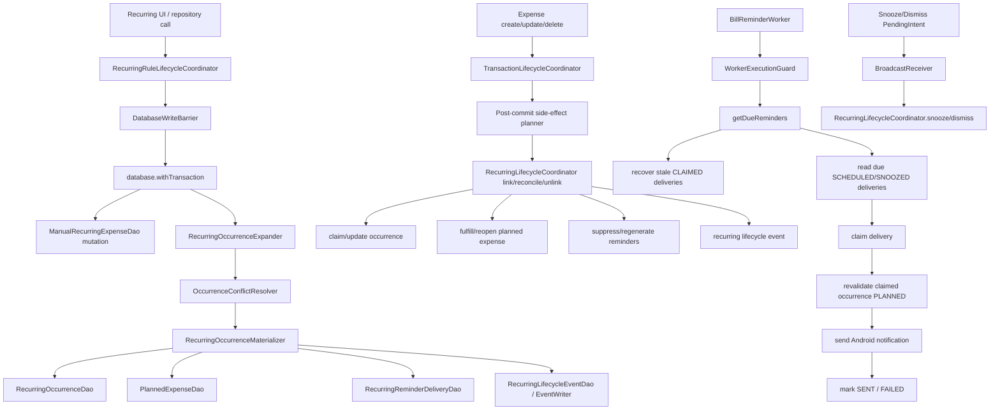

# Pipeline 4 — Recurring / Bill Reminders Master Implementation Plan

Repository: `https://github.com/panospao7/Cost-agregator`  
Pinned commit: `83b798e849b4408b2bf683f52cb2746d37f7af16`  
Pipeline: **P4 — Recurring / Bill Reminders / Recurring Lifecycle**  
Mode: implementation planning only; no code changes.  
Build/test status: **NOT RUN** — static review only.

Source anchors:
- P4 consolidated issues: `docs/analyses and debug master/PIPELINE_4_CONSOLIDATED_ISSUES.md`
- P4 implementation plan: `docs/analyses and debug master/pipelines issues implementantion plan/PIPELINE_4_IMPLEMENTATION_PLAN.md`
- Master tracker: `docs/analyses and debug master/PIPELINE_ISSUES_MASTER_TRACKER.md`
- Legal paths: `docs/architecture/LEGAL_PATHS.md`
- Main source files:
  - `app/src/main/java/com/yourname/expensetracker/domain/recurring/lifecycle/RecurringLifecycleCoordinator.kt`
  - `app/src/main/java/com/yourname/expensetracker/domain/recurring/lifecycle/RecurringRuleLifecycleCoordinator.kt`
  - `app/src/main/java/com/yourname/expensetracker/domain/recurring/lifecycle/RecurringOccurrenceMaterializer.kt`
  - `app/src/main/java/com/yourname/expensetracker/domain/recurring/lifecycle/RecurringLifecycleEventWriter.kt`
  - `app/src/main/java/com/yourname/expensetracker/domain/recurring/OccurrenceConflictResolver.kt`
  - `app/src/main/java/com/yourname/expensetracker/domain/recurring/RecurringPlanProjectionService.kt`
  - `app/src/main/java/com/yourname/expensetracker/service/reminder/BillReminderWorker.kt`
  - `app/src/main/java/com/yourname/expensetracker/service/reminder/SnoozeReminderReceiver.kt`
  - `app/src/main/java/com/yourname/expensetracker/service/reminder/DismissReminderReceiver.kt`
  - `app/src/main/java/com/yourname/expensetracker/data/database/dao/RecurringOccurrenceDao.kt`
  - `app/src/main/java/com/yourname/expensetracker/data/database/dao/RecurringReminderDeliveryDao.kt`
  - `app/src/main/java/com/yourname/expensetracker/data/database/dao/ManualRecurringExpenseDao.kt`

---

## 1. Executive summary

Current state:
- P4 is much improved versus the stale tracker. Rule CRUD is coordinator-owned, occurrence lookup for direct expense linking is already inside a transaction, reminder claim/mark-sent paths use conditional DAO updates, terminal occurrence statuses are protected from regeneration downgrade, and worker scheduling/guard infrastructure exists.
- The P4 issue docs and P4 implementation plan are partially stale. They still list some issues as open that source code already mitigates, and they miss newer production risks found in the attached review.
- The legal path for recurring rules is stricter than the current implementation: recurring mutations must be barrier-guarded, atomic, and write durable recurring lifecycle events; critical lifecycle events should go through `RecurringLifecycleEventWriter`, not direct event DAO inserts.
- Current highest-risk gaps:
  1. `BillReminderWorker` sends notifications but its `WorkerGuardRequest` does not set `requiresNotificationPermission = true`.
  2. `RecurringLifecycleCoordinator.getDueReminders()` looks read-only but performs stale-claim recovery writes without a direct `DatabaseWriteBarrier` check.
  3. The same actual expense can still be auto-linked to multiple generated occurrences across different rules because `OccurrenceConflictResolver` only dedupes within one candidate batch, and `RecurringOccurrence.linkedExpenseId` is indexed but not unique.
  4. Several state mutation + lifecycle event pairs are not atomic and still call `RecurringLifecycleEventDao.insert()` directly.
  5. `reconcilePlannedVsActual()` has write side effects despite its report-like name.
  6. `RecurringPlanProjectionService.projectFromRule()` explicitly has a full-atomicity TODO.
  7. Snooze/dismiss receivers create ad-hoc `CoroutineScope(SupervisorJob()+Dispatchers.IO)` and catch `Exception` without rethrowing `CancellationException`.

Production risk:
- **RED** before implementation.
- P4 should not be marked GREEN until reminder permission gating, global actual-expense uniqueness, barrier coverage, and critical event atomicity are fixed and tested.

Implementation strategy:
1. Fix user-visible reminder loss and restore/barrier safety first.
2. Prevent duplicate recurring fulfillment by enforcing one actual expense → one occurrence globally.
3. Make critical recurring state/event transitions atomic.
4. Split pure report reads from write-generating methods.
5. Harden receiver cancellation and notification/PendingIntent identity.
6. Add architecture guards to prevent direct DAO/event bypass.
7. Update stale P4 docs and tracker only after tests pass.

Recommended verdict before implementation: **RED**.

---

## 2. Scope

### In scope

- Recurring rule lifecycle:
  - create/update/activate/deactivate/delete rule,
  - future occurrence generation,
  - planned-expense projection.
- Recurring occurrence lifecycle:
  - generated PLANNED/PAID occurrences,
  - terminal statuses,
  - linking/unlinking actual expenses,
  - planned fulfillment/reopen.
- Bill reminder lifecycle:
  - delivery creation,
  - due-delivery recovery,
  - claim/send/fail/cancel,
  - snooze/dismiss actions,
  - worker guard and run logging.
- Audit/diagnostics:
  - `RecurringLifecycleEvent`,
  - `DiagnosticEvent` emitted by worker,
  - event atomicity and privacy-safe metadata.
- Restore/write barrier behavior.
- Cancellation behavior.
- Architecture guard tests and docs/tracker updates.

### Out of scope

- Broad UI redesign for recurring settings.
- Full recurring-detection ML/pattern engine rewrite.
- Money/currency normalization refactor beyond preserving existing matching currency checks.
- Database schema migration unless the team chooses the optional unique partial index for `linkedExpenseId`.
- Notification visual styling beyond permission/identity correctness.
- Lock-screen privacy setting for notification contents unless product explicitly requests it.

### Assumptions

- Implementation starts from:

```bash
git rev-parse HEAD
```

Expected:

```text
83b798e849b4408b2bf683f52cb2746d37f7af16
```

- `LEGAL_PATHS.md` is normative unless proven stale.
- `RecurringRuleLifecycleCoordinator` is the legal owner for recurring rule mutations.
- `RecurringLifecycleCoordinator` plus `RecurringOccurrenceMaterializer` own occurrence/reminder state transitions.
- `RecurringLifecycleEventWriter` is the legal event writer for critical lifecycle events.
- Import/export/backups are not directly modified by this plan, but restore barriers must remain respected.
- The attached P4 review is treated as static evidence; implementation agent must verify with local `rg` and tests before editing.

### Stop conditions

Stop and report before coding if:
- checkout SHA differs;
- working tree is dirty;
- local source paths differ materially from this plan;
- `RecurringLifecycleEventWriter` cannot write inside an existing Room transaction without opening a nested transaction or otherwise violating Room constraints;
- tests reveal `BillReminderWorker` already has a notification-permission guard on another path;
- product decides reminder permission denial should terminally fail deliveries instead of leaving them pending;
- a required fix requires schema migration and migration approval has not been given;
- any proposed import/export/backup change is needed to satisfy P4.

---

## 3. Source/doc reconciliation

| Area / Issue | Pipeline doc claim | Master tracker claim | Source-code truth | Status | Evidence |
|---|---|---|---|---|---|
| P4-P0-01 actual payment fulfills planned expense | Fixed | Fixed | Direct link path fulfills planned row and writes planned event; materializer also attempts planned fulfillment for auto-PAID rows. | PARTIALLY_FIXED | `RecurringLifecycleCoordinator.linkExpenseToOccurrence()` calls `plannedExpenseDao.linkToActualExpense`; materializer calls `fulfillByOccurrenceKey`. Remaining duplicate-actual risk across rules. |
| P4-P0-02 paid occurrence suppresses reminders | Fixed | Fixed | Direct link suppresses open deliveries; DAO includes SCHEDULED/SNOOZED/CLAIMED/FAILED_TRANSIENT. | FIXED | `suppressOpenDeliveriesForOccurrence`; `suppressByOccurrenceId`. |
| P4-P1-01 exactly-once reminder dispatch | Fixed | Fixed | Conditional claim and mark-sent exist, but notification-permission gap can terminally fail reminders. | PARTIALLY_FIXED | `claimDelivery`, `markSentFromClaimed`; `BillReminderWorker` lacks `requiresNotificationPermission=true`. |
| P4-P1-02 rule CRUD bypasses lifecycle/events | Fixed | Fixed | Repository path appears coordinator-owned, but DAO mutation surface is still public and TODO says guard needed. | PARTIALLY_FIXED | `ManualRecurringExpenseDao` TODO: direct mutation surface public. |
| P4-P1-03 worker disabled by default | Fixed | Fixed | Worker is registered/enabled per review. | FIXED_SOURCE_SUPPORTED | Verify with `WorkerSpec.DEFAULTS` and `WorkerRegistry`. |
| P4-P1-04 reminder windows defaults | Fixed | Fixed | `DEFAULT_REMINDER_WINDOWS` exists and create/update paths use it. | FIXED | `RecurringLifecycleCoordinator.DEFAULT_REMINDER_WINDOWS`; rule coordinator materialization options. |
| P4-P1-05 occurrenceKey collision across source types | Deferred | Deferred/design | New keys include source type/source id/frequency; legacy migration/backfill still not locally verified. | PARTIALLY_FIXED / NEEDS_VERIFICATION | `RecurringOccurrence.occurrenceKey` unique; expander key should be verified with `rg "occurrenceKey"`. |
| P4-P1-06 expense→occurrence linking globally guaranteed | Fixed | Fixed | Transaction side effects call link/reconcile, but resolver/materializer can reuse one actual expense across different rule batches. | OPEN | `OccurrenceConflictResolver` TODO says same expense can pay multiple rules; `linkedExpenseId` is not unique. |
| P4-P1-07 PAID downgraded by regeneration | Fixed | Fixed | Terminal statuses are protected. | FIXED | `RecurringOccurrenceStatus.terminalDbValues` used by materializer. |
| P4-P1-08 materializer status update without event | Fixed | Fixed | Materializer writes events, but via direct DAO and not always through writer. | PARTIALLY_FIXED | `RecurringOccurrenceMaterializer` calls `lifecycleEventDao.insert()` directly. |
| P4-P1-09 shared recurring write methods miss restore guard | Fixed | Fixed | Most writes guard; `getDueReminders()` hides a recovery UPDATE without direct barrier. | PARTIALLY_FIXED | `getDueReminders()` calls private `recoverStaleClaimedDeliveries()`; recovery DAO method updates rows. |
| P4-P1-10 legacy `markBillPaid()` | Fixed | Fixed | Deprecated/removed behavior per review. | FIXED_SOURCE_SUPPORTED | Verify `BillReminderManager.markBillPaid` locally. |
| NEW-P4-001 CE swallowed in bulk reconcile | Fixed via universal | Fixed | Bulk reconcile catch rethrows `CancellationException`. | FIXED | `reconcileAllLinkedExpensesAfterBulkUpdate()` rethrows CE. |
| NEW-P4-002 scheduledAt computed twice | Fixed | Fixed | Materializer comment says duplicate shadow removed. | FIXED | `computeScheduledAt()` once per window. |
| NEW-P4-003 link lookup race | Open in stale P4 doc | Tracker drift | Source now reads occurrences and claims inside `database.withTransaction`. | FIXED / TRACKER_DRIFT | `linkExpenseToOccurrence()` comment says lookup inside transaction; uses `claimForExpense`. |
| NEW-P4-004 worker uses system time | Fixed | Fixed | Worker uses injected `TimeProvider` for settings/quiet-hours. | FIXED | `BillReminderWorker` has `timeProvider.now()`. |
| NEW-P4-005 notification ID collision | Open | Open | Improved from `hashCode()` to `delivery.id % Int.MAX_VALUE`, but modulo collisions remain. | PARTIALLY_FIXED | `sendNotification()` computes notificationId/request codes with modulo. |
| NEW-P4-006 PendingIntent request code collision | Open | Open | Snooze/dismiss differ by xor flag, but same-action modulo collisions remain; extras do not distinguish PendingIntent identity. | PARTIALLY_FIXED | `sendNotification()` request-code calculation. |
| NEW-P4-007 CE swallowed in regenerate deliveries | Fixed | Fixed | Review says fixed; local verification still required. | FIXED_SOURCE_SUPPORTED | Run `rg "regenerateReminderDeliveries|catch \\(e: Exception\\)"`. |
| NEW-P4-008 reconcile write side effects | Open | Open | Still explicitly TODO; method calls `generateOccurrences()` before computing report. | OPEN | `reconcilePlannedVsActual()` KDoc says not pure; calls `generateOccurrences()`. |
| NEW-P4-009 JSON injection metadata | Open | Open | Many user strings use `JSONObject.put()`, but raw string metadata remains. | PARTIALLY_FIXED | `updateOccurrenceStatus`, `markReminderSent`, snooze/dismiss use raw string metadata. |
| NEW-P4-010 impossible state returns skipped | Open in stale doc | Tracker drift | Source returns `RecurringExpenseReconcileResult.Error`. | FIXED / TRACKER_DRIFT | `linkExpenseToOccurrenceDetailed()` returns `Error` when linked occurrence is missing after success. |
| New audit: reminder permission guard | Not tracked | Not tracked | Worker guard supports notification permission, but request does not enable it. | OPEN | `WorkerGuardRequest` has `requiresNotificationPermission`; `BillReminderWorker` leaves default false. |
| New audit: event atomicity | Not tracked enough | Universal diagnostics contract | Several state updates write event after mutation and swallow non-CE failures. | OPEN | `markReminderSent`, `markReminderFailed`, `cancelClaimedReminderDelivery`, `updateOccurrenceStatus`. |
| New audit: projection full atomicity | TODO in code | Not tracker-gated | `projectFromRule()` calls coordinator then planned inserts separately. | OPEN | explicit TODO in `RecurringPlanProjectionService.projectFromRule()`. |
| New audit: receiver cancellation | Universal issue | Universal issue | Receivers catch `Exception` without CE rethrow and create ad-hoc scope. | OPEN | `SnoozeReminderReceiver`, `DismissReminderReceiver`. |
| Stale tests | Not tracked | Not tracked | Review says `BillReminderWorkerTimeProviderTest` expectations conflict with guard-inside-settings behavior. | NEEDS_RUNTIME_VERIFICATION | Run focused worker tests. |

---

## 4. Architecture contracts for this pipeline

| Contract | Required legal path | Current code | Gap | Fix required |
|---|---|---|---|---|
| Rule mutation ownership | `RecurringRuleLifecycleCoordinator` owns create/update/activate/deactivate/delete. | Main rule coordinator exists; DAO remains publicly injectable. | Future bypass possible; event writer unused in rule coordinator. | Add architecture guard for DAO mutation callers; route critical events through writer/helper. |
| Occurrence generation | `RecurringLifecycleCoordinator.generateOccurrences()` uses expander → resolver → materializer; inactive rules reject generation; terminal statuses not downgraded. | Mostly implemented. | Resolver does not exclude globally linked expenses. | Add global linked-expense exclusion before resolution and materializer-level guard. |
| Expense linking | Atomic conditional claim: status PLANNED and `linkedExpenseId IS NULL`; planned fulfilled; reminders suppressed. | Direct link path is atomic. | Generated auto-PAID path can duplicate one actual across rules. | Add global uniqueness checks. Optional unique partial index if approved. |
| Reminder dispatch | Worker must run inside `WorkerExecutionGuard`; guard should enforce notification permission before dispatch. | Worker uses guard but request omits `requiresNotificationPermission=true`. | Permission-denied send claims delivery and can move it to `FAILED_PERMISSION`. | Add guard flag and tests so delivery remains due/pending when permission denied. |
| Restore/write barrier | Every DB write checks `DatabaseWriteBarrier`; no writes during non-NORMAL maintenance. | Most mutators guard. | `getDueReminders()` performs recovery UPDATE without direct barrier. | Split read and recovery, or add barrier to recovery path. |
| Event ownership | Critical recurring lifecycle events use `RecurringLifecycleEventWriter.writeCritical()`; direct DAO insert forbidden. | Many direct `RecurringLifecycleEventDao.insert()` calls. | Legal path violation and inconsistent critical/diagnostic semantics. | Replace direct critical event DAO use with writer or transaction-aware event helper; add guard. |
| Atomicity | State mutation and critical event must commit/rollback together. | Several methods update first, then best-effort event insert outside transaction. | State/event drift possible. | Wrap mutation + event in `database.withTransaction`; do not swallow critical event failures. |
| Query purity | Read-only report/projection methods must not mutate DB unexpectedly. | `projectOccurrences()` is pure; `reconcilePlannedVsActual()` is not. | Report path writes and can fail under write barrier. | Split pure report from explicit ensure/generate method. |
| Planned projection | Occurrence generation and planned row creation must be atomic when materializing persistent projection. | Rule coordinator uses in-current-transaction projection; `projectFromRule()` does not. | Partial occurrences/reminders without planned rows. | Add transaction-safe orchestration. |
| Cancellation | `CancellationException` must not be swallowed. | Many coordinator catches rethrow; receivers do not. | Receiver ad-hoc scopes can swallow cancellation. | Catch CE separately and rethrow/log correctly after `pendingResult.finish()`. |
| Privacy-safe diagnostics | No raw PII in durable diagnostics/events; metadata should use structured JSON builder/sanitizer. | Mostly IDs/amount/currency/merchant via `JSONObject`; raw string metadata remains in places. | Minor JSON injection/format risk. | Replace raw JSON strings with `JSONObject.put()` and sanitize exception metadata if added. |

---

## 5. Current runtime flow



Runtime flow gaps:
- `X[recover stale CLAIMED deliveries]` currently writes without its own barrier in `getDueReminders()`.
- `V[WorkerExecutionGuard]` currently does not enforce notification permission because `BillReminderWorker` does not set `requiresNotificationPermission=true`.
- `G/H` can still auto-link the same expense to more than one rule across separate generation batches.

---

## 6. Implementation phases

### PR 1 — Critical reminder safety and barrier correctness

Goal:
- Prevent due reminders from being claimed/terminally failed when notification permission is missing.
- Ensure stale-claim recovery writes are barrier-checked and explicitly write-named.
- Update stale worker tests to current guard-inside-settings behavior.

Risk:
- Low/medium. Changes worker skip behavior under notification permission denial and may affect run logs.

Files:
- `BillReminderWorker.kt`
- `RecurringLifecycleCoordinator.kt`
- `RecurringReminderDeliveryDao.kt` only if query naming/comments need adjustment
- worker tests / coordinator barrier tests

Work items:
- P4-REM-001
- P4-BARRIER-002
- P4-TEST-003

Tests:
- permission denied leaves delivery SCHEDULED/SNOOZED and does not call claim;
- permission restored dispatches same delivery;
- `getDueReminders` / recovery is blocked by write barrier in restore mode;
- quiet-hours/disabled-reminder tests expect worker run is guard-logged.

Acceptance criteria:
- Worker guard records `NOTIFICATION_PERMISSION_DENIED` skip before any delivery claim.
- `FAILED_PERMISSION` is no longer created by permission-denied guard path.
- No hidden write occurs without `DatabaseWriteBarrier`.

### PR 2 — Recurring data integrity and state/event atomicity

Goal:
- Enforce one actual expense can fulfill at most one recurring occurrence globally.
- Make critical state/event transitions atomic.
- Start routing critical recurring events through `RecurringLifecycleEventWriter`.

Risk:
- Medium/high. Affects core recurring matching and audit behavior.

Files:
- `OccurrenceConflictResolver.kt`
- `RecurringLifecycleCoordinator.kt`
- `RecurringRuleLifecycleCoordinator.kt`
- `RecurringOccurrenceMaterializer.kt`
- `RecurringOccurrenceDao.kt`
- `RecurringLifecycleEventWriter.kt`
- recurrence integration tests

Work items:
- P4-DUP-004
- P4-EVENT-005
- P4-META-006

Tests:
- two same merchant/date/amount rules + one expense links only one occurrence;
- materializer does not auto-PAID a second occurrence with already-linked expense;
- `markReminderSent`, `markReminderFailed`, `updateOccurrenceStatus`, and `cancelClaimedReminderDelivery` roll back if critical event insert fails;
- direct event DAO use guard.

Acceptance criteria:
- No duplicated `linkedExpenseId` across live occurrences after generation/linking.
- Critical state transitions commit with exactly one event or rollback.
- Direct critical event DAO writes are gone or restricted to writer-only internals.

### PR 3 — Query purity, planned projection atomicity, receiver cancellation

Goal:
- Split report reads from write-generating reconciliation.
- Make `projectFromRule()` atomic.
- Fix snooze/dismiss receiver cancellation and scope behavior.
- Improve notification/PendingIntent identity to avoid same-action collisions.

Risk:
- Medium. May require caller updates.

Files:
- `RecurringLifecycleCoordinator.kt`
- `RecurringPlanProjectionService.kt`
- `BillReminderWorker.kt`
- `SnoozeReminderReceiver.kt`
- `DismissReminderReceiver.kt`
- optional new receiver runner/scope helper
- tests

Work items:
- P4-QUERY-007
- P4-PLAN-008
- P4-RECEIVER-009
- P4-NOTIF-010

Tests:
- pure report method performs zero writes and no write barrier;
- explicit ensure/generate method performs writes and is barrier-guarded;
- planned projection failure rolls back occurrences/reminders/planned rows;
- receiver cancellation is not swallowed;
- PendingIntent data/request identity is unique for same-action deliveries with colliding modulo IDs;
- notification tag/id path does not replace another active reminder.

Acceptance criteria:
- All read-looking report paths are pure.
- Persistent projection is all-or-nothing.
- Receivers do not swallow CE.
- Notification/PendingIntent collisions are practically eliminated for active deliveries.

### PR 4 — Architecture guards, docs, tracker cleanup

Goal:
- Prevent future bypass of recurring coordinators/events/barriers.
- Reconcile stale P4 docs and implementation plan.

Risk:
- Low.

Files:
- architecture test package
- P4 docs/tracker
- optional `docs/architecture/LEGAL_PATHS.md` update if helper API names change

Work items:
- P4-GUARD-011
- P4-DOC-012

Tests:
- architecture guards pass.

Acceptance criteria:
- Guard fails if direct `ManualRecurringExpenseDao` mutation is introduced outside allowed owners.
- Guard fails if direct `RecurringLifecycleEventDao.insert` appears outside writer/allowlisted tests/migrations.
- Tracker statuses match source and tests.

### Optional PR 5 — Database uniqueness hardening for linked actual expense

Goal:
- Add DB-level uniqueness for non-null `recurring_occurrences.linkedExpenseId` if design approves.

Risk:
- High because migration/backfill required.

Files:
- Room migrations
- schema JSON
- `RecurringOccurrence` entity docs
- duplicate cleanup/backfill tests

Work items:
- P4-MIG-013

Acceptance criteria:
- No duplicate non-null linked expense IDs can exist at DB level.
- Existing duplicate data is handled deterministically before creating unique index.
- Migration tests pass.

---

## 7. Detailed work items

| ID | Severity | Title | Files | Implementation steps | Tests | Acceptance criteria |
|---|---|---|---|---|---|---|
| P4-REM-001 | P1 | Add notification-permission guard before reminder claim | `BillReminderWorker.kt`, worker tests | In `doWork()`, change `WorkerGuardRequest(workerName="bill_reminder_periodic", allowDuringBackupExport=false)` to set `requiresNotificationPermission = true`. Keep settings/quiet-hours check inside guard so run is logged. Ensure permission-denied skip returns success/skipped and block never calls `getDueReminders()` or `claimReminderDelivery()`. Keep `SecurityException` fallback for unexpected runtime race, but treat it as transient/retryable or leave delivery recoverable; do not make permission denial the normal path. | `permissionDenied_doesNotClaimDueReminder`; `permissionRestored_dispatchesSameDelivery`; worker run logger skip reason test. | Missing notification permission does not move delivery to CLAIMED or FAILED_PERMISSION; due reminder can dispatch after permission is granted. |
| P4-BARRIER-002 | P1 | Barrier-check stale claimed recovery hidden in `getDueReminders()` | `RecurringLifecycleCoordinator.kt`, barrier tests | Minimal PR1 fix: before `recoverStaleClaimedDeliveries()`, call `writeBarrier.checkWritesAllowed("RecurringLifecycleCoordinator.recoverStaleClaimedDeliveries")`. Preferred PR3 follow-up: split `recoverStaleClaimedDeliveriesForDispatch()` and pure `peekDueReminders()`. If keeping `getDueReminders()`, update KDoc to say it mutates stale claims and is write-barrier guarded. | `getDueReminders_restoreMode_doesNotRecoverStaleClaims`; `getDueReminders_normalMode_recoversStaleClaims`. | No recovery UPDATE can run in non-NORMAL restore/backup mode. |
| P4-TEST-003 | P2 | Repair stale BillReminder worker tests | `BillReminderWorkerTimeProviderTest.kt` or replacement | Update tests to match current architecture: settings/quiet-hours checks run inside `WorkerExecutionGuard`; guard should be invoked and run should be logged even when reminders disabled or quiet hours. Remove/replace ignored stale tests that reference removed APIs. | `disabledSettings_runGuardedAndSkipped`; `quietHours_runGuardedAndSkipped`. | Tests assert current legal worker flow, not old pre-guard short-circuit behavior. |
| P4-DUP-004 | P1 | Prevent one actual expense from paying multiple recurring rules | `OccurrenceConflictResolver.kt`, `RecurringLifecycleCoordinator.kt`, `RecurringRuleLifecycleCoordinator.kt`, `RecurringOccurrenceMaterializer.kt`, `RecurringOccurrenceDao.kt` | Add DAO read: `getLinkedExpenseIds()` or date-bounded `getLinkedExpenseIdsBetween(start,end)` for non-null `linkedExpenseId`. Extend resolver signature to accept `globallyExcludedExpenseIds: Set<Long> = emptySet()` and skip those before local `matchedExpenseIds`. In all generation/projection paths, load already-linked IDs and pass to resolver. In `RecurringOccurrenceMaterializer.materializeInCurrentTransaction`, before persisting a PAID occurrence with `linkedExpenseId`, check `occurrenceDao.getByLinkedExpenseId(expenseId)`; if an existing different occurrence is found, materialize as PLANNED with null paid fields and write a diagnostic event `OCCURRENCE_AUTO_PAID_SKIPPED_EXPENSE_ALREADY_LINKED`. Do not fulfill planned/suppress reminders for the skipped duplicate. | `twoRulesOneExpense_onlyOneOccurrencePaid`; `materializer_existingLinkedExpense_downgradesSecondToPlanned`; `projectOccurrences_excludesGloballyLinkedExpense`. | Same `expenseId` cannot fulfill two occurrence rows through generation/materializer paths. |
| P4-EVENT-005 | P1 | Make critical recurring state/event transitions atomic | `RecurringLifecycleCoordinator.kt`, `RecurringOccurrenceMaterializer.kt`, `RecurringRuleLifecycleCoordinator.kt`, `RecurringLifecycleEventWriter.kt` | Add/verify writer API usable inside current transaction, e.g. `writeCriticalInCurrentTransaction(...)` or writer methods that do not create nested transaction. For `markReminderSent`, `markReminderFailed`, `cancelClaimedReminderDelivery`, and `updateOccurrenceStatus`, wrap read+conditional update+critical event in `database.withTransaction`. Use `eventWriter.writeCritical...` and let failure rollback mutation. Replace best-effort event catch for critical events. Keep diagnostic/non-critical events best-effort only when legal. | `markSent_eventFailure_rollsBackSent`; `markFailed_eventFailure_rollsBackFailed`; `updateOccurrenceStatus_eventFailure_rollsBackStatus`; `cancelClaimed_eventFailure_rollsBackCancel`. | State and critical event are never committed separately. |
| P4-META-006 | P3 | Use safe structured metadata everywhere | P4 coordinator/materializer files | Replace raw metadata strings like `"""{"reason":"${reason.name}"}"""`, `"""{"deliveryId":$deliveryId}"""`, and `"""{"deliveryId":$deliveryId,"notificationId":$notificationId}"""` with `JSONObject().put(...).toString()`. Keep metadata limited to IDs, enum names, counts, amounts/currencies already in domain events; no raw exception messages. | `metadata_specialCharacters_validJson`; static guard against raw JSON interpolation in P4 lifecycle event construction. | P4 event metadata is valid JSON and cannot be broken by user strings. |
| P4-QUERY-007 | P2 | Split `reconcilePlannedVsActual()` into pure read and explicit write | `RecurringLifecycleCoordinator.kt`, callers/tests | Add `getPlannedVsActualReport(ruleId, monthsBack)` that only reads occurrences and computes totals. Add `ensureGeneratedAndGetPlannedVsActualReport(...)` or `reconcilePlannedVsActualWithGeneration(...)` that first calls `generateOccurrences()` then delegates to pure method. Deprecate old `reconcilePlannedVsActual()` or keep it as explicit write-compatible wrapper with clear name. Update all callers after `rg "reconcilePlannedVsActual"`. | `plannedVsActualReport_noWriteBarrier_noGeneration`; `ensureGeneratedReport_callsGenerateAndIsBarrierGuarded`. | Query-like dashboard/forecast callers can get report without writes. |
| P4-PLAN-008 | P2 | Make `RecurringPlanProjectionService.projectFromRule()` atomic | `RecurringPlanProjectionService.kt`, `RecurringLifecycleCoordinator.kt` | Add coordinator method or internal helper to expand/resolve/materialize occurrences in current transaction, then call `projectFromOccurrencesInCurrentTransaction()` in same `database.withTransaction`. Ensure write barrier checked once before transaction and optionally at transaction entry. Avoid nested transactions if `generateOccurrences()` currently delegates to `materializer.materialize()` with its own transaction. | `projectFromRule_plannedInsertFailure_rollsBackOccurrencesAndReminders`; `projectFromRule_success_createsOccurrencesRemindersPlannedRows`. | No partial occurrence/reminder rows if planned projection fails. |
| P4-RECEIVER-009 | P2 | Fix snooze/dismiss receiver cancellation and scope | `SnoozeReminderReceiver.kt`, `DismissReminderReceiver.kt`, optional new `ReminderActionReceiverRunner.kt` | Replace ad-hoc `CoroutineScope(SupervisorJob()+Dispatchers.IO)` with injected application scope/dispatcher or shared receiver runner. Catch `CancellationException` separately and rethrow after `pendingResult.finish()` in `finally`, or ensure runner propagates cancellation to supervisor/logging according to app policy. Keep `pendingResult.finish()` exactly once. | `snoozeReceiver_cancellationNotSwallowed`; `dismissReceiver_cancellationNotSwallowed`; `pendingResultFinishedOnSuccessFailureCancel`. | Receiver work is structured and does not swallow CE. |
| P4-NOTIF-010 | P3 | Harden notification/PendingIntent identity | `BillReminderWorker.kt`, tests | For PendingIntents, set stable unique action/data URI per delivery/action, e.g. `intent.action = ACTION_SNOOZE`, `intent.data = Uri.parse("costagregator://bill-reminder/snooze/${delivery.id}")`; same for dismiss. Request code may remain derived, but uniqueness must not depend only on modulo. For notifications, prefer `NotificationManagerCompat.notify(tag = "bill_reminder_${delivery.id}", id = 0, notification)` if available; keep stored `notificationId` for compatibility or document it. If tag persistence/canceling is needed later, add schema only with approval. | `pendingIntent_sameModuloDifferentDelivery_notEqual`; `notification_sameModuloDifferentDelivery_notReplaced` using fake notifier/wrapper. | Colliding Long delivery IDs do not overwrite each other's actions or notifications. |
| P4-GUARD-011 | P1 | Add P4 architecture guards | architecture test package | Add static tests: (1) no production direct `ManualRecurringExpenseDao.insert/update/delete/setActiveStatus/updateNextDate` outside `RecurringRuleLifecycleCoordinator`; (2) no `RecurringLifecycleEventDao.insert` outside `RecurringLifecycleEventWriter` or allowlisted tests/migrations; (3) no P4 `catch(Exception)` without CE rethrow; (4) no `getDueReminders()` hidden write without barrier if method remains. | `P4RecurringLegalPathGuardTest`. | Future bypasses fail CI. |
| P4-DOC-012 | P3 | Update stale P4 docs and trackers | docs | Mark NEW-P4-003/010 fixed; NEW-P4-005/006 partial; NEW-P4-008 open until PR3; add new audit IDs for permission guard, hidden barrier, duplicate actual link, event atomicity, receiver CE. Update P4 verdict after tests pass. | docs review | Docs match source and test-backed status. |
| P4-MIG-013 | P1 optional | Add unique partial index on non-null `linkedExpenseId` | migrations/schema/DAO/entity docs | Only if approved. Before index creation, detect duplicates and resolve deterministically: keep earliest paid occurrence or most recent linked event; revert duplicates to PLANNED and reopen planned/reminders if needed. Add raw SQL partial unique index: `CREATE UNIQUE INDEX ... ON recurring_occurrences(linkedExpenseId) WHERE linkedExpenseId IS NOT NULL`. Update schema export. | migration duplicate cleanup test; uniqueness violation test. | DB enforces one actual expense → one occurrence. |

---

## 8. File-by-file change plan

| File | Change type | Exact changes | Risk | Tests covering it |
|---|---|---|---|---|
| `service/reminder/BillReminderWorker.kt` | MODIFY | Set `requiresNotificationPermission = true`; add unique action/data URIs for snooze/dismiss PendingIntents; optionally use notification tag; keep `SecurityException` fallback. | Medium | worker permission tests, notification identity tests |
| `domain/recurring/lifecycle/RecurringLifecycleCoordinator.kt` | MODIFY | Barrier-check stale recovery; add pure report method + explicit generate/report method; make sent/failed/cancel/status mutation+event atomic; replace raw metadata; use event writer. | High | barrier, event atomicity, query purity tests |
| `domain/recurring/lifecycle/RecurringRuleLifecycleCoordinator.kt` | MODIFY | Pass global linked-expense exclusion to resolver during create/update/activate; use event writer or transaction-aware event helper for critical rule events; keep in-transaction planned projection. | Medium | duplicate actual, event guard tests |
| `domain/recurring/lifecycle/RecurringOccurrenceMaterializer.kt` | MODIFY | Materializer-level duplicate linked-expense guard; use event writer/helper; replace direct event DAO where required; preserve terminal-status logic. | High | duplicate actual, event atomicity/materializer tests |
| `domain/recurring/lifecycle/RecurringLifecycleEventWriter.kt` | MODIFY | Add or verify transaction-safe critical/diagnostic write APIs; document critical failures must propagate. | Medium | writer tests, atomicity tests |
| `domain/recurring/OccurrenceConflictResolver.kt` | MODIFY | Add optional `globallyExcludedExpenseIds` parameter and skip those expenses before local matching. | Low/medium | resolver unit tests |
| `data/database/dao/RecurringOccurrenceDao.kt` | MODIFY | Add read query for linked expense IDs, preferably date-bounded and/or all non-null. Optional migration-only: no entity index change unless PR5. | Low | DAO/integration tests |
| `data/database/dao/RecurringReminderDeliveryDao.kt` | NO_CHANGE_READ_ONLY / MODIFY | Likely no SQL change; comments may be updated. If notification permission policy changes failed statuses, update queries only with tests. | Low | reminder DAO tests |
| `domain/recurring/RecurringPlanProjectionService.kt` | MODIFY | Wrap `projectFromRule()` generation + planned inserts in one transaction via new coordinator helper; remove TODO. | Medium | projection atomicity tests |
| `service/reminder/SnoozeReminderReceiver.kt` | MODIFY | Replace ad-hoc scope or catch CE separately; guarantee `pendingResult.finish()` in finally. | Medium | receiver cancellation tests |
| `service/reminder/DismissReminderReceiver.kt` | MODIFY | Same as snooze receiver. | Medium | receiver cancellation tests |
| `data/database/dao/ManualRecurringExpenseDao.kt` | UPDATE_DOC / ADD_GUARD | Keep DAO code unless visibility refactor approved; architecture guard enforces allowed owners. | Low | guard test |
| `data/database/entity/RecurringOccurrence.kt` | NO_CHANGE_READ_ONLY / MIGRATION optional | No schema change by default. Optional PR5 may add documentation/backed unique partial index via migration, not entity annotation. | High if migration | migration tests |
| `app/src/test/.../BillReminderWorkerTimeProviderTest.kt` | UPDATE_TEST | Align expectations with guard-inside-settings behavior. | Low | focused worker tests |
| `app/src/test/.../RecurringLifecycleCoordinatorTest.kt` | UPDATE_TEST | Add barrier/pure report/atomicity tests. | Medium | focused lifecycle tests |
| `app/src/test/.../RecurringLifecycleFixesTest.kt` | UPDATE_TEST | Un-ignore or replace stale removed-API tests with current APIs. | Medium | all recurring tests |
| `app/src/test/.../P4RecurringLegalPathGuardTest.kt` | ADD_GUARD | Static source scanning guards. | Medium | architecture guard task |
| P4 docs | UPDATE_DOC | Reconcile statuses and file names after implementation. | Low | docs review |

---

## 9. Database / schema / migration plan

Default plan for PR 1–4:

```text
No schema migration required.
```

Planned changes are source/logic/test only:
- add DAO read query for non-null linked expense IDs;
- no entity field changes;
- no new table;
- no schema export.

Optional PR5 schema hardening:

| Change | Entity/DAO | Migration required? | Schema export required? | Backfill required? | Tests |
|---|---|---:|---:|---:|---|
| Unique partial index on non-null `recurring_occurrences.linkedExpenseId` | `RecurringOccurrenceDao` / migration SQL | Yes | Yes | Yes, if duplicates exist | migration duplicate cleanup + uniqueness tests |
| Persist notification tag/allocated notification ID | `RecurringReminderDelivery` | Yes | Yes | Optional | notification migration tests |

Recommendation:
- Do **not** start with schema migration.
- First enforce uniqueness in coordinator/materializer code and add tests.
- Add unique partial index only if product requires DB-level protection and migration ownership is approved.

---

## 10. Test plan

### Existing tests to run

```bash
./gradlew :app:testDebugUnitTest --stacktrace
./gradlew :app:assembleDebug --stacktrace
```

### Focused tests

```bash
./gradlew :app:testDebugUnitTest --tests "*Recurring*" --stacktrace
./gradlew :app:testDebugUnitTest --tests "*BillReminder*" --stacktrace
./gradlew :app:testDebugUnitTest --tests "*Reminder*" --stacktrace
./gradlew :app:testDebugUnitTest --tests "*Worker*" --stacktrace
./gradlew :app:testDebugUnitTest --tests "*Planned*" --stacktrace
./gradlew :app:testDebugUnitTest --tests "*P4*" --stacktrace
```

### New tests to add

| Test file | Test name | Behavior covered |
|---|---|---|
| `BillReminderWorkerPermissionGuardTest.kt` | `permissionDeniedDoesNotClaimDueReminder` | Guard skip before DB claim/send. |
| `BillReminderWorkerPermissionGuardTest.kt` | `permissionRestoredDispatchesSameReminder` | Pending delivery remains dispatchable. |
| `BillReminderWorkerSettingsGuardTest.kt` | `disabledSettingsStillRunLoggedInsideGuard` | Fix stale test expectation. |
| `BillReminderWorkerSettingsGuardTest.kt` | `quietHoursStillRunLoggedInsideGuard` | Guard logging for quiet-hours skip. |
| `RecurringLifecycleCoordinatorBarrierTest.kt` | `getDueRemindersBlockedDuringRestoreBeforeStaleRecovery` | Hidden write barrier. |
| `RecurringDuplicateActualLinkTest.kt` | `twoMatchingRulesOneActualLinksOnlyOneOccurrence` | Global actual-expense uniqueness. |
| `RecurringOccurrenceMaterializerTest.kt` | `alreadyLinkedActualExpenseDoesNotAutoPaySecondOccurrence` | Materializer guard. |
| `OccurrenceConflictResolverTest.kt` | `globallyExcludedExpenseIdsAreNotMatched` | Resolver parameter behavior. |
| `RecurringEventAtomicityTest.kt` | `markReminderSentEventFailureRollsBackStatus` | State/event atomicity. |
| `RecurringEventAtomicityTest.kt` | `markReminderFailedEventFailureRollsBackStatus` | State/event atomicity. |
| `RecurringEventAtomicityTest.kt` | `updateOccurrenceStatusEventFailureRollsBackStatus` | State/event atomicity. |
| `RecurringPlannedVsActualReportTest.kt` | `pureReportDoesNotGenerateOrWrite` | Query purity. |
| `RecurringPlannedVsActualReportTest.kt` | `ensureGeneratedReportUsesWriteBarrier` | Explicit write path. |
| `RecurringPlanProjectionAtomicityTest.kt` | `plannedInsertFailureRollsBackGeneratedOccurrences` | Projection atomicity. |
| `SnoozeReminderReceiverCancellationTest.kt` | `cancellationExceptionNotSwallowedAndPendingResultFinished` | Receiver cancellation. |
| `DismissReminderReceiverCancellationTest.kt` | `cancellationExceptionNotSwallowedAndPendingResultFinished` | Receiver cancellation. |
| `BillReminderPendingIntentIdentityTest.kt` | `sameModuloDeliveryIdsHaveDistinctPendingIntentIdentity` | PendingIntent uniqueness. |
| `BillReminderNotificationIdentityTest.kt` | `sameModuloDeliveryIdsDoNotReplaceNotifications` | Notification identity. |
| `P4RecurringLegalPathGuardTest.kt` | `manualRecurringDaoMutationsOnlyAllowedFromCoordinator` | DAO ownership guard. |
| `P4RecurringLegalPathGuardTest.kt` | `recurringLifecycleEventDaoInsertOnlyAllowedFromWriter` | Event writer guard. |
| `P4RecurringLegalPathGuardTest.kt` | `p4CatchExceptionRethrowsCancellationException` | Cancellation guard. |

### Architecture guard tests

| Guard | Expected rule |
|---|---|
| ManualRecurringExpenseDao mutation guard | Production calls to `insert`, `update`, `delete`, `deleteById`, `setActiveStatus`, `updateNextDate` only from `RecurringRuleLifecycleCoordinator` or allowlisted migrations/tests. |
| RecurringOccurrenceDao mutation guard | Production calls to `insert/update/updateStatus/delete/claimForExpense/updateLinkedPaymentSnapshot` only from recurring lifecycle/materializer/coordinator allowlist. |
| RecurringReminderDeliveryDao mutation guard | Production mutation calls only from recurring lifecycle/materializer/coordinator allowlist. |
| RecurringLifecycleEventDao guard | Direct `insert` only inside `RecurringLifecycleEventWriter`, migrations, or tests; critical code uses writer. |
| Cancellation guard | No P4 production `catch (e: Exception)` without `if (e is CancellationException) throw e` or an earlier `catch (e: CancellationException)`. |
| Hidden write guard | `getDueReminders()` cannot call DAO update/recovery unless method is barrier-checked or split into explicit write API. |
| Query purity guard | Pure report methods cannot call `generateOccurrences`, DAO insert/update/delete, or write barrier. |

---

## 11. Validation commands

Required initial verification:

```bash
git rev-parse HEAD
git status --short
```

Expected SHA:

```text
83b798e849b4408b2bf683f52cb2746d37f7af16
```

Discovery commands:

```bash
find app/src/main/java -type f | sort
find app/src/test/java -type f | sort
find app/src/androidTest/java -type f | sort

rg -n "Recurring|BillReminder|ReminderDelivery|ManualRecurring|Occurrence|PlannedVsActual|SnoozeReminder|DismissReminder" app/src/main app/src/test app/src/androidTest docs config scripts

rg -n "withTransaction|DatabaseWriteBarrier|DatabaseReadBarrier|RestoreMaintenanceMode|checkWritesAllowed|checkReadsAllowed|DatabaseAccessBlockedException" app/src/main app/src/test app/src/androidTest

rg -n "TransactionEvent|LifecycleEvent|DiagnosticEvent|PipelineDiagnosticEvent|Audit|EventWriter|RecurringLifecycleEvent" app/src/main app/src/test app/src/androidTest

rg -n "insert\\(|insertAll\\(|update\\(|delete\\(|deleteAll\\(|@Query\\(\"UPDATE|@Query\\(\"DELETE|@Query\\(\"INSERT" app/src/main/java app/src/test/java app/src/androidTest/java

rg -n "catch \\(e: Exception\\)|runCatching|CancellationException|NonCancellable|SupervisorJob|launch|async" app/src/main app/src/test app/src/androidTest

rg -n "WorkerGuardRequest|requiresNotificationPermission|NotificationPermissionChecker|FAILED_PERMISSION|SecurityException|notify\\(" app/src/main app/src/test

rg -n "reconcilePlannedVsActual|projectFromRule|recoverStaleClaimedDeliveries|getDueReminders|getByLinkedExpenseId|linkedExpenseId" app/src/main app/src/test
```

Focused Gradle commands:

```bash
./gradlew :app:testDebugUnitTest --tests "*BillReminder*" --stacktrace
./gradlew :app:testDebugUnitTest --tests "*RecurringLifecycle*" --stacktrace
./gradlew :app:testDebugUnitTest --tests "*RecurringOccurrence*" --stacktrace
./gradlew :app:testDebugUnitTest --tests "*OccurrenceConflictResolver*" --stacktrace
./gradlew :app:testDebugUnitTest --tests "*RecurringPlanProjection*" --stacktrace
./gradlew :app:testDebugUnitTest --tests "*ReminderReceiver*" --stacktrace
./gradlew :app:testDebugUnitTest --tests "*P4RecurringLegalPathGuard*" --stacktrace
```

Full validation:

```bash
./gradlew :app:testDebugUnitTest --stacktrace
./gradlew :app:assembleDebug --stacktrace
./gradlew :app:check --stacktrace
```

Instrumentation if notification/PendingIntent behavior requires Android framework verification:

```bash
./gradlew connectedDebugAndroidTest
```

---

## 12. Documentation updates

| Doc | Required update | Reason |
|---|---|---|
| `docs/analyses and debug master/PIPELINE_4_CONSOLIDATED_ISSUES.md` | Mark NEW-P4-003 and NEW-P4-010 as fixed/source-verified; mark NEW-P4-005/006 partial until PR3; keep NEW-P4-008 open until split; add new audit items P4-REM-001, P4-BARRIER-002, P4-DUP-004, P4-EVENT-005, P4-RECEIVER-009. | Current doc is stale and misses new risks. |
| `docs/analyses and debug master/pipelines issues implementantion plan/PIPELINE_4_IMPLEMENTATION_PLAN.md` | Replace YELLOW/no-P1-open verdict with RED until permission guard, duplicate actual, barrier, and event atomicity pass. Update file paths to include `domain/recurring/lifecycle/*` and `service/reminder/*`. | Current plan underestimates production risk. |
| `docs/analyses and debug master/PIPELINE_ISSUES_MASTER_TRACKER.md` | Update P4 status after PRs. Do not mark GREEN until final acceptance. | Release gating accuracy. |
| `docs/architecture/LEGAL_PATHS.md` | If new method names are introduced, document pure report vs write/generate report and event writer helper. | Keep legal path aligned with code. |
| `docs/DB_WRITE_OWNERSHIP.md` | If optional unique migration/snapshot/import-run tables are added, document ownership. Otherwise note P4 no schema change. | DB ownership compliance. |
| `docs/testing/` or architecture guard docs | Document P4 legal-path guards. | Future regression prevention. |

---

## 13. Risk and rollback plan

| Risk | Probability | Impact | Mitigation | Rollback |
|---|---:|---:|---|---|
| Notification permission guard changes run outcome from FAILED to SKIPPED | Medium | Medium | Add worker run logger tests and UX check. Keep SecurityException fallback. | Revert guard flag only if product intentionally wants terminal failure; not recommended. |
| Existing FAILED_PERMISSION rows remain stuck | Medium | Medium | Add optional recovery/backfill to set `FAILED_PERMISSION` to SCHEDULED when permission is granted or during next worker run if permission is now enabled. | If recovery misbehaves, limit to explicit user action or migration/backfill command. |
| Global duplicate actual guard changes historical auto-PAID behavior | Medium | High | Tests define deterministic first-match wins. Add diagnostic skipped event for second match. | Revert resolver parameter while keeping materializer guard if necessary. |
| Event writer inside transaction causes nested transaction issue | Medium | High | First inspect `RecurringLifecycleEventWriter`; add transaction-aware method that only inserts via DAO. | Keep direct DAO inside transaction temporarily but add guard exception with TODO, then fix writer. |
| Atomic event rollback exposes existing event DAO failures as operation failures | Low/Medium | Medium | Only critical events fail operation; diagnostic events remain best-effort. | Reclassify specific event as diagnostic if legal docs permit. |
| Pure report split breaks callers expecting generation | Medium | Medium | Keep deprecated wrapper with old behavior but rename/update callers intentionally. | Revert caller changes, keep new pure method. |
| Projection atomicity introduces nested transaction | Medium | Medium | Extract in-current-transaction generation helper rather than calling existing transaction-starting method. | Revert `projectFromRule()` change and keep TODO if unsafe. |
| Receiver scope injection complicates Hilt | Medium | Low/Medium | Use small receiver runner helper and compile after PR. | Minimal fallback: catch CE separately and rethrow in existing scope. |
| Static guards false-positive | Medium | Low | Allowlist tests/migrations and writer internals only. | Narrow patterns, not disable guard. |
| Optional unique partial index migration fails on duplicate data | Medium | High | Preflight duplicate cleanup and migration tests. | Do not ship PR5 until duplicates resolved. |

---

## 14. Pipeline-specific checklist

### Entry points

- UI/ViewModel entry points:
  - recurring rule screens/repositories using `RecurringExpenseRepository` and rule coordinator.
  - bill reminder settings screens through `BillReminderSettingsRepository`.
  - MUST verify with `rg -n "Recurring|BillReminder" app/src/main/java/com/yourname/expensetracker/ui`.
- Worker entry points:
  - `BillReminderWorker.doWork()`
  - `BillReminderWorker.schedule(context)`
  - `WorkerSpec.DEFAULTS["bill_reminder_periodic"]`
  - `WorkerRegistry`
- Repository entry points:
  - `RecurringExpenseRepository`
  - `PlannedExpenseRepository`
  - any forecast/dashboard caller of planned projections
- Coordinator/service entry points:
  - `RecurringRuleLifecycleCoordinator`
  - `RecurringLifecycleCoordinator`
  - `RecurringOccurrenceMaterializer`
  - `RecurringPlanProjectionService`
  - `OccurrenceConflictResolver`
  - `TransactionSideEffectPlanner` post-commit recurring actions
- Import/external source entry points:
  - actual expenses from notification, receipt, bank/import, manual entry, email ingestion all trigger P4 via transaction side effects.

### Core owner

- Legal lifecycle owner:
  - Rule mutations: `RecurringRuleLifecycleCoordinator`
  - Occurrence/reminder mutations: `RecurringLifecycleCoordinator` and `RecurringOccurrenceMaterializer`
  - Actual expense lifecycle: `TransactionLifecycleCoordinator`
- Direct collaborators:
  - `ManualRecurringExpenseDao`
  - `RecurringOccurrenceDao`
  - `RecurringReminderDeliveryDao`
  - `PlannedExpenseDao`
  - `ExpenseDao`
  - `RecurringLifecycleEventWriter`
  - `DatabaseWriteBarrier`
  - `WorkerExecutionGuard`
- Event writer:
  - `RecurringLifecycleEventWriter`
  - `DiagnosticEventWriter` for worker dispatch diagnostics
- DAO owner:
  - Rule DAO mutation only through rule coordinator.
  - Occurrence/reminder/planned mutation only through lifecycle/materializer/projection service.
- Side-effect dispatcher/planner:
  - `TransactionSideEffectPlanner` and post-commit runner call recurring coordinator after successful expense commit.

### Persistence

- Entities:
  - `ManualRecurringExpense`
  - `RecurringOccurrence`
  - `RecurringReminderDelivery`
  - `PlannedExpense`
  - `RecurringLifecycleEvent`
  - `Expense`
  - `BackgroundJobRun`
- DAOs:
  - `ManualRecurringExpenseDao`
  - `RecurringOccurrenceDao`
  - `RecurringReminderDeliveryDao`
  - `PlannedExpenseDao`
  - `RecurringLifecycleEventDao`
  - `ExpenseDao`
  - `BackgroundJobRunDao`
- Migrations:
  - none required by PR1–4.
  - optional PR5 if unique partial index is approved.
- Schema version:
  - unchanged unless PR5 lands.
- Indexes/constraints:
  - existing: unique `occurrenceKey`; non-unique `linkedExpenseId`.
  - optional: unique partial index on non-null `linkedExpenseId`.

### Audit / diagnostics

- Lifecycle event table/entity:
  - `RecurringLifecycleEvent`
- Diagnostic event table/entity:
  - `DiagnosticEvent` emitted by `BillReminderWorker` for dispatch completion.
  - `BackgroundJobRun` via worker guard.
- Required terminal events:
  - `RULE_CREATED_GENERATED`, `RULE_UPDATED_REGENERATED`, `RULE_ACTIVATED_REGENERATED`, `RULE_DEACTIVATED`, `RULE_DELETED`
  - `OCCURRENCE_GENERATED`, `OCCURRENCE_PAID`, `OCCURRENCE_UNLINKED`, `OCCURRENCE_SKIPPED`, `OCCURRENCE_CANCELLED`, `OCCURRENCE_MISSED`
  - `PLANNED_FULFILLED`
  - `REMINDER_SCHEDULED`, `REMINDER_SENT`, `REMINDER_DELIVERY_FAILED`, `REMINDER_SUPPRESSED_PAID`, `REMINDER_SNOOZED`, `REMINDER_DISMISSED`
- Missing event cases:
  - duplicate auto-paid skipped should write diagnostic recurring event after P4-DUP-004.
  - event failure rollback tests missing.

### Barriers

- Write barrier locations:
  - rule CRUD methods;
  - generate occurrences;
  - link/unlink/reconcile/update occurrence status;
  - claim/sent/failed/cancel/snooze/dismiss delivery;
  - planned projection;
  - stale claimed recovery.
- Read barrier locations:
  - not central to P4 except restore/maintenance reads if dashboard/forecast reads are restricted by higher-level contracts.
- Maintenance/debug exceptions:
  - none planned.
- Blocked-write behavior:
  - worker guard skip under restore/maintenance;
  - coordinator methods throw/return blocked according to `DatabaseWriteBarrier` contract;
  - no mutation in non-NORMAL mode.

### Tests

- Existing unit tests:
  - `RecurringLifecycleCoordinatorTest`
  - `RecurringLifecycleFixesTest` (ignored/stale per review)
  - `BillReminderWorkerTimeProviderTest` (stale expectations per review)
  - additional tests must be discovered locally.
- Existing contract tests:
  - verify with `rg -n "Architecture|Guard|Recurring|BillReminder" app/src/test`.
- Existing architecture tests:
  - must be discovered locally.
- Existing androidTest tests:
  - discover with `find app/src/androidTest/java -type f | sort`.
- Missing tests:
  - listed in section 10.

---

## 15. Direct DAO mutation inventory

| DAO method | SQL mutation? | Caller(s) | Legal owner? | Barrier? | Audit event? | Classification | Fix |
|---|---:|---|---|---|---|---|---|
| `ManualRecurringExpenseDao.insert` | Yes | `RecurringRuleLifecycleCoordinator.createRule`; possible unknown callers | Rule coordinator | Yes in coordinator | Rule event | LEGAL in coordinator / UNKNOWN_NEEDS_RG elsewhere | Add guard banning other production callers. |
| `ManualRecurringExpenseDao.update` | Yes | `RecurringRuleLifecycleCoordinator.updateRule`; possible unknown callers | Rule coordinator | Yes in coordinator | Rule event | LEGAL in coordinator / UNKNOWN_NEEDS_RG elsewhere | Add guard. |
| `ManualRecurringExpenseDao.delete/deleteById` | Yes | `RecurringRuleLifecycleCoordinator.deleteRule`; possible unknown callers | Rule coordinator | Yes in coordinator | Rule event | LEGAL in coordinator / UNKNOWN_NEEDS_RG elsewhere | Add guard. |
| `ManualRecurringExpenseDao.setActiveStatus` | Yes | `activateRule`/`deactivateRule`; possible unknown callers | Rule coordinator | Yes in coordinator | Rule event | LEGAL in coordinator / UNKNOWN_NEEDS_RG elsewhere | Add guard. |
| `ManualRecurringExpenseDao.updateNextDate` | Yes | `advanceNextDate`; possible unknown callers | Rule coordinator | Yes in coordinator | Next-date event | LEGAL in coordinator / UNKNOWN_NEEDS_RG elsewhere | Add guard. |
| `RecurringOccurrenceDao.insert/update/updateStatus/delete*` | Yes | materializer/coordinators | Recurring lifecycle/materializer | Mixed; most coordinator methods guard | Required recurring event | LEGAL/PARTIAL | Ensure event writer + atomicity. |
| `RecurringOccurrenceDao.claimForExpense` | Yes | `RecurringLifecycleCoordinator.linkExpenseToOccurrence` | Recurring lifecycle coordinator | Yes | `OCCURRENCE_PAID`, `PLANNED_FULFILLED`, suppression | LEGAL | Add global duplicate actual guard. |
| `RecurringOccurrenceDao.updateLinkedPaymentSnapshot` | Yes | `reconcileExpenseLinkAfterUpdate` | Recurring lifecycle coordinator | Yes | snapshot update event | PARTIAL | Make event path writer/atomic if critical. |
| `RecurringReminderDeliveryDao.claimDelivery` | Yes | `claimReminderDelivery` | Recurring lifecycle coordinator/worker flow | Yes via coordinator | worker run + later sent/failed | LEGAL | Permission guard before claim. |
| `RecurringReminderDeliveryDao.recoverStaleClaimedDeliveries` | Yes | `getDueReminders` private recovery | Recurring lifecycle coordinator | Missing direct barrier in current code | No event currently | BUG | Add barrier and optionally diagnostic event/count. |
| `RecurringReminderDeliveryDao.markSentFromClaimed` | Yes | `markReminderSent` | Recurring lifecycle coordinator | Yes | `REMINDER_SENT` | PARTIAL | Make mutation+event atomic/writer-based. |
| `RecurringReminderDeliveryDao.markFailedFromClaimed` | Yes | `markReminderFailed` | Recurring lifecycle coordinator | Yes | `REMINDER_DELIVERY_FAILED` | PARTIAL | Make mutation+event atomic/writer-based. |
| `RecurringReminderDeliveryDao.cancelClaimedDelivery` | Yes | `cancelClaimedReminderDelivery` | Recurring lifecycle coordinator | Yes | cancel event | PARTIAL | Make mutation+event atomic/writer-based. |
| `RecurringReminderDeliveryDao.suppress* / reopen* / update` | Yes | link/unlink/materializer/snooze/dismiss | Recurring lifecycle/materializer | Mostly yes | recurring events expected | PARTIAL | Verify atomic event coverage. |
| `PlannedExpenseDao.insertPlannedExpense` | Yes | `RecurringPlanProjectionService`, rule coordinator projection | Projection service/rule coordinator | Yes in public project; inside rule tx via coordinator guard | planned projection/fulfillment events as applicable | LEGAL/PARTIAL | Make `projectFromRule` atomic. |
| `PlannedExpenseDao.linkToActualExpense/fulfillByOccurrenceKey` | Yes | link/materializer | Recurring lifecycle/materializer | Yes via surrounding coordinator/generation | `PLANNED_FULFILLED` | PARTIAL | Ensure event writer/atomicity. |
| `RecurringLifecycleEventDao.insert` | Yes | many direct callers | `RecurringLifecycleEventWriter` only per legal path | N/A | event itself | BUG/PARTIAL | Route critical events through writer; add guard. |

Verification command:

```bash
rg -n "ManualRecurringExpenseDao|RecurringOccurrenceDao|RecurringReminderDeliveryDao|PlannedExpenseDao|RecurringLifecycleEventDao" app/src/main/java app/src/test/java app/src/androidTest/java
rg -n "lifecycleEventDao\\.insert|RecurringLifecycleEventDao.*insert|manualRecurringExpenseDao\\.(insert|update|delete|deleteById|setActiveStatus|updateNextDate)" app/src/main/java app/src/test/java app/src/androidTest/java
```

---

## 16. Cross-pipeline impact

| Fix ID | Affected pipeline(s) | Why affected | Extra tests needed |
|---|---|---|---|
| P4-REM-001 | P9 workers/background jobs | Uses `WorkerExecutionGuard` notification-permission contract and run logging. | Worker guard/run logger tests. |
| P4-BARRIER-002 | P7 backup/restore, P9 workers | Prevents hidden writes during restore/maintenance. | Restore-mode blocked tests. |
| P4-DUP-004 | P2 transaction lifecycle, P5 dashboard/analytics, P6 budget/forecast | Duplicate recurring paid occurrences/planned fulfillment affects totals, forecasts, and linked expense side effects. | Dashboard/forecast spot tests if existing. |
| P4-EVENT-005 | P29 diagnostics/audit, P2 side effects | Critical event atomicity affects audit trail for expense-created recurring links. | Event atomicity tests and transaction side-effect tests. |
| P4-QUERY-007 | P5 dashboard/analytics, P6 budget/forecast | Report/read paths should not generate writes during dashboard/forecast reads. | Forecast/dashboard read-only tests. |
| P4-PLAN-008 | P6 forecast/budget/cashflow | Planned rows feed forecast and budget projections. | Forecast planned projection integration tests. |
| P4-RECEIVER-009 | Universal cancellation, Android notification actions | Broadcast receiver cancellation policy. | Receiver cancellation tests. |
| P4-NOTIF-010 | Android notification UX | PendingIntent and notification identity. | Instrumentation/manual notification tests if unit fakes insufficient. |
| P4-GUARD-011 | All pipelines that may call recurring DAOs | Prevents future coordinator bypass by import/restore/debug features. | Architecture guard tests. |
| P4-MIG-013 optional | P2/P5/P6/P12 | DB uniqueness affects imports/restores/exports and analytics. | Migration + export/import compatibility tests if schema changes. |

---

## 17. Special implementation constraints

The coding agent must:

- Do not make broad style-only changes.
- Do not rename public APIs unless required for correctness.
- Do not change database schema unless PR5 is explicitly approved.
- Do not update generated schema files unless migration is required.
- Do not weaken architecture tests.
- Do not remove tests to make build pass.
- Do not suppress warnings without explaining why.
- Do not swallow `CancellationException`.
- Do not add network or long-running I/O inside Room transactions.
- Do not add raw PII to logs, diagnostics, events, or analytics.
- Do not run notification side effects before DB claim commit.
- Do not bypass `RecurringRuleLifecycleCoordinator` for rule mutations.
- Do not bypass `RecurringLifecycleCoordinator` / `RecurringOccurrenceMaterializer` for occurrence/reminder mutations.
- Do not create recurring lifecycle events directly via DAO for critical operations.
- Do not make report/query methods write unless their name/KDoc clearly says they write and they are barrier-guarded.
- Do not mark P4 GREEN until duplicate actual linking, permission guard, barrier, and event atomicity tests pass.

---

## 18. If build/tests cannot run

Build/test status: **NOT RUN**

Reason:
- This plan was produced from the attached review and static GitHub/raw-source inspection only.
- No local Gradle, Room schema validation, or full `rg/find` inventory was run in this environment.

Static review completed:
- yes for key P4 docs and core files listed at top.
- no for full Hilt graph, every UI caller, every test file, every migration/schema JSON.

Commands that must be run by implementation agent:
- all commands in section 11.

NEEDS_VERIFICATION:
1. Full import/call inventory:
   - command: `rg -n "reconcilePlannedVsActual|projectFromRule|getDueReminders|RecurringLifecycleEventDao|ManualRecurringExpenseDao" app/src/main app/src/test app/src/androidTest`
   - expected evidence: all callers and direct DAO insert sites.
   - decision: exact caller updates and guard allowlist.
2. Worker registry:
   - command: `rg -n "bill_reminder_periodic|BillReminderWorker|WorkerSpec|WorkerRegistry" app/src/main app/src/test`
   - expected evidence: worker enabled and registered.
   - decision: worker test updates.
3. Event writer API:
   - command: `sed -n '1,220p' app/src/main/java/com/yourname/expensetracker/domain/recurring/lifecycle/RecurringLifecycleEventWriter.kt`
   - expected evidence: whether writer starts transactions or only inserts.
   - decision: add transaction-aware writer method or direct helper.
4. Legacy duplicate data:
   - command: local DB migration/test query `SELECT linkedExpenseId, COUNT(*) FROM recurring_occurrences WHERE linkedExpenseId IS NOT NULL GROUP BY linkedExpenseId HAVING COUNT(*) > 1`
   - expected evidence: duplicates may exist.
   - decision: whether PR5 migration/backfill needed.
5. Stale tests:
   - command: `./gradlew :app:testDebugUnitTest --tests "*BillReminderWorkerTimeProviderTest*" --stacktrace`
   - expected evidence: pass/fail and assertion mismatch.
   - decision: update or replace stale tests.

---

## 19. Final acceptance criteria

Implementation is complete only when:

- [ ] Pinned commit/branch verified.
- [ ] All affected source files inspected locally.
- [ ] P4 issue docs reconciled with source.
- [ ] Master tracker reconciled with source.
- [ ] Legal path verified.
- [ ] No illegal direct DAO writes remain.
- [ ] Restore/write barrier contract preserved.
- [ ] Worker notification-permission guard prevents claim/send when denied.
- [ ] Due reminder remains dispatchable after permission is restored.
- [ ] Stale claimed recovery is write-barrier guarded.
- [ ] Same actual expense cannot fulfill multiple recurring occurrences.
- [ ] Critical recurring state changes and lifecycle events are atomic.
- [ ] Critical recurring events use `RecurringLifecycleEventWriter` or approved transaction-aware writer.
- [ ] Pure planned-vs-actual report path performs no writes.
- [ ] Planned projection is atomic.
- [ ] Snooze/dismiss receivers do not swallow `CancellationException`.
- [ ] PendingIntent/notification identity collisions are addressed or documented with tested mitigation.
- [ ] Side effects run only post-commit.
- [ ] Privacy-sensitive diagnostics are safe.
- [ ] Existing tests pass.
- [ ] New tests pass.
- [ ] Architecture guards pass.
- [ ] Docs/tracker updated.
- [ ] Remaining known risks documented.

---

## 20. Handoff instructions for coding agent

1. Start from verified commit:

```bash
git rev-parse HEAD
git status --short
```

2. If SHA is not `83b798e849b4408b2bf683f52cb2746d37f7af16`, stop.

3. Run source discovery commands from section 11.

4. Implement **PR 1 only**:
   - P4-REM-001
   - P4-BARRIER-002
   - P4-TEST-003

5. Run focused tests:

```bash
./gradlew :app:testDebugUnitTest --tests "*BillReminder*" --stacktrace
./gradlew :app:testDebugUnitTest --tests "*RecurringLifecycleCoordinatorBarrier*" --stacktrace
```

6. Commit PR 1 separately.

7. Implement **PR 2 only** after PR 1 is green:
   - P4-DUP-004
   - P4-EVENT-005
   - P4-META-006

8. Run:

```bash
./gradlew :app:testDebugUnitTest --tests "*Recurring*" --stacktrace
./gradlew :app:testDebugUnitTest --tests "*P4RecurringLegalPathGuard*" --stacktrace
```

9. Implement **PR 3** only after PR 2 is green:
   - P4-QUERY-007
   - P4-PLAN-008
   - P4-RECEIVER-009
   - P4-NOTIF-010

10. Do not start optional PR5 migration without explicit approval.

11. Implement **PR 4** docs/guards last.

12. Final validation:

```bash
./gradlew :app:testDebugUnitTest --stacktrace
./gradlew :app:assembleDebug --stacktrace
./gradlew :app:check --stacktrace
```

13. Report any unexpected code/doc drift before modifying more files.