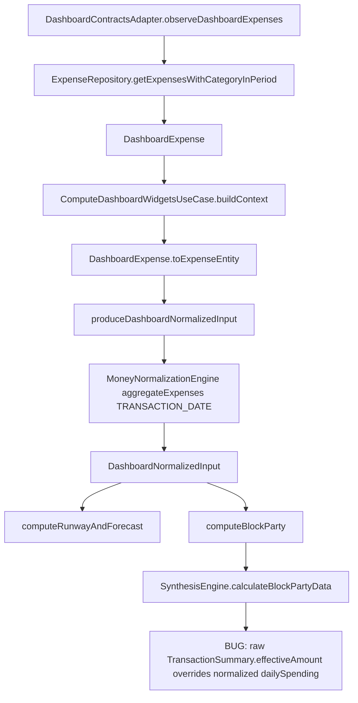

# Pipeline 5 — Currency / Dashboard / Analytics Master Implementation Plan

Repository: `https://github.com/panospao7/Cost-agregator`  
Pinned commit: `83b798e849b4408b2bf683f52cb2746d37f7af16`  
Pipeline: **P5 — Currency / Dashboard / Analytics**  
Build/test status: **NOT RUN**  
Reason: browser/API review environment only. Implementation agent must validate locally.

---

## 1. Executive summary

Current state: most old P5 tracker issues are fixed in source, but current code still has dashboard money-integrity regressions.

Production risk: **RED** until PR 1 is complete.

Main open risks:
1. `SynthesisEngine.calculateBlockPartyData()` still prefers raw `effectiveAmount` sums over normalized `dailySpending`.
2. Dashboard shared-expense deposit exclusion is only partially fixed because `DashboardExpense` does not carry `isSharedExpense`.
3. Runway status can report `NO_INCOME` despite valid budget-based runway.
4. `MoneyAggregateBuilder` count-mismatch handling prevents crash but still undercounts failed transactions.

Implementation strategy:
- Small PRs.
- No schema migration.
- Preserve Money/Currency legal path.
- Add regression tests and static guard for raw cross-currency summing.

Recommended verdict before implementation: **RED**.

---

## 2. Scope

### In scope

- Dashboard block-party actual-spend money math.
- Dashboard ownership/shared-expense propagation.
- Dashboard runway status correctness.
- MoneyAggregateBuilder count-mismatch hardening.
- Tests and architecture guards for P5 money legal path.
- P5 tracker/doc status updates.

### Out of scope

- Broad dashboard UI redesign.
- Budget basis work owned by P6 unless directly touched by P5 tests.
- Room schema migration.
- Currency provider/network implementation changes.
- Historical exchange-rate data backfill.

### Assumptions

- Commit must be verified locally with:

```bash
git rev-parse HEAD
```

Expected:

```text
83b798e849b4408b2bf683f52cb2746d37f7af16
```

- Architecture law is normative: Money/Currency totals must use `MoneyAggregate`, `MoneyNormalizationEngine`, or normalized input, not raw cross-currency `Double` sums. Legal path explicitly forbids `sumOf { effectiveAmount }` across currencies【turn1view0†L8-L8tions

Stop and report before coding if:
- checkout SHA differs;
- Gradle project cannot sync;
- `DashboardExpense` call sites use positional constructor arguments that would be broken by adding a field;
- another non-normalized caller of `calculateBlockPartyData()` exists;
- any proposed fix requires DB schema change.

---

## 3. Source/doc reconciliation

| Area / Issue | Pipeline doc claim | Master tracker claim | Source-code truth | Status | Evidence |
|---|---|---|---|---|---|
| P5-P1-01 Historical totals latest-rate | Fixed | Fixed | Historical period totals call `MultiCurrencyRepository` historical APIs. | FIXED | `TotalsAggregationEngine` documents monthly/yearly/weekly/daily/category historical APIs. |
| P5-P1-02 ExchangeRateDao ambiguity | Fixed | Fixed | Not re-audited in full. | NEEDS_RUNTIME_VERIFICATION | Run `rg -n "getLatestRateForPair|getRate" app/src/main/java app/src/test/java`. |
| P5-P1-03 Dashboard drops aggregate warnings | Fixed | Fixed | Dashboard widgets carry partial/currency quality fields. | FIXED_SOURCE_SUPPORTED | Dashboard widget models expose `isPartial`, `currencyQuality`, warnings. |
| P5-P1-04 Weekly/daily drilldown broken | Fixed | Fixed | Daily/weekly use historical APIs and propagate partial state. | FIXED_SOURCE_SUPPORTED | `getWeeklyTotals`, `getDailyTotals`, `getDailyTotalsForRange` use historical aggregates. |
| P5-P1-05 Dashboard widgets raw-sum effectiveAmount | Fixed | Fixed | Reopened: block-party still uses raw `effectiveAmount`. | OPEN | `SynthesisEngine` calculates `actualFromExpenses = expensesByDay[day]?.sumOf { it.effectiveAmount }` and prefers it over normalized history. |
| P5-P1-06 Stale-rate state not propagated | Fixed | Fixed | Analytics data quality carries stale/missing counts. | FIXED_SOURCE_SUPPORTED | `AnalyticsDataQuality` has `staleRateCount`, `missingRateCount`; assembler fills them. |
| P5-P1-07 MultiCurrencyRepository inconsistent builder use | Fixed | Fixed | Repository uses `MoneyNormalizationEngine` for historical APIs and builder for bucket APIs. | FIXED_SOURCE_SUPPORTED | Historical APIs call `normalizationEngine.aggregateExpenses`. |
| P5-P1-08 Budget basis | Partial / P6 | Tracker drift possible | Dashboard adapter says BudgetRepository handles normalized spend and period-end budget limit. | NEEDS_VERIFICATION / CROSS-P6 | Comment in adapter describes P6-period-end behavior. Verify BudgetRepository tests. |
| NEW-P5-001 previousMonthAggregate null | Fixed | Tracker stale | Dashboard input computes previous-month aggregate. | FIXED_SOURCE_SUPPORTED | `previousMonthAggregate` computed in `produceDashboardNormalizedInput`; adapter loads previous month. |
| NEW-P5-002 projectedTotal division by zero | Fixed | Tracker stale | Guard exists. | FIXED | `if (daysElapsed > 0) ... else monthAggregate.displayAmount`. |
| NEW-P5-003 deposit filter includes not-mine/shared | Open in stale doc | Mixed | DAO and normalizer filter shared deposits, but dashboard model loses `isSharedExpense`. | PARTIALLY_FIXED | Normalizer filters `!isSharedExpense`; `DashboardExpense` lacks field; adapter mapper omits it. |
| NEW-P5-004 day average denominator | Open in stale doc | Mixed | Fixed. | FIXED_SOURCE_SUPPORTED | Day average uses calendar days and purchase total; normalized average uses calendar days. |
| NEW-P5-005 planned expenses cross-currency | Fixed by universal | Fixed | Planned/recurring amounts convert to display currency. | FIXED_SOURCE_SUPPORTED | Synthesis converts planned/recurring using `displayCurrency` paths. |
| NEW-P5-006 homeCurrency Flow per call | Open in stale doc | Mixed | MultiCurrency cache exists. | FIXED_SOURCE_SUPPORTED | `cachedHomeCurrency` invalidated on settings flow and reused. |
| NEW-P5-007 NormalizedAnalyticsInput EUR default | Open in stale plan | Mixed | No hardcoded default in input; assembler resolves home currency. | FIXED | `homeCurrency` has no default; assembler calls settings. |
| NEW-P5-008 Category ALL_TYPES vs PURCHASE-only | Open in stale doc | Mixed | Fixed. | FIXED | Category breakdown explicitly uses purchase-only historical path; dashboard category aggregates use purchases only. |
| NEW-P5-009 MoneyAggregateBuilder count mismatch | Open | Open | Defensive warning exists but missing counts default to 0. | PARTIALLY_FIXED | Builder logs mismatch then uses `getOrElse(index) { 0 }`. |
| NEW-P5-010 per-expense average | Open in stale plan | Mixed | Fixed. | FIXED | `computeFromNormalized` divides by calendar days. |
| NEW-P5-011 FinancialRunway always zero | Fixed | Fixed | Days now computed, but status logic wrong when budget exists and income absent. | PARTIALLY_FIXED | Remaining/days computed, but status first checks `monthlyIncome == 0.0`. |
| NEW-P5-012 fixed stale threshold | Open | Open | Not reverified. | NEEDS_VERIFICATION | Run `rg -n "7.*day|STALE|stale" AnalyticsCurrencyNormalizer.kt app/src/main/java`. |
| NEW-P5-013 unknown bucket empty | Open | Open | Logs warning and returns empty aggregate; may still hide data quality. | PARTIALLY_FIXED | Unknown branch returns `MoneyAggregate.empty` after warning. |
| NEW-P5-014 trend timezone edge | Open | Open | Source comment says fixed with `ZonedDateTime`; tests still needed. | NEEDS_TEST_VERIFICATION | Dashboard trend comment references ZonedDateTime fix. |

---

## 4. Architecture contracts for this pipeline

| Contract | Required legal path | Current code | Gap | Fix required |
|---|---|---|---|---|
| Dashboard totals | Use normalized input / `MoneyAggregate.displayAmount`; propagate partial warnings. | Most widgets use `DashboardNormalizedInput`. | Block-party still overrides normalized `dailySpending` with raw `effectiveAmount`. | PR1: use `dailySpending` for actual money math only. |
| Currency conversion basis | Historical analytics use `TRANSACTION_DATE`; current snapshots may use explicit latest-rate APIs. | Historical APIs use `MoneyNormalizationEngine`. | No major gap for reviewed historical path. | Add guard to prevent raw sum regression. |
| Ownership filtering | Exclude not-mine; shared expenses use effective amount; shared repayments/deposits excluded from income. | DAO excludes shared deposits; dashboard normalized filter expects `isSharedExpense`. | `DashboardExpense` loses flag. | PR1: add/propagate `isSharedExpense`. |
| Analytics input | Build via `AnalyticsInputAssembler`; no raw self-fetching analytics path. | Assembler exists and filters spending/not-mine. | Metadata sets `isSharedExpense=false`; monetary effect likely OK but metadata inaccurate. | PR2 verification/fix. |
| DAO writes | P5 is read/compute; no planned DB writes. | N/A. | No direct DAO mutation needed. | No schema/write-barrier change. |
| Cancellation | Do not swallow `CancellationException`. | Some reviewed catch blocks rethrow. | Any changed catch must preserve rethrow. | Include in PR checklist. |
| Privacy | No raw PII diagnostics. | Planned changes add no PII logs. | Builder warning logs class/count only. | Keep logs count/type only. |

---

## 5. Current runtime flow



---

## 6. Implementation phases

### PR 1 — Critical dashboard money correctness

Goal:
- Remove raw cross-currency actual-spend sum from block-party.
- Propagate `isSharedExpense` into dashboard normalization.
- Fix runway `NO_INCOME` status when budget exists.

Risk: medium; user-visible dashboard behavior.

Files:
- `domain/logic/SynthesisEngine.kt`
- `domain/usecase/dashboard/ComputeDashboardWidgetsUseCase.kt`
- `domain/model/dashboard/DashboardPrimitives.kt`
- `data/repository/DashboardContractsAdapter.kt`
- dashboard/synthesis tests.

Work items:
- P5-DASH-001
- P5-DASH-002
- P5-DASH-003

Tests:
- Block-party normalized amount beats raw sum.
- Shared deposit excluded through full dashboard model path.
- Budget-only runway does not show `NO_INCOME`.

Acceptance:
- No raw `sumOf { it.effectiveAmount }` money math in block-party.
- Dashboard shared deposit excluded.
- Runway status matches computed budget runway.

### PR 2 — Analytics/aggregate metadata hardening

Goal:
- Prevent MoneyAggregate undercount on bucket/count mismatch.
- Verify/fix shared metadata in analytics normalized input.
- Make unknown bucket handling visibly partial or fail-fast in tests.

Risk: low/medium.

Files:
- `domain/core/money/MoneyAggregateBuilder.kt`
- `domain/analytics/AnalyticsInputAssembler.kt`
- `data/repository/MultiCurrencyRepository.kt`
- tests.

Work items:
- P5-MONEY-004
- P5-AN-005
- P5-MCR-006

Tests:
- Mismatched counts never report failed transaction count 0 for non-empty failed bucket.
- Analytics normalized shared expense metadata matches source if feasible.
- Unknown bucket path has explicit warning/partial behavior.

### PR 3 — Architecture guards and regression tests

Goal:
- Prevent future P5 raw money regressions.
- Add focused guard tests.

Files:
- `app/src/test/java/.../architecture/P5MoneyLegalPathGuardTest.kt`
- possibly existing architecture guard package.

Tests:
- Static source scan forbids `sumOf { it.effectiveAmount }` in dashboard/analytics money math, except explicit allowlist comments.
- Static scan ensures `DashboardExpense` carries `isSharedExpense`.

### PR 4 — Docs/tracker cleanup

Goal:
- Reconcile stale P5 docs with source and new fixes.

Files:
- `docs/analyses and debug master/PIPELINE_5_CONSOLIDATED_ISSUES.md`
- `docs/analyses and debug master/pipelines issues implementantion plan/PIPELINE_5_IMPLEMENTATION_PLAN.md`
- `docs/analyses and debug master/PIPELINE_ISSUES_MASTER_TRACKER.md`
- optional architecture guard docs.

---

## 7. Detailed work items

| ID | Severity | Title | Files | Implementation steps | Tests | Acceptance criteria |
|---|---|---|---|---|---|---|
| P5-DASH-001 | P1 | Block-party must use normalized daily spending for actual amounts | `SynthesisEngine.kt`, tests | In `calculateBlockPartyData()`, remove `actualFromExpenses` as money source. Set `actual = dailySpending.getOrNull(day - 1)?.toDouble()`. Keep `expensesByDay` only for top transaction display/sorting. Update comments that `expenses` is display-only. Run `rg "calculateBlockPartyData"` and adapt any caller lacking normalized `dailySpending`. | `SynthesisEngineBlockPartyTest.blockPartyActualUsesNormalizedDailySpendingNotRawEffectiveAmount` | With raw expenses summing 20 and normalized daily spending 19, `actualSpent == 19`. No raw effective sum remains. |
| P5-DASH-002 | P1 | Preserve shared-expense flag through dashboard path | `DashboardPrimitives.kt`, `DashboardContractsAdapter.kt`, `ComputeDashboardWidgetsUseCase.kt`, tests | Add `val isSharedExpense: Boolean = false` to `DashboardExpense`, preferably appended to avoid positional constructor break. Map `Expense.isSharedExpense` in `toDomainDashboard()`. Set `isSharedExpense` in `DashboardExpense.toExpenseEntity()`. Update `ctx.deposits` filter to `!isNotMine && !isSharedExpense`. Run `rg "DashboardExpense\\("` and fix all call sites. | `ComputeDashboardWidgetsUseCaseTest.sharedDepositExcludedAfterDashboardMapping`; adapter mapper test if feasible. | Shared deposit with `isSharedExpense=true` is absent from `depositAggregate`; normal income deposit remains included. |
| P5-DASH-003 | P2 | Runway status must not show NO_INCOME for budget-backed runway | `ComputeDashboardWidgetsUseCase.kt`, tests | Change `runwayStatus` branch order: only `NO_INCOME` when `ctx.totalBudgetAmount <= 0.0 && monthlyIncome <= 0.0`. If budget exists, classify by `runwayDays`. Consider `averageDailyBurn == 0 && totalRemaining > 0` as `HEALTHY` or keep existing critical behavior; document decision in test. | `ComputeDashboardWidgetsUseCaseTest.budgetOnlyRunwayDoesNotReturnNoIncome` | Budget > spend and no deposits returns HEALTHY/CAUTION/CRITICAL, not NO_INCOME. |
| P5-MONEY-004 | P2 | MoneyAggregateBuilder count mismatch must not undercount failed transactions as zero | `MoneyAggregateBuilder.kt`, tests | If `transactionCounts` is non-empty and size != buckets size, log privacy-safe error/warning. For missing bucket counts, use conservative `1` for non-zero bucket instead of `0`, or return a partial aggregate with explicit metadata. Do not throw in production unless all call sites prove safe. Update KDoc requiring equal-size counts. | `MoneyAggregateBuilderTest.countMismatchUsesNonZeroFallbackForFailedBucket`; `...logsMismatch` if logger capturable. | Failed conversion warning never says 0 transactions for a failed non-empty bucket. |
| P5-AN-005 | P2 | Analytics normalized input should preserve shared ownership metadata | `AnalyticsInputAssembler.kt`, maybe `ExpenseSnapshot` model/normalizer, tests | Verify whether `AnalyticsCurrencyNormalizer` can expose source `Expense.isSharedExpense`. If yes, set `NormalizedExpense.isSharedExpense` from source instead of `false`. If not, add minimal source metadata passthrough without changing DB. Keep monetary amount as normalized effective amount. | `AnalyticsInputAssemblerTest.sharedExpenseMetadataPreserved` | `NormalizedExpense.isSharedExpense` matches source expense; no money total regression. |
| P5-MCR-006 | P3 | Unknown aggregate bucket should be visible data-quality issue | `MultiCurrencyRepository.kt`, tests | For `aggregateCurrencyTotalsToMoneyAggregate` unknown branch, avoid silent empty success. Prefer constructing `MoneyAggregate` with `isPartial=true` and warning message, or throw `IllegalArgumentException` if branch is unreachable by public API. Pick behavior based on existing tests. | `MultiCurrencyRepositoryTest.unknownBucketTypeIsVisible` | Unexpected bucket type cannot appear as clean zero total. |
| P5-GUARD-007 | P1 | Add guard against raw cross-currency dashboard sums | architecture test file | Add static test scanning P5 files for `sumOf { it.effectiveAmount }`, `sumOf { expense.effectiveAmount }`, and raw `total += effectiveAmount` in dashboard/analytics/synthesis code unless allowlisted with `G-MONEY-ALLOW` and reason. | `P5MoneyLegalPathGuardTest` | Guard fails on the current `SynthesisEngine` pattern and passes after PR1. |
| P5-DOC-008 | P3 | Update stale P5 tracker statuses | docs | Mark stale file names (`DashboardSynthesisEngine.kt`, `AnalyticsComputeEngine.kt`, `TrendBuilder.kt`) as tracker/code drift; record actual classes. Add fixed/new statuses. | docs review only | Future planners do not chase nonexistent classes. |

---

## 8. File-by-file change plan

| File | Change type | Exact changes | Risk | Tests covering it |
|---|---|---|---|---|
| `app/src/main/java/com/yourname/expensetracker/domain/logic/SynthesisEngine.kt` | MODIFY | In `calculateBlockPartyData`, use `dailySpending` for actual money amount; keep expenses only for top transaction list. Remove misleading comment saying caller-normalized expenses are safe if those expenses are actually raw summaries. | Medium | `SynthesisEngineBlockPartyTest` |
| `app/src/main/java/com/yourname/expensetracker/domain/usecase/dashboard/ComputeDashboardWidgetsUseCase.kt` | MODIFY | Map `isSharedExpense` in `toExpenseEntity`; update deposit filter; fix runway status branch. | Medium | dashboard use-case tests |
| `app/src/main/java/com/yourname/expensetracker/domain/model/dashboard/DashboardPrimitives.kt` | MODIFY | Add `isSharedExpense: Boolean = false` to `DashboardExpense`; update KDoc. Prefer append-only field. | Low/medium | compile + dashboard mapper tests |
| `app/src/main/java/com/yourname/expensetracker/data/repository/DashboardContractsAdapter.kt` | MODIFY | Add `isSharedExpense = isSharedExpense` in `Expense.toDomainDashboard()`. | Low | adapter/dashboard integration test |
| `app/src/main/java/com/yourname/expensetracker/domain/core/money/MoneyAggregateBuilder.kt` | MODIFY | Harden count mismatch fallback and KDoc. | Low | builder tests |
| `app/src/main/java/com/yourname/expensetracker/domain/analytics/AnalyticsInputAssembler.kt` | MODIFY | Preserve shared metadata if source is available. If blocked by `ExpenseSnapshot`, add TODO + test skip only after reporting. | Low | assembler tests |
| `app/src/main/java/com/yourname/expensetracker/data/repository/MultiCurrencyRepository.kt` | MODIFY | Make unknown bucket handling visibly partial/failing instead of clean empty success. | Low | repository unit test |
| `app/src/test/java/.../SynthesisEngineBlockPartyTest.kt` | ADD_TEST / UPDATE_TEST | Add normalized-vs-raw regression. | Low | itself |
| `app/src/test/java/.../ComputeDashboardWidgetsUseCaseTest.kt` | ADD_TEST / UPDATE_TEST | Add shared deposit and runway tests. | Low | itself |
| `app/src/test/java/.../MoneyAggregateBuilderTest.kt` | ADD_TEST / UPDATE_TEST | Add mismatch-count tests. | Low | itself |
| `app/src/test/java/.../AnalyticsInputAssemblerTest.kt` | ADD_TEST / UPDATE_TEST | Add shared metadata preservation test. | Low | itself |
| `app/src/test/java/.../architecture/P5MoneyLegalPathGuardTest.kt` | ADD_GUARD | Static scan for forbidden raw sums. | Medium if paths differ | architecture test |
| P5 docs | UPDATE_DOC | Reconcile statuses and code drift. | Low | docs review |

---

## 9. Database / schema / migration plan

No schema migration required.

| Change | Entity/DAO | Migration required? | Schema export required? | Backfill required? | Tests |
|---|---|---:|---:|---:|---|
| Add `DashboardExpense.isSharedExpense` domain field | Domain model only | No | No | No | compile + dashboard tests |
| Propagate existing `Expense.isSharedExpense` | Existing entity field | No | No | No | dashboard tests |
| Money builder warning/count behavior | None | No | No | No | unit tests |

---

## 10. Test plan

### Existing tests to run

```bash
./gradlew :app:testDebugUnitTest --stacktrace
./gradlew :app:assembleDebug --stacktrace
```

### Focused tests

```bash
./gradlew :app:testDebugUnitTest --tests "*SynthesisEngine*" --stacktrace
./gradlew :app:testDebugUnitTest --tests "*Dashboard*" --stacktrace
./gradlew :app:testDebugUnitTest --tests "*MoneyAggregateBuilder*" --stacktrace
./gradlew :app:testDebugUnitTest --tests "*AnalyticsInputAssembler*" --stacktrace
./gradlew :app:testDebugUnitTest --tests "*P5MoneyLegalPathGuard*" --stacktrace
```

### New tests to add

| Test file | Test name | Behavior covered |
|---|---|---|
| `SynthesisEngineBlockPartyTest.kt` | `blockPartyActualUsesNormalizedDailySpendingNotRawEffectiveAmount` | Raw multi-currency sum cannot override normalized daily amount. |
| `ComputeDashboardWidgetsUseCaseTest.kt` | `sharedExpenseDepositIsExcludedFromDepositAggregateAfterDashboardMapping` | Dashboard model preserves shared flag and excludes shared repayment from income. |
| `ComputeDashboardWidgetsUseCaseTest.kt` | `budgetBackedRunwayDoesNotReturnNoIncomeWhenIncomeMissing` | Budget-only runway status classification. |
| `MoneyAggregateBuilderTest.kt` | `countMismatchDoesNotReportZeroFailedTransactionsForFailedNonEmptyBucket` | Builder mismatch fallback. |
| `AnalyticsInputAssemblerTest.kt` | `sharedExpenseMetadataIsPreservedInNormalizedInput` | Shared ownership metadata. |
| `P5MoneyLegalPathGuardTest.kt` | `dashboardAndAnalyticsDoNotRawSumEffectiveAmountForMoneyMath` | Architecture guard. |

### Architecture guard tests

| Guard | Expected rule |
|---|---|
| Raw effective sum guard | `SynthesisEngine`, dashboard, and analytics cannot use `sumOf { it.effectiveAmount }` for financial totals. |
| Dashboard ownership guard | `DashboardExpense` must contain `isSharedExpense`; adapter must map it from `Expense`. |
| Normalized block-party guard | `calculateBlockPartyData` actual amount must come from `dailySpending`. |

---

## 11. Validation commands

```bash
git rev-parse HEAD
git status --short
rg -n "calculateBlockPartyData|sumOf \\{ it\\.effectiveAmount \\}|sumOf \\{ expense\\.effectiveAmount \\}" app/src/main/java app/src/test/java
rg -n "DashboardExpense\\(|isSharedExpense|toExpenseEntity|toDomainDashboard" app/src/main/java app/src/test/java
./gradlew :app:testDebugUnitTest --tests "*SynthesisEngine*" --stacktrace
./gradlew :app:testDebugUnitTest --tests "*Dashboard*" --stacktrace
./gradlew :app:testDebugUnitTest --tests "*MoneyAggregateBuilder*" --stacktrace
./gradlew :app:testDebugUnitTest --tests "*AnalyticsInputAssembler*" --stacktrace
./gradlew :app:testDebugUnitTest --tests "*P5MoneyLegalPathGuard*" --stacktrace
./gradlew :app:testDebugUnitTest --stacktrace
./gradlew :app:assembleDebug --stacktrace
```

If architecture tests are under a separate task, also run:

```bash
./gradlew :app:check --stacktrace
```

Instrumentation tests are not required unless existing dashboard tests depend on Android framework fakes. If needed:

```bash
./gradlew connectedDebugAndroidTest
```

---

## 12. Documentation updates

| Doc | Required update | Reason |
|---|---|---|
| `PIPELINE_5_CONSOLIDATED_ISSUES.md` | Mark old stale open items as fixed/partial/open based on this plan. Add P5-DASH-001/002/003. | Current issue doc conflicts with source. |
| `PIPELINE_5_IMPLEMENTATION_PLAN.md` | Replace stale file names with actual files: `SynthesisEngine.kt`, `ComputeDashboardWidgetsUseCase.kt`, `DashboardPrimitives.kt`, `DashboardContractsAdapter.kt`, `TotalsAggregationEngine.kt`. | Avoid coding against nonexistent `DashboardSynthesisEngine.kt`, `AnalyticsComputeEngine.kt`, `TrendBuilder.kt`. |
| `PIPELINE_ISSUES_MASTER_TRACKER.md` | Downgrade P5 from green to red/yellow until PR1 done; then update. | Release gating accuracy. |
| Architecture guard docs | Add P5 money guard summary if guard added. | Prevent regression. |

---

## 13. Risk and rollback plan

| Risk | Probability | Impact | Mitigation | Rollback |
|---|---:|---:|---|---|
| Adding field to `DashboardExpense` breaks positional constructor calls | Medium | Medium | Append field with default; run `rg "DashboardExpense\\("`; compile. | Revert field and use separate metadata wrapper only if necessary. |
| Block-party status changes for zero-spend days | Medium | Low/Medium | Add tests for zero-spend historical day and future day. | Restore prior status logic while keeping normalized amount source. |
| Runway status expectation ambiguous when budget exists but no burn | Medium | Low | Decide and document in test. | Revert only status branch, not money math. |
| MoneyAggregateBuilder fallback from 0 to 1 changes warning counts | Low | Low | Only for invalid caller mismatch; add KDoc and test. | Revert fallback but keep warning if needed. |
| Static guard false positives | Medium | Low | Allow explicit `G-MONEY-ALLOW[...]` comments for display-only non-total use. | Narrow guard path/pattern. |

---

## 14. Pipeline-specific checklist

### Entry points

- UI/ViewModel entry points: dashboard widgets using `ComputeDashboardWidgetsUseCase`.
- Worker entry points: none for planned fixes.
- Repository entry points: `DashboardContractsAdapter`, `MultiCurrencyRepository`, analytics repositories.
- Coordinator/service entry points: `AnalyticsInputAssembler`, `SynthesisEngine`, `TotalsAggregationEngine`.
- Import/external source entry points: expenses created by other pipelines enter via `ExpenseRepository`/`ExpenseDao` read paths.

### Core owner

- Legal lifecycle owner: no mutation lifecycle in P5.
- Direct collaborators: `ExpenseRepository`, `CurrencySettingsRepository`, `CurrencyConverter`, `MoneyNormalizationEngine`.
- Event writer: none for read-only P5 compute changes.
- DAO owner: reads through repositories/DAO; no writes.
- Side-effect dispatcher/planner: none.

### Persistence

- Entities: `Expense`, exchange-rate/settings entities indirectly.
- DAOs: `ExpenseDao`, exchange-rate/settings DAOs indirectly.
- Migrations: none.
- Schema version: unchanged.
- Indexes/constraints: unchanged.

### Audit / diagnostics

- Lifecycle event table/entity: not touched.
- Diagnostic event table/entity: not touched.
- Required terminal events: none; read-only computations.
- Missing event cases: none for planned changes.

### Barriers

- Write barrier locations: no writes.
- Read barrier locations: no new reads outside existing repository paths.
- Maintenance/debug exceptions: none.
- Blocked-write behavior: unchanged.

### Tests

- Existing unit tests: must discover with `find app/src/test/java -type f | sort`.
- Existing contract tests: discover with `rg -n "Money|Dashboard|Analytics|Architecture|Guard" app/src/test`.
- Existing androidTest tests: discover with `find app/src/androidTest/java -type f | sort`.
- Missing tests: listed in section 10.

---

## 15. Direct DAO mutation inventory

P5 planned changes do **not** write to Room. No DAO mutation should be added.

| DAO method | SQL mutation? | Caller(s) | Legal owner? | Barrier? | Audit event? | Classification | Fix |
|---|---:|---|---|---|---|---|---|
| `ExpenseDao.getExpensesBetweenUncapped` | No | analytics/currency/dashboard repository paths | N/A | Read only | N/A | LEGAL | None |
| `ExpenseDao.getDepositTotalsBetweenByCurrency` | No | `MultiCurrencyRepository.getHomeCurrencyDepositTotal` | N/A | Read only | N/A | LEGAL | None |
| `ExpenseDao.getCategoryTotalsBetweenByCurrency` | No | analytics/currency | N/A | Read only | N/A | LEGAL | None |
| `ExpenseDao.insert/update/delete/...` | Yes | not part of P5 plan | TransactionLifecycleCoordinator required | Existing contract | Existing contract | NO_CHANGE_READ_ONLY | Do not touch |

Verification command:

```bash
rg -n "insert\\(|insertAll\\(|update\\(|delete\\(|@Query\\(\"UPDATE|@Query\\(\"DELETE|@Query\\(\"INSERT" app/src/main/java/com/yourname/expensetracker/domain/analytics app/src/main/java/com/yourname/expensetracker/domain/usecase/dashboard app/src/main/java/com/yourname/expensetracker/domain/logic app/src/main/java/com/yourname/expensetracker/data/repository/MultiCurrencyRepository.kt
```

Expected: no new production mutations introduced by P5 fixes.

---

## 16. Cross-pipeline impact

| Fix ID | Affected pipeline(s) | Why affected | Extra tests needed |
|---|---|---|---|
| P5-DASH-001 | P4 recurring/planned, P6 budget | Block-party includes recurring/planned forecast data and budget limits. | Existing synthesis/forecast tests. |
| P5-DASH-002 | P2 transaction lifecycle, P3 receipt, P10/P11/P12 imports, group/shared expense flows | All sources can create shared/not-mine expenses; dashboard must preserve ownership flags. | Shared expense created from repository/entity mapper test. |
| P5-DASH-003 | P6 budget | Budget-backed runway uses budget status. | Budget dashboard/runway tests. |
| P5-MONEY-004 | P8/P9/P18 if present, investment/tax/subscription features | Shared MoneyAggregateBuilder used outside P5. | Full `*MoneyAggregate*` tests; spot tests for subscription/investment if existing. |
| P5-AN-005 | P9 analytics/reports, export | Normalized analytics metadata may feed reports. | Analytics assembler/engine tests. |
| P5-GUARD-007 | All money features | Static guard may catch non-P5 raw sums. | Scope guard to P5 first, then expand only intentionally. |

---

## 17. Special implementation constraints

The coding agent must:

- Do not make broad style-only changes.
- Do not rename public APIs unless required.
- Do not change DB schema.
- Do not update generated schema files.
- Do not weaken architecture tests.
- Do not remove tests to pass build.
- Do not suppress warnings without explaining why.
- Do not swallow `CancellationException`.
- Do not add network or long-running I/O inside Room transactions.
- Do not add raw PII to logs, diagnostics, events, or analytics.
- Do not run side effects before DB commit.
- Do not bypass coordinators for convenience.
- Do not use raw `Double` totals across currencies in public dashboard/analytics outputs.
- Do not add latest-rate fallback to transaction-date historical totals.

---

## 18. If build/tests cannot run

Build/test status: **NOT RUN**

Reason:
- Current plan was produced from static browser/API source review.

Static review completed:
- yes, for key P5 dashboard/currency/analytics files.
- no, for full local `find`/`rg` inventory and complete test suite.

Commands that must be run by implementation agent:
- all commands in section 11.

NEEDS_VERIFICATION:
1. `rg -n "calculateBlockPartyData"`  
   Expected: only normalized dashboard caller or tests.  
   Decision: if extra callers exist, adapt them or stop.
2. `rg -n "DashboardExpense\\("`  
   Expected: call sites can tolerate appended default field.  
   Decision: whether model change is safe.
3. `rg -n "7.*day|STALE|stale" app/src/main/java/com/yourname/expensetracker/domain/analytics/AnalyticsCurrencyNormalizer.kt`  
   Expected: confirm stale threshold status.  
   Decision: PR2/PR3 scope.
4. `find app/src/test/java -type f | sort`  
   Expected: identify actual test package names before adding tests.  
   Decision: update test file paths.

---

## 19. Final acceptance criteria

Implementation is complete only when:

- [ ] Pinned commit/branch verified.
- [ ] All affected source files inspected.
- [ ] Pipeline docs reconciled with source.
- [ ] Master tracker reconciled with source.
- [ ] Legal path verified.
- [ ] No illegal direct DAO writes remain.
- [ ] Restore/write barrier contract preserved.
- [ ] Lifecycle/audit events preserved where applicable.
- [ ] Side effects remain absent/post-commit only.
- [ ] Privacy-sensitive diagnostics are safe.
- [ ] Block-party actual money math uses normalized daily spending.
- [ ] Dashboard shared-expense deposit exclusion works through model mapping.
- [ ] Runway status does not falsely show `NO_INCOME` when budget-backed.
- [ ] MoneyAggregateBuilder mismatch does not undercount failed non-empty buckets as zero.
- [ ] Existing tests pass.
- [ ] New tests pass.
- [ ] Architecture guards pass.
- [ ] Docs/tracker updated.
- [ ] Remaining known risks documented.

---

## 20. Handoff instructions for coding agent

1. Run:

```bash
git rev-parse HEAD
git status --short
```

2. If SHA is not `83b798e849b4408b2bf683f52cb2746d37f7af16`, stop.

3. Implement **PR 1 only**:
   - P5-DASH-001
   - P5-DASH-002
   - P5-DASH-003

4. Run focused tests:

```bash
./gradlew :app:testDebugUnitTest --tests "*SynthesisEngine*" --stacktrace
./gradlew :app:testDebugUnitTest --tests "*Dashboard*" --stacktrace
```

5. Add PR 3 guard only after PR 1 tests prove behavior.

6. Commit PR 1 separately.

7. Implement PR 2 only after PR 1 is green.

8. Do not combine unrelated cleanup with correctness fixes.

9. Report unexpected code/doc drift before modifying additional files.

10. Final run:

```bash
./gradlew :app:testDebugUnitTest --stacktrace
./gradlew :app:assembleDebug --stacktrace
./gradlew :app:check --stacktrace
```