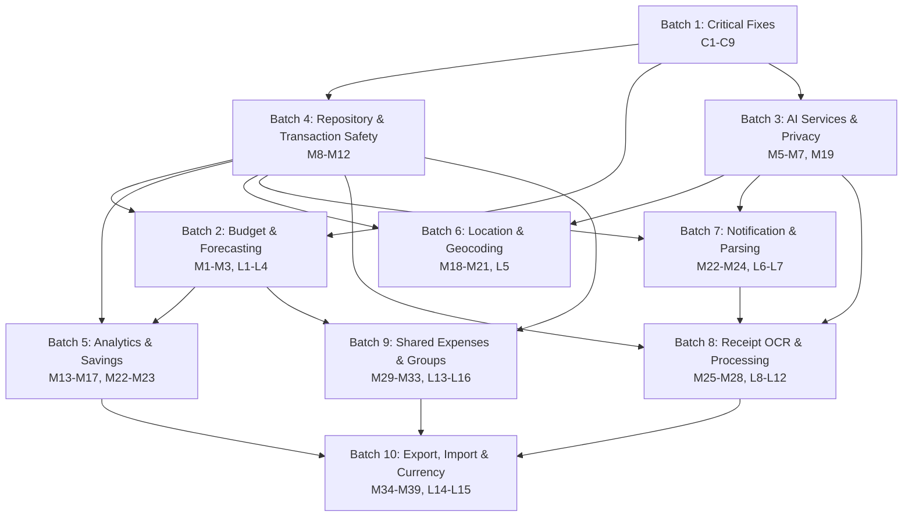

# MASTER REMEDIATION PLAN

## Executive Summary
This master plan consolidates execution across 10 remediation batches, using the already-detailed Batches 1–5 and introducing implementation-ready outlines for Batches 6–10.

Primary goals:
- Stabilize correctness and safety first (critical fixes + repository transaction safety).
- Enable domain logic and privacy controls before advanced ingestion and collaboration features.
- Execute independent domains in parallel to reduce total delivery time.
- Preserve rollback safety through feature flags, migration discipline, and staged rollout gates.

Planning assumptions:
- Team operates with **3 specialist streams** in parallel (Core Finance, AI/Ingestion, Platform/Integrations).
- Estimates are in **engineering weeks** and include coding + test hardening.
- Existing detailed plans for Batches 1–5 are authoritative; this document orchestrates them.

Open issues to resolve before execution lock:
- **Issue overlap:** `M22` appears in both Batch 5 and Batch 7.
- **Issue overlap:** `L14-L15` appear in both Batch 9 and Batch 10.
- These must be de-duplicated into single owning batches with explicit cross-batch dependencies.

---

## Dependency Graph

### Batch-level dependency map (Mermaid)

### Critical path
**B1 → B4 → B3 → B7 → B8 → B10**

Rationale: This path traverses the highest coupling chain across safety, privacy-aware parsing, ingestion pipeline maturity, and final portability/currency correctness.

### Parallelizable groups
- After B1+B4, **B2 and B3** can run in parallel.
- After B2/B3, **B5, B6, B7** can run largely in parallel (with API contract checkpoints).
- **B8 and B9** can run in parallel once shared prerequisites are complete.

---

## Execution Phases & Waves

## Phase 0 — Program Setup & Control Gates (0.5 week)
Purpose: Align ownership, resolve overlaps (`M22`, `L14-L15`), and define freeze gates.

Parallel streams:
- Stream A: Finalize issue-to-batch ownership map.
- Stream B: Define integration contract tests and release toggles.
- Stream C: Baseline performance and data-quality metrics.

Exit gate:
- Signed dependency matrix + approved rollback playbook.

---

## Phase 1 — Core Stability Foundations (2.5–3 weeks)

### Wave 1 (1–1.5 weeks)
- **Batch 1** (`C1-C9`)
- Objective: Remove correctness blockers and high-severity defects.

### Wave 2 (1–1.5 weeks)
- **Batch 4** (`M8-M12`)
- Objective: Enforce repository consistency, idempotency, and transaction safety.

Parallelization notes:
- Low parallelism intentionally; changes are foundational and high collision risk.

Exit gate:
- No P0/P1 regressions in core transaction flows.

---

## Phase 2 — Business Logic + Privacy Core (2 weeks)

### Wave 3 (2 weeks, parallel)
- **Stream A:** Batch 2 (`M1-M3`, `L1-L4`) — Budget/forecasting correctness
- **Stream B:** Batch 3 (`M5-M7`, `M19`) — AI services hardening + privacy controls

Exit gate:
- Forecast outputs pass reconciliation tolerance.
- Privacy policy checks pass for all AI-bound data paths.

---

## Phase 3 — Insight, Location, and Eventing Layer (2–2.5 weeks)

### Wave 4 (1.5 weeks, parallel)
- **Batch 5** (`M13-M17`, `M22-M23`) — Analytics/savings
- **Batch 6** (`M18-M21`, `L5`) — Location/geocoding
- **Batch 7** (`M22-M24`, `L6-L7`) — Notifications/parsing

### Wave 5 (0.5–1 week)
- Integration hardening for analytics-event-location joins.
- Resolve ownership/integration for `M22` once de-duplicated.

Exit gate:
- Event-driven flows meet reliability SLO (delivery + parsing success).
- Geocoding and analytics pipelines pass privacy + latency thresholds.

---

## Phase 4 — Intake & Collaboration Expansion (3 weeks)

### Wave 6 (2 weeks, parallel)
- **Stream A:** Batch 8 (`M25-M28`, `L8-L12`) — OCR & receipt processing
- **Stream B:** Batch 9 (`M29-M33`, `L13-L16`) — Shared expenses/groups

### Wave 7 (1 week)
- Cross-domain integration: receipt-to-shared-expense and shared settlement validation.

Exit gate:
- OCR pipeline accuracy and fallback handling accepted.
- Group expense settlement consistency validated under concurrency.

---

## Phase 5 — Portability, Currency, and Release Hardening (2 weeks)

### Wave 8 (1.5 weeks)
- **Batch 10** (`M34-M39`, `L14-L15`) — Export/import/currency

### Wave 9 (0.5 week)
- End-to-end hardening, data migration rehearsal, release candidate signoff.

Exit gate:
- Round-trip import/export integrity and multi-currency reconciliation approved.

---

## Parallel Execution Waves (Consolidated)

| Wave | Duration | Parallel Work | Issues/Batches |
|---|---:|---|---|
| Wave 1 | 1–1.5 w | Single stream (stability) | B1 (C1-C9) |
| Wave 2 | 1–1.5 w | Single stream (data safety) | B4 (M8-M12) |
| Wave 3 | 2 w | 2 streams | B2 (M1-M3,L1-L4) + B3 (M5-M7,M19) |
| Wave 4 | 1.5 w | 3 streams | B5 (M13-M17,M22-M23) + B6 (M18-M21,L5) + B7 (M22-M24,L6-L7) |
| Wave 5 | 0.5–1 w | Integration stream | Cross-batch reconciliation (incl. M22 ownership) |
| Wave 6 | 2 w | 2 streams | B8 (M25-M28,L8-L12) + B9 (M29-M33,L13-L16) |
| Wave 7 | 1 w | Integration stream | B8↔B9 interaction hardening |
| Wave 8 | 1.5 w | Single stream | B10 (M34-M39,L14-L15) |
| Wave 9 | 0.5 w | Release stream | Final regression, migration drill, signoff |

Estimated total elapsed time (with parallel streams): **~14–16 weeks**.

---

## Detailed Batch Summaries (with links)

> Note: Links for Batches 1–5 should point to the approved detailed plans already produced. Placeholder filenames below can be updated if naming differs.

1. **Batch 1 — Critical Fixes** (`C1-C9`)  
   Link: `docs/plans/BATCH_1_CRITICAL_FIXES.md`  
   Role: Correctness stabilization; prerequisite for most downstream work.

2. **Batch 2 — Budget & Forecasting Logic** (`M1-M3`, `L1-L4`)  
   Link: `docs/plans/BATCH_2_BUDGET_FORECASTING.md`  
   Role: Financial logic integrity; required by analytics and group settlement.

3. **Batch 3 — AI Services & Privacy** (`M5-M7`, `M19`)  
   Link: `docs/plans/BATCH_3_AI_PRIVACY.md`  
   Role: AI interaction safety and privacy controls; prerequisite for parsing/OCR.

4. **Batch 4 — Repository & Transaction Safety** (`M8-M12`)  
   Link: `docs/plans/BATCH_4_REPOSITORY_TRANSACTION_SAFETY.md`  
   Role: Data consistency and idempotency; prerequisite for shared/currency/import paths.

5. **Batch 5 — Analytics & Savings Engines** (`M13-M17`, `M22-M23`)  
   Link: `docs/plans/BATCH_5_ANALYTICS_SAVINGS.md`  
   Role: Insight layer and savings computation.

6. **Batch 6 — Location & Geocoding** (`M18-M21`, `L5`)  
   Link: `docs/plans/BATCH_6_LOCATION_GEOCODING.md`  
   Objective: Normalize location entities, geocoding retries/cache, and privacy-safe location handling.  
   Risks: Third-party API failure/rate limits, PII leakage via coordinates.  
   Validation: Contract tests for geocoder adapters; fallback and redaction tests.

7. **Batch 7 — Notification & Parsing** (`M22-M24`, `L6-L7`)  
   Link: `docs/plans/BATCH_7_NOTIFICATION_PARSING.md`  
   Objective: Reliable event delivery, parsing robustness, dedupe/idempotency.  
   Risks: Duplicate events, ordering issues, parser false positives.  
   Validation: Replay tests, poison-message handling, idempotency checks.

8. **Batch 8 — Receipt OCR & Processing** (`M25-M28`, `L8-L12`)  
   Link: `docs/plans/BATCH_8_RECEIPT_OCR_PROCESSING.md`  
   Objective: OCR ingestion pipeline, extraction normalization, confidence/fallback workflows.  
   Risks: Accuracy variance, model drift, malformed receipts, latency spikes.  
   Validation: Golden dataset accuracy benchmarks; low-confidence manual-review path tests.

9. **Batch 9 — Shared Expenses & Groups** (`M29-M33`, `L13-L16`)  
   Link: `docs/plans/BATCH_9_SHARED_EXPENSES_GROUPS.md`  
   Objective: Group lifecycle, membership roles, split/settlement correctness under concurrency.  
   Risks: Settlement race conditions, authorization gaps, invariant violations.  
   Validation: Concurrency simulations, permission matrix tests, settlement reconciliation.

10. **Batch 10 — Export, Import & Currency** (`M34-M39`, `L14-L15`)  
    Link: `docs/plans/BATCH_10_EXPORT_IMPORT_CURRENCY.md`  
    Objective: Versioned export/import and deterministic multi-currency conversions.  
    Risks: Data loss on import, FX rounding discrepancies, schema drift.  
    Validation: Round-trip data fidelity tests; historical FX replay; backwards compatibility tests.

---

## Risk Matrix

| Risk | Impact | Likelihood | Affected Batches | Mitigation | Rollback Trigger |
|---|---|---|---|---|---|
| Transaction/data integrity regression | High | Medium | 1,4,9,10 | Expand-contract migrations, invariant checks, canary rollout | Reconciliation mismatch > threshold |
| Privacy/compliance leak (AI, location, OCR) | High | Medium | 3,6,8 | Data minimization, redaction middleware, audit logging | Sensitive field exposure in logs/events |
| Duplicate/ordered event failures | Medium-High | Medium | 7,8 | Idempotency keys, dead-letter queues, replay-safe consumers | Error budget burn or duplicate processing spikes |
| Forecast/currency calculation drift | High | Medium | 2,10 | Golden tests, deterministic rounding policies, reconciliation jobs | Financial delta beyond tolerance |
| OCR quality below usability threshold | Medium | Medium-High | 8 | Confidence scoring + human fallback, provider A/B strategy | Extraction accuracy below target |
| Cross-batch schema incompatibility | High | Medium | 5,8,9,10 | Versioned contracts, integration gates per wave | Contract test failures in staging |

---

## Verification Plan

### Per-batch validation model
- **Batch 1:** Regression suite on core transaction paths; defect reproduction tests.
- **Batch 2:** Deterministic financial fixtures + tolerance-based forecast validations.
- **Batch 3:** Privacy test suite (PII path tracing), AI service fault-injection tests.
- **Batch 4:** Transaction atomicity/idempotency tests, race-condition integration tests.
- **Batch 5:** Analytics consistency checks vs known baselines.
- **Batch 6:** Geocoder contract, retry/backoff, and caching behavior tests.
- **Batch 7:** Notification delivery SLO tests, parser robustness with noisy inputs.
- **Batch 8:** OCR benchmark suite (precision/recall), fallback/manual review workflow tests.
- **Batch 9:** Group permissions and settlement invariants under concurrent updates.
- **Batch 10:** Import/export round-trip equivalence, FX conversion determinism, schema version compatibility.

### Integration testing strategy
1. **Wave-end integration gates:** Execute contract + end-to-end scenario tests after each wave.
2. **Synthetic production scenarios:** Replay anonymized events/receipts/groups in staging.
3. **Migration rehearsal:** Full backup-restore and migration dry-run before Phase 5 completion.
4. **Performance baselines:** Compare latency/throughput/error rates to pre-remediation baseline.

### Release acceptance criteria
- Zero open P0/P1 defects.
- No privacy policy violations in automated audits.
- Financial reconciliations within approved tolerances.
- End-to-end import/export round-trip lossless for supported schema versions.

---

## Rollback Strategy

1. **Feature flag containment**
   - Every batch ships behind scoped flags.
   - Disable batch-level features independently without full rollback.

2. **Data safety controls**
   - Pre-migration snapshots and tested restore scripts.
   - Expand-contract schema evolution; avoid destructive migrations until post-validation.

3. **Event pipeline rollback**
   - Queue isolation by version.
   - Consumer rollback to previous stable version with replay support.

4. **External provider failover**
   - OCR/geocoder/provider fallback or graceful degradation modes.
   - Hard timeout + circuit breakers to prevent cascading failures.

5. **Operational rollback criteria**
   - Trigger rollback if any of: error budget breach, reconciliation failures, privacy alert, or sustained SLA degradation.

---

## Acceptance Criteria

- [ ] Issue ownership conflicts resolved (`M22`, `L14-L15`) and dependency map finalized.
- [ ] Batches 1–4 completed with transaction and privacy gates passing.
- [ ] Batches 5–7 released with stable analytics/location/notification integrations.
- [ ] Batches 8–9 validated with OCR accuracy and shared-expense settlement correctness.
- [ ] Batch 10 passes import/export fidelity and currency reconciliation requirements.
- [ ] Full-system regression, migration rehearsal, and rollback drills completed.
- [ ] Production rollout completed using staged canary with no P0/P1 regressions.
## Batch Plan Index
- BATCH_6_LOCATION_GEOCODING.md
- BATCH_7_NOTIFICATION_PARSING.md
- BATCH_8_RECEIPT_OCR_PROCESSING.md
- BATCH_9_SHARED_EXPENSES_GROUPS.md
- BATCH_10_EXPORT_IMPORT_CURRENCY.md

## Overlap Conflicts & Renames
- M22 conflict: Batch 5 (savings) vs Batch 7 (parsing).
  - Batch 5 M22 renamed to: M22a — Batch 5: roundUpTo validation.
  - Batch 7 M22 renamed to: M22b — Batch 7: GoogleWalletParser INR support.
- L14-L15 ownership: Clarified which batch owns which line items and responsibilities.
- Update the dependency graph: Reflect new batch plan links and clarified ownership.

## Updated Dependency Graph (high level)
- Geocoding: Batch 6 -> depends on external geocoding provider; feeds into Batch 9 and Batch 10 where location data is used for grouping and reporting.
- Notification Parsing: Batch 7 -> depends on currency utilities for INR normalization; feeds into Batch 9 for grouping and Batch 10 for financial reconciliation.
- Receipt OCR: Batch 8 -> consumes OCR outputs to enrich expenses used downstream in report and reconciliation paths (Batch 9/10).
- Shared Expenses Groups: Batch 9 -> depends on user/permissions, ledger and reporting.
- Currency Export/Import: Batch 10 -> depends on currency service, export/import modules, and reconciliation.

## Ownership Clarifications for L14-L15
- L14: Batch 9 Owner: Shared Expenses Groups team.
- L15: Batch 10 Owner: Export/Import Currency team.

## New Batch Plan Links
- Batch 6 location geocoding: docs/plans/BATCH_6_LOCATION_GEOCODING.md
- Batch 7 notification parsing: docs/plans/BATCH_7_NOTIFICATION_PARSING.md
- Batch 8 receipt OCR processing: docs/plans/BATCH_8_RECEIPT_OCR_PROCESSING.md
- Batch 9 shared expenses groups: docs/plans/BATCH_9_SHARED_EXPENSES_GROUPS.md
- Batch 10 export/import currency: docs/plans/BATCH_10_EXPORT_IMPORT_CURRENCY.md
